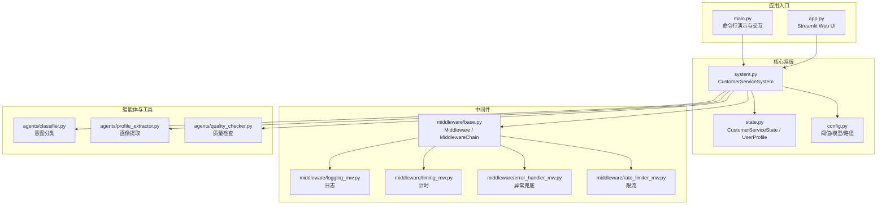
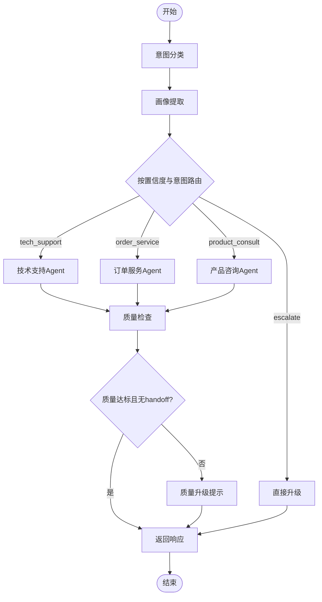
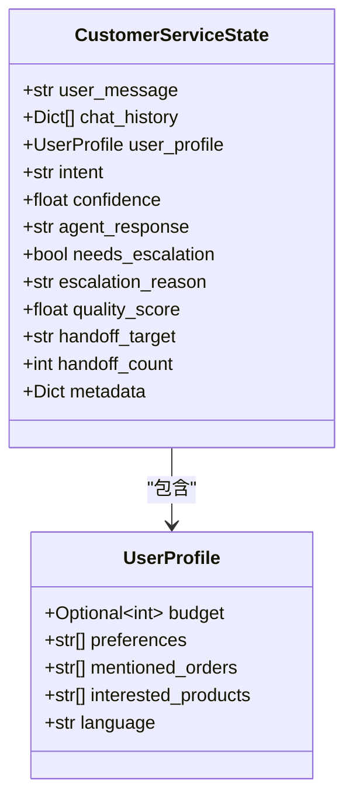
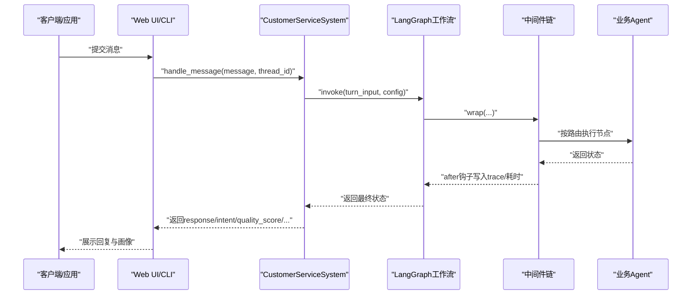
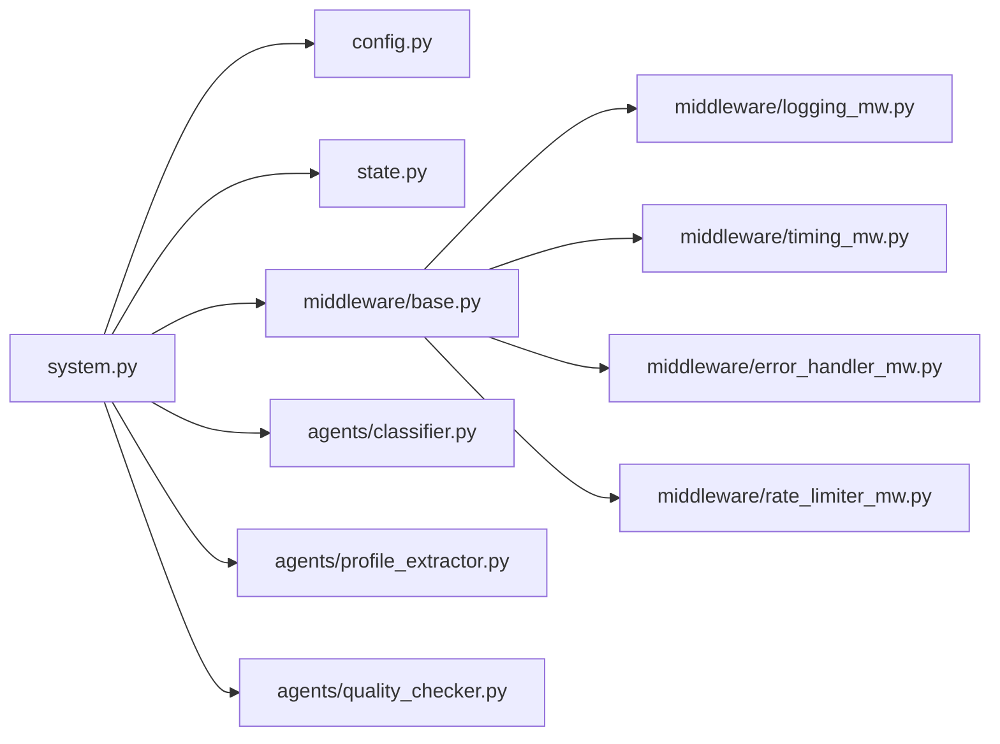

# API参考文档

<cite>
**本文引用的文件**
- [system.py](file://system.py)
- [state.py](file://state.py)
- [config.py](file://config.py)
- [main.py](file://main.py)
- [app.py](file://app.py)
- [README.md](file://README.md)
- [middleware/base.py](file://middleware/base.py)
- [middleware/logging_mw.py](file://middleware/logging_mw.py)
- [middleware/timing_mw.py](file://middleware/timing_mw.py)
- [middleware/error_handler_mw.py](file://middleware/error_handler_mw.py)
- [middleware/rate_limiter_mw.py](file://middleware/rate_limiter_mw.py)
- [agents/classifier.py](file://agents/classifier.py)
- [agents/profile_extractor.py](file://agents/profile_extractor.py)
- [agents/quality_checker.py](file://agents/quality_checker.py)
</cite>

## 目录
1. [简介](#简介)
2. [项目结构](#项目结构)
3. [核心组件](#核心组件)
4. [架构总览](#架构总览)
5. [详细组件分析](#详细组件分析)
6. [依赖关系分析](#依赖关系分析)
7. [性能考量](#性能考量)
8. [故障排查指南](#故障排查指南)
9. [结论](#结论)
10. [附录](#附录)

## 简介
本API参考文档面向希望集成或扩展“多Agent智能客服系统”的开发者与产品团队，聚焦以下目标：
- 文档化主接口 handle_message() 的HTTP方法、参数规范、请求/响应格式与认证方式
- 说明 thread_id 参数的作用与会话管理机制
- 详述返回值的数据结构与状态语义
- 说明 get_profile() 等辅助接口的使用方法
- 提供完整使用示例与常见场景
- 解释API的错误处理与异常情况
- 说明API版本管理与向后兼容策略
- 提供客户端集成指南与SDK开发建议

## 项目结构
该系统采用LangGraph工作流编排，核心对外API集中在系统主类中，配合中间件实现日志、计时、限流与异常兜底，状态通过Checkpointer按thread_id持久化。

图表来源
- [system.py:1-305](file://system.py#L1-L305)
- [state.py:1-58](file://state.py#L1-L58)
- [config.py:1-60](file://config.py#L1-L60)
- [middleware/base.py:1-94](file://middleware/base.py#L1-L94)
- [middleware/logging_mw.py:1-123](file://middleware/logging_mw.py#L1-L123)
- [middleware/timing_mw.py:1-55](file://middleware/timing_mw.py#L1-L55)
- [middleware/error_handler_mw.py:1-65](file://middleware/error_handler_mw.py#L1-L65)
- [middleware/rate_limiter_mw.py:1-94](file://middleware/rate_limiter_mw.py#L1-L94)
- [agents/classifier.py:1-63](file://agents/classifier.py#L1-L63)
- [agents/profile_extractor.py:1-92](file://agents/profile_extractor.py#L1-L92)
- [agents/quality_checker.py:1-63](file://agents/quality_checker.py#L1-L63)

章节来源
- [README.md:1-161](file://README.md#L1-L161)
- [system.py:1-305](file://system.py#L1-L305)
- [state.py:1-58](file://state.py#L1-L58)
- [config.py:1-60](file://config.py#L1-L60)

## 核心组件
- CustomerServiceSystem：系统主类，封装LangGraph工作流、中间件链与对外API
- CustomerServiceState/UserProfile：状态与画像的数据结构
- 中间件链：日志、计时、异常兜底、限流
- 业务智能体：意图分类、画像提取、质量检查等

章节来源
- [system.py:34-305](file://system.py#L34-L305)
- [state.py:28-58](file://state.py#L28-L58)
- [middleware/base.py:46-94](file://middleware/base.py#L46-L94)

## 架构总览
系统通过LangGraph构建状态驱动的工作流，按thread_id持久化状态，实现跨轮次的用户画像累积与条件路由。

图表来源
- [system.py:196-246](file://system.py#L196-L246)

## 详细组件分析

### handle_message() 主接口
- 接口职责：接收用户消息，按工作流处理并返回本轮结果
- 适用场景：Web UI、移动端SDK、第三方平台集成
- 重要说明：本系统未提供HTTP服务端，主接口为Python方法；若需HTTP API，可在应用层封装为FastAPI/Flask接口

参数规范
- message: str（必填）
  - 用户输入的原始消息
- thread_id: str（可选，默认"default"）
  - 会话标识；相同thread_id的多次调用共享状态（含user_profile）
- chat_history: List[Dict] | None（可选，默认None）
  - 历史对话（当前未接入，留作扩展）

返回值结构
- response: str
  - 业务Agent生成的最终回复
- intent: str
  - 意图分类结果（如"tech_support"/"order_service"/"product_consult"/"escalate"）
- confidence: float
  - 意图分类置信度，范围[0.0, 1.0]
- quality_score: float
  - 回复质量评分，范围[0.0, 1.0]
- escalated: bool
  - 是否需要升级到人工客服
- profile: Dict
  - 当前累积的用户画像
- metadata: Dict
  - 元信息，包含trace与node_timings等

状态语义
- 当quality_score低于阈值或质量检查标记升级时，escalated为True
- profile字段随多轮对话按thread_id累积

认证方式
- 本系统未内置认证；如需认证，可在应用层封装HTTP接口时增加鉴权逻辑（如Token校验、IP白名单等）

常见使用场景
- 单轮对话：每次调用使用不同thread_id
- 多轮对话：同一thread_id内连续对话，实现画像累积与上下文延续
- 交互式会话：Web UI或CLI中保持同一thread_id进行连续对话

错误处理与异常
- 中间件链在节点异常时记录日志并设置fallback回复与升级标志
- 限流中间件在令牌不足时抛出超时错误，提示降低调用频率
- 质量检查与意图分类失败时返回兜底结果

版本管理与向后兼容
- 本项目未提供显式的API版本号；建议在应用层通过URL路径或Header引入版本前缀，以保障向后兼容
- 若进行字段增删，建议在metadata中记录变更，并在客户端做兼容判断

章节来源
- [system.py:250-299](file://system.py#L250-L299)
- [config.py:35-46](file://config.py#L35-L46)
- [middleware/error_handler_mw.py:27-65](file://middleware/error_handler_mw.py#L27-L65)
- [middleware/rate_limiter_mw.py:60-94](file://middleware/rate_limiter_mw.py#L60-L94)

### get_profile() 辅助接口
- 接口职责：查询指定thread_id当前累积的用户画像
- 返回值：Dict，包含预算、偏好、订单号、感兴趣产品、语言等字段

使用建议
- 在UI中展示用户画像时，结合handle_message()返回的metadata中的trace与耗时信息，提升可观测性

章节来源
- [system.py:300-305](file://system.py#L300-L305)

### 会话管理与thread_id机制
- thread_id决定状态持久化与恢复；相同thread_id跨轮次共享user_profile
- UI层可通过输入框切换thread_id，实现“新建会话”与“切换会话”
- 多轮对话演示展示了同一thread_id下画像累积的效果

章节来源
- [app.py:49-67](file://app.py#L49-L67)
- [main.py:44-53](file://main.py#L44-L53)
- [system.py:250-299](file://system.py#L250-L299)

### 数据模型与状态流转

图表来源
- [state.py:28-58](file://state.py#L28-L58)

章节来源
- [state.py:14-58](file://state.py#L14-L58)

### API调用序列（概念流程）
以下为概念性序列图，展示从应用层到系统主接口的调用流程。实际代码中，UI与CLI通过调用CustomerServiceSystem的方法实现。

[本图为概念流程，不直接映射具体源码文件，故无图表来源]

## 依赖关系分析

图表来源
- [system.py:17-31](file://system.py#L17-L31)
- [middleware/base.py:46-94](file://middleware/base.py#L46-L94)

章节来源
- [system.py:17-31](file://system.py#L17-L31)
- [middleware/base.py:46-94](file://middleware/base.py#L46-L94)

## 性能考量
- 中间件计时：统计各节点耗时，便于定位性能瓶颈
- 限流中间件：令牌桶算法控制LLM调用频率，避免超限
- 日志中间件：结构化日志与trace记录，便于问题复盘
- 状态持久化：SqliteSaver优先，失败回退InMemorySaver，确保可用性

章节来源
- [middleware/timing_mw.py:13-55](file://middleware/timing_mw.py#L13-L55)
- [middleware/rate_limiter_mw.py:24-94](file://middleware/rate_limiter_mw.py#L24-L94)
- [middleware/logging_mw.py:32-123](file://middleware/logging_mw.py#L32-L123)
- [system.py:66-75](file://system.py#L66-L75)

## 故障排查指南
- 异常兜底：可恢复节点异常时设置fallback回复与升级标志，避免工作流中断
- 限流告警：等待令牌超时会抛出错误，提示降低调用频率
- 日志与trace：查看metadata中的trace与node_timings，定位耗时节点与错误原因
- 阈值调整：根据业务反馈调整意图置信度与质量评分阈值

章节来源
- [middleware/error_handler_mw.py:27-65](file://middleware/error_handler_mw.py#L27-L65)
- [middleware/rate_limiter_mw.py:60-94](file://middleware/rate_limiter_mw.py#L60-L94)
- [middleware/logging_mw.py:32-123](file://middleware/logging_mw.py#L32-L123)
- [config.py:35-46](file://config.py#L35-L46)

## 结论
本API以CustomerServiceSystem为核心，通过thread_id实现跨轮次状态持久化与画像累积，借助中间件链提供可观测性与稳定性。当前未提供HTTP服务端，建议在应用层封装为HTTP接口以满足生产集成需求。版本管理与向后兼容建议通过应用层引入版本前缀与兼容策略。

## 附录

### 使用示例与最佳实践
- 命令行演示：参考main.py中的多轮对话与交互式会话示例
- Web UI集成：参考app.py中的handle_message调用与thread_id管理
- 多轮对话：使用相同thread_id实现画像累积与上下文延续
- 画像查询：使用get_profile()获取当前thread_id的用户画像

章节来源
- [main.py:70-128](file://main.py#L70-L128)
- [app.py:144-147](file://app.py#L144-L147)
- [system.py:300-305](file://system.py#L300-L305)

### 客户端集成指南与SDK建议
- 封装HTTP接口：在应用层提供REST接口，内部调用CustomerServiceSystem
- 认证与授权：在网关或中间件层增加鉴权逻辑
- 版本管理：通过URL路径或Header引入版本前缀，避免破坏性变更
- 错误处理：遵循中间件的异常兜底策略，向客户端返回清晰的错误信息
- 性能优化：合理设置限流参数，结合trace与耗时指标持续优化

章节来源
- [system.py:250-299](file://system.py#L250-L299)
- [middleware/rate_limiter_mw.py:60-94](file://middleware/rate_limiter_mw.py#L60-L94)
- [middleware/error_handler_mw.py:27-65](file://middleware/error_handler_mw.py#L27-L65)