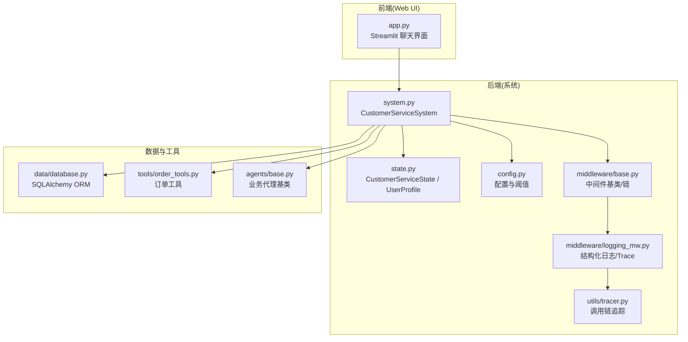
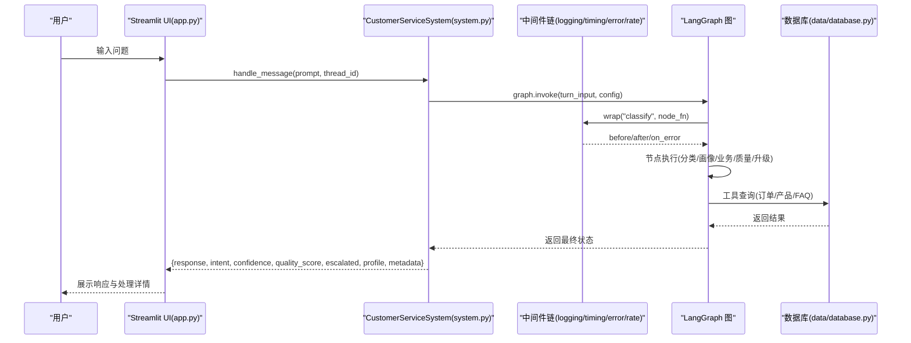
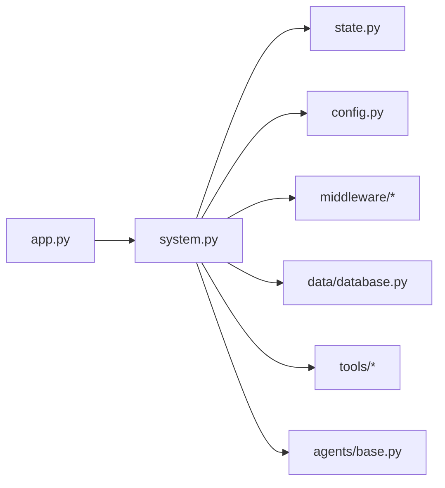

# Web界面API

<cite>
**本文引用的文件**
- [app.py](file://app.py)
- [system.py](file://system.py)
- [state.py](file://state.py)
- [config.py](file://config.py)
- [utils/tracer.py](file://utils/tracer.py)
- [middleware/base.py](file://middleware/base.py)
- [middleware/logging_mw.py](file://middleware/logging_mw.py)
- [README.md](file://README.md)
- [requirements.txt](file://requirements.txt)
- [data/database.py](file://data/database.py)
- [tools/order_tools.py](file://tools/order_tools.py)
- [agents/base.py](file://agents/base.py)
</cite>

## 目录
1. [简介](#简介)
2. [项目结构](#项目结构)
3. [核心组件](#核心组件)
4. [架构总览](#架构总览)
5. [详细组件分析](#详细组件分析)
6. [依赖关系分析](#依赖关系分析)
7. [性能考量](#性能考量)
8. [故障排查指南](#故障排查指南)
9. [结论](#结论)
10. [附录](#附录)

## 简介
本文件面向使用与扩展该多智能体客服系统的前端工程师与全栈开发者，系统性阐述基于 Streamlit 的 Web 界面 API 设计与实现，涵盖页面布局、交互组件、数据展示方式、前后端通信机制（含 WebSocket 与实时推送）、状态同步策略、前端集成示例、自定义 UI 开发指南、响应式设计与可访问性建议，以及部署与性能优化实践。

## 项目结构
该项目采用“模块化分层”的组织方式，Web UI 位于顶层入口文件，核心业务逻辑封装在系统类中，状态、中间件、工具与数据层清晰分离。Streamlit 作为前端框架，负责渲染聊天界面与侧边栏控制面板；后端通过系统类对外暴露统一的消息处理 API。

图表来源
- [app.py:1-177](file://app.py#L1-L177)
- [system.py:1-305](file://system.py#L1-L305)
- [state.py:1-58](file://state.py#L1-L58)
- [config.py:1-60](file://config.py#L1-L60)
- [utils/tracer.py:1-78](file://utils/tracer.py#L1-L78)
- [middleware/base.py:1-94](file://middleware/base.py#L1-L94)
- [middleware/logging_mw.py:1-123](file://middleware/logging_mw.py#L1-L123)
- [data/database.py:1-161](file://data/database.py#L1-L161)
- [tools/order_tools.py:1-50](file://tools/order_tools.py#L1-L50)
- [agents/base.py:1-123](file://agents/base.py#L1-L123)

章节来源
- [README.md:95-133](file://README.md#L95-L133)
- [requirements.txt:1-15](file://requirements.txt#L1-L15)

## 核心组件
- Web UI 入口与页面布局
  - 页面配置：标题、图标、宽屏布局。
  - 会话状态：thread_id、消息历史、处理结果缓存。
  - 侧边栏：会话设置（thread_id、新建会话）、用户画像展示、最近处理摘要、节点耗时、调用链追踪。
  - 主聊天区：历史消息渲染、用户输入、系统处理与响应展示、处理详情展开面板。
- 系统对外 API
  - handle_message：接收用户消息，按 thread_id 执行完整工作流，返回响应与元数据。
  - get_profile：查询指定 thread 的累积用户画像。
- 状态与配置
  - CustomerServiceState：LangGraph 工作流状态，包含请求级字段与会话级画像。
  - 配置常量：意图置信度阈值、质量评分阈值、数据库路径、支持语言等。
- 中间件与可观测性
  - 中间件链：日志、计时、异常捕获、限流。
  - 调用链追踪：节点执行时间、状态与摘要，UI 可展开查看。
- 数据与工具
  - SQLAlchemy ORM：订单、产品、FAQ 表结构与查询函数。
  - 订单工具：按订单号查询、按物流单号追踪。

章节来源
- [app.py:14-177](file://app.py#L14-L177)
- [system.py:248-305](file://system.py#L248-L305)
- [state.py:28-58](file://state.py#L28-L58)
- [config.py:33-60](file://config.py#L33-L60)
- [middleware/base.py:46-94](file://middleware/base.py#L46-L94)
- [middleware/logging_mw.py:32-123](file://middleware/logging_mw.py#L32-L123)
- [utils/tracer.py:71-78](file://utils/tracer.py#L71-L78)
- [data/database.py:24-161](file://data/database.py#L24-L161)
- [tools/order_tools.py:15-50](file://tools/order_tools.py#L15-L50)

## 架构总览
Streamlit Web UI 通过调用系统类的 handle_message 与 get_profile 方法与后端交互。系统类基于 LangGraph 工作流编排，串联意图分类、画像提取、业务代理、质量检查与升级/Hand-off 路由，并通过中间件链实现可观测性与稳定性保障。

图表来源
- [app.py:142-150](file://app.py#L142-L150)
- [system.py:248-298](file://system.py#L248-L298)
- [middleware/base.py:63-94](file://middleware/base.py#L63-L94)
- [middleware/logging_mw.py:39-105](file://middleware/logging_mw.py#L39-L105)
- [data/database.py:104-161](file://data/database.py#L104-L161)

## 详细组件分析

### 页面布局与交互组件
- 页面配置
  - 设置页面标题、图标与宽屏布局，提升信息密度与可用性。
- 侧边栏
  - 会话设置：thread_id 文本输入与新建会话按钮，支持跨轮次状态共享与重置。
  - 用户画像：展示预算、偏好、感兴趣产品、提到的订单、语言等字段。
  - 最近处理摘要：意图、置信度、质量评分、是否升级。
  - 节点耗时：按节点展示执行耗时。
  - 调用链追踪：按序号列出节点执行状态、耗时与摘要。
- 主聊天区
  - 历史消息渲染：按角色显示 Markdown 内容。
  - 用户输入：chat_input 触发提交。
  - 系统处理：在 assistant 角色容器内显示“思考中”提示，调用系统处理并展示响应。
  - 处理详情展开面板：指标卡片与调用链摘要。

章节来源
- [app.py:35-177](file://app.py#L35-L177)

### 前后端通信机制与状态同步
- 通信方式
  - 同步调用：Web UI 通过 handle_message 同步获取处理结果，无需 WebSocket。
  - 会话状态：通过 thread_id 在后端 LangGraph Checkpointer 中持久化，实现跨轮次状态同步。
- 状态同步
  - 前端 session state：messages、results、thread_id。
  - 后端状态：CustomerServiceState，包含请求级字段与 user_profile 会话级字段。
  - 画像累积：同一 thread_id 下多轮对话自动合并 user_profile。
- 实时性与刷新
  - 当前实现为同步请求，UI 通过 rerun 刷新侧边栏与历史消息。
  - 若需 WebSocket 实时推送，可在现有 handle_message 基础上引入异步通道与事件广播。

章节来源
- [system.py:248-305](file://system.py#L248-L305)
- [state.py:28-58](file://state.py#L28-L58)
- [app.py:23-42](file://app.py#L23-L42)

### 数据展示方式与可观测性
- 指标卡片：意图、置信度、质量评分、是否升级。
- 节点耗时：按节点展示执行耗时，便于性能分析。
- 调用链追踪：UI 展示节点执行状态、耗时与摘要，支持错误定位。
- 日志中间件：结构化日志与 Trace 写入，统一输出风格。

章节来源
- [app.py:90-123](file://app.py#L90-L123)
- [app.py:153-170](file://app.py#L153-L170)
- [middleware/logging_mw.py:32-123](file://middleware/logging_mw.py#L32-L123)
- [utils/tracer.py:32-78](file://utils/tracer.py#L32-L78)

### API 规范与使用方法
- handle_message
  - 参数
    - message: 用户输入文本。
    - thread_id: 会话标识，相同 thread_id 共享状态（含 user_profile）。
    - chat_history: 历史对话（预留扩展）。
  - 返回
    - response: 系统回复。
    - intent: 意图分类结果。
    - confidence: 意图置信度。
    - quality_score: 回复质量评分。
    - escalated: 是否升级。
    - profile: 当前用户画像。
    - metadata: 附加元信息（含 trace 等）。
- get_profile
  - 参数
    - thread_id: 会话标识。
  - 返回
    - 当前累积的用户画像字典。

章节来源
- [system.py:250-305](file://system.py#L250-L305)

### 自定义 UI 开发指南
- 基于现有 API 的扩展
  - 保持 thread_id 一致性，确保状态跨轮次共享。
  - 使用 get_profile 展示用户画像，支持动态更新。
  - 展示 metadata 中的 trace 与 node_timings，增强可观测性。
- 组件化建议
  - 将“处理详情”、“节点耗时”、“调用链追踪”封装为可复用组件。
  - 为不同意图/代理提供差异化 UI 呈现（如订单查询结果卡片化）。
- 交互优化
  - 在 handle_message 调用期间显示加载指示与“思考中”提示。
  - 支持快捷操作按钮（如“查看画像”、“复制结果”）。

章节来源
- [app.py:142-150](file://app.py#L142-L150)
- [system.py:250-298](file://system.py#L250-L298)

### 响应式设计与可访问性
- 响应式设计
  - 使用宽屏布局提升信息密度；侧边栏在窄屏下仍可折叠或滚动。
  - 指标卡片与展开面板适配不同屏幕尺寸。
- 可访问性
  - 为按钮与输入控件提供明确的标签与提示。
  - 为“思考中”等状态提供语义化提示与可读性良好的文案。
  - 保持颜色对比度，确保状态图标（✅/❌）与文字清晰可辨。

（本节为概念性指导，不直接分析具体文件）

## 依赖关系分析
- 前端依赖
  - Streamlit：页面渲染与会话状态管理。
  - Python-dotenv：环境变量加载（API Key）。
- 后端依赖
  - LangChain/LangGraph：工作流编排与节点执行。
  - SQLAlchemy：ORM 数据库访问。
  - langgraph-checkpoint-sqlite：持久化检查点。
- 关键依赖关系
  - app.py 依赖 system.py 的 handle_message 与 get_profile。
  - system.py 依赖 state.py 的状态定义、config.py 的阈值与路径、middleware 的可观测性、data/database.py 的工具查询。
  - agents/base.py 与 tools/order_tools.py 为业务代理与工具层提供基础能力。

图表来源
- [app.py:1-177](file://app.py#L1-L177)
- [system.py:1-305](file://system.py#L1-L305)
- [state.py:1-58](file://state.py#L1-L58)
- [config.py:1-60](file://config.py#L1-L60)
- [middleware/base.py:1-94](file://middleware/base.py#L1-L94)
- [data/database.py:1-161](file://data/database.py#L1-L161)
- [tools/order_tools.py:1-50](file://tools/order_tools.py#L1-L50)
- [agents/base.py:1-123](file://agents/base.py#L1-L123)

章节来源
- [requirements.txt:1-15](file://requirements.txt#L1-L15)

## 性能考量
- 会话状态持久化
  - 使用 SqliteSaver 按 thread_id 持久化状态，避免重复计算与跨进程丢失。
- 中间件链
  - 计时与日志中间件提供性能与可观测性，建议在生产环境开启结构化日志。
- 工具查询优化
  - 数据库查询使用索引列（如订单号、产品名模糊匹配），减少扫描开销。
- 前端渲染
  - 使用 expander 展开处理详情，避免一次性渲染过多内容。
  - 通过 st.rerun 控制刷新频率，避免频繁重绘。

（本节为通用性能建议，不直接分析具体文件）

## 故障排查指南
- 环境变量缺失
  - 现象：启动时报错提示未设置有效 API Key。
  - 处理：在 .env 文件中配置 DEEPSEEK_API_KEY。
- 数据库初始化
  - 现象：首次运行缺少业务数据。
  - 处理：确保 run_seed() 正常执行，数据库文件与表结构创建成功。
- 会话状态异常
  - 现象：切换 thread_id 后画像未清空或历史未刷新。
  - 处理：确认侧边栏 thread_id 更新逻辑与 st.rerun 调用。
- 调用链追踪为空
  - 现象：侧边栏“调用链追踪”未显示。
  - 处理：检查中间件链是否正确包裹节点，确保 metadata 中包含 trace。

章节来源
- [config.py:20-27](file://config.py#L20-L27)
- [app.py:19-20](file://app.py#L19-L20)
- [middleware/logging_mw.py:65-105](file://middleware/logging_mw.py#L65-L105)

## 结论
该 Web 界面以 Streamlit 为基础，通过统一的系统 API 与 LangGraph 工作流实现了意图分类、画像累积、质量检查与代理协作的完整闭环。前端以简洁直观的方式呈现处理过程与可观测性信息，具备良好的扩展性。若需进一步增强实时性与交互体验，可在现有同步调用基础上引入 WebSocket 与事件推送机制。

## 附录

### 部署配置建议
- 环境准备
  - 安装依赖：参考 requirements.txt。
  - 配置 API Key：在 .env 中设置 DEEPSEEK_API_KEY。
- 运行方式
  - Web UI：streamlit run app.py。
  - 命令行演示：python main.py。
- 生产部署
  - 建议将 Web UI 与后端服务拆分为独立进程或容器，通过本地同步调用或轻量 HTTP API 交互。
  - 配置数据库连接池与中间件限流，确保高并发下的稳定性。

章节来源
- [README.md:77-93](file://README.md#L77-L93)
- [requirements.txt:1-15](file://requirements.txt#L1-L15)
- [config.py:16-27](file://config.py#L16-L27)