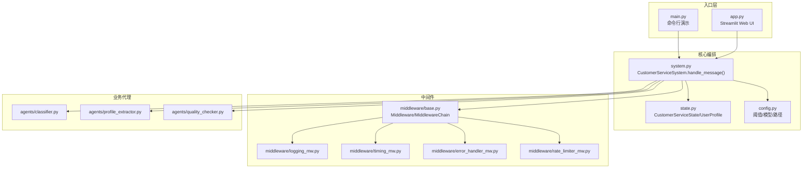
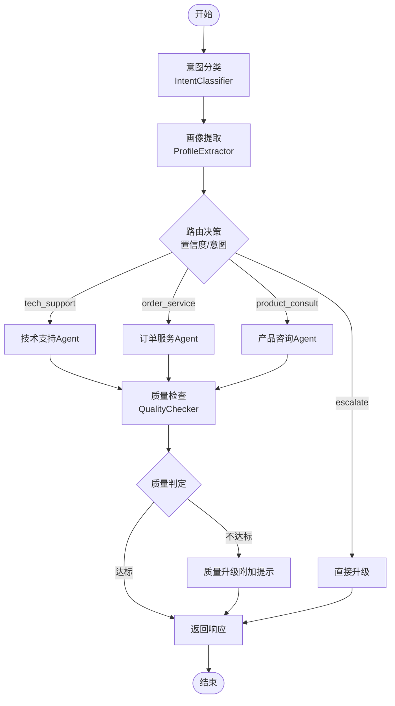
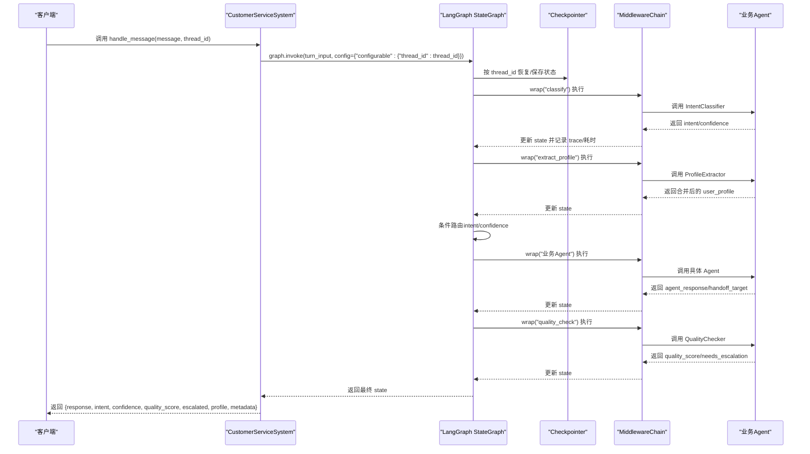
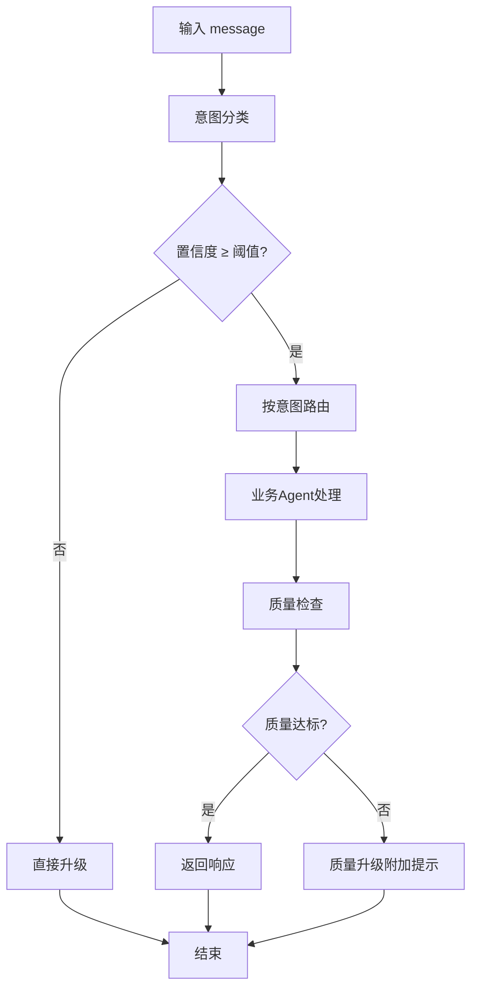
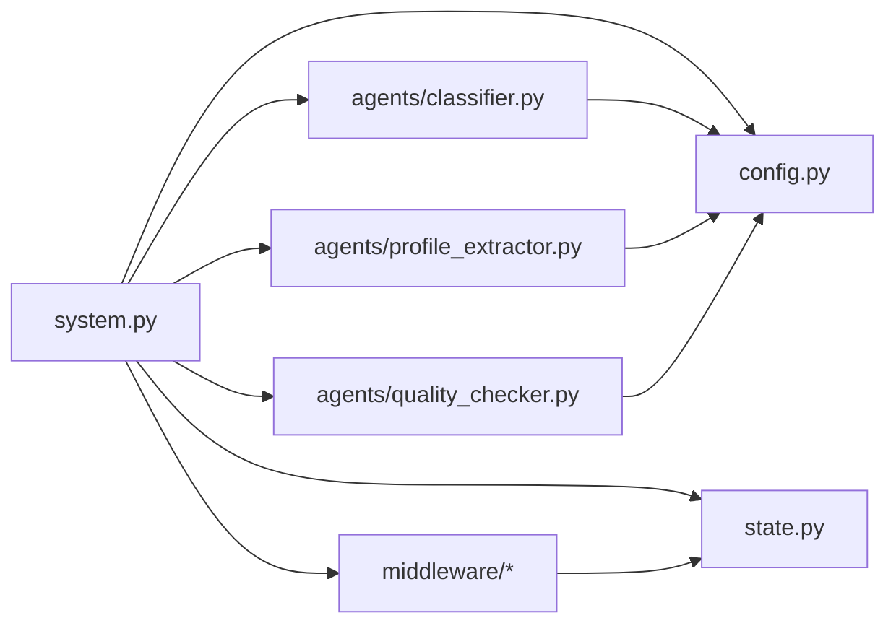

# 核心API接口

<cite>
**本文档引用的文件**
- [system.py](file://system.py)
- [state.py](file://state.py)
- [config.py](file://config.py)
- [main.py](file://main.py)
- [app.py](file://app.py)
- [middleware/base.py](file://middleware/base.py)
- [middleware/logging_mw.py](file://middleware/logging_mw.py)
- [middleware/timing_mw.py](file://middleware/timing_mw.py)
- [middleware/error_handler_mw.py](file://middleware/error_handler_mw.py)
- [middleware/rate_limiter_mw.py](file://middleware/rate_limiter_mw.py)
- [agents/classifier.py](file://agents/classifier.py)
- [agents/profile_extractor.py](file://agents/profile_extractor.py)
- [agents/quality_checker.py](file://agents/quality_checker.py)
- [README.md](file://README.md)
</cite>

## 目录
1. [简介](#简介)
2. [项目结构](#项目结构)
3. [核心组件](#核心组件)
4. [架构总览](#架构总览)
5. [详细组件分析](#详细组件分析)
6. [依赖关系分析](#依赖关系分析)
7. [性能考虑](#性能考虑)
8. [故障排查指南](#故障排查指南)
9. [结论](#结论)
10. [附录](#附录)

## 简介
本文件聚焦于系统的核心API接口 `handle_message()` 的完整规范，涵盖参数说明、返回值结构、错误处理机制与异常情况，并结合实际代码实现进行深入解析。同时提供多轮会话管理与跨轮次状态保持的原理说明，以及性能优化建议与最佳实践。

## 项目结构
系统采用分层架构：入口脚本负责演示与Web UI，核心编排在 `system.py` 中通过 LangGraph 工作流实现；状态定义位于 `state.py`；中间件提供横切关注点（日志、计时、异常捕获、限流）；业务代理分布在 `agents/` 目录下；配置集中在 `config.py`。

图表来源
- [system.py:248-299](file://system.py#L248-L299)
- [state.py:28-58](file://state.py#L28-L58)
- [config.py:33-46](file://config.py#L33-L46)
- [middleware/base.py:46-94](file://middleware/base.py#L46-L94)

章节来源
- [README.md:81-108](file://README.md#L81-L108)
- [system.py:196-247](file://system.py#L196-L247)

## 核心组件
- CustomerServiceSystem：系统主类，封装LangGraph工作流与对外API。
- CustomerServiceState/UserProfile：LangGraph状态载体，定义请求级与会话级字段。
- MiddlewareChain：中间件编排器，为节点函数注入横切逻辑。
- 业务代理：意图分类、画像提取、质量检查等专用Agent。

章节来源
- [system.py:34-76](file://system.py#L34-L76)
- [state.py:14-58](file://state.py#L14-L58)
- [middleware/base.py:14-94](file://middleware/base.py#L14-L94)

## 架构总览
系统通过 LangGraph StateGraph 实现端到端工作流：用户消息经意图分类与画像提取后，按置信度与意图路由到相应业务Agent，再经过质量检查，最终返回响应或升级提示。中间件链贯穿每个节点，提供日志、计时、异常捕获与限流能力。

图表来源
- [system.py:196-247](file://system.py#L196-L247)
- [system.py:159-184](file://system.py#L159-L184)
- [system.py:79-147](file://system.py#L79-L147)

## 详细组件分析

### handle_message() 主接口规范
- 方法签名与职责
  - 方法：`handle_message(message: str, thread_id: str = "default", chat_history: Optional[List[Dict]] = None)`
  - 职责：处理单条用户消息，返回本轮处理结果字典。
- 参数说明
  - message：必填，用户输入字符串。
  - thread_id：可选，默认值为 `"default"`，用于区分会话并持久化状态。
  - chat_history：可选，当前预留参数，暂未接入。
- 返回值结构
  - response：业务Agent生成的最终回复文本。
  - intent：意图分类结果（如 `tech_support`、`order_service`、`product_consult`、`escalate`）。
  - confidence：意图分类置信度，范围 [0.0, 1.0]。
  - quality_score：回复质量评分，范围 [0.0, 1.0]。
  - escalated：布尔值，指示是否需要人工升级。
  - profile：当前会话累积的用户画像（UserProfile）。
  - metadata：附加元信息，包含时间戳、trace调用链、节点耗时等。
- 请求级字段重置策略
  - 每轮调用都会重置请求级字段（如 intent、confidence、agent_response、needs_escalation、quality_score、handoff_* 等），确保不会跨轮次污染。
  - user_profile 通过 Checkpointer 按 thread_id 恢复与累积，不被重置。
- 错误处理与异常情况
  - 中间件链按注册顺序执行：日志 → 计时 → 异常捕获 → 限流。
  - 可恢复节点异常时设置 fallback 回复并标记升级，避免工作流中断。
  - 限流节点在等待令牌超时（默认30秒）时抛出运行时错误，提示降低调用频率。
- 性能指标
  - metadata.node_timings 记录各节点耗时（毫秒）。
  - metadata.trace 记录节点执行轨迹（含状态、耗时、错误信息）。

章节来源
- [system.py:250-299](file://system.py#L250-L299)
- [state.py:28-58](file://state.py#L28-L58)
- [middleware/logging_mw.py:32-106](file://middleware/logging_mw.py#L32-L106)
- [middleware/timing_mw.py:13-55](file://middleware/timing_mw.py#L13-L55)
- [middleware/error_handler_mw.py:27-65](file://middleware/error_handler_mw.py#L27-L65)
- [middleware/rate_limiter_mw.py:60-94](file://middleware/rate_limiter_mw.py#L60-L94)

### thread_id 会话管理与跨轮次状态保持
- 会话标识
  - thread_id 作为 configurable 参数传递给 Checkpointer，LangGraph 依据该键恢复/保存状态。
- 状态持久化
  - 使用 SqliteSaver 优先持久化，失败时回退到 InMemorySaver。
  - user_profile 作为会话级字段，跨轮次累积并在每轮开始时从快照恢复。
- 会话生命周期
  - 同一 thread_id 下的多次调用共享 user_profile，形成“用户画像”。
  - 每轮调用仅重置请求级字段，不改变会话级字段。
- UI层面的会话控制
  - Web UI 提供 thread_id 输入框与新建会话按钮，切换 thread_id 会清空历史并重置会话。

图表来源
- [system.py:248-299](file://system.py#L248-L299)
- [system.py:196-247](file://system.py#L196-L247)
- [middleware/base.py:63-94](file://middleware/base.py#L63-L94)

章节来源
- [system.py:66-75](file://system.py#L66-L75)
- [system.py:300-305](file://system.py#L300-L305)
- [app.py:49-67](file://app.py#L49-L67)

### 返回值字段详解
- response
  - 类型：字符串
  - 说明：最终回复文本，可能包含质量升级附加提示。
- intent
  - 类型：字符串
  - 说明：意图分类结果，来自 IntentClassifier。
- confidence
  - 类型：浮点数
  - 说明：意图分类置信度，范围 [0.0, 1.0]。
- quality_score
  - 类型：浮点数
  - 说明：质量检查评分，范围 [0.0, 1.0]。
- escalated
  - 类型：布尔值
  - 说明：是否需要人工升级（直接升级或质量检查后升级）。
- profile
  - 类型：字典
  - 说明：用户画像，包含预算、偏好、提及订单、感兴趣产品、语言等字段。
- metadata
  - 类型：字典
  - 说明：包含时间戳、trace 调用链、节点耗时等附加信息。

章节来源
- [system.py:290-298](file://system.py#L290-L298)
- [state.py:28-58](file://state.py#L28-L58)

### 错误处理机制与异常情况
- 可恢复节点
  - 包括：`tech_support`、`order_service`、`product_consult`、`quality_check`、`extract_profile`。
  - 行为：异常时设置 fallback 回复与升级标志，后续节点可继续执行。
- 不可恢复节点
  - 异常直接抛出，由外层捕获并记录。
- 限流异常
  - 等待令牌超时（默认30秒）时抛出运行时错误，提示降低调用频率。
- 日志与追踪
  - 结构化日志记录节点开始/结束、耗时、摘要与错误信息。
  - metadata.trace 记录节点执行轨迹，便于调试与审计。

章节来源
- [middleware/error_handler_mw.py:15-65](file://middleware/error_handler_mw.py#L15-L65)
- [middleware/rate_limiter_mw.py:60-94](file://middleware/rate_limiter_mw.py#L60-L94)
- [middleware/logging_mw.py:32-106](file://middleware/logging_mw.py#L32-L106)

### 代码示例与使用场景
- 单轮对话（独立 thread_id）
  - 场景：每个消息使用独立 thread_id，互不干扰。
  - 参考：[main.py:70-84](file://main.py#L70-L84)
- 多轮会话延续（同一 thread_id）
  - 场景：同一 thread_id 下连续对话，观察 profile 累积效果。
  - 参考：[main.py:86-104](file://main.py#L86-L104)
- 交互式对话（整 session 共用 thread_id）
  - 场景：持续对话，输入 `profile` 查看当前画像。
  - 参考：[main.py:107-128](file://main.py#L107-L128)
- Web UI 场景
  - 场景：Streamlit 界面输入，调用 system.handle_message() 并展示结果。
  - 参考：[app.py:141-173](file://app.py#L141-L173)

章节来源
- [main.py:12-128](file://main.py#L12-L128)
- [app.py:141-173](file://app.py#L141-L173)

### 处理流程与决策逻辑
- 意图分类与路由
  - 依据置信度阈值与意图类型决定路由到具体 Agent 或直接升级。
- Hand-off 机制
  - 业务 Agent 可返回 handoff_target，系统最多允许有限次 handoff（防止无限循环）。
- 质量检查与升级
  - 质量评分低于阈值或质量检查标记升级时，附加人工提示并结束流程。

图表来源
- [system.py:159-184](file://system.py#L159-L184)
- [system.py:134-147](file://system.py#L134-L147)
- [config.py:35-39](file://config.py#L35-L39)

章节来源
- [system.py:79-147](file://system.py#L79-L147)
- [config.py:35-39](file://config.py#L35-L39)

## 依赖关系分析
- 组件耦合
  - system.py 依赖 agents/*、config.py、state.py、middleware/*。
  - agents/* 依赖 config.model 与 utils.json_parser。
  - middleware/* 依赖 state.CustomerServiceState。
- 外部依赖
  - LangChain 1.0、LangGraph、SQLite（持久化）。
- 潜在环路
  - 无直接循环依赖；中间件通过装饰器模式注入，避免耦合。

图表来源
- [system.py:17-31](file://system.py#L17-L31)
- [agents/classifier.py:15-16](file://agents/classifier.py#L15-L16)
- [agents/profile_extractor.py:12-14](file://agents/profile_extractor.py#L12-L14)
- [agents/quality_checker.py:12-13](file://agents/quality_checker.py#L12-L13)

章节来源
- [system.py:17-31](file://system.py#L17-L31)
- [agents/classifier.py:15-16](file://agents/classifier.py#L15-L16)
- [agents/profile_extractor.py:12-14](file://agents/profile_extractor.py#L12-L14)
- [agents/quality_checker.py:12-13](file://agents/quality_checker.py#L12-L13)

## 性能考虑
- 令牌桶限流
  - 为包含 LLM 调用的节点提供限流保护，默认速率与容量可配置。
- 节点耗时统计
  - 通过中间件记录各节点耗时，便于定位性能瓶颈。
- 日志与追踪
  - 结构化日志与 trace 记录有助于性能分析与问题定位。
- 持久化策略
  - 优先使用 SQLite 持久化，失败回退内存存储，兼顾可靠性与性能。

章节来源
- [middleware/rate_limiter_mw.py:24-58](file://middleware/rate_limiter_mw.py#L24-L58)
- [middleware/timing_mw.py:13-43](file://middleware/timing_mw.py#L13-L43)
- [system.py:66-75](file://system.py#L66-L75)

## 故障排查指南
- 常见问题
  - API Key 未配置：检查 .env 文件中的 DEEPSEEK_API_KEY。
  - SQLite 持久化失败：系统会自动回退到内存存储，不影响基本功能。
  - 节点异常：查看日志与 metadata.trace，确认异常节点与错误信息。
  - 限流超时：降低调用频率或调整限流参数。
- 调试建议
  - 使用 Web UI 或命令行演示查看 metadata.node_timings 与 trace。
  - 通过 get_profile(thread_id) 查询当前会话画像，验证跨轮累积效果。

章节来源
- [config.py:20-26](file://config.py#L20-L26)
- [system.py:66-75](file://system.py#L66-L75)
- [middleware/logging_mw.py:32-106](file://middleware/logging_mw.py#L32-L106)
- [middleware/error_handler_mw.py:27-65](file://middleware/error_handler_mw.py#L27-L65)
- [middleware/rate_limiter_mw.py:60-94](file://middleware/rate_limiter_mw.py#L60-L94)

## 结论
`handle_message()` 作为系统核心API，通过 LangGraph 工作流实现了意图分类、画像提取、业务Agent处理、质量检查与升级的完整闭环。借助中间件链与 Checkpointer，系统具备良好的可观测性、可维护性与跨轮次状态保持能力。遵循本文档的参数规范、返回值结构与最佳实践，可在生产环境中稳定运行并持续优化性能。

## 附录
- 参数与返回值速查
  - 参数：message（必填）、thread_id（默认 "default"）、chat_history（可选）
  - 返回：response、intent、confidence、quality_score、escalated、profile、metadata
- 相关实现参考
  - [system.py:250-299](file://system.py#L250-L299)
  - [state.py:28-58](file://state.py#L28-L58)
  - [config.py:35-39](file://config.py#L35-L39)