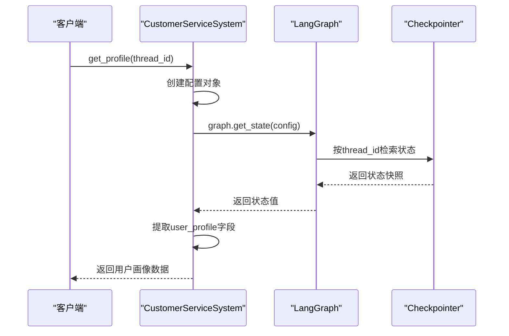
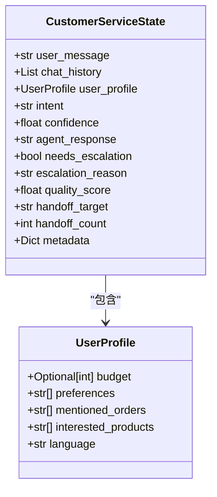
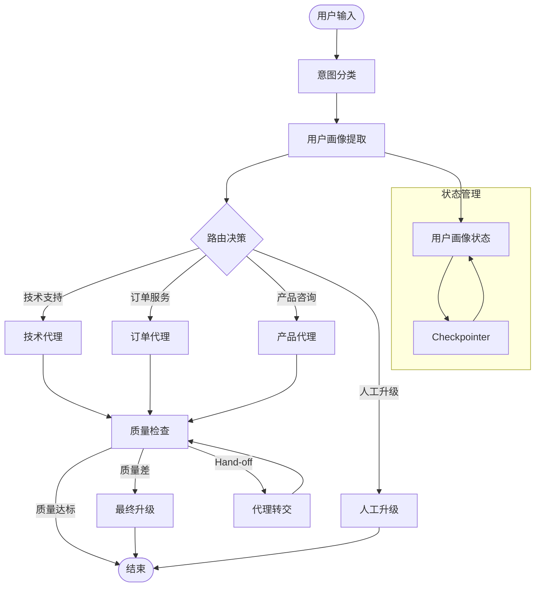
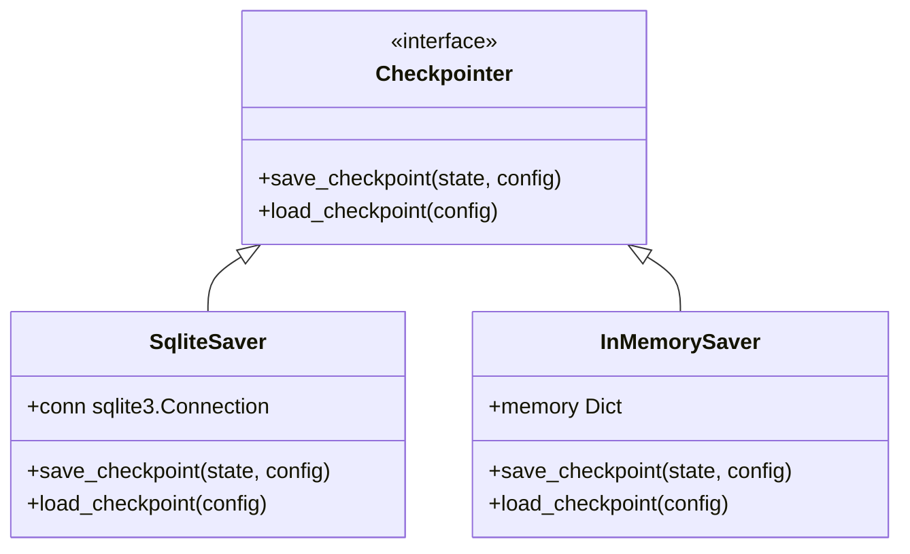
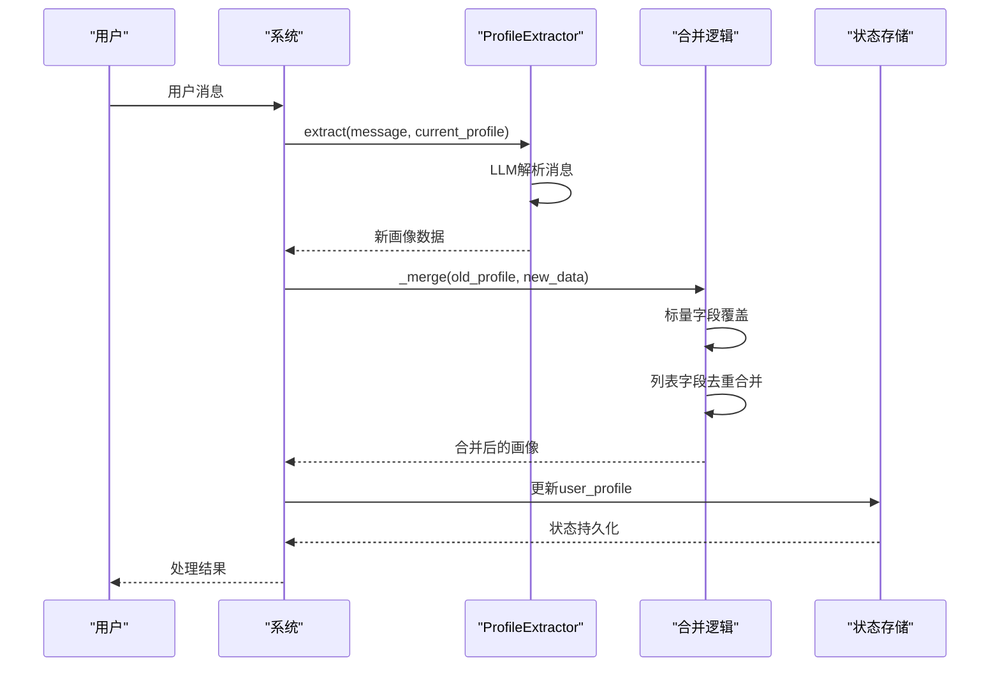
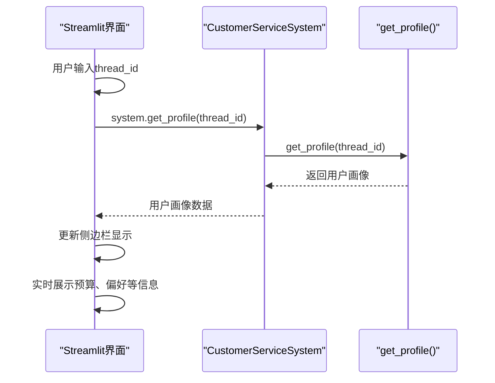
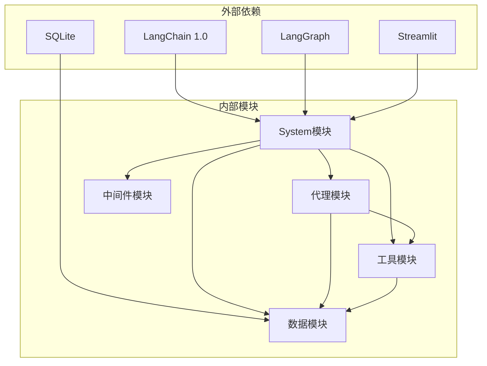

# 辅助API接口

<cite>
**本文档引用的文件**
- [system.py](file://system.py)
- [state.py](file://state.py)
- [profile_extractor.py](file://agents/profile_extractor.py)
- [app.py](file://app.py)
- [main.py](file://main.py)
- [config.py](file://config.py)
- [database.py](file://data/database.py)
- [order_tools.py](file://tools/order_tools.py)
- [product_tools.py](file://tools/product_tools.py)
</cite>

## 目录
1. [简介](#简介)
2. [项目结构](#项目结构)
3. [核心组件](#核心组件)
4. [架构概览](#架构概览)
5. [详细组件分析](#详细组件分析)
6. [依赖关系分析](#依赖关系分析)
7. [性能考虑](#性能考虑)
8. [故障排除指南](#故障排除指南)
9. [结论](#结论)

## 简介

本文档专注于多智能体客服系统中的辅助API接口，特别是`get_profile()`接口的详细说明。该接口允许开发者查询指定会话ID（thread_id）当前累积的用户画像信息，为个性化客户服务提供数据支撑。

系统基于LangChain 1.0 + LangGraph构建，支持意图分类、动态路由、工具调用、质量检查和跨轮次用户画像累积。`get_profile()`接口是系统的核心辅助功能之一，为前端界面和后端服务提供了便捷的用户画像访问能力。

## 项目结构

系统采用模块化设计，主要包含以下核心模块：

```mermaid
graph TB
subgraph "应用层"
APP[app.py - Streamlit Web UI]
MAIN[main.py - 命令行演示]
end
subgraph "核心系统"
SYS[system.py - 主系统类]
STATE[state.py - 状态定义]
CONFIG[config.py - 配置中心]
end
subgraph "代理层"
CLASS[agents/classifier.py]
PROFILE[agents/profile_extractor.py]
TECH[agents/tech_support.py]
ORDER[agents/order_service.py]
PRODUCT[agents/product_consult.py]
QUALITY[agents/quality_checker.py]
end
subgraph "工具层"
ORDER_TOOLS[tools/order_tools.py]
PRODUCT_TOOLS[tools/product_tools.py]
end
subgraph "数据层"
DB[data/database.py - SQLAlchemy ORM]
MOCK[data/mock_data.py - Mock数据]
end
subgraph "中间件层"
MW_BASE[middleware/base.py]
MW_LOG[middleware/logging_mw.py]
MW_TIME[middleware/timing_mw.py]
MW_ERROR[middleware/error_handler_mw.py]
MW_RATE[middleware/rate_limiter_mw.py]
end
APP --> SYS
MAIN --> SYS
SYS --> STATE
SYS --> PROFILE
SYS --> CLASS
SYS --> TECH
SYS --> ORDER
SYS --> PRODUCT
SYS --> QUALITY
SYS --> CONFIG
SYS --> DB
SYS --> MW_BASE
SYS --> MW_LOG
SYS --> MW_TIME
SYS --> MW_ERROR
SYS --> MW_RATE
ORDER_TOOLS --> DB
PRODUCT_TOOLS --> DB
```



**图表来源**
- [system.py:1-305](file://system.py#L1-L305)
- [app.py:1-177](file://app.py#L1-L177)
- [main.py:1-148](file://main.py#L1-L148)

**章节来源**
- [system.py:1-305](file://system.py#L1-L305)
- [app.py:1-177](file://app.py#L1-L177)
- [main.py:1-148](file://main.py#L1-L148)

## 核心组件

### get_profile()接口概述

`get_profile()`是CustomerServiceSystem类提供的对外辅助API，用于查询指定thread_id的当前用户画像。该接口是系统跨轮次状态管理的重要组成部分。

#### 接口定义



**图表来源**
- [system.py:300-304](file://system.py#L300-L304)

#### 参数说明

| 参数名 | 类型 | 必填 | 描述 |
|--------|------|------|------|
| thread_id | str | 是 | 会话标识符，相同thread_id的多次调用共享同一用户画像状态 |

#### 返回值结构

get_profile()返回的用户画像数据遵循UserProfile TypedDict定义：



**图表来源**
- [state.py:14-26](file://state.py#L14-L26)
- [state.py:28-58](file://state.py#L28-L58)

**章节来源**
- [system.py:300-304](file://system.py#L300-L304)
- [state.py:14-26](file://state.py#L14-L26)

## 架构概览

系统采用LangGraph工作流架构，通过Checkpointer实现跨轮次状态持久化。get_profile()接口正是基于这一架构设计的关键功能。



**图表来源**
- [system.py:196-246](file://system.py#L196-L246)
- [system.py:86-91](file://system.py#L86-L91)

**章节来源**
- [system.py:196-246](file://system.py#L196-L246)
- [system.py:86-91](file://system.py#L86-L91)

## 详细组件分析

### get_profile()接口实现详解

#### 核心实现逻辑

get_profile()方法通过LangGraph的get_state()方法查询指定thread_id的状态快照，然后提取其中的user_profile字段：

```mermaid
flowchart TD
GET_PROFILE[get_profile(thread_id)] --> CREATE_CONFIG[创建配置对象]
CREATE_CONFIG --> CALL_GET_STATE[调用graph.get_state]
CALL_GET_STATE --> CHECK_SNAPSHOT{检查快照}
CHECK_SNAPSHOT --> |存在| EXTRACT_PROFILE[提取user_profile]
CHECK_SNAPSHOT --> |不存在| RETURN_EMPTY[返回空字典]
EXTRACT_PROFILE --> RETURN_RESULT[返回用户画像]
RETURN_EMPTY --> RETURN_RESULT
```

**图表来源**
- [system.py:300-304](file://system.py#L300-L304)

#### 状态持久化机制

系统使用LangGraph Checkpointer实现状态持久化，支持多种存储后端：



**图表来源**
- [system.py:66-75](file://system.py#L66-L75)

**章节来源**
- [system.py:300-304](file://system.py#L300-L304)
- [system.py:66-75](file://system.py#L66-L75)

### 用户画像生命周期管理

#### 画像累积过程

用户画像通过ProfileExtractor代理在每轮对话中逐步累积：



**图表来源**
- [profile_extractor.py:41-81](file://agents/profile_extractor.py#L41-L81)
- [system.py:86-91](file://system.py#L86-L91)

#### 合并策略

ProfileExtractor采用智能合并策略处理新旧画像数据：

| 字段类型 | 合并规则 | 示例 |
|----------|----------|------|
| 标量字段(budget, language) | 新值非空则覆盖 | 1500 → 2000 |
| 列表字段(preferences, orders) | 追加去重，保持顺序 | ["降噪"] + ["续航"] = ["降噪", "续航"] |
| 空值处理 | 保持原值，不覆盖None | 无新信息时不改变现有值 |

**章节来源**
- [profile_extractor.py:41-81](file://agents/profile_extractor.py#L41-L81)

### 与其他接口的配合使用

#### Web UI集成

在Streamlit Web界面中，get_profile()被用于实时展示用户画像：



**图表来源**
- [app.py:71-87](file://app.py#L71-L87)

#### 命令行演示

在命令行模式下，get_profile()用于演示多轮对话的画像累积效果：

**章节来源**
- [app.py:71-87](file://app.py#L71-L87)
- [main.py:86-104](file://main.py#L86-L104)

### 使用场景和限制条件

#### 使用场景

1. **实时画像展示**：在Web界面中动态显示用户偏好和历史
2. **个性化推荐**：为产品推荐和订单查询提供上下文信息
3. **会话管理**：支持多会话并发管理和状态隔离
4. **数据分析**：后台系统查询用户画像进行统计分析

#### 限制条件

1. **thread_id必需性**：必须提供有效的thread_id参数
2. **状态存在性**：如果thread_id对应的会话不存在，返回空字典
3. **数据一致性**：返回的是查询时刻的快照，后续对话可能改变状态
4. **性能考虑**：频繁调用可能影响系统性能，建议合理缓存

**章节来源**
- [system.py:300-304](file://system.py#L300-L304)
- [app.py:71-87](file://app.py#L71-L87)

## 依赖关系分析

系统各组件之间的依赖关系如下：



**图表来源**
- [system.py:13-31](file://system.py#L13-L31)
- [config.py:10-60](file://config.py#L10-L60)

**章节来源**
- [system.py:13-31](file://system.py#L13-L31)
- [config.py:10-60](file://config.py#L10-L60)

## 性能考虑

### 状态查询性能

get_profile()接口的性能特点：

1. **查询复杂度**：O(1) - 直接通过thread_id索引查找
2. **内存占用**：仅返回user_profile部分，避免全状态传输
3. **并发安全**：Checkpointer支持多线程访问
4. **持久化开销**：SQLite存储带来磁盘IO开销

### 优化建议

1. **合理缓存**：对于频繁查询的thread_id，建议在应用层添加缓存
2. **批量查询**：支持同时查询多个thread_id的画像
3. **异步处理**：对于高并发场景，考虑异步查询实现
4. **索引优化**：确保thread_id字段有适当的索引

### 使用建议

1. **频率控制**：避免每轮对话都调用get_profile()，建议每N轮查询一次
2. **错误处理**：始终处理返回空字典的情况
3. **超时设置**：为长时间运行的查询设置合理的超时时间
4. **监控告警**：监控get_profile()的调用频率和响应时间

## 故障排除指南

### 常见问题及解决方案

#### 1. get_profile()返回空字典

**可能原因**：
- thread_id不存在或无效
- 会话尚未建立
- Checkpointer初始化失败

**解决方法**：
- 确认thread_id的有效性
- 确保至少有一次handle_message调用
- 检查数据库连接状态

#### 2. 性能问题

**可能原因**：
- 高频查询导致数据库压力
- 大量并发请求
- 缓存机制缺失

**解决方法**：
- 实施查询缓存
- 添加请求限流
- 优化数据库索引

#### 3. 状态不一致

**可能原因**：
- 多进程环境下的状态同步问题
- Checkpointer配置错误
- 并发访问冲突

**解决方法**：
- 使用SqliteSaver进行持久化
- 确保正确的配置传递
- 实施适当的锁机制

**章节来源**
- [system.py:66-75](file://system.py#L66-L75)
- [system.py:300-304](file://system.py#L300-L304)

## 结论

get_profile()接口作为多智能体客服系统的核心辅助功能，为用户提供了一种简单而强大的方式来访问和管理用户画像信息。通过与LangGraph Checkpointer的深度集成，该接口实现了跨轮次的状态持久化和实时查询能力。

### 关键优势

1. **简洁易用**：单一方法调用即可获取完整用户画像
2. **实时性强**：返回查询时刻的最新状态快照
3. **扩展性好**：支持多种存储后端和并发访问
4. **集成便利**：与系统其他组件无缝集成

### 最佳实践

1. **合理使用**：避免过度频繁的查询调用
2. **错误处理**：始终处理空字典返回值
3. **性能优化**：实施适当的缓存和限流策略
4. **监控维护**：建立完善的监控和告警机制

该接口为构建智能化的客户服务系统奠定了坚实的基础，通过持续的优化和改进，能够更好地满足实际业务需求。