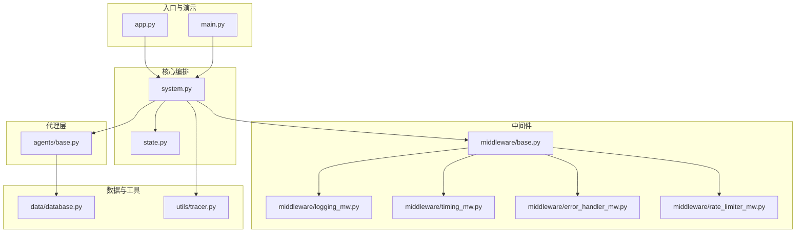
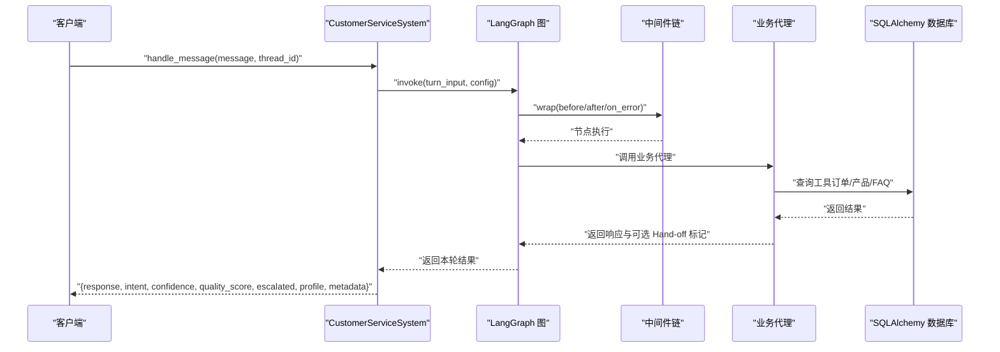
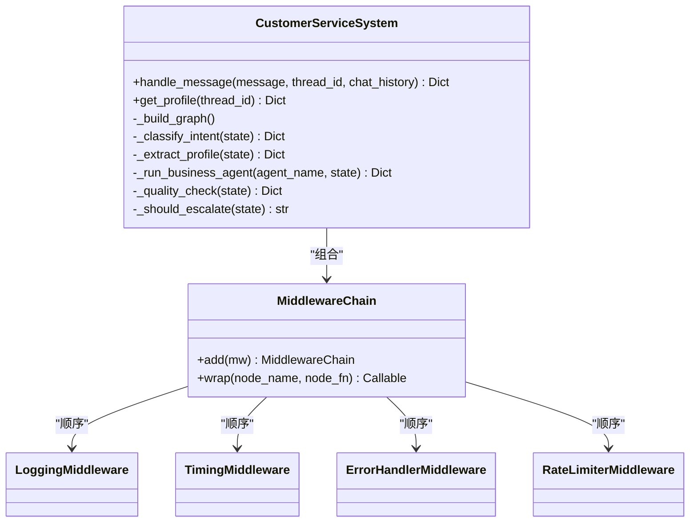
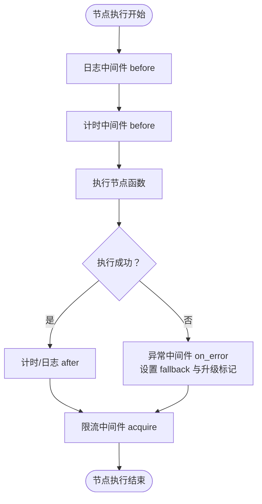
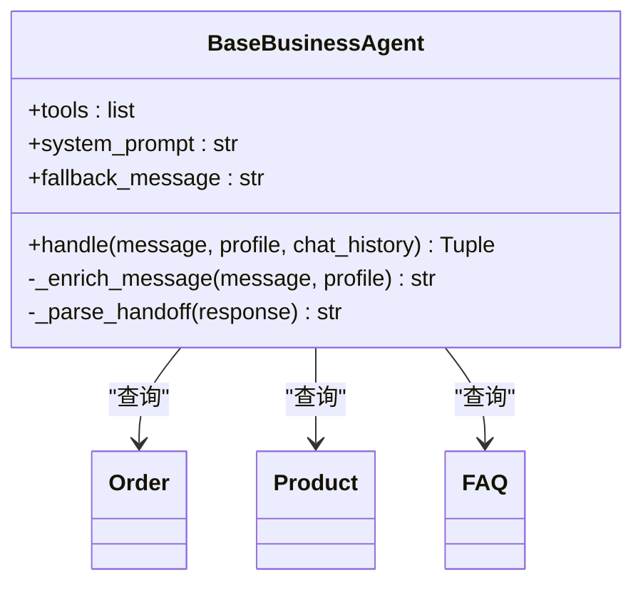
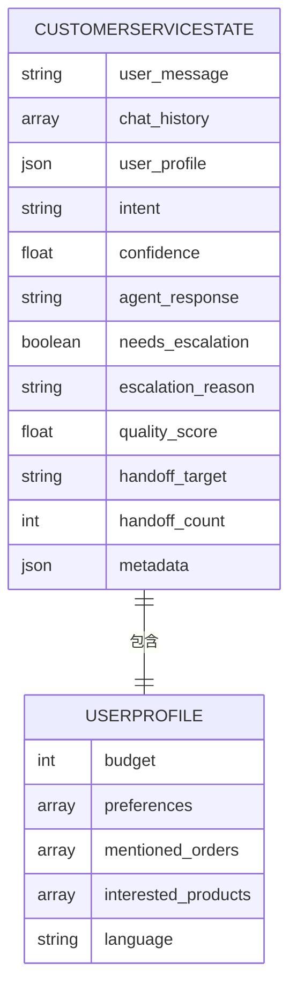
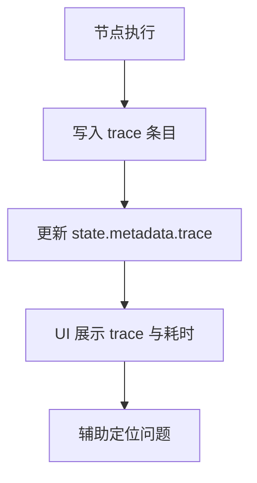
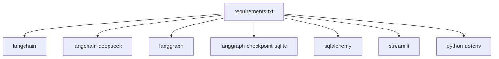

# 集成开发指南

<cite>
**本文引用的文件**
- [README.md](file://README.md)
- [requirements.txt](file://requirements.txt)
- [config.py](file://config.py)
- [main.py](file://main.py)
- [app.py](file://app.py)
- [system.py](file://system.py)
- [state.py](file://state.py)
- [middleware/base.py](file://middleware/base.py)
- [middleware/logging_mw.py](file://middleware/logging_mw.py)
- [middleware/timing_mw.py](file://middleware/timing_mw.py)
- [middleware/error_handler_mw.py](file://middleware/error_handler_mw.py)
- [middleware/rate_limiter_mw.py](file://middleware/rate_limiter_mw.py)
- [agents/base.py](file://agents/base.py)
- [data/database.py](file://data/database.py)
- [utils/tracer.py](file://utils/tracer.py)
</cite>

## 目录
1. [简介](#简介)
2. [项目结构](#项目结构)
3. [核心组件](#核心组件)
4. [架构总览](#架构总览)
5. [详细组件分析](#详细组件分析)
6. [依赖分析](#依赖分析)
7. [性能考虑](#性能考虑)
8. [故障排查指南](#故障排查指南)
9. [结论](#结论)
10. [附录](#附录)

## 简介
本指南面向希望将“多智能体客服系统”作为后端能力进行集成的开发者，提供从 Python SDK 到 REST/WS 的多种集成方式、认证与限流策略、错误与重试机制、超时配置、多语言与多轮对话体验、可观测性与调试工具、以及生产部署与监控建议。系统基于 LangChain 1.0 + LangGraph，具备意图分类、画像累积、质量检查、Agent Hand-off、限流与可观测性等能力。

## 项目结构
系统采用模块化分层设计：
- 入口与演示：main.py、app.py
- 核心编排：system.py（LangGraph 工作流 + 中间件链）
- 状态模型：state.py（TypedDict 定义）
- 中间件层：日志、计时、异常捕获、限流
- 代理层：意图分类、画像提取、业务代理、质量检查
- 工具与数据库：SQLAlchemy ORM + 种子数据
- 工具与追踪：调用链追踪

图表来源
- [system.py:1-305](file://system.py#L1-L305)
- [middleware/base.py:1-94](file://middleware/base.py#L1-L94)
- [middleware/logging_mw.py:1-123](file://middleware/logging_mw.py#L1-L123)
- [middleware/timing_mw.py:1-55](file://middleware/timing_mw.py#L1-L55)
- [middleware/error_handler_mw.py:1-65](file://middleware/error_handler_mw.py#L1-L65)
- [middleware/rate_limiter_mw.py:1-94](file://middleware/rate_limiter_mw.py#L1-L94)
- [agents/base.py:1-123](file://agents/base.py#L1-L123)
- [data/database.py:1-161](file://data/database.py#L1-L161)
- [utils/tracer.py:1-78](file://utils/tracer.py#L1-L78)

章节来源
- [README.md:95-133](file://README.md#L95-L133)
- [requirements.txt:1-15](file://requirements.txt#L1-L15)

## 核心组件
- 系统入口与对外 API：CustomerServiceSystem.handle_message(thread_id, message) 返回 response/intent/confidence/quality_score/escalated/profile/metadata
- LangGraph 工作流：意图分类 → 画像提取 → 业务代理 → 质量检查 → 响应/升级/Hand-off
- 中间件链：日志、计时、异常捕获、限流
- 业务代理：技术、订单、产品咨询，支持 Hand-off 与多语言
- 数据层：SQLAlchemy + SQLite，提供订单、产品、FAQ 查询
- 可观测性：trace 列表、节点耗时、UI 展示

章节来源
- [system.py:248-305](file://system.py#L248-L305)
- [state.py:28-58](file://state.py#L28-L58)
- [middleware/base.py:46-94](file://middleware/base.py#L46-L94)
- [agents/base.py:23-123](file://agents/base.py#L23-L123)
- [data/database.py:104-161](file://data/database.py#L104-L161)
- [utils/tracer.py:11-78](file://utils/tracer.py#L11-L78)

## 架构总览
系统通过 LangGraph StateGraph 编排节点，中间件链对每个节点注入横切关注点；业务代理通过工具访问真实数据库；前端通过 Web UI 或自研 SDK/HTTP 接口消费系统能力。

图表来源
- [system.py:196-247](file://system.py#L196-L247)
- [middleware/base.py:63-94](file://middleware/base.py#L63-L94)
- [agents/base.py:41-66](file://agents/base.py#L41-L66)
- [data/database.py:104-161](file://data/database.py#L104-L161)

## 详细组件分析

### CustomerServiceSystem（对外 API 与工作流）
- 对外 API：handle_message(message, thread_id, chat_history=None) 返回标准化结果；get_profile(thread_id) 查询画像
- 工作流：节点包括 classify、extract_profile、tech/order/product、escalate、quality_check、escalate_final、handoff_route；条件路由依据置信度与质量评分
- 中间件链：日志 → 计时 → 异常捕获 → 限流
- Checkpointer：优先 SqliteSaver，失败回退 InMemorySaver；按 thread_id 恢复/保存状态

图表来源
- [system.py:34-305](file://system.py#L34-L305)
- [middleware/base.py:46-94](file://middleware/base.py#L46-L94)
- [middleware/logging_mw.py:32-123](file://middleware/logging_mw.py#L32-L123)
- [middleware/timing_mw.py:13-55](file://middleware/timing_mw.py#L13-L55)
- [middleware/error_handler_mw.py:27-65](file://middleware/error_handler_mw.py#L27-L65)
- [middleware/rate_limiter_mw.py:60-94](file://middleware/rate_limiter_mw.py#L60-L94)

章节来源
- [system.py:248-305](file://system.py#L248-L305)
- [system.py:196-247](file://system.py#L196-L247)

### 中间件体系（日志、计时、异常、限流）
- 日志中间件：节点开始/结束记录、摘要提取、trace 写入
- 计时中间件：记录节点耗时到 metadata.node_timings
- 异常中间件：可恢复节点异常时设置 fallback 回复与升级标记
- 限流中间件：令牌桶算法，针对含 LLM 调用的节点限流，超时抛错

图表来源
- [middleware/base.py:63-94](file://middleware/base.py#L63-L94)
- [middleware/logging_mw.py:39-106](file://middleware/logging_mw.py#L39-L106)
- [middleware/timing_mw.py:20-55](file://middleware/timing_mw.py#L20-L55)
- [middleware/error_handler_mw.py:46-65](file://middleware/error_handler_mw.py#L46-L65)
- [middleware/rate_limiter_mw.py:71-78](file://middleware/rate_limiter_mw.py#L71-L78)

章节来源
- [middleware/logging_mw.py:1-123](file://middleware/logging_mw.py#L1-L123)
- [middleware/timing_mw.py:1-55](file://middleware/timing_mw.py#L1-L55)
- [middleware/error_handler_mw.py:1-65](file://middleware/error_handler_mw.py#L1-L65)
- [middleware/rate_limiter_mw.py:1-94](file://middleware/rate_limiter_mw.py#L1-L94)

### 业务代理与工具（Hand-off 与多语言）
- BaseBusinessAgent：封装 create_agent、注入 user_profile、解析 [HANDOFF:target]、多语言提示
- 工具层：订单查询、物流跟踪、产品检索、预算推荐、FAQ 搜索
- 数据层：SQLAlchemy ORM + SQLite，提供强类型查询接口

图表来源
- [agents/base.py:23-123](file://agents/base.py#L23-L123)
- [data/database.py:25-161](file://data/database.py#L25-L161)

章节来源
- [agents/base.py:1-123](file://agents/base.py#L1-L123)
- [data/database.py:1-161](file://data/database.py#L1-L161)

### 状态模型与多轮对话
- CustomerServiceState：定义每轮请求级字段与会话级 user_profile
- Checkpointer：按 thread_id 恢复/保存状态，实现跨轮次画像累积
- 多轮对话示例：相同 thread_id 下，系统自动合并预算、偏好、订单等信息

图表来源
- [state.py:28-58](file://state.py#L28-L58)

章节来源
- [state.py:1-58](file://state.py#L1-L58)
- [system.py:250-305](file://system.py#L250-L305)

### 可观测性与调试
- trace：每个节点记录开始/结束时间、耗时、状态、摘要、错误
- UI 展示：侧边栏显示节点耗时与 trace 列表
- 日志：结构化日志 + trace 写入，便于定位问题

图表来源
- [middleware/logging_mw.py:59-105](file://middleware/logging_mw.py#L59-L105)
- [utils/tracer.py:32-78](file://utils/tracer.py#L32-L78)
- [app.py:110-123](file://app.py#L110-L123)

章节来源
- [utils/tracer.py:1-78](file://utils/tracer.py#L1-L78)
- [app.py:1-177](file://app.py#L1-L177)

## 依赖分析
- LangChain 1.0 生态：langchain、langchain-deepseek、langgraph、langgraph-checkpoint-sqlite
- 数据库：sqlalchemy
- Web UI：streamlit
- 环境变量：python-dotenv

图表来源
- [requirements.txt:1-15](file://requirements.txt#L1-L15)

章节来源
- [requirements.txt:1-15](file://requirements.txt#L1-L15)

## 性能考虑
- 限流策略：令牌桶限流，针对含 LLM 调用的节点，避免突发流量导致 API 限速
- 计时与 trace：记录节点耗时，便于定位瓶颈
- Checkpointer：优先 SQLite，失败回退内存；生产建议使用 PostgresSaver
- 并发与线程：SqliteSaver 使用 check_same_thread=False，注意线程安全

章节来源
- [middleware/rate_limiter_mw.py:24-94](file://middleware/rate_limiter_mw.py#L24-L94)
- [middleware/timing_mw.py:13-55](file://middleware/timing_mw.py#L13-L55)
- [system.py:66-75](file://system.py#L66-L75)

## 故障排查指南
- 异常兜底：可恢复节点异常时设置 fallback 回复与升级标记，避免工作流中断
- 限流超时：节点等待令牌超时（默认 30s）会抛错，建议降低并发或调整限流参数
- 日志与 trace：查看节点状态、耗时与错误摘要，定位问题根因
- 数据库：确认 BUSINESS_DB_PATH 与 CHECKPOINT_DB_PATH 路径正确，表结构已初始化

章节来源
- [middleware/error_handler_mw.py:27-65](file://middleware/error_handler_mw.py#L27-L65)
- [middleware/rate_limiter_mw.py:71-78](file://middleware/rate_limiter_mw.py#L71-L78)
- [middleware/logging_mw.py:83-106](file://middleware/logging_mw.py#L83-L106)
- [config.py:48-51](file://config.py#L48-L51)

## 结论
该系统提供了稳定的工作流编排、完善的中间件体系、可观测性与真实数据库对接能力。通过标准化的 handle_message API，可快速集成到各类客户端（Python SDK、REST、WebSocket）。生产部署建议使用 SQLite/PostgreSQL 持久化、合理限流与监控告警，持续优化节点耗时与质量评分阈值。

## 附录

### Python SDK 开发（客户端集成方案）
- 基础用法
  - 初始化系统：run_seed() + CustomerServiceSystem()
  - 单轮对话：handle_message(message, thread_id)
  - 多轮对话：相同 thread_id 累积 user_profile
- 代码片段路径
  - [main.py:130-148](file://main.py#L130-L148)
  - [system.py:250-305](file://system.py#L250-L305)
  - [README.md:159-173](file://README.md#L159-L173)

章节来源
- [main.py:130-148](file://main.py#L130-L148)
- [system.py:250-305](file://system.py#L250-L305)
- [README.md:159-173](file://README.md#L159-L173)

### RESTful API 调用（建议方案）
- 设计思路
  - 以 handle_message 为核心，提供 HTTP 接口：POST /chat
  - 请求体：{message, thread_id, chat_history}
  - 响应体：标准化结果（response/intent/confidence/quality_score/escalated/profile/metadata）
- 认证机制
  - 建议在网关层或反向代理层校验 API Key（参考 DEEPSEEK_API_KEY 的加载方式）
- 错误处理
  - 服务器内部错误返回 5xx，客户端重试；限流超时返回 429
- 超时与重试
  - 建议客户端设置请求超时（如 30s），指数退避重试（1s、2s、4s）
- 代码片段路径
  - [config.py:20-31](file://config.py#L20-L31)
  - [system.py:250-305](file://system.py#L250-L305)

章节来源
- [config.py:20-31](file://config.py#L20-L31)
- [system.py:250-305](file://system.py#L250-L305)

### WebSocket 连接（建议方案）
- 场景
  - 实时聊天、流式输出（可扩展）
- 设计要点
  - 保持 thread_id 一致性，跨消息复用 user_profile
  - 服务端在节点执行前后推送进度与 trace 片段
- 代码片段路径
  - [system.py:250-305](file://system.py#L250-L305)
  - [utils/tracer.py:32-78](file://utils/tracer.py#L32-L78)

章节来源
- [system.py:250-305](file://system.py#L250-L305)
- [utils/tracer.py:32-78](file://utils/tracer.py#L32-L78)

### 认证机制
- 环境变量加载：DEEPSEEK_API_KEY
- 建议在 REST/WS 层增加 API Key 校验与配额控制
- 代码片段路径
  - [config.py:16-31](file://config.py#L16-L31)

章节来源
- [config.py:16-31](file://config.py#L16-L31)

### 错误处理策略
- 可恢复节点异常：设置 fallback 回复与升级标记
- 限流超时：抛出超时错误，客户端重试
- 代码片段路径
  - [middleware/error_handler_mw.py:46-65](file://middleware/error_handler_mw.py#L46-L65)
  - [middleware/rate_limiter_mw.py:71-78](file://middleware/rate_limiter_mw.py#L71-L78)

章节来源
- [middleware/error_handler_mw.py:46-65](file://middleware/error_handler_mw.py#L46-L65)
- [middleware/rate_limiter_mw.py:71-78](file://middleware/rate_limiter_mw.py#L71-L78)

### 重试机制与超时配置
- 限流令牌桶：默认速率与容量可调
- 客户端建议：指数退避、最大重试次数、请求超时
- 代码片段路径
  - [middleware/rate_limiter_mw.py:24-58](file://middleware/rate_limiter_mw.py#L24-L58)

章节来源
- [middleware/rate_limiter_mw.py:24-58](file://middleware/rate_limiter_mw.py#L24-L58)

### API 版本管理、兼容性与迁移
- 版本策略
  - 以语义化版本管理对外 API（如 /v1/chat）
  - 保持返回字段稳定性，新增字段向后兼容
- 兼容性
  - metadata 字段扩展不影响既有逻辑
- 迁移指南
  - 从 InMemorySaver 迁移到 SqliteSaver/PostgresSaver
  - 从 mock_data 迁移到 SQLAlchemy ORM
- 代码片段路径
  - [system.py:66-75](file://system.py#L66-L75)
  - [data/database.py:91-99](file://data/database.py#L91-L99)

章节来源
- [system.py:66-75](file://system.py#L66-L75)
- [data/database.py:91-99](file://data/database.py#L91-L99)

### 多语言与多轮对话
- 多语言：根据 user_profile.language 切换回复语言
- 多轮对话：相同 thread_id 累积 user_profile，支持预算、偏好、订单、产品等
- 代码片段路径
  - [agents/base.py:84-98](file://agents/base.py#L84-L98)
  - [README.md:149-157](file://README.md#L149-L157)

章节来源
- [agents/base.py:84-98](file://agents/base.py#L84-L98)
- [README.md:149-157](file://README.md#L149-L157)

### 生产环境部署建议
- 数据库
  - SQLite：开发/小规模；PostgreSQL：生产（配合 PostgresSaver）
- 持久化
  - Checkpointer 优先 PostgreSQL；失败回退 SQLite
- 监控与告警
  - 节点耗时阈值告警、trace 异常占比、限流触发率
- 安全
  - API Key 管理、速率限制、IP 白名单
- 代码片段路径
  - [config.py:48-51](file://config.py#L48-L51)
  - [middleware/rate_limiter_mw.py:68-69](file://middleware/rate_limiter_mw.py#L68-L69)

章节来源
- [config.py:48-51](file://config.py#L48-L51)
- [middleware/rate_limiter_mw.py:68-69](file://middleware/rate_limiter_mw.py#L68-L69)

### 测试用例与调试工具
- 测试用例
  - 单轮测试：不同类别的消息，独立 thread_id
  - 多轮对话：同一 thread_id 观察画像累积
  - 交互式对话：输入 quit 退出，输入 profile 查看画像
- 调试工具
  - UI 展示 trace 与节点耗时
  - 结构化日志 + trace 写入
- 代码片段路径
  - [main.py:12-104](file://main.py#L12-L104)
  - [app.py:110-123](file://app.py#L110-L123)
  - [utils/tracer.py:32-78](file://utils/tracer.py#L32-L78)

章节来源
- [main.py:12-104](file://main.py#L12-L104)
- [app.py:110-123](file://app.py#L110-L123)
- [utils/tracer.py:32-78](file://utils/tracer.py#L32-L78)