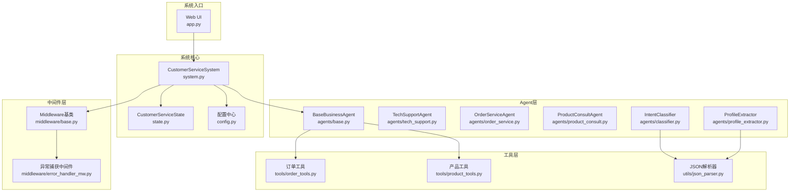
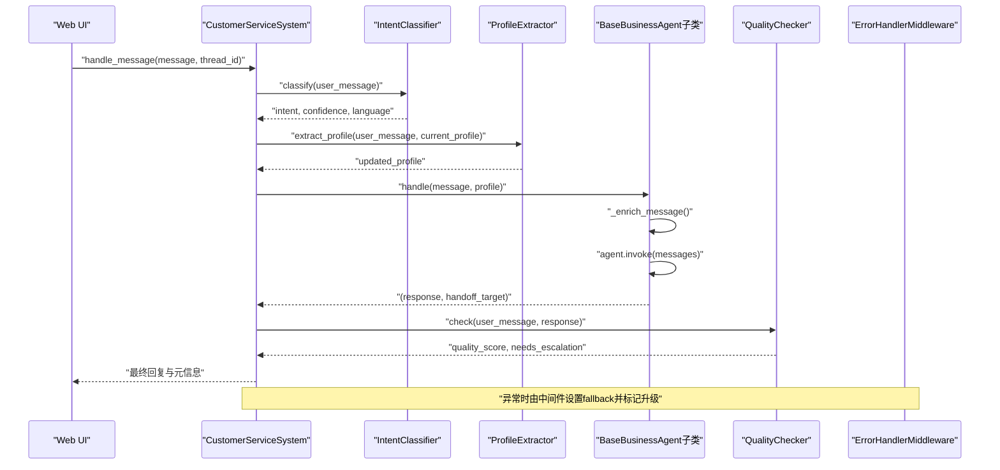
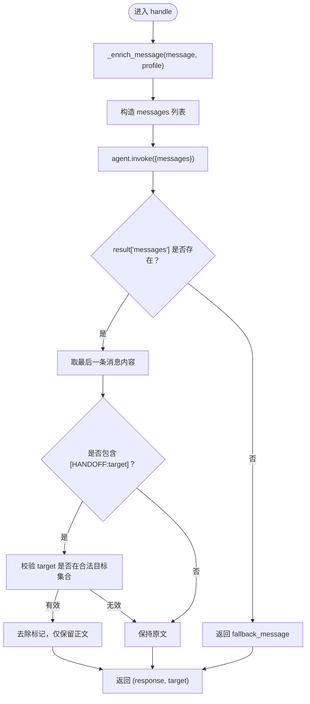
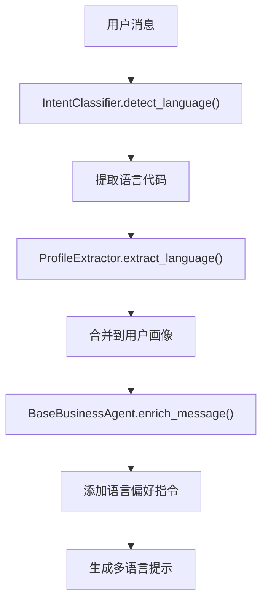
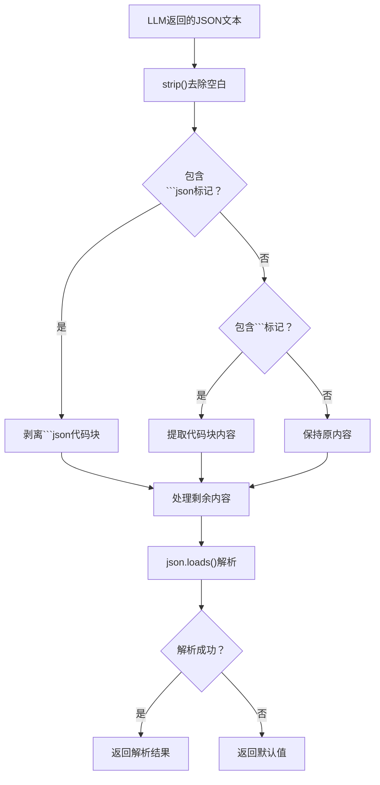
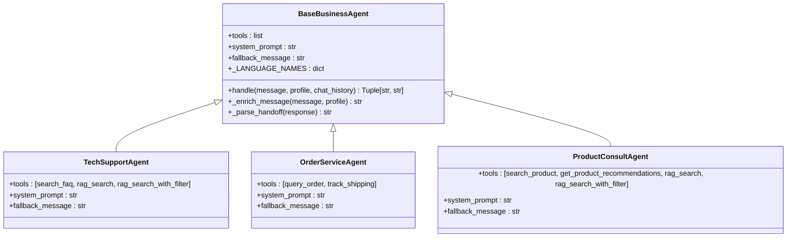
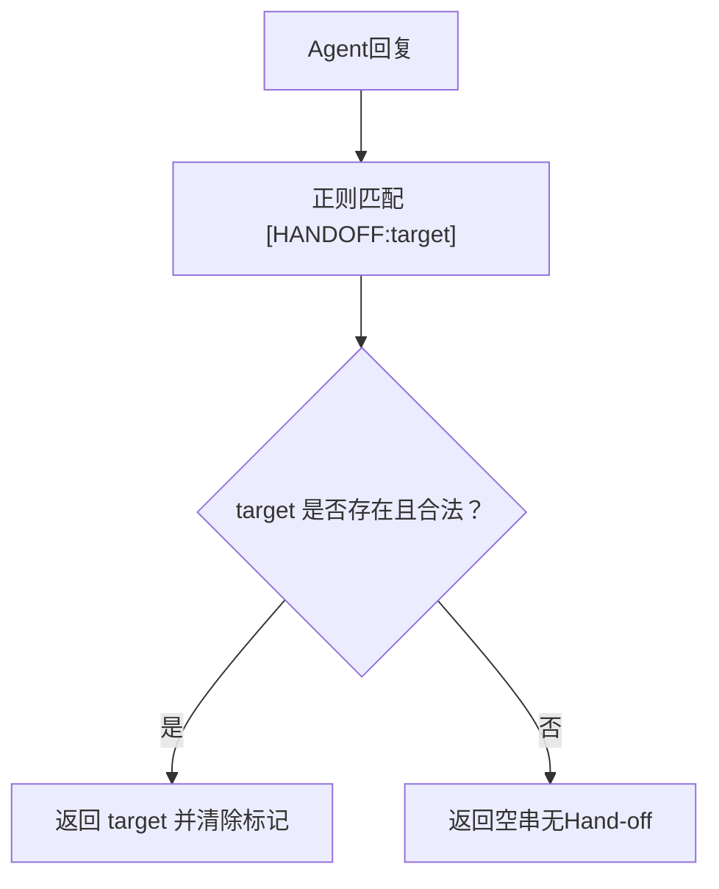
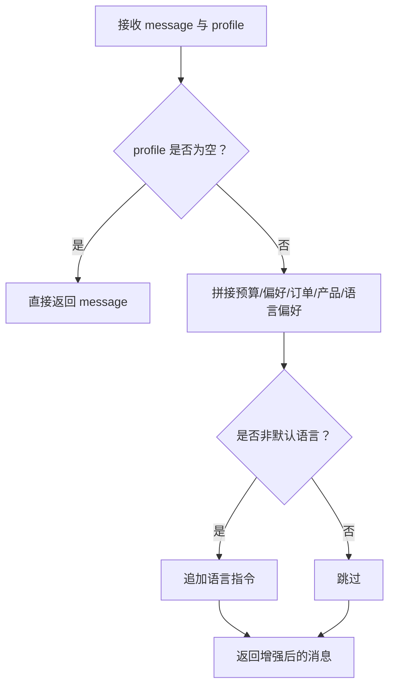
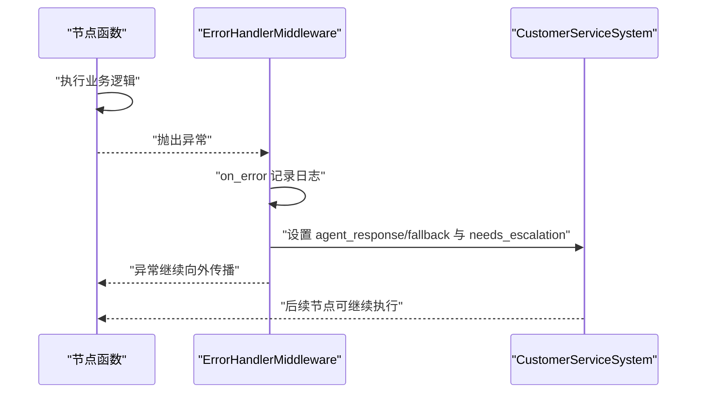
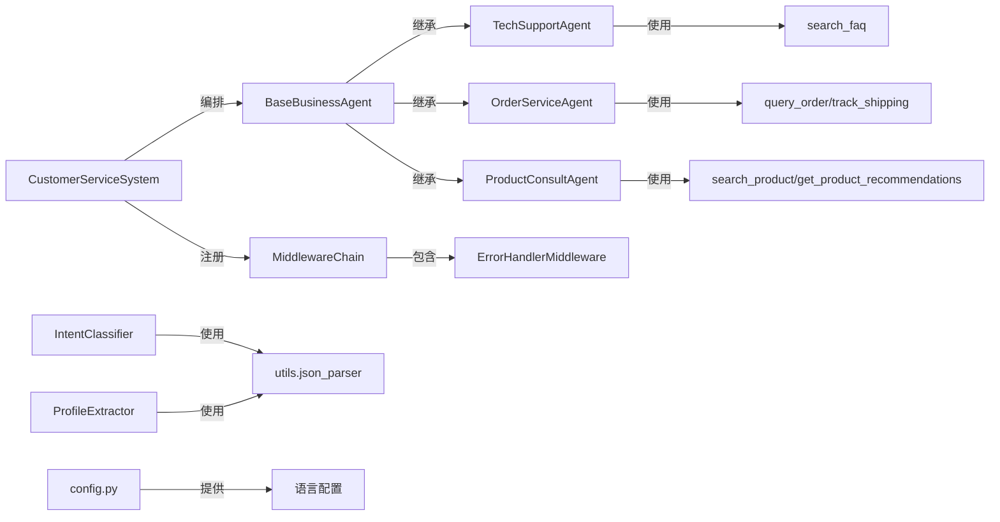

# Agent基类设计

<cite>
**本文档引用的文件**
- [agents/base.py](file://agents/base.py)
- [agents/classifier.py](file://agents/classifier.py)
- [agents/order_service.py](file://agents/order_service.py)
- [agents/product_consult.py](file://agents/product_consult.py)
- [agents/tech_support.py](file://agents/tech_support.py)
- [agents/profile_extractor.py](file://agents/profile_extractor.py)
- [system.py](file://system.py)
- [state.py](file://state.py)
- [config.py](file://config.py)
- [middleware/base.py](file://middleware/base.py)
- [middleware/error_handler_mw.py](file://middleware/error_handler_mw.py)
- [utils/json_parser.py](file://utils/json_parser.py)
- [tools/order_tools.py](file://tools/order_tools.py)
- [tools/product_tools.py](file://tools/product_tools.py)
</cite>

## 更新摘要
**变更内容**
- 新增智能语言检测功能：IntentClassifier和ProfileExtractor支持语言代码检测
- 增强多语言支持：BaseBusinessAgent内置语言代码到语言名称映射
- 改进响应格式化：utils.json_parser提供安全的JSON解析和格式化功能
- 完善多语言配置：config.py新增SUPPORTED_LANGUAGES和DEFAULT_LANGUAGE常量

## 目录
1. [简介](#简介)
2. [项目结构](#项目结构)
3. [核心组件](#核心组件)
4. [架构总览](#架构总览)
5. [详细组件分析](#详细组件分析)
6. [依赖关系分析](#依赖关系分析)
7. [性能考虑](#性能考虑)
8. [故障排查指南](#故障排查指南)
9. [结论](#结论)

## 简介
本文件聚焦于多智能体客服系统中的Agent基类设计，系统性阐述BaseBusinessAgent基类的设计理念、实现模式与扩展点，重点包括：
- 模板方法模式的应用：统一处理流程，子类仅需声明工具集、系统提示词与回退消息。
- 抽象方法定义与工具注入机制：通过类属性tools、system_prompt、fallback_message实现"约定优于配置"。
- 系统提示词配置：在构造阶段注入到Agent，确保子类职责清晰。
- **智能语言检测与多语言支持**：通过IntentClassifier和ProfileExtractor实现语言代码检测，BaseBusinessAgent提供多语言响应支持。
- **响应格式化与容错处理**：utils.json_parser提供安全的JSON解析，处理Markdown代码块和格式异常。
- 手写离线（Hand-off）机制：通过正则表达式匹配与目标Agent验证，实现跨Agent流转。
- 用户画像增强机制：将UserProfile信息注入到用户消息中，提升个性化服务能力。
- fallback机制与错误处理策略：结合中间件链与系统级兜底，保障稳定性。

## 项目结构
系统采用"LangGraph工作流 + 多Agent + 工具 + 中间件"的分层架构：
- agents：业务Agent基类与具体Agent（技术、订单、产品）、分类器、画像提取器。
- system：系统主控制器，编排工作流、路由与Hand-off。
- state：工作流状态定义，承载用户画像与流程控制字段。
- config：系统配置中心，集中管理模型、阈值与多语言设置。
- middleware：中间件基础设施与具体中间件（日志、计时、异常捕获、限流）。
- tools：可调用工具集合，为Agent提供外部能力。
- utils：通用工具，如JSON解析器。



**图表来源**
- [system.py:34-76](file://system.py#L34-L76)
- [agents/base.py:23-39](file://agents/base.py#L23-L39)
- [agents/classifier.py:19-38](file://agents/classifier.py#L19-L38)
- [agents/profile_extractor.py:17-39](file://agents/profile_extractor.py#L17-L39)
- [agents/tech_support.py:11-29](file://agents/tech_support.py#L11-L29)
- [agents/order_service.py:11-29](file://agents/order_service.py#L11-L29)
- [agents/product_consult.py:11-30](file://agents/product_consult.py#L11-L30)
- [tools/order_tools.py:15-50](file://tools/order_tools.py#L15-L50)
- [tools/product_tools.py:14-78](file://tools/product_tools.py#L14-L78)
- [middleware/base.py:14-94](file://middleware/base.py#L14-L94)
- [middleware/error_handler_mw.py:27-65](file://middleware/error_handler_mw.py#L27-L65)
- [utils/json_parser.py:10-51](file://utils/json_parser.py#L10-L51)

**章节来源**
- [system.py:34-76](file://system.py#L34-L76)
- [agents/base.py:23-39](file://agents/base.py#L23-L39)

## 核心组件
本节深入剖析BaseBusinessAgent基类及其子类，解释模板方法模式、工具注入与系统提示词配置，并给出扩展点与最佳实践。

- 基类职责
  - 统一初始化：在构造阶段创建共享模型与Agent实例。
  - 统一处理流程：封装消息增强、调用Agent、解析Hand-off标记与回退逻辑。
  - 子类约定：必须声明tools、system_prompt、fallback_message三要素。

- 模板方法模式
  - handle为模板方法：固定流程（消息增强→调用Agent→解析Hand-off→返回结果）。
  - 子类通过覆写类属性实现差异化：工具集、系统提示词、回退消息。

- 工具注入机制
  - 子类通过类属性tools声明工具列表，基类在构造时注入到Agent。
  - 工具来自独立模块，便于维护与扩展。

- 系统提示词配置
  - 子类通过类属性system_prompt声明Agent职责与回复要求。
  - 基类在构造时将提示词注入Agent，确保行为一致性。

- **智能语言检测与多语言支持**
  - **IntentClassifier**：通过LLM分析用户消息，返回包含语言代码的JSON格式结果。
  - **ProfileExtractor**：从用户消息中提取语言偏好信息，与现有画像合并。
  - **BaseBusinessAgent**：内置语言代码到语言名称映射，支持多语言响应。

- **响应格式化与容错处理**
  - **utils.json_parser**：提供安全的JSON解析，处理Markdown代码块和格式异常。
  - **智能格式化**：自动剥离代码块标记，处理不规范的JSON格式。

- 用户画像增强机制
  - _enrich_message将UserProfile关键字段拼接到用户消息前，形成"画像+问题"的复合提示。
  - 支持多语言偏好注入，必要时追加语言指令，保证回复语言一致性。

- Hand-off机制
  - _parse_handoff使用正则匹配"[HANDOFF:agent_name]"，并在有效范围内校验目标Agent。
  - 系统通过路由函数与工作流节点实现跨Agent流转，限制最大Hand-off次数防止循环。

- Fallback机制与错误处理
  - 基类handle在无结果时返回fallback_message。
  - 系统级中间件ErrorHandlerMiddleware对可恢复节点捕获异常并设置fallback与升级标志，保障流程不中断。

**章节来源**
- [agents/base.py:23-123](file://agents/base.py#L23-L123)
- [agents/classifier.py:19-63](file://agents/classifier.py#L19-L63)
- [agents/profile_extractor.py:17-92](file://agents/profile_extractor.py#L17-L92)
- [agents/order_service.py:11-29](file://agents/order_service.py#L11-L29)
- [agents/product_consult.py:11-30](file://agents/product_consult.py#L11-L30)
- [agents/tech_support.py:11-29](file://agents/tech_support.py#L11-L29)
- [system.py:34-76](file://system.py#L34-L76)
- [middleware/error_handler_mw.py:27-65](file://middleware/error_handler_mw.py#L27-L65)
- [utils/json_parser.py:10-51](file://utils/json_parser.py#L10-L51)

## 架构总览
系统通过LangGraph编排意图分类、画像提取、业务Agent执行、质量检查与Hand-off/升级决策，形成闭环。CustomerServiceSystem负责构建与编译工作流，Agent基类提供统一处理能力，中间件链贯穿各节点实现横切关注点解耦。



**图表来源**
- [system.py:79-156](file://system.py#L79-L156)
- [agents/base.py:41-66](file://agents/base.py#L41-L66)
- [agents/classifier.py:40-63](file://agents/classifier.py#L40-L63)
- [agents/profile_extractor.py:41-92](file://agents/profile_extractor.py#L41-L92)
- [middleware/error_handler_mw.py:46-65](file://middleware/error_handler_mw.py#L46-L65)

## 详细组件分析

### BaseBusinessAgent基类分析
- 设计要点
  - 类属性驱动：tools、system_prompt、fallback_message在类层面声明，子类无需重复实现。
  - 构造注入：在__init__中创建共享模型与Agent实例，避免重复初始化。
  - 模板方法：handle统一处理流程，子类仅专注差异化配置。
  - 用户画像增强：_enrich_message将预算、偏好、订单、感兴趣产品与语言偏好拼接为结构化提示。
  - Hand-off解析：_parse_handoff使用正则匹配并校验目标Agent合法性。
  - **多语言支持**：内置语言代码到语言名称映射，必要时追加语言指令。

- 关键流程图（模板方法）


**图表来源**
- [agents/base.py:41-114](file://agents/base.py#L41-L114)

- 扩展点与最佳实践
  - 子类只需设置tools、system_prompt、fallback_message三要素，遵循"约定优于配置"。
  - 工具选择应与Agent职责匹配，避免无关工具引入复杂性。
  - 系统提示词应明确职责边界与回复风格，便于LLM稳定输出。
  - Hand-off目标必须在合法集合内，避免非法路由。
  - **多语言支持**：合理利用语言偏好信息，确保回复语言一致性。

**章节来源**
- [agents/base.py:23-123](file://agents/base.py#L23-L123)

### 智能语言检测系统
- **IntentClassifier**：基于LLM的意图分类器，能够检测用户消息的语言代码
  - 返回格式包含language字段，支持zh、en、ja、ko等语言代码
  - 为后续多语言支持提供基础
- **ProfileExtractor**：用户画像提取器，专门提取语言偏好信息
  - 从用户消息中识别语言偏好，如"用英语"、"日语"等表述
  - 与现有画像合并，支持跨轮次累积
- **语言代码映射**：BaseBusinessAgent内置语言代码到语言名称的映射表
  - 支持中文(zh)、英文(en)、日语(ja)、韩语(ko)
  - 用于生成用户友好的语言描述



**图表来源**
- [agents/classifier.py:24-38](file://agents/classifier.py#L24-L38)
- [agents/profile_extractor.py:22-39](file://agents/profile_extractor.py#L22-L39)
- [agents/base.py:83-99](file://agents/base.py#L83-L99)

**章节来源**
- [agents/classifier.py:19-63](file://agents/classifier.py#L19-L63)
- [agents/profile_extractor.py:17-92](file://agents/profile_extractor.py#L17-L92)
- [agents/base.py:116-122](file://agents/base.py#L116-L122)

### 响应格式化与容错处理
- **utils.json_parser**：提供安全的JSON解析功能
  - 处理Markdown代码块包裹的JSON格式
  - 自动剥离代码块标记，如```json {...} ```或``` {...} ```
  - 处理前后空白字符和不规范的JSON格式
  - 提供默认值兜底，避免主流程崩溃
- **应用场景**
  - IntentClassifier的JSON解析
  - ProfileExtractor的JSON解析
  - 系统级的容错处理



**图表来源**
- [utils/json_parser.py:10-51](file://utils/json_parser.py#L10-L51)

**章节来源**
- [utils/json_parser.py:10-51](file://utils/json_parser.py#L10-L51)

### 具体Agent子类分析
- 技术支持Agent（TechSupportAgent）
  - 工具：search_faq、rag_search、rag_search_with_filter
  - 系统提示词：强调故障排除、步骤清晰、个性化参考用户画像。
  - 回退消息：引导联系人工客服。
- 订单服务Agent（OrderServiceAgent）
  - 工具：query_order、track_shipping
  - 系统提示词：强调订单查询、物流跟踪、退换货解答与工具使用。
  - 回退消息：订单查询服务暂时不可用。
- 产品咨询Agent（ProductConsultAgent）
  - 工具：search_product、get_product_recommendations、rag_search、rag_search_with_filter
  - 系统提示词：强调产品介绍、按预算推荐、突出优势与个性化筛选。
  - 回退消息：产品信息查询暂时不可用。



**图表来源**
- [agents/base.py:23-123](file://agents/base.py#L23-L123)
- [agents/tech_support.py:11-29](file://agents/tech_support.py#L11-L29)
- [agents/order_service.py:11-29](file://agents/order_service.py#L11-L29)
- [agents/product_consult.py:11-30](file://agents/product_consult.py#L11-L30)

**章节来源**
- [agents/tech_support.py:11-29](file://agents/tech_support.py#L11-L29)
- [agents/order_service.py:11-29](file://agents/order_service.py#L11-L29)
- [agents/product_consult.py:11-30](file://agents/product_consult.py#L11-L30)

### 工具注入与系统提示词配置
- 工具注入
  - 子类通过类属性tools声明工具列表，基类在构造时注入到Agent。
  - 工具来自独立模块，便于维护与扩展。
- 系统提示词配置
  - 子类通过类属性system_prompt声明Agent职责与回复要求。
  - 基类在构造时将提示词注入Agent，确保行为一致性。

**章节来源**
- [agents/base.py:33-39](file://agents/base.py#L33-L39)
- [tools/order_tools.py:15-50](file://tools/order_tools.py#L15-L50)
- [tools/product_tools.py:14-78](file://tools/product_tools.py#L14-L78)

### Hand-off机制实现原理
- 正则表达式匹配
  - 使用re.search匹配"[HANDOFF:agent_name]"，提取目标Agent名称。
- 目标Agent验证
  - 限定在合法目标集合内（tech_support、order_service、product_consult）。
- 系统级流转
  - CustomerServiceSystem通过路由函数与工作流节点实现跨Agent流转。
  - 限制最大Hand-off次数（MAX_HANDOFFS=2）防止无限循环。



**图表来源**
- [agents/base.py:101-114](file://agents/base.py#L101-L114)
- [system.py:171-193](file://system.py#L171-L193)

**章节来源**
- [agents/base.py:101-114](file://agents/base.py#L101-L114)
- [system.py:171-193](file://system.py#L171-L193)

### 用户画像增强机制
- 增强策略
  - 将预算、偏好、订单号、感兴趣产品与语言偏好拼接为结构化提示块。
  - 若非默认语言，追加语言指令，确保回复语言一致性。
- 状态管理
  - UserProfile在多轮对话中通过Checkpointer按thread_id跨轮次保留与累积。
  - CustomerServiceSystem在每轮重置请求级字段，保留user_profile用于个性化。



**图表来源**
- [agents/base.py:67-99](file://agents/base.py#L67-L99)
- [state.py:14-26](file://state.py#L14-L26)
- [system.py:250-299](file://system.py#L250-L299)

**章节来源**
- [agents/base.py:67-99](file://agents/base.py#L67-L99)
- [state.py:14-26](file://state.py#L14-L26)
- [system.py:250-299](file://system.py#L250-L299)

### Fallback机制与错误处理策略
- 基类fallback
  - 当Agent无结果时返回fallback_message，避免空回复。
- 系统级中间件
  - ErrorHandlerMiddleware对可恢复节点捕获异常，设置fallback回复与升级标志。
  - 中间件链按注册顺序执行before/after/on_error钩子，实现横切关注点解耦。
- **JSON解析容错**
  - utils.json_parser.safe_parse_json处理Markdown代码块与格式异常，避免主流程崩溃。



**图表来源**
- [middleware/error_handler_mw.py:46-65](file://middleware/error_handler_mw.py#L46-L65)
- [middleware/base.py:63-94](file://middleware/base.py#L63-L94)
- [utils/json_parser.py:10-51](file://utils/json_parser.py#L10-L51)

**章节来源**
- [middleware/error_handler_mw.py:27-65](file://middleware/error_handler_mw.py#L27-L65)
- [middleware/base.py:14-94](file://middleware/base.py#L14-L94)
- [utils/json_parser.py:10-51](file://utils/json_parser.py#L10-L51)

## 依赖关系分析
- 组件耦合与内聚
  - BaseBusinessAgent与子类通过类属性耦合，内聚于"提示词+工具+回退"三要素。
  - 系统通过中间件链实现横切关注点解耦，降低节点函数复杂度。
  - **新增**：IntentClassifier和ProfileExtractor通过utils.json_parser提供语言检测和解析能力。
- 直接与间接依赖
  - 子类依赖BaseBusinessAgent与工具模块。
  - CustomerServiceSystem依赖各类Agent、中间件与配置中心。
  - 工具模块依赖数据层接口，提供可调用能力。
  - **新增**：语言检测依赖config中的语言配置常量。
- 外部依赖与集成点
  - LangChain Agent与LangGraph工作流为核心运行时。
  - SQLite/内存检查点用于跨轮次状态持久化。
  - Streamlit UI提供前端交互入口。



**图表来源**
- [agents/base.py:23-123](file://agents/base.py#L23-L123)
- [agents/tech_support.py:11-29](file://agents/tech_support.py#L11-L29)
- [agents/order_service.py:11-29](file://agents/order_service.py#L11-L29)
- [agents/product_consult.py:11-30](file://agents/product_consult.py#L11-L30)
- [system.py:43-76](file://system.py#L43-L76)
- [middleware/base.py:46-94](file://middleware/base.py#L46-L94)
- [middleware/error_handler_mw.py:27-65](file://middleware/error_handler_mw.py#L27-L65)
- [agents/classifier.py:19-63](file://agents/classifier.py#L19-L63)
- [agents/profile_extractor.py:17-92](file://agents/profile_extractor.py#L17-L92)
- [utils/json_parser.py:10-51](file://utils/json_parser.py#L10-L51)
- [config.py:68-75](file://config.py#L68-L75)

**章节来源**
- [system.py:43-76](file://system.py#L43-L76)
- [agents/base.py:23-123](file://agents/base.py#L23-L123)

## 性能考虑
- 模型实例共享：所有Agent共享同一模型实例，避免重复初始化带来的资源开销。
- 工具调用优化：工具函数尽量短小、职责单一，减少LLM推理负担。
- 中间件顺序：将高频低成本中间件（如日志、计时）置于前部，异常捕获中间件位于可控位置，避免重复处理。
- 状态持久化：优先使用SQLite检查点，失败时回退内存检查点，平衡可靠性与性能。
- **多语言处理优化**：语言代码映射表采用静态字典，查询复杂度O(1)，避免频繁的字符串处理开销。
- **JSON解析优化**：utils.json_parser采用快速路径检查，避免不必要的解析操作。

## 故障排查指南
- 无回复或空回复
  - 检查Agent是否正确设置tools与system_prompt。
  - 确认handle返回分支是否命中fallback_message。
- Hand-off未生效
  - 确认Agent回复中包含合法标记"[HANDOFF:target]"，且target在合法集合内。
  - 检查CustomerServiceSystem路由逻辑与handoff_count限制。
- 语言不一致
  - 确认UserProfile.language与DEFAULT_LANGUAGE配置一致。
  - 检查_enrich_message是否正确追加语言指令。
  - **新增**：确认IntentClassifier和ProfileExtractor的语言检测正常工作。
- **JSON解析失败**
  - 使用safe_parse_json进行容错解析，避免主流程崩溃。
  - **新增**：检查LLM返回的JSON格式是否符合预期。
- 异常导致流程中断
  - 检查ErrorHandlerMiddleware是否正确设置fallback与升级标志。
  - 确认中间件链wrap是否正确包裹节点函数。
- **多语言支持问题**
  - 确认config.py中的SUPPORTED_LANGUAGES配置正确。
  - 检查语言代码映射表是否包含所需的语言代码。
  - 验证语言偏好信息是否正确提取和合并。

**章节来源**
- [agents/base.py:41-66](file://agents/base.py#L41-L66)
- [system.py:171-193](file://system.py#L171-L193)
- [middleware/error_handler_mw.py:46-65](file://middleware/error_handler_mw.py#L46-L65)
- [utils/json_parser.py:10-51](file://utils/json_parser.py#L10-L51)

## 结论
BaseBusinessAgent基类通过模板方法模式与约定式配置，实现了业务Agent的高度一致性与可扩展性。配合用户画像增强、Hand-off机制与系统级中间件，系统在保证稳定性的同时，提供了良好的个性化与可维护性。

**新增的多语言支持功能**显著提升了系统的国际化能力：
- **智能语言检测**：通过IntentClassifier和ProfileExtractor实现自动语言识别
- **响应格式化**：utils.json_parser提供强大的JSON解析容错能力
- **多语言配置**：config.py集中管理支持的语言列表和默认语言设置
- **语言偏好增强**：BaseBusinessAgent能够根据用户语言偏好调整回复策略

建议在扩展新Agent时严格遵循"工具+提示词+回退"的三要素约定，并在Hand-off与错误处理上保持一致的策略与可观测性。同时，充分利用新增的多语言支持功能，为不同语言用户提供更加精准和友好的服务体验。