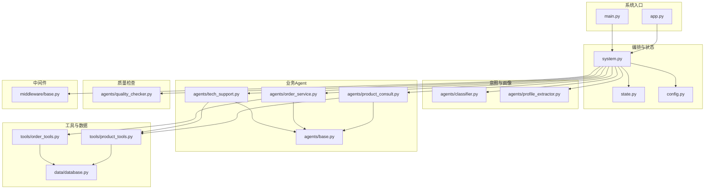
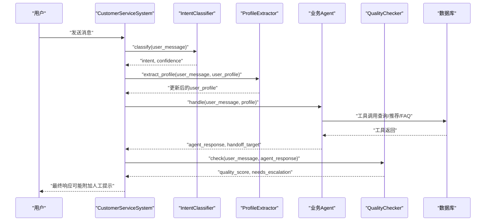
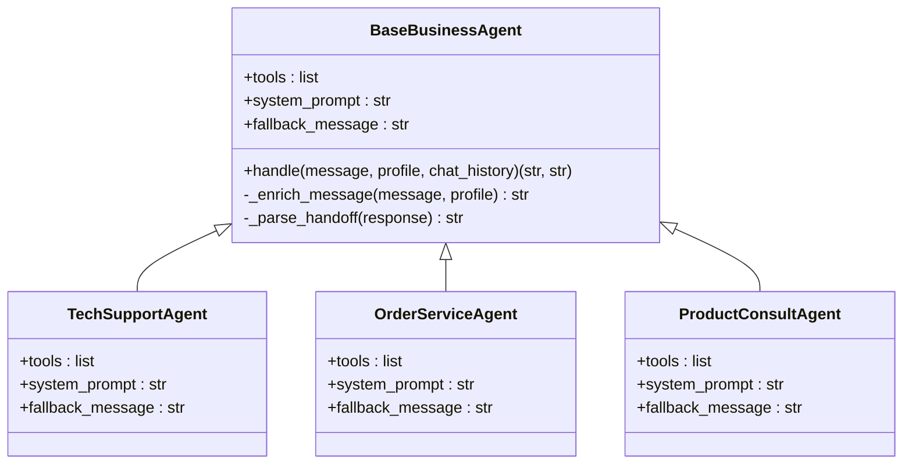
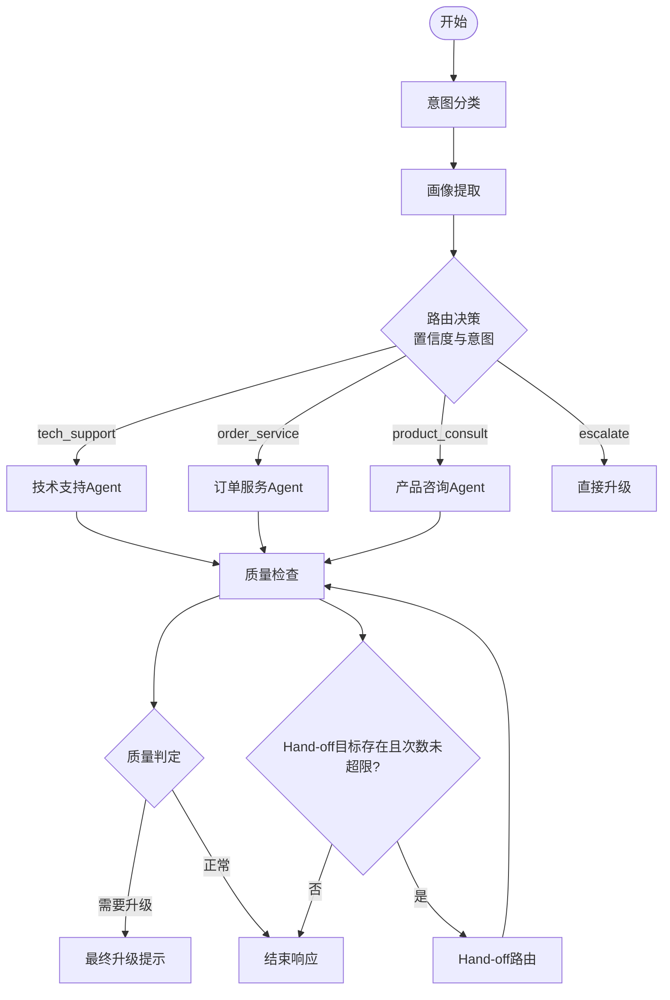
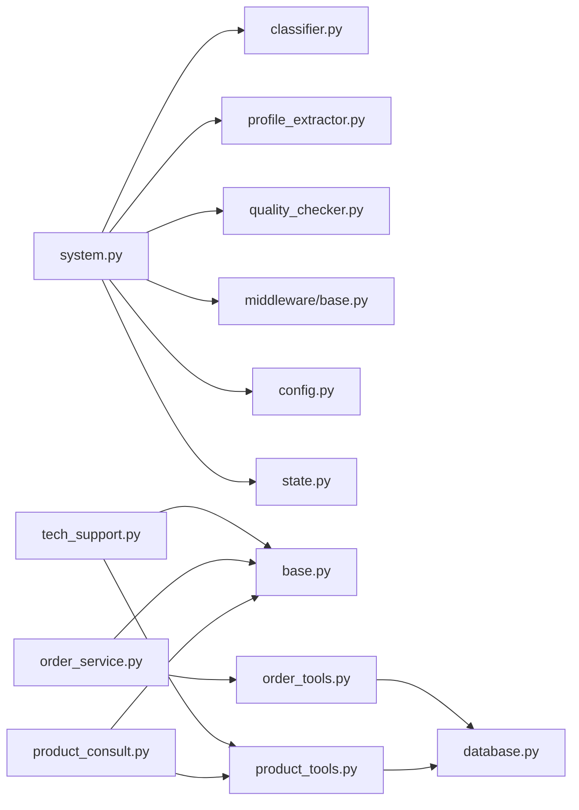
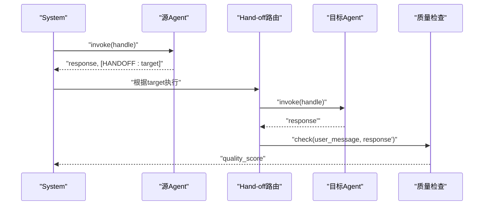

# Agent系统设计

<cite>
**本文引用的文件**
- [agents/base.py](file://agents/base.py)
- [agents/classifier.py](file://agents/classifier.py)
- [agents/profile_extractor.py](file://agents/profile_extractor.py)
- [agents/quality_checker.py](file://agents/quality_checker.py)
- [agents/tech_support.py](file://agents/tech_support.py)
- [agents/order_service.py](file://agents/order_service.py)
- [agents/product_consult.py](file://agents/product_consult.py)
- [system.py](file://system.py)
- [state.py](file://state.py)
- [config.py](file://config.py)
- [main.py](file://main.py)
- [app.py](file://app.py)
- [tools/order_tools.py](file://tools/order_tools.py)
- [tools/product_tools.py](file://tools/product_tools.py)
- [data/database.py](file://data/database.py)
- [middleware/base.py](file://middleware/base.py)
</cite>

## 目录
1. [引言](#引言)
2. [项目结构](#项目结构)
3. [核心组件](#核心组件)
4. [架构总览](#架构总览)
5. [详细组件分析](#详细组件分析)
6. [依赖关系分析](#依赖关系分析)
7. [性能考虑](#性能考虑)
8. [故障排查指南](#故障排查指南)
9. [结论](#结论)
10. [附录](#附录)

## 引言
本设计文档围绕多智能体客服系统展开，系统采用 LangGraph 工作流编排，通过“意图分类 → 用户画像提取 → 业务Agent处理 → 质量检查 → 响应/升级”的流水线实现自动化客户服务。系统强调可扩展性与可维护性，基类抽象、模板方法模式、中间件链、以及工具调用机制共同构成稳定的Agent体系。本文重点阐释：
- BaseBusinessAgent基类的设计理念与模板方法应用
- 各类Agent的职责边界与协作机制
- LCEL管道与create_agent模式的差异与适用场景
- Agent扩展开发指南与Hand-off流程
- 工具调用循环与状态传递机制

## 项目结构
系统采用按职责分层的模块组织方式：
- agents：各类Agent实现（基类与业务Agent）
- tools：可被Agent调用的工具函数
- data：数据库与种子数据
- middleware：中间件基础设施
- utils：工具与追踪辅助
- 核心入口：system.py（工作流编排）、main.py（命令行演示）、app.py（Streamlit UI）

图表来源
- [system.py:196-246](file://system.py#L196-L246)
- [agents/base.py:23-123](file://agents/base.py#L23-L123)
- [agents/tech_support.py:11-29](file://agents/tech_support.py#L11-L29)
- [agents/order_service.py:11-29](file://agents/order_service.py#L11-L29)
- [agents/product_consult.py:11-30](file://agents/product_consult.py#L11-L30)
- [tools/order_tools.py:15-50](file://tools/order_tools.py#L15-L50)
- [tools/product_tools.py:14-78](file://tools/product_tools.py#L14-L78)
- [data/database.py:104-161](file://data/database.py#L104-L161)
- [middleware/base.py:46-94](file://middleware/base.py#L46-L94)

章节来源
- [system.py:196-246](file://system.py#L196-L246)
- [state.py:28-58](file://state.py#L28-L58)
- [config.py:14-60](file://config.py#L14-L60)

## 核心组件
- BaseBusinessAgent：封装业务Agent的通用行为，统一工具注入、系统提示词、回退消息与Hand-off解析逻辑，子类仅需声明tools/system_prompt/fallback。
- CustomerServiceSystem：LangGraph工作流编排器，定义节点、路由与条件边，集成中间件链与持久化检查点。
- CustomerServiceState：LangGraph状态载体，承载用户消息、历史、画像、意图、质量评分、Hand-off目标与元信息。
- 中间件链MiddlewareChain：为节点函数注入before/after/on_error横切逻辑，便于日志、计时、错误处理与限流。

章节来源
- [agents/base.py:23-123](file://agents/base.py#L23-L123)
- [system.py:34-76](file://system.py#L34-L76)
- [state.py:28-58](file://state.py#L28-L58)
- [middleware/base.py:46-94](file://middleware/base.py#L46-L94)

## 架构总览
系统以LangGraph为核心，将意图分类、画像提取、业务Agent处理、质量检查与升级决策串联为有向无环图（DAG）工作流。状态在每轮请求中被重置关键字段，但用户画像通过Checkpointer按thread_id跨轮次保留，从而实现“多轮对话+画像累积”。

图表来源
- [system.py:79-147](file://system.py#L79-L147)
- [agents/classifier.py:40-63](file://agents/classifier.py#L40-L63)
- [agents/profile_extractor.py:41-81](file://agents/profile_extractor.py#L41-L81)
- [agents/quality_checker.py:41-63](file://agents/quality_checker.py#L41-L63)
- [tools/order_tools.py:15-50](file://tools/order_tools.py#L15-L50)
- [tools/product_tools.py:14-78](file://tools/product_tools.py#L14-L78)
- [data/database.py:104-161](file://data/database.py#L104-L161)

## 详细组件分析

### BaseBusinessAgent基类设计与模板方法
- 设计理念
  - 统一业务Agent的创建与调用流程：通过create_agent封装LLM+tools+system_prompt，屏蔽细节。
  - 个性化增强：将用户画像注入到prompt中，提升回复相关性与一致性。
  - 标准化输出：统一从messages[-1].content提取回复，并内置Hand-off解析。
- 关键抽象
  - 子类必须提供：tools（工具列表）、system_prompt（系统提示词）、fallback_message（回退消息）。
  - 常量：VALID_HANDOFF_TARGETS限定合法目标，防止非法跳转。
- 模板方法
  - handle为模板方法：固定流程为“消息增强 → 调用Agent → 解析Hand-off → 返回结果”。
  - _enrich_message与_parse_handoff为可覆写的策略方法，便于子类定制。
- 与LCEL对比
  - BaseBusinessAgent使用create_agent（LangChain Agent范式），适合“工具驱动”的任务执行。
  - LCEL（LangChain Expression Language）更适合纯LLM推理与结构化解析（如IntentClassifier、ProfileExtractor、QualityChecker）。

图表来源
- [agents/base.py:23-123](file://agents/base.py#L23-L123)
- [agents/tech_support.py:11-29](file://agents/tech_support.py#L11-L29)
- [agents/order_service.py:11-29](file://agents/order_service.py#L11-L29)
- [agents/product_consult.py:11-30](file://agents/product_consult.py#L11-L30)

章节来源
- [agents/base.py:23-123](file://agents/base.py#L23-L123)

### 意图分类器（IntentClassifier）
- 角色：将用户消息映射到业务意图（tech_support/order_service/product_consult/escalate），并给出置信度与原因。
- 实现要点
  - 使用ChatPromptTemplate + LLM + StrOutputParser构建LCEL管道。
  - 输出严格为JSON，包含intent/confidence/reason/language，失败时回退到escalate。
- 应用场景：作为LangGraph的起始节点，决定后续路由。

章节来源
- [agents/classifier.py:19-63](file://agents/classifier.py#L19-L63)

### 用户画像提取器（ProfileExtractor）
- 角色：从当前消息抽取预算、偏好、订单号、感兴趣产品、语言等字段，与既有画像合并。
- 实现要点
  - LCEL管道解析JSON，支持“明确提到才提取”的保守策略。
  - 合并策略：标量字段（budget、language）新值覆盖；列表字段（preferences等）去重并保持顺序。
- 应用场景：在“意图分类”之后执行，为后续业务Agent提供个性化上下文。

章节来源
- [agents/profile_extractor.py:17-92](file://agents/profile_extractor.py#L17-L92)

### 业务Agent（Tech/Order/Product）
- 共同特征
  - 继承BaseBusinessAgent，复用handle模板方法与Hand-off解析。
  - 各自绑定不同工具集：技术FAQ查询、订单查询/物流跟踪、产品搜索/推荐。
- 职责边界
  - TechSupportAgent：故障排除、使用帮助，必要时建议升级。
  - OrderServiceAgent：订单状态、物流跟踪、退换货咨询，强调准确性与主动提供信息。
  - ProductConsultAgent：产品介绍、按预算推荐、突出优势但不过度推销。
- 个性化增强：在system_prompt中强调利用用户画像中的预算、偏好、历史订单号等信息。

章节来源
- [agents/tech_support.py:11-29](file://agents/tech_support.py#L11-L29)
- [agents/order_service.py:11-29](file://agents/order_service.py#L11-L29)
- [agents/product_consult.py:11-30](file://agents/product_consult.py#L11-L30)
- [tools/order_tools.py:15-50](file://tools/order_tools.py#L15-L50)
- [tools/product_tools.py:14-78](file://tools/product_tools.py#L14-L78)
- [data/database.py:104-161](file://data/database.py#L104-L161)

### 质量检查器（QualityChecker）
- 角色：对业务Agent回复进行评分（相关性、完整性、专业性、有用性），综合得出总分与是否需要升级。
- 实现要点
  - LCEL管道接收user_message与agent_response，输出JSON评分与升级建议。
  - 若用户语言与回复语言不一致，适当降低相关性与有用性评分。
- 应用场景：在业务Agent之后执行，作为质量门禁，必要时触发人工升级。

章节来源
- [agents/quality_checker.py:16-63](file://agents/quality_checker.py#L16-L63)

### CustomerServiceSystem工作流编排
- 节点与路由
  - 节点：classify → extract_profile → tech/order/product → quality_check → escalate_final/handoff_route → respond
  - 路由：根据置信度与意图路由到对应Agent；质量检查后决定是否升级或Hand-off；Hand-off后重新进入质量检查。
- 状态管理
  - 每轮重置请求级字段（intent/quality_score/needs_escalation等），用户画像通过Checkpointer按thread_id跨轮次保留。
- 中间件链
  - 日志、计时、异常捕获、限流按注册顺序注入，wrap节点函数，实现横切关注点解耦。

图表来源
- [system.py:79-193](file://system.py#L79-L193)
- [system.py:159-184](file://system.py#L159-L184)

章节来源
- [system.py:34-305](file://system.py#L34-L305)

### 中间件基础设施（MiddlewareChain）
- 抽象与职责
  - Middleware：定义before_node/after_node/on_error三个钩子，实现横切关注点。
  - MiddlewareChain：按注册顺序依次执行中间件，wrap节点函数，注入执行前后与异常处理流程。
- 应用价值
  - 无需侵入节点内部即可统一增加日志、计时、错误处理与限流等功能。

章节来源
- [middleware/base.py:14-94](file://middleware/base.py#L14-L94)
- [system.py:58-64](file://system.py#L58-L64)

### 配置与阈值（config.py）
- 模型初始化：统一LLM实例，避免重复创建。
- 业务阈值：最小意图置信度与最小质量评分，决定是否升级。
- 持久化路径：Checkpointer数据库与业务数据库路径。
- 多语言支持：支持语言列表与默认语言。

章节来源
- [config.py:14-60](file://config.py#L14-L60)

### 工具调用循环与状态传递
- 工具调用循环
  - 业务Agent通过tools列表调用工具，工具访问数据库返回结构化结果，Agent据此生成回复。
  - 工具函数均使用装饰器声明，具备“工具说明”，便于LLM选择调用时机与参数。
- 状态传递
  - LangGraph通过State对象在节点间传递数据；每轮重置请求级字段，用户画像通过Checkpointer跨轮次保留。
  - Hand-off目标通过state.handoff_target传递，Hand-off路由节点根据目标再次执行业务Agent并重新质量检查。

章节来源
- [tools/order_tools.py:15-50](file://tools/order_tools.py#L15-L50)
- [tools/product_tools.py:14-78](file://tools/product_tools.py#L14-L78)
- [data/database.py:104-161](file://data/database.py#L104-L161)
- [system.py:93-104](file://system.py#L93-L104)
- [system.py:185-192](file://system.py#L185-L192)

## 依赖关系分析
- 组件耦合
  - system.py对各Agent、中间件、状态与配置有直接依赖；Agent对tools与config有间接依赖。
  - BaseBusinessAgent为业务Agent提供统一抽象，降低Agent间重复代码。
- 外部依赖
  - LangGraph（StateGraph、checkpointer）、LangChain LLM与工具框架。
  - SQLite数据库与SQLAlchemy ORM。
- 潜在风险
  - Agent间Hand-off目标需受控（通过VALID_HANDOFF_TARGETS），避免非法跳转。
  - 工具调用失败需有兜底策略，避免阻塞工作流。

图表来源
- [system.py:17-31](file://system.py#L17-L31)
- [agents/tech_support.py:7-8](file://agents/tech_support.py#L7-L8)
- [agents/order_service.py:7-8](file://agents/order_service.py#L7-L8)
- [agents/product_consult.py:7-8](file://agents/product_consult.py#L7-L8)
- [tools/order_tools.py:10-12](file://tools/order_tools.py#L10-L12)
- [tools/product_tools.py:5-11](file://tools/product_tools.py#L5-L11)
- [data/database.py:15-18](file://data/database.py#L15-L18)

章节来源
- [system.py:17-31](file://system.py#L17-L31)
- [agents/base.py:33-39](file://agents/base.py#L33-L39)

## 性能考虑
- LLM调用成本控制
  - 统一模型实例与阈值配置，减少重复初始化与无效调用。
  - 通过质量检查与Hand-off减少无效尝试，提高成功率。
- 工具调用优化
  - 工具函数尽量精确匹配关键词，减少模糊查询开销。
  - 数据库查询使用索引列（如订单号、关键词），避免全表扫描。
- 状态持久化
  - Checkpointer按thread_id保存状态，避免重复计算；优先使用SQLite持久化，失败回退内存存储。
- 中间件开销
  - 中间件按需启用，避免过多钩子影响吞吐。

## 故障排查指南
- 意图分类失败
  - 现象：直接升级或返回escalate。
  - 排查：确认JSON输出格式是否符合预期；检查语言检测与置信度阈值。
- 画像提取异常
  - 现象：画像字段缺失或重复。
  - 排查：确认消息中是否明确提及；检查合并策略是否正确去重与覆盖。
- 业务Agent无响应或报错
  - 现象：fallback_message返回或异常。
  - 排查：检查tools是否可用、数据库连接是否正常、Hand-off目标是否有效。
- 质量检查触发升级
  - 现象：附加人工提示。
  - 排查：查看评分明细与原因；确认语言一致性与回复完整性。
- 中间件异常
  - 现象：节点执行异常未被捕获。
  - 排查：检查中间件on_error钩子是否正确实现与注册。

章节来源
- [agents/classifier.py:50-62](file://agents/classifier.py#L50-L62)
- [agents/profile_extractor.py:51-55](file://agents/profile_extractor.py#L51-L55)
- [agents/quality_checker.py:51-62](file://agents/quality_checker.py#L51-L62)
- [middleware/base.py:77-82](file://middleware/base.py#L77-L82)

## 结论
该多智能体系统通过“意图分类 → 画像提取 → 业务Agent → 质量检查 → 升级/Hand-off”的流水线实现了高可扩展、可维护的自动化客服。BaseBusinessAgent以模板方法模式统一了业务Agent的行为，结合LCEL与create_agent两种模式分别适配结构化解析与工具驱动的任务。LangGraph状态机确保了跨轮次的上下文一致性与可控的流程编排。通过中间件链与严格的阈值控制，系统在复杂场景下仍能保持稳定与可诊断性。

## 附录

### LCEL管道模式与create_agent模式的区别与应用
- LCEL（LangChain Expression Language）
  - 适用于纯LLM推理与结构化解析，如意图分类、画像提取、质量检查。
  - 特点：声明式组合、易于调试、输出可控。
- create_agent
  - 适用于工具驱动的业务Agent，如技术支持、订单服务、产品咨询。
  - 特点：自动工具选择与调用、可注入系统提示词与回退消息、支持Hand-off。

章节来源
- [agents/classifier.py:40-50](file://agents/classifier.py#L40-L50)
- [agents/profile_extractor.py:51-52](file://agents/profile_extractor.py#L51-L52)
- [agents/quality_checker.py:51-52](file://agents/quality_checker.py#L51-L52)
- [agents/base.py:35-39](file://agents/base.py#L35-L39)

### Agent扩展开发指南
- 步骤
  - 新建Agent类继承BaseBusinessAgent，设置tools、system_prompt、fallback_message。
  - 在system.py中注册Agent实例与名称映射，以便Hand-off动态路由。
  - 在路由函数中添加新意图分支，或复用现有分支。
  - 如需工具，新增工具函数并在Agent中注册。
- 注意事项
  - 保持tools的“工具说明”清晰，便于LLM选择调用。
  - 控制Hand-off目标集合，避免循环跳转。
  - 通过中间件链统一埋点与监控。

章节来源
- [agents/base.py:23-39](file://agents/base.py#L23-L39)
- [system.py:43-56](file://system.py#L43-L56)
- [system.py:159-169](file://system.py#L159-L169)

### Agent间通信机制与Hand-off流程
- 通信载体：CustomerServiceState在节点间传递，Hand-off目标通过state.handoff_target携带。
- Hand-off限制：最大Hand-off次数由系统常量控制，防止无限循环。
- 流程
  - 业务Agent返回Hand-off标记与响应。
  - Hand-off路由节点根据目标重新执行对应Agent，并清空标记。
  - 重新进入质量检查，确保最终回复质量。

图表来源
- [agents/base.py:101-113](file://agents/base.py#L101-L113)
- [system.py:185-192](file://system.py#L185-L192)
- [system.py:134-146](file://system.py#L134-L146)