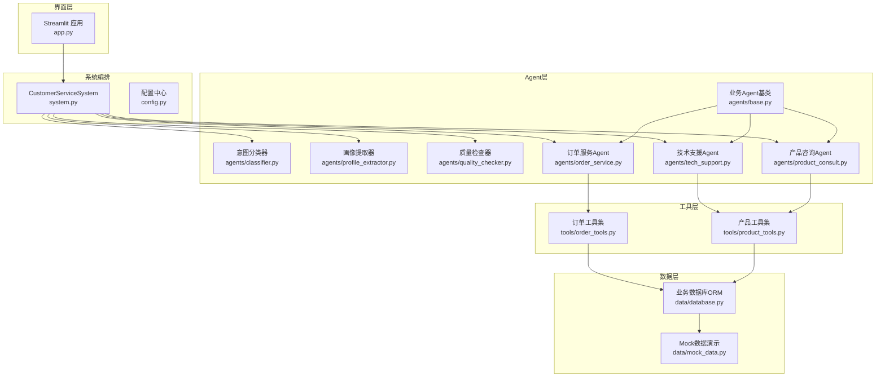
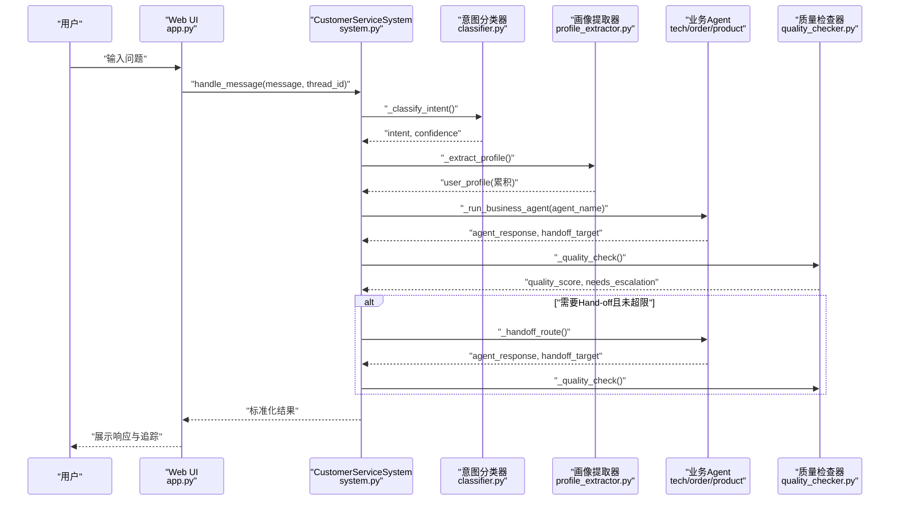
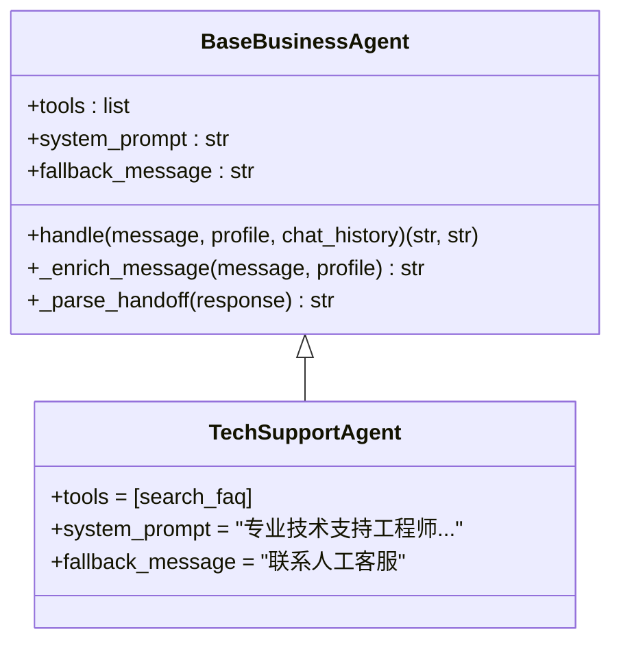
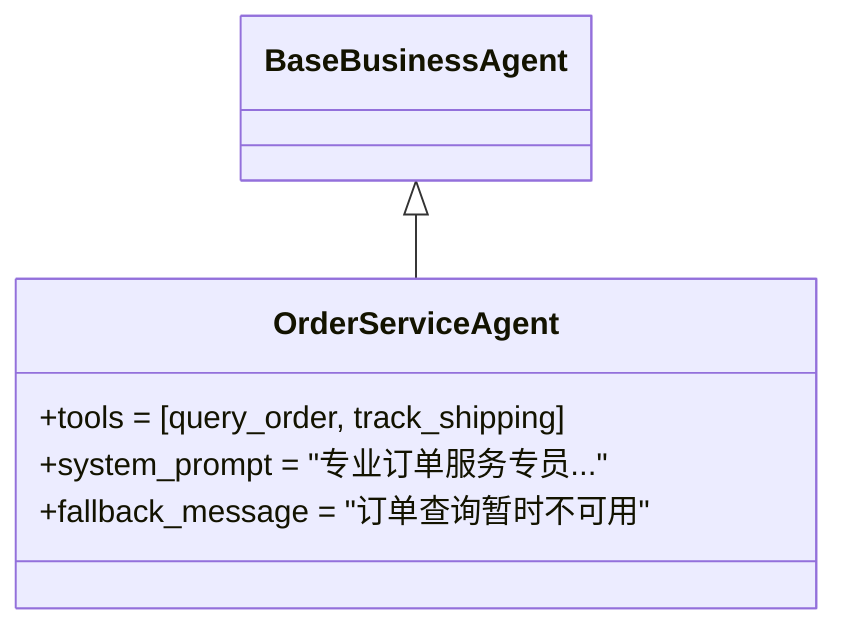
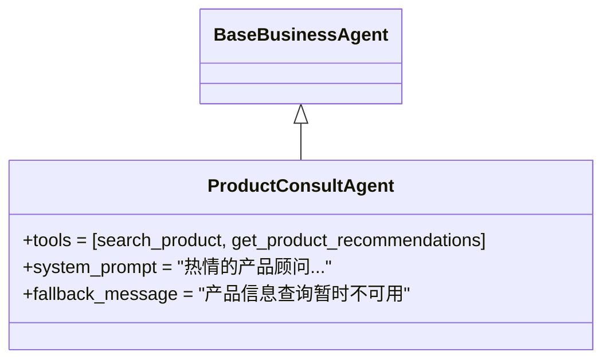
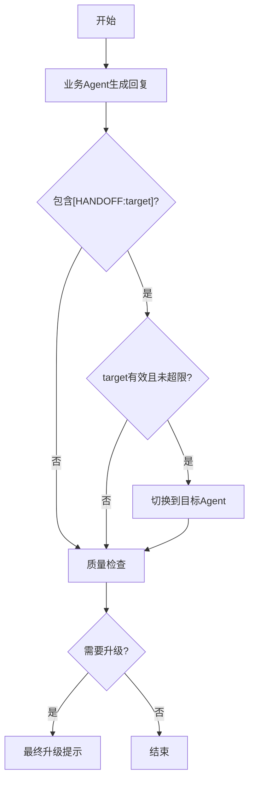
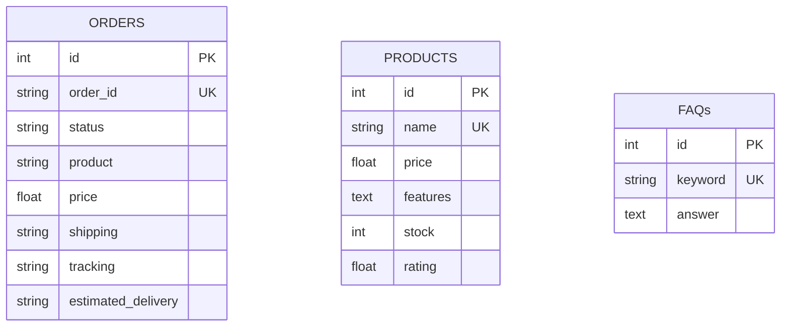
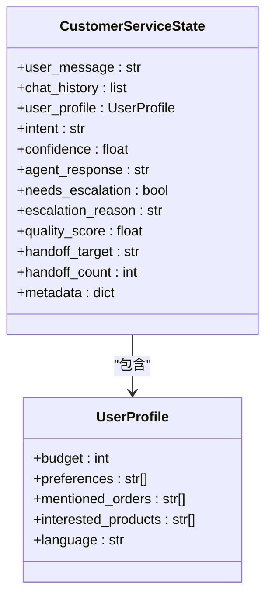
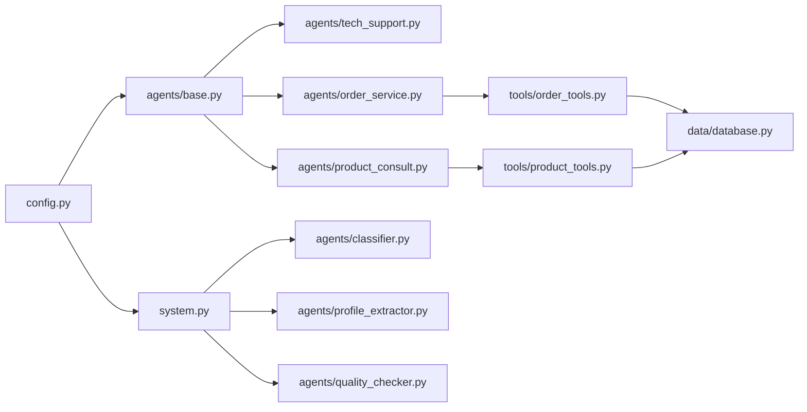

# 业务Agent实现

<cite>
**本文引用的文件**
- [agents/base.py](file://agents/base.py)
- [agents/tech_support.py](file://agents/tech_support.py)
- [agents/order_service.py](file://agents/order_service.py)
- [agents/product_consult.py](file://agents/product_consult.py)
- [system.py](file://system.py)
- [app.py](file://app.py)
- [tools/order_tools.py](file://tools/order_tools.py)
- [tools/product_tools.py](file://tools/product_tools.py)
- [data/database.py](file://data/database.py)
- [state.py](file://state.py)
- [config.py](file://config.py)
- [agents/classifier.py](file://agents/classifier.py)
- [agents/profile_extractor.py](file://agents/profile_extractor.py)
- [agents/quality_checker.py](file://agents/quality_checker.py)
- [data/mock_data.py](file://data/mock_data.py)
</cite>

## 目录
1. [引言](#引言)
2. [项目结构](#项目结构)
3. [核心组件](#核心组件)
4. [架构总览](#架构总览)
5. [详细组件分析](#详细组件分析)
6. [依赖分析](#依赖分析)
7. [性能考虑](#性能考虑)
8. [故障排查指南](#故障排查指南)
9. [结论](#结论)
10. [附录](#附录)

## 引言
本文件面向希望深入理解并扩展“多Agent智能客服系统”的开发者与运维人员，系统梳理技术支援Agent、订单服务Agent与产品咨询Agent的设计与实现差异，详解三者专业领域、工具集配置与系统提示词定制，阐述Agent间的协作机制与Hand-off流程，提供使用示例与最佳实践，并给出扩展新业务Agent类型的开发指南、性能优化与错误处理策略。

## 项目结构
系统采用LangGraph编排工作流，围绕“意图分类 → 画像提取 → 业务Agent → 质量检查 → 响应/升级”主线组织各模块。Agent层通过统一基类封装公共逻辑，业务Agent仅需声明工具集与系统提示词；工具层对接数据库或外部API；状态层通过Checkpointer持久化跨轮次用户画像；UI层提供Web交互与追踪展示。

图表来源
- [system.py:196-246](file://system.py#L196-L246)
- [agents/base.py:23-123](file://agents/base.py#L23-L123)
- [agents/tech_support.py:11-29](file://agents/tech_support.py#L11-L29)
- [agents/order_service.py:11-29](file://agents/order_service.py#L11-L29)
- [agents/product_consult.py:11-30](file://agents/product_consult.py#L11-L30)
- [tools/order_tools.py:15-50](file://tools/order_tools.py#L15-L50)
- [tools/product_tools.py:14-78](file://tools/product_tools.py#L14-L78)
- [data/database.py:104-161](file://data/database.py#L104-L161)
- [app.py:14-177](file://app.py#L14-L177)

章节来源
- [system.py:34-76](file://system.py#L34-L76)
- [app.py:14-177](file://app.py#L14-L177)

## 核心组件
- 业务Agent基类：封装LLM初始化、工具注入、用户画像增强、Hand-off解析与回退消息策略，子类仅需声明tools/system_prompt/fallback。
- 业务Agent实现：技术支援Agent、订单服务Agent、产品咨询Agent，分别绑定不同工具集与系统提示词。
- 工具集：订单工具（查询订单、物流跟踪）、产品工具（产品检索、按预算推荐、FAQ查询）。
- 数据层：SQLAlchemy ORM封装SQLite，提供订单、产品、FAQ三张表的查询接口。
- 状态与持久化：CustomerServiceState承载工作流状态，Checkpointer按thread_id跨轮次保存user_profile。
- 编排系统：CustomerServiceSystem构建LangGraph工作流，串联分类、画像、业务Agent、质量检查与升级节点，并实现Hand-off路由与最大Hand-off次数限制。

章节来源
- [agents/base.py:23-123](file://agents/base.py#L23-L123)
- [agents/tech_support.py:11-29](file://agents/tech_support.py#L11-L29)
- [agents/order_service.py:11-29](file://agents/order_service.py#L11-L29)
- [agents/product_consult.py:11-30](file://agents/product_consult.py#L11-L30)
- [tools/order_tools.py:15-50](file://tools/order_tools.py#L15-L50)
- [tools/product_tools.py:14-78](file://tools/product_tools.py#L14-L78)
- [data/database.py:25-161](file://data/database.py#L25-L161)
- [state.py:28-58](file://state.py#L28-L58)
- [system.py:34-76](file://system.py#L34-L76)

## 架构总览
系统以LangGraph为核心，按轮次执行如下流程：
- 输入消息经意图分类确定路由；
- 进入画像提取节点，合并并累积用户画像；
- 路由到对应业务Agent，注入用户画像与工具集；
- 质量检查节点评估回复质量，必要时升级；
- 若业务Agent返回Hand-off标记，则按目标再次路由，最多允许两次Hand-off；
- 最终输出标准化结果，包含响应、意图、置信度、质量评分、是否升级、用户画像与元信息。

图表来源
- [system.py:79-156](file://system.py#L79-L156)
- [system.py:159-193](file://system.py#L159-L193)
- [system.py:250-299](file://system.py#L250-L299)
- [app.py:142-173](file://app.py#L142-L173)

章节来源
- [system.py:196-246](file://system.py#L196-L246)
- [app.py:14-177](file://app.py#L14-L177)

## 详细组件分析

### 技术支援Agent（TechSupportAgent）
- 专业领域：故障排除、使用帮助、FAQ查询。
- 工具集：search_faq（产品FAQ检索）。
- 系统提示词：强调“分析问题、提供步骤、使用FAQ工具、必要时建议人工支持”，并允许参考用户画像中的预算/偏好/订单等信息。
- Hand-off能力：可返回[HANDOFF:target]标记进行跨Agent流转。
- 回退策略：fallback_message提示联系人工客服。

图表来源
- [agents/base.py:23-123](file://agents/base.py#L23-L123)
- [agents/tech_support.py:11-29](file://agents/tech_support.py#L11-L29)

章节来源
- [agents/tech_support.py:11-29](file://agents/tech_support.py#L11-L29)
- [tools/product_tools.py:64-78](file://tools/product_tools.py#L64-L78)

### 订单服务Agent（OrderServiceAgent）
- 专业领域：订单查询、物流跟踪、退换货咨询。
- 工具集：query_order（按订单号查询）、track_shipping（按物流单号跟踪）。
- 系统提示词：强调“准确完整信息、主动提供、礼貌询问缺失信息、优先使用画像中的订单号”。
- Hand-off能力：可返回[HANDOFF:target]标记。
- 回退策略：fallback_message提示稍后再试。

图表来源
- [agents/base.py:23-123](file://agents/base.py#L23-L123)
- [agents/order_service.py:11-29](file://agents/order_service.py#L11-L29)

章节来源
- [agents/order_service.py:11-29](file://agents/order_service.py#L11-L29)
- [tools/order_tools.py:15-50](file://tools/order_tools.py#L15-L50)

### 产品咨询Agent（ProductConsultAgent）
- 专业领域：产品介绍、功能讲解、按预算推荐。
- 工具集：search_product（按关键词检索）、get_product_recommendations（按预算推荐）。
- 系统提示词：强调“热情亲和、突出优势、按需推荐、避免过度推销、结合预算偏好筛选”。
- Hand-off能力：可返回[HANDOFF:target]标记。
- 回退策略：fallback_message提示稍后再试。

图表来源
- [agents/base.py:23-123](file://agents/base.py#L23-L123)
- [agents/product_consult.py:11-30](file://agents/product_consult.py#L11-L30)

章节来源
- [agents/product_consult.py:11-30](file://agents/product_consult.py#L11-L30)
- [tools/product_tools.py:14-78](file://tools/product_tools.py#L14-L78)

### 业务Agent协作与Hand-off流程
- Hand-off触发：业务Agent在回复中包含[HANDOFF:agent_name]标记。
- 目标校验：仅允许tech_support、order_service、product_consult三类目标。
- 流转机制：系统将请求转发给目标Agent，清空handoff标记并累计handoff_count，最多允许两次Hand-off。
- 质量检查：每次Hand-off后均重新进入质量检查，确保服务质量。

图表来源
- [agents/base.py:101-114](file://agents/base.py#L101-L114)
- [system.py:171-193](file://system.py#L171-L193)
- [system.py:37-38](file://system.py#L37-L38)

章节来源
- [agents/base.py:101-114](file://agents/base.py#L101-L114)
- [system.py:93-104](file://system.py#L93-L104)
- [system.py:171-193](file://system.py#L171-L193)

### 工具与数据层
- 订单工具：query_order按订单号查询，track_shipping按物流单号查询；若无精确匹配，按单号前缀进行兜底提示。
- 产品工具：search_product按关键词检索产品，get_product_recommendations按预算返回高评分产品，search_faq按关键词检索FAQ。
- 数据层：SQLAlchemy ORM封装SQLite，提供订单、产品、FAQ三表查询；演示阶段可替换为真实数据库或外部API。

图表来源
- [data/database.py:25-83](file://data/database.py#L25-L83)

章节来源
- [tools/order_tools.py:15-50](file://tools/order_tools.py#L15-L50)
- [tools/product_tools.py:14-78](file://tools/product_tools.py#L14-L78)
- [data/database.py:104-161](file://data/database.py#L104-L161)

### 状态与持久化
- CustomerServiceState：承载用户消息、历史、意图、置信度、Agent回复、是否升级、质量评分、Hand-off目标与计数、元信息等。
- Checkpointer：按thread_id持久化状态，实现跨轮次user_profile累积；优先SqliteSaver，失败回退InMemorySaver。

图表来源
- [state.py:28-58](file://state.py#L28-L58)
- [system.py:66-75](file://system.py#L66-L75)

章节来源
- [state.py:14-58](file://state.py#L14-L58)
- [system.py:250-299](file://system.py#L250-L299)

### 使用示例与最佳实践
- 示例一：技术问题咨询
  - 用户输入：“我的蓝牙耳机无法连接怎么办？”
  - 系统：意图分类→画像提取→技术支援Agent→质量检查→输出。
  - 最佳实践：Agent提示中包含“使用FAQ工具查找相关解决方案”，并在回复中结合用户画像中的偏好信息。
- 示例二：订单状态查询
  - 用户输入：“我想查一下我的订单ORD001。”
  - 系统：意图分类→画像提取→订单服务Agent→质量检查→输出。
  - 最佳实践：若用户画像中已存在订单号，优先使用；若缺少订单号，礼貌询问。
- 示例三：产品推荐
  - 用户输入：“我想要一款降噪耳机，预算3000元以内。”
  - 系统：意图分类→画像提取→产品咨询Agent→质量检查→输出。
  - 最佳实践：结合预算与偏好调用推荐工具，避免过度推销。

章节来源
- [agents/tech_support.py:16-28](file://agents/tech_support.py#L16-L28)
- [agents/order_service.py:16-28](file://agents/order_service.py#L16-L28)
- [agents/product_consult.py:16-29](file://agents/product_consult.py#L16-L29)

### 扩展开发指南：新增业务Agent类型
- 步骤一：创建Agent类
  - 继承BaseBusinessAgent，声明tools与system_prompt，按需设置fallback_message。
- 步骤二：选择工具集
  - 从tools/order_tools.py或tools/product_tools.py中选择所需工具，或新增自定义工具。
- 步骤三：注册到系统
  - 在CustomerServiceSystem中新增Agent实例与映射，加入_handoff路由与节点。
- 步骤四：配置阈值与路由
  - 在意图分类器中增加对应意图类别，或调整最小置信度阈值。
- 步骤五：测试与验证
  - 使用Web UI进行端到端测试，关注Hand-off、质量检查与升级逻辑。

章节来源
- [agents/base.py:23-123](file://agents/base.py#L23-L123)
- [system.py:43-56](file://system.py#L43-L56)
- [system.py:159-193](file://system.py#L159-L193)

## 依赖分析
- 组件耦合与内聚
  - Agent层与工具层通过LangChain工具接口解耦，便于替换与扩展。
  - 系统编排通过LangGraph节点函数与条件边实现高内聚、低耦合的工作流。
- 外部依赖
  - LLM模型通过config.py集中初始化，统一实例复用。
  - 数据访问通过SQLAlchemy ORM抽象，便于替换真实数据库。
- 循环依赖
  - 未发现直接循环导入；系统通过字符串映射与节点函数间接通信，避免循环依赖。

图表来源
- [config.py:31](file://config.py#L31)
- [system.py:43-56](file://system.py#L43-L56)
- [agents/base.py:35-39](file://agents/base.py#L35-L39)

章节来源
- [system.py:196-246](file://system.py#L196-L246)
- [config.py:30-31](file://config.py#L30-L31)

## 性能考虑
- LLM实例复用：所有Agent共享同一模型实例，减少初始化开销。
- 工具调用优化：工具函数内部进行精确匹配优先、模糊匹配兜底，避免全表扫描；建议在生产环境为高频字段建立索引。
- 持久化策略：优先使用SqliteSaver，失败回退InMemorySaver，保证系统可用性。
- 并发与限流：中间件链包含限流中间件，建议结合部署规模调整限流阈值。
- UI渲染：Web UI按轮次刷新，避免重复计算；建议对长对话分页展示。

## 故障排查指南
- 意图分类失败
  - 现象：直接进入升级节点。
  - 排查：检查意图分类提示词与最小置信度阈值；确认消息语言与系统支持语言一致。
- 工具调用异常
  - 现象：Agent回复包含“未找到/查询失败”。
  - 排查：核对工具参数与数据库表结构；确认数据层查询逻辑与Mock数据一致性。
- Hand-off循环
  - 现象：多次Hand-off仍无法解决。
  - 排查：检查MAX_HANDOFFS限制与目标Agent有效性；确认回复中[HANDOFF:target]格式正确。
- 质量检查不通过
  - 现象：系统提示升级。
  - 排查：优化Agent提示词与工具调用准确性；关注多语言场景下的相关性评分。
- 持久化失败
  - 现象：SqliteSaver初始化失败。
  - 排查：检查数据库路径权限与文件是否存在；确认回退到InMemorySaver的兼容性。

章节来源
- [system.py:171-193](file://system.py#L171-L193)
- [system.py:66-75](file://system.py#L66-L75)
- [agents/quality_checker.py:41-63](file://agents/quality_checker.py#L41-L63)
- [config.py:35-39](file://config.py#L35-L39)

## 结论
该系统通过统一的业务Agent基类与LangGraph编排，实现了意图分类、画像累积、业务Agent处理、质量检查与Hand-off升级的完整闭环。技术支援、订单服务与产品咨询三大Agent在工具集与提示词上差异化设计，满足不同业务场景需求；系统具备良好的扩展性与可观测性，适合进一步引入新Agent类型与优化性能。

## 附录
- 配置项说明
  - LLM模型：统一实例初始化，API Key来自环境变量。
  - 阈值：最小意图置信度与最小质量评分。
  - 持久化：Checkpointer数据库路径与业务数据库路径。
- 数据库表结构
  - 订单表、产品表、FAQ表，提供基础查询接口。
- Mock数据
  - 演示阶段的订单、产品与FAQ数据，便于快速验证。

章节来源
- [config.py:20-60](file://config.py#L20-L60)
- [data/database.py:25-83](file://data/database.py#L25-L83)
- [data/mock_data.py:7-67](file://data/mock_data.py#L7-L67)