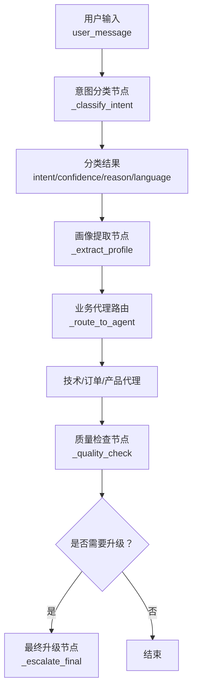
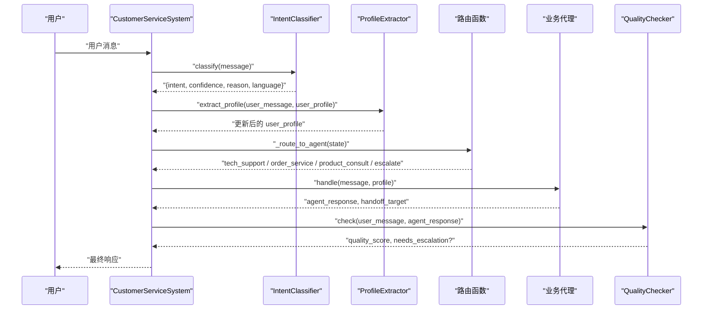
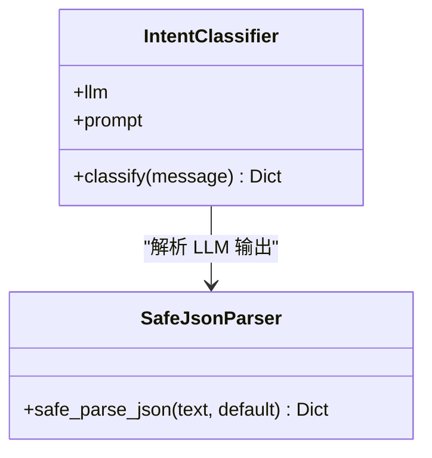
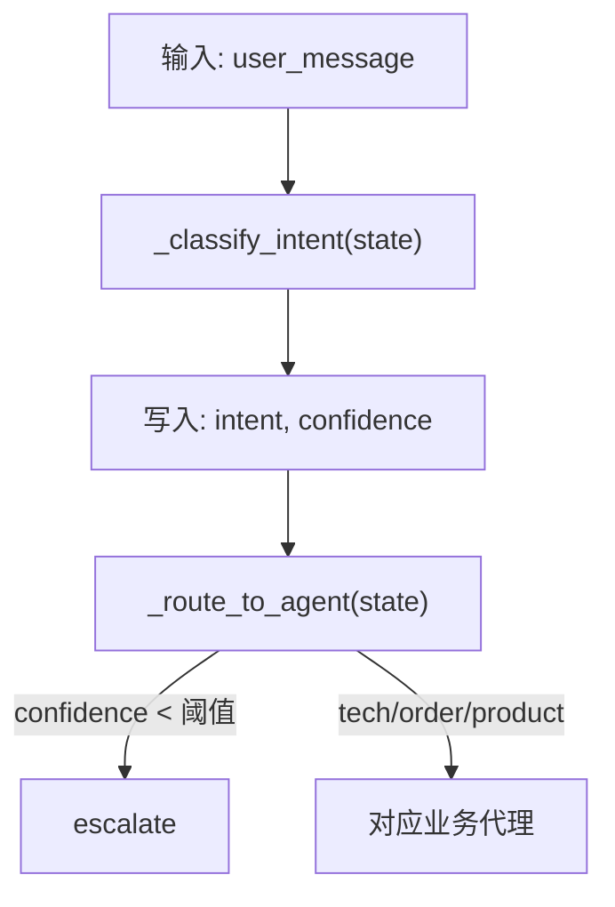
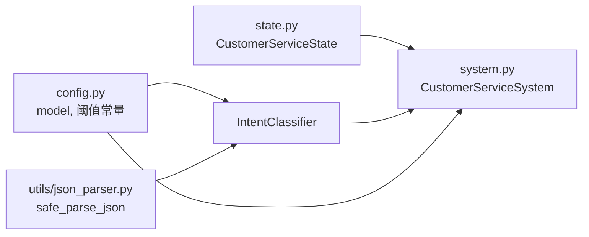

# 意图分类器

<cite>
**本文引用的文件**
- [agents/classifier.py](file://agents/classifier.py)
- [system.py](file://system.py)
- [config.py](file://config.py)
- [state.py](file://state.py)
- [utils/json_parser.py](file://utils/json_parser.py)
- [README.md](file://README.md)
</cite>

## 目录
1. [简介](#简介)
2. [项目结构](#项目结构)
3. [核心组件](#核心组件)
4. [架构总览](#架构总览)
5. [详细组件分析](#详细组件分析)
6. [依赖关系分析](#依赖关系分析)
7. [性能考量](#性能考量)
8. [故障排查指南](#故障排查指南)
9. [结论](#结论)
10. [附录](#附录)

## 简介
本文件面向“意图分类器”的使用者与维护者，系统性阐述其在多智能体客户服务中心中的作用、工作原理、实现细节、数据格式与后续处理流程，并提供使用示例、评估方法与优化策略。该分类器采用基于 LLM 的 LCEL 管道，将用户消息转化为标准化的意图标签、置信度与原因，并驱动后续的画像提取、业务代理路由、质量检查与人工升级决策。

## 项目结构
意图分类器位于 agents/classifier.py，是 LangGraph 工作流中的首个节点，负责将用户输入映射到预定义的意图类别，并为后续业务路由提供依据。系统通过配置中心统一注入模型实例，通过状态对象在多轮对话中传递分类结果与置信度。

图表来源
- [system.py:79-84](file://system.py#L79-L84)
- [system.py:159-170](file://system.py#L159-L170)
- [system.py:134-147](file://system.py#L134-L147)

章节来源
- [README.md:25-44](file://README.md#L25-L44)
- [system.py:79-84](file://system.py#L79-L84)

## 核心组件
- 意图分类器 IntentClassifier：基于 LLM 的 LCEL 管道，接收用户消息，返回标准化的意图、置信度、原因与语言代码。
- 系统 CustomerServiceSystem：封装 LangGraph 工作流，将分类器、画像提取器、业务代理、质量检查器与升级节点串联。
- 配置中心 config：提供模型实例、阈值常量与持久化路径。
- 状态对象 state：定义工作流中各节点共享的数据结构，包括 intent、confidence、agent_response 等。

章节来源
- [agents/classifier.py:19-63](file://agents/classifier.py#L19-L63)
- [system.py:34-76](file://system.py#L34-L76)
- [config.py:28-46](file://config.py#L28-L46)
- [state.py:28-58](file://state.py#L28-L58)

## 架构总览
意图分类器在系统中的位置如下：
- 输入：用户消息 user_message
- 输出：intent、confidence、reason、language
- 驱动：系统根据最小置信度阈值决定是否直接升级或进入业务代理
- 后续：质量检查与 Hand-off 协作机制进一步优化用户体验

图表来源
- [system.py:79-84](file://system.py#L79-L84)
- [system.py:86-91](file://system.py#L86-L91)
- [system.py:159-170](file://system.py#L159-L170)
- [system.py:134-147](file://system.py#L134-L147)

## 详细组件分析

### 意图分类器 IntentClassifier
- 角色定位：系统入口节点，负责将自然语言意图转化为结构化输出，为后续路由提供依据。
- Prompt 设计：包含明确的意图类别、返回格式约束与语言检测要求，确保 LLM 输出稳定且可解析。
- LCEL 管道：prompt → LLM → StrOutputParser，保证链路简洁、可观察性强。
- 容错处理：使用安全 JSON 解析器，若 LLM 输出不符合预期，返回兜底结果（escalate）。

图表来源
- [agents/classifier.py:19-63](file://agents/classifier.py#L19-L63)
- [utils/json_parser.py:10-51](file://utils/json_parser.py#L10-L51)

章节来源
- [agents/classifier.py:19-63](file://agents/classifier.py#L19-L63)
- [utils/json_parser.py:10-51](file://utils/json_parser.py#L10-L51)

### 系统 CustomerServiceSystem 的分类节点
- 节点实现：_classify_intent 从分类器获取结果，写入 state 的 intent 与 confidence 字段。
- 阈值控制：_route_to_agent 根据 MIN_INTENT_CONFIDENCE 决定是否直接升级。
- 与状态的交互：通过 state 对象在多轮对话中传递 intent 与 confidence。

图表来源
- [system.py:79-84](file://system.py#L79-L84)
- [system.py:159-170](file://system.py#L159-L170)
- [config.py:35-39](file://config.py#L35-L39)

章节来源
- [system.py:79-84](file://system.py#L79-L84)
- [system.py:159-170](file://system.py#L159-L170)
- [config.py:35-39](file://config.py#L35-L39)

### 分类结果格式与后续处理
- 输出字段：
  - intent：意图类别（tech_support / order_service / product_consult / escalate）
  - confidence：置信度（0.0~1.0）
  - reason：分类原因（字符串）
  - language：用户消息语言代码（如 zh / en / ja / ko）
- 兜底策略：当 JSON 解析失败或缺少 intent 字段时，返回 escalate 并设置默认置信度。
- 后续处理：
  - 低置信度直接升级
  - 高置信度进入业务代理
  - 业务代理可发起 Hand-off，系统再次路由
  - 质量检查不达标时附加人工提示

章节来源
- [agents/classifier.py:33-38](file://agents/classifier.py#L33-L38)
- [agents/classifier.py:53-62](file://agents/classifier.py#L53-L62)
- [system.py:159-170](file://system.py#L159-L170)
- [system.py:134-147](file://system.py#L134-L147)

### 使用示例
- 命令行模式：通过 main.py 的交互循环调用系统处理消息，系统内部会调用分类器。
- Web UI 模式：通过 Streamlit 界面输入消息，系统 handle_message 会依次执行分类、画像提取、路由、质量检查等节点。
- 直接调用分类器：可直接实例化 IntentClassifier 并调用 classify 方法，获取标准化结果。

章节来源
- [README.md:85-93](file://README.md#L85-L93)
- [system.py:250-299](file://system.py#L250-L299)
- [agents/classifier.py:40-62](file://agents/classifier.py#L40-L62)

## 依赖关系分析
- 模型依赖：config.py 初始化全局 model，所有 Agent 与分类器共享同一模型实例，降低资源开销。
- 状态依赖：state.py 定义了工作流共享状态，分类结果与置信度作为状态的一部分参与后续节点。
- 容错依赖：utils/json_parser.py 提供安全 JSON 解析，避免 LLM 输出格式异常导致的崩溃。
- 阈值依赖：config.py 的 MIN_INTENT_CONFIDENCE 控制分类结果的路由策略。

图表来源
- [config.py:28-46](file://config.py#L28-L46)
- [state.py:28-58](file://state.py#L28-L58)
- [system.py:34-76](file://system.py#L34-L76)
- [utils/json_parser.py:10-51](file://utils/json_parser.py#L10-L51)

章节来源
- [config.py:28-46](file://config.py#L28-L46)
- [state.py:28-58](file://state.py#L28-L58)
- [system.py:34-76](file://system.py#L34-L76)
- [utils/json_parser.py:10-51](file://utils/json_parser.py#L10-L51)

## 性能考量
- 模型实例复用：config.py 中的 model 为全局单例，避免重复初始化带来的延迟与资源浪费。
- LCEL 管道轻量化：分类器仅包含 prompt → LLM → StrOutputParser，链路短、可观察性强。
- 阈值裁剪：通过 MIN_INTENT_CONFIDENCE 在早期过滤低质量意图，减少不必要的业务代理调用。
- 中间件观测：系统内置计时与日志中间件，便于定位慢节点与异常路径。

章节来源
- [config.py:30-31](file://config.py#L30-L31)
- [system.py:58-64](file://system.py#L58-L64)
- [config.py:35-39](file://config.py#L35-L39)

## 故障排查指南
- LLM 输出格式异常
  - 现象：分类器返回的 JSON 不符合预期，或被 Markdown 代码块包裹。
  - 处理：safe_parse_json 会剥离代码块并尝试解析；若仍失败，返回 escalate 兜底。
- 低置信度导致误升级
  - 现象：用户表达模糊但分类器给出较低置信度，系统直接升级。
  - 处理：提高 MIN_INTENT_CONFIDENCE 阈值，或优化分类器 prompt 与示例。
- 业务代理 Hand-off 循环
  - 现象：代理间互相移交导致循环。
  - 处理：系统限制 MAX_HANDOFFS，超过次数后停止移交并进入质量检查。
- 语言检测与回复不一致
  - 现象：分类器检测语言与业务代理回复语言不一致。
  - 处理：分类器返回 language 字段，业务代理根据用户画像语言偏好切换回复语言。

章节来源
- [utils/json_parser.py:10-51](file://utils/json_parser.py#L10-L51)
- [system.py:37-38](file://system.py#L37-L38)
- [system.py:159-170](file://system.py#L159-L170)
- [agents/classifier.py:33-38](file://agents/classifier.py#L33-L38)
- [agents/base.py:101-113](file://agents/base.py#L101-L113)

## 结论
意图分类器是多智能体客服系统的关键入口，通过标准化的输出格式与稳健的容错机制，为后续的画像提取、业务代理路由、质量检查与人工升级提供了可靠基础。配合系统级的阈值控制、Hand-off 协作与可观测性中间件，整体工作流具备良好的稳定性与可维护性。

## 附录

### 分类算法与实现要点
- 算法选择：基于 LLM 的少样本分类，通过精心设计的 prompt 与返回格式约束，确保输出可解析。
- 实现方式：LCEL 管道（prompt → LLM → StrOutputParser），便于调试与扩展。
- 训练数据准备：无需显式训练集；通过 prompt 中的示例与约束引导模型输出。
- 模型配置：统一从 config.model 注入，支持多语言与多轮上下文。

章节来源
- [agents/classifier.py:24-38](file://agents/classifier.py#L24-L38)
- [config.py:28-31](file://config.py#L28-L31)

### 分类结果格式规范
- 字段说明
  - intent：意图类别（tech_support / order_service / product_consult / escalate）
  - confidence：置信度（0.0~1.0）
  - reason：分类原因（字符串）
  - language：用户消息语言代码（如 zh / en / ja / ko）

章节来源
- [agents/classifier.py:33-38](file://agents/classifier.py#L33-L38)

### 使用示例（调用与结果处理）
- 直接调用分类器
  - 实例化 IntentClassifier
  - 调用 classify(message)，获取包含 intent/confidence/reason/language 的字典
- 系统集成调用
  - 调用 system.handle_message(message, thread_id)
  - 获取 response、intent、confidence、quality_score、escalated、profile、metadata

章节来源
- [agents/classifier.py:40-62](file://agents/classifier.py#L40-L62)
- [system.py:250-299](file://system.py#L250-L299)

### 评估方法与优化策略
- 评估方法
  - 置信度阈值扫描：在 MIN_INTENT_CONFIDENCE 上下浮动，观察升级率与误升级率平衡。
  - 质量评分：结合 MIN_QUALITY_SCORE，评估分类后业务代理回复质量。
  - 手工抽样：对典型场景进行人工标注，计算准确率、召回率与 F1。
- 优化策略
  - 丰富 prompt 示例与边界案例，提升鲁棒性
  - 引入少量标注数据微调（如使用 LoRA），或采用思维链（CoT）提示
  - 动态阈值：根据业务指标自适应调整 MIN_INTENT_CONFIDENCE
  - 多语言一致性：确保 language 字段与业务代理回复语言一致

章节来源
- [config.py:35-39](file://config.py#L35-L39)
- [system.py:134-147](file://system.py#L134-L147)