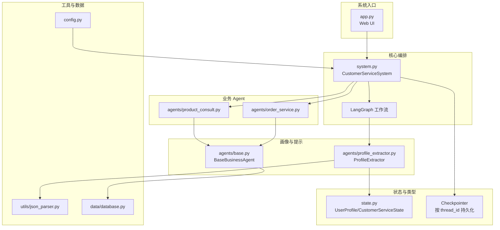
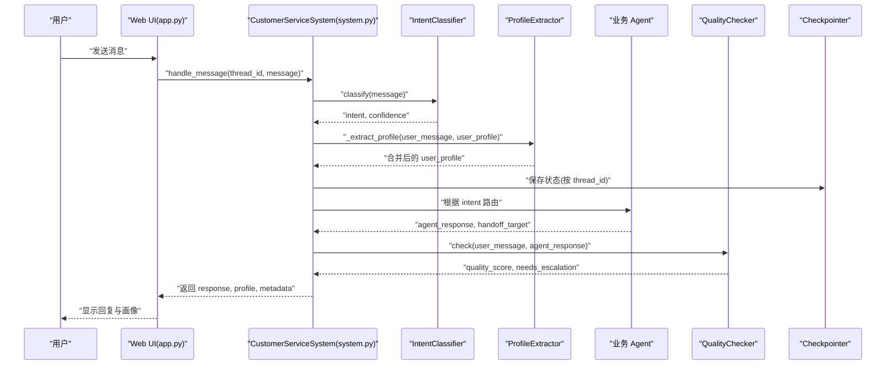
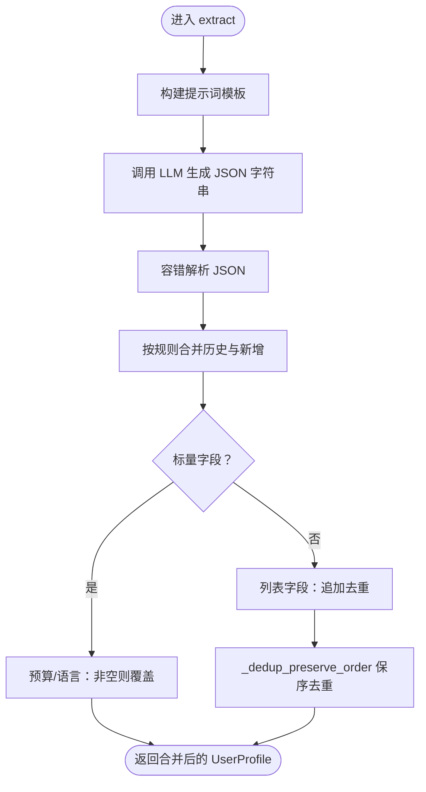
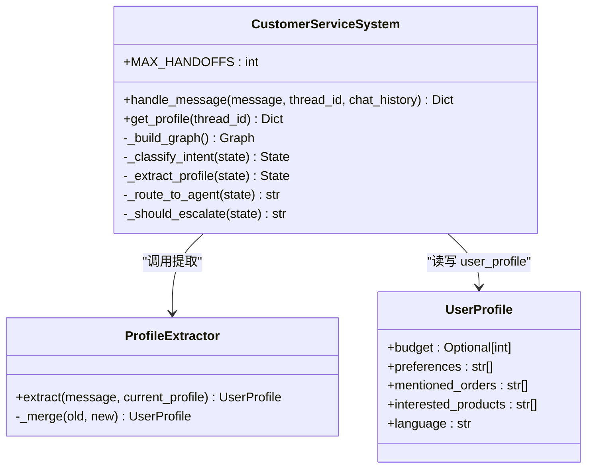
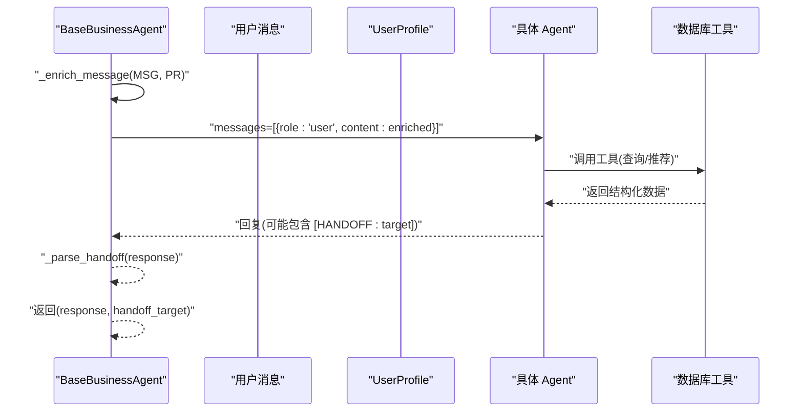
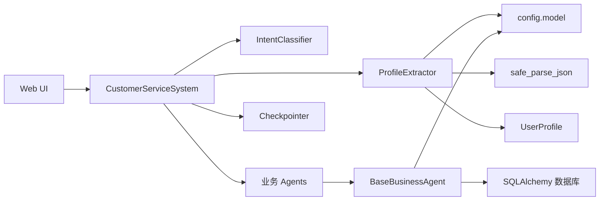

# 用户画像提取器

<cite>
**本文档引用的文件**
- [agents/profile_extractor.py](file://agents/profile_extractor.py)
- [state.py](file://state.py)
- [system.py](file://system.py)
- [config.py](file://config.py)
- [utils/json_parser.py](file://utils/json_parser.py)
- [agents/base.py](file://agents/base.py)
- [agents/order_service.py](file://agents/order_service.py)
- [agents/product_consult.py](file://agents/product_consult.py)
- [data/database.py](file://data/database.py)
- [app.py](file://app.py)
</cite>

## 目录
1. [简介](#简介)
2. [项目结构](#项目结构)
3. [核心组件](#核心组件)
4. [架构总览](#架构总览)
5. [详细组件分析](#详细组件分析)
6. [依赖关系分析](#依赖关系分析)
7. [性能考量](#性能考量)
8. [故障排查指南](#故障排查指南)
9. [结论](#结论)
10. [附录](#附录)

## 简介
本文件面向“用户画像提取器”的设计与实现，聚焦其在多轮对话中的作用与机制。用户画像提取器负责从用户的每轮消息中抽取关键偏好信息（预算、偏好关键词、订单号、感兴趣产品、语言），并与历史画像进行合并，从而在多轮交互中持续累积，提升后续业务 Agent 的个性化服务能力。本文将系统阐述：
- 画像字段定义与更新策略
- 从对话历史中提取偏好的算法与规则
- 画像的持久化与跨轮次保持机制
- 画像质量评估与准确性优化方法
- 具体的流程与输出格式示例

## 项目结构
该系统采用 LangGraph 工作流编排，用户画像提取位于“意图分类”之后、“业务 Agent 路由”之前，作为“画像累积”节点，贯穿多轮对话。关键文件与职责如下：
- agents/profile_extractor.py：用户画像提取器，负责从消息中抽取字段并合并历史画像
- state.py：定义 UserProfile 与 CustomerServiceState 类型，承载跨轮次状态
- system.py：系统主类，构建 LangGraph 工作流，集成 Checkpointer 实现跨轮次持久化
- config.py：系统配置，包括模型初始化、阈值与持久化路径
- utils/json_parser.py：容错 JSON 解析，保证 LLM 输出的健壮性
- agents/base.py：业务 Agent 基类，统一注入用户画像到提示词
- agents/order_service.py、agents/product_consult.py：业务 Agent 示例，展示如何利用画像
- data/database.py：业务数据库封装，支撑业务 Agent 的工具调用
- app.py：Streamlit UI，演示画像在前端的展示与查询

图表来源
- [system.py:196-246](file://system.py#L196-L246)
- [agents/profile_extractor.py:17-56](file://agents/profile_extractor.py#L17-L56)
- [state.py:14-58](file://state.py#L14-L58)
- [config.py:31-46](file://config.py#L31-L46)
- [utils/json_parser.py:10-51](file://utils/json_parser.py#L10-L51)
- [agents/base.py:23-123](file://agents/base.py#L23-L123)
- [agents/order_service.py:11-29](file://agents/order_service.py#L11-L29)
- [agents/product_consult.py:11-30](file://agents/product_consult.py#L11-L30)
- [data/database.py:87-161](file://data/database.py#L87-L161)

章节来源
- [system.py:196-246](file://system.py#L196-L246)
- [state.py:14-58](file://state.py#L14-L58)
- [config.py:31-46](file://config.py#L31-L46)

## 核心组件
- 用户画像提取器（ProfileExtractor）
  - 输入：当前用户消息、现有 UserProfile
  - 输出：合并后的 UserProfile
  - 关键能力：基于提示词模板抽取字段、容错解析 LLM 输出、按规则合并历史与新增信息
- 用户画像类型（UserProfile）
  - 字段：预算、偏好关键词列表、提及的订单号列表、感兴趣产品列表、语言代码
  - 设计：total=False，允许字段逐步填充，便于早期对话中字段缺失
- 系统工作流（CustomerServiceSystem）
  - 节点：意图分类 → 画像提取 → 业务 Agent → 质量检查 → 升级/响应
  - 持久化：Checkpointer 按 thread_id 保存/恢复状态，实现跨轮次累积
- 业务 Agent 基类（BaseBusinessAgent）
  - 统一将 UserProfile 摘要注入到提示词，增强个性化回复
  - 支持手写 [HANDOFF:target] 标记实现 Agent 间转接

章节来源
- [agents/profile_extractor.py:17-92](file://agents/profile_extractor.py#L17-L92)
- [state.py:14-26](file://state.py#L14-L26)
- [system.py:34-76](file://system.py#L34-L76)
- [agents/base.py:23-123](file://agents/base.py#L23-L123)

## 架构总览
用户画像提取器在系统中的位置与交互如下：

图表来源
- [system.py:79-147](file://system.py#L79-L147)
- [agents/profile_extractor.py:41-55](file://agents/profile_extractor.py#L41-L55)
- [app.py:144-150](file://app.py#L144-L150)

## 详细组件分析

### 用户画像提取器（ProfileExtractor）
- 角色定位
  - 在每轮对话中从用户消息中抽取预算、偏好、订单号、感兴趣产品、语言等字段
  - 与历史画像合并，形成新的 UserProfile 并写回工作流状态
- 提示词设计
  - 明确字段定义与返回格式（JSON）
  - 规则约束：仅提取明确提到的信息，不猜测；字段缺失时返回 null 或空列表
- 解析与合并
  - 使用容错 JSON 解析，剥离 Markdown 代码块与多余文本
  - 合并策略：
    - 标量字段（预算、语言）：新值非空则覆盖
    - 列表字段（偏好、订单号、感兴趣产品）：追加去重，保持首次出现顺序
- 保序去重算法
  - 时间复杂度 O(n)，空间复杂度 O(n)，保证列表增长有序且无重复

图表来源
- [agents/profile_extractor.py:20-55](file://agents/profile_extractor.py#L20-L55)
- [agents/profile_extractor.py:57-92](file://agents/profile_extractor.py#L57-L92)
- [utils/json_parser.py:10-51](file://utils/json_parser.py#L10-L51)

章节来源
- [agents/profile_extractor.py:17-92](file://agents/profile_extractor.py#L17-L92)
- [utils/json_parser.py:10-51](file://utils/json_parser.py#L10-L51)

### 用户画像类型（UserProfile）
- 字段定义
  - 预算：Optional[int]，单位元
  - 偏好：List[str]，关键词列表
  - 提及订单：List[str]，订单号列表
  - 感兴趣产品：List[str]，产品名列表
  - 语言：str，语言代码（如 zh/en/ja/ko）
- 设计要点
  - total=False，允许字段逐步填充，适配早期对话字段缺失场景
  - 与 CustomerServiceState 的 user_profile 字段配合，实现跨轮次累积

章节来源
- [state.py:14-26](file://state.py#L14-L26)

### 系统工作流与持久化（CustomerServiceSystem）
- 节点与路由
  - 节点：意图分类、画像提取、业务 Agent、质量检查、升级、handoff 路由
  - 条件路由：根据置信度与意图选择业务 Agent 或直接升级
- 持久化机制
  - Checkpointer：优先使用 SQLite，失败时回退内存存储
  - 按 thread_id 保存/恢复状态，确保 user_profile 跨轮次累积
- 外部 API
  - handle_message：处理单条消息，返回 response、intent、confidence、quality_score、escalated、profile、metadata
  - get_profile：查询指定 thread 的当前累积画像

图表来源
- [system.py:34-76](file://system.py#L34-L76)
- [system.py:250-305](file://system.py#L250-L305)
- [agents/profile_extractor.py:17-56](file://agents/profile_extractor.py#L17-L56)
- [state.py:14-26](file://state.py#L14-L26)

章节来源
- [system.py:34-76](file://system.py#L34-L76)
- [system.py:250-305](file://system.py#L250-L305)

### 业务 Agent 与画像注入（BaseBusinessAgent）
- 画像注入策略
  - 将预算、偏好、感兴趣产品、提及订单、语言偏好等摘要拼接到用户消息前
  - 非默认语言时追加语言指令，确保回复语言一致性
- 手写 [HANDOFF:target] 标记
  - 支持 Agent 间转接，系统根据标记进行 handoff 路由
- 与工具链协作
  - 订单 Agent：查询订单、物流跟踪
  - 产品咨询 Agent：产品搜索、按预算推荐

图表来源
- [agents/base.py:41-99](file://agents/base.py#L41-L99)
- [agents/order_service.py:11-29](file://agents/order_service.py#L11-L29)
- [agents/product_consult.py:11-30](file://agents/product_consult.py#L11-L30)
- [data/database.py:104-161](file://data/database.py#L104-L161)

章节来源
- [agents/base.py:23-123](file://agents/base.py#L23-L123)
- [agents/order_service.py:11-29](file://agents/order_service.py#L11-L29)
- [agents/product_consult.py:11-30](file://agents/product_consult.py#L11-L30)
- [data/database.py:104-161](file://data/database.py#L104-L161)

### 画像字段定义与更新策略
- 字段清单与语义
  - 预算：用户明确表达的消费上限，整数，单位元
  - 偏好：用户明确表达的关键词（如“降噪”“续航”“轻薄”）
  - 订单号：用户明确提到的订单编号列表
  - 感兴趣产品：用户明确表达的感兴趣产品名称列表
  - 语言：用户使用的语言代码（zh/en/ja/ko）
- 更新策略
  - 标量字段（预算、语言）：新值非空则覆盖旧值
  - 列表字段（偏好、订单号、感兴趣产品）：追加去重，保持首次出现顺序
- 跨轮次保持
  - 通过 Checkpointer 按 thread_id 保存状态，user_profile 在多轮对话中累积

章节来源
- [agents/profile_extractor.py:57-81](file://agents/profile_extractor.py#L57-L81)
- [state.py:14-26](file://state.py#L14-L26)
- [system.py:300-305](file://system.py#L300-L305)

### 画像提取流程与输出格式
- 流程步骤
  1) 构建提示词模板，明确字段与返回格式
  2) 调用 LLM 生成 JSON 字符串
  3) 容错解析，剥离 Markdown 代码块与多余文本
  4) 合并历史与新增字段，返回新的 UserProfile
- 输出格式（JSON Schema）
  - 字段：budget（数字或 null）、preferences（数组）、mentioned_orders（数组）、interested_products（数组）、language（字符串）
  - 规则：未明确提到的字段返回 null 或空数组

章节来源
- [agents/profile_extractor.py:22-39](file://agents/profile_extractor.py#L22-L39)
- [agents/profile_extractor.py:51-55](file://agents/profile_extractor.py#L51-L55)
- [utils/json_parser.py:10-51](file://utils/json_parser.py#L10-L51)

### 画像持久化机制与跨轮次保持策略
- 持久化实现
  - Checkpointer：优先使用 SQLite，失败时回退内存存储
  - 按 thread_id 保存/恢复状态，确保 user_profile 跨轮次累积
- 轮次控制
  - 每轮重置“请求级”字段（如 intent、quality_score、needs_escalation），但保留 user_profile
- 查询接口
  - get_profile：按 thread_id 查询当前累积画像

章节来源
- [system.py:66-75](file://system.py#L66-L75)
- [system.py:270-284](file://system.py#L270-L284)
- [system.py:300-305](file://system.py#L300-L305)

### 画像质量评估与准确性优化
- 质量评估
  - 质量检查节点：对回复进行评分，低于阈值触发升级
  - 评分维度：系统根据预设规则计算质量分数
- 准确性优化
  - 提示词工程：明确字段定义、返回格式与规则约束
  - 容错解析：剥离 Markdown 代码块与多余文本，提高鲁棒性
  - 保序去重：保证列表增长有序且无重复
  - 多语言支持：根据语言偏好调整回复语言
  - 手工校验：必要时在 UI 中查看调用链追踪与节点耗时

章节来源
- [system.py:134-147](file://system.py#L134-L147)
- [agents/profile_extractor.py:22-39](file://agents/profile_extractor.py#L22-L39)
- [utils/json_parser.py:10-51](file://utils/json_parser.py#L10-L51)
- [agents/base.py:83-99](file://agents/base.py#L83-L99)

## 依赖关系分析
- 组件耦合
  - ProfileExtractor 依赖提示词模板、LLM、容错解析器与 UserProfile 类型
  - CustomerServiceSystem 依赖多个 Agent、Checkpointer、中间件链
  - BaseBusinessAgent 依赖模型、工具集与数据库封装
- 外部依赖
  - LangChain/LangGraph：工作流编排与节点执行
  - SQLite：状态持久化
  - SQLAlchemy：业务数据访问

图表来源
- [agents/profile_extractor.py:12-14](file://agents/profile_extractor.py#L12-L14)
- [utils/json_parser.py:10-51](file://utils/json_parser.py#L10-L51)
- [state.py:14-26](file://state.py#L14-L26)
- [system.py:43-56](file://system.py#L43-L56)
- [agents/base.py:19-39](file://agents/base.py#L19-L39)
- [data/database.py:87-99](file://data/database.py#L87-L99)
- [app.py:14-21](file://app.py#L14-L21)

章节来源
- [agents/profile_extractor.py:12-14](file://agents/profile_extractor.py#L12-L14)
- [system.py:43-56](file://system.py#L43-L56)
- [agents/base.py:19-39](file://agents/base.py#L19-L39)
- [data/database.py:87-99](file://data/database.py#L87-L99)

## 性能考量
- LLM 调用成本
  - ProfileExtractor 与 IntentClassifier 均使用同一模型实例，减少重复初始化开销
- JSON 解析容错
  - 容错解析避免因格式问题导致的异常，提升整体吞吐
- 去重算法
  - 保序去重算法时间复杂度 O(n)，适合高频增量合并场景
- 持久化策略
  - SQLite 优先，失败回退内存存储，兼顾可靠性与性能

[本节为通用性能讨论，无需特定文件来源]

## 故障排查指南
- LLM 输出格式异常
  - 现象：JSON 解析失败
  - 排查：确认提示词模板返回格式与规则约束
  - 参考：容错解析器的处理逻辑
- 画像未跨轮次累积
  - 现象：每次对话 user_profile 丢失
  - 排查：确认 thread_id 一致、Checkpointer 初始化成功
  - 参考：handle_message 中的轮次重置逻辑与 get_profile 查询
- 业务 Agent 未正确注入画像
  - 现象：回复缺乏个性化
  - 排查：确认 BaseBusinessAgent 的画像注入逻辑与语言偏好指令
- 手写 [HANDOFF:target] 未生效
  - 现象：Agent 间未转接
  - 排查：确认回复中存在合法标记且目标 Agent 存在

章节来源
- [utils/json_parser.py:10-51](file://utils/json_parser.py#L10-L51)
- [system.py:250-305](file://system.py#L250-L305)
- [agents/base.py:67-99](file://agents/base.py#L67-L99)
- [agents/base.py:101-113](file://agents/base.py#L101-L113)

## 结论
用户画像提取器通过明确的字段定义、严格的规则约束与稳健的解析策略，在多轮对话中持续累积用户偏好，为后续业务 Agent 的个性化服务奠定基础。结合 LangGraph 的工作流编排与 Checkpointer 的持久化机制，系统实现了可靠的跨轮次画像保持。通过提示词工程、容错解析与保序去重等手段，进一步提升了画像提取的准确性与稳定性。

[本节为总结性内容，无需特定文件来源]

## 附录
- 术语
  - 会话 ID（thread_id）：用于区分不同用户或对话轮次，相同 thread_id 下 user_profile 跨轮次累积
  - 手写 [HANDOFF:target]：Agent 回复中的转接标记，系统据此进行 Agent 间转接
- 常见问题
  - 如何验证画像是否正确累积？可通过 UI 侧边栏查看当前 thread 的 user_profile
  - 如何切换会话？在 UI 中修改会话 ID 或新建会话按钮

章节来源
- [app.py:50-87](file://app.py#L50-L87)
- [system.py:300-305](file://system.py#L300-L305)