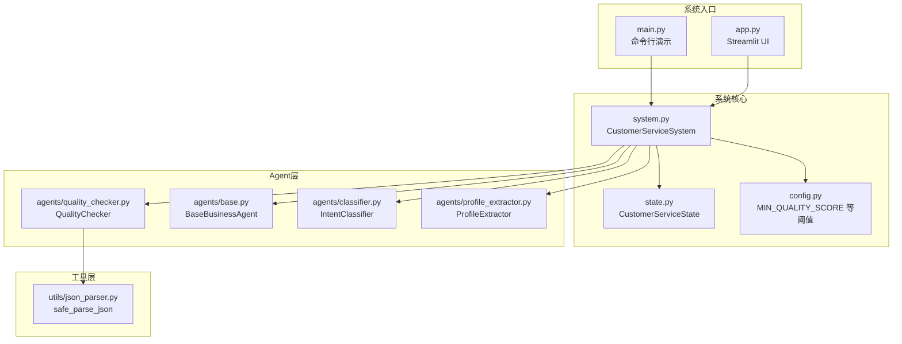
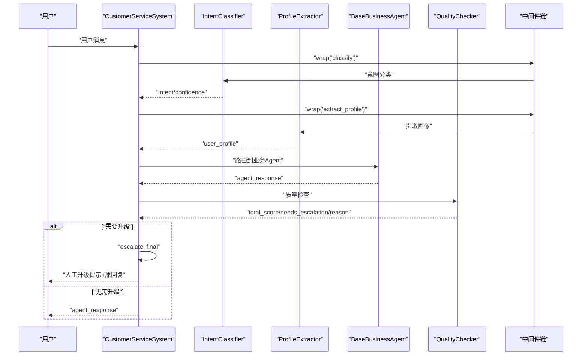
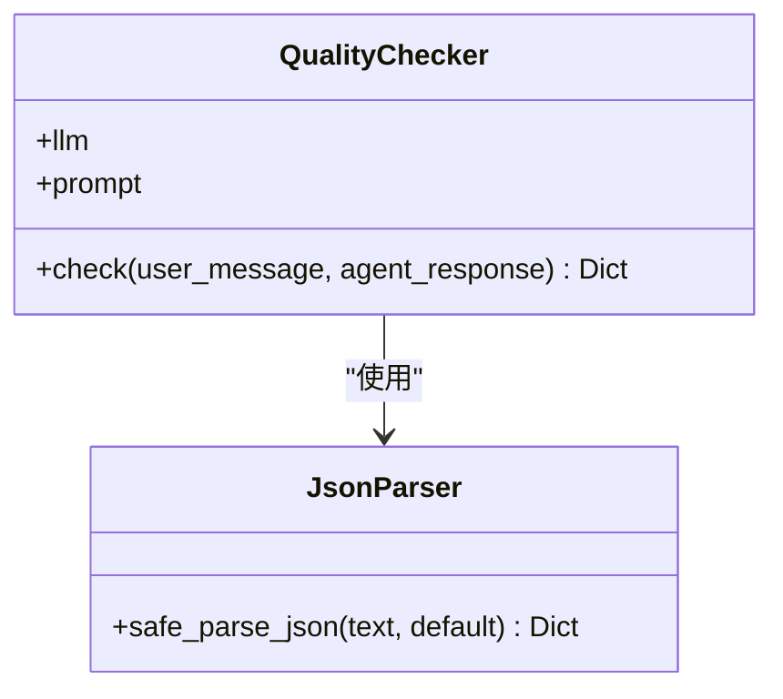
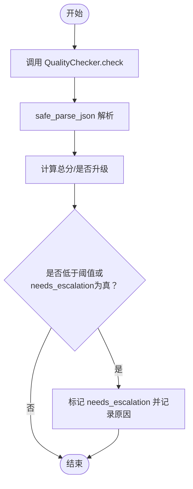
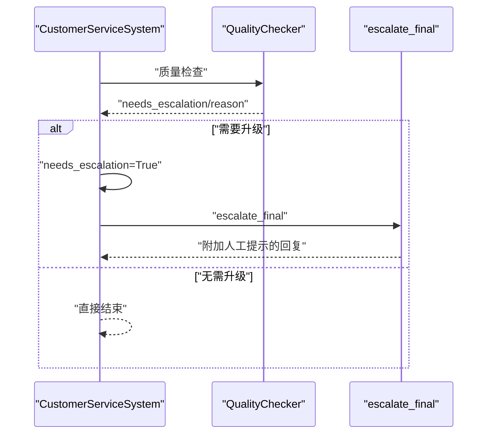
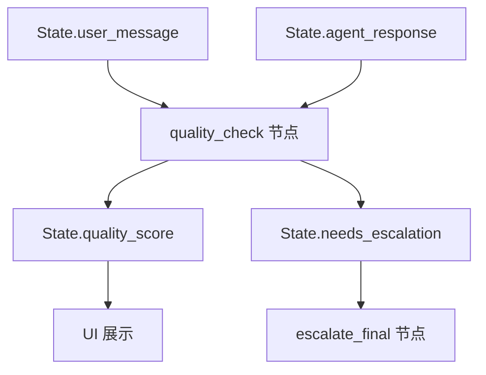
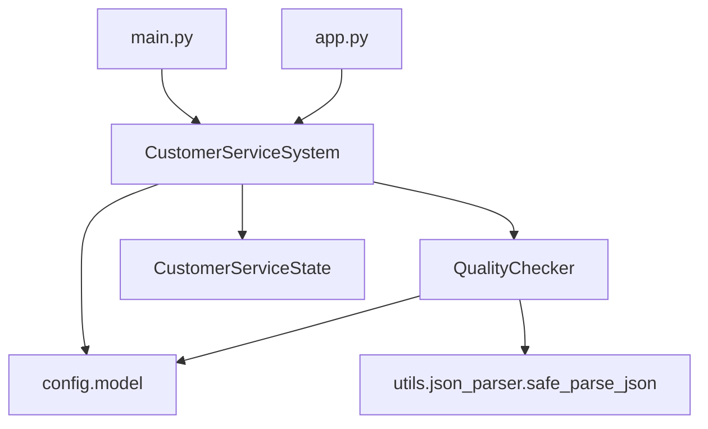

# 质量检查器

<cite>
**本文档引用的文件**
- [quality_checker.py](file://agents/quality_checker.py)
- [system.py](file://system.py)
- [config.py](file://config.py)
- [state.py](file://state.py)
- [json_parser.py](file://utils/json_parser.py)
- [base.py](file://agents/base.py)
- [classifier.py](file://agents/classifier.py)
- [profile_extractor.py](file://agents/profile_extractor.py)
- [main.py](file://main.py)
- [app.py](file://app.py)
</cite>

## 目录
1. [简介](#简介)
2. [项目结构](#项目结构)
3. [核心组件](#核心组件)
4. [架构总览](#架构总览)
5. [详细组件分析](#详细组件分析)
6. [依赖关系分析](#依赖关系分析)
7. [性能考虑](#性能考虑)
8. [故障排查指南](#故障排查指南)
9. [结论](#结论)
10. [附录](#附录)

## 简介
本文件面向质量检查器在多智能体系统中的设计与实现，重点阐述其在整体客服工作流中的关键作用、评估标准与触发机制，并给出评分示例、集成方式与优化策略。质量检查器作为LangGraph工作流中的一个节点，负责对业务Agent生成的回复进行质量评估，当分数低于阈值或判定需要升级时，系统将触发人工升级流程，确保用户体验与服务质量。

## 项目结构
质量检查器位于agents目录下，与系统主控制器system.py协同工作，通过统一的配置常量与状态结构参与端到端的多智能体编排。

图表来源
- [system.py:1-305](file://system.py#L1-L305)
- [quality_checker.py:1-63](file://agents/quality_checker.py#L1-L63)
- [config.py:1-60](file://config.py#L1-L60)
- [state.py:1-58](file://state.py#L1-L58)
- [json_parser.py:1-51](file://utils/json_parser.py#L1-L51)
- [base.py:1-123](file://agents/base.py#L1-L123)
- [classifier.py:1-63](file://agents/classifier.py#L1-L63)
- [profile_extractor.py:1-92](file://agents/profile_extractor.py#L1-L92)
- [main.py:1-148](file://main.py#L1-L148)
- [app.py:1-177](file://app.py#L1-L177)

章节来源
- [system.py:1-305](file://system.py#L1-L305)
- [quality_checker.py:1-63](file://agents/quality_checker.py#L1-L63)
- [config.py:1-60](file://config.py#L1-L60)
- [state.py:1-58](file://state.py#L1-L58)
- [json_parser.py:1-51](file://utils/json_parser.py#L1-L51)
- [base.py:1-123](file://agents/base.py#L1-L123)
- [classifier.py:1-63](file://agents/classifier.py#L1-L63)
- [profile_extractor.py:1-92](file://agents/profile_extractor.py#L1-L92)
- [main.py:1-148](file://main.py#L1-L148)
- [app.py:1-177](file://app.py#L1-L177)

## 核心组件
- 质量检查器（QualityChecker）：接收用户问题与业务Agent回复，输出质量评分、是否需要升级及原因。
- 系统主控制器（CustomerServiceSystem）：编排工作流，将质量检查节点接入LangGraph，依据阈值与Hand-off策略决定后续路径。
- 配置常量（config.py）：定义最低质量阈值、意图置信度阈值等业务参数。
- 状态结构（state.py）：定义工作流共享状态，承载质量评分、升级标记等中间结果。
- JSON解析工具（utils/json_parser.py）：对LLM返回的JSON进行容错解析，避免格式异常导致流程中断。

章节来源
- [quality_checker.py:16-63](file://agents/quality_checker.py#L16-L63)
- [system.py:134-147](file://system.py#L134-L147)
- [config.py:33-40](file://config.py#L33-L40)
- [state.py:28-58](file://state.py#L28-L58)
- [json_parser.py:10-51](file://utils/json_parser.py#L10-L51)

## 架构总览
质量检查器在系统中的位置与职责如下：

图表来源
- [system.py:79-147](file://system.py#L79-L147)
- [classifier.py:40-63](file://agents/classifier.py#L40-L63)
- [profile_extractor.py:41-56](file://agents/profile_extractor.py#L41-L56)
- [base.py:41-66](file://agents/base.py#L41-L66)
- [quality_checker.py:41-63](file://agents/quality_checker.py#L41-L63)

## 详细组件分析

### 质量检查器实现原理
- 角色与职责：作为独立的评估Agent，不使用工具，仅通过LLM对回复进行质量评估。
- 评估维度：相关性、完整性、专业性、有用性，满分100分。
- 输出格式：包含总分、是否需要升级、评估说明的JSON对象。
- 容错机制：使用JSON解析工具对LLM返回的文本进行剥离与解析，失败时返回默认值，保障流程稳定性。

图表来源
- [quality_checker.py:16-63](file://agents/quality_checker.py#L16-L63)
- [json_parser.py:10-51](file://utils/json_parser.py#L10-L51)

章节来源
- [quality_checker.py:16-63](file://agents/quality_checker.py#L16-L63)
- [json_parser.py:10-51](file://utils/json_parser.py#L10-L51)

### 质量评估指标与评分标准
- 评估维度（满分100分）：
  - 相关性（0-25分）：回复是否针对用户问题
  - 完整性（0-25分）：是否提供了足够的信息
  - 专业性（0-25分）：语言是否专业得体
  - 有用性（0-25分）：是否真正帮助到用户
- 评分转换：系统内部将0-100分转换为0.0-1.0的浮点数存储于状态中。
- 触发升级条件：
  - 质量检查返回needs_escalation为真
  - 或者质量评分低于配置阈值（MIN_QUALITY_SCORE）

图表来源
- [quality_checker.py:41-63](file://agents/quality_checker.py#L41-L63)
- [system.py:134-147](file://system.py#L134-L147)
- [config.py:38-40](file://config.py#L38-L40)

章节来源
- [quality_checker.py:21-39](file://agents/quality_checker.py#L21-L39)
- [system.py:134-147](file://system.py#L134-L147)
- [config.py:38-40](file://config.py#L38-L40)

### 人工升级机制的触发条件与处理流程
- 触发条件：
  - 质量检查器判定需要升级
  - 质量评分低于阈值
- 处理流程：
  - 系统节点将needs_escalation置为真，并记录escalation_reason
  - 进入escalate_final节点，在原回复基础上附加人工客服提示
  - 返回最终响应给用户

图表来源
- [system.py:134-156](file://system.py#L134-L156)
- [quality_checker.py:41-63](file://agents/quality_checker.py#L41-L63)

章节来源
- [system.py:134-156](file://system.py#L134-L156)

### 质量检查与业务Agent的集成方式与反馈机制
- 集成方式：
  - 在LangGraph工作流中添加quality_check节点，前置依赖业务Agent节点
  - 质量检查节点读取user_message与agent_response，写回quality_score与needs_escalation
- 反馈机制：
  - 通过状态结构传递质量评分与升级标记
  - UI侧展示质量评分、是否升级等信息
  - 中间件链记录节点耗时，便于性能分析

图表来源
- [system.py:134-156](file://system.py#L134-L156)
- [state.py:28-58](file://state.py#L28-L58)
- [app.py:90-123](file://app.py#L90-L123)

章节来源
- [system.py:134-156](file://system.py#L134-L156)
- [state.py:28-58](file://state.py#L28-L58)
- [app.py:90-123](file://app.py#L90-L123)

### 具体检查示例与评分标准
以下示例基于质量检查器的评估维度与阈值，帮助理解评分与升级触发逻辑（示例描述，不展示具体代码）：
- 示例1：高质量回复
  - 相关性：25分，完整性：25分，专业性：25分，有用性：25分
  - 总分：100分，质量评分：1.0，无需升级
- 示例2：一般回复
  - 相关性：20分，完整性：20分，专业性：20分，有用性：20分
  - 总分：80分，质量评分：0.8，无需升级
- 示例3：低质量回复
  - 相关性：10分，完整性：10分，专业性：10分，有用性：10分
  - 总分：40分，质量评分：0.4，低于阈值（0.6），触发升级
- 示例4：语言不匹配
  - 用户使用英文提问，客服用中文回复
  - 相关性与有用性适当扣分，若总分低于阈值则触发升级

章节来源
- [quality_checker.py:21-39](file://agents/quality_checker.py#L21-L39)
- [config.py:38-40](file://config.py#L38-L40)

## 依赖关系分析
- 质量检查器依赖：
  - LLM模型实例（来自配置）
  - JSON解析工具（容错解析）
- 系统控制器依赖：
  - 质量检查器节点
  - 配置阈值
  - 状态结构
- UI与演示依赖：
  - 系统对外API返回质量评分与升级标记
  - 中间件链记录节点耗时

图表来源
- [quality_checker.py:12-13](file://agents/quality_checker.py#L12-L13)
- [json_parser.py:10-51](file://utils/json_parser.py#L10-L51)
- [system.py:49-49](file://system.py#L49-L49)
- [config.py:31](file://config.py#L31)
- [state.py:28-58](file://state.py#L28-L58)
- [app.py:144-147](file://app.py#L144-L147)
- [main.py:136-139](file://main.py#L136-L139)

章节来源
- [quality_checker.py:12-13](file://agents/quality_checker.py#L12-L13)
- [json_parser.py:10-51](file://utils/json_parser.py#L10-L51)
- [system.py:49-49](file://system.py#L49-L49)
- [config.py:31](file://config.py#L31)
- [state.py:28-58](file://state.py#L28-L58)
- [app.py:144-147](file://app.py#L144-L147)
- [main.py:136-139](file://main.py#L136-L139)

## 性能考虑
- LLM调用成本：质量检查器每次都会发起一次LLM调用，建议在高并发场景下：
  - 合理设置速率限制中间件
  - 使用缓存策略（如对相同输入的重复评估结果进行缓存）
  - 控制提示词长度，减少Token消耗
- 解析开销：JSON解析工具具备容错能力，但频繁的格式修复仍会带来额外开销，建议：
  - 优化提示词，确保LLM稳定输出JSON
  - 在开发环境严格校验输出格式，生产环境再依赖容错解析
- 状态持久化：系统使用Checkpointer按thread_id保存状态，避免重复质量检查带来的重复计算，提升多轮对话体验。

[本节为通用性能建议，不涉及特定文件分析]

## 故障排查指南
- LLM返回格式异常
  - 现象：质量检查返回解析失败或默认值
  - 排查：检查提示词是否强制要求返回JSON；确认模型参数与版本
  - 参考：JSON解析工具的安全解析逻辑
- 质量评分异常偏低
  - 现象：频繁触发升级
  - 排查：调整MIN_QUALITY_SCORE阈值；优化业务Agent提示词与工具使用
  - 参考：质量检查器的评估维度与提示词
- 升级触发条件不生效
  - 现象：应升级未升级
  - 排查：确认needs_escalation字段是否正确写入；检查阈值配置
  - 参考：系统质量检查节点与escalate_final节点

章节来源
- [json_parser.py:10-51](file://utils/json_parser.py#L10-L51)
- [quality_checker.py:21-39](file://agents/quality_checker.py#L21-L39)
- [system.py:134-156](file://system.py#L134-L156)
- [config.py:38-40](file://config.py#L38-L40)

## 结论
质量检查器在多智能体客服系统中扮演“质量守门人”的角色，通过对业务Agent回复的客观评估，确保用户体验与服务一致性。通过合理的评估维度、阈值配置与容错机制，系统能够在保证稳定性的同时，及时发现并升级低质量回复。配合中间件链与状态持久化，质量检查器实现了端到端的可追踪、可优化的闭环。

[本节为总结性内容，不涉及特定文件分析]

## 附录
- 配置项参考
  - 最低质量评分阈值：MIN_QUALITY_SCORE
  - 意图识别置信度阈值：MIN_INTENT_CONFIDENCE
- 状态字段参考
  - quality_score：质量评分（0.0-1.0）
  - needs_escalation：是否需要升级
  - escalation_reason：升级原因
- UI展示参考
  - 侧边栏与展开面板展示质量评分与升级标记
  - 调用链追踪展示各节点耗时

章节来源
- [config.py:33-40](file://config.py#L33-L40)
- [state.py:28-58](file://state.py#L28-L58)
- [app.py:90-123](file://app.py#L90-L123)
- [app.py:153-170](file://app.py#L153-L170)