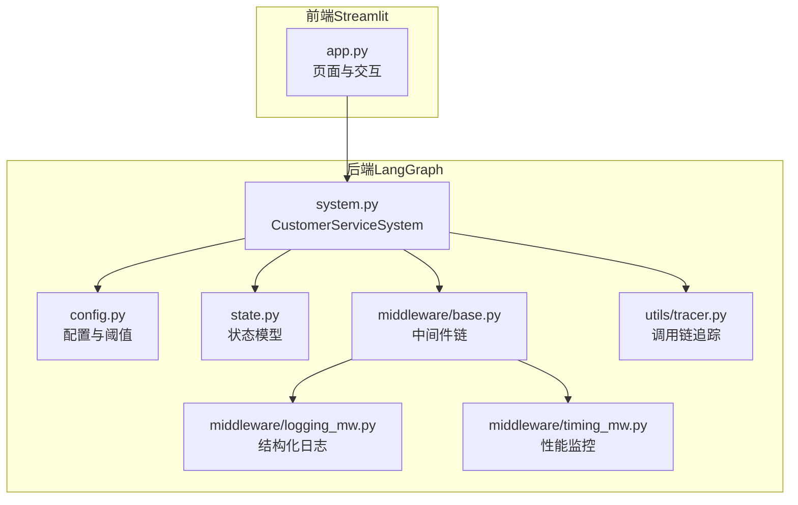
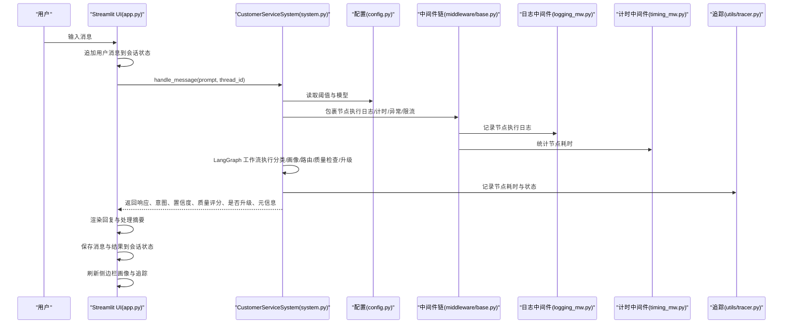
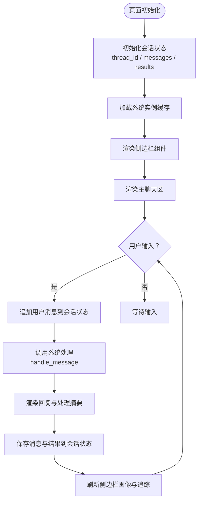
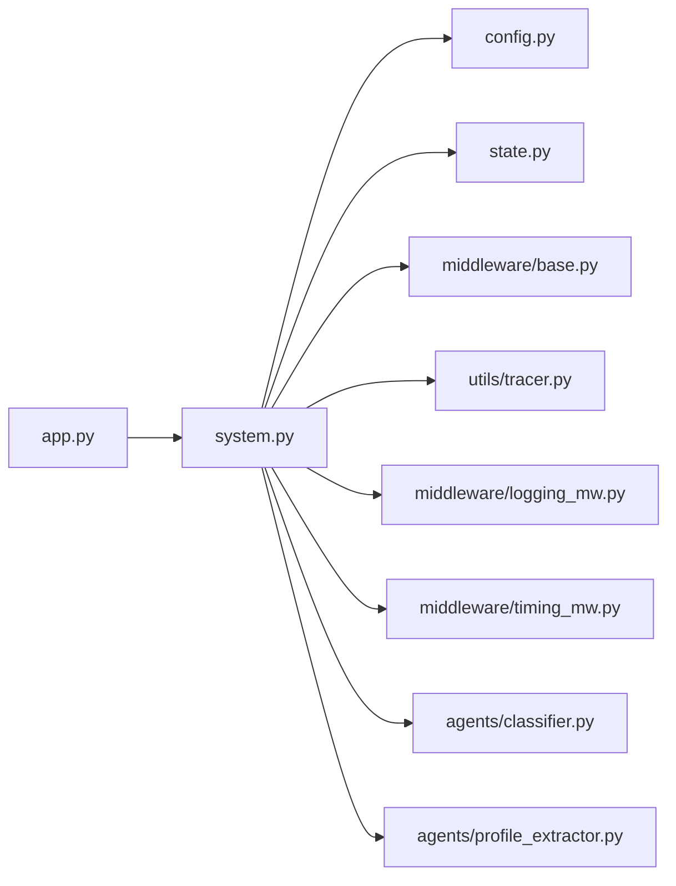

# Web界面设计

<cite>
**本文引用的文件**
- [app.py](file://app.py)
- [system.py](file://system.py)
- [state.py](file://state.py)
- [config.py](file://config.py)
- [utils/tracer.py](file://utils/tracer.py)
- [middleware/base.py](file://middleware/base.py)
- [middleware/logging_mw.py](file://middleware/logging_mw.py)
- [middleware/timing_mw.py](file://middleware/timing_mw.py)
- [agents/classifier.py](file://agents/classifier.py)
- [agents/profile_extractor.py](file://agents/profile_extractor.py)
- [README.md](file://README.md)
- [requirements.txt](file://requirements.txt)
</cite>

## 更新摘要
**变更内容**
- 更新了完整的Streamlit Web界面实现，包括会话管理、实时用户画像展示
- 新增了交互式聊天界面和详细处理信息显示功能
- 增强了中间件链的可观测性展示，包括节点耗时和调用链追踪
- 完善了用户会话管理和多轮对话的界面呈现机制

## 目录
1. [简介](#简介)
2. [项目结构](#项目结构)
3. [核心组件](#核心组件)
4. [架构总览](#架构总览)
5. [详细组件分析](#详细组件分析)
6. [依赖关系分析](#依赖关系分析)
7. [性能考量](#性能考量)
8. [故障排查指南](#故障排查指南)
9. [结论](#结论)
10. [附录](#附录)

## 简介
本设计文档聚焦于基于 Streamlit 的完整 Web 界面实现与用户交互设计，围绕"多Agent智能客服"系统，系统性阐述界面布局、组件组织、实时消息更新与状态同步机制、用户会话管理与多轮对话呈现、界面定制与主题配置、响应式设计与移动端适配、以及界面与后端的数据交互与事件处理机制。该界面以简洁直观的方式展示消息历史、输入框、处理摘要与调用链追踪，同时通过会话 ID 控制实现跨轮次状态共享与画像累积。

**更新** 新增了完整的Streamlit Web界面，包括实时用户画像展示、交互式聊天界面和详细处理信息显示功能。

## 项目结构
该项目采用"后端系统 + Streamlit 前端"的双层结构：
- 后端系统：以 LangGraph 工作流为核心，负责意图分类、画像提取、业务 Agent 调用、质量检查与升级决策。
- Web 前端：基于 Streamlit，负责渲染页面、收集用户输入、展示历史消息与处理详情、维护会话状态。

**图表来源**
- [app.py:1-177](file://app.py#L1-L177)
- [system.py:1-305](file://system.py#L1-L305)
- [state.py:1-58](file://state.py#L1-L58)
- [config.py:1-75](file://config.py#L1-L75)
- [middleware/base.py:1-94](file://middleware/base.py#L1-L94)
- [utils/tracer.py:1-78](file://utils/tracer.py#L1-L78)
- [middleware/logging_mw.py:1-123](file://middleware/logging_mw.py#L1-L123)
- [middleware/timing_mw.py:1-55](file://middleware/timing_mw.py#L1-L55)

**章节来源**
- [app.py:1-177](file://app.py#L1-L177)
- [system.py:1-305](file://system.py#L1-L305)
- [state.py:1-58](file://state.py#L1-L58)
- [config.py:1-75](file://config.py#L1-L75)
- [README.md:1-215](file://README.md#L1-L215)

## 核心组件
- 页面配置与初始化
  - 页面标题、图标与宽屏布局设置。
  - 会话状态初始化：thread_id、messages、results。
  - 系统实例缓存：通过装饰器确保资源复用与快速启动。
- 侧边栏组件
  - 会话设置：thread_id 输入与新建会话按钮，支持重置会话与刷新。
  - 用户画像展示：预算、偏好、感兴趣产品、提到的订单、语言等。
  - 处理信息：意图、置信度、质量评分、是否升级。
  - 节点耗时与调用链追踪：按节点维度展示耗时与状态摘要。
- 主聊天区
  - 历史消息渲染：按角色区分显示。
  - 用户输入：chat_input 提交消息。
  - 系统处理：调用系统接口，展示回复与处理详情，保存历史与结果。
  - 详情展开：查看处理摘要与调用链追踪。

**章节来源**
- [app.py:14-177](file://app.py#L14-L177)

## 架构总览
Streamlit 前端通过调用后端系统接口实现端到端流程：用户输入经前端收集后，调用系统处理函数，系统内部以 LangGraph 工作流驱动多个节点（意图分类、画像提取、业务 Agent、质量检查、升级等），最终返回处理结果与元信息。前端将结果中的响应、意图、置信度、质量评分、是否升级以及调用链追踪等信息进行可视化展示。

**图表来源**
- [app.py:134-176](file://app.py#L134-L176)
- [system.py:250-299](file://system.py#L250-L299)
- [config.py:28-75](file://config.py#L28-L75)
- [middleware/base.py:46-94](file://middleware/base.py#L46-L94)
- [middleware/logging_mw.py:32-106](file://middleware/logging_mw.py#L32-L106)
- [middleware/timing_mw.py:13-55](file://middleware/timing_mw.py#L13-L55)
- [utils/tracer.py:11-78](file://utils/tracer.py#L11-L78)

## 详细组件分析

### 页面布局与组件组织
- 页面配置
  - 设置页面标题、图标与宽屏布局，提升信息密度与可用性。
- 侧边栏
  - 会话设置区域：文本输入 thread_id，按钮新建会话；当 thread_id 变化时清空历史并刷新。
  - 用户画像区域：根据系统查询结果展示预算、偏好、感兴趣产品、提到的订单、语言等。
  - 处理信息区域：展示最近一次处理的意图、置信度、质量评分与是否升级。
  - 节点耗时与调用链追踪：遍历元信息中的节点耗时与追踪条目，以列表形式展示。
- 主聊天区
  - 历史消息：遍历会话状态 messages，按角色渲染 Markdown。
  - 用户输入：chat_input 提供输入框，提交后立即显示用户消息。
  - 系统处理：在 assistant 角色的消息容器内显示加载动画，调用系统接口，展示回复与处理摘要。
  - 结果保存：将 assistant 回复与本轮结果追加到会话状态，刷新侧边栏。

**图表来源**
- [app.py:23-176](file://app.py#L23-L176)

**章节来源**
- [app.py:33-176](file://app.py#L33-L176)

### 实时消息更新与状态同步机制
- 会话状态
  - thread_id：控制跨轮次状态共享与画像累积。
  - messages：存储历史消息，用于渲染聊天历史。
  - results：存储每轮处理结果，用于侧边栏展示与追踪。
- 状态更新策略
  - 用户输入后立即追加到 messages 并渲染，随后调用系统处理，处理完成后再次追加 assistant 回复并保存本轮结果。
  - 侧边栏通过系统查询当前 thread 的用户画像与最近一次处理元信息进行刷新。
- 刷新机制
  - 当 thread_id 变化或新建会话时，清空 messages 与 results 并触发页面刷新，确保状态一致性。

**章节来源**
- [app.py:23-68](file://app.py#L23-L68)
- [app.py:130-176](file://app.py#L130-L176)

### 用户会话管理与多轮对话呈现
- 会话 ID 管理
  - 通过侧边栏输入框直接编辑 thread_id，不同 thread_id 表示不同会话，彼此不共享状态。
  - 新建会话按钮生成基于时间戳的新 thread_id，并清空历史与结果。
- 多轮对话与画像累积
  - 后端系统通过 LangGraph Checkpointer 按 thread_id 保存与恢复状态，user_profile 在多轮对话中逐步累积。
  - 前端通过系统查询当前 thread 的用户画像并在侧边栏展示，体现跨轮次记忆效果。
- 交互流程
  - 用户在主聊天区输入消息，系统根据当前 thread_id 执行工作流，返回处理结果并更新会话状态。

**章节来源**
- [app.py:46-87](file://app.py#L46-L87)
- [system.py:250-305](file://system.py#L250-L305)
- [state.py:28-58](file://state.py#L28-L58)

### 界面定制与主题配置
- 页面外观
  - 页面标题、图标与宽屏布局已在页面配置中设置，便于在桌面端展示更多信息。
- 主题与样式
  - Streamlit 默认主题与颜色体系适用于当前界面；若需进一步定制，可在应用启动前设置全局主题参数或通过自定义 CSS（需额外配置）实现。
- 组件风格
  - 使用 Streamlit 的 metric、columns、expander 等组件统一展示指标与详情，保持一致的视觉节奏。

**章节来源**
- [app.py:35-42](file://app.py#L35-L42)

### 响应式设计与移动端适配
- 布局策略
  - 页面采用宽屏布局，适合桌面端展示侧边栏与主聊天区的并排信息。
- 移动端适配建议
  - 将侧边栏内容折叠为顶部导航或底部抽屉，主聊天区采用垂直堆叠布局。
  - 适当调整列布局（例如将指标卡片改为单列）以适应小屏幕。
  - 优化输入框与按钮尺寸，确保触摸操作便捷。
  - 在移动端可隐藏或折叠"处理详情"展开面板，仅保留关键指标。

**章节来源**
- [app.py:38](file://app.py#L38)

### 界面与后端的数据交互与事件处理
- 数据交互
  - 前端通过系统接口 handle_message 传递用户输入与 thread_id，接收响应、意图、置信度、质量评分、是否升级与元信息。
  - 前端将响应与处理结果保存到会话状态，用于渲染历史与侧边栏。
- 事件处理
  - 用户输入事件：chat_input 提交后触发系统调用与渲染。
  - 会话变更事件：thread_id 输入变化或新建会话按钮点击后清空历史并刷新。
  - 加载与渲染事件：系统处理期间显示加载动画，处理完成后更新 UI。

**章节来源**
- [app.py:134-176](file://app.py#L134-L176)
- [system.py:250-299](file://system.py#L250-L299)

### 界面扩展与功能增强开发指南
- 新增侧边栏功能
  - 添加"清空会话"按钮，一键清空 messages 与 results。
  - 增加"导出对话"按钮，将当前 thread 的历史导出为文本或 JSON。
- 增强主聊天区
  - 支持上传图片/文件，扩展为多模态输入。
  - 增加"复制"、"点赞/踩"等交互按钮，丰富用户反馈。
- 处理详情增强
  - 将"处理详情"展开面板改为独立标签页或抽屉，支持滚动查看完整追踪。
  - 增加"重试"按钮，允许用户针对某一轮对话重新触发处理。
- 主题与国际化
  - 支持浅色/深色主题切换，通过配置项或用户偏好控制。
  - 支持多语言切换，结合后端语言检测与配置。

**章节来源**
- [app.py:46-123](file://app.py#L46-L123)

## 依赖关系分析
- 前端依赖后端系统接口，系统接口依赖配置、状态模型、中间件链与追踪工具。
- 中间件链为工作流节点提供横切关注点（日志、计时、异常、限流），确保处理过程可观测与稳定。
- 配置模块集中管理模型初始化、阈值常量与持久化路径，降低耦合度。

**图表来源**
- [app.py:1-177](file://app.py#L1-L177)
- [system.py:1-305](file://system.py#L1-L305)
- [config.py:1-75](file://config.py#L1-L75)
- [state.py:1-58](file://state.py#L1-L58)
- [middleware/base.py:1-94](file://middleware/base.py#L1-L94)
- [utils/tracer.py:1-78](file://utils/tracer.py#L1-L78)
- [middleware/logging_mw.py:1-123](file://middleware/logging_mw.py#L1-L123)
- [middleware/timing_mw.py:1-55](file://middleware/timing_mw.py#L1-L55)
- [agents/classifier.py:1-63](file://agents/classifier.py#L1-L63)
- [agents/profile_extractor.py:1-92](file://agents/profile_extractor.py#L1-L92)

**章节来源**
- [requirements.txt:1-22](file://requirements.txt#L1-L22)

## 性能考量
- 资源缓存
  - 系统实例通过装饰器缓存，避免重复初始化，提升启动速度。
- 状态管理
  - 会话状态仅保存必要字段，避免冗余数据导致内存膨胀。
- 渲染优化
  - 使用 expander 折叠处理详情，减少初始渲染负担。
- 后端处理
  - 中间件链提供计时能力，便于定位耗时节点；质量检查阈值可调，平衡准确性与性能。

**章节来源**
- [app.py:16-21](file://app.py#L16-L21)
- [middleware/base.py:63-94](file://middleware/base.py#L63-L94)
- [config.py:35-40](file://config.py#L35-L40)

## 故障排查指南
- 环境变量缺失
  - 若未正确配置 API Key，系统初始化会抛出错误提示，需在 .env 文件中设置有效密钥。
- 数据库连接问题
  - 持久化 Checkpointer 优先使用 SQLite，失败时回退到内存保存；若 SQLite 初始化失败，系统仍可运行但不保留跨会话状态。
- 会话状态异常
  - 当 thread_id 变化或新建会话时，确保 messages 与 results 已清空并刷新页面。
- 处理详情为空
  - 若元信息中无 trace 或节点耗时，侧边栏不会显示相应内容；可通过后端日志确认节点执行情况。

**章节来源**
- [config.py:20-27](file://config.py#L20-L27)
- [system.py:66-75](file://system.py#L66-L75)
- [app.py:55-59](file://app.py#L55-L59)
- [utils/tracer.py:32-78](file://utils/tracer.py#L32-L78)

## 结论
该 Streamlit 界面以简洁清晰的布局实现了多Agent智能客服系统的交互体验：通过侧边栏集中展示会话设置、用户画像与处理信息，主聊天区高效呈现历史消息与实时回复，配合处理详情与调用链追踪，满足从用户体验到技术可观测性的双重需求。结合 LangGraph 的工作流编排与 Checkpointer 的跨轮次状态持久化，系统在多轮对话与画像累积方面具备良好表现。新增的完整Web界面包括会话管理、实时用户画像、交互式聊天界面和详细处理信息显示等功能，进一步增强了系统的实用性和可观测性。后续可在主题定制、移动端适配与功能扩展方面持续增强，以适配更广泛的使用场景。

## 附录
- 快速开始
  - 安装依赖后，运行 Streamlit 应用即可启动 Web 界面。
- 未来扩展方向
  - 代理间协作、多语言支持、真实数据库对接、持久化 Checkpointer、Web UI（Streamlit/Gradio）等。

**章节来源**
- [README.md:47-96](file://README.md#L47-L96)
- [requirements.txt:1-22](file://requirements.txt#L1-L22)