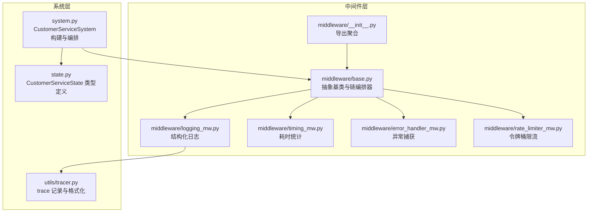
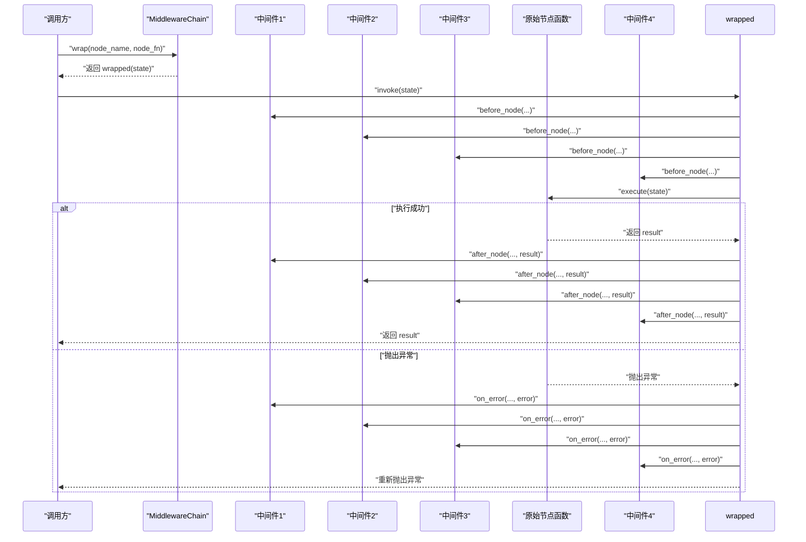
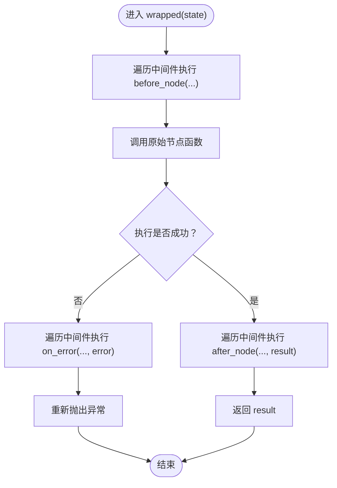
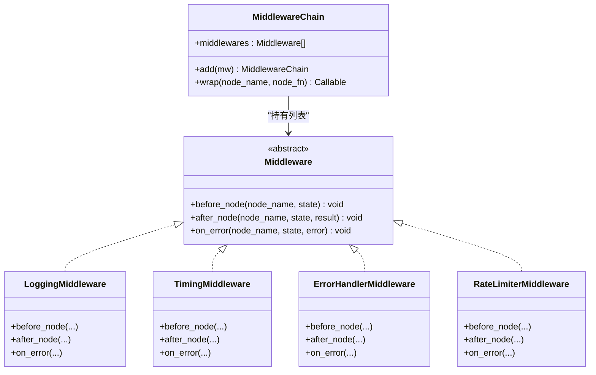

# 中间件基础设施

<cite>
**本文引用的文件**
- [middleware/base.py](file://middleware/base.py)
- [middleware/__init__.py](file://middleware/__init__.py)
- [middleware/error_handler_mw.py](file://middleware/error_handler_mw.py)
- [middleware/logging_mw.py](file://middleware/logging_mw.py)
- [middleware/rate_limiter_mw.py](file://middleware/rate_limiter_mw.py)
- [middleware/timing_mw.py](file://middleware/timing_mw.py)
- [system.py](file://system.py)
- [state.py](file://state.py)
- [utils/tracer.py](file://utils/tracer.py)
</cite>

## 目录
1. [简介](#简介)
2. [项目结构](#项目结构)
3. [核心组件](#核心组件)
4. [架构总览](#架构总览)
5. [详细组件分析](#详细组件分析)
6. [依赖关系分析](#依赖关系分析)
7. [性能考量](#性能考量)
8. [故障排查指南](#故障排查指南)
9. [结论](#结论)
10. [附录](#附录)

## 简介
本文件系统性解析中间件基础设施的设计与实现，重点覆盖：
- Middleware 抽象基类的设计理念与三个核心钩子方法（before_node、after_node、on_error）的作用机制
- MiddlewareChain 类的实现原理，包括中间件链的注册、执行顺序与包装机制
- wrap 方法如何将原始节点函数转换为带横切关注点的增强函数
- 中间件链的执行流程：before → execute → after/on_error
- 中间件开发的最佳实践与设计原则
- 中间件优先级管理与异常传播机制的技术细节

## 项目结构
中间件层位于 middleware 目录，围绕抽象基类与具体中间件实现，配合系统层在 LangGraph 工作流中注入横切关注点。

图表来源
- [middleware/base.py:14-94](file://middleware/base.py#L14-L94)
- [middleware/__init__.py:12-26](file://middleware/__init__.py#L12-L26)
- [system.py:58-76](file://system.py#L58-L76)
- [state.py:28-58](file://state.py#L28-L58)
- [utils/tracer.py:11-78](file://utils/tracer.py#L11-L78)

章节来源
- [middleware/base.py:1-94](file://middleware/base.py#L1-L94)
- [middleware/__init__.py:1-26](file://middleware/__init__.py#L1-L26)
- [system.py:58-76](file://system.py#L58-L76)
- [state.py:28-58](file://state.py#L28-L58)
- [utils/tracer.py:11-78](file://utils/tracer.py#L11-L78)

## 核心组件
- Middleware 抽象基类：定义 before_node、after_node、on_error 三个钩子，约束子类必须实现。
- MiddlewareChain：维护中间件列表，提供 add 与 wrap 方法，负责将原始节点函数包装为带横切逻辑的增强函数。
- 具体中间件：
  - LoggingMiddleware：结构化日志与 trace 记录
  - TimingMiddleware：节点耗时统计
  - ErrorHandlerMiddleware：可恢复节点的异常兜底
  - RateLimiterMiddleware：针对 LLM 节点的令牌桶限流

章节来源
- [middleware/base.py:14-44](file://middleware/base.py#L14-L44)
- [middleware/base.py:46-94](file://middleware/base.py#L46-L94)
- [middleware/logging_mw.py:32-106](file://middleware/logging_mw.py#L32-L106)
- [middleware/timing_mw.py:13-55](file://middleware/timing_mw.py#L13-L55)
- [middleware/error_handler_mw.py:27-65](file://middleware/error_handler_mw.py#L27-L65)
- [middleware/rate_limiter_mw.py:60-94](file://middleware/rate_limiter_mw.py#L60-L94)

## 架构总览
中间件链在系统层初始化并注入到每个节点函数中。LangGraph 调用时，wrap 返回的增强函数按顺序触发 before → execute → after 或 on_error，确保横切关注点与业务逻辑解耦。

图表来源
- [middleware/base.py:63-94](file://middleware/base.py#L63-L94)
- [system.py:58-76](file://system.py#L58-L76)

## 详细组件分析

### 抽象基类 Middleware
- 设计理念
  - 通过抽象方法将“横切关注点”与“业务节点”解耦，使中间件可插拔、可组合
  - 三个钩子分别对应执行前、执行后、异常时，形成完整的生命周期
- 钩子职责
  - before_node：准备与预处理（如记录开始时间、准备上下文）
  - after_node：清理与后处理（如记录耗时、写入 trace）
  - on_error：异常兜底与降级（如设置 fallback 回复、标记升级）

章节来源
- [middleware/base.py:14-44](file://middleware/base.py#L14-L44)

### 中间件链 MiddlewareChain
- 注册与顺序
  - 通过构造函数接收中间件列表，add 方法支持链式追加
  - 执行顺序严格遵循注册顺序，先 before，再 execute，最后 after/on_error
- 包装机制
  - wrap 返回闭包函数，内部维护中间件列表
  - before 阶段：依次调用每个中间件的 before_node
  - execute 阶段：调用原始节点函数，捕获异常
  - after/on_error 阶段：若正常则 after_node，异常则 on_error，随后重新抛出异常
  - 函数命名保留：便于调试与可观测性

图表来源
- [middleware/base.py:63-94](file://middleware/base.py#L63-L94)

章节来源
- [middleware/base.py:46-94](file://middleware/base.py#L46-L94)

### LoggingMiddleware（结构化日志与 trace）
- before_node：打印节点开始、记录日志与开始时间戳
- after_node：提取摘要、记录完成日志、写入 trace（状态 ok）
- on_error：记录错误日志、写入 trace（状态 error）
- 摘要提取：根据节点类型提取关键指标，便于 UI 展示

章节来源
- [middleware/logging_mw.py:32-106](file://middleware/logging_mw.py#L32-L106)
- [utils/tracer.py:11-78](file://utils/tracer.py#L11-L78)

### TimingMiddleware（耗时统计）
- before_node：记录节点开始时间
- after_node：计算耗时并写入 state["metadata"]["node_timings"]
- on_error：异常时同样记录耗时，便于定位慢节点

章节来源
- [middleware/timing_mw.py:13-55](file://middleware/timing_mw.py#L13-L55)

### ErrorHandlerMiddleware（异常捕获）
- on_error：记录异常日志，对可恢复节点设置 fallback 回复与升级标记
- 作用：避免单个节点异常导致工作流中断，同时保留兜底策略供后续节点使用

章节来源
- [middleware/error_handler_mw.py:27-65](file://middleware/error_handler_mw.py#L27-L65)

### RateLimiterMiddleware（令牌桶限流）
- 仅对包含 LLM 调用的节点生效（通过集合判断）
- 令牌桶算法：支持突发容量与补充速率，acquire 支持超时等待
- before_node：在节点执行前尝试获取令牌，超时则抛出运行时错误

章节来源
- [middleware/rate_limiter_mw.py:60-94](file://middleware/rate_limiter_mw.py#L60-L94)

### 系统集成与优先级管理
- 系统层在初始化时创建中间件链并按顺序注入：
  - 日志 → 计时 → 异常捕获 → 限流
- 这种顺序确保：
  - 日志最先记录，便于定位问题
  - 计时在异常发生时也能记录耗时
  - 异常捕获在限流之前，保证异常兜底优先
  - 限流最后执行，避免阻塞其他中间件

章节来源
- [system.py:58-76](file://system.py#L58-L76)
- [system.py:196-246](file://system.py#L196-L246)

## 依赖关系分析
- 组件耦合
  - MiddlewareChain 依赖中间件接口（抽象基类），与具体中间件解耦
  - 具体中间件依赖 CustomerServiceState 类型与 utils.tracer
  - 系统层通过导入中间件模块并组装链，再将 wrap 结果注入到 LangGraph 节点
- 外部依赖
  - LangGraph：工作流编排与节点执行
  - SQLite/内存检查点：跨轮次持久化状态

图表来源
- [middleware/base.py:14-94](file://middleware/base.py#L14-L94)
- [middleware/logging_mw.py:32-106](file://middleware/logging_mw.py#L32-L106)
- [middleware/timing_mw.py:13-55](file://middleware/timing_mw.py#L13-L55)
- [middleware/error_handler_mw.py:27-65](file://middleware/error_handler_mw.py#L27-L65)
- [middleware/rate_limiter_mw.py:60-94](file://middleware/rate_limiter_mw.py#L60-L94)

章节来源
- [middleware/base.py:14-94](file://middleware/base.py#L14-L94)
- [middleware/logging_mw.py:32-106](file://middleware/logging_mw.py#L32-L106)
- [middleware/timing_mw.py:13-55](file://middleware/timing_mw.py#L13-L55)
- [middleware/error_handler_mw.py:27-65](file://middleware/error_handler_mw.py#L27-L65)
- [middleware/rate_limiter_mw.py:60-94](file://middleware/rate_limiter_mw.py#L60-L94)

## 性能考量
- 执行开销
  - 每个节点都会遍历中间件列表，before/after/on_error 三次遍历，复杂度 O(N*M)，N 为节点数，M 为中间件数
  - 建议中间件数量控制在合理范围内，避免过度叠加
- 限流策略
  - 令牌桶算法支持突发，capacity 与 rate 需结合 LLM API 限额与业务峰值调优
  - 超时阈值（默认 30s）可根据网络与模型响应时间调整
- 日志与 trace
  - 日志与 trace 写入 state["metadata"]，注意避免过大 payload 导致序列化成本上升

[本节为通用性能讨论，不直接分析特定文件]

## 故障排查指南
- 异常兜底
  - 可恢复节点在异常时会设置 fallback 回复与升级标记，后续节点可据此继续流程
- 耗时异常
  - 异常路径同样记录耗时，便于定位慢节点
- 限流超时
  - 若出现限流超时错误，检查 LLM 节点配置与令牌桶参数，适当提高 capacity 或 rate
- trace 格式化
  - 使用 utils.tracer 提供的格式化工具查看完整调用链，快速定位失败节点

章节来源
- [middleware/error_handler_mw.py:59-65](file://middleware/error_handler_mw.py#L59-L65)
- [middleware/timing_mw.py:51-55](file://middleware/timing_mw.py#L51-L55)
- [middleware/rate_limiter_mw.py:75-77](file://middleware/rate_limiter_mw.py#L75-L77)
- [utils/tracer.py:32-78](file://utils/tracer.py#L32-L78)

## 结论
中间件基础设施通过抽象基类与链编排器实现了横切关注点的统一注入，结合系统层在 LangGraph 中的集成，形成了稳定、可扩展且可观测的工作流执行框架。合理的中间件顺序与参数配置是保障系统稳定性与性能的关键。

[本节为总结性内容，不直接分析特定文件]

## 附录

### 中间件开发最佳实践与设计原则
- 解耦与单一职责
  - 每个中间件聚焦单一横切关注点，避免功能耦合
- 顺序与副作用
  - 严格遵守注册顺序，避免中间件之间的副作用相互影响
- 异常处理
  - on_error 应尽量幂等，避免重复写入状态
- 可观测性
  - 在 before/after/on_error 中记录必要上下文，便于 trace 与日志分析
- 参数化与可配置
  - 将阈值、超时、开关等参数化，便于不同环境下的灵活配置

[本节为通用指导，不直接分析特定文件]