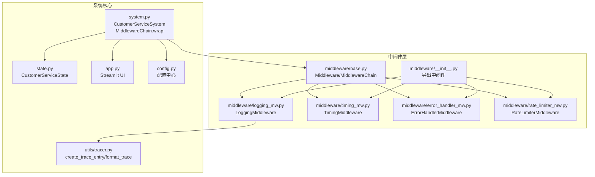
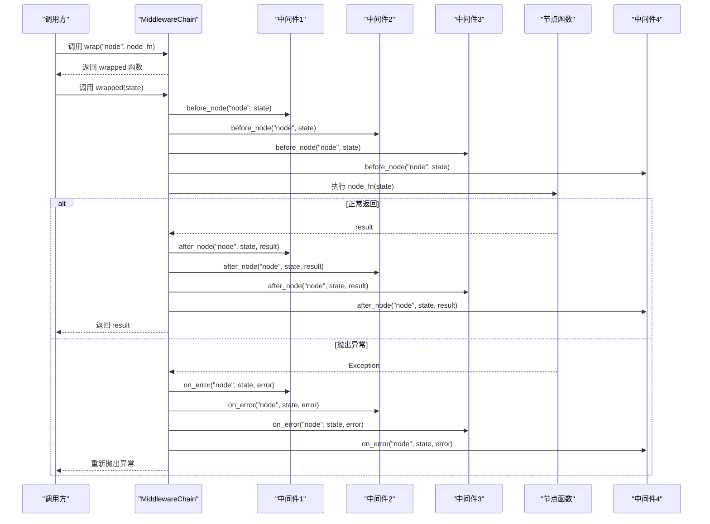
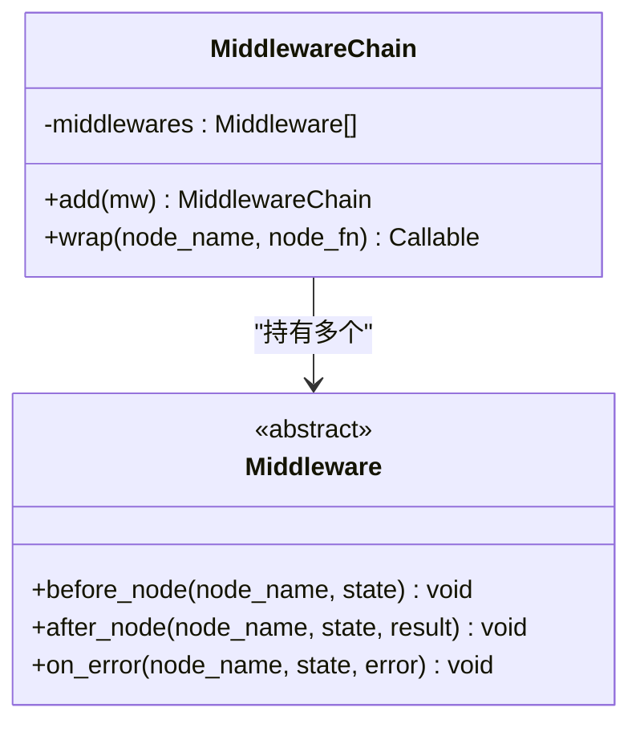
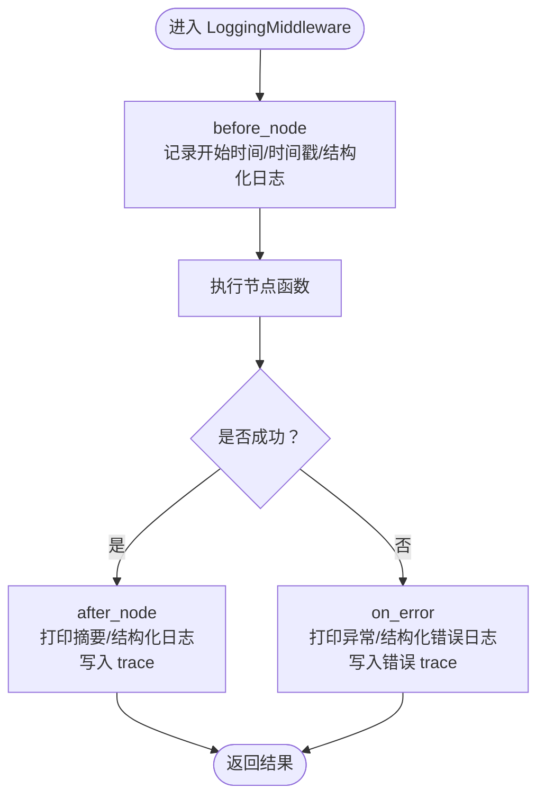
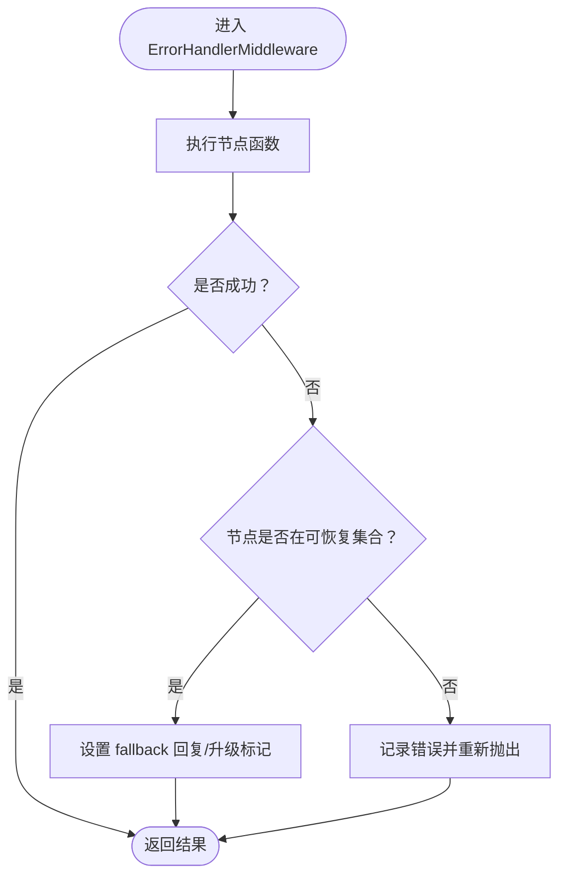
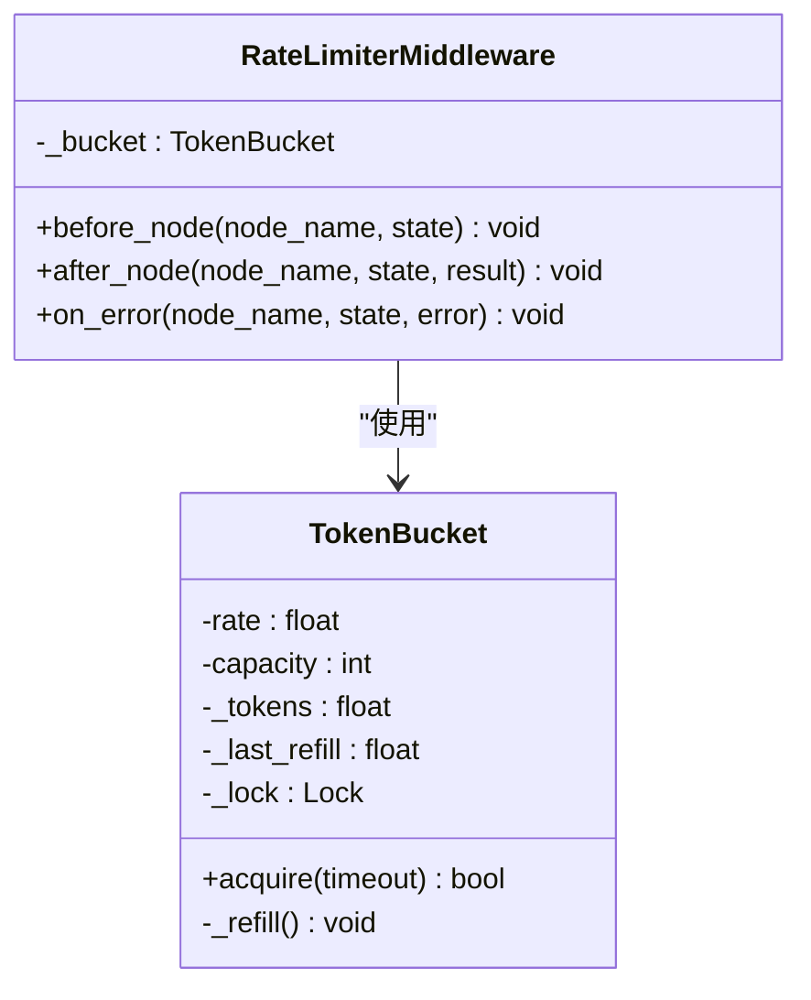
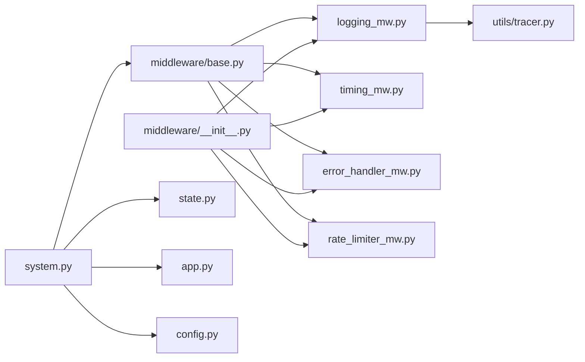

# 中间件系统设计

<cite>
**本文档引用的文件**
- [middleware/base.py](file://middleware/base.py)
- [middleware/__init__.py](file://middleware/__init__.py)
- [middleware/logging_mw.py](file://middleware/logging_mw.py)
- [middleware/timing_mw.py](file://middleware/timing_mw.py)
- [middleware/error_handler_mw.py](file://middleware/error_handler_mw.py)
- [middleware/rate_limiter_mw.py](file://middleware/rate_limiter_mw.py)
- [system.py](file://system.py)
- [state.py](file://state.py)
- [utils/tracer.py](file://utils/tracer.py)
- [app.py](file://app.py)
- [config.py](file://config.py)
</cite>

## 更新摘要
**变更内容**
- 完善了中间件基础设施的全面实现分析
- 新增了详细的中间件优先级管理和异常处理策略
- 补充了中间件与系统核心的深度集成方式
- 增强了性能考量和故障排查指南
- 更新了自定义中间件开发的最佳实践

## 目录
1. [简介](#简介)
2. [项目结构](#项目结构)
3. [核心组件](#核心组件)
4. [架构总览](#架构总览)
5. [详细组件分析](#详细组件分析)
6. [依赖关系分析](#依赖关系分析)
7. [性能考量](#性能考量)
8. [故障排查指南](#故障排查指南)
9. [结论](#结论)
10. [附录](#附录)

## 简介
本设计文档围绕中间件系统展开，系统性阐述横切关注点的统一处理机制。Middleware 基类定义了 before_node、after_node、on_error 三个生命周期钩子，MiddlewareChain 作为编排器负责将任意 LangGraph 节点函数包裹为"前置 → 执行 → 后置/异常"的统一流程。该体系覆盖日志记录、性能计时、错误处理、速率限制四大类中间件，并提供注册与配置机制、优先级管理策略、异常处理策略、与系统核心的集成方式以及调试与监控最佳实践。

## 项目结构
中间件系统位于 middleware 目录，配合 system.py 构建 LangGraph 工作流，通过 MiddlewareChain.wrap 将横切逻辑注入到各个节点函数中。状态对象 state.CustomerServiceState 提供共享数据载体，utils.tracer 提供 trace 记录能力，UI 层 app.py 展示 trace 与耗时信息。

**图表来源**
- [middleware/base.py:1-94](file://middleware/base.py#L1-L94)
- [middleware/__init__.py:1-26](file://middleware/__init__.py#L1-L26)
- [middleware/logging_mw.py:1-123](file://middleware/logging_mw.py#L1-L123)
- [middleware/timing_mw.py:1-55](file://middleware/timing_mw.py#L1-L55)
- [middleware/error_handler_mw.py:1-65](file://middleware/error_handler_mw.py#L1-L65)
- [middleware/rate_limiter_mw.py:1-94](file://middleware/rate_limiter_mw.py#L1-L94)
- [system.py:1-305](file://system.py#L1-L305)
- [state.py:1-58](file://state.py#L1-L58)
- [utils/tracer.py:1-78](file://utils/tracer.py#L1-L78)
- [app.py:1-177](file://app.py#L1-L177)
- [config.py:1-75](file://config.py#L1-L75)

**章节来源**
- [system.py:58-64](file://system.py#L58-L64)
- [middleware/__init__.py:12-25](file://middleware/__init__.py#L12-L25)

## 核心组件
- **Middleware 抽象基类**：定义 before_node、after_node、on_error 三个钩子，约束子类实现。
- **MiddlewareChain**：维护中间件列表，提供 add 与 wrap 方法，wrap 返回带横切逻辑的包装函数。
- **LoggingMiddleware**：结构化日志与 trace 记录，输出节点摘要与耗时。
- **TimingMiddleware**：节点耗时统计，写入 state.metadata.node_timings。
- **ErrorHandlerMiddleware**：可恢复节点异常兜底，设置 fallback 回复与升级标记。
- **RateLimiterMiddleware**：基于令牌桶对 LLM 节点进行限流，避免超频。

**章节来源**
- [middleware/base.py:14-43](file://middleware/base.py#L14-L43)
- [middleware/base.py:46-94](file://middleware/base.py#L46-L94)
- [middleware/logging_mw.py:32-106](file://middleware/logging_mw.py#L32-L106)
- [middleware/timing_mw.py:13-55](file://middleware/timing_mw.py#L13-L55)
- [middleware/error_handler_mw.py:27-65](file://middleware/error_handler_mw.py#L27-L65)
- [middleware/rate_limiter_mw.py:60-94](file://middleware/rate_limiter_mw.py#L60-L94)

## 架构总览
中间件链在系统初始化时创建，按注册顺序依次执行。MiddlewareChain.wrap 将节点函数包装为统一流程：先依次调用每个中间件的 before_node，再执行原节点函数，若成功则依次调用 after_node，若抛异常则依次调用 on_error 并重新抛出。这种设计确保横切关注点与业务逻辑解耦，便于扩展与维护。

**图表来源**
- [middleware/base.py:63-94](file://middleware/base.py#L63-L94)

**章节来源**
- [system.py:58-64](file://system.py#L58-L64)
- [system.py:200-209](file://system.py#L200-L209)

## 详细组件分析

### Middleware 基类与 MiddlewareChain
- **设计要点**
  - 抽象基类定义三阶段钩子，强制子类实现，保证一致性。
  - MiddlewareChain 维护中间件列表，wrap 返回闭包函数，内部遍历中间件执行对应钩子。
  - 通过在 try/except 中分别调用 on_error，确保异常路径也能执行所有中间件的清理逻辑。
- **执行顺序**
  - before_node：按注册顺序依次执行。
  - 执行节点函数：仅在所有 before_node 成功后执行。
  - after_node/on_error：无论成功与否，均按注册顺序依次执行。
- **性能与复杂度**
  - wrap 为 O(n) 钩子调用，n 为中间件数量；节点函数执行时间由具体实现决定。
- **可扩展性**
  - 通过 add 方法动态追加中间件，支持链式调用，便于按需组合。

**图表来源**
- [middleware/base.py:14-43](file://middleware/base.py#L14-L43)
- [middleware/base.py:46-94](file://middleware/base.py#L46-L94)

**章节来源**
- [middleware/base.py:14-43](file://middleware/base.py#L14-L43)
- [middleware/base.py:46-94](file://middleware/base.py#L46-L94)

### 日志中间件（LoggingMiddleware）
- **功能职责**
  - before_node：打印节点开始信息，记录结构化日志，记录开始时间与时间戳。
  - after_node：打印节点摘要，记录结构化日志，写入 trace（状态 metadata 中）。
  - on_error：打印异常信息，记录结构化错误日志，写入错误 trace。
- **与状态集成**
  - 使用 state.metadata.trace 追加 trace 条目，条目包含节点名、起止时间、耗时、状态、摘要或错误信息。
- **输出特性**
  - 控制台打印节点标签与摘要，便于快速定位问题。
- **复杂度与性能**
  - 摘要提取与 trace 写入为 O(1)，对整体性能影响极小。

**图表来源**
- [middleware/logging_mw.py:39-106](file://middleware/logging_mw.py#L39-L106)
- [utils/tracer.py:11-29](file://utils/tracer.py#L11-L29)

**章节来源**
- [middleware/logging_mw.py:32-106](file://middleware/logging_mw.py#L32-L106)
- [utils/tracer.py:11-29](file://utils/tracer.py#L11-L29)

### 性能计时中间件（TimingMiddleware）
- **功能职责**
  - before_node：记录节点开始时间。
  - after_node：计算耗时并写入 state.metadata.node_timings，同时打印耗时。
  - on_error：计算异常耗时并打印。
- **与状态集成**
  - 将耗时以毫秒为单位写入 state.metadata.node_timings[node_name]。
- **复杂度与性能**
  - 时间戳读取与字典写入为 O(1)，开销极低。

```mermaid
flowchart TD
Start(["进入 TimingMiddleware"]) --> T0["before_node<br/>记录开始时间"]
T0 --> Exec["执行节点函数"]
Exec --> Ok{"是否成功？"}
Ok --> |是| T1["after_node<br/>计算耗时(ms)<br/>写入 metadata.node_timings<br/>打印耗时"]
Ok --> |否| E1["on_error<br/>计算异常耗时(ms)<br/>打印耗时"]
T1 --> End(["返回结果"])
E1 --> End
```

**图表来源**
- [middleware/timing_mw.py:20-55](file://middleware/timing_mw.py#L20-L55)

**章节来源**
- [middleware/timing_mw.py:13-55](file://middleware/timing_mw.py#L13-L55)

### 错误处理中间件（ErrorHandlerMiddleware）
- **功能职责**
  - on_error：对可恢复节点（如技术支持、订单服务、产品咨询、质量检查、画像提取）设置 fallback 回复与升级标记，便于后续节点继续处理。
  - 保持异常向上传递，确保 LangGraph 节点函数可自行捕获并利用状态中的兜底信息。
- **可恢复节点集合**
  - 通过集合 _RECOVERABLE_NODES 管理，便于扩展与维护。
- **复杂度与性能**
  - 状态写入与日志记录为 O(1)。

**图表来源**
- [middleware/error_handler_mw.py:46-65](file://middleware/error_handler_mw.py#L46-L65)

**章节来源**
- [middleware/error_handler_mw.py:27-65](file://middleware/error_handler_mw.py#L27-L65)

### 速率限制中间件（RateLimiterMiddleware）
- **功能职责**
  - 仅对包含 LLM 调用的节点（_LLM_NODES）生效，在 before_node 中尝试获取令牌，超时则抛出异常。
- **令牌桶实现**
  - TokenBucket：支持 rate（每秒补充）、capacity（桶容量）、acquire（阻塞获取，带超时）。
  - acquire 循环 refill 并尝试扣减令牌，超过 deadline 返回失败。
- **复杂度与性能**
  - acquire 为 O(k)（k 为等待重试次数），通常很快返回；限流逻辑对吞吐有约束作用。

**图表来源**
- [middleware/rate_limiter_mw.py:24-58](file://middleware/rate_limiter_mw.py#L24-L58)
- [middleware/rate_limiter_mw.py:60-94](file://middleware/rate_limiter_mw.py#L60-L94)

**章节来源**
- [middleware/rate_limiter_mw.py:60-94](file://middleware/rate_limiter_mw.py#L60-L94)

### 中间件注册与配置机制
- **系统初始化**
  - 在 CustomerServiceSystem.__init__ 中创建 MiddlewareChain，并按顺序添加中间件：日志 → 计时 → 错误处理 → 限流。
  - 通过 wrap("node", node_fn) 将节点函数包裹，注入横切逻辑。
- **导出与导入**
  - middleware/__init__.py 统一导出中间件类，便于系统模块按需引入。
- **配置项**
  - RateLimiterMiddleware 支持构造参数 rate 与 capacity，可在初始化时调整限流策略。
  - 可恢复节点集合可通过修改 _RECOVERABLE_NODES 进行扩展。

**章节来源**
- [system.py:58-64](file://system.py#L58-L64)
- [system.py:200-209](file://system.py#L200-L209)
- [middleware/__init__.py:12-25](file://middleware/__init__.py#L12-L25)
- [middleware/rate_limiter_mw.py:68-69](file://middleware/rate_limiter_mw.py#L68-L69)

### 中间件优先级管理与异常处理策略
- **优先级顺序**
  - 系统采用固定顺序：日志 → 计时 → 错误处理 → 限流。该顺序确保：
    - 日志最先记录，便于定位问题；
    - 计时在节点执行前后均可用；
    - 错误处理在异常发生时尽早兜底；
    - 限流在节点执行前生效，避免超频。
- **异常处理策略**
  - on_error 钩子在异常路径上同样按注册顺序执行，确保清理与记录一致。
  - ErrorHandlerMiddleware 对可恢复节点设置兜底状态，异常仍向上抛出，便于上层捕获与处理。
  - RateLimiterMiddleware 在 acquire 超时时抛出异常，阻止后续节点执行。

**章节来源**
- [system.py:58-64](file://system.py#L58-L64)
- [middleware/base.py:77-82](file://middleware/base.py#L77-L82)
- [middleware/error_handler_mw.py:59-65](file://middleware/error_handler_mw.py#L59-L65)
- [middleware/rate_limiter_mw.py:75-77](file://middleware/rate_limiter_mw.py#L75-L77)

### 中间件与系统核心的集成方式
- **LangGraph 节点集成**
  - 通过 MiddlewareChain.wrap 将节点函数包装，注入三阶段钩子，无需修改节点内部逻辑。
- **状态对象集成**
  - LoggingMiddleware 与 TimingMiddleware 均通过 state.metadata 写入 trace 与 node_timings，UI 层可直接读取展示。
- **UI 展示**
  - app.py 读取 state.metadata.node_timings 与 trace，格式化展示节点耗时与调用链追踪。
- **配置中心**
  - config.py 提供业务阈值与模型初始化，中间件不直接依赖，但可与业务规则协同工作。

**章节来源**
- [system.py:200-209](file://system.py#L200-L209)
- [middleware/logging_mw.py:65-76](file://middleware/logging_mw.py#L65-L76)
- [middleware/timing_mw.py:37-41](file://middleware/timing_mw.py#L37-L41)
- [app.py:103-123](file://app.py#L103-L123)
- [config.py:35-39](file://config.py#L35-L39)

## 依赖关系分析
中间件系统与系统核心的依赖关系如下：

**图表来源**
- [middleware/base.py:1-94](file://middleware/base.py#L1-L94)
- [middleware/__init__.py:12-25](file://middleware/__init__.py#L12-L25)
- [system.py:24-31](file://system.py#L24-L31)
- [state.py:28-58](file://state.py#L28-L58)
- [utils/tracer.py:11-29](file://utils/tracer.py#L11-L29)
- [app.py:1-177](file://app.py#L1-L177)
- [config.py:1-75](file://config.py#L1-L75)

**章节来源**
- [system.py:24-31](file://system.py#L24-L31)
- [middleware/__init__.py:12-25](file://middleware/__init__.py#L12-L25)

## 性能考量
- **中间件开销**
  - 三阶段钩子均为 O(n)，n 为中间件数量；节点函数执行时间取决于具体实现。
  - LoggingMiddleware 与 TimingMiddleware 的 IO 与字典写入开销极低。
- **限流影响**
  - RateLimiterMiddleware 在 acquire 超时会阻塞等待，可能影响吞吐；可通过调整 rate 与 capacity 平衡稳定性与性能。
- **UI 展示**
  - app.py 读取 metadata 展示 trace 与耗时，不会对核心执行路径造成额外负担。

## 故障排查指南
- **日志与追踪**
  - 通过 LoggingMiddleware 的结构化日志与 trace 记录定位节点执行情况与异常。
  - UI 层 app.py 展示 trace 与耗时，便于快速定位瓶颈与错误节点。
- **异常兜底**
  - ErrorHandlerMiddleware 对可恢复节点设置 fallback 回复与升级标记，若异常仍向上抛出，可在上层捕获并处理。
- **限流问题**
  - 若出现限流超时异常，检查 RateLimiterMiddleware 的 rate 与 capacity 参数，适当提高容量或降低并发。
- **状态核验**
  - 通过 state.CustomerServiceState 的字段核验中间件写入是否正确，如 metadata.node_timings、trace 等。

**章节来源**
- [middleware/logging_mw.py:43-106](file://middleware/logging_mw.py#L43-L106)
- [middleware/error_handler_mw.py:59-65](file://middleware/error_handler_mw.py#L59-L65)
- [middleware/rate_limiter_mw.py:75-77](file://middleware/rate_limiter_mw.py#L75-L77)
- [app.py:103-123](file://app.py#L103-L123)

## 结论
中间件系统通过 Middleware 基类与 MiddlewareChain 实现横切关注点的统一注入，具备良好的扩展性与可维护性。日志、计时、错误处理、限流四类中间件覆盖了生产环境的关键需求，结合状态对象与 UI 展示，形成完整的可观测性闭环。通过合理的优先级顺序与异常处理策略，系统在保证稳定性的同时兼顾性能与可调试性。

## 附录

### 自定义中间件开发指南
- **实现步骤**
  - 继承 Middleware，实现 before_node、after_node、on_error 三个方法。
  - 在 CustomerServiceSystem 中通过 MiddlewareChain.add 或重新构建链来注册新中间件。
  - 注意钩子执行顺序与异常路径的一致性，确保资源清理与日志记录完整。
- **最佳实践**
  - 钩子内避免长时间阻塞操作，必要时异步化。
  - 对关键状态写入进行幂等处理，避免重复写入。
  - 为新中间件提供清晰的日志与错误信息，便于调试。

**章节来源**
- [middleware/base.py:14-43](file://middleware/base.py#L14-L43)
- [system.py:58-64](file://system.py#L58-L64)

### 中间件与状态对象的关系
- **状态字段**
  - metadata.node_timings：由 TimingMiddleware 写入节点耗时。
  - metadata.trace：由 LoggingMiddleware 写入 trace 条目。
  - needs_escalation、escalation_reason：由 ErrorHandlerMiddleware 设置。
  - agent_response：由 ErrorHandlerMiddleware 设置兜底回复。
- **UI 展示**
  - app.py 读取 metadata.node_timings 与 trace，格式化展示。

**章节来源**
- [state.py:28-58](file://state.py#L28-L58)
- [middleware/timing_mw.py:37-41](file://middleware/timing_mw.py#L37-L41)
- [middleware/logging_mw.py:65-76](file://middleware/logging_mw.py#L65-L76)
- [middleware/error_handler_mw.py:61-63](file://middleware/error_handler_mw.py#L61-L63)
- [app.py:103-123](file://app.py#L103-L123)

### 中间件调试与监控最佳实践
- **调试技巧**
  - 利用 LoggingMiddleware 的结构化日志快速定位问题节点。
  - 通过 app.py 的 expander 展示详细处理摘要，包括节点耗时和调用链追踪。
  - 使用 ErrorHandlerMiddleware 的兜底机制进行异常恢复测试。
- **监控指标**
  - 关注 metadata.node_timings 中的节点耗时分布。
  - 监控 trace 中的状态变化和错误发生频率。
  - 跟踪 needs_escalation 和 escalation_reason 的触发条件。
- **性能优化**
  - 根据实际业务场景调整 RateLimiterMiddleware 的 rate 和 capacity。
  - 优化可恢复节点的异常处理逻辑，减少不必要的升级。
  - 定期审查中间件链的执行顺序，确保关键中间件的优先级合理。

**章节来源**
- [app.py:153-170](file://app.py#L153-L170)
- [middleware/rate_limiter_mw.py:68-69](file://middleware/rate_limiter_mw.py#L68-L69)
- [middleware/error_handler_mw.py:59-65](file://middleware/error_handler_mw.py#L59-L65)