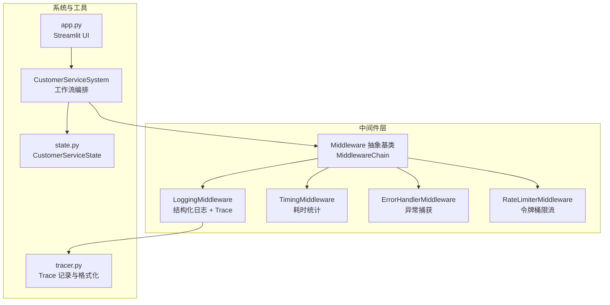
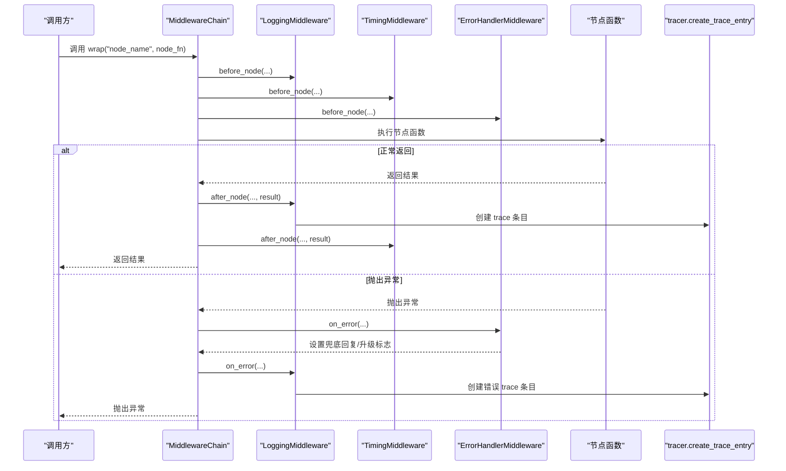
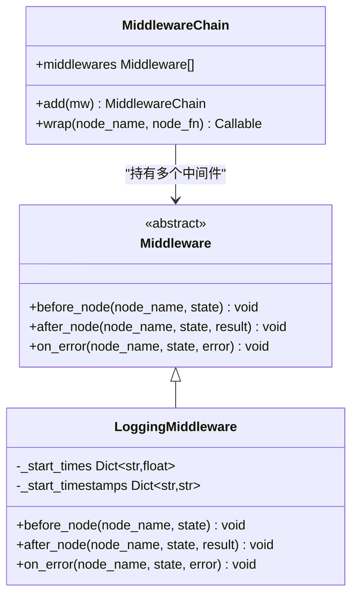
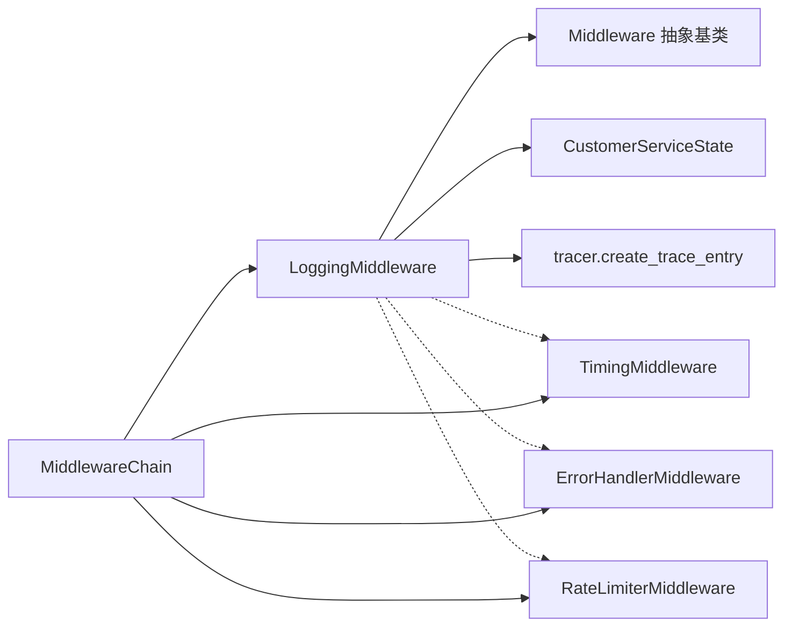

# 日志中间件

<cite>
**本文引用的文件**
- [middleware/logging_mw.py](file://middleware/logging_mw.py)
- [middleware/base.py](file://middleware/base.py)
- [middleware/timing_mw.py](file://middleware/timing_mw.py)
- [middleware/error_handler_mw.py](file://middleware/error_handler_mw.py)
- [middleware/rate_limiter_mw.py](file://middleware/rate_limiter_mw.py)
- [middleware/__init__.py](file://middleware/__init__.py)
- [system.py](file://system.py)
- [app.py](file://app.py)
- [utils/tracer.py](file://utils/tracer.py)
- [state.py](file://state.py)
- [README.md](file://README.md)
</cite>

## 目录
1. [简介](#简介)
2. [项目结构](#项目结构)
3. [核心组件](#核心组件)
4. [架构总览](#架构总览)
5. [详细组件分析](#详细组件分析)
6. [依赖关系分析](#依赖关系分析)
7. [性能考量](#性能考量)
8. [故障排查指南](#故障排查指南)
9. [结论](#结论)
10. [附录](#附录)

## 简介
本文件聚焦“日志中间件”的实现与应用，系统性阐述其如何在多智能体客服系统中实现统一的日志记录机制，涵盖节点执行前后状态记录、执行时间统计、错误信息捕获、日志格式规范、日志级别与输出配置，并说明如何通过日志中间件实现可观测性（用户交互追踪、Agent 执行过程记录、性能指标收集），以及配置选项与自定义日志格式的方法。同时给出日志分析与调试的实际应用场景。

## 项目结构
日志中间件位于 middleware/logging_mw.py，配合中间件基础设施 middleware/base.py、计时中间件 middleware/timing_mw.py、异常处理中间件 middleware/error_handler_mw.py、限流中间件 middleware/rate_limiter_mw.py，以及追踪工具 utils/tracer.py、系统入口 system.py、Web UI app.py、状态定义 state.py 等共同构成可观测性体系。

图表来源
- [middleware/base.py:46-94](file://middleware/base.py#L46-L94)
- [middleware/logging_mw.py:32-123](file://middleware/logging_mw.py#L32-L123)
- [middleware/timing_mw.py:13-55](file://middleware/timing_mw.py#L13-L55)
- [middleware/error_handler_mw.py:27-65](file://middleware/error_handler_mw.py#L27-L65)
- [middleware/rate_limiter_mw.py:60-94](file://middleware/rate_limiter_mw.py#L60-L94)
- [system.py:58-76](file://system.py#L58-L76)
- [utils/tracer.py:11-78](file://utils/tracer.py#L11-L78)
- [state.py:28-58](file://state.py#L28-L58)
- [app.py:103-123](file://app.py#L103-L123)

章节来源
- [README.md:95-133](file://README.md#L95-L133)
- [system.py:58-76](file://system.py#L58-L76)

## 核心组件
- 中间件基础设施：定义 Middleware 抽象基类与 MiddlewareChain 编排器，提供 before_node/after_node/on_error 三阶段钩子，支持按注册顺序依次执行所有中间件。
- 日志中间件 LoggingMiddleware：负责节点执行前后的结构化日志记录、执行时间统计、错误信息捕获，并向 state["metadata"]["trace"] 写入调用链追踪条目。
- 计时中间件 TimingMiddleware：统计节点耗时并写入 state["metadata"]["node_timings"]。
- 异常处理中间件 ErrorHandlerMiddleware：在可恢复节点发生异常时设置兜底回复与升级标志，避免工作流中断。
- 限流中间件 RateLimiterMiddleware：对涉及 LLM 调用的节点进行令牌桶限流，防止超频。
- 追踪工具 tracer.py：提供创建 trace 条目、格式化 trace 文本、以及 UI 展示所需的结构化数据。
- 系统入口 system.py：在 CustomerServiceSystem 中装配中间件链，将中间件包裹到各节点函数上。
- Web UI app.py：展示 trace 与节点耗时，辅助可观测性。

章节来源
- [middleware/base.py:14-43](file://middleware/base.py#L14-L43)
- [middleware/base.py:46-94](file://middleware/base.py#L46-L94)
- [middleware/logging_mw.py:32-123](file://middleware/logging_mw.py#L32-L123)
- [middleware/timing_mw.py:13-55](file://middleware/timing_mw.py#L13-L55)
- [middleware/error_handler_mw.py:27-65](file://middleware/error_handler_mw.py#L27-L65)
- [middleware/rate_limiter_mw.py:60-94](file://middleware/rate_limiter_mw.py#L60-L94)
- [utils/tracer.py:11-78](file://utils/tracer.py#L11-L78)
- [system.py:58-76](file://system.py#L58-L76)
- [app.py:103-123](file://app.py#L103-L123)

## 架构总览
日志中间件通过 MiddlewareChain.wrap 将三阶段钩子注入到 LangGraph 节点函数中，形成“before → execute → after / on_error”的统一控制流。LoggingMiddleware 在 before 阶段打印节点开始、记录日志与开始时间；在 after 阶段记录完成与摘要，并写入 trace；在 on_error 阶段记录异常并写入错误 trace。计时中间件在相同钩子中统计耗时并写入 metadata，异常处理中间件在异常时设置兜底回复与升级标志，限流中间件在 before 阶段进行令牌桶校验。

图表来源
- [middleware/base.py:63-94](file://middleware/base.py#L63-L94)
- [middleware/logging_mw.py:39-105](file://middleware/logging_mw.py#L39-L105)
- [middleware/timing_mw.py:20-55](file://middleware/timing_mw.py#L20-L55)
- [middleware/error_handler_mw.py:46-65](file://middleware/error_handler_mw.py#L46-L65)
- [utils/tracer.py:11-29](file://utils/tracer.py#L11-L29)

## 详细组件分析

### 日志中间件（LoggingMiddleware）
- 职责与流程
  - before_node：打印节点开始、记录 INFO 日志（包含节点名与用户消息摘要）、记录开始时间与 ISO 时间戳。
  - after_node：打印摘要行、记录 INFO 日志（包含节点名与摘要）、计算耗时并写入 trace；将 trace 追加到 state["metadata"]["trace"]。
  - on_error：打印错误行、记录 ERROR 日志（包含节点名、异常类型与异常信息）、计算耗时并写入错误 trace。
- 日志格式规范
  - 统一使用结构化日志格式，包含节点名、状态（START/DONE/ERROR）、摘要或错误信息。
  - 用户消息摘要采用截断策略，避免过长内容影响日志可读性。
- 日志级别与输出
  - INFO：节点开始与完成（含摘要）。
  - ERROR：节点异常（含异常类型与异常信息）。
  - 控制台输出：节点开始与摘要行，便于快速定位。
- 摘要提取规则
  - 意图分类：输出意图与置信度。
  - 画像提取：输出当前用户画像。
  - 质量检查：输出质量评分。
- Trace 写入
  - 使用 tracer.create_trace_entry 创建条目，包含节点名、开始/结束时间、耗时（毫秒）、状态（ok/error）、摘要或错误信息，并追加到 metadata.trace。

图表来源
- [middleware/base.py:14-43](file://middleware/base.py#L14-L43)
- [middleware/base.py:46-94](file://middleware/base.py#L46-L94)
- [middleware/logging_mw.py:32-123](file://middleware/logging_mw.py#L32-L123)

章节来源
- [middleware/logging_mw.py:32-123](file://middleware/logging_mw.py#L32-L123)
- [utils/tracer.py:11-29](file://utils/tracer.py#L11-L29)

### 计时中间件（TimingMiddleware）
- 职责与流程
  - before_node：记录节点开始时间。
  - after_node：计算耗时（毫秒），写入 state["metadata"]["node_timings"]，并打印耗时。
  - on_error：计算异常耗时并打印。
- 与日志中间件的关系
  - 两者均在相同钩子中运行，互不冲突，分别负责“耗时统计”和“日志记录”。

章节来源
- [middleware/timing_mw.py:13-55](file://middleware/timing_mw.py#L13-L55)

### 异常处理中间件（ErrorHandlerMiddleware）
- 职责与流程
  - on_error：记录异常日志，对可恢复节点设置兜底回复与升级标志，避免工作流崩溃。
- 与日志中间件的关系
  - 异常处理中间件在异常时设置兜底状态，日志中间件记录异常并写入错误 trace，二者协同保证可观测性与稳定性。

章节来源
- [middleware/error_handler_mw.py:27-65](file://middleware/error_handler_mw.py#L27-L65)

### 限流中间件（RateLimiterMiddleware）
- 职责与流程
  - before_node：对涉及 LLM 调用的节点进行令牌桶获取，超时则抛出异常。
- 与日志中间件的关系
  - 限流中间件不直接记录日志，但其异常会在异常处理中间件与日志中间件中被记录与追踪。

章节来源
- [middleware/rate_limiter_mw.py:60-94](file://middleware/rate_limiter_mw.py#L60-L94)

### 追踪工具（tracer.py）
- 职责与流程
  - create_trace_entry：创建 trace 条目，包含节点名、开始/结束时间、耗时、状态、摘要或错误信息。
  - format_trace：将 trace 列表格式化为可读字符串。
  - format_trace_for_ui：将 trace 格式化为 UI 展示所需结构。
- 与日志中间件的关系
  - 日志中间件在 after_node 与 on_error 中调用 create_trace_entry 写入 trace，UI 通过 format_trace_for_ui 展示。

章节来源
- [utils/tracer.py:11-78](file://utils/tracer.py#L11-L78)

### 系统集成（system.py）
- 职责与流程
  - 在 CustomerServiceSystem 中创建中间件链，按顺序包含 LoggingMiddleware、TimingMiddleware、ErrorHandlerMiddleware、RateLimiterMiddleware。
  - 使用 MiddlewareChain.wrap 将中间件注入到各节点函数，确保统一的可观测性与稳定性。
- 与日志中间件的关系
  - 中间件链的装配决定了日志中间件在执行流程中的位置与作用范围。

章节来源
- [system.py:58-76](file://system.py#L58-L76)
- [system.py:196-246](file://system.py#L196-L246)

### Web UI 展示（app.py）
- 职责与流程
  - 展示最近一次处理的元信息（意图、质量、置信度、升级标记）。
  - 展示节点耗时（来自 metadata.node_timings）。
  - 展示调用链追踪（来自 metadata.trace，经 format_trace_for_ui 格式化）。
- 与日志中间件的关系
  - UI 通过读取 state["metadata"] 中的 trace 与 node_timings 展示日志中间件产出的可观测性数据。

章节来源
- [app.py:90-123](file://app.py#L90-L123)

## 依赖关系分析
- LoggingMiddleware 依赖
  - middleware.base.Middleware：继承抽象基类。
  - state.CustomerServiceState：读取/写入状态字段。
  - utils.tracer.create_trace_entry：创建 trace 条目。
- 与其他中间件的协作
  - MiddlewareChain.wrap 提供统一的 before/after/on_error 注入。
  - TimingMiddleware 与 LoggingMiddleware 并行统计耗时与记录日志。
  - ErrorHandlerMiddleware 与 LoggingMiddleware 并行处理异常与记录日志。
  - RateLimiterMiddleware 在 before 阶段进行限流，不影响日志中间件的记录逻辑。

图表来源
- [middleware/logging_mw.py:12-14](file://middleware/logging_mw.py#L12-L14)
- [middleware/base.py:14-43](file://middleware/base.py#L14-L43)
- [system.py:58-76](file://system.py#L58-L76)

章节来源
- [middleware/logging_mw.py:12-14](file://middleware/logging_mw.py#L12-L14)
- [middleware/base.py:14-43](file://middleware/base.py#L14-L43)
- [system.py:58-76](file://system.py#L58-L76)

## 性能考量
- 日志中间件的性能开销
  - 执行时间统计使用高精度计时器，开销极小。
  - 日志输出为结构化格式，避免复杂格式化成本。
- Trace 写入的成本
  - 每个节点写入一条 trace 条目，通常可忽略。
- UI 展示与格式化
  - UI 展示 trace 与耗时为只读操作，成本较低。
- 限流与异常处理
  - 限流中间件在 before 阶段进行令牌桶校验，异常处理中间件在异常时设置兜底状态，均不会显著增加日志中间件的负担。

## 故障排查指南
- 常见问题与定位
  - 节点长时间无响应：检查节点耗时（metadata.node_timings）与 trace 中的开始/结束时间，确认是否存在阻塞或慢调用。
  - 节点异常：查看日志中间件的 ERROR 日志与错误 trace，定位异常类型与异常信息。
  - 节点被限流：检查限流中间件的令牌桶状态与等待时间，必要时调整限流参数。
- 调试步骤
  - 在系统入口处开启更详细的日志级别，观察日志中间件输出。
  - 在 UI 中查看 trace 与节点耗时，结合业务语境判断异常节点。
  - 对异常节点进行单元测试与边界测试，验证异常处理逻辑。

章节来源
- [middleware/logging_mw.py:78-105](file://middleware/logging_mw.py#L78-L105)
- [middleware/error_handler_mw.py:46-65](file://middleware/error_handler_mw.py#L46-L65)
- [middleware/rate_limiter_mw.py:71-77](file://middleware/rate_limiter_mw.py#L71-L77)
- [app.py:103-123](file://app.py#L103-L123)

## 结论
日志中间件通过统一的三阶段钩子机制，实现了节点执行前后状态记录、执行时间统计与错误信息捕获，并将 trace 写入 state["metadata"]，为系统可观测性提供了坚实基础。配合计时、异常处理与限流中间件，系统在稳定性与性能方面得到全面保障。通过 UI 展示 trace 与耗时，开发者与运维人员能够快速定位问题、优化性能并提升用户体验。

## 附录

### 日志格式规范
- 统一日志格式
  - 节点开始：INFO 级别，包含节点名与用户消息摘要。
  - 节点完成：INFO 级别，包含节点名与摘要。
  - 节点异常：ERROR 级别，包含节点名、异常类型与异常信息。
- 摘要提取规则
  - 意图分类：意图与置信度。
  - 画像提取：当前用户画像。
  - 质量检查：质量评分。
- Trace 条目字段
  - 节点名、开始时间、结束时间、耗时（毫秒）、状态（ok/error）、摘要或错误信息。

章节来源
- [middleware/logging_mw.py:39-105](file://middleware/logging_mw.py#L39-L105)
- [utils/tracer.py:11-29](file://utils/tracer.py#L11-L29)

### 日志级别与输出配置
- 日志级别
  - INFO：节点开始与完成（含摘要）。
  - ERROR：节点异常（含异常类型与异常信息）。
- 输出位置
  - 控制台：节点开始与摘要行。
  - 日志系统：结构化日志记录（由日志框架配置决定）。
- 日志源
  - 日志中间件使用 customer_service 日志器，便于与其他中间件日志区分。

章节来源
- [middleware/logging_mw.py:16](file://middleware/logging_mw.py#L16)
- [middleware/error_handler_mw.py:13](file://middleware/error_handler_mw.py#L13)

### 配置选项与自定义日志格式
- 中间件链配置
  - 在系统入口中装配中间件顺序：日志 → 计时 → 异常捕获 → 限流。
- 自定义日志格式
  - 可通过修改日志中间件的 before_node/after_node/on_error 方法中的日志格式与摘要提取逻辑，实现自定义格式。
- Trace 输出
  - 可通过 tracer.format_trace 或 tracer.format_trace_for_ui 自定义 UI 展示格式。

章节来源
- [system.py:58-76](file://system.py#L58-L76)
- [middleware/logging_mw.py:39-105](file://middleware/logging_mw.py#L39-L105)
- [utils/tracer.py:32-78](file://utils/tracer.py#L32-L78)

### 实际应用场景
- 用户交互追踪
  - 通过 UI 展示 trace 与节点耗时，帮助定位用户问题与 Agent 执行路径。
- Agent 执行过程记录
  - 记录每个节点的开始、完成与异常，便于审计与回放。
- 性能指标收集
  - 通过节点耗时与 trace 统计，识别慢节点与瓶颈环节。
- 异常诊断
  - 通过 ERROR 日志与错误 trace，快速定位异常节点与异常原因。

章节来源
- [app.py:90-123](file://app.py#L90-L123)
- [middleware/logging_mw.py:78-105](file://middleware/logging_mw.py#L78-L105)