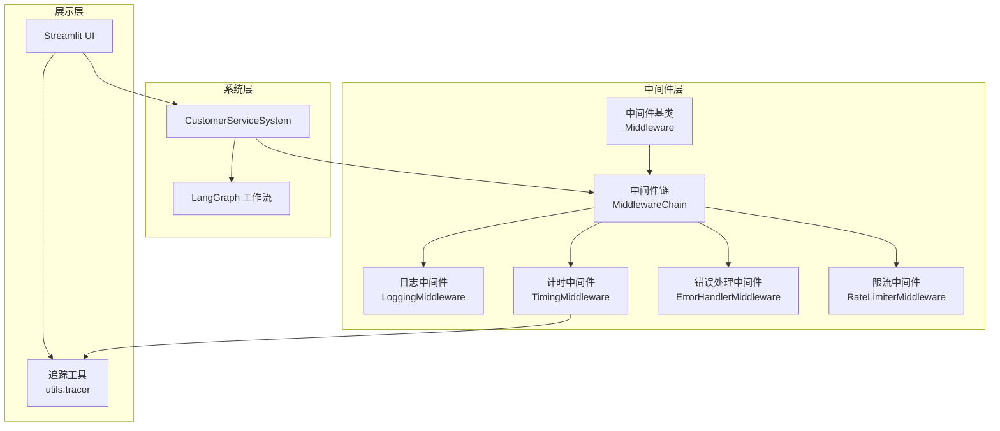
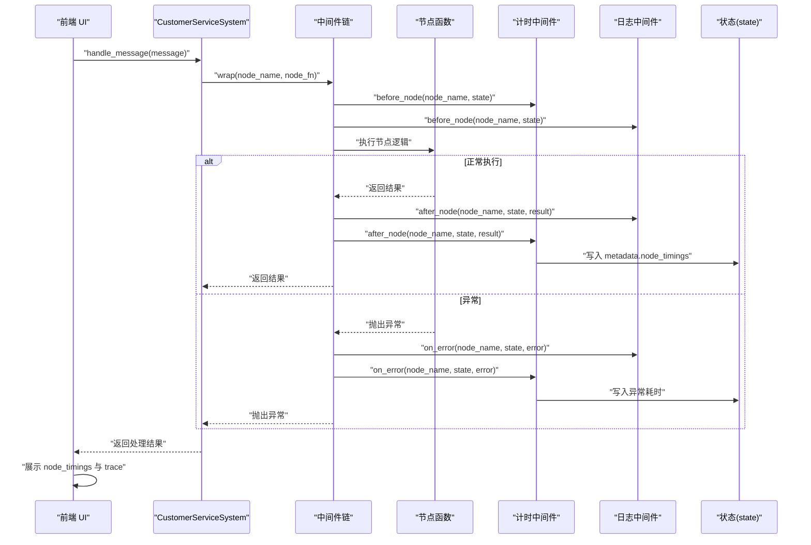
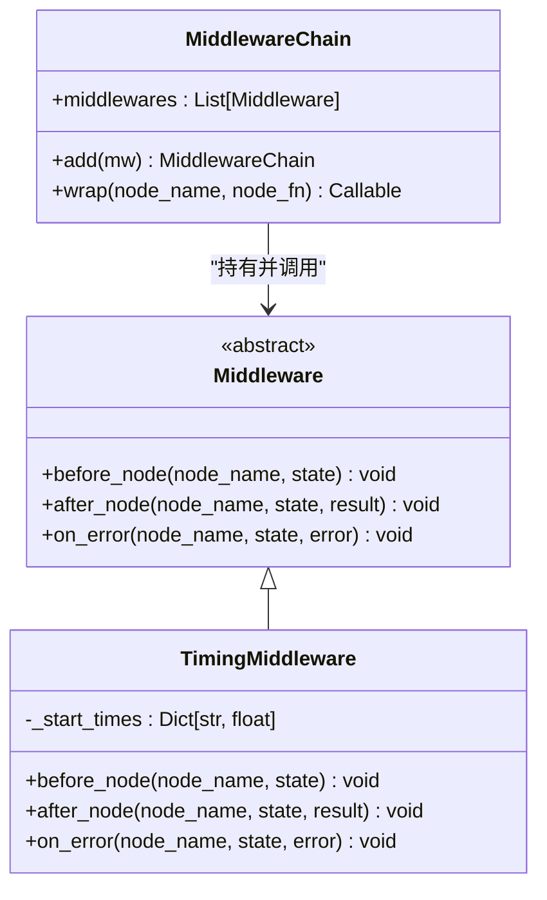
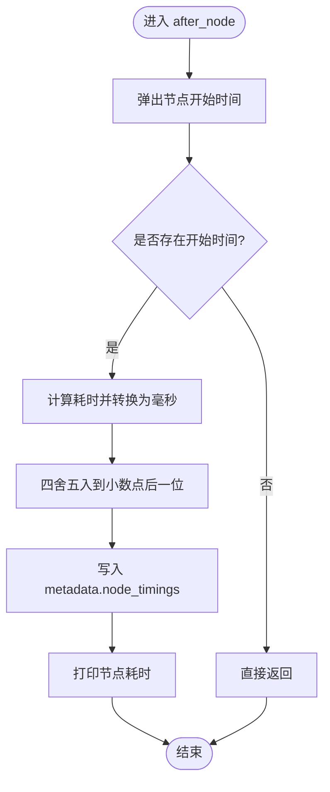
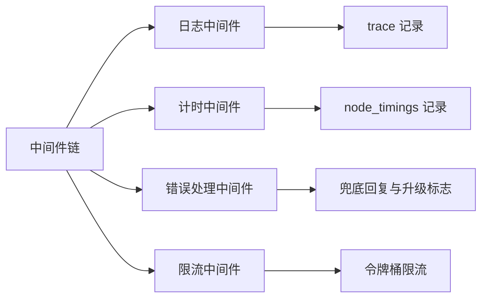
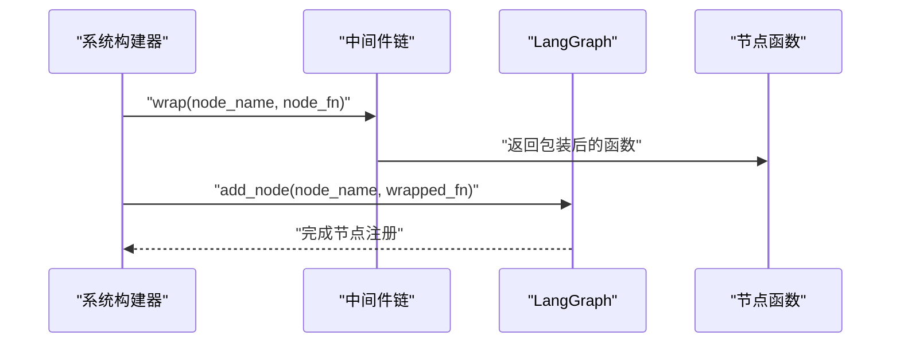
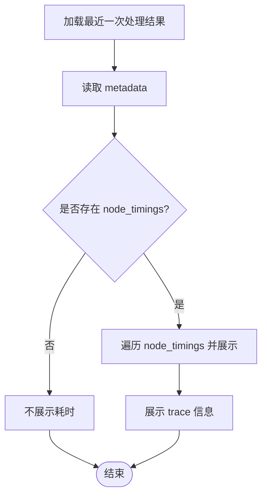
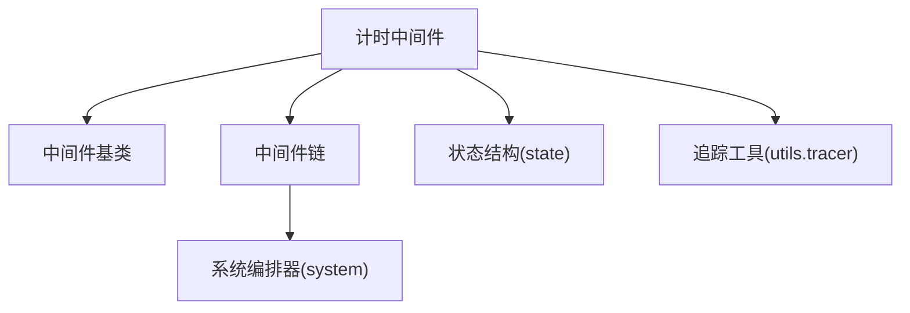

# 计时中间件

<cite>
**本文档引用的文件**
- [middleware/timing_mw.py](file://middleware/timing_mw.py)
- [middleware/base.py](file://middleware/base.py)
- [middleware/__init__.py](file://middleware/__init__.py)
- [middleware/logging_mw.py](file://middleware/logging_mw.py)
- [middleware/error_handler_mw.py](file://middleware/error_handler_mw.py)
- [middleware/rate_limiter_mw.py](file://middleware/rate_limiter_mw.py)
- [system.py](file://system.py)
- [app.py](file://app.py)
- [state.py](file://state.py)
- [utils/tracer.py](file://utils/tracer.py)
- [config.py](file://config.py)
</cite>

## 目录
1. [简介](#简介)
2. [项目结构](#项目结构)
3. [核心组件](#核心组件)
4. [架构总览](#架构总览)
5. [详细组件分析](#详细组件分析)
6. [依赖关系分析](#依赖关系分析)
7. [性能考量](#性能考量)
8. [故障排查指南](#故障排查指南)
9. [结论](#结论)
10. [附录](#附录)

## 简介
本文件聚焦于计时中间件的设计与实现，系统性阐述其如何在多智能体客服系统中精确测量节点执行时间并生成性能指标。计时中间件通过在节点执行前后注入钩子，记录每个节点的耗时，并将结果写入状态的元数据中，从而实现端到端的性能监控与瓶颈识别。该中间件提供毫秒级精度的时间测量，使用高精度计时器 `time.perf_counter()` 确保测量准确性，并通过 `round(elapsed * 1000, 1)` 将秒转换为毫秒并保留一位小数，兼顾精度与可读性。

## 项目结构
计时中间件位于 `middleware/timing_mw.py`，与基础中间件框架、系统编排、UI 展示以及追踪工具协同工作。关键文件与职责如下：
- `middleware/base.py`：定义中间件抽象基类与中间件链编排器，提供 `before/after/on_error` 三阶段钩子的统一注入机制。
- `middleware/timing_mw.py`：实现计时中间件，负责节点耗时统计与元数据写入。
- `system.py`：系统主类，负责构建 LangGraph 工作流并在节点函数上包裹中间件链。
- `app.py`：Streamlit 前端，展示节点耗时与调用链追踪。
- `utils/tracer.py`：提供 trace 记录与格式化工具，与计时中间件共同构成性能观测闭环。
- `state.py`：定义工作流状态结构，包含 `metadata` 字段用于承载性能与追踪数据。
- `middleware/*`：包含日志、错误处理、限流等中间件，与计时中间件共同组成中间件链。

**图表来源**
- [middleware/base.py:46-94](file://middleware/base.py#L46-L94)
- [middleware/timing_mw.py:13-55](file://middleware/timing_mw.py#L13-L55)
- [system.py:58-76](file://system.py#L58-L76)
- [app.py:90-123](file://app.py#L90-L123)
- [utils/tracer.py:11-78](file://utils/tracer.py#L11-L78)

**章节来源**
- [middleware/base.py:1-94](file://middleware/base.py#L1-L94)
- [middleware/timing_mw.py:1-55](file://middleware/timing_mw.py#L1-L55)
- [system.py:1-305](file://system.py#L1-L305)
- [app.py:1-177](file://app.py#L1-L177)
- [utils/tracer.py:1-78](file://utils/tracer.py#L1-L78)
- [state.py:1-58](file://state.py#L1-L58)

## 核心组件
- **中间件基类与链编排器**
  - `Middleware` 抽象基类定义 `before_node`、`after_node`、`on_error` 三个钩子，确保所有中间件遵循统一接口。
  - `MiddlewareChain.wrap` 将任意节点函数包裹为带钩子的包装函数，按注册顺序依次执行中间件的钩子，实现横切关注点的解耦注入。
- **计时中间件**
  - 维护节点名到开始时间的映射，使用高精度计时器 `time.perf_counter()` 记录节点执行耗时，并将毫秒级耗时写入 `state["metadata"]["node_timings"]`。
  - 在异常场景下同样计算并打印耗时，保证异常路径的可观测性。
- **日志中间件**
  - 与计时中间件配合，记录节点执行摘要与 trace，形成完整的调用链追踪。
- **错误处理与限流中间件**
  - 提供异常兜底与 LLM 节点限流，保障系统稳定性，间接影响节点执行时间分布。

**章节来源**
- [middleware/base.py:14-43](file://middleware/base.py#L14-L43)
- [middleware/base.py:46-94](file://middleware/base.py#L46-L94)
- [middleware/timing_mw.py:13-55](file://middleware/timing_mw.py#L13-L55)
- [middleware/logging_mw.py:32-106](file://middleware/logging_mw.py#L32-L106)
- [middleware/error_handler_mw.py:27-65](file://middleware/error_handler_mw.py#L27-L65)
- [middleware/rate_limiter_mw.py:60-94](file://middleware/rate_limiter_mw.py#L60-L94)

## 架构总览
计时中间件在系统中的位置与交互如下：
- 系统在构建 LangGraph 工作流时，通过 `MiddlewareChain.wrap` 将节点函数包裹，注入计时中间件。
- 每个节点执行前记录开始时间，执行后计算耗时并写入 metadata。
- 前端 UI 从 metadata 中读取 `node_timings` 并展示，同时展示 trace 信息辅助定位瓶颈。

**图表来源**
- [system.py:196-246](file://system.py#L196-L246)
- [middleware/base.py:63-94](file://middleware/base.py#L63-L94)
- [middleware/timing_mw.py:20-55](file://middleware/timing_mw.py#L20-L55)
- [middleware/logging_mw.py:39-106](file://middleware/logging_mw.py#L39-L106)
- [app.py:90-123](file://app.py#L90-L123)

## 详细组件分析

### 计时中间件类设计
计时中间件通过维护节点名到开始时间的映射，确保在节点执行前后正确计算耗时。其核心方法与职责如下：
- `before_node`：记录节点开始时间，使用高精度计时器 `time.perf_counter()`。
- `after_node`：计算耗时并写入 `metadata.node_timings`，同时打印节点耗时。
- `on_error`：在异常场景下计算并打印耗时，保证异常路径可观测。

**图表来源**
- [middleware/base.py:14-43](file://middleware/base.py#L14-L43)
- [middleware/base.py:46-94](file://middleware/base.py#L46-L94)
- [middleware/timing_mw.py:13-55](file://middleware/timing_mw.py#L13-L55)

**章节来源**
- [middleware/timing_mw.py:13-55](file://middleware/timing_mw.py#L13-L55)
- [middleware/base.py:14-43](file://middleware/base.py#L14-L43)
- [middleware/base.py:46-94](file://middleware/base.py#L46-L94)

### 计时流程与数据写入
计时中间件在节点执行前后的工作流程如下：
- `before_node`：记录当前节点的开始时间，使用 `time.perf_counter()` 获取高精度时间戳。
- `after_node`：计算耗时并四舍五入到小数点后一位，写入 `state["metadata"]["node_timings"][node_name]`，同时打印节点耗时。
- `on_error`：若存在开始时间，则计算异常耗时并打印，便于异常场景的性能分析。

**图表来源**
- [middleware/timing_mw.py:23-43](file://middleware/timing_mw.py#L23-L43)

**章节来源**
- [middleware/timing_mw.py:20-55](file://middleware/timing_mw.py#L20-L55)

### 毫秒级精度实现
计时中间件使用以下机制实现毫秒级精度的时间测量：

- **高精度计时器**：使用 `time.perf_counter()` 获取系统高精度时间戳，提供纳秒级分辨率。
- **时间转换**：将秒转换为毫秒：`elapsed_ms = round(elapsed * 1000, 1)`。
- **精度控制**：使用 `round()` 函数将结果四舍五入到小数点后一位，平衡精度与可读性。
- **数据存储**：将毫秒值存储在 `state["metadata"]["node_timings"]` 字典中，键为节点名，值为耗时（毫秒）。

**章节来源**
- [middleware/timing_mw.py:20-43](file://middleware/timing_mw.py#L20-L43)

### 与其他中间件的协作
计时中间件与日志中间件、错误处理中间件、限流中间件共同构成中间件链，分别负责：
- **日志中间件**：记录节点执行摘要与 trace，提供结构化日志与异常追踪。
- **错误处理中间件**：在可恢复节点发生异常时设置兜底回复与升级标志，避免工作流中断。
- **限流中间件**：对包含 LLM 调用的节点进行令牌桶限流，控制 API 调用频率，间接影响节点耗时分布。

**图表来源**
- [middleware/__init__.py:12-25](file://middleware/__init__.py#L12-L25)
- [middleware/logging_mw.py:32-106](file://middleware/logging_mw.py#L32-L106)
- [middleware/timing_mw.py:13-55](file://middleware/timing_mw.py#L13-L55)
- [middleware/error_handler_mw.py:27-65](file://middleware/error_handler_mw.py#L27-L65)
- [middleware/rate_limiter_mw.py:60-94](file://middleware/rate_limiter_mw.py#L60-L94)

**章节来源**
- [middleware/__init__.py:1-26](file://middleware/__init__.py#L1-L26)
- [middleware/logging_mw.py:1-123](file://middleware/logging_mw.py#L1-L123)
- [middleware/error_handler_mw.py:1-65](file://middleware/error_handler_mw.py#L1-L65)
- [middleware/rate_limiter_mw.py:1-94](file://middleware/rate_limiter_mw.py#L1-L94)

### 系统集成与工作流编排
系统在构建 LangGraph 工作流时，通过 `MiddlewareChain.wrap` 将节点函数包裹，注入中间件链。计时中间件作为中间件链的一部分，确保每个节点的执行耗时被准确记录。

**图表来源**
- [system.py:196-246](file://system.py#L196-L246)
- [middleware/base.py:63-94](file://middleware/base.py#L63-L94)

**章节来源**
- [system.py:58-76](file://system.py#L58-L76)
- [system.py:196-246](file://system.py#L196-L246)

### 前端展示与性能可视化
前端 UI 从最近一次处理结果的 metadata 中读取 `node_timings` 并逐项展示，同时展示 trace 信息，帮助用户直观识别耗时较长的节点与异常路径。

**图表来源**
- [app.py:90-123](file://app.py#L90-L123)

**章节来源**
- [app.py:90-123](file://app.py#L90-L123)

## 依赖关系分析
计时中间件的依赖关系清晰且内聚：
- 依赖中间件基类与中间件链，确保钩子注入机制的一致性。
- 依赖状态结构中的 metadata 字段，用于存储节点耗时。
- 与日志中间件、追踪工具协同，形成完整的性能观测闭环。
- 与系统编排器配合，确保在节点函数执行前后正确注入计时逻辑。

**图表来源**
- [middleware/timing_mw.py:9-10](file://middleware/timing_mw.py#L9-L10)
- [middleware/base.py:11](file://middleware/base.py#L11)
- [state.py:28-58](file://state.py#L28-L58)
- [utils/tracer.py:11-29](file://utils/tracer.py#L11-L29)
- [system.py:58-76](file://system.py#L58-L76)

**章节来源**
- [middleware/timing_mw.py:1-55](file://middleware/timing_mw.py#L1-L55)
- [middleware/base.py:1-94](file://middleware/base.py#L1-L94)
- [state.py:1-58](file://state.py#L1-L58)
- [utils/tracer.py:1-78](file://utils/tracer.py#L1-L78)
- [system.py:1-305](file://system.py#L1-L305)

## 性能考量
- **计时精度与开销**
  - 使用高精度计时器 `time.perf_counter()` 记录节点耗时，计算开销极低，对整体吞吐影响可忽略。
  - 耗时以毫秒为单位并四舍五入到小数点后一位，兼顾精度与可读性。
- **数据结构与复杂度**
  - `_start_times` 字典按节点名索引，插入与删除均为 O(1)，内存占用与节点数量线性相关。
  - `metadata.node_timings` 仅存储每个节点的最后一次耗时，便于前端展示与历史对比。
- **与限流的协同**
  - 限流中间件通过令牌桶控制 LLM 节点的调用频率，避免高并发导致的延迟放大，间接稳定节点耗时分布。
- **生产环境建议**
  - 在高频场景下，可考虑采样记录或聚合统计，减少 metadata 体积。
  - 结合 trace 与 node_timings 进行热点节点识别与容量规划。

## 故障排查指南
- **节点耗时缺失**
  - 检查中间件链是否正确包裹节点函数，确认计时中间件在链中的顺序与可用性。
  - 确认节点函数未被外部 try/except 捕获导致异常路径未触发 on_error。
- **耗时异常偏高**
  - 结合 trace 信息查看是否存在异常或重试路径，定位耗时异常的节点与原因。
  - 检查限流中间件是否触发等待，评估令牌桶容量与速率参数。
- **前端无法显示耗时**
  - 确认 `metadata.node_timings` 是否存在于最近一次处理结果中，检查 UI 读取逻辑。
  - 检查系统返回结果是否包含 metadata 字段。

**章节来源**
- [middleware/timing_mw.py:45-55](file://middleware/timing_mw.py#L45-L55)
- [middleware/logging_mw.py:78-106](file://middleware/logging_mw.py#L78-L106)
- [middleware/rate_limiter_mw.py:60-94](file://middleware/rate_limiter_mw.py#L60-L94)
- [app.py:90-123](file://app.py#L90-L123)

## 结论
计时中间件通过简洁而高效的钩子注入机制，实现了对节点执行时间的精确测量与记录。它使用高精度计时器提供毫秒级精度的时间测量，与日志、错误处理、限流中间件协同，构建了完整的可观测性体系，为系统性能监控与瓶颈识别提供了可靠的数据基础。在生产环境中，计时中间件不仅有助于识别热点节点与异常路径，还可作为容量规划与性能优化的重要依据。

## 附录
- **性能优化建议**
  - **采样策略**：对高频节点采用采样记录，减少 metadata 体积与前端渲染压力。
  - **聚合统计**：在后台聚合 `node_timings`，生成平均值、最大值、最小值与执行次数，便于长期趋势分析。
  - **告警机制**：基于 `node_timings` 的阈值设定告警规则，结合 trace 信息快速定位异常。
- **基准测试方法**
  - 使用固定输入与线程 ID，重复执行相同消息，统计多次运行的 `node_timings` 分布，评估稳定性与回归。
  - 对比不同模型参数与限流配置下的耗时差异，指导资源配置与参数调优。
- **毫秒级精度特性**
  - 计时中间件使用 `time.perf_counter()` 提供纳秒级分辨率，确保微秒级精度的时间测量。
  - 通过 `round(elapsed * 1000, 1)` 将结果标准化为毫秒并保留一位小数，满足大多数性能监控需求。
  - 支持异常场景下的耗时统计，确保完整的性能观测覆盖。