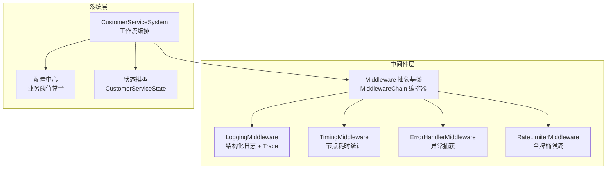
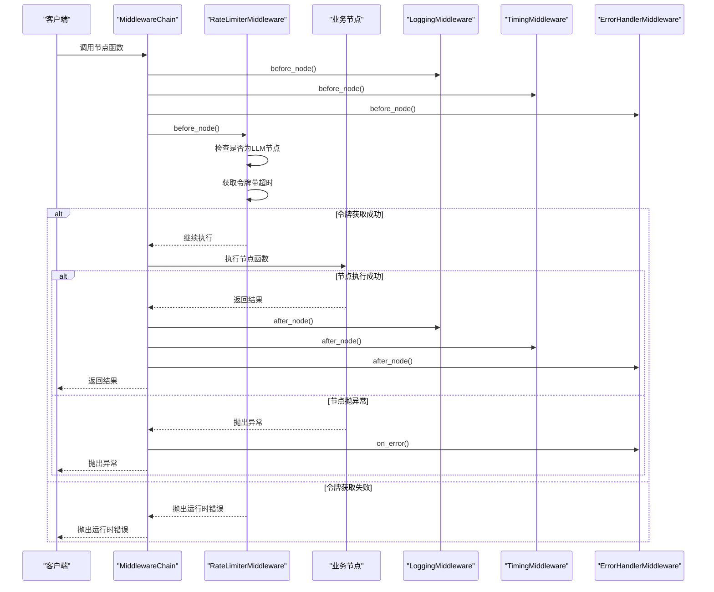
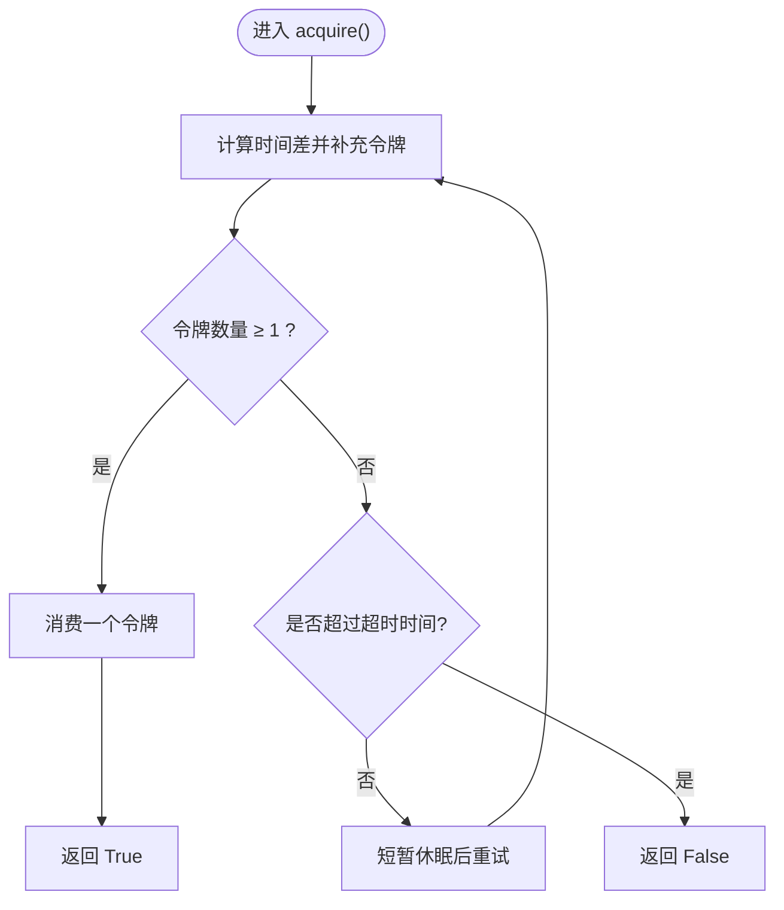
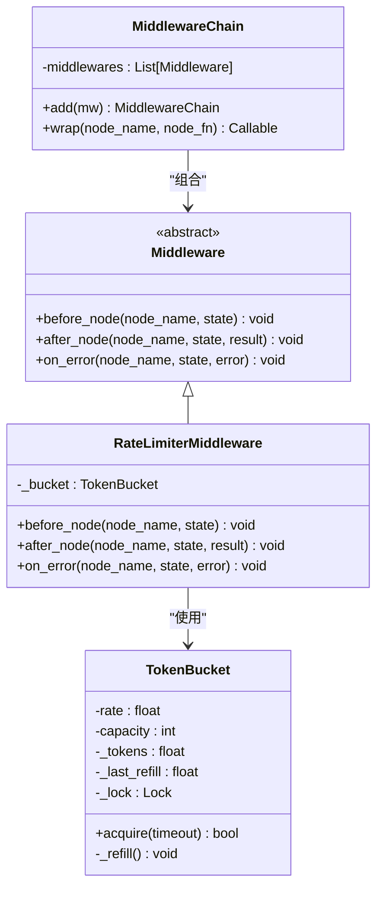
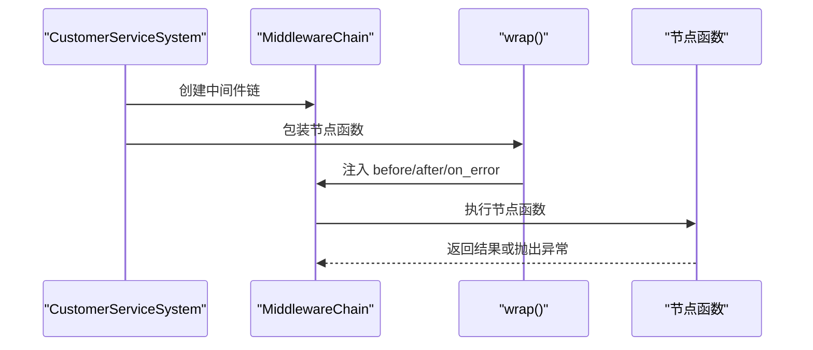
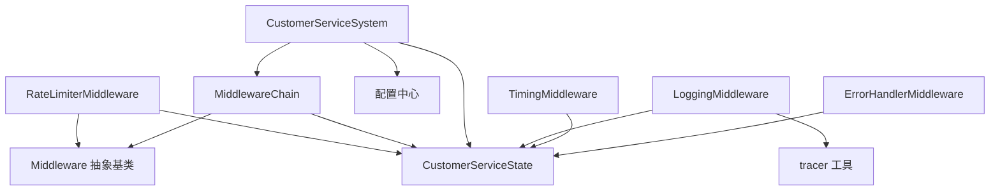

# 速率限制中间件

<cite>
**本文档引用的文件**
- [rate_limiter_mw.py](file://middleware/rate_limiter_mw.py)
- [base.py](file://middleware/base.py)
- [system.py](file://system.py)
- [config.py](file://config.py)
- [README.md](file://README.md)
- [state.py](file://state.py)
- [logging_mw.py](file://middleware/logging_mw.py)
- [timing_mw.py](file://middleware/timing_mw.py)
- [error_handler_mw.py](file://middleware/error_handler_mw.py)
- [tracer.py](file://utils/tracer.py)
- [app.py](file://app.py)
</cite>

## 目录
1. [简介](#简介)
2. [项目结构](#项目结构)
3. [核心组件](#核心组件)
4. [架构概览](#架构概览)
5. [详细组件分析](#详细组件分析)
6. [依赖关系分析](#依赖关系分析)
7. [性能考量](#性能考量)
8. [故障排查指南](#故障排查指南)
9. [结论](#结论)
10. [附录](#附录)

## 简介
本文件聚焦于多智能体客服系统中的速率限制中间件，系统性阐述其在高并发场景下如何控制 LLM 调用频率与资源消耗，解释令牌桶算法的实现原理与配置要点，并结合实际业务场景给出限流策略、阈值设定、最佳实践与动态调整策略。同时提供监控方法与故障排查建议，帮助读者在保证系统稳定性的同时提升用户体验。

## 项目结构
该系统采用 LangGraph 工作流编排，通过中间件层实现横切关注点的解耦注入。速率限制中间件位于中间件层，与日志、计时、异常处理中间件共同构成完整的中间件链，贯穿每个节点的执行生命周期。

**图表来源**
- [base.py:14-93](file://middleware/base.py#L14-L93)
- [system.py:58-75](file://system.py#L58-L75)
- [config.py:33-40](file://config.py#L33-L40)
- [state.py:28-58](file://state.py#L28-L58)

**章节来源**
- [README.md:114-133](file://README.md#L114-L133)
- [system.py:58-75](file://system.py#L58-L75)

## 核心组件
- 令牌桶 TokenBucket：实现平滑限流与短时突发能力，支持每秒补充令牌与容量上限控制。
- 限流中间件 RateLimiterMiddleware：在节点执行前进行令牌获取，超时则抛出运行时错误，阻断过载请求。
- 中间件链 MiddlewareChain：按注册顺序依次执行 before/after/on_error 钩子，形成统一的横切关注点注入机制。
- 系统集成：CustomerServiceSystem 将限流中间件加入中间件链，确保包含 LLM 调用的节点受到限流保护。

**章节来源**
- [rate_limiter_mw.py:24-94](file://middleware/rate_limiter_mw.py#L24-L94)
- [base.py:14-93](file://middleware/base.py#L14-L93)
- [system.py:58-75](file://system.py#L58-L75)

## 架构概览
中间件链在节点执行前后注入横切逻辑，限流中间件负责在 LLM 节点执行前进行令牌获取，若超时则中断流程并向上抛出错误。系统通过配置中心集中管理业务阈值，状态模型承载跨轮次的用户画像与元信息，便于追踪与监控。

**图表来源**
- [base.py:63-93](file://middleware/base.py#L63-L93)
- [rate_limiter_mw.py:71-77](file://middleware/rate_limiter_mw.py#L71-L77)
- [logging_mw.py:39-105](file://middleware/logging_mw.py#L39-L105)
- [timing_mw.py:20-55](file://middleware/timing_mw.py#L20-L55)
- [error_handler_mw.py:35-65](file://middleware/error_handler_mw.py#L35-L65)

## 详细组件分析

### 令牌桶算法实现
- 算法原理：维护令牌桶容量与补充速率，按时间间隔补充令牌，消费令牌后允许节点执行，未达阈值则阻塞等待。
- 并发安全：使用锁保护令牌桶状态，避免并发竞争导致的状态不一致。
- 时间计量：使用单调时钟计算上次补充与当前时间差，确保时间流逝的准确性。
- 突发能力：容量上限允许短时间内的突发请求，平衡吞吐与稳定性。

**图表来源**
- [rate_limiter_mw.py:39-57](file://middleware/rate_limiter_mw.py#L39-L57)

**章节来源**
- [rate_limiter_mw.py:24-57](file://middleware/rate_limiter_mw.py#L24-L57)

### 限流中间件设计与集成
- 作用范围：仅对包含 LLM 调用的节点生效，避免对非 LLM 节点造成不必要的阻塞。
- 执行时机：在节点执行前进行令牌获取，超时则立即中断，防止资源过度消耗。
- 错误处理：限流本身不处理异常，交由异常处理中间件统一兜底。
- 配置参数：速率（每秒允许的 LLM 调用次数）与容量（允许的突发令牌数），默认值经过系统测试验证。

**图表来源**
- [base.py:14-43](file://middleware/base.py#L14-L43)
- [base.py:46-93](file://middleware/base.py#L46-L93)
- [rate_limiter_mw.py:24-94](file://middleware/rate_limiter_mw.py#L24-L94)

**章节来源**
- [rate_limiter_mw.py:60-94](file://middleware/rate_limiter_mw.py#L60-L94)
- [system.py:58-75](file://system.py#L58-L75)

### 中间件链与系统集成
- 中间件顺序：日志 → 计时 → 异常捕获 → 限流，确保在限流之前完成可观测性与异常兜底。
- 节点包装：通过 MiddlewareChain.wrap 将原始节点函数包裹，注入三阶段钩子。
- 工作流编排：CustomerServiceSystem 在构建图时对每个节点进行包装，统一应用中间件逻辑。

**图表来源**
- [system.py:196-246](file://system.py#L196-L246)
- [base.py:63-93](file://middleware/base.py#L63-L93)

**章节来源**
- [system.py:196-246](file://system.py#L196-L246)
- [base.py:63-93](file://middleware/base.py#L63-L93)

### 业务场景与限流策略
- 意图分类与画像提取：作为上游节点，承担自然语言理解与用户画像累积，属于 LLM 节点，需受限流保护。
- 业务代理（技术支持/订单服务/产品咨询）：执行具体业务逻辑，通常包含工具调用与 LLM 交互，需受限流保护。
- 质量检查：对回复进行评估，决定是否升级或继续流转，属于 LLM 节点，需受限流保护。
- 升级与手办：作为决策节点，不直接调用 LLM，不受限流影响。

**章节来源**
- [rate_limiter_mw.py:14-21](file://middleware/rate_limiter_mw.py#L14-L21)
- [system.py:159-183](file://system.py#L159-L183)

### 配置与阈值设定
- 速率（rate）：每秒允许的 LLM 调用次数，默认值经过系统测试验证，适用于一般并发场景。
- 容量（capacity）：令牌桶容量，允许短时间突发，避免瞬时高峰被过度抑制。
- 业务阈值：系统通过配置中心集中管理业务阈值，如意图识别置信度下限与回复质量评分下限，用于质量控制与升级决策。

**章节来源**
- [rate_limiter_mw.py:68-69](file://middleware/rate_limiter_mw.py#L68-L69)
- [config.py:33-40](file://config.py#L33-L40)

### 监控与可观测性
- Trace 记录：日志中间件在节点执行前后写入 trace，记录节点名、开始/结束时间、耗时、状态与摘要。
- 节点耗时：计时中间件统计每个节点的执行耗时，写入 metadata 的 node_timings。
- UI 展示：Web UI 展示 trace 与节点耗时，便于用户直观了解系统行为。
- 异常追踪：异常处理中间件在可恢复节点发生异常时设置 fallback 回复与升级标志，确保系统稳定。

**章节来源**
- [logging_mw.py:32-105](file://middleware/logging_mw.py#L32-L105)
- [timing_mw.py:13-55](file://middleware/timing_mw.py#L13-L55)
- [tracer.py:11-77](file://utils/tracer.py#L11-L77)
- [app.py:102-123](file://app.py#L102-L123)

## 依赖关系分析
- 中间件层依赖：限流中间件依赖中间件基类与状态模型；中间件链依赖中间件基类与状态模型。
- 系统层依赖：CustomerServiceSystem 依赖中间件层、配置中心与状态模型。
- 可观测性依赖：日志中间件依赖 tracer 工具；计时中间件与异常处理中间件依赖状态模型。

**图表来源**
- [rate_limiter_mw.py:10-11](file://middleware/rate_limiter_mw.py#L10-L11)
- [base.py:8-11](file://middleware/base.py#L8-L11)
- [system.py:24-31](file://system.py#L24-L31)
- [logging_mw.py:12-14](file://middleware/logging_mw.py#L12-L14)
- [tracer.py:7-8](file://utils/tracer.py#L7-L8)

**章节来源**
- [rate_limiter_mw.py:10-11](file://middleware/rate_limiter_mw.py#L10-L11)
- [base.py:8-11](file://middleware/base.py#L8-L11)
- [system.py:24-31](file://system.py#L24-L31)
- [logging_mw.py:12-14](file://middleware/logging_mw.py#L12-L14)
- [tracer.py:7-8](file://utils/tracer.py#L7-L8)

## 性能考量
- 令牌桶优势：平滑限流与突发能力兼顾，避免突发流量导致的系统抖动。
- 并发安全：锁保护令牌桶状态，确保多线程环境下的正确性。
- 超时控制：获取令牌设置超时时间，防止长时间阻塞影响用户体验。
- 中间件顺序：将限流置于异常处理之后，确保异常情况下仍能及时释放资源。
- 监控开销：日志与计时中间件对性能有一定影响，建议在生产环境中按需开启或采样。

[本节为通用性能讨论，不直接分析具体文件]

## 故障排查指南
- 限流超时：当节点等待令牌超过超时时间时抛出运行时错误，检查速率与容量配置是否合理，观察系统并发情况。
- 异常兜底：异常处理中间件在可恢复节点发生异常时设置 fallback 回复与升级标志，确保系统稳定。
- Trace 分析：通过 trace 记录定位耗时较长的节点，结合节点耗时统计进行优化。
- UI 观察：Web UI 展示 trace 与节点耗时，便于快速定位问题。

**章节来源**
- [rate_limiter_mw.py:75-77](file://middleware/rate_limiter_mw.py#L75-L77)
- [error_handler_mw.py:59-65](file://middleware/error_handler_mw.py#L59-L65)
- [logging_mw.py:88-105](file://middleware/logging_mw.py#L88-L105)
- [app.py:102-123](file://app.py#L102-L123)

## 结论
速率限制中间件通过令牌桶算法在多智能体客服系统中实现了对 LLM 调用的精细化控制，既保障了系统在高并发场景下的稳定性，又维持了良好的用户体验。结合日志、计时与异常处理中间件，系统形成了完善的可观测性与容错机制。通过合理的阈值设定与动态调整策略，可在不同业务场景下实现最优的性能与稳定性平衡。

[本节为总结性内容，不直接分析具体文件]

## 附录
- 算法选择：令牌桶适用于需要平滑限流与突发能力的场景；漏桶算法更适合固定速率输出的场景。本系统采用令牌桶以更好地适配 LLM 调用的不确定性。
- 配置建议：根据 API 限额与系统资源设定初始速率与容量，结合监控数据进行迭代优化。
- 动态调整：在高峰期提高容量以应对突发，低峰期降低速率以节省成本；根据 trace 与节点耗时统计进行策略调整。

[本节为概念性内容，不直接分析具体文件]