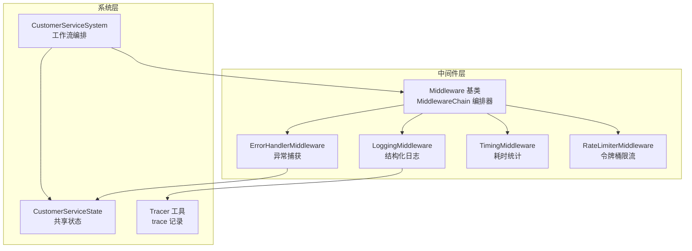
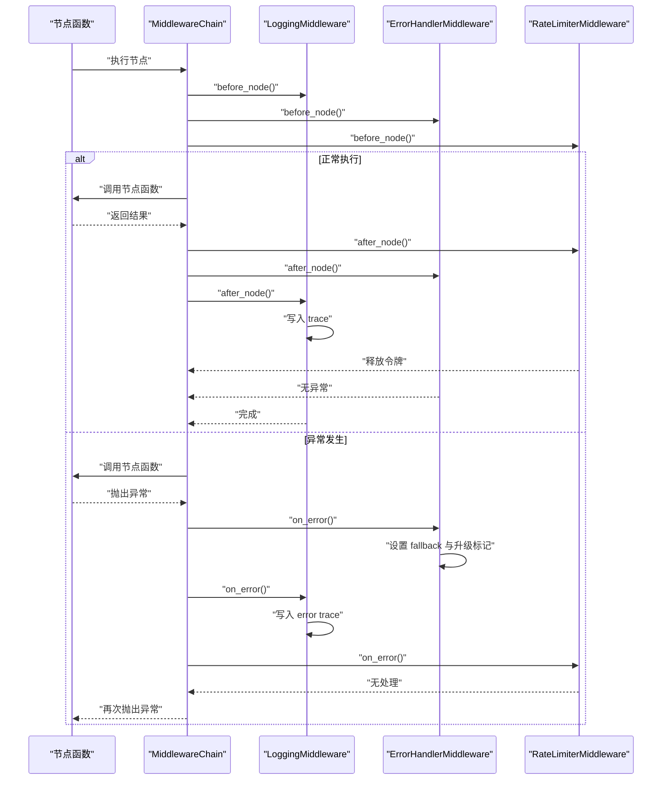
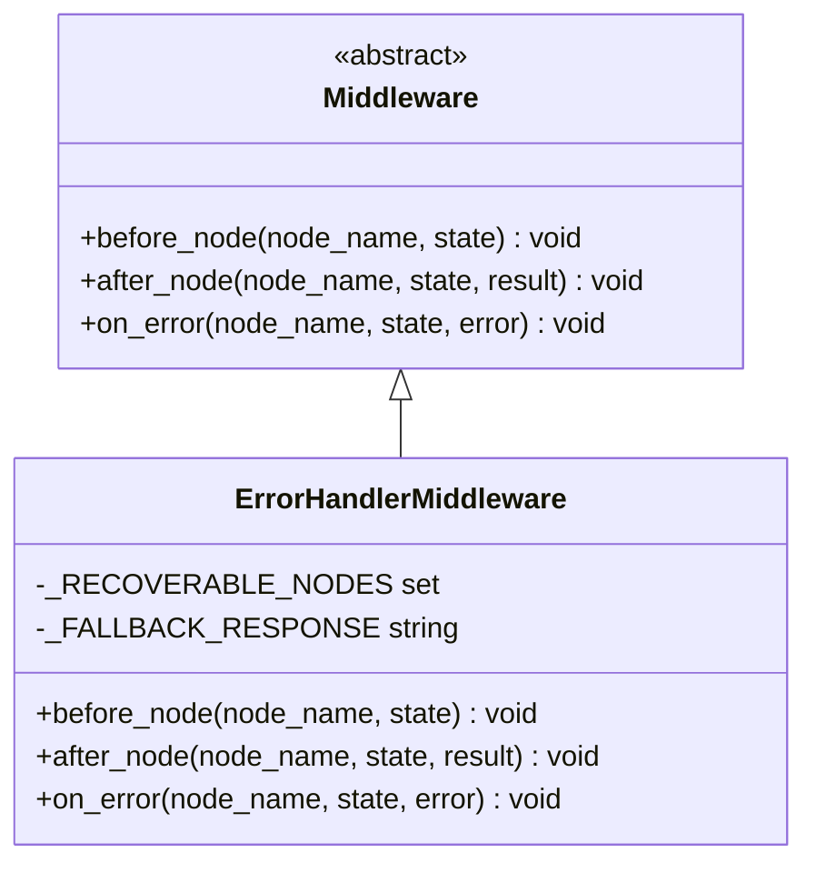
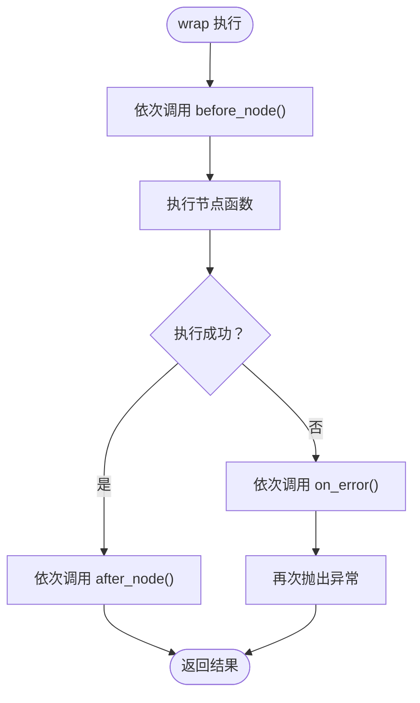
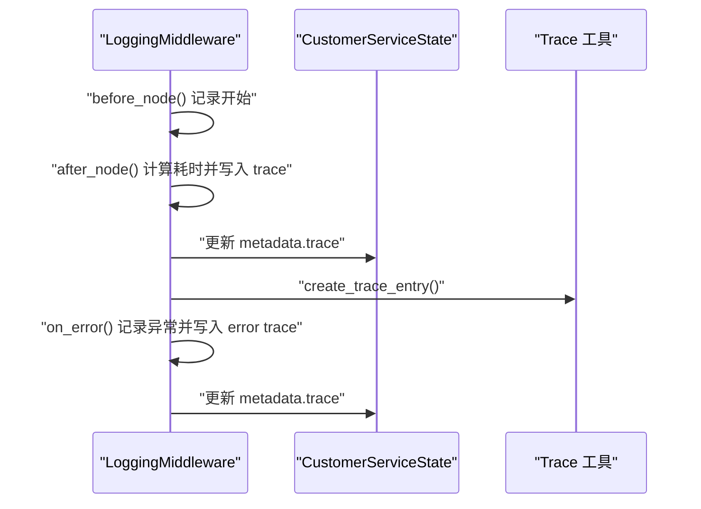
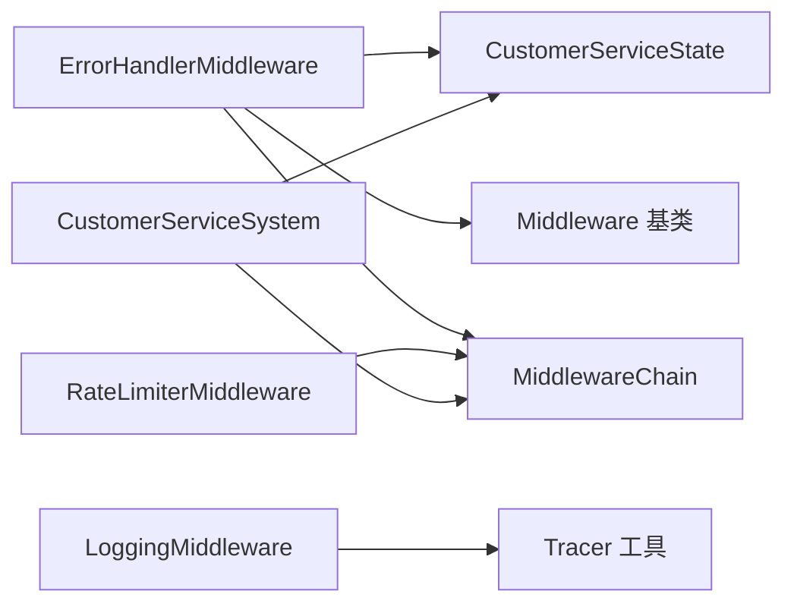

# 错误处理中间件

<cite>
**本文档引用的文件**
- [error_handler_mw.py](file://middleware/error_handler_mw.py)
- [base.py](file://middleware/base.py)
- [logging_mw.py](file://middleware/logging_mw.py)
- [timing_mw.py](file://middleware/timing_mw.py)
- [rate_limiter_mw.py](file://middleware/rate_limiter_mw.py)
- [system.py](file://system.py)
- [state.py](file://state.py)
- [tracer.py](file://utils/tracer.py)
- [config.py](file://config.py)
</cite>

## 目录
1. [简介](#简介)
2. [项目结构](#项目结构)
3. [核心组件](#核心组件)
4. [架构总览](#架构总览)
5. [详细组件分析](#详细组件分析)
6. [依赖关系分析](#依赖关系分析)
7. [性能考虑](#性能考虑)
8. [故障排查指南](#故障排查指南)
9. [结论](#结论)
10. [附录](#附录)

## 简介
本文件聚焦“错误处理中间件”的设计与实现，系统性阐述其在多智能体客服系统中的作用：统一捕获节点执行过程中的异常、进行状态降级与恢复、记录日志与追踪、以及为系统监控与运维提供支撑。文档同时给出异常分类机制、错误恢复策略、降级处理方案、最佳实践与常见异常场景的处理策略。

## 项目结构
该系统采用 LangGraph 工作流编排，节点函数通过中间件链进行横切注入，形成“日志 → 计时 → 异常捕获 → 限流”的执行序列。错误处理中间件位于计时与限流之间，确保异常被统一拦截并进行可控降级。

**图表来源**
- [base.py:46-94](file://middleware/base.py#L46-L94)
- [system.py:58-76](file://system.py#L58-L76)
- [state.py:28-58](file://state.py#L28-L58)
- [tracer.py:11-29](file://utils/tracer.py#L11-L29)

**章节来源**
- [system.py:58-76](file://system.py#L58-L76)
- [base.py:46-94](file://middleware/base.py#L46-L94)

## 核心组件
- 中间件抽象基类与编排器：定义 before/after/on_error 三阶段钩子，并通过包装器将中间件注入节点函数执行流程。
- 错误处理中间件：对可恢复节点在异常时设置 fallback 回复与升级标记，保证工作流继续推进。
- 日志中间件：统一记录节点执行的开始/结束、异常、耗时与 trace 信息。
- 计时中间件：统计节点耗时并写入 metadata。
- 限流中间件：对包含 LLM 调用的节点进行令牌桶限流，避免 API 速率超限。
- 状态模型：定义共享状态字段，包括升级标志、原因、回复内容等，作为错误恢复与降级的关键载体。
- 追踪工具：在 metadata 中维护 trace 列表，记录每个节点的执行状态、耗时与错误信息。

**章节来源**
- [base.py:14-43](file://middleware/base.py#L14-L43)
- [base.py:46-94](file://middleware/base.py#L46-L94)
- [error_handler_mw.py:27-65](file://middleware/error_handler_mw.py#L27-L65)
- [logging_mw.py:32-106](file://middleware/logging_mw.py#L32-L106)
- [timing_mw.py:13-55](file://middleware/timing_mw.py#L13-L55)
- [rate_limiter_mw.py:60-94](file://middleware/rate_limiter_mw.py#L60-L94)
- [state.py:28-58](file://state.py#L28-L58)
- [tracer.py:11-29](file://utils/tracer.py#L11-L29)

## 架构总览
错误处理中间件在中间件链中的位置决定了其职责边界：它不负责打印或记录，也不负责限流或计时，而是专注于异常捕获与状态降级。其与日志中间件协同，后者负责结构化日志与 trace 记录；与限流中间件协作，后者在 before 阶段阻塞过快的 LLM 请求，避免异常放大。

**图表来源**
- [base.py:63-94](file://middleware/base.py#L63-L94)
- [logging_mw.py:78-106](file://middleware/logging_mw.py#L78-L106)
- [error_handler_mw.py:46-65](file://middleware/error_handler_mw.py#L46-L65)
- [rate_limiter_mw.py:87-94](file://middleware/rate_limiter_mw.py#L87-L94)

## 详细组件分析

### 错误处理中间件（ErrorHandlerMiddleware）
- 设计目标：在节点异常时进行可控降级，避免单个节点异常导致工作流中断。
- 可恢复节点集合：针对技术咨询、订单服务、产品咨询、质量检查、画像提取等关键节点，设置可恢复策略。
- 降级策略：
  - 设置统一的 fallback 回复文本；
  - 标记 needs_escalation 为真；
  - 记录 escalation_reason 便于后续升级处理。
- 与工作流的关系：异常仍会向外抛出，以便外层链路感知；但节点函数可在自身 try/except 中读取 state 值进行兜底，实现“软降级”。

**图表来源**
- [base.py:14-43](file://middleware/base.py#L14-L43)
- [error_handler_mw.py:27-65](file://middleware/error_handler_mw.py#L27-L65)

**章节来源**
- [error_handler_mw.py:15-24](file://middleware/error_handler_mw.py#L15-L24)
- [error_handler_mw.py:46-65](file://middleware/error_handler_mw.py#L46-L65)

### 中间件链（MiddlewareChain）与节点包装
- 中间件链按注册顺序依次执行钩子，wrap 方法在节点执行前后注入中间件逻辑。
- 异常传播：节点抛出异常时，依次调用各中间件的 on_error 钩子，然后再次抛出异常，保证外层可感知。

**图表来源**
- [base.py:63-94](file://middleware/base.py#L63-L94)

**章节来源**
- [base.py:63-94](file://middleware/base.py#L63-L94)

### 日志中间件（LoggingMiddleware）与追踪
- 记录节点开始、结束与异常时的日志摘要，统一格式化输出。
- 在 metadata 中维护 trace 列表，记录节点名、起止时间、耗时、状态与错误信息，便于 UI 展示与审计。

**图表来源**
- [logging_mw.py:39-106](file://middleware/logging_mw.py#L39-L106)
- [tracer.py:11-29](file://utils/tracer.py#L11-L29)

**章节来源**
- [logging_mw.py:32-106](file://middleware/logging_mw.py#L32-L106)
- [tracer.py:32-78](file://utils/tracer.py#L32-L78)

### 计时中间件（TimingMiddleware）
- 统计节点执行耗时，写入 metadata.node_timings，辅助性能监控与优化。

**章节来源**
- [timing_mw.py:13-55](file://middleware/timing_mw.py#L13-L55)

### 限流中间件（RateLimiterMiddleware）
- 对包含 LLM 调用的节点实施令牌桶限流，防止 API 速率超限引发异常与性能抖动。
- 超时策略：等待令牌超过阈值则抛出运行时错误，提示降低调用频率。

**章节来源**
- [rate_limiter_mw.py:60-94](file://middleware/rate_limiter_mw.py#L60-L94)

### 状态模型（CustomerServiceState）
- 定义工作流共享状态字段，包括升级标志、原因、回复内容、手办目标与计数等，为错误恢复与降级提供数据基础。

**章节来源**
- [state.py:28-58](file://state.py#L28-L58)

## 依赖关系分析
- 错误处理中间件依赖：
  - 中间件基类与编排器：继承 Middleware 并被 MiddlewareChain.wrap 包裹。
  - 状态模型：读写 needs_escalation、escalation_reason、agent_response 等字段。
  - 日志中间件：两者均参与 trace 记录，协同提供可观测性。
  - 限流中间件：在异常场景下，限流超时可能成为异常来源之一。
- 系统集成点：
  - CustomerServiceSystem 在构建图时通过 MiddlewareChain.wrap 将中间件注入各节点。
  - UI 层通过 metadata 展示 trace 与耗时，便于定位异常节点。

**图表来源**
- [system.py:58-76](file://system.py#L58-L76)
- [error_handler_mw.py:10-13](file://middleware/error_handler_mw.py#L10-L13)
- [logging_mw.py:12-14](file://middleware/logging_mw.py#L12-L14)
- [tracer.py:11-29](file://utils/tracer.py#L11-L29)

**章节来源**
- [system.py:58-76](file://system.py#L58-L76)

## 性能考虑
- 异常开销控制：仅对可恢复节点进行降级，避免对所有节点都设置 fallback，减少不必要的状态写入与分支逻辑。
- 限流前置：通过 RateLimiterMiddleware 在异常前阻断高频 LLM 请求，降低 API 速率超限概率。
- 计时与日志：TimingMiddleware 与 LoggingMiddleware 的 trace 记录为性能分析提供依据，但需注意 metadata 的增长与序列化成本。
- 线程安全：限流中间件内部使用锁保护令牌桶状态，避免并发竞争。

[本节为通用性能讨论，不直接分析具体文件]

## 故障排查指南
- 异常分类与恢复
  - 可恢复节点异常：错误处理中间件设置 fallback 回复与升级标记，工作流继续推进至质量检查或最终升级节点。
  - 不可恢复异常：异常向外抛出，外层链路可感知并进行进一步处理。
- 日志与追踪
  - 通过 UI 展示 trace 与耗时，定位异常节点与耗时热点。
  - 结合日志中间件的 ERROR 条目与错误 trace，快速定位异常原因。
- 常见异常场景
  - LLM 调用超时或限流：检查限流中间件配置与外部 API 状态，必要时调整速率参数。
  - 节点内部逻辑异常：查看错误处理中间件日志与 trace，确认是否已设置 fallback 与升级标记。
  - 状态污染：确认节点未意外修改不应变更的状态字段，保持状态模型一致性。
- 通知机制
  - 系统未内置专门的通知通道，可通过日志中间件与 trace 输出到外部监控系统（如日志平台或告警系统）实现告警。

**章节来源**
- [error_handler_mw.py:46-65](file://middleware/error_handler_mw.py#L46-L65)
- [logging_mw.py:78-106](file://middleware/logging_mw.py#L78-L106)
- [rate_limiter_mw.py:87-94](file://middleware/rate_limiter_mw.py#L87-L94)
- [app.py:110-123](file://app.py#L110-L123)

## 结论
错误处理中间件通过统一的异常捕获与状态降级，显著提升了系统的容错能力与稳定性。配合日志与追踪中间件，系统实现了可观测性与可诊断性；结合限流中间件，有效避免了外部依赖抖动对系统的影响。在实际部署中，建议根据业务场景动态调整可恢复节点集合与降级策略，并持续优化 trace 与日志输出，以平衡可观测性与性能。

[本节为总结性内容，不直接分析具体文件]

## 附录
- 异常处理最佳实践
  - 明确可恢复节点范围，避免过度降级影响用户体验。
  - 在节点内部进行细粒度异常捕获，结合错误处理中间件实现“软降级”。
  - 为关键路径增加限流与熔断策略，防止级联故障。
  - 将 trace 与日志输出对接到统一监控平台，建立告警与趋势分析。
- 常见异常场景与策略
  - LLM 调用失败：降级为 fallback 回复并标记升级，引导人工客服。
  - 工具调用异常：记录错误原因，必要时回退到备用工具或提示用户重试。
  - 状态不一致：在节点入口校验状态字段，异常时回滚或清理中间状态。

[本节为通用指导，不直接分析具体文件]