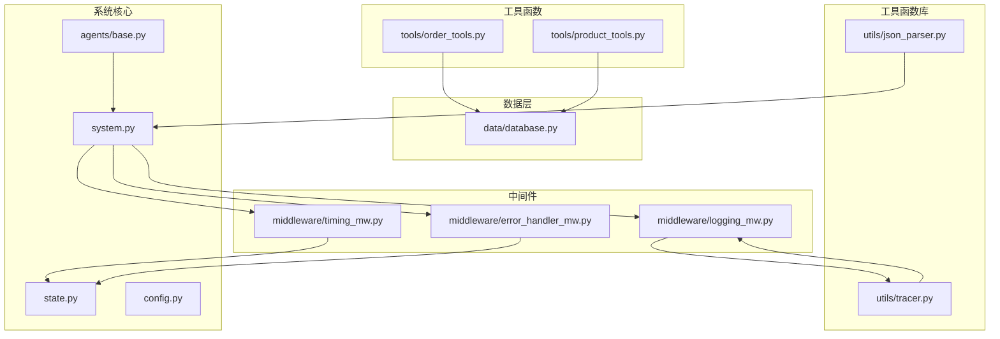
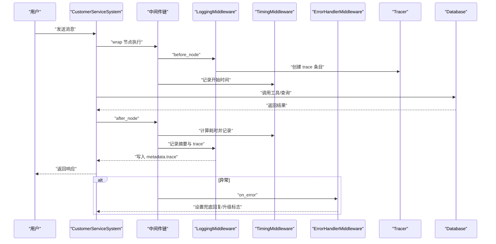
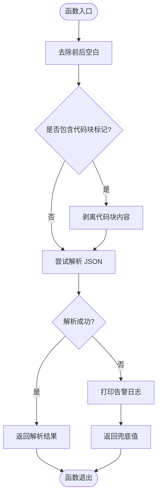
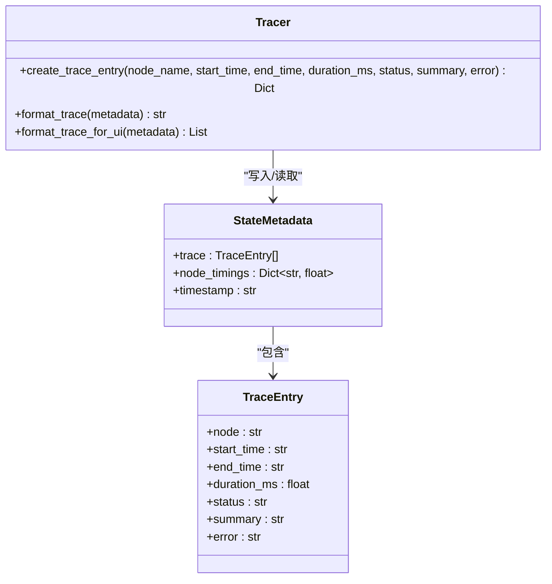
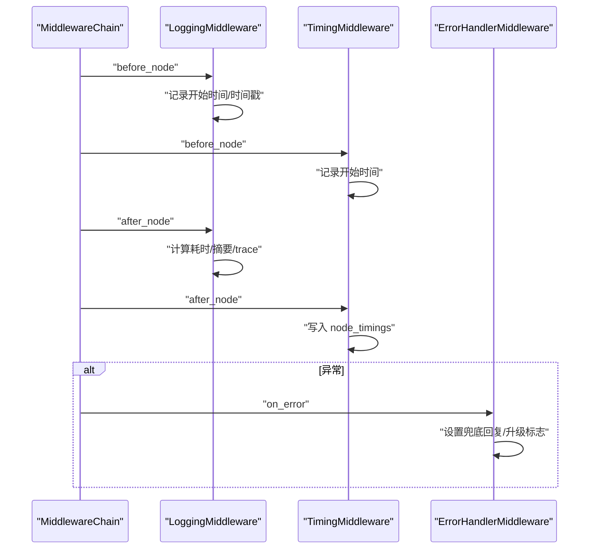
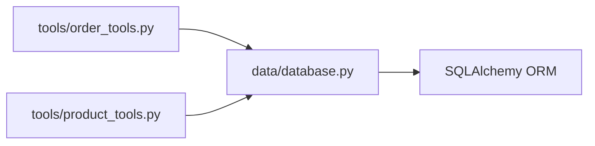
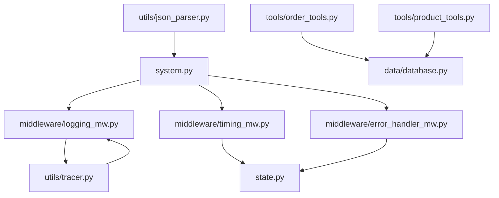

# 工具函数库

<cite>
**本文引用的文件**
- [utils/json_parser.py](file://utils/json_parser.py)
- [utils/tracer.py](file://utils/tracer.py)
- [tools/order_tools.py](file://tools/order_tools.py)
- [tools/product_tools.py](file://tools/product_tools.py)
- [data/database.py](file://data/database.py)
- [middleware/logging_mw.py](file://middleware/logging_mw.py)
- [middleware/timing_mw.py](file://middleware/timing_mw.py)
- [middleware/error_handler_mw.py](file://middleware/error_handler_mw.py)
- [agents/base.py](file://agents/base.py)
- [state.py](file://state.py)
- [system.py](file://system.py)
- [config.py](file://config.py)
- [main.py](file://main.py)
- [README.md](file://README.md)
</cite>

## 目录
1. [简介](#简介)
2. [项目结构](#项目结构)
3. [核心组件](#核心组件)
4. [架构总览](#架构总览)
5. [详细组件分析](#详细组件分析)
6. [依赖关系分析](#依赖关系分析)
7. [性能考量](#性能考量)
8. [故障排查指南](#故障排查指南)
9. [结论](#结论)
10. [附录](#附录)

## 简介
本文件系统性梳理工具函数库的设计与实现，重点覆盖以下方面：
- JSON解析工具的安全容错机制与错误处理策略
- 调用链追踪工具的实现原理与监控功能
- 工具函数的模块化设计与依赖关系
- 使用示例与最佳实践
- 扩展开发指南与测试方法
- 在系统中的应用场景与性能考虑
- 维护与版本管理建议

## 项目结构
工具函数库位于项目根目录下的 utils 子目录，主要包含两个核心模块：
- JSON解析工具：提供对 LLM 返回 JSON 的容错解析能力
- 调用链追踪工具：记录工作流节点执行轨迹，便于可观测性与调试

同时，系统通过中间件链对节点执行进行统一的日志、计时与异常处理，形成完整的可观测性闭环。



图表来源
- [utils/json_parser.py:1-51](file://utils/json_parser.py#L1-L51)
- [utils/tracer.py:1-78](file://utils/tracer.py#L1-L78)
- [tools/order_tools.py:1-50](file://tools/order_tools.py#L1-L50)
- [tools/product_tools.py:1-78](file://tools/product_tools.py#L1-L78)
- [data/database.py:1-161](file://data/database.py#L1-L161)
- [middleware/logging_mw.py:1-123](file://middleware/logging_mw.py#L1-L123)
- [middleware/timing_mw.py:1-55](file://middleware/timing_mw.py#L1-L55)
- [middleware/error_handler_mw.py:1-65](file://middleware/error_handler_mw.py#L1-L65)
- [system.py:1-305](file://system.py#L1-L305)
- [state.py:1-58](file://state.py#L1-L58)
- [config.py:1-60](file://config.py#L1-L60)
- [agents/base.py:1-123](file://agents/base.py#L1-L123)

章节来源
- [README.md:101-108](file://README.md#L101-L108)

## 核心组件
- JSON解析工具：提供安全解析 LLM 返回 JSON 的能力，兼容 Markdown 代码块包裹、前后空白、非法格式等边界情况
- 调用链追踪工具：在 state["metadata"]["trace"] 中记录节点执行链路，包含节点名、开始/结束时间、耗时、状态、摘要与错误信息
- 中间件链：统一记录日志、统计耗时、捕获异常并设置兜底回复，保障系统稳定性与可观测性

章节来源
- [utils/json_parser.py:10-51](file://utils/json_parser.py#L10-L51)
- [utils/tracer.py:11-78](file://utils/tracer.py#L11-L78)
- [middleware/logging_mw.py:32-123](file://middleware/logging_mw.py#L32-L123)
- [middleware/timing_mw.py:13-55](file://middleware/timing_mw.py#L13-L55)
- [middleware/error_handler_mw.py:27-65](file://middleware/error_handler_mw.py#L27-L65)

## 架构总览
系统采用 LangGraph 工作流编排，通过中间件链对节点执行进行统一观测与保护。工具函数库中的 JSON 解析与追踪工具分别服务于数据处理与可观测性两大方向。



图表来源
- [system.py:196-246](file://system.py#L196-L246)
- [middleware/logging_mw.py:39-106](file://middleware/logging_mw.py#L39-L106)
- [middleware/timing_mw.py:20-55](file://middleware/timing_mw.py#L20-L55)
- [middleware/error_handler_mw.py:46-65](file://middleware/error_handler_mw.py#L46-L65)
- [utils/tracer.py:11-29](file://utils/tracer.py#L11-L29)
- [data/database.py:104-161](file://data/database.py#L104-L161)

## 详细组件分析

### JSON解析工具
- 设计目标：对 LLM 返回的 JSON 文本进行容错解析，避免因格式问题导致主流程崩溃
- 主要能力：
  - 剥离 Markdown 代码块（```json ... ``` 或 ``` ... ```）
  - 去除前后空白字符
  - 捕获 JSON 解码异常并返回兜底值
- 错误处理策略：
  - 解析失败时打印告警日志并返回默认值（默认为空字典）
  - 兜底值可通过参数传入，便于上层业务控制默认行为



图表来源
- [utils/json_parser.py](file://utils/json_parser.py#L10-L51)

章节来源
- [utils/json_parser.py](file://utils/json_parser.py#L10-L51)

### 调用链追踪工具
- 设计目标：在 state["metadata"]["trace"] 中记录完整的节点执行链路，便于调试与性能分析
- 数据结构：每条 trace entry 包含节点名、开始/结束时间、耗时、状态、摘要与错误信息
- 输出格式：
  - 文本格式：适合命令行与日志查看
  - UI格式：适合前端展示，直接返回 trace 列表



图表来源
- [utils/tracer.py](file://utils/tracer.py#L11-L78)
- [state.py](file://state.py#L28-L58)

章节来源
- [utils/tracer.py](file://utils/tracer.py#L11-L78)
- [state.py](file://state.py#L28-L58)

### 中间件链与监控
- 日志中间件：记录节点开始/结束、摘要信息，并写入 trace
- 计时中间件：统计节点耗时并写入 metadata.node_timings
- 异常中间件：对可恢复节点设置兜底回复与升级标志，避免异常传播



图表来源
- [middleware/logging_mw.py](file://middleware/logging_mw.py#L39-L106)
- [middleware/timing_mw.py](file://middleware/timing_mw.py#L20-L55)
- [middleware/error_handler_mw.py](file://middleware/error_handler_mw.py#L46-L65)

章节来源
- [middleware/logging_mw.py](file://middleware/logging_mw.py#L32-L123)
- [middleware/timing_mw.py](file://middleware/timing_mw.py#L13-L55)
- [middleware/error_handler_mw.py](file://middleware/error_handler_mw.py#L27-L65)

### 工具函数模块化设计与依赖关系
- 订单工具与产品工具均通过 LangChain @tool 装饰器暴露为可调用工具，内部依赖 data/database.py 提供的数据访问层
- 工具函数返回字符串或 JSON 字符串，便于与 LLM 与 Agent 交互
- 业务工具与数据库层解耦，便于替换真实数据库或 Mock 数据



图表来源
- [tools/order_tools.py](file://tools/order_tools.py#L12-L28)
- [tools/product_tools.py](file://tools/product_tools.py#L7-L11)
- [data/database.py](file://data/database.py#L104-L161)

章节来源
- [tools/order_tools.py](file://tools/order_tools.py#L1-L50)
- [tools/product_tools.py](file://tools/product_tools.py#L1-L78)
- [data/database.py](file://data/database.py#L1-L161)

### 使用示例与最佳实践
- JSON解析工具
  - 场景：解析 LLM 返回的 JSON 文本，兼容 Markdown 代码块
  - 最佳实践：为解析失败提供明确的兜底值，避免上层逻辑分支复杂化
  - 参考路径：[utils/json_parser.py](file://utils/json_parser.py#L10-L51)
- 调用链追踪
  - 场景：在日志中间件中创建 trace 条目，并在结束时汇总格式化输出
  - 最佳实践：为关键节点添加摘要信息，便于快速定位问题
  - 参考路径：[middleware/logging_mw.py](file://middleware/logging_mw.py#L65-L76), [utils/tracer.py](file://utils/tracer.py#L32-L68)
- 工具函数
  - 场景：订单查询与物流跟踪、产品搜索与推荐、FAQ 搜索
  - 最佳实践：工具函数返回结构化的 JSON 字符串，便于 Agent 解析与使用
  - 参考路径：[tools/order_tools.py](file://tools/order_tools.py#L15-L49), [tools/product_tools.py](file://tools/product_tools.py#L14-L77)

章节来源
- [utils/json_parser.py](file://utils/json_parser.py#L10-L51)
- [utils/tracer.py](file://utils/tracer.py#L32-L68)
- [middleware/logging_mw.py](file://middleware/logging_mw.py#L65-L76)
- [tools/order_tools.py](file://tools/order_tools.py#L15-L49)
- [tools/product_tools.py](file://tools/product_tools.py#L14-L77)

### 扩展开发指南与测试方法
- 扩展开发
  - 新增 JSON 解析场景：在现有容错逻辑基础上增加新的边界情况处理（如注释、特殊字符）
  - 新增追踪维度：在 trace 中增加自定义字段（如用户 ID、会话 ID），并在中间件中写入
  - 新增工具函数：遵循 @tool 装饰器规范，返回结构化 JSON 字符串，并在 data/database.py 中实现对应查询
- 测试方法
  - 单元测试：针对 JSON 解析工具编写边界测试用例（Markdown 包裹、非法 JSON、空字符串等）
  - 集成测试：通过 system.py 的 handle_message 方法模拟完整工作流，验证中间件与追踪功能
  - 性能测试：使用计时中间件统计节点耗时，识别瓶颈并优化

章节来源
- [system.py](file://system.py#L250-L299)
- [middleware/timing_mw.py](file://middleware/timing_mw.py#L20-L43)

## 依赖关系分析
- 工具函数库依赖中间件链提供的统一观测能力
- 中间件链依赖状态结构体中的 metadata 字段存储 trace 与 node_timings
- 工具函数依赖数据层提供的查询接口
- 系统通过 LangGraph 工作流编排节点执行，中间件以 wrap 方式注入



图表来源
- [system.py:196-246](file://system.py#L196-L246)
- [middleware/logging_mw.py:39-106](file://middleware/logging_mw.py#L39-L106)
- [middleware/timing_mw.py:20-55](file://middleware/timing_mw.py#L20-L55)
- [middleware/error_handler_mw.py:46-65](file://middleware/error_handler_mw.py#L46-L65)
- [utils/tracer.py:11-29](file://utils/tracer.py#L11-L29)
- [state.py:28-58](file://state.py#L28-L58)
- [tools/order_tools.py:12-28](file://tools/order_tools.py#L12-L28)
- [tools/product_tools.py:7-11](file://tools/product_tools.py#L7-L11)
- [data/database.py:104-161](file://data/database.py#L104-L161)

## 性能考量
- JSON解析：解析失败时返回兜底值，避免重复解析与异常开销
- 追踪与日志：仅在关键节点写入 trace，减少内存占用；格式化输出可在需要时按需调用
- 中间件计时：使用高精度计时器记录节点耗时，便于性能分析与优化
- 数据库访问：工具函数通过 data/database.py 封装查询，避免重复连接与会话创建

章节来源
- [utils/json_parser.py:46-51](file://utils/json_parser.py#L46-L51)
- [utils/tracer.py:32-68](file://utils/tracer.py#L32-L68)
- [middleware/timing_mw.py:20-43](file://middleware/timing_mw.py#L20-L43)
- [data/database.py:96-99](file://data/database.py#L96-L99)

## 故障排查指南
- JSON解析失败
  - 现象：解析返回兜底值，控制台打印告警日志
  - 排查：检查 LLM 返回格式，确认是否包含 Markdown 代码块或非法字符
  - 参考路径：[utils/json_parser.py:46-51](file://utils/json_parser.py#L46-L51)
- 节点异常
  - 现象：异常中间件记录错误并设置兜底回复与升级标志
  - 排查：查看日志中间件输出的 trace 与摘要信息，定位异常节点
  - 参考路径：[middleware/error_handler_mw.py:46-65](file://middleware/error_handler_mw.py#L46-L65), [middleware/logging_mw.py:78-106](file://middleware/logging_mw.py#L78-L106)
- 性能瓶颈
  - 现象：节点耗时较长
  - 排查：查看中间件计时输出与 trace 总耗时，识别热点节点
  - 参考路径：[middleware/timing_mw.py:20-43](file://middleware/timing_mw.py#L20-L43), [utils/tracer.py:32-68](file://utils/tracer.py#L32-L68)

章节来源
- [utils/json_parser.py:46-51](file://utils/json_parser.py#L46-L51)
- [middleware/error_handler_mw.py:46-65](file://middleware/error_handler_mw.py#L46-L65)
- [middleware/logging_mw.py:78-106](file://middleware/logging_mw.py#L78-L106)
- [middleware/timing_mw.py:20-43](file://middleware/timing_mw.py#L20-L43)
- [utils/tracer.py:32-68](file://utils/tracer.py#L32-L68)

## 结论
工具函数库通过 JSON 解析与调用链追踪两大能力，为系统提供了稳健的数据处理与可观测性支撑。配合中间件链的统一日志、计时与异常处理，系统在复杂多轮对话场景中保持稳定与可维护性。建议在扩展新功能时遵循现有模块化设计，确保可观测性与性能不受影响。

## 附录
- 系统启动与演示入口参考路径：[main.py:130-148](file://main.py#L130-L148)
- 配置中心参考路径：[config.py:1-60](file://config.py#L1-L60)
- 状态结构体参考路径：[state.py:14-58](file://state.py#L14-L58)
- Agent 基类参考路径：[agents/base.py:23-123](file://agents/base.py#L23-L123)