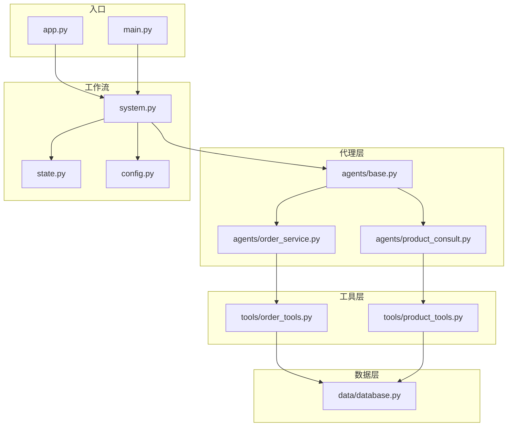
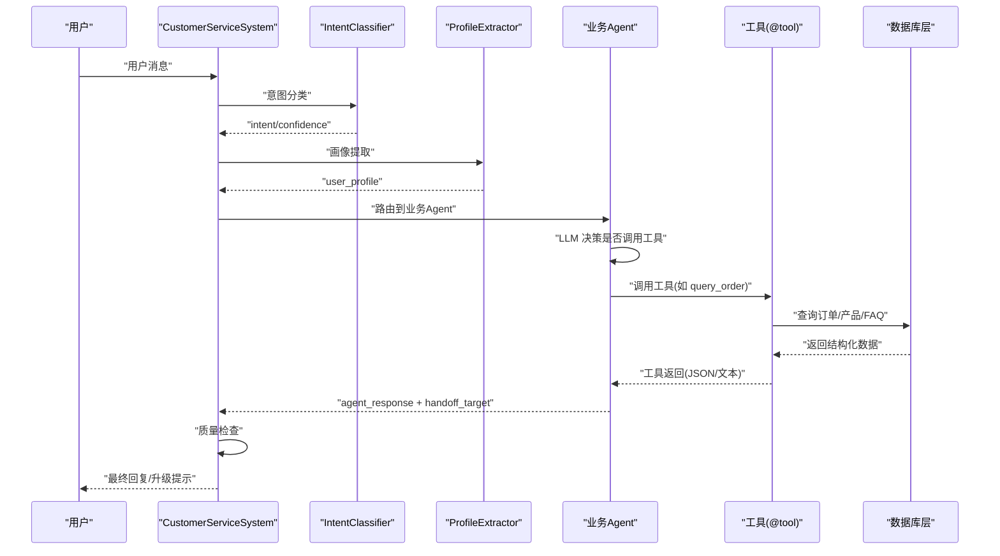
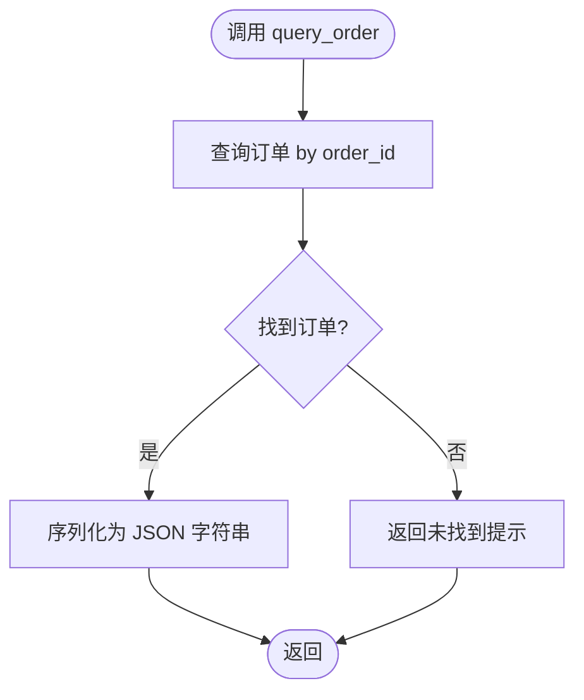
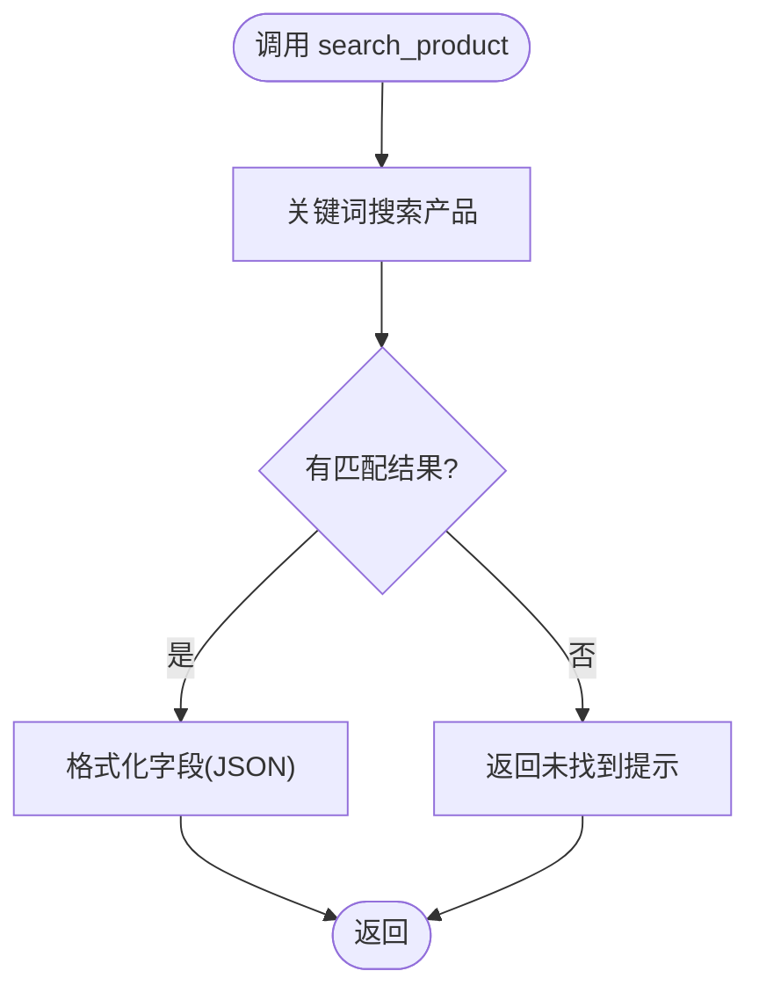
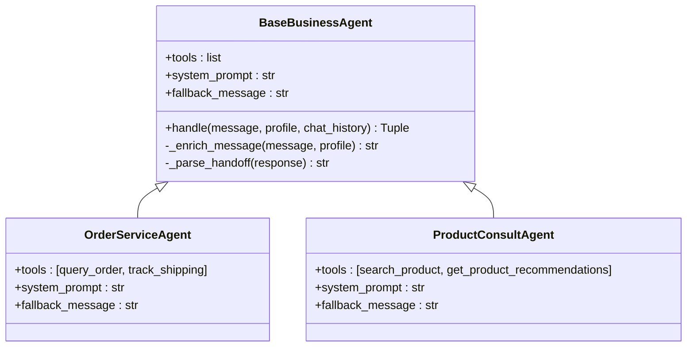
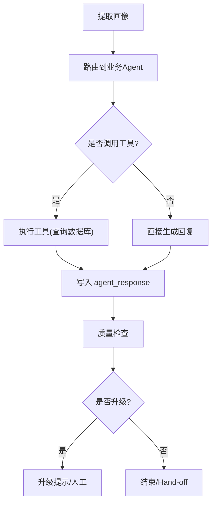
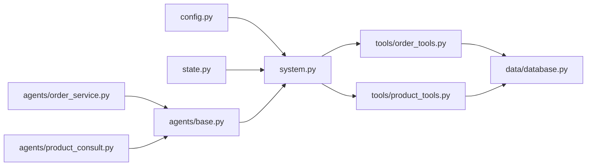
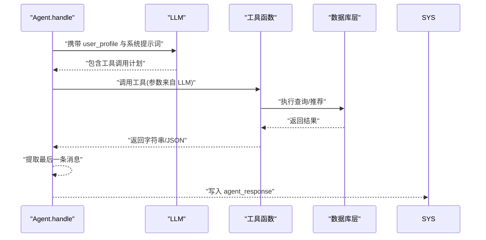

# 工具系统设计

<cite>
**本文引用的文件**
- [tools/order_tools.py](file://tools/order_tools.py)
- [tools/product_tools.py](file://tools/product_tools.py)
- [agents/base.py](file://agents/base.py)
- [agents/order_service.py](file://agents/order_service.py)
- [agents/product_consult.py](file://agents/product_consult.py)
- [data/database.py](file://data/database.py)
- [state.py](file://state.py)
- [system.py](file://system.py)
- [config.py](file://config.py)
- [app.py](file://app.py)
- [README.md](file://README.md)
- [main.py](file://main.py)
</cite>

## 目录
1. [简介](#简介)
2. [项目结构](#项目结构)
3. [核心组件](#核心组件)
4. [架构总览](#架构总览)
5. [详细组件分析](#详细组件分析)
6. [依赖关系分析](#依赖关系分析)
7. [性能考虑](#性能考虑)
8. [故障排查指南](#故障排查指南)
9. [结论](#结论)
10. [附录](#附录)

## 简介
本设计文档围绕 LangChain 工具系统展开，系统性阐述工具函数的设计与实现、@tool 装饰器的使用规范、订单与产品两类工具的业务实现、工具与 Agent 的集成方式与调用机制、扩展开发指南、错误处理与参数验证机制，以及工具在工作流中的执行时机与状态影响。

该系统采用 LangGraph 工作流编排，通过“意图分类 → 用户画像提取 → 业务 Agent → 质量检查”的流水线，结合工具调用实现跨轮次用户画像累积与智能路由。工具函数以 @tool 装饰，被 LangChain Agent 识别为可调用工具，其 docstring 作为工具说明传递给 LLM，指导何时调用及如何传参。

## 项目结构
系统采用按功能域划分的模块化组织方式：
- tools：LangChain 工具函数集合，分为订单与产品两类
- agents：业务 Agent 层，封装 LLM + 工具，统一处理用户消息并支持 Hand-off
- data：业务数据库层，提供订单、产品、FAQ 的查询接口
- state：LangGraph 工作流共享状态定义，承载用户画像与流程中间态
- system：工作流编排核心，定义节点、路由与中间件链
- config：系统配置中心，包括模型初始化、阈值与路径
- app/main：Web/UI 与命令行演示入口

图表来源
- [system.py:196-246](file://system.py#L196-L246)
- [agents/base.py:23-39](file://agents/base.py#L23-L39)
- [agents/order_service.py:11-14](file://agents/order_service.py#L11-L14)
- [agents/product_consult.py:11-14](file://agents/product_consult.py#L11-L14)
- [tools/order_tools.py:15-49](file://tools/order_tools.py#L15-L49)
- [tools/product_tools.py:14-77](file://tools/product_tools.py#L14-L77)
- [data/database.py:104-160](file://data/database.py#L104-L160)

章节来源
- [README.md:81-108](file://README.md#L81-L108)
- [system.py:196-246](file://system.py#L196-L246)

## 核心组件
- 工具函数（@tool 装饰）：以 query_order、track_shipping、search_product、get_product_recommendations、search_faq 为代表，统一返回字符串或 JSON 字符串，便于 LLM 读取与呈现
- 业务 Agent：继承 BaseBusinessAgent，注入工具集与系统提示词，统一处理消息、解析 Hand-off 标记
- 数据层：封装 SQLAlchemy ORM，提供订单、产品、FAQ 的查询与推荐能力
- 工作流：LangGraph StateGraph，定义节点、条件路由与中间件链，支持跨轮次状态持久化
- 配置中心：集中管理模型初始化、阈值与路径

章节来源
- [tools/order_tools.py:15-49](file://tools/order_tools.py#L15-L49)
- [tools/product_tools.py:14-77](file://tools/product_tools.py#L14-L77)
- [agents/base.py:23-113](file://agents/base.py#L23-L113)
- [data/database.py:104-160](file://data/database.py#L104-L160)
- [system.py:34-76](file://system.py#L34-L76)
- [config.py:30-60](file://config.py#L30-L60)

## 架构总览
系统通过 LangGraph 将“意图分类 → 画像提取 → 业务 Agent → 质量检查”串联起来，Agent 在执行过程中根据 LLM 的决策选择调用相应工具，工具返回结构化信息，最终由质量检查决定是否升级或结束流程。

图表来源
- [system.py:79-146](file://system.py#L79-L146)
- [agents/base.py:41-65](file://agents/base.py#L41-L65)
- [tools/order_tools.py:15-49](file://tools/order_tools.py#L15-L49)
- [tools/product_tools.py:14-77](file://tools/product_tools.py#L14-L77)
- [data/database.py:104-160](file://data/database.py#L104-L160)

## 详细组件分析

### 工具函数与 @tool 装饰器
- 设计规范
  - 使用 @tool 装饰器声明工具，函数签名即工具参数定义
  - docstring 作为工具说明，描述用途、参数与返回值
  - 返回字符串或 JSON 字符串，便于 LLM 读取与渲染
- 参数与返回
  - query_order(order_id: str) → 订单详情 JSON 或未找到提示
  - track_shipping(tracking_number: str) → 物流状态或兜底提示
  - search_product(keyword: str) → 匹配产品列表 JSON
  - get_product_recommendations(budget: int, category: str = "全部") → 推荐产品 JSON（最多3个）
  - search_faq(problem_type: str) → FAQ 答案或未找到提示
- 错误处理与兜底
  - 未命中时返回明确提示，避免空响应
  - 物流跟踪存在兜底策略（按单号前缀猜测快递公司）

章节来源
- [tools/order_tools.py:15-49](file://tools/order_tools.py#L15-L49)
- [tools/product_tools.py:14-77](file://tools/product_tools.py#L14-L77)

### 订单相关工具：query_order 与 track_shipping
- 功能实现
  - query_order：根据订单号查询订单详情，返回 JSON 字符串；未找到返回提示
  - track_shipping：根据物流单号查询订单状态；未命中时按单号前缀进行兜底提示
- 数据访问
  - 通过 data/database.py 的 query_order_by_id 与 track_shipping_by_number 实现
- 参数验证
  - 工具函数本身未做显式参数校验，依赖上游 Agent 的提示词约束与下游数据库层的大小写处理

图表来源
- [tools/order_tools.py:15-28](file://tools/order_tools.py#L15-L28)
- [data/database.py:104-108](file://data/database.py#L104-L108)

章节来源
- [tools/order_tools.py:15-49](file://tools/order_tools.py#L15-L49)
- [data/database.py:104-117](file://data/database.py#L104-L117)

### 产品相关工具：search_product、recommendations、FAQ
- 功能实现
  - search_product：按关键词搜索产品，格式化输出必要字段的 JSON
  - get_product_recommendations：按预算上限与评分排序返回最多3个推荐
  - search_faq：按关键词精确/模糊/反向匹配查找 FAQ，返回关键字与答案
- 数据访问
  - 通过 data/database.py 的 search_products_by_keyword、get_products_by_budget、search_faq_by_keyword 实现
- 参数验证
  - 工具函数未做显式参数校验，Budget 类参数依赖调用方语境约束

图表来源
- [tools/product_tools.py:14-36](file://tools/product_tools.py#L14-L36)
- [data/database.py:120-126](file://data/database.py#L120-L126)

章节来源
- [tools/product_tools.py:14-77](file://tools/product_tools.py#L14-L77)
- [data/database.py:120-160](file://data/database.py#L120-L160)

### 工具与 Agent 的集成与调用机制
- 集成方式
  - BaseBusinessAgent 统一封装 create_agent，注入 tools、system_prompt 与模型实例
  - 子类仅需声明 tools、system_prompt、fallback_message
- 调用机制
  - Agent.handle 接收用户消息与 user_profile，拼接系统提示词后调用 agent.invoke
  - LLM 基于工具说明与提示词决定是否调用工具、如何传参
  - 工具返回字符串/JSON，Agent 提取最后一条消息作为回复
- Hand-off 机制
  - Agent 回复中包含 [HANDOFF:agent_name] 标记时，解析 handoff_target 并在工作流中路由

图表来源
- [agents/base.py:23-113](file://agents/base.py#L23-L113)
- [agents/order_service.py:11-28](file://agents/order_service.py#L11-L28)
- [agents/product_consult.py:11-29](file://agents/product_consult.py#L11-L29)

章节来源
- [agents/base.py:23-113](file://agents/base.py#L23-L113)
- [agents/order_service.py:11-28](file://agents/order_service.py#L11-L28)
- [agents/product_consult.py:11-29](file://agents/product_consult.py#L11-L29)

### 工具在工作流中的执行时机与状态影响
- 执行时机
  - 在“业务 Agent 处理”节点，Agent 根据 LLM 决策调用工具
  - 工具返回后进入“质量检查”节点，决定是否升级或结束
- 状态影响
  - agent_response：保存 Agent 的最终回复
  - handoff_target/handoff_count：记录 Hand-off 目标与次数，防止无限循环
  - quality_score：质量检查评分，低于阈值触发升级
  - user_profile：跨轮次累积，由 LangGraph Checkpointer 保持

图表来源
- [system.py:79-146](file://system.py#L79-L146)
- [state.py:28-58](file://state.py#L28-L58)

章节来源
- [system.py:79-146](file://system.py#L79-L146)
- [state.py:28-58](file://state.py#L28-L58)

## 依赖关系分析
- 工具层依赖数据层：工具函数通过 data/database.py 的查询函数访问数据库
- 代理层依赖工具层：Agent 的 tools 列表注入具体工具函数
- 工作流依赖代理层与状态：系统通过 LangGraph 调用各节点函数，传递 CustomerServiceState
- 配置中心贯穿全局：模型初始化、阈值与路径由 config.py 提供

图表来源
- [system.py:17-31](file://system.py#L17-L31)
- [agents/base.py:17-20](file://agents/base.py#L17-L20)
- [agents/order_service.py:7-8](file://agents/order_service.py#L7-L8)
- [agents/product_consult.py:7-8](file://agents/product_consult.py#L7-L8)
- [tools/order_tools.py:10-12](file://tools/order_tools.py#L10-L12)
- [tools/product_tools.py:5-11](file://tools/product_tools.py#L5-L11)
- [data/database.py:18](file://data/database.py#L18)

章节来源
- [system.py:17-31](file://system.py#L17-L31)
- [agents/base.py:17-20](file://agents/base.py#L17-L20)
- [agents/order_service.py:7-8](file://agents/order_service.py#L7-L8)
- [agents/product_consult.py:7-8](file://agents/product_consult.py#L7-L8)
- [tools/order_tools.py:10-12](file://tools/order_tools.py#L10-L12)
- [tools/product_tools.py:5-11](file://tools/product_tools.py#L5-L11)
- [data/database.py:18](file://data/database.py#L18)

## 性能考虑
- 工具调用开销
  - 工具函数内部为数据库查询，建议在数据库层建立索引（如订单号、关键词、价格、评分）
- LLM 调用成本
  - 系统共享模型实例，减少重复初始化开销
- 工作流编译与 Checkpointer
  - 使用 SqliteSaver 优先持久化状态，失败回退 InMemorySaver，避免频繁 IO
- 建议优化
  - 对高频查询增加缓存层
  - 控制工具返回数据规模，避免过长 JSON 影响 LLM 性能
  - 限制 Hand-off 次数，防止循环调用

[本节为通用性能建议，无需特定文件引用]

## 故障排查指南
- 工具返回为空或未命中
  - 检查上游提示词是否正确引导 LLM 调用工具
  - 确认参数格式与业务数据是否匹配（如订单号大小写）
- 未找到工具
  - 确认工具函数已使用 @tool 装饰且在 Agent.tools 中注册
- Hand-off 未生效
  - 检查 Agent 回复中是否包含合法标记 [HANDOFF:agent_name]
  - 确认 handoff_target 在有效集合内
- 质量检查导致升级
  - 调整 QualityChecker 的阈值或提示词，提升回复质量
- 数据库异常
  - 检查 BUSINESS_DB_PATH 与数据库连接，确保表结构与查询逻辑正确

章节来源
- [agents/base.py:101-113](file://agents/base.py#L101-L113)
- [system.py:134-146](file://system.py#L134-L146)
- [data/database.py:104-160](file://data/database.py#L104-L160)

## 结论
本工具系统以 @tool 装饰器为核心，将业务查询能力封装为可被 LLM 识别与调用的工具，配合 Agent 的统一处理与工作流的状态编排，实现了意图驱动、画像累积与质量控制的闭环。通过清晰的模块边界与中间件链，系统具备良好的可扩展性与可维护性。后续可在工具参数校验、缓存与限流等方面进一步增强。

[本节为总结性内容，无需特定文件引用]

## 附录

### 工具函数扩展开发指南
- 新增工具步骤
  - 在 tools/ 下新增工具函数，使用 @tool 装饰，编写清晰的 docstring
  - 在 data/database.py 中实现对应的查询/推荐逻辑
  - 在对应 Agent 的 tools 列表中注册工具
  - 在 Agent 的 system_prompt 中补充工具使用说明
- 参数与返回约定
  - 参数尽量使用简单类型，返回字符串或 JSON 字符串
  - 未命中时返回明确提示，避免空响应
- 质量与安全
  - 在 Agent 提示词中约束参数范围与调用时机
  - 对外部依赖（数据库/第三方 API）增加超时与重试策略

章节来源
- [tools/order_tools.py:15-49](file://tools/order_tools.py#L15-L49)
- [tools/product_tools.py:14-77](file://tools/product_tools.py#L14-L77)
- [agents/order_service.py:14](file://agents/order_service.py#L14)
- [agents/product_consult.py:14](file://agents/product_consult.py#L14)
- [data/database.py:104-160](file://data/database.py#L104-L160)

### 工具函数与 Agent 的调用时序

图表来源
- [agents/base.py:41-65](file://agents/base.py#L41-L65)
- [tools/order_tools.py:15-49](file://tools/order_tools.py#L15-L49)
- [tools/product_tools.py:14-77](file://tools/product_tools.py#L14-L77)
- [data/database.py:104-160](file://data/database.py#L104-L160)