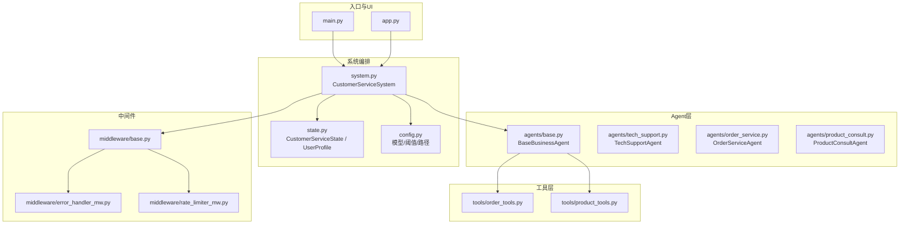
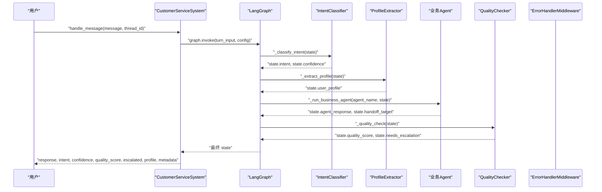
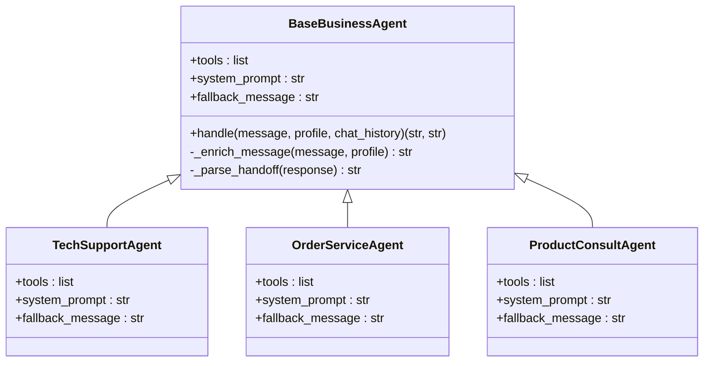
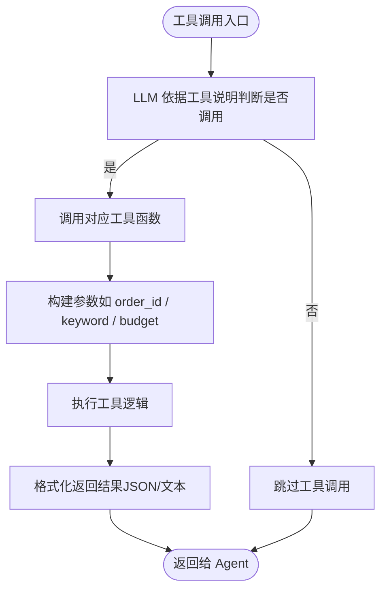
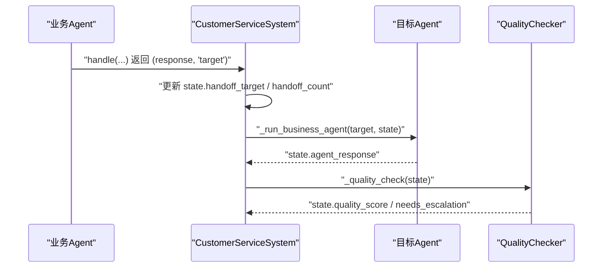
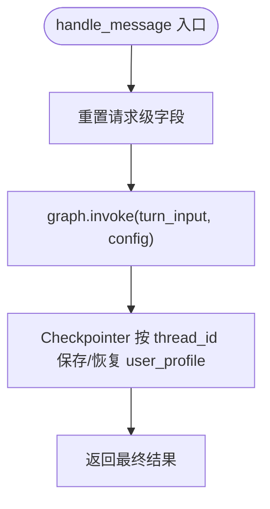
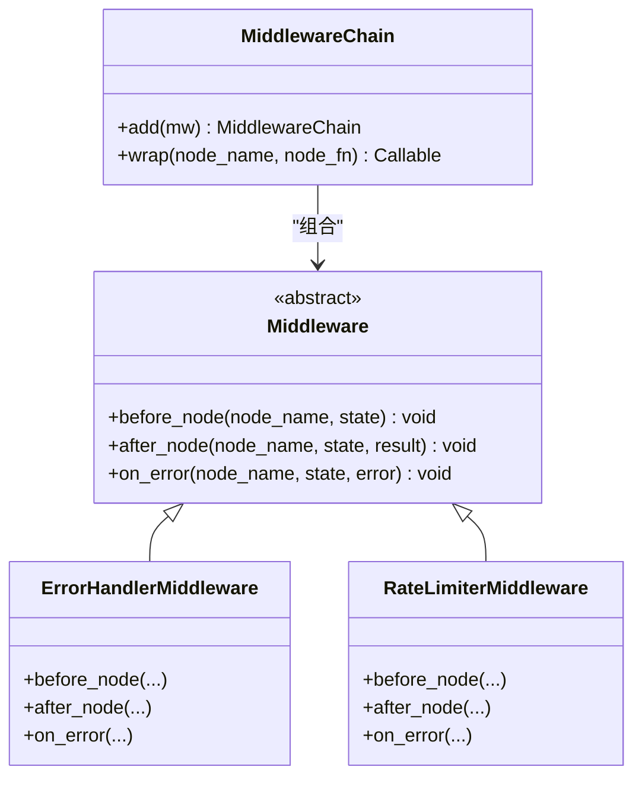
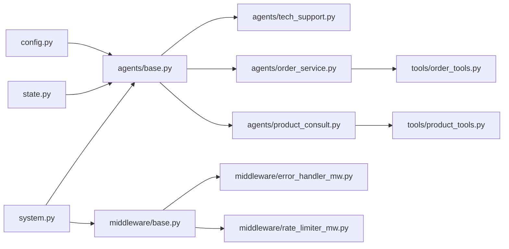

# Agent扩展开发

<cite>
**本文引用的文件**
- [agents/base.py](file://agents/base.py)
- [agents/order_service.py](file://agents/order_service.py)
- [agents/product_consult.py](file://agents/product_consult.py)
- [agents/tech_support.py](file://agents/tech_support.py)
- [system.py](file://system.py)
- [state.py](file://state.py)
- [config.py](file://config.py)
- [tools/order_tools.py](file://tools/order_tools.py)
- [tools/product_tools.py](file://tools/product_tools.py)
- [middleware/base.py](file://middleware/base.py)
- [middleware/error_handler_mw.py](file://middleware/error_handler_mw.py)
- [middleware/rate_limiter_mw.py](file://middleware/rate_limiter_mw.py)
- [main.py](file://main.py)
- [app.py](file://app.py)
</cite>

## 目录
1. [简介](#简介)
2. [项目结构](#项目结构)
3. [核心组件](#核心组件)
4. [架构总览](#架构总览)
5. [详细组件分析](#详细组件分析)
6. [依赖关系分析](#依赖关系分析)
7. [性能考虑](#性能考虑)
8. [故障排查指南](#故障排查指南)
9. [结论](#结论)
10. [附录](#附录)

## 简介
本指南面向希望扩展新业务 Agent 的开发者，系统讲解 BaseBusinessAgent 基类的设计模式与抽象方法定义，提供从继承基类到实现 handle 方法、定义工具调用与 Hand-off 机制的完整流程；同时说明系统的工作流状态、生命周期管理与跨轮次状态传递；最后给出 Agent 间通信协议、数据交换格式、测试方法、调试技巧以及性能优化与最佳实践。

## 项目结构
系统采用“LangGraph 工作流 + 多 Agent + 中间件”的分层设计：
- 系统入口与演示：main.py、app.py
- 核心系统编排：system.py
- 状态模型：state.py
- Agent 基类与具体 Agent：agents/base.py、agents/order_service.py、agents/product_consult.py、agents/tech_support.py
- 工具模块：tools/order_tools.py、tools/product_tools.py
- 中间件：middleware/base.py、middleware/error_handler_mw.py、middleware/rate_limiter_mw.py
- 配置中心：config.py

图表来源
- [system.py:1-305](file://system.py#L1-L305)
- [agents/base.py:1-123](file://agents/base.py#L1-L123)
- [tools/order_tools.py:1-50](file://tools/order_tools.py#L1-L50)
- [tools/product_tools.py:1-78](file://tools/product_tools.py#L1-L78)
- [middleware/base.py:1-94](file://middleware/base.py#L1-L94)
- [middleware/error_handler_mw.py:1-65](file://middleware/error_handler_mw.py#L1-L65)
- [middleware/rate_limiter_mw.py:1-94](file://middleware/rate_limiter_mw.py#L1-L94)
- [state.py:1-58](file://state.py#L1-L58)
- [config.py:1-60](file://config.py#L1-L60)
- [main.py:1-148](file://main.py#L1-L148)
- [app.py:1-177](file://app.py#L1-L177)

章节来源
- [system.py:1-305](file://system.py#L1-L305)
- [state.py:1-58](file://state.py#L1-L58)
- [config.py:1-60](file://config.py#L1-L60)
- [main.py:1-148](file://main.py#L1-L148)
- [app.py:1-177](file://app.py#L1-L177)

## 核心组件
- BaseBusinessAgent：封装 LLM + 工具 + 个性化消息增强 + Hand-off 解析，子类仅需声明 tools、system_prompt、fallback_message。
- 具体 Agent：TechSupportAgent、OrderServiceAgent、ProductConsultAgent，分别绑定不同工具集与系统提示词。
- CustomerServiceSystem：LangGraph 工作流编排，包含意图分类、画像提取、业务 Agent 执行、质量检查、升级与 Hand-off 路由。
- 状态模型：CustomerServiceState 与 UserProfile，承载每轮输入、历史、画像、意图、置信度、Agent 回复、质量评分、Hand-off 目标与计数、元信息等。
- 中间件：日志、计时、异常捕获、限流，统一注入到各节点。
- 工具：订单查询、物流跟踪、产品检索、推荐、FAQ 搜索等。

章节来源
- [agents/base.py:23-123](file://agents/base.py#L23-L123)
- [agents/order_service.py:11-29](file://agents/order_service.py#L11-L29)
- [agents/product_consult.py:11-30](file://agents/product_consult.py#L11-L30)
- [agents/tech_support.py:11-29](file://agents/tech_support.py#L11-L29)
- [system.py:34-305](file://system.py#L34-L305)
- [state.py:28-58](file://state.py#L28-L58)
- [middleware/base.py:14-94](file://middleware/base.py#L14-L94)

## 架构总览
系统通过 LangGraph StateGraph 编排节点，按以下流程流转：
- START → 意图分类 → 画像提取 → 条件路由 → 业务 Agent → 质量检查 → 条件路由 → 响应/升级/HANDOFF → END

图表来源
- [system.py:250-299](file://system.py#L250-L299)
- [system.py:79-147](file://system.py#L79-L147)
- [system.py:93-104](file://system.py#L93-L104)
- [system.py:134-147](file://system.py#L134-L147)

## 详细组件分析

### BaseBusinessAgent 设计与实现
- 设计模式
  - 组合优于继承：子类仅声明工具集与系统提示词，复用基类的统一执行框架。
  - 模板方法：子类实现抽象属性，父类提供 handle 模板流程。
- 关键抽象与约定
  - 必填属性：tools（工具列表）、system_prompt（系统提示词）、fallback_message（兜底消息）。
  - 内部约定：VALID_HANDOFF_TARGETS 限定合法 Hand-off 目标集合。
- 核心流程
  - 消息增强：将 UserProfile 拼接到用户消息前，支持多语言指令。
  - 调用 Agent：使用 create_agent 创建带工具的代理，执行并取最后一条消息内容。
  - Hand-off 解析：从回复中提取 [HANDOFF:target] 标记，校验合法性并返回目标 Agent 名称。
- 生命周期与状态
  - 无显式生命周期管理：每次 handle 调用都会构造一次 Agent（共享 model 实例），适合短生命周期请求。
  - 通过系统层的 thread_id 与 Checkpointer 实现跨轮次状态持久化（user_profile 累积）。

图表来源
- [agents/base.py:23-123](file://agents/base.py#L23-L123)
- [agents/tech_support.py:11-29](file://agents/tech_support.py#L11-L29)
- [agents/order_service.py:11-29](file://agents/order_service.py#L11-L29)
- [agents/product_consult.py:11-30](file://agents/product_consult.py#L11-L30)

章节来源
- [agents/base.py:23-123](file://agents/base.py#L23-L123)

### 具体 Agent 实现要点
- TechSupportAgent
  - 工具：search_faq
  - 系统提示词强调故障排除与多方案提供
- OrderServiceAgent
  - 工具：query_order、track_shipping
  - 系统提示词强调订单查询、物流跟踪与退换货
- ProductConsultAgent
  - 工具：search_product、get_product_recommendations
  - 系统提示词强调产品介绍、推荐与个性化筛选

章节来源
- [agents/tech_support.py:11-29](file://agents/tech_support.py#L11-L29)
- [agents/order_service.py:11-29](file://agents/order_service.py#L11-L29)
- [agents/product_consult.py:11-30](file://agents/product_consult.py#L11-L30)

### 工具定义与调用协议
- 工具规范
  - 使用装饰器声明工具，docstring 作为工具说明传递给 LLM，决定何时调用与参数。
  - 返回字符串形式的结果（通常为 JSON 序列化或结构化文本）。
- 订单工具
  - query_order：按订单号查询订单详情
  - track_shipping：按物流单号查询物流状态，支持前缀猜测兜底
- 产品工具
  - search_product：按关键词搜索产品
  - get_product_recommendations：按预算推荐产品（最多 3 个）
  - search_faq：按问题类型关键词搜索 FAQ

图表来源
- [tools/order_tools.py:15-50](file://tools/order_tools.py#L15-L50)
- [tools/product_tools.py:14-78](file://tools/product_tools.py#L14-L78)

章节来源
- [tools/order_tools.py:1-50](file://tools/order_tools.py#L1-L50)
- [tools/product_tools.py:1-78](file://tools/product_tools.py#L1-L78)

### Hand-off 机制与通信协议
- Hand-off 触发
  - Agent 回复中包含 [HANDOFF:agent_name] 标记，且 agent_name 属于 VALID_HANDOFF_TARGETS。
- Hand-off 执行
  - 系统在质量检查后根据 handoff_target 与 handoff_count 进行路由，最大次数受 MAX_HANDOFFS 限制。
- 数据交换
  - 状态字段：handoff_target、handoff_count、agent_response、user_profile 等跨节点传递。
  - 系统通过 _agent_map 动态路由到目标 Agent，再次进入质量检查。

图表来源
- [system.py:93-104](file://system.py#L93-L104)
- [system.py:171-193](file://system.py#L171-L193)
- [agents/base.py:101-114](file://agents/base.py#L101-L114)

章节来源
- [system.py:37-57](file://system.py#L37-L57)
- [system.py:171-193](file://system.py#L171-L193)
- [agents/base.py:30-31](file://agents/base.py#L30-L31)

### 生命周期管理与状态传递
- 请求级字段重置
  - 每轮调用 handle_message 时重置 intent、confidence、agent_response、needs_escalation、quality_score、handoff_target、handoff_count 等，确保非持久化字段不会污染后续轮次。
- 跨轮次状态
  - user_profile 通过 Checkpointer 按 thread_id 保存与恢复，实现多轮对话中的画像累积。
- 状态模型
  - CustomerServiceState 定义了所有节点共享的数据结构，便于调试与可观测性。

图表来源
- [system.py:250-299](file://system.py#L250-L299)
- [system.py:270-284](file://system.py#L270-L284)
- [state.py:28-58](file://state.py#L28-L58)

章节来源
- [system.py:250-299](file://system.py#L250-L299)
- [state.py:14-58](file://state.py#L14-L58)

### 中间件与横切关注点
- 中间件链
  - 日志 → 计时 → 异常捕获 → 限流，按注册顺序依次执行。
- 异常捕获
  - 对可恢复节点在 on_error 中设置 fallback 回复与升级标志，避免节点异常中断工作流。
- 限流
  - 令牌桶算法对包含 LLM 调用的节点进行限流，防止 API 速率超限。

图表来源
- [middleware/base.py:14-94](file://middleware/base.py#L14-L94)
- [middleware/error_handler_mw.py:27-65](file://middleware/error_handler_mw.py#L27-L65)
- [middleware/rate_limiter_mw.py:60-94](file://middleware/rate_limiter_mw.py#L60-L94)

章节来源
- [middleware/base.py:14-94](file://middleware/base.py#L14-L94)
- [middleware/error_handler_mw.py:1-65](file://middleware/error_handler_mw.py#L1-L65)
- [middleware/rate_limiter_mw.py:1-94](file://middleware/rate_limiter_mw.py#L1-L94)

## 依赖关系分析
- 组件耦合
  - BaseBusinessAgent 依赖 config.model 与 state.UserProfile，耦合度低，便于扩展。
  - 具体 Agent 仅依赖工具模块与基类，保持职责单一。
  - CustomerServiceSystem 依赖所有 Agent、中间件与状态模型，承担编排职责。
- 外部依赖
  - LangChain Agent 与 LangGraph，工具依赖数据库查询函数。
- 循环依赖
  - 未发现循环导入；Agent 与工具通过函数接口解耦。

图表来源
- [agents/base.py:19-20](file://agents/base.py#L19-L20)
- [agents/order_service.py:7-8](file://agents/order_service.py#L7-L8)
- [agents/product_consult.py:7-8](file://agents/product_consult.py#L7-L8)
- [agents/tech_support.py:7-8](file://agents/tech_support.py#L7-L8)
- [system.py:17-31](file://system.py#L17-L31)
- [middleware/base.py:11](file://middleware/base.py#L11](file://middleware/base.py#L11))

章节来源
- [system.py:17-31](file://system.py#L17-L31)
- [agents/base.py:19-20](file://agents/base.py#L19-L20)

## 性能考虑
- 模型实例复用
  - 所有 Agent 共享 config.model，避免重复初始化带来的开销。
- 限流策略
  - 使用令牌桶对 LLM 节点限流，防止突发流量导致 API 限速。
- 状态持久化
  - Checkpointer 按 thread_id 保存 user_profile，减少重复计算与网络调用。
- 工具调用优化
  - 工具返回结构化文本，减少 LLM 后处理成本；必要时在工具层做数据裁剪与格式化。
- UI 与演示
  - Streamlit 与命令行演示均支持多轮对话与画像累积，便于端到端性能验证。

章节来源
- [config.py:30-31](file://config.py#L30-L31)
- [middleware/rate_limiter_mw.py:24-58](file://middleware/rate_limiter_mw.py#L24-L58)
- [system.py:66-75](file://system.py#L66-L75)

## 故障排查指南
- 异常兜底
  - 可恢复节点异常时，ErrorHandlerMiddleware 设置 fallback 回复并标记升级，便于快速恢复。
- 限流告警
  - 令牌桶获取失败会抛出超时错误，提示降低调用频率。
- 调试信息
  - main.py 与 app.py 输出详细处理信息、节点耗时与调用链追踪，便于定位瓶颈。
- 状态查询
  - 通过 get_profile(thread_id) 查询当前累积画像，核对 user_profile 是否按预期增长。

章节来源
- [middleware/error_handler_mw.py:27-65](file://middleware/error_handler_mw.py#L27-L65)
- [middleware/rate_limiter_mw.py:60-94](file://middleware/rate_limiter_mw.py#L60-L94)
- [main.py:56-104](file://main.py#L56-L104)
- [app.py:110-123](file://app.py#L110-L123)
- [system.py:300-305](file://system.py#L300-L305)

## 结论
本系统通过 BaseBusinessAgent 抽象出统一的业务 Agent 模板，配合 LangGraph 工作流实现意图分类、画像累积、质量检查、Hand-off 与升级的闭环。借助中间件体系与状态模型，系统具备良好的可扩展性、可观测性与稳定性。开发者可按本文流程快速扩展新的业务 Agent，并遵循工具协议与通信格式，确保与现有系统无缝集成。

## 附录

### Agent 扩展开发流程（步骤清单）
- 继承基类
  - 在 agents/ 下新建文件，定义子类并继承 BaseBusinessAgent。
- 实现抽象
  - 定义 tools（工具列表）、system_prompt（系统提示词）、fallback_message（兜底消息）。
- 绑定工具
  - 在 tools/ 下新增工具函数或复用现有工具，确保 docstring 作为工具说明清晰明确。
- 注册与路由
  - 在 system.py 的 _agent_map 中注册新 Agent，并在路由逻辑中加入新意图分支（如需要）。
- 验证与测试
  - 使用 main.py 的测试用例与交互模式验证功能；通过 app.py 的 UI 观察多轮对话与画像累积效果。
- 调优与发布
  - 根据性能与稳定性调整阈值、限流参数与提示词；上线前进行端到端回归测试。

章节来源
- [agents/base.py:23-29](file://agents/base.py#L23-L29)
- [system.py:42-56](file://system.py#L42-L56)
- [system.py:159-169](file://system.py#L159-L169)

### Agent 通信协议与数据交换格式
- 输入
  - message: 用户原始消息
  - profile: 当前 thread 的 user_profile（可选）
  - chat_history: 历史对话（预留字段）
- 输出
  - response: Agent 生成的回复文本
  - handoff_target: 目标 Agent 名称（空串表示无 Hand-off）
- 状态字段（系统传递）
  - user_message、chat_history、user_profile、intent、confidence、agent_response、needs_escalation、escalation_reason、quality_score、handoff_target、handoff_count、metadata

章节来源
- [agents/base.py:41-66](file://agents/base.py#L41-L66)
- [state.py:28-58](file://state.py#L28-L58)

### 测试方法与调试技巧
- 单轮测试
  - 使用 main.py 的 TEST_CASES，每个消息独立 thread_id，验证不同意图分类与 Agent 路由。
- 多轮对话
  - 使用 MULTI_TURN_DEMO，观察 user_profile 累积与个性化回复效果。
- 交互式调试
  - 运行 main.py 的交互模式，实时输入与查看当前画像与处理结果。
- UI 调试
  - 使用 Streamlit UI，查看侧边栏画像、最近处理信息、节点耗时与调用链追踪。

章节来源
- [main.py:12-41](file://main.py#L12-L41)
- [main.py:44-104](file://main.py#L44-L104)
- [main.py:107-128](file://main.py#L107-L128)
- [app.py:46-123](file://app.py#L46-L123)