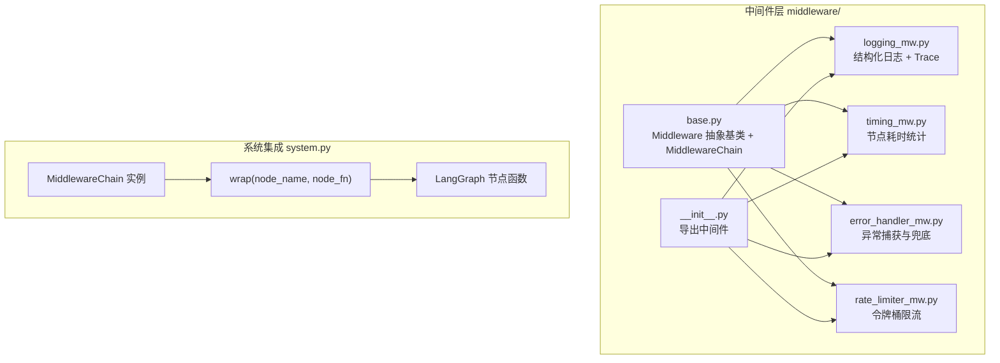
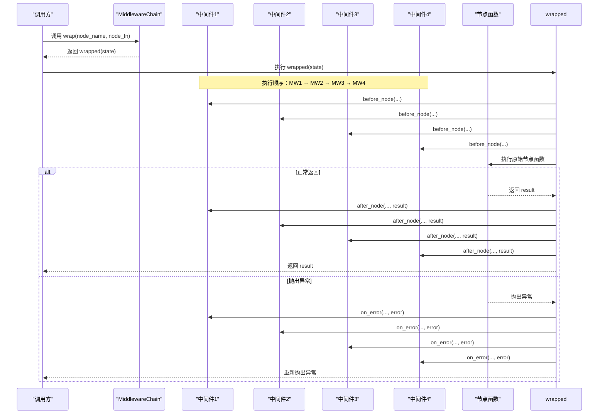
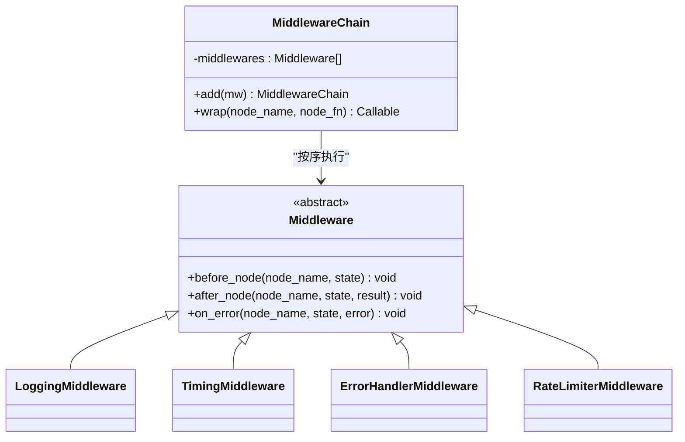
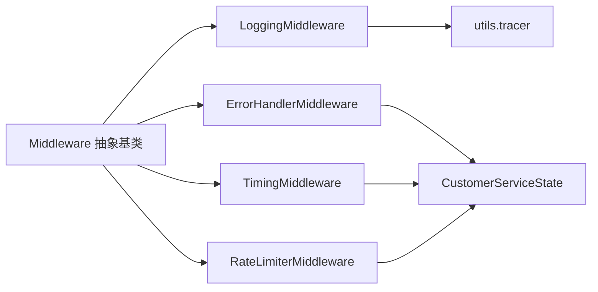

# 中间件开发

<cite>
**本文引用的文件**
- [middleware/base.py](file://middleware/base.py)
- [middleware/__init__.py](file://middleware/__init__.py)
- [middleware/logging_mw.py](file://middleware/logging_mw.py)
- [middleware/timing_mw.py](file://middleware/timing_mw.py)
- [middleware/error_handler_mw.py](file://middleware/error_handler_mw.py)
- [middleware/rate_limiter_mw.py](file://middleware/rate_limiter_mw.py)
- [system.py](file://system.py)
- [state.py](file://state.py)
- [utils/tracer.py](file://utils/tracer.py)
- [app.py](file://app.py)
- [README.md](file://README.md)
</cite>

## 目录
1. [简介](#简介)
2. [项目结构](#项目结构)
3. [核心组件](#核心组件)
4. [架构总览](#架构总览)
5. [详细组件分析](#详细组件分析)
6. [依赖关系分析](#依赖关系分析)
7. [性能考量](#性能考量)
8. [故障排查指南](#故障排查指南)
9. [结论](#结论)
10. [附录](#附录)

## 简介
本指南面向希望在 LangGraph 工作流中开发与集成中间件的工程师。文档围绕 Middleware 基类与 MiddlewareChain 的设计与接口规范，系统阐述中间件链的执行顺序与责任分离机制，给出自定义中间件的实现步骤与最佳实践，并结合项目中的日志、计时、错误处理与限流中间件，提供可直接参考的实现路径与测试策略。

## 项目结构
中间件层位于 middleware/ 目录，采用“抽象基类 + 具体中间件”的模块化组织方式，配合 system.py 中的 MiddlewareChain.wrap() 将横切关注点注入到各个节点函数中，形成统一的 before → execute → after/on_error 生命周期。

图表来源
- [middleware/base.py:46-94](file://middleware/base.py#L46-L94)
- [middleware/__init__.py:12-26](file://middleware/__init__.py#L12-L26)
- [system.py:58-64](file://system.py#L58-L64)

章节来源
- [README.md:95-133](file://README.md#L95-L133)
- [middleware/__init__.py:12-26](file://middleware/__init__.py#L12-L26)

## 核心组件
- Middleware 抽象基类：定义 before_node、after_node、on_error 三个钩子，约束子类必须实现。
- MiddlewareChain：维护中间件列表，提供 add 与 wrap 方法，将任意节点函数包裹为带横切逻辑的包装函数。
- CustomerServiceState：LangGraph 工作流的状态载体，中间件通过读写 state 注入观测与控制信息。

章节来源
- [middleware/base.py:14-43](file://middleware/base.py#L14-L43)
- [middleware/base.py:46-94](file://middleware/base.py#L46-L94)
- [state.py:28-58](file://state.py#L28-L58)

## 架构总览
中间件链在系统初始化时装配，随后通过 MiddlewareChain.wrap() 将其注入到 LangGraph 的每个节点函数中。执行流程严格遵循“before → execute → after 或 on_error”的顺序，确保横切关注点与业务逻辑解耦。

图表来源
- [middleware/base.py:63-94](file://middleware/base.py#L63-L94)
- [system.py:196-246](file://system.py#L196-L246)

## 详细组件分析

### Middleware 基类与 MiddlewareChain
- 设计要点
  - 抽象基类定义三阶段钩子，强制子类实现，保证一致性。
  - MiddlewareChain 以注册顺序执行中间件，支持链式追加中间件。
  - wrap 返回的包装函数保留原函数名，便于调试与日志定位。
- 责任分离
  - 业务节点仅关注自身逻辑，横切关注点（日志、计时、异常、限流）由中间件承担。
  - 通过 state 传递观测与控制信息，避免节点内部散落的 print/log。

图表来源
- [middleware/base.py:14-43](file://middleware/base.py#L14-L43)
- [middleware/base.py:46-94](file://middleware/base.py#L46-L94)
- [middleware/logging_mw.py:32-106](file://middleware/logging_mw.py#L32-L106)
- [middleware/timing_mw.py:13-55](file://middleware/timing_mw.py#L13-L55)
- [middleware/error_handler_mw.py:27-65](file://middleware/error_handler_mw.py#L27-L65)
- [middleware/rate_limiter_mw.py:60-94](file://middleware/rate_limiter_mw.py#L60-L94)

章节来源
- [middleware/base.py:14-43](file://middleware/base.py#L14-L43)
- [middleware/base.py:46-94](file://middleware/base.py#L46-L94)

### 日志中间件（LoggingMiddleware）
- 功能
  - before_node：打印节点开始、记录日志、记录开始时间与时间戳。
  - after_node：打印摘要、记录日志、写入 trace（包含节点名、起止时间、耗时、状态、摘要）。
  - on_error：打印异常、记录错误日志、写入 error trace。
- 与追踪工具协作
  - 使用 utils.tracer.create_trace_entry 写入 state["metadata"]["trace"]，供 UI 展示。
- 关键行为
  - 通过节点名映射显示标签，提升可读性。
  - 对长文本进行截断，避免日志过长。

章节来源
- [middleware/logging_mw.py:32-123](file://middleware/logging_mw.py#L32-L123)
- [utils/tracer.py:11-29](file://utils/tracer.py#L11-L29)

### 计时中间件（TimingMiddleware）
- 功能
  - before_node：记录节点开始时间。
  - after_node：计算耗时并写入 state["metadata"]["node_timings"]，同时打印耗时。
  - on_error：计算异常耗时并打印。
- 与 UI 集成
  - app.py 侧边栏与展开面板读取 metadata.node_timings 展示各节点耗时。

章节来源
- [middleware/timing_mw.py:13-55](file://middleware/timing_mw.py#L13-L55)
- [app.py:103-108](file://app.py#L103-L108)

### 错误处理中间件（ErrorHandlerMiddleware）
- 功能
  - on_error：记录异常日志；对可恢复节点设置兜底回复与升级标记，便于后续节点继续流转。
- 可恢复节点集合
  - 通过集合控制哪些节点异常时走兜底逻辑，避免工作流中断。
- 与系统集成
  - system.py 中的 handle_message 返回值包含 escalated 字段，用于 UI 展示是否升级。

章节来源
- [middleware/error_handler_mw.py:27-65](file://middleware/error_handler_mw.py#L27-L65)
- [system.py:250-298](file://system.py#L250-L298)
- [app.py:96-100](file://app.py#L96-L100)

### 限流中间件（RateLimiterMiddleware）
- 功能
  - before_node：对包含 LLM 调用的节点（通过集合限定）进行令牌桶获取；超时则抛出异常。
  - after_node/on_error：不干预正常流程与异常传播。
- 令牌桶实现
  - TokenBucket 提供 acquire(timeout) 与 refill()，支持并发安全与突发容量。
- 参数
  - rate：每秒补充令牌数，默认 10。
  - capacity：桶容量，默认 20。

章节来源
- [middleware/rate_limiter_mw.py:60-94](file://middleware/rate_limiter_mw.py#L60-L94)
- [middleware/rate_limiter_mw.py:24-58](file://middleware/rate_limiter_mw.py#L24-L58)

### 中间件链装配与执行
- 装配顺序
  - system.py 中按“日志 → 计时 → 异常捕获 → 限流”顺序装配，确保日志与计时在限流之后，异常兜底在限流之前。
- wrap 使用
  - system.py 通过 MiddlewareChain.wrap 将节点函数包裹，注入三阶段钩子。
- 执行顺序
  - before_node 按注册顺序依次执行；after_node/on_error 也按注册顺序执行，异常发生时先执行 on_error 再抛出。

章节来源
- [system.py:58-64](file://system.py#L58-L64)
- [system.py:196-246](file://system.py#L196-L246)
- [middleware/base.py:63-94](file://middleware/base.py#L63-L94)

## 依赖关系分析
- 组件内聚与耦合
  - Middleware 抽象基类与具体中间件之间为强内聚弱耦合：通过统一接口实现横切逻辑。
  - MiddlewareChain 与具体中间件之间为松耦合：通过列表维护，支持动态增删。
- 外部依赖
  - 日志中间件依赖 Python logging 与 utils.tracer。
  - 计时中间件依赖 time。
  - 限流中间件依赖 threading、time。
  - ErrorHandlerMiddleware 依赖 state 字段约定（agent_response、needs_escalation、escalation_reason）。

图表来源
- [middleware/base.py:14-43](file://middleware/base.py#L14-L43)
- [middleware/logging_mw.py:16-14](file://middleware/logging_mw.py#L16-L14)
- [middleware/timing_mw.py:16-10](file://middleware/timing_mw.py#L16-L10)
- [middleware/error_handler_mw.py:13-11](file://middleware/error_handler_mw.py#L13-L11)
- [middleware/rate_limiter_mw.py:11-6](file://middleware/rate_limiter_mw.py#L11-L6)
- [utils/tracer.py:11-29](file://utils/tracer.py#L11-L29)

## 性能考量
- 计时精度与开销
  - 使用 perf_counter 记录高精度时间，after_node 中计算耗时并写入 metadata，避免阻塞业务逻辑。
- 限流策略
  - 令牌桶支持突发容量，避免瞬时高峰被过度抑制；超时阈值可调，平衡吞吐与稳定性。
- 日志与追踪
  - 日志中间件对长文本截断，减少 IO 压力；trace 仅在必要时写入，避免冗余。
- 并发安全
  - 令牌桶使用锁保护，确保多线程下令牌获取的一致性。

章节来源
- [middleware/timing_mw.py:20-43](file://middleware/timing_mw.py#L20-L43)
- [middleware/rate_limiter_mw.py:39-57](file://middleware/rate_limiter_mw.py#L39-L57)
- [middleware/logging_mw.py:108-123](file://middleware/logging_mw.py#L108-L123)

## 故障排查指南
- 异常传播与兜底
  - ErrorHandlerMiddleware 在 on_error 中设置兜底回复与升级标记，MiddlewareChain 外层仍会抛出异常，便于上层感知。
- 限流超时
  - RateLimiterMiddleware 在 acquire 超时后抛出异常，提示等待时间过长，建议降低调用频率或调整 rate/capacity。
- 日志与追踪
  - 通过 UI 侧边栏查看 trace 与 node_timings，定位耗时节点与异常节点。
- 状态字段检查
  - 确认 state["metadata"] 中包含 trace 与 node_timings 字段，以便中间件正确写入。

章节来源
- [middleware/error_handler_mw.py:59-65](file://middleware/error_handler_mw.py#L59-L65)
- [middleware/rate_limiter_mw.py:75-77](file://middleware/rate_limiter_mw.py#L75-L77)
- [app.py:110-122](file://app.py#L110-L122)

## 结论
本项目的中间件体系通过抽象基类与链式编排，实现了日志、计时、异常兜底与限流等横切能力的统一注入。执行顺序明确、责任清晰，既保证了可观测性与稳定性，又不侵入业务节点逻辑。开发者可在此基础上快速扩展新的中间件，满足更多运维与质量保障需求。

## 附录

### 自定义中间件实现步骤
- 继承基类
  - 创建类并继承 Middleware，实现 before_node、after_node、on_error 三个方法。
- 包裹节点
  - 在系统初始化时将中间件加入 MiddlewareChain，使用 wrap 注入到 LangGraph 节点函数。
- 处理请求与响应
  - 在 before_node 中读取 state 做前置校验或记录；在 after_node 中写入观测指标；在 on_error 中记录异常并可设置兜底状态。
- 配置参数与运行时行为
  - 如需外部配置（如限流 rate/capacity），可在构造函数中接收参数；在 before_node 中生效。

章节来源
- [middleware/base.py:14-43](file://middleware/base.py#L14-L43)
- [middleware/base.py:55-61](file://middleware/base.py#L55-L61)
- [system.py:58-64](file://system.py#L58-L64)

### 具体中间件实现参考路径
- 日志中间件
  - [middleware/logging_mw.py:32-123](file://middleware/logging_mw.py#L32-L123)
  - [utils/tracer.py:11-29](file://utils/tracer.py#L11-L29)
- 计时中间件
  - [middleware/timing_mw.py:13-55](file://middleware/timing_mw.py#L13-L55)
- 错误处理中间件
  - [middleware/error_handler_mw.py:27-65](file://middleware/error_handler_mw.py#L27-L65)
- 限流中间件
  - [middleware/rate_limiter_mw.py:60-94](file://middleware/rate_limiter_mw.py#L60-L94)
  - [middleware/rate_limiter_mw.py:24-58](file://middleware/rate_limiter_mw.py#L24-L58)

### 中间件异常处理与错误传播机制
- 执行流程
  - before_node → 节点执行 → 正常返回则 after_node → 返回；异常则 on_error → 重新抛出。
- 传播策略
  - on_error 中可设置兜底状态（如 fallback 回复与升级标记），但异常仍向上抛出，确保上层可观测。

章节来源
- [middleware/base.py:77-87](file://middleware/base.py#L77-L87)
- [middleware/error_handler_mw.py:59-65](file://middleware/error_handler_mw.py#L59-L65)

### 中间件测试策略与性能监控
- 测试策略
  - 单元测试：针对中间件的钩子方法，构造 CustomerServiceState 输入，验证 before_node/after_node/on_error 的行为与副作用（如 metadata 写入）。
  - 集成测试：在 system.py 中使用最小工作流，验证 wrap 后的节点函数在异常与正常路径下的行为。
  - 性能测试：使用 TimingMiddleware 与 UI 展示的 node_timings，对比不同配置下的吞吐与延迟。
- 性能监控
  - 通过 UI 侧边栏查看 trace 与 node_timings，定位瓶颈节点；结合日志中间件的摘要信息，快速定位问题。

章节来源
- [app.py:103-122](file://app.py#L103-L122)
- [middleware/timing_mw.py:28-43](file://middleware/timing_mw.py#L28-L43)
- [middleware/logging_mw.py:52-76](file://middleware/logging_mw.py#L52-L76)