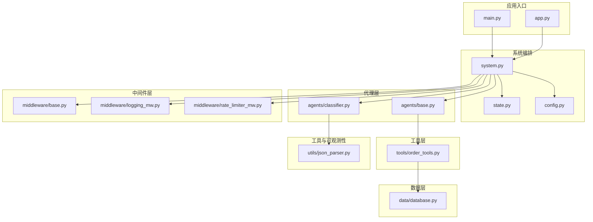
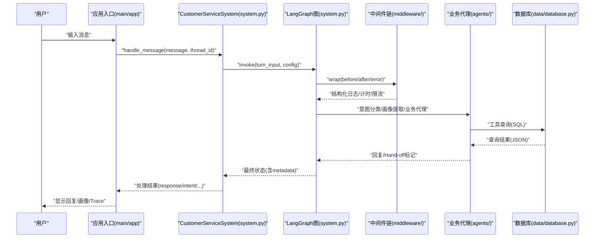
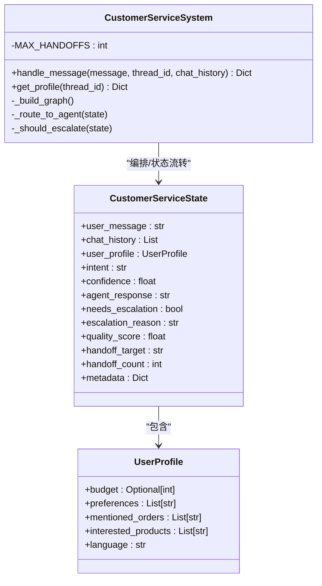
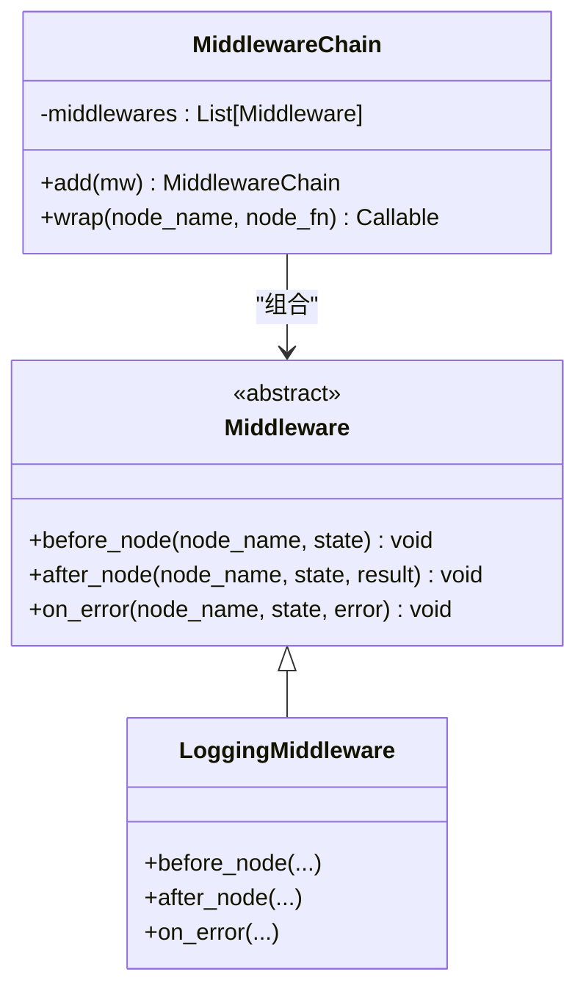
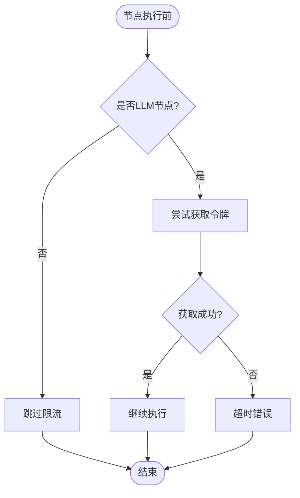
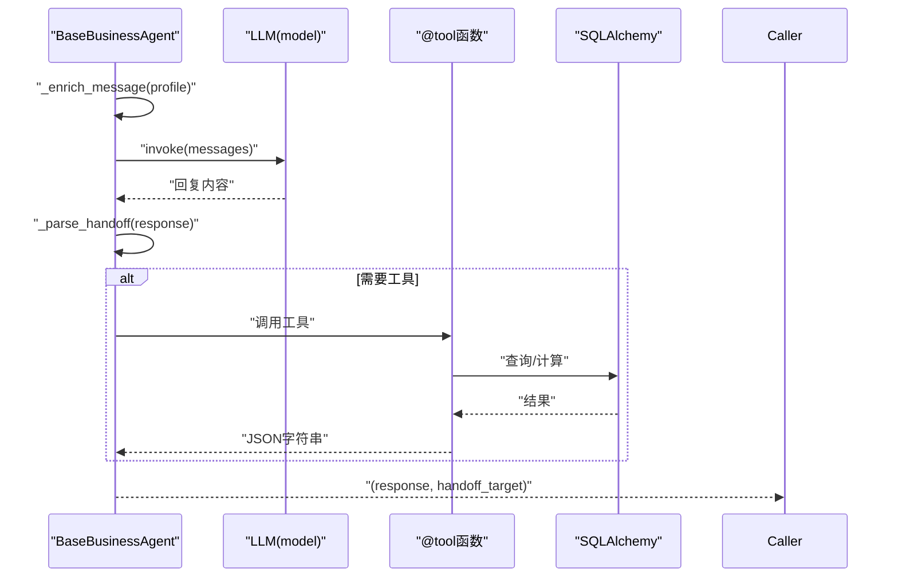
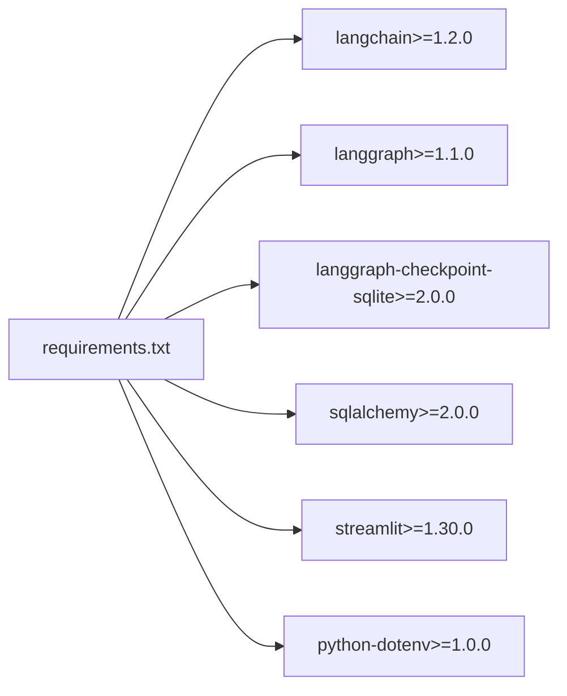

# 代码贡献指南

<cite>
**本文引用的文件**
- [README.md](file://README.md)
- [requirements.txt](file://requirements.txt)
- [main.py](file://main.py)
- [app.py](file://app.py)
- [config.py](file://config.py)
- [system.py](file://system.py)
- [state.py](file://state.py)
- [data/database.py](file://data/database.py)
- [agents/base.py](file://agents/base.py)
- [agents/classifier.py](file://agents/classifier.py)
- [middleware/base.py](file://middleware/base.py)
- [middleware/logging_mw.py](file://middleware/logging_mw.py)
- [middleware/rate_limiter_mw.py](file://middleware/rate_limiter_mw.py)
- [tools/order_tools.py](file://tools/order_tools.py)
- [utils/json_parser.py](file://utils/json_parser.py)
</cite>

## 目录
1. [简介](#简介)
2. [项目结构](#项目结构)
3. [核心组件](#核心组件)
4. [架构总览](#架构总览)
5. [详细组件分析](#详细组件分析)
6. [依赖分析](#依赖分析)
7. [性能考虑](#性能考虑)
8. [故障排查指南](#故障排查指南)
9. [结论](#结论)
10. [附录](#附录)

## 简介
本指南面向希望为“多智能体客服系统”项目贡献代码的开发者，涵盖代码规范与编码标准、Pull Request 提交流程与审查要求、分支管理与版本发布策略、代码风格检查与自动化测试要求、文档与示例维护规范、开发环境搭建与依赖管理步骤、问题报告与功能请求提交方式、社区参与与沟通渠道，以及贡献者许可协议与知识产权相关条款。

## 项目结构
项目采用按职责分层的模块化组织方式：
- 应用入口与演示：main.py、app.py
- 系统编排与状态：system.py、state.py
- 配置中心：config.py
- 代理层：agents/（意图分类、画像提取、业务代理、质量检查、基础代理）
- 中间件层：middleware/（日志、计时、异常捕获、限流）
- 工具层：tools/（LangChain 工具函数）
- 数据层：data/（SQLAlchemy ORM + SQLite）
- 工具与可观测性：utils/（JSON 容错解析、调用链追踪）

**图表来源**
- [main.py:1-148](file://main.py#L1-L148)
- [app.py:1-177](file://app.py#L1-L177)
- [system.py:1-305](file://system.py#L1-L305)
- [state.py:1-58](file://state.py#L1-L58)
- [config.py:1-60](file://config.py#L1-L60)
- [agents/base.py:1-123](file://agents/base.py#L1-L123)
- [agents/classifier.py:1-63](file://agents/classifier.py#L1-L63)
- [middleware/base.py:1-94](file://middleware/base.py#L1-L94)
- [middleware/logging_mw.py:1-123](file://middleware/logging_mw.py#L1-L123)
- [middleware/rate_limiter_mw.py:1-94](file://middleware/rate_limiter_mw.py#L1-L94)
- [tools/order_tools.py:1-50](file://tools/order_tools.py#L1-L50)
- [data/database.py:1-161](file://data/database.py#L1-L161)
- [utils/json_parser.py:1-51](file://utils/json_parser.py#L1-L51)

**章节来源**
- [README.md:95-133](file://README.md#L95-L133)
- [main.py:1-148](file://main.py#L1-L148)
- [app.py:1-177](file://app.py#L1-L177)
- [system.py:1-305](file://system.py#L1-L305)
- [state.py:1-58](file://state.py#L1-L58)
- [config.py:1-60](file://config.py#L1-L60)
- [agents/base.py:1-123](file://agents/base.py#L1-L123)
- [agents/classifier.py:1-63](file://agents/classifier.py#L1-L63)
- [middleware/base.py:1-94](file://middleware/base.py#L1-L94)
- [middleware/logging_mw.py:1-123](file://middleware/logging_mw.py#L1-L123)
- [middleware/rate_limiter_mw.py:1-94](file://middleware/rate_limiter_mw.py#L1-L94)
- [tools/order_tools.py:1-50](file://tools/order_tools.py#L1-L50)
- [data/database.py:1-161](file://data/database.py#L1-L161)
- [utils/json_parser.py:1-51](file://utils/json_parser.py#L1-L51)

## 核心组件
- 系统编排与工作流：LangGraph 编排意图分类、画像提取、业务代理、质量检查与升级/Hand-off 路由。
- 状态模型：CustomerServiceState 与 UserProfile，支持跨轮次累积与每轮重置字段。
- 配置中心：集中管理模型初始化、阈值常量、持久化路径与多语言配置。
- 代理层：统一的 BaseBusinessAgent 基类封装工具调用与 Hand-off；IntentClassifier 使用 LCEL 管道。
- 中间件层：日志、计时、异常捕获、限流四层中间件链，统一横切关注点。
- 工具层：LangChain @tool 函数，封装数据库查询与兜底逻辑。
- 数据层：SQLAlchemy ORM + SQLite，替代 mock 数据，提供真实业务数据支撑。
- 工具与可观测性：JSON 容错解析与调用链追踪，提升鲁棒性与可观测性。

**章节来源**
- [system.py:34-305](file://system.py#L34-L305)
- [state.py:28-58](file://state.py#L28-L58)
- [config.py:14-60](file://config.py#L14-L60)
- [agents/base.py:23-123](file://agents/base.py#L23-L123)
- [agents/classifier.py:19-63](file://agents/classifier.py#L19-L63)
- [middleware/base.py:14-94](file://middleware/base.py#L14-L94)
- [tools/order_tools.py:15-50](file://tools/order_tools.py#L15-L50)
- [data/database.py:91-161](file://data/database.py#L91-L161)
- [utils/json_parser.py:10-51](file://utils/json_parser.py#L10-L51)

## 架构总览
系统通过 LangGraph StateGraph 实现端到端工作流，中间件链在节点执行前后注入横切逻辑，Checkpointer 实现跨轮次状态持久化。

**图表来源**
- [system.py:248-299](file://system.py#L248-L299)
- [middleware/base.py:63-94](file://middleware/base.py#L63-L94)
- [middleware/logging_mw.py:32-106](file://middleware/logging_mw.py#L32-L106)
- [middleware/rate_limiter_mw.py:60-94](file://middleware/rate_limiter_mw.py#L60-L94)
- [agents/base.py:41-66](file://agents/base.py#L41-L66)
- [tools/order_tools.py:15-50](file://tools/order_tools.py#L15-L50)
- [data/database.py:104-161](file://data/database.py#L104-L161)

## 详细组件分析

### 系统编排与状态模型
- CustomerServiceSystem：构建并编译 LangGraph，注入中间件链，实现条件路由、Hand-off 与质量检查升级。
- 状态模型：CustomerServiceState 定义每轮重置字段与跨轮次累积字段；UserProfile 支持预算、偏好、订单、产品、语言等维度。

**图表来源**
- [system.py:34-305](file://system.py#L34-L305)
- [state.py:28-58](file://state.py#L28-L58)

**章节来源**
- [system.py:34-305](file://system.py#L34-L305)
- [state.py:14-58](file://state.py#L14-L58)

### 中间件基础设施与日志中间件
- Middleware 抽象基类与 MiddlewareChain：提供 before/after/on_error 三阶段钩子，按注册顺序执行。
- LoggingMiddleware：统一结构化日志、节点摘要与 Trace 写入，便于可观测性与调试。

**图表来源**
- [middleware/base.py:14-94](file://middleware/base.py#L14-L94)
- [middleware/logging_mw.py:32-106](file://middleware/logging_mw.py#L32-L106)

**章节来源**
- [middleware/base.py:14-94](file://middleware/base.py#L14-L94)
- [middleware/logging_mw.py:1-123](file://middleware/logging_mw.py#L1-L123)

### 限流中间件与令牌桶
- RateLimiterMiddleware：对包含 LLM 调用的节点实施令牌桶限流，避免超出 API 速率限制。
- TokenBucket：线程安全的令牌桶实现，支持突发与超时控制。

**图表来源**
- [middleware/rate_limiter_mw.py:60-94](file://middleware/rate_limiter_mw.py#L60-L94)
- [middleware/rate_limiter_mw.py:24-58](file://middleware/rate_limiter_mw.py#L24-L58)

**章节来源**
- [middleware/rate_limiter_mw.py:1-94](file://middleware/rate_limiter_mw.py#L1-L94)

### 代理层与工具层
- BaseBusinessAgent：封装 create_agent、工具注入、Hand-off 解析与多语言指令注入。
- IntentClassifier：使用 LCEL 管道进行意图分类，返回 JSON 并经容错解析。
- 工具层：@tool 函数封装数据库查询与兜底逻辑，确保 LLM 工具调用稳定。

**图表来源**
- [agents/base.py:41-114](file://agents/base.py#L41-L114)
- [agents/classifier.py:40-63](file://agents/classifier.py#L40-L63)
- [tools/order_tools.py:15-50](file://tools/order_tools.py#L15-L50)
- [data/database.py:104-161](file://data/database.py#L104-L161)

**章节来源**
- [agents/base.py:1-123](file://agents/base.py#L1-L123)
- [agents/classifier.py:1-63](file://agents/classifier.py#L1-L63)
- [tools/order_tools.py:1-50](file://tools/order_tools.py#L1-L50)
- [data/database.py:1-161](file://data/database.py#L1-L161)

### 数据层与配置中心
- data/database.py：定义订单、产品、FAQ 表结构，提供查询函数与会话管理。
- config.py：集中管理环境变量、模型初始化、阈值常量、持久化路径与多语言配置。

**章节来源**
- [data/database.py:1-161](file://data/database.py#L1-L161)
- [config.py:14-60](file://config.py#L14-L60)

## 依赖分析
- 运行时依赖：LangChain 1.0+、LangGraph、LangGraph Checkpointer、SQLAlchemy、Streamlit、python-dotenv。
- 开发与测试：建议引入 flake8/black/isort 等风格检查工具与 pytest/unittest 单元测试框架。

**图表来源**
- [requirements.txt:1-15](file://requirements.txt#L1-L15)

**章节来源**
- [requirements.txt:1-15](file://requirements.txt#L1-L15)

## 性能考虑
- 中间件限流：RateLimiterMiddleware 通过令牌桶限制 LLM 节点并发，避免 API 速率限制导致的失败。
- 持久化 Checkpointer：优先使用 SqliteSaver，失败时回退到 InMemorySaver，保障跨轮次状态可用性。
- 观测性：LoggingMiddleware 记录节点耗时与 Trace，便于定位性能瓶颈。
- 工具查询：数据库查询使用索引列与合理 LIMIT，避免全表扫描。

**章节来源**
- [system.py:66-76](file://system.py#L66-L76)
- [middleware/rate_limiter_mw.py:60-94](file://middleware/rate_limiter_mw.py#L60-L94)
- [middleware/logging_mw.py:32-106](file://middleware/logging_mw.py#L32-L106)
- [data/database.py:120-161](file://data/database.py#L120-L161)

## 故障排查指南
- 环境变量缺失：DEEPSEEK_API_KEY 未配置将抛出异常，需在 .env 中设置有效密钥。
- 数据库初始化：首次运行需执行种子脚本，确保表结构与初始数据存在。
- JSON 解析失败：LLM 返回的 JSON 可能被代码块包裹或包含非 JSON 文本，使用容错解析工具兜底。
- 限流超时：节点等待令牌超时会抛出错误，适当降低并发或调整令牌桶参数。
- Web UI 会话：确保 thread_id 一致以共享用户画像，新建会话会清空历史。

**章节来源**
- [config.py:20-27](file://config.py#L20-L27)
- [main.py:136-143](file://main.py#L136-L143)
- [utils/json_parser.py:10-51](file://utils/json_parser.py#L10-L51)
- [middleware/rate_limiter_mw.py:75-77](file://middleware/rate_limiter_mw.py#L75-L77)
- [app.py:23-68](file://app.py#L23-L68)

## 结论
本指南提供了从代码规范、提交流程、分支与发布策略，到风格检查、测试要求、文档与示例维护、开发环境搭建、问题报告与功能请求、社区沟通渠道，以及贡献者许可与知识产权条款的完整指引。遵循上述规范有助于提升代码质量、协作效率与系统稳定性。

## 附录

### 代码规范与编码标准
- 命名规范
  - 模块与文件：小写下划线命名（如 system.py、data/database.py）。
  - 类：帕斯卡命名（如 CustomerServiceSystem、BaseBusinessAgent）。
  - 函数与方法：小写下划线命名（如 handle_message、query_order_by_id）。
  - 常量：全大写加下划线（如 MIN_INTENT_CONFIDENCE、CHECKPOINT_DB_PATH）。
- 注释与文档
  - 模块顶部包含简要说明与用途注释。
  - 关键函数/类提供 docstring，描述参数、返回值与异常。
  - 复杂逻辑提供注释说明，必要时附带流程图或时序图。
- 结构与职责
  - 代理层仅负责业务逻辑与工具调用，不直接操作数据库。
  - 工具层使用 @tool 装饰器，确保 LLM 可发现与调用。
  - 中间件层统一横切关注点，避免节点内散落的重复逻辑。
- 错误处理
  - 使用容错解析与兜底返回，避免主流程中断。
  - 异常捕获与记录在中间件中统一处理，保持节点函数简洁。
- 多语言支持
  - 通过用户画像中的 language 字段控制回复语言，避免硬编码。

**章节来源**
- [agents/base.py:14-123](file://agents/base.py#L14-L123)
- [tools/order_tools.py:15-50](file://tools/order_tools.py#L15-L50)
- [middleware/base.py:14-94](file://middleware/base.py#L14-L94)
- [utils/json_parser.py:10-51](file://utils/json_parser.py#L10-L51)
- [state.py:14-58](file://state.py#L14-L58)

### Pull Request 提交流程与审查要求
- 分支策略
  - 功能开发：从 develop 拉取新分支 feature/<name>，完成后合并回 develop。
  - 紧急修复：从 main 拉取 hotfix/<name>，修复后同时合并到 develop。
- 提交规范
  - 提交信息使用动词开头，简明描述变更目的与影响范围。
  - 包含必要的单元测试与集成测试，确保回归不引入。
- 审查要求
  - 至少一名维护者审查，重点关注：代码正确性、性能影响、安全性、可维护性与文档更新。
  - 通过 CI 检查（风格、测试覆盖率、依赖扫描）后再合并。

### 分支管理策略与版本发布流程
- 分支策略
  - main：生产可用代码，受保护分支。
  - develop：集成开发成果，定期同步 main。
  - feature/*：功能开发分支，短期存在。
  - hotfix/*：紧急修复分支，快速回归 main 与 develop。
- 版本发布
  - 语义化版本：主版本号.次版本号.修订号。
  - 发布前：更新 CHANGELOG，确保测试通过与文档同步。
  - 标签与发布：在 main 上打标签并发布 Release。

### 代码风格检查与自动化测试
- 风格检查
  - 使用 black、flake8、isort 等工具，统一缩进、空行、导入顺序与行宽。
  - 集成 pre-commit 钩子，在提交前自动执行检查。
- 自动化测试
  - 单元测试：针对工具函数与中间件逻辑编写测试用例。
  - 集成测试：模拟 LangGraph 工作流，验证路由、Hand-off 与质量检查。
  - 覆盖率：目标不低于 80%，关键路径 100%。

### 文档更新与示例维护规范
- 更新 README：新增/修改功能需同步更新技术栈、特性列表与使用示例。
- 示例代码：提供最小可运行示例，标注输入输出与预期行为。
- API 文档：为对外接口提供清晰的参数说明与返回值结构。

### 开发环境搭建与依赖管理
- Python 版本：3.10+
- 虚拟环境：建议使用 venv 创建隔离环境。
- 安装依赖：pip install -r requirements.txt
- 环境变量：复制 .env.example 为 .env，并填写 DEEPSEEK_API_KEY。
- 数据库：首次运行自动初始化表结构与种子数据。
- 运行方式：命令行模式 python main.py；Web UI 模式 streamlit run app.py

**章节来源**
- [README.md:66-93](file://README.md#L66-L93)
- [config.py:16-27](file://config.py#L16-L27)
- [main.py:136-143](file://main.py#L136-L143)
- [app.py:14-42](file://app.py#L14-L42)

### 问题报告与功能请求
- 问题报告
  - 提供最小可复现示例与期望/实际行为对比。
  - 附带系统环境信息（Python 版本、依赖版本、操作系统）。
  - 使用合适的 Issue 模板，选择 bug/feature/question 标签。
- 功能请求
  - 描述背景、目标与验收标准。
  - 提供可行的实现思路与影响范围评估。

### 社区参与与沟通渠道
- GitHub Issues：用于问题报告与功能请求。
- Discussions：用于设计讨论与最佳实践分享。
- 代码评审：通过 Pull Request 进行同行评审与知识沉淀。

### 贡献者许可协议与知识产权
- 许可证：项目采用 MIT 许可证，允许自由使用、复制、修改与再发布，需在衍生作品中保留版权与许可声明。
- 贡献声明：贡献者需确认拥有相应权利，且贡献内容不侵犯第三方权益。
- 知识产权：贡献者保留其原始版权，授予项目使用与分发的非独占许可。

**章节来源**
- [README.md:197-200](file://README.md#L197-L200)