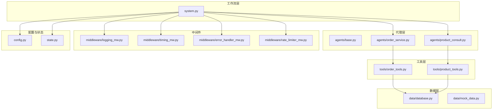
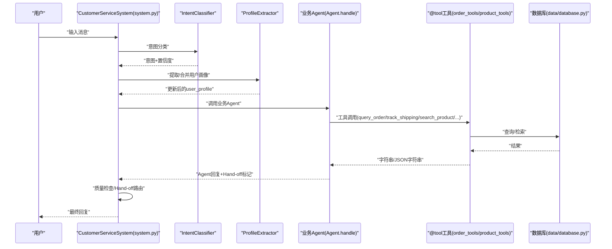
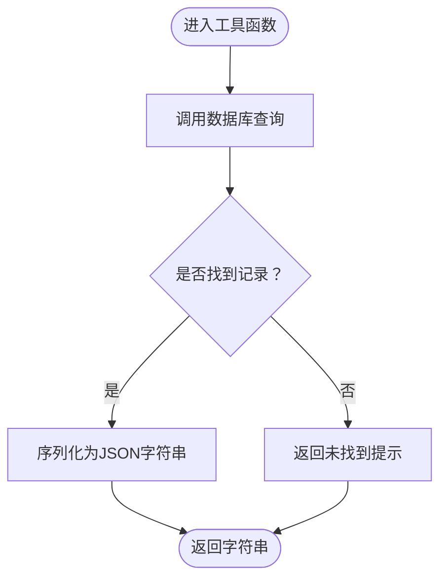
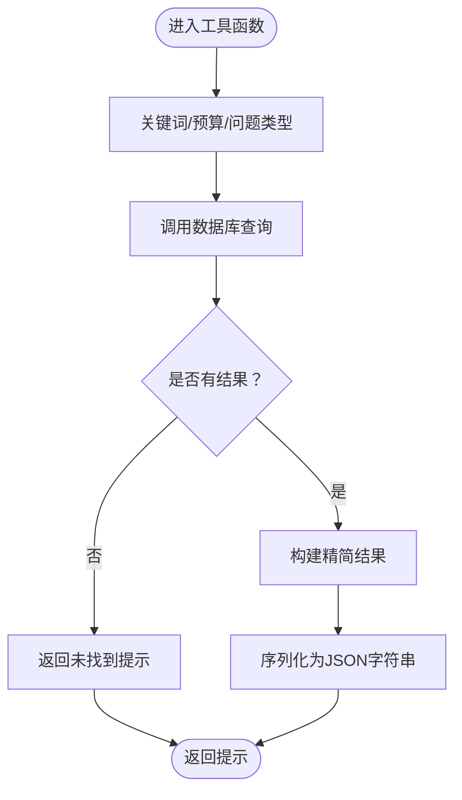
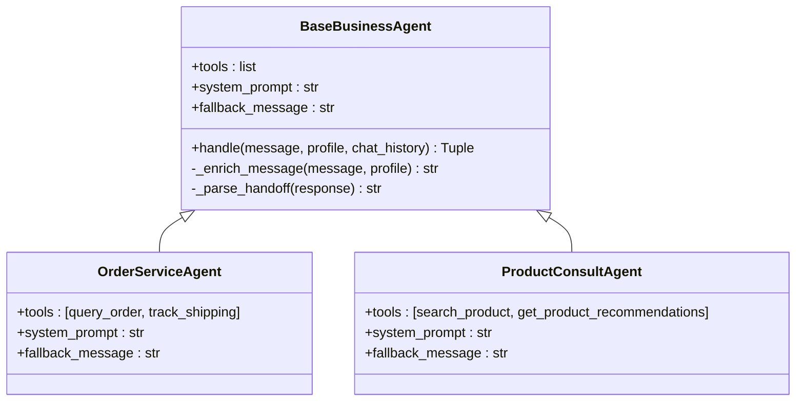
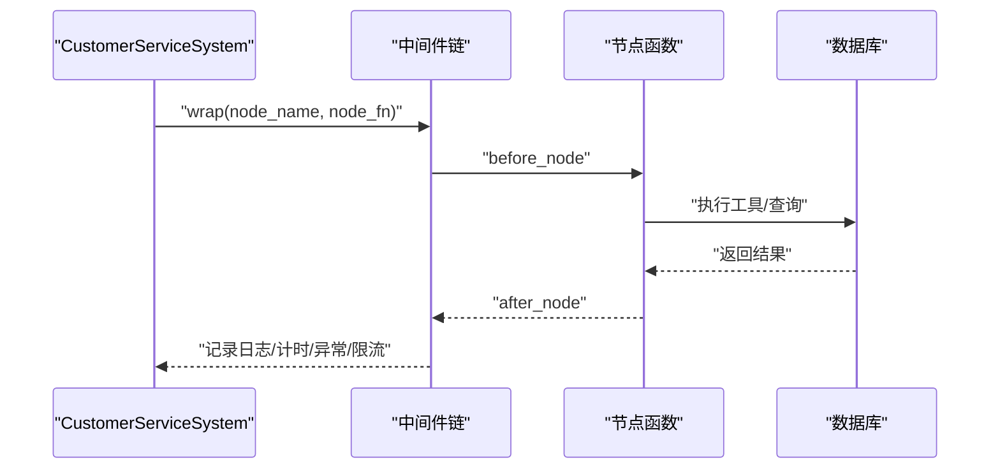
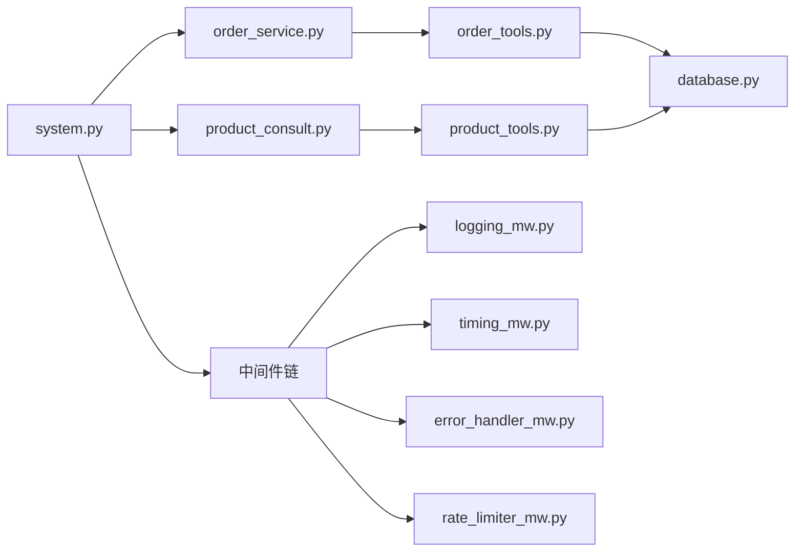

# 工具函数开发

<cite>
**本文引用的文件**
- [tools/order_tools.py](file://tools/order_tools.py)
- [tools/product_tools.py](file://tools/product_tools.py)
- [agents/base.py](file://agents/base.py)
- [agents/order_service.py](file://agents/order_service.py)
- [agents/product_consult.py](file://agents/product_consult.py)
- [system.py](file://system.py)
- [data/database.py](file://data/database.py)
- [data/mock_data.py](file://data/mock_data.py)
- [config.py](file://config.py)
- [middleware/error_handler_mw.py](file://middleware/error_handler_mw.py)
- [middleware/rate_limiter_mw.py](file://middleware/rate_limiter_mw.py)
- [middleware/logging_mw.py](file://middleware/logging_mw.py)
- [middleware/timing_mw.py](file://middleware/timing_mw.py)
- [state.py](file://state.py)
- [README.md](file://README.md)
</cite>

## 目录
1. [简介](#简介)
2. [项目结构](#项目结构)
3. [核心组件](#核心组件)
4. [架构总览](#架构总览)
5. [详细组件分析](#详细组件分析)
6. [依赖关系分析](#依赖关系分析)
7. [性能考量](#性能考量)
8. [故障排查指南](#故障排查指南)
9. [结论](#结论)
10. [附录](#附录)

## 简介
本指南面向希望在 LangChain 生态中开发“工具函数”的工程师，围绕本项目中的工具函数实现，系统讲解：
- @tool 装饰器的使用方法与参数规范
- 工具函数的输入输出约定与错误处理机制
- 订单查询与产品查询工具的实现要点
- 工具函数与 Agent 的集成方式与调用协议
- 安全与权限控制建议
- 单元测试方法与模拟数据准备
- 版本管理与兼容性维护
- 性能优化与缓存策略

## 项目结构
本项目采用“工具层-代理层-工作流层”三层组织方式：
- tools：LangChain 工具函数集合，使用 @tool 装饰器暴露给 Agent
- agents：业务 Agent，声明可用工具与系统提示词
- system：LangGraph 工作流编排，负责路由、质量检查与 Hand-off
- data：数据访问层（SQLAlchemy ORM 替代 mock 数据）
- middleware：中间件链，提供日志、计时、异常捕获、限流
- config/state：配置与状态定义

图表来源
- [tools/order_tools.py:1-50](file://tools/order_tools.py#L1-L50)
- [tools/product_tools.py:1-78](file://tools/product_tools.py#L1-L78)
- [agents/order_service.py:1-29](file://agents/order_service.py#L1-L29)
- [agents/product_consult.py:1-30](file://agents/product_consult.py#L1-L30)
- [system.py:1-305](file://system.py#L1-L305)
- [data/database.py:1-161](file://data/database.py#L1-L161)
- [middleware/logging_mw.py:1-123](file://middleware/logging_mw.py#L1-L123)
- [middleware/timing_mw.py:1-55](file://middleware/timing_mw.py#L1-L55)
- [middleware/error_handler_mw.py:1-65](file://middleware/error_handler_mw.py#L1-L65)
- [middleware/rate_limiter_mw.py:1-94](file://middleware/rate_limiter_mw.py#L1-L94)
- [config.py:1-60](file://config.py#L1-L60)
- [state.py:1-58](file://state.py#L1-L58)

章节来源
- [README.md:95-133](file://README.md#L95-L133)

## 核心组件
- 工具函数（@tool 装饰）：位于 tools/order_tools.py 与 tools/product_tools.py，分别封装订单查询、物流跟踪、产品检索、预算推荐、FAQ 搜索等能力
- 业务 Agent：agents/base.py 定义了统一的 create_agent 创建流程与 Hand-off 机制；order_service.py 与 product_consult.py 声明各自工具集与系统提示词
- 工作流系统：system.py 使用 LangGraph 编排意图分类、画像提取、业务 Agent、质量检查与 Hand-off 路由
- 数据访问层：data/database.py 提供 SQLAlchemy ORM 查询接口，替代 mock_data.py 的硬编码数据
- 中间件链：日志、计时、异常捕获、限流，贯穿工作流节点执行
- 配置与状态：config.py 管理模型与阈值，state.py 定义工作流状态结构

章节来源
- [tools/order_tools.py:15-50](file://tools/order_tools.py#L15-L50)
- [tools/product_tools.py:14-78](file://tools/product_tools.py#L14-L78)
- [agents/base.py:23-123](file://agents/base.py#L23-L123)
- [agents/order_service.py:11-29](file://agents/order_service.py#L11-L29)
- [agents/product_consult.py:11-30](file://agents/product_consult.py#L11-L30)
- [system.py:34-305](file://system.py#L34-L305)
- [data/database.py:104-161](file://data/database.py#L104-L161)
- [middleware/logging_mw.py:32-123](file://middleware/logging_mw.py#L32-L123)
- [middleware/timing_mw.py:13-55](file://middleware/timing_mw.py#L13-L55)
- [middleware/error_handler_mw.py:27-65](file://middleware/error_handler_mw.py#L27-L65)
- [middleware/rate_limiter_mw.py:60-94](file://middleware/rate_limiter_mw.py#L60-L94)
- [config.py:28-60](file://config.py#L28-L60)
- [state.py:28-58](file://state.py#L28-L58)

## 架构总览
LangChain 工具函数通过 @tool 装饰后，被注入到 Agent 的工具列表中；Agent 使用 create_agent 与 LLM 协作，按系统提示词进行工具调用；系统通过 LangGraph 将多个 Agent 组织为工作流，配合中间件实现可观测性与稳定性。

图表来源
- [system.py:79-117](file://system.py#L79-L117)
- [agents/base.py:41-66](file://agents/base.py#L41-L66)
- [tools/order_tools.py:15-50](file://tools/order_tools.py#L15-L50)
- [tools/product_tools.py:14-78](file://tools/product_tools.py#L14-L78)
- [data/database.py:104-161](file://data/database.py#L104-L161)

## 详细组件分析

### @tool 装饰器与参数规范
- 装饰器位置：tools/order_tools.py 与 tools/product_tools.py 中均使用 @tool 对函数进行装饰
- 参数规范：工具函数签名明确标注参数类型与含义；返回值统一为字符串（便于 LLM 解析与展示）
- 文档字符串：每个工具的 docstring 作为“工具说明”传递给 LLM，指导其何时调用及如何构造参数
- 输入校验：工具内部对空结果进行兜底处理，返回可读性强的提示信息

章节来源
- [tools/order_tools.py:15-28](file://tools/order_tools.py#L15-L28)
- [tools/order_tools.py:31-50](file://tools/order_tools.py#L31-L50)
- [tools/product_tools.py:14-36](file://tools/product_tools.py#L14-L36)
- [tools/product_tools.py:39-61](file://tools/product_tools.py#L39-L61)
- [tools/product_tools.py:64-78](file://tools/product_tools.py#L64-L78)

### 工具函数输入输出格式
- 订单查询工具
  - 输入：订单号（字符串）
  - 输出：订单详情的 JSON 字符串；未找到时返回提示文本
- 物流跟踪工具
  - 输入：物流单号（字符串）
  - 输出：物流状态文本；未找到时按单号前缀进行兜底提示
- 产品搜索工具
  - 输入：关键词（字符串）
  - 输出：匹配产品的精简信息 JSON 字符串；未找到时返回提示文本
- 预算推荐工具
  - 输入：预算金额（整数）、可选类别（字符串）
  - 输出：按评分排序的推荐产品 JSON 字符串（最多 3 个）；未找到时返回提示文本
- FAQ 搜索工具
  - 输入：问题类型关键词（字符串）
  - 输出：FAQ 答案文本；未找到时返回提示文本

章节来源
- [tools/order_tools.py:15-50](file://tools/order_tools.py#L15-L50)
- [tools/product_tools.py:14-78](file://tools/product_tools.py#L14-L78)

### 错误处理机制
- 工具层兜底：当查询无结果时，工具返回明确的提示文本，避免空值导致 LLM 误解
- Agent 层兜底：BaseBusinessAgent.handle 返回 fallback_message，确保无有效回复时仍给出稳定输出
- 中间件兜底：ErrorHandlerMiddleware 对可恢复节点捕获异常，设置 fallback 回复并标记升级
- 限流保护：RateLimiterMiddleware 对包含 LLM 调用的节点进行令牌桶限流，避免超频

章节来源
- [tools/order_tools.py:25-28](file://tools/order_tools.py#L25-L28)
- [tools/order_tools.py:41-49](file://tools/order_tools.py#L41-L49)
- [tools/product_tools.py:24-36](file://tools/product_tools.py#L24-L36)
- [tools/product_tools.py:50-61](file://tools/product_tools.py#L50-L61)
- [agents/base.py:41-66](file://agents/base.py#L41-L66)
- [middleware/error_handler_mw.py:46-65](file://middleware/error_handler_mw.py#L46-L65)
- [middleware/rate_limiter_mw.py:71-78](file://middleware/rate_limiter_mw.py#L71-L78)

### 订单查询工具实现要点
- 工具函数：query_order
  - 作用：根据订单号查询订单详情
  - 数据来源：data/database.py 的 query_order_by_id
  - 输出：JSON 字符串或未找到提示
- 工具函数：track_shipping
  - 作用：根据物流单号查询物流状态
  - 数据来源：data/database.py 的 track_shipping_by_number
  - 输出：物流状态文本或按前缀兜底提示

图表来源
- [tools/order_tools.py:15-50](file://tools/order_tools.py#L15-L50)
- [data/database.py:104-117](file://data/database.py#L104-L117)

章节来源
- [tools/order_tools.py:15-50](file://tools/order_tools.py#L15-L50)
- [data/database.py:104-117](file://data/database.py#L104-L117)

### 产品查询工具实现要点
- 工具函数：search_product
  - 作用：按关键词搜索产品
  - 数据来源：data/database.py 的 search_products_by_keyword
  - 输出：精简产品信息 JSON 字符串或未找到提示
- 工具函数：get_product_recommendations
  - 作用：按预算推荐产品（最多 3 个，按评分降序）
  - 数据来源：data/database.py 的 get_products_by_budget
  - 输出：推荐产品 JSON 字符串或未找到提示
- 工具函数：search_faq
  - 作用：按问题类型关键词搜索 FAQ
  - 数据来源：data/database.py 的 search_faq_by_keyword
  - 输出：FAQ 答案文本或未找到提示

图表来源
- [tools/product_tools.py:14-78](file://tools/product_tools.py#L14-L78)
- [data/database.py:120-161](file://data/database.py#L120-L161)

章节来源
- [tools/product_tools.py:14-78](file://tools/product_tools.py#L14-L78)
- [data/database.py:120-161](file://data/database.py#L120-L161)

### 工具函数与 Agent 的集成方式与调用协议
- Agent 声明工具：order_service.py 与 product_consult.py 在类属性 tools 中列出可用工具
- Agent 创建：agents/base.py 的 BaseBusinessAgent.__init__ 使用 create_agent 将 tools 与系统提示词绑定
- 调用协议：Agent.handle 接收用户消息与 user_profile，拼接后调用 agent.invoke，解析最后一条消息内容作为回复
- Hand-off 协议：Agent 回复中包含 [HANDOFF:agent_name] 标记时，系统根据 VALID_HANDOFF_TARGETS 进行路由

图表来源
- [agents/base.py:23-123](file://agents/base.py#L23-L123)
- [agents/order_service.py:11-29](file://agents/order_service.py#L11-L29)
- [agents/product_consult.py:11-30](file://agents/product_consult.py#L11-L30)

章节来源
- [agents/base.py:23-123](file://agents/base.py#L23-L123)
- [agents/order_service.py:11-29](file://agents/order_service.py#L11-L29)
- [agents/product_consult.py:11-30](file://agents/product_consult.py#L11-L30)

### 工具函数与工作流的调用协议
- 系统入口：system.py 的 handle_message 构造每轮输入状态，按 thread_id 编译并执行 LangGraph
- 路由规则：根据意图分类与置信度选择对应 Agent；质量检查后决定是否升级或 Hand-off
- 中间件：LoggingMiddleware、TimingMiddleware、ErrorHandlerMiddleware、RateLimiterMiddleware 在节点前后执行，统一可观测性与稳定性

图表来源
- [system.py:196-247](file://system.py#L196-L247)
- [middleware/logging_mw.py:39-77](file://middleware/logging_mw.py#L39-L77)
- [middleware/timing_mw.py:20-43](file://middleware/timing_mw.py#L20-L43)
- [middleware/error_handler_mw.py:46-65](file://middleware/error_handler_mw.py#L46-L65)
- [middleware/rate_limiter_mw.py:71-78](file://middleware/rate_limiter_mw.py#L71-L78)

章节来源
- [system.py:248-305](file://system.py#L248-L305)
- [middleware/logging_mw.py:32-123](file://middleware/logging_mw.py#L32-L123)
- [middleware/timing_mw.py:13-55](file://middleware/timing_mw.py#L13-L55)
- [middleware/error_handler_mw.py:27-65](file://middleware/error_handler_mw.py#L27-L65)
- [middleware/rate_limiter_mw.py:60-94](file://middleware/rate_limiter_mw.py#L60-L94)

### 安全考虑与权限控制
- API 密钥管理：config.py 通过环境变量加载 LLM API Key，并在缺失时抛出明确错误
- 限流保护：RateLimiterMiddleware 对包含 LLM 的节点进行令牌桶限流，防止突发流量导致 API 限流
- 异常隔离：ErrorHandlerMiddleware 对可恢复节点捕获异常并设置 fallback，避免单点异常影响整体流程
- 输入校验：工具函数对空结果进行兜底，减少 LLM 误判风险
- 权限建议：可在工具函数层增加鉴权/授权检查（例如基于用户角色或会话上下文），并在 Agent 层统一拦截非法请求

章节来源
- [config.py:14-27](file://config.py#L14-L27)
- [middleware/rate_limiter_mw.py:60-94](file://middleware/rate_limiter_mw.py#L60-L94)
- [middleware/error_handler_mw.py:27-65](file://middleware/error_handler_mw.py#L27-L65)
- [tools/order_tools.py:25-28](file://tools/order_tools.py#L25-L28)
- [tools/product_tools.py:24-36](file://tools/product_tools.py#L24-L36)

### 单元测试方法与模拟数据准备
- 测试策略
  - 工具函数测试：针对每个工具函数编写输入-输出断言，覆盖命中/未命中场景
  - Agent 集成测试：构造最小状态（user_message、user_profile），验证 Agent.handle 的返回值与 Hand-off 标记
  - 工作流测试：使用 system.py 的 handle_message，断言 intent、confidence、quality_score、escalated 等字段
- 模拟数据准备
  - 使用 data/database.py 的查询函数作为真实依赖，或在测试环境中替换为内存数据库/假表
  - 通过 data/mock_data.py 的结构迁移至测试专用的 Mock 数据源，便于快速搭建
- 断言建议
  - 工具层：断言返回字符串是否包含预期关键词或 JSON 结构
  - Agent 层：断言回复中是否包含 Hand-off 标记或 fallback 文本
  - 工作流层：断言 metadata 中 trace 与 node_timings 是否存在且合理

章节来源
- [data/database.py:104-161](file://data/database.py#L104-L161)
- [data/mock_data.py:1-67](file://data/mock_data.py#L1-67)
- [system.py:248-305](file://system.py#L248-L305)

### 版本管理与兼容性维护
- 数据库迁移：从 data/mock_data.py 切换到 data/database.py 的 SQLAlchemy ORM，需保证查询接口签名一致
- 工具接口稳定性：保持工具函数的参数名与返回值格式不变，必要时引入向后兼容层
- 配置演进：config.py 中的阈值与路径变更需通过环境变量或配置文件管理，避免硬编码
- 中间件扩展：新增中间件时遵循 MiddlewareChain 的钩子规范（before_node/after_node/on_error）

章节来源
- [data/database.py:104-161](file://data/database.py#L104-L161)
- [config.py:33-60](file://config.py#L33-L60)
- [middleware/base.py:1-100](file://middleware/base.py#L1-L100)

### 性能优化与缓存策略
- 限流与节流：RateLimiterMiddleware 通过令牌桶限制 LLM 调用频率，避免超限
- 计时与可观测性：TimingMiddleware 记录节点耗时，LoggingMiddleware 写入 trace，辅助定位瓶颈
- 数据访问优化：SQLAlchemy 查询已具备索引与排序优化（如按评分降序、模糊匹配），可进一步引入查询缓存
- 缓存建议
  - 结果缓存：对高频查询（如热门产品、FAQ）引入 Redis/Memcached 缓存，设置 TTL
  - 工具层缓存：在工具函数内部或中间件层增加缓存装饰器，注意 key 规划与失效策略
  - 会话缓存：利用 LangGraph Checkpointer 的持久化能力，减少重复计算

章节来源
- [middleware/rate_limiter_mw.py:60-94](file://middleware/rate_limiter_mw.py#L60-L94)
- [middleware/timing_mw.py:13-55](file://middleware/timing_mw.py#L13-L55)
- [middleware/logging_mw.py:32-123](file://middleware/logging_mw.py#L32-L123)
- [data/database.py:120-161](file://data/database.py#L120-L161)

## 依赖关系分析
- 工具函数依赖 data/database.py 的查询接口，确保数据访问的一致性
- Agent 依赖 tools 中的 @tool 函数，通过 BaseBusinessAgent 统一创建与调用
- system.py 依赖 agents 与中间件，编排工作流并处理 Hand-off 与质量检查
- 中间件链贯穿节点执行，提供日志、计时、异常捕获与限流

图表来源
- [tools/order_tools.py:12-12](file://tools/order_tools.py#L12-L12)
- [tools/product_tools.py:7-11](file://tools/product_tools.py#L7-L11)
- [agents/order_service.py:8-8](file://agents/order_service.py#L8-L8)
- [agents/product_consult.py:8-8](file://agents/product_consult.py#L8-L8)
- [system.py:17-31](file://system.py#L17-L31)
- [middleware/logging_mw.py:12-14](file://middleware/logging_mw.py#L12-L14)
- [middleware/timing_mw.py:9-11](file://middleware/timing_mw.py#L9-L11)
- [middleware/error_handler_mw.py:10-11](file://middleware/error_handler_mw.py#L10-L11)
- [middleware/rate_limiter_mw.py:10-11](file://middleware/rate_limiter_mw.py#L10-L11)

章节来源
- [system.py:17-31](file://system.py#L17-L31)
- [agents/base.py:17-20](file://agents/base.py#L17-L20)

## 性能考量
- 限流策略：RateLimiterMiddleware 通过令牌桶算法限制 LLM 调用频率，防止 API 限流
- 节点耗时：TimingMiddleware 记录每个节点耗时，便于定位慢节点
- 日志与追踪：LoggingMiddleware 写入 trace，结合 UI 展示节点耗时与状态
- 数据库查询：SQLAlchemy 查询已具备索引与排序优化，建议引入查询缓存与批量查询

章节来源
- [middleware/rate_limiter_mw.py:60-94](file://middleware/rate_limiter_mw.py#L60-L94)
- [middleware/timing_mw.py:13-55](file://middleware/timing_mw.py#L13-L55)
- [middleware/logging_mw.py:32-123](file://middleware/logging_mw.py#L32-L123)
- [data/database.py:120-161](file://data/database.py#L120-L161)

## 故障排查指南
- 工具函数无结果
  - 检查输入参数是否符合工具签名（类型与格式）
  - 确认 data/database.py 的查询逻辑是否命中数据
- Agent 未调用工具
  - 检查 agents/* 的 tools 列表是否包含目标工具
  - 确认 BaseBusinessAgent.handle 的消息拼接与 agent.invoke 调用
- Hand-off 未生效
  - 检查 Agent 回复中是否包含合法的 [HANDOFF:target] 标记
  - 确认 system.py 的 _should_escalate 与 _handoff_route 路由逻辑
- 异常与升级
  - 查看 ErrorHandlerMiddleware 的日志与 fallback 状态
  - 检查中间件链顺序与 on_error 处理
- 性能问题
  - 查看 LoggingMiddleware 与 TimingMiddleware 的 trace 与 node_timings
  - 调整 RateLimiterMiddleware 的速率与容量

章节来源
- [tools/order_tools.py:15-50](file://tools/order_tools.py#L15-L50)
- [tools/product_tools.py:14-78](file://tools/product_tools.py#L14-L78)
- [agents/base.py:41-113](file://agents/base.py#L41-L113)
- [system.py:159-193](file://system.py#L159-L193)
- [middleware/error_handler_mw.py:46-65](file://middleware/error_handler_mw.py#L46-L65)
- [middleware/logging_mw.py:39-105](file://middleware/logging_mw.py#L39-L105)
- [middleware/timing_mw.py:20-55](file://middleware/timing_mw.py#L20-L55)
- [middleware/rate_limiter_mw.py:71-78](file://middleware/rate_limiter_mw.py#L71-L78)

## 结论
本项目展示了在 LangChain 中开发工具函数的最佳实践：通过 @tool 装饰器规范化工具签名与文档，结合 Agent 的统一创建与调用协议，借助 LangGraph 实现多 Agent 协作与质量检查；通过中间件链实现可观测性与稳定性保障。开发者可在此基础上扩展安全控制、缓存策略与测试体系，持续提升工具函数的可靠性与性能。

## 附录
- 工具函数清单
  - 订单查询：query_order(order_id: str) -> str
  - 物流跟踪：track_shipping(tracking_number: str) -> str
  - 产品搜索：search_product(keyword: str) -> str
  - 预算推荐：get_product_recommendations(budget: int, category: str = "全部") -> str
  - FAQ 搜索：search_faq(problem_type: str) -> str
- Agent 工具映射
  - OrderServiceAgent：query_order, track_shipping
  - ProductConsultAgent：search_product, get_product_recommendations

章节来源
- [tools/order_tools.py:15-50](file://tools/order_tools.py#L15-L50)
- [tools/product_tools.py:14-78](file://tools/product_tools.py#L14-L78)
- [agents/order_service.py:14-14](file://agents/order_service.py#L14-L14)
- [agents/product_consult.py:14-14](file://agents/product_consult.py#L14-L14)