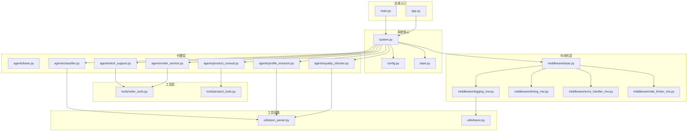
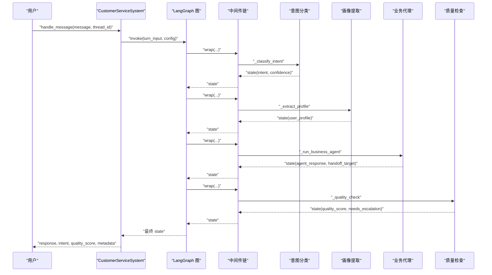
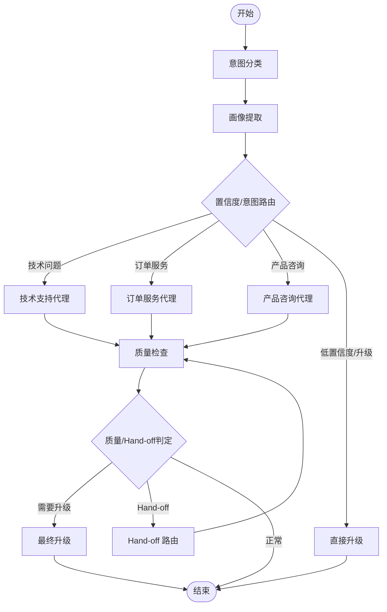
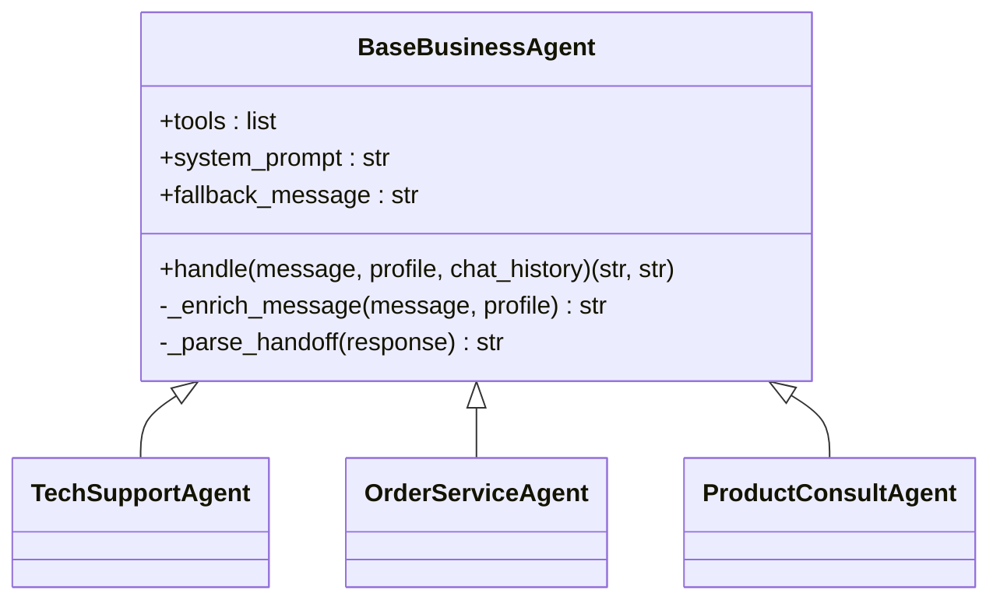
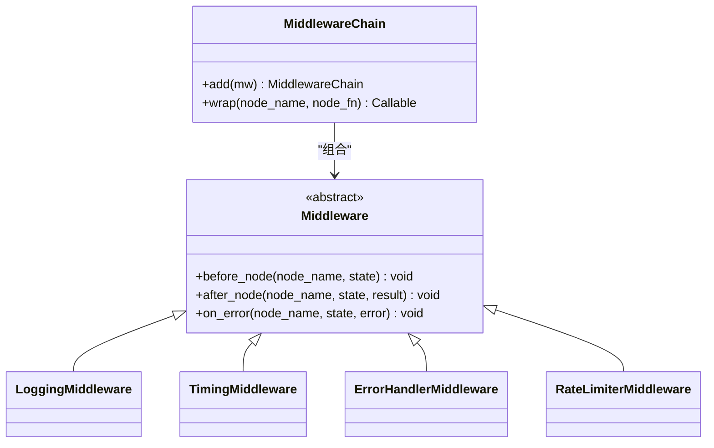
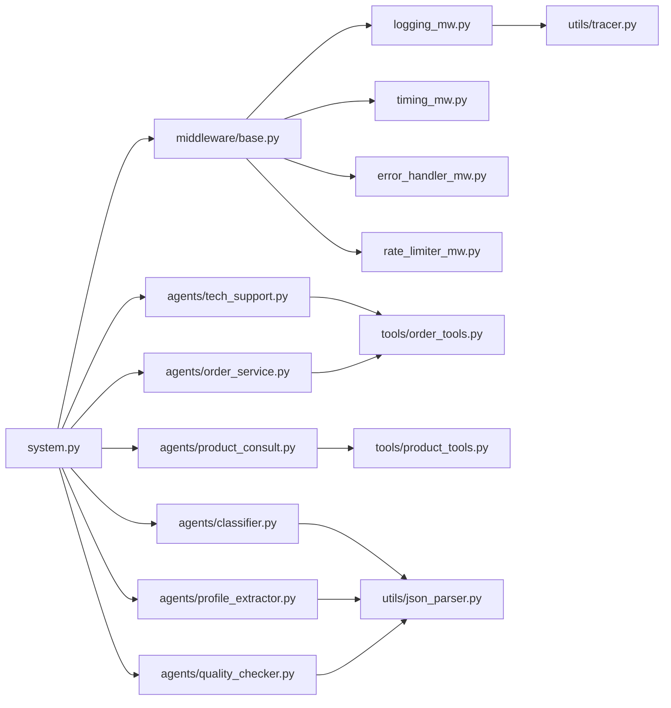

# 开发者指南

<cite>
**本文引用的文件**
- [README.md](file://README.md)
- [main.py](file://main.py)
- [app.py](file://app.py)
- [system.py](file://system.py)
- [config.py](file://config.py)
- [state.py](file://state.py)
- [agents/base.py](file://agents/base.py)
- [agents/classifier.py](file://agents/classifier.py)
- [agents/profile_extractor.py](file://agents/profile_extractor.py)
- [agents/quality_checker.py](file://agents/quality_checker.py)
- [agents/tech_support.py](file://agents/tech_support.py)
- [agents/order_service.py](file://agents/order_service.py)
- [agents/product_consult.py](file://agents/product_consult.py)
- [tools/order_tools.py](file://tools/order_tools.py)
- [tools/product_tools.py](file://tools/product_tools.py)
- [middleware/base.py](file://middleware/base.py)
- [middleware/logging_mw.py](file://middleware/logging_mw.py)
- [middleware/timing_mw.py](file://middleware/timing_mw.py)
- [middleware/error_handler_mw.py](file://middleware/error_handler_mw.py)
- [middleware/rate_limiter_mw.py](file://middleware/rate_limiter_mw.py)
- [utils/json_parser.py](file://utils/json_parser.py)
- [utils/tracer.py](file://utils/tracer.py)
</cite>

## 目录
1. [简介](#简介)
2. [项目结构](#项目结构)
3. [核心组件](#核心组件)
4. [架构总览](#架构总览)
5. [详细组件分析](#详细组件分析)
6. [依赖关系分析](#依赖关系分析)
7. [性能考虑](#性能考虑)
8. [调试与故障排除](#调试与故障排除)
9. [结论](#结论)
10. [附录](#附录)

## 简介
本指南面向希望扩展与二次开发该多智能体客服系统的工程师。文档围绕以下目标展开：
- 解释代码结构的设计原则与模块化组织方式
- 提供 Agent 扩展开发的完整流程（继承 BaseBusinessAgent 的实现步骤）
- 说明中间件开发的接口规范与实现要求
- 阐述工具函数开发的最佳实践与测试方法
- 提供调试技巧与性能优化建议
- 给出代码贡献指南与编码规范
- 解释系统的测试策略与质量保证措施
- 提供常见开发问题的解决方案与故障排除指南

## 项目结构
该项目采用“按职责分层 + 按功能分包”的组织方式：
- system.py：系统主类与 LangGraph 工作流编排
- agents/：业务代理层（意图分类、画像提取、质量检查、业务 Agent）
- tools/：LangChain 工具函数集合
- middleware/：中间件基础设施与具体中间件（日志、计时、异常、限流）
- utils/：通用工具（JSON 容错解析、调用链追踪）
- config.py/state.py：配置与状态模型
- main.py/app.py：命令行演示与 Web UI
- data/：数据层（mock 数据与数据库封装）

图表来源
- [system.py:1-305](file://system.py#L1-L305)
- [agents/base.py:1-123](file://agents/base.py#L1-L123)
- [tools/order_tools.py:1-50](file://tools/order_tools.py#L1-L50)
- [tools/product_tools.py:1-78](file://tools/product_tools.py#L1-L78)
- [middleware/base.py:1-94](file://middleware/base.py#L1-L94)
- [utils/json_parser.py:1-51](file://utils/json_parser.py#L1-L51)
- [utils/tracer.py:1-78](file://utils/tracer.py#L1-L78)

章节来源
- [README.md:81-108](file://README.md#L81-L108)
- [system.py:34-76](file://system.py#L34-L76)

## 核心组件
- 系统主类 CustomerServiceSystem：负责构建与编译 LangGraph 工作流，封装节点函数、路由逻辑与对外 API；集成中间件链与 Checkpointer。
- 状态模型 CustomerServiceState/UserProfile：定义工作流中节点间传递的数据结构，支持跨轮次累积。
- 配置中心 config：集中管理模型初始化、阈值常量、数据库路径与语言支持。
- 代理层：包含意图分类、画像提取、质量检查与三大业务代理；业务代理统一继承 BaseBusinessAgent，支持工具调用、画像注入与 Hand-off。
- 工具层：提供订单查询、物流跟踪、产品检索、推荐与 FAQ 查询等工具函数。
- 中间件层：提供日志、计时、异常捕获与限流能力，通过 MiddlewareChain 统一编排。
- 工具函数：JSON 容错解析与调用链追踪。

章节来源
- [system.py:34-305](file://system.py#L34-L305)
- [state.py:14-58](file://state.py#L14-L58)
- [config.py:14-60](file://config.py#L14-L60)
- [agents/base.py:23-123](file://agents/base.py#L23-L123)
- [tools/order_tools.py:15-50](file://tools/order_tools.py#L15-L50)
- [tools/product_tools.py:14-78](file://tools/product_tools.py#L14-L78)
- [middleware/base.py:14-94](file://middleware/base.py#L14-L94)
- [utils/json_parser.py:10-51](file://utils/json_parser.py#L10-L51)
- [utils/tracer.py:11-78](file://utils/tracer.py#L11-L78)

## 架构总览
系统采用 LangGraph 工作流编排，节点间通过共享状态 CustomerServiceState 传递数据。中间件链在节点执行前后注入横切关注点，Checkpointer 按 thread_id 持久化状态，实现跨轮次用户画像累积。

图表来源
- [system.py:79-147](file://system.py#L79-L147)
- [system.py:159-193](file://system.py#L159-L193)
- [system.py:250-299](file://system.py#L250-L299)
- [middleware/base.py:63-94](file://middleware/base.py#L63-L94)

## 详细组件分析

### 系统主类与工作流编排
- 节点函数：意图分类、画像提取、业务代理执行器、直接升级、质量检查、最终升级与 Hand-off 路由。
- 路由函数：根据置信度与意图进行条件路由；质量检查后决定是否升级或 Hand-off。
- 中间件链：日志 → 计时 → 异常捕获 → 限流，通过 MiddlewareChain.wrap 注入到各节点。
- Checkpointer：优先使用 SQLite，失败时回退内存存储，按 thread_id 恢复/保存状态。

图表来源
- [system.py:159-193](file://system.py#L159-L193)
- [system.py:196-246](file://system.py#L196-L246)

章节来源
- [system.py:34-305](file://system.py#L34-L305)

### 状态模型与画像累积
- 请求级字段：每轮重置（如 intent、quality_score、needs_escalation 等）
- 会话级字段：user_profile 跨轮次累积，通过 Checkpointer 持久化
- 画像合并策略：标量字段覆盖、列表字段去重合并

章节来源
- [state.py:14-58](file://state.py#L14-L58)
- [agents/profile_extractor.py:41-92](file://agents/profile_extractor.py#L41-L92)

### 代理基类与业务代理扩展
- BaseBusinessAgent：封装 create_agent、注入 user_profile、统一 handle 流程与 Hand-off 解析
- 业务代理（Tech/Order/Product）：仅需声明 tools、system_prompt、fallback，即可获得工具调用与个性化回复能力
- Hand-off 机制：业务代理回复中包含 [HANDOFF:agent_name] 标记时，系统将请求转发给目标代理

图表来源
- [agents/base.py:23-123](file://agents/base.py#L23-L123)
- [agents/tech_support.py](file://agents/tech_support.py)
- [agents/order_service.py](file://agents/order_service.py)
- [agents/product_consult.py](file://agents/product_consult.py)

章节来源
- [agents/base.py:23-123](file://agents/base.py#L23-L123)

### 工具函数开发最佳实践
- 工具签名：明确参数与返回值，返回字符串以便 LLM 消费
- 工具说明：通过 docstring 作为工具描述传递给 LLM，提升工具选择准确性
- 错误兜底：当未命中数据时返回明确的兜底信息，便于 LLM 生成自然回复
- 数据访问：工具内部调用 data.database 的封装函数，保持与数据层解耦

章节来源
- [tools/order_tools.py:15-50](file://tools/order_tools.py#L15-L50)
- [tools/product_tools.py:14-78](file://tools/product_tools.py#L14-L78)

### 中间件开发接口规范
- 抽象接口：Middleware 定义 before_node、after_node、on_error 三个钩子
- 编排器：MiddlewareChain.wrap 将节点函数包裹，按注册顺序依次执行钩子
- 日志中间件：记录节点执行摘要与 trace，支持 UI 展示
- 计时中间件：统计节点耗时并写入 metadata
- 异常中间件：对可恢复节点设置 fallback 回复与升级标志
- 限流中间件：令牌桶算法控制 LLM 节点调用速率

图表来源
- [middleware/base.py:14-94](file://middleware/base.py#L14-L94)
- [middleware/logging_mw.py:32-123](file://middleware/logging_mw.py#L32-L123)
- [middleware/timing_mw.py:13-55](file://middleware/timing_mw.py#L13-L55)
- [middleware/error_handler_mw.py:27-65](file://middleware/error_handler_mw.py#L27-L65)
- [middleware/rate_limiter_mw.py:60-94](file://middleware/rate_limiter_mw.py#L60-L94)

章节来源
- [middleware/base.py:14-94](file://middleware/base.py#L14-L94)

### 质量检查与升级策略
- 质量检查：评估相关性、完整性、专业性、有用性，综合评分决定是否升级
- 升级触发：质量评分低于阈值或质量检查标记需要升级
- 最终升级：保留原回复并附加人工提示

章节来源
- [agents/quality_checker.py:16-63](file://agents/quality_checker.py#L16-L63)
- [system.py:134-156](file://system.py#L134-L156)

### 意图分类与画像提取
- 意图分类：返回 intent、confidence、reason 与语言代码，失败时回退 escalate
- 画像提取：从消息中抽取预算、偏好、订单号、感兴趣产品与语言，合并到现有画像

章节来源
- [agents/classifier.py:19-63](file://agents/classifier.py#L19-L63)
- [agents/profile_extractor.py:17-92](file://agents/profile_extractor.py#L17-L92)

## 依赖关系分析
- 系统层依赖：system.py 依赖 agents/*、middleware/*、config、state
- 代理层依赖：业务代理依赖 BaseBusinessAgent、tools/*、config.model、state.UserProfile
- 工具层依赖：tools/* 依赖 data.database 封装
- 中间件层依赖：middleware/* 依赖 state.CustomerServiceState 与 utils.tracer
- 工具函数依赖：utils/* 为通用能力，被 agents 与 middleware 使用

图表来源
- [system.py:17-31](file://system.py#L17-L31)
- [agents/base.py:19-21](file://agents/base.py#L19-L21)
- [tools/order_tools.py:12-12](file://tools/order_tools.py#L12-L12)
- [tools/product_tools.py:7-11](file://tools/product_tools.py#L7-L11)
- [middleware/base.py:11-11](file://middleware/base.py#L11-L11)
- [utils/json_parser.py:10-10](file://utils/json_parser.py#L10-L10)
- [utils/tracer.py:11-11](file://utils/tracer.py#L11-L11)

章节来源
- [system.py:17-31](file://system.py#L17-L31)

## 性能考虑
- 限流控制：RateLimiterMiddleware 使用令牌桶算法限制 LLM 节点调用频率，避免 API 限速
- 节点耗时统计：TimingMiddleware 将各节点耗时写入 metadata，便于定位瓶颈
- 日志与追踪：LoggingMiddleware 输出结构化日志与 trace，辅助性能分析与问题定位
- 模型复用：config 中共享模型实例，减少重复初始化开销
- 持久化策略：优先 SQLite，失败回退内存存储，兼顾可靠性与性能

章节来源
- [middleware/rate_limiter_mw.py:60-94](file://middleware/rate_limiter_mw.py#L60-L94)
- [middleware/timing_mw.py:13-55](file://middleware/timing_mw.py#L13-L55)
- [middleware/logging_mw.py:32-123](file://middleware/logging_mw.py#L32-L123)
- [config.py:30-31](file://config.py#L30-L31)
- [system.py:66-75](file://system.py#L66-L75)

## 调试与故障排除
- 调试入口
  - 命令行演示：main.py 提供多轮对话、单轮测试与交互式对话
  - Web UI：app.py 提供可视化界面，展示用户画像、处理信息与调用链追踪
- 关键调试点
  - 中间件日志：查看节点执行摘要与 trace
  - 质量检查：确认评分与升级原因
  - Hand-off：检查回复中的 [HANDOFF:agent_name] 标记是否正确解析
  - JSON 容错：使用 utils.safe_parse_json 处理 LLM 返回的非标准 JSON
- 常见问题
  - API Key 未配置：检查 .env 文件与 DEEPSEEK_API_KEY
  - SQLite 初始化失败：系统会回退到 InMemorySaver，不影响功能
  - 节点异常：ErrorHandlerMiddleware 会设置 fallback 回复并标记升级

章节来源
- [main.py:130-148](file://main.py#L130-L148)
- [app.py:14-177](file://app.py#L14-L177)
- [middleware/error_handler_mw.py:27-65](file://middleware/error_handler_mw.py#L27-L65)
- [utils/json_parser.py:10-51](file://utils/json_parser.py#L10-L51)
- [config.py:20-26](file://config.py#L20-L26)
- [system.py:66-75](file://system.py#L66-L75)

## 结论
本系统通过清晰的分层与模块化设计，实现了意图分类、画像累积、质量检查与代理协作的闭环。借助 LangGraph 的工作流编排与中间件体系，系统具备良好的可扩展性与可观测性。开发者可基于 BaseBusinessAgent 快速扩展新的业务代理，通过工具函数增强 Agent 的能力，并通过中间件注入日志、计时、限流与异常处理等横切能力。

## 附录

### Agent 扩展开发流程（继承 BaseBusinessAgent）
- 步骤
  - 新建文件 agents/my_agent.py，定义类 MyAgent 继承 BaseBusinessAgent
  - 设置类属性：tools、system_prompt、fallback_message
  - 在 system.py 中注册 MyAgent 实例与路由映射
  - 在 LangGraph 中添加节点与边，或通过通用执行器 _run_business_agent 调用
- 注意事项
  - 保持 handle 返回 (response, handoff_target) 元组
  - 若需要 Hand-off，回复中包含 [HANDOFF:target] 标记
  - 将所需工具加入 tools 列表

章节来源
- [agents/base.py:23-123](file://agents/base.py#L23-L123)
- [system.py:43-56](file://system.py#L43-L56)
- [system.py:93-104](file://system.py#L93-L104)

### 中间件开发接口规范与实现要求
- 接口
  - before_node：节点执行前钩子
  - after_node：节点执行后钩子
  - on_error：节点异常钩子
- 实现要点
  - 在 wrap 中按顺序调用各中间件钩子
  - 异常捕获后设置兜底状态，确保后续节点可继续执行
  - 计时与日志中间件需写入 metadata，便于 UI 展示

章节来源
- [middleware/base.py:14-94](file://middleware/base.py#L14-L94)

### 工具函数开发最佳实践与测试方法
- 最佳实践
  - 明确参数与返回值类型，返回字符串
  - 在 docstring 中详述工具用途与参数
  - 未命中数据时返回明确兜底信息
  - 调用 data.database 的封装函数
- 测试方法
  - 单元测试：验证工具函数在不同输入下的返回值
  - 集成测试：在 Agent 中调用工具，验证 LLM 工具选择与参数传递
  - 场景测试：结合 main.py 的测试用例与 app.py 的 UI 交互

章节来源
- [tools/order_tools.py:15-50](file://tools/order_tools.py#L15-L50)
- [tools/product_tools.py:14-78](file://tools/product_tools.py#L14-L78)
- [main.py:12-104](file://main.py#L12-L104)
- [app.py:14-177](file://app.py#L14-L177)

### 调试技巧与性能优化建议
- 调试技巧
  - 使用 app.py 的 UI 查看用户画像、处理信息与调用链追踪
  - 通过 LoggingMiddleware 的日志定位问题节点
  - 使用 utils.safe_parse_json 处理 JSON 解析异常
- 性能优化
  - 启用 RateLimiterMiddleware 控制 LLM 调用频率
  - 使用 TimingMiddleware 识别耗时节点
  - 共享模型实例，避免重复初始化

章节来源
- [app.py:71-123](file://app.py#L71-L123)
- [middleware/logging_mw.py:32-123](file://middleware/logging_mw.py#L32-L123)
- [utils/json_parser.py:10-51](file://utils/json_parser.py#L10-L51)
- [middleware/rate_limiter_mw.py:60-94](file://middleware/rate_limiter_mw.py#L60-L94)
- [middleware/timing_mw.py:13-55](file://middleware/timing_mw.py#L13-L55)
- [config.py:30-31](file://config.py#L30-L31)

### 代码贡献指南与编码规范
- 分层与职责
  - agents/*：业务逻辑与工具调用
  - tools/*：可复用工具函数
  - middleware/*：横切关注点
  - utils/*：通用工具
  - system.py：工作流编排与对外 API
- 命名与注释
  - 类名使用 PascalCase，函数名使用 snake_case
  - 为工具函数提供清晰的 docstring
  - 为中间件与代理提供必要的注释与说明
- 提交流程
  - 新功能在独立分支开发，提交前运行本地测试
  - 更新 README.md 中的扩展方向与变更说明
  - 通过 Pull Request 进行代码评审

章节来源
- [README.md:150-157](file://README.md#L150-L157)

### 测试策略与质量保证
- 单元测试
  - 工具函数：验证不同输入与边界条件
  - JSON 解析：验证容错能力
- 集成测试
  - 代理与工具：验证工具调用与回复生成
  - 中间件：验证日志、计时、异常与限流行为
- 端到端测试
  - main.py 的测试用例：覆盖多轮对话与交互式会话
  - app.py 的 UI 交互：验证用户画像与追踪展示

章节来源
- [main.py:12-104](file://main.py#L12-L104)
- [app.py:14-177](file://app.py#L14-L177)
- [utils/json_parser.py:10-51](file://utils/json_parser.py#L10-L51)