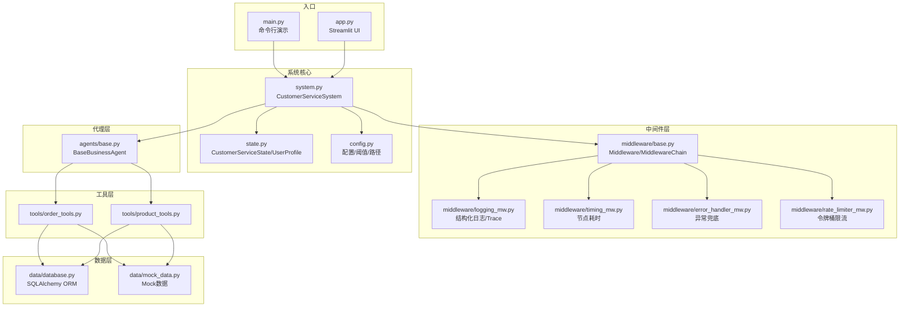
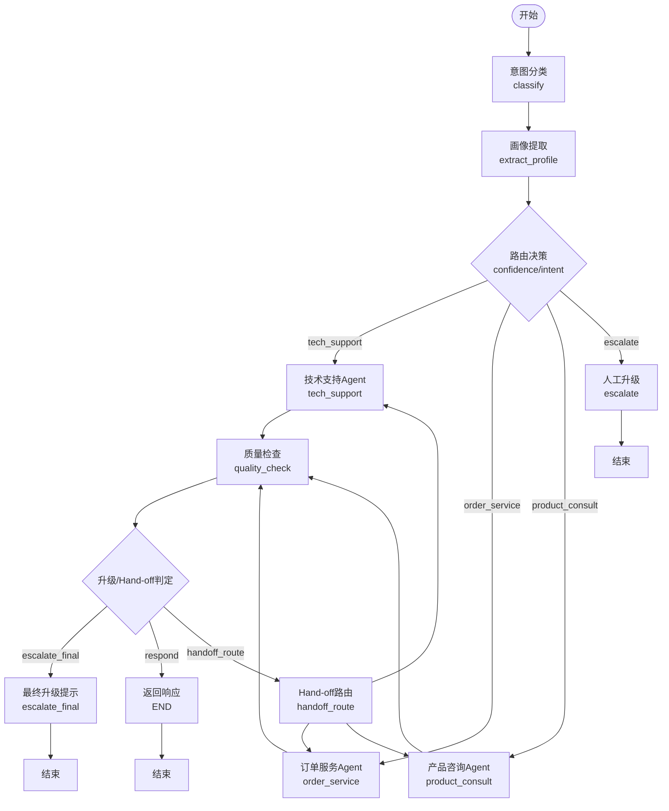
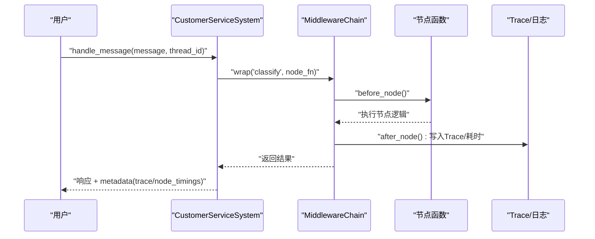
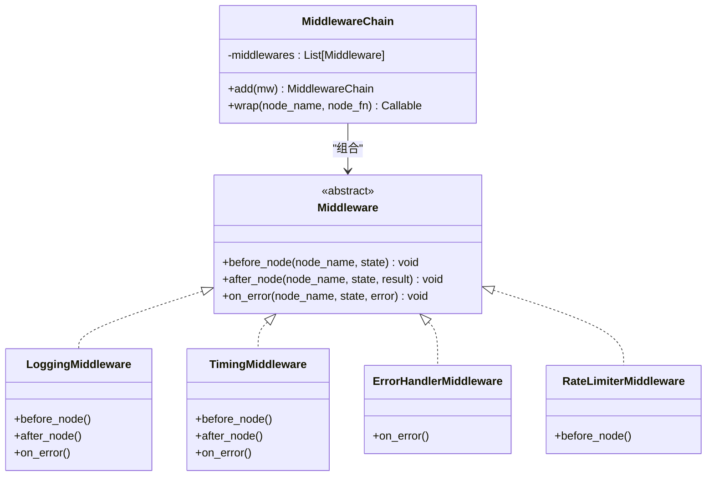
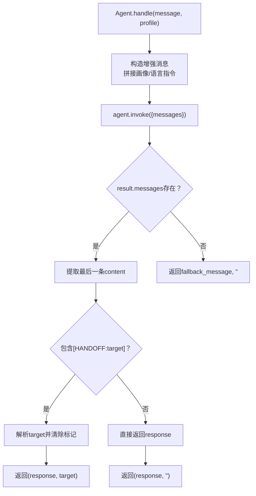
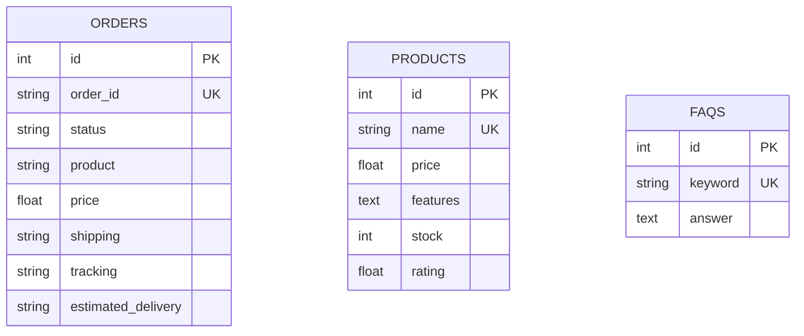
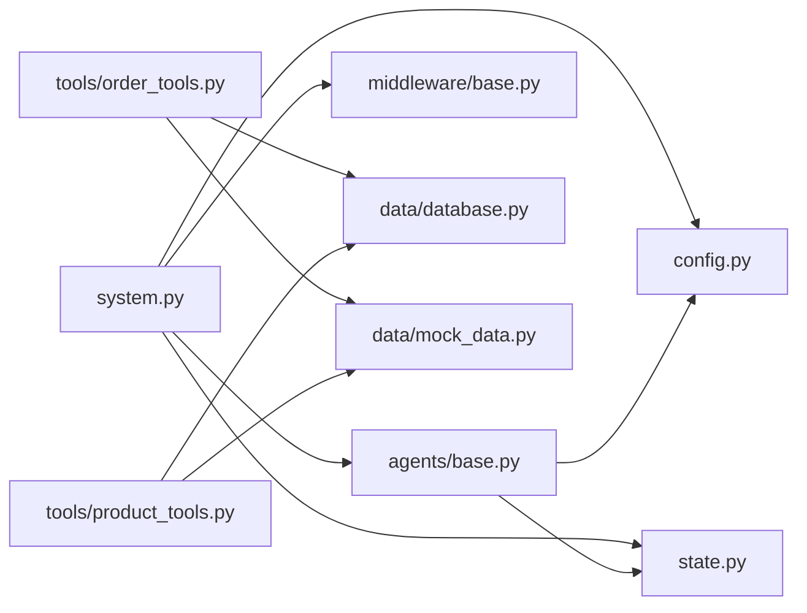

# 调试与测试

<cite>
**本文引用的文件**
- [README.md](file://README.md)
- [main.py](file://main.py)
- [app.py](file://app.py)
- [system.py](file://system.py)
- [state.py](file://state.py)
- [config.py](file://config.py)
- [middleware/base.py](file://middleware/base.py)
- [middleware/logging_mw.py](file://middleware/logging_mw.py)
- [middleware/timing_mw.py](file://middleware/timing_mw.py)
- [middleware/error_handler_mw.py](file://middleware/error_handler_mw.py)
- [middleware/rate_limiter_mw.py](file://middleware/rate_limiter_mw.py)
- [utils/tracer.py](file://utils/tracer.py)
- [agents/base.py](file://agents/base.py)
- [tools/order_tools.py](file://tools/order_tools.py)
- [tools/product_tools.py](file://tools/product_tools.py)
- [data/database.py](file://data/database.py)
- [data/mock_data.py](file://data/mock_data.py)
</cite>

## 目录
1. [简介](#简介)
2. [项目结构](#项目结构)
3. [核心组件](#核心组件)
4. [架构总览](#架构总览)
5. [详细组件分析](#详细组件分析)
6. [依赖关系分析](#依赖关系分析)
7. [性能考量](#性能考量)
8. [故障排查指南](#故障排查指南)
9. [结论](#结论)
10. [附录](#附录)

## 简介
本指南面向多Agent智能客服系统的调试与测试实践，围绕以下目标展开：
- 多Agent系统的调试策略与工具使用
- 状态追踪与调用链分析的实现原理与使用
- 单元测试与集成测试的编写方法
- Mock对象与测试数据准备
- 性能测试与压力测试实施步骤
- 日志分析与错误排查
- 常见问题诊断流程与解决方案
- 测试覆盖率评估与持续集成配置思路
- 生产环境监控与告警机制

## 项目结构
该项目采用“工作流编排 + 中间件 + 代理层 + 工具层 + 数据层”的分层架构，核心入口包括命令行演示与Streamlit Web UI，系统通过LangGraph进行节点编排，并借助中间件实现日志、计时、异常捕获与限流。

图表来源
- [system.py:1-305](file://system.py#L1-L305)
- [middleware/base.py:1-94](file://middleware/base.py#L1-L94)
- [middleware/logging_mw.py:1-123](file://middleware/logging_mw.py#L1-L123)
- [middleware/timing_mw.py:1-55](file://middleware/timing_mw.py#L1-L55)
- [middleware/error_handler_mw.py:1-65](file://middleware/error_handler_mw.py#L1-L65)
- [middleware/rate_limiter_mw.py:1-94](file://middleware/rate_limiter_mw.py#L1-L94)
- [agents/base.py:1-123](file://agents/base.py#L1-L123)
- [tools/order_tools.py:1-50](file://tools/order_tools.py#L1-L50)
- [tools/product_tools.py:1-78](file://tools/product_tools.py#L1-L78)
- [data/database.py:1-161](file://data/database.py#L1-L161)
- [data/mock_data.py:1-67](file://data/mock_data.py#L1-L67)

章节来源
- [README.md:95-133](file://README.md#L95-L133)
- [system.py:196-246](file://system.py#L196-L246)

## 核心组件
- CustomerServiceSystem：系统主控制器，负责构建LangGraph工作流、集成中间件、编排节点与路由、对外提供消息处理与画像查询接口。
- CustomerServiceState/UserProfile：LangGraph状态载体，定义请求级与会话级字段，支撑跨轮次画像累积。
- 中间件链：统一注入日志、计时、异常捕获、限流等横切关注点，通过MiddlewareChain.wrap包裹节点函数。
- 业务代理基类：封装LLM+工具的Agent，支持Hand-off标记与多语言回复。
- 工具层：订单查询、物流跟踪、产品检索、推荐、FAQ检索等，统一以@tool装饰器暴露给Agent。
- 数据层：SQLAlchemy ORM封装SQLite业务数据库，替代演示阶段的Mock数据。

章节来源
- [system.py:34-305](file://system.py#L34-L305)
- [state.py:28-58](file://state.py#L28-L58)
- [middleware/base.py:46-94](file://middleware/base.py#L46-L94)
- [agents/base.py:23-123](file://agents/base.py#L23-L123)
- [tools/order_tools.py:15-50](file://tools/order_tools.py#L15-L50)
- [tools/product_tools.py:14-78](file://tools/product_tools.py#L14-L78)
- [data/database.py:25-161](file://data/database.py#L25-L161)

## 架构总览
系统通过LangGraph构建状态驱动的工作流，节点间通过状态传递实现意图分类、画像提取、业务Agent处理、质量检查、升级与Hand-off路由。中间件在节点执行前后注入横切逻辑，工具层提供真实数据库查询能力。

图表来源
- [system.py:196-246](file://system.py#L196-L246)
- [system.py:159-183](file://system.py#L159-L183)

## 详细组件分析

### 状态追踪与调用链分析
- Trace记录：中间件在节点执行前后写入Trace条目，包含节点名、起止时间、耗时、状态与摘要；UI侧通过工具函数格式化展示。
- 节点耗时：TimingMiddleware将各节点耗时写入metadata.node_timings，便于性能分析。
- 日志与摘要：LoggingMiddleware在after/on_error阶段提取节点摘要并写入Trace，同时输出结构化日志。

图表来源
- [system.py:250-298](file://system.py#L250-L298)
- [middleware/base.py:63-93](file://middleware/base.py#L63-L93)
- [middleware/logging_mw.py:39-106](file://middleware/logging_mw.py#L39-L106)
- [middleware/timing_mw.py:20-55](file://middleware/timing_mw.py#L20-L55)
- [utils/tracer.py:11-78](file://utils/tracer.py#L11-L78)

章节来源
- [utils/tracer.py:32-78](file://utils/tracer.py#L32-L78)
- [middleware/logging_mw.py:32-123](file://middleware/logging_mw.py#L32-L123)
- [middleware/timing_mw.py:13-55](file://middleware/timing_mw.py#L13-L55)

### 中间件链与错误兜底
- 中间件链：按注册顺序依次执行before/after/on_error钩子，支持对LLM节点进行令牌桶限流。
- 异常兜底：ErrorHandlerMiddleware对可恢复节点在on_error阶段设置fallback回复与升级标志，避免工作流中断。

图表来源
- [middleware/base.py:14-94](file://middleware/base.py#L14-L94)
- [middleware/logging_mw.py:32-106](file://middleware/logging_mw.py#L32-L106)
- [middleware/timing_mw.py:13-55](file://middleware/timing_mw.py#L13-L55)
- [middleware/error_handler_mw.py:27-65](file://middleware/error_handler_mw.py#L27-L65)
- [middleware/rate_limiter_mw.py:60-94](file://middleware/rate_limiter_mw.py#L60-L94)

章节来源
- [middleware/base.py:46-94](file://middleware/base.py#L46-L94)
- [middleware/error_handler_mw.py:27-65](file://middleware/error_handler_mw.py#L27-L65)
- [middleware/rate_limiter_mw.py:60-94](file://middleware/rate_limiter_mw.py#L60-L94)

### 业务代理与Hand-off协作
- 基类逻辑：统一创建Agent、注入用户画像、提取最终回复、解析Hand-off标记。
- Hand-off机制：当Agent回复包含合法标记且未超过最大次数时，系统将请求转发给目标Agent并重新进入质量检查。

图表来源
- [agents/base.py:41-114](file://agents/base.py#L41-L114)
- [system.py:185-193](file://system.py#L185-L193)

章节来源
- [agents/base.py:23-123](file://agents/base.py#L23-L123)
- [system.py:93-104](file://system.py#L93-L104)

### 工具层与数据层
- 工具层：通过@tool装饰器暴露查询接口，内部调用SQLAlchemy ORM或Mock数据（演示阶段）。
- 数据层：SQLAlchemy定义订单、产品、FAQ三张表，提供查询函数；config中定义业务数据库路径。

图表来源
- [data/database.py:25-83](file://data/database.py#L25-L83)

章节来源
- [tools/order_tools.py:15-50](file://tools/order_tools.py#L15-L50)
- [tools/product_tools.py:14-78](file://tools/product_tools.py#L14-L78)
- [data/database.py:104-161](file://data/database.py#L104-L161)
- [data/mock_data.py:7-67](file://data/mock_data.py#L7-L67)

## 依赖关系分析
- 系统层依赖：system.py依赖agents、middleware、state、config；通过MiddlewareChain.wrap将中间件注入节点。
- 代理层依赖：agents/base.py依赖config.model与state.UserProfile，统一Agent创建与Hand-off解析。
- 工具层依赖：tools/*依赖data/database.py（生产）或data/mock_data.py（演示）。
- 数据层依赖：SQLAlchemy与SQLite路径由config提供。

图表来源
- [system.py:17-31](file://system.py#L17-L31)
- [agents/base.py:19-39](file://agents/base.py#L19-L39)
- [tools/order_tools.py:12-28](file://tools/order_tools.py#L12-L28)
- [tools/product_tools.py:7-77](file://tools/product_tools.py#L7-L77)
- [data/database.py:18-88](file://data/database.py#L18-L88)

章节来源
- [system.py:17-31](file://system.py#L17-L31)
- [agents/base.py:19-39](file://agents/base.py#L19-L39)

## 性能考量
- 节点耗时统计：TimingMiddleware将各节点耗时写入metadata.node_timings，便于热点定位与优化。
- 限流策略：RateLimiterMiddleware对包含LLM调用的节点使用令牌桶限流，避免API速率超限。
- Trace聚合：LoggingMiddleware在after/on_error阶段写入Trace，结合UI展示节点耗时与状态，辅助性能分析。
- 持久化Checkpointer：SqliteSaver提升跨轮次状态恢复效率，减少重复计算。

章节来源
- [middleware/timing_mw.py:13-55](file://middleware/timing_mw.py#L13-L55)
- [middleware/rate_limiter_mw.py:60-94](file://middleware/rate_limiter_mw.py#L60-L94)
- [middleware/logging_mw.py:39-106](file://middleware/logging_mw.py#L39-L106)
- [system.py:66-75](file://system.py#L66-L75)

## 故障排查指南
- 日志定位：通过结构化日志与Trace条目快速定位节点执行状态与耗时，异常时on_error会写入错误摘要。
- 异常兜底：ErrorHandlerMiddleware对可恢复节点设置fallback回复与升级标志，避免工作流中断。
- UI辅助：Streamlit侧边栏展示节点耗时与Trace列表，便于前端直观排查。
- 常见问题：
  - 节点异常：检查对应节点日志与Trace，确认是否触发异常兜底与升级。
  - 超时/限流：确认RateLimiterMiddleware是否生效，适当调整速率与容量。
  - Hand-off循环：系统限制最大Hand-off次数，检查Agent回复中的标记是否合法。

章节来源
- [middleware/logging_mw.py:39-106](file://middleware/logging_mw.py#L39-L106)
- [middleware/error_handler_mw.py:46-65](file://middleware/error_handler_mw.py#L46-L65)
- [app.py:110-123](file://app.py#L110-L123)
- [system.py:37-38](file://system.py#L37-L38)

## 结论
本项目通过LangGraph实现清晰的状态驱动工作流，配合中间件链实现可观测性与稳定性保障。通过Trace与节点耗时，可高效定位性能瓶颈与异常；通过Hand-off与质量检查，确保复杂业务场景下的协作与服务质量。建议在后续迭代中完善单元/集成测试覆盖与CI配置，持续提升系统可靠性与可维护性。

## 附录

### 调试策略与工具使用
- 命令行调试：使用main.py提供的多轮对话与单轮测试用例，观察状态字段变化与Trace输出。
- Web UI调试：通过app.py查看节点耗时、Trace列表与用户画像，便于交互式验证。
- 状态检查：使用system.get_profile(thread_id)查看跨轮次画像累积情况。
- 环境变量：确保DEEPSEEK_API_KEY正确配置，否则初始化将报错。

章节来源
- [main.py:70-104](file://main.py#L70-L104)
- [app.py:71-123](file://app.py#L71-L123)
- [system.py:300-305](file://system.py#L300-L305)
- [config.py:20-27](file://config.py#L20-L27)

### 单元测试与集成测试编写方法
- 单元测试建议：
  - 测试节点函数：对system.py中的节点函数（如分类、画像提取、质量检查）进行输入/输出断言，覆盖正常与异常分支。
  - 测试中间件：对LoggingMiddleware/TimingMiddleware/Error Handler/Ratelimiter的行为进行断言，确保日志、耗时、异常与限流逻辑符合预期。
  - 测试工具层：对order_tools与product_tools的返回值进行断言，必要时使用Mock数据库或内存数据库。
- 集成测试建议：
  - 端到端工作流：构造多轮对话，验证意图分类、画像累积、Agent处理、质量检查、Hand-off与升级的完整链路。
  - 并发与限流：模拟高并发请求，验证RateLimiterMiddleware的令牌桶行为与Fallback机制。
  - Trace与性能：断言Trace条目数量、耗时分布与节点状态，评估性能回归。

章节来源
- [system.py:79-147](file://system.py#L79-L147)
- [middleware/logging_mw.py:32-123](file://middleware/logging_mw.py#L32-L123)
- [middleware/timing_mw.py:13-55](file://middleware/timing_mw.py#L13-L55)
- [middleware/error_handler_mw.py:27-65](file://middleware/error_handler_mw.py#L27-L65)
- [middleware/rate_limiter_mw.py:60-94](file://middleware/rate_limiter_mw.py#L60-L94)
- [tools/order_tools.py:15-50](file://tools/order_tools.py#L15-L50)
- [tools/product_tools.py:14-78](file://tools/product_tools.py#L14-L78)

### Mock对象与测试数据准备
- Mock数据：使用data/mock_data.py提供订单、产品与FAQ的硬编码数据，便于快速搭建测试环境。
- 数据库替换：生产环境使用data/database.py的SQLAlchemy ORM，测试时可用SQLite内存数据库或独立测试库。
- 工具层隔离：通过@tool装饰器与依赖注入，可在测试中替换底层数据源，确保测试可重复性。

章节来源
- [data/mock_data.py:1-67](file://data/mock_data.py#L1-L67)
- [data/database.py:87-99](file://data/database.py#L87-L99)

### 性能测试与压力测试实施步骤
- 基准测试：使用main.py的多轮对话与单轮用例，记录平均耗时与标准差，建立基线。
- 压力测试：模拟多线程/多进程并发调用system.handle_message，观察Trace与节点耗时分布，定位瓶颈。
- 限流验证：逐步提高并发，验证RateLimiterMiddleware的令牌桶行为与超时保护。
- 资源监控：结合TimingMiddleware与UI节点耗时，评估CPU、内存与数据库查询开销。

章节来源
- [main.py:70-104](file://main.py#L70-L104)
- [middleware/timing_mw.py:20-55](file://middleware/timing_mw.py#L20-L55)
- [middleware/rate_limiter_mw.py:39-78](file://middleware/rate_limiter_mw.py#L39-L78)

### 日志分析与错误排查
- 日志结构：LoggingMiddleware输出节点名、摘要与错误信息，Trace记录起止时间与状态，便于回溯。
- 错误排查：优先查看on_error阶段的Trace条目，确认异常类型与堆栈；检查ErrorHandlerMiddleware是否触发fallback与升级。
- UI辅助：通过app.py侧边栏的Trace与节点耗时，快速定位异常节点与耗时异常的环节。

章节来源
- [middleware/logging_mw.py:39-106](file://middleware/logging_mw.py#L39-L106)
- [middleware/error_handler_mw.py:46-65](file://middleware/error_handler_mw.py#L46-L65)
- [app.py:110-123](file://app.py#L110-L123)

### 常见问题诊断流程与解决方案
- 问题：节点频繁异常
  - 诊断：查看Trace中status为error的条目，定位异常节点与错误类型。
  - 解决：在ErrorHandlerMiddleware中设置fallback回复，必要时增加重试或降级策略。
- 问题：响应缓慢
  - 诊断：检查metadata.node_timings与Trace耗时，识别慢节点。
  - 解决：优化慢节点逻辑（如缓存、批量查询），或调整限流参数。
- 问题：Hand-off循环
  - 诊断：检查handoff_count与handoff_target，确认是否超过最大次数。
  - 解决：修正Agent回复中的Hand-off标记，避免非法目标。

章节来源
- [system.py:171-193](file://system.py#L171-L193)
- [middleware/error_handler_mw.py:59-65](file://middleware/error_handler_mw.py#L59-L65)

### 测试覆盖率评估与持续集成配置
- 覆盖率评估：建议使用pytest与coverage.py统计单元测试与集成测试的行/分支覆盖率，重点关注节点函数、中间件与工具层。
- CI配置：在GitHub Actions或GitLab CI中配置Python环境、安装依赖、运行测试与覆盖率报告，失败即阻断合并。
- 建议流水线：
  - 安装依赖
  - 初始化数据库与种子数据
  - 运行pytest（含--cov）
  - 上传覆盖率报告
  - 生成测试报告并归档

章节来源
- [README.md:192-192](file://README.md#L192-L192)

### 生产环境监控与告警机制
- 观测性指标：
  - Trace总量与错误率
  - 各节点平均耗时与P95/P99
  - Hand-off次数与成功率
  - 限流触发次数与等待时长
- 告警策略：
  - Trace错误率超过阈值
  - 节点平均耗时超过阈值
  - 限流等待超时比例上升
- 可视化：在UI中展示Trace与节点耗时，结合外部监控平台（如Prometheus/Grafana）进行仪表盘展示。

章节来源
- [utils/tracer.py:32-78](file://utils/tracer.py#L32-L78)
- [middleware/logging_mw.py:39-106](file://middleware/logging_mw.py#L39-L106)
- [middleware/timing_mw.py:20-55](file://middleware/timing_mw.py#L20-L55)
- [middleware/rate_limiter_mw.py:39-78](file://middleware/rate_limiter_mw.py#L39-L78)