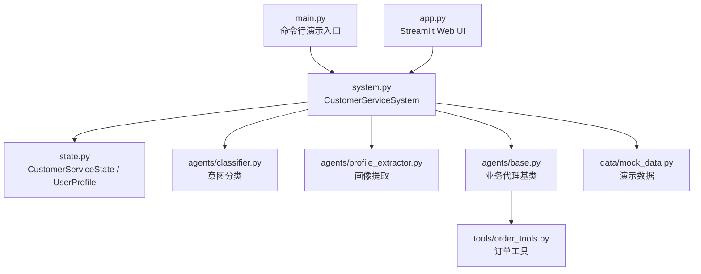
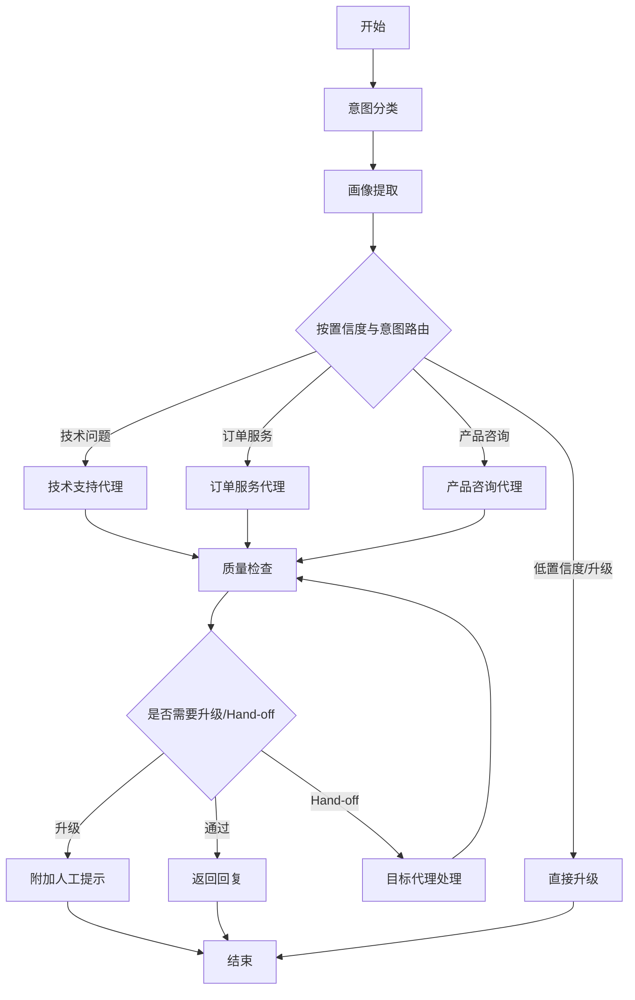
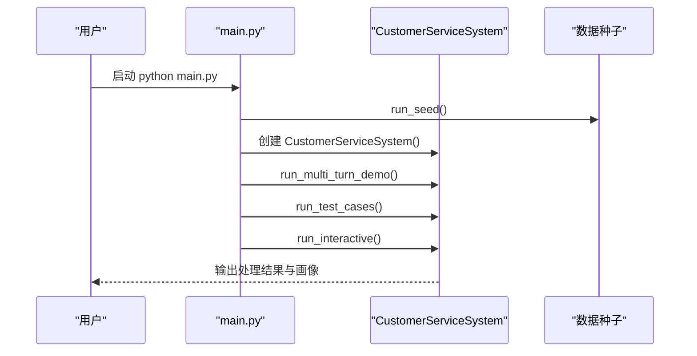
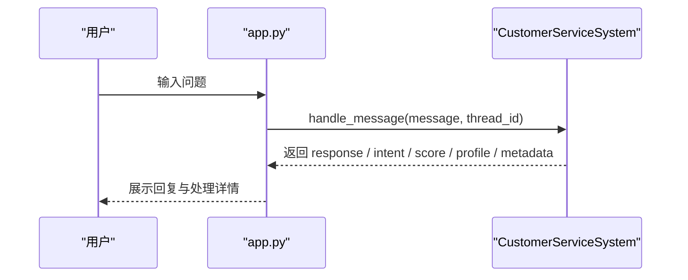
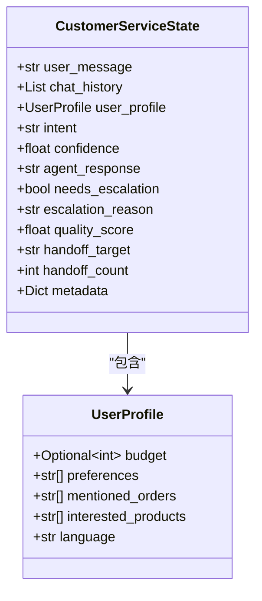
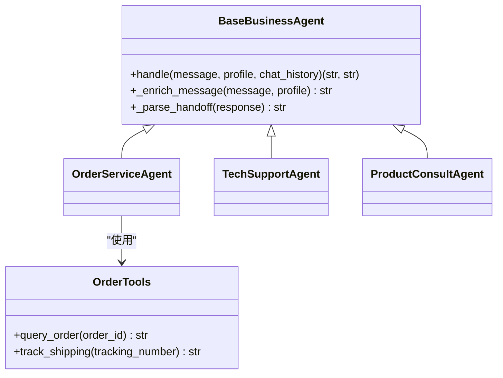
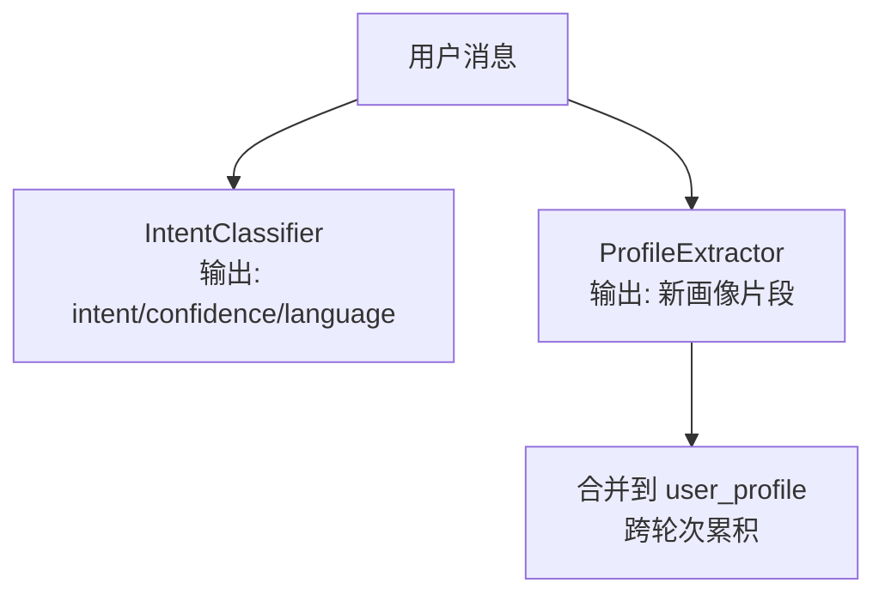
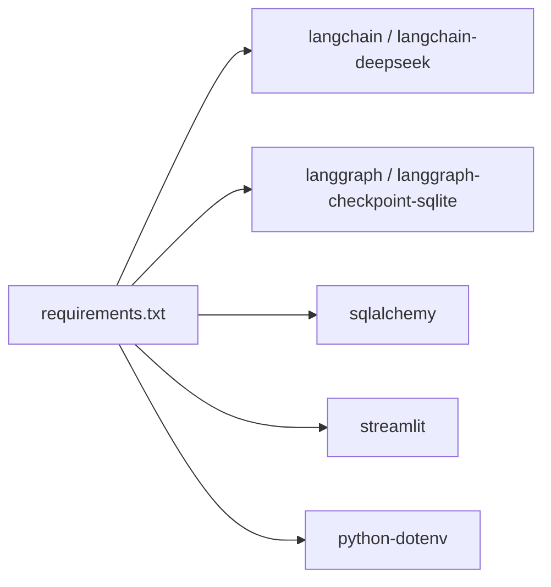

# 快速开始

<cite>
**本文引用的文件**
- [README.md](file://README.md)
- [requirements.txt](file://requirements.txt)
- [config.py](file://config.py)
- [main.py](file://main.py)
- [app.py](file://app.py)
- [system.py](file://system.py)
- [state.py](file://state.py)
- [agents/base.py](file://agents/base.py)
- [agents/classifier.py](file://agents/classifier.py)
- [agents/profile_extractor.py](file://agents/profile_extractor.py)
- [tools/order_tools.py](file://tools/order_tools.py)
- [.gitignore](file://.gitignore)
- [data/mock_data.py](file://data/mock_data.py)
</cite>

## 目录
1. [简介](#简介)
2. [项目结构](#项目结构)
3. [核心组件](#核心组件)
4. [架构总览](#架构总览)
5. [详细组件分析](#详细组件分析)
6. [依赖关系分析](#依赖关系分析)
7. [性能考虑](#性能考虑)
8. [故障排查指南](#故障排查指南)
9. [结论](#结论)
10. [附录](#附录)

## 简介
本指南面向初学者与进阶用户，帮助你在本地快速搭建并运行“多智能体智能客服系统”。该系统基于 LangChain 1.0 与 LangGraph，具备意图分类、动态路由、工具调用、质量检查与跨轮次用户画像累积能力。你将学会：
- 环境准备与依赖安装
- 虚拟环境创建与激活
- 环境变量配置
- 系统启动与基本使用
- 常见问题排查
- 快速体验核心功能

## 项目结构
项目采用按职责分层的组织方式：入口脚本、系统编排、代理层、工具层、数据层与工具函数。核心文件如下：
- 入口与演示：main.py、app.py
- 系统编排：system.py、state.py
- 代理层：agents/（基础基类与各业务代理）
- 工具层：tools/（可被 Agent 调用的工具）
- 数据层：data/（演示用的 mock 数据）
- 配置与依赖：config.py、requirements.txt
- 文档与忽略项：README.md、.gitignore

图表来源
- [main.py:1-148](file://main.py#L1-L148)
- [app.py:1-177](file://app.py#L1-L177)
- [system.py:1-305](file://system.py#L1-L305)
- [state.py:1-58](file://state.py#L1-L58)
- [agents/classifier.py:1-63](file://agents/classifier.py#L1-L63)
- [agents/profile_extractor.py:1-92](file://agents/profile_extractor.py#L1-L92)
- [agents/base.py:1-123](file://agents/base.py#L1-L123)
- [tools/order_tools.py:1-50](file://tools/order_tools.py#L1-L50)
- [data/mock_data.py:1-67](file://data/mock_data.py#L1-L67)

章节来源
- [README.md:81-108](file://README.md#L81-L108)

## 核心组件
- CustomerServiceSystem：系统主控制器，负责构建 LangGraph 工作流、注册节点与中间件、执行消息处理与状态持久化。
- CustomerServiceState / UserProfile：状态定义，承载每轮请求级字段与跨轮次画像字段。
- 业务代理（BaseBusinessAgent 及其子类）：封装 LLM + 工具，支持 Hand-off 与画像注入。
- 工具（@tool 函数）：如订单查询、物流跟踪等，供 Agent 调用。
- 配置中心（config.py）：加载环境变量、初始化模型、设定阈值与持久化路径。

章节来源
- [system.py:34-305](file://system.py#L34-L305)
- [state.py:14-58](file://state.py#L14-L58)
- [agents/base.py:23-123](file://agents/base.py#L23-L123)
- [tools/order_tools.py:15-50](file://tools/order_tools.py#L15-L50)
- [config.py:14-60](file://config.py#L14-L60)

## 架构总览
系统采用 LangGraph 的状态驱动工作流，按轮次处理用户消息，通过“意图分类 → 画像提取 → 业务代理 → 质量检查”的流水线进行路由与决策。质量检查失败或代理请求 Hand-off 时，系统可选择升级或二次路由。

图表来源
- [system.py:157-246](file://system.py#L157-L246)
- [agents/classifier.py:40-63](file://agents/classifier.py#L40-L63)
- [agents/profile_extractor.py:41-92](file://agents/profile_extractor.py#L41-L92)

## 详细组件分析

### 系统启动与演示（命令行）
- 克隆仓库后，建议创建并激活虚拟环境，再安装依赖。
- 配置环境变量 .env（复制示例并填入 DeepSeek API Key）。
- 运行命令行演示入口，系统会自动初始化数据库与种子数据，随后依次执行多轮画像演示、单轮测试用例与交互式对话。

图表来源
- [main.py:130-148](file://main.py#L130-L148)
- [system.py:250-305](file://system.py#L250-L305)

章节来源
- [README.md:47-79](file://README.md#L47-L79)
- [main.py:12-148](file://main.py#L12-L148)

### Web UI 启动（Streamlit）
- 通过 streamlit run app.py 启动 Web UI。
- 侧边栏支持切换 thread_id、新建会话、查看用户画像与最近处理元信息。
- 主聊天区支持输入问题、查看系统回复与处理详情（意图、置信度、质量评分、升级标记、节点耗时与调用链追踪）。

图表来源
- [app.py:14-177](file://app.py#L14-L177)
- [system.py:250-305](file://system.py#L250-L305)

章节来源
- [app.py:1-177](file://app.py#L1-L177)

### 状态与画像累积
- CustomerServiceState 定义每轮请求级字段（如 intent、confidence、agent_response、quality_score 等）与跨轮次字段（user_profile）。
- UserProfile 支持预算、偏好、提及订单、感兴趣产品、语言等字段，系统在每轮将新提取信息与旧画像合并，实现跨轮次累积。

图表来源
- [state.py:28-58](file://state.py#L28-L58)
- [state.py:14-26](file://state.py#L14-L26)

章节来源
- [state.py:1-58](file://state.py#L1-L58)

### 代理与工具调用
- BaseBusinessAgent 封装 LLM + 工具，统一处理消息增强（注入 user_profile）、调用 Agent、解析 Hand-off 标记与回退消息。
- 各业务代理（技术支持、订单服务、产品咨询）继承基类，仅需定义 tools、system_prompt 与 fallback。
- 工具（如订单查询、物流跟踪）通过 @tool 装饰，供 Agent 在链路中调用。

图表来源
- [agents/base.py:23-123](file://agents/base.py#L23-L123)
- [tools/order_tools.py:15-50](file://tools/order_tools.py#L15-L50)

章节来源
- [agents/base.py:1-123](file://agents/base.py#L1-L123)
- [tools/order_tools.py:1-50](file://tools/order_tools.py#L1-L50)

### 意图分类与画像提取
- IntentClassifier 使用 LCEL 管道（prompt | llm | parser）输出意图与置信度，并包含语言识别。
- ProfileExtractor 使用 LCEL 管道提取预算、偏好、订单号、感兴趣产品与语言，并与现有画像合并。

图表来源
- [agents/classifier.py:40-63](file://agents/classifier.py#L40-L63)
- [agents/profile_extractor.py:41-92](file://agents/profile_extractor.py#L41-L92)

章节来源
- [agents/classifier.py:1-63](file://agents/classifier.py#L1-L63)
- [agents/profile_extractor.py:1-92](file://agents/profile_extractor.py#L1-L92)

## 依赖关系分析
- 语言模型与工作流：langchain、langchain-deepseek、langgraph、langgraph-checkpoint-sqlite
- 数据库与 Web UI：sqlalchemy、streamlit
- 环境变量：python-dotenv
- 依赖安装与版本约束详见 requirements.txt

图表来源
- [requirements.txt:1-15](file://requirements.txt#L1-L15)

章节来源
- [requirements.txt:1-15](file://requirements.txt#L1-L15)

## 性能考虑
- 模型实例复用：config.py 中初始化全局模型实例，避免重复创建。
- 持久化策略：优先使用 SQLite Checkpointer，失败时回退到内存保存；生产建议使用稳定的持久化存储。
- 中间件链：日志、计时、异常捕获、限流按序执行，有助于定位性能瓶颈与错误。
- 代理 Hand-off：限制最大 Hand-off 次数，防止无限循环与资源浪费。

章节来源
- [config.py:30-31](file://config.py#L30-L31)
- [system.py:66-75](file://system.py#L66-L75)
- [system.py:37-38](file://system.py#L37-L38)

## 故障排查指南
- 未设置有效 API Key
  - 现象：启动时报错，提示未设置 DEEPSEEK_API_KEY。
  - 处理：复制 .env.example 为 .env，填入有效 API Key。
  - 参考：[config.py:20-26](file://config.py#L20-L26)，[README.md:67-73](file://README.md#L67-L73)
- 依赖安装失败
  - 现象：pip 安装报错或模块导入失败。
  - 处理：确认 Python 版本满足要求；在虚拟环境中安装；检查网络与镜像源。
  - 参考：[requirements.txt:1-15](file://requirements.txt#L1-L15)
- SQLite 初始化失败
  - 现象：SqliteSaver 初始化异常，系统回退到 InMemorySaver。
  - 处理：检查 data/checkpoints.db 权限与磁盘空间；生产环境建议使用稳定数据库。
  - 参考：[system.py:66-75](file://system.py#L66-L75)，[config.py:43-46](file://config.py#L43-L46)
- 虚拟环境相关
  - 现象：命令未找到或模块导入失败。
  - 处理：创建并激活虚拟环境后再安装依赖。
  - 参考：[README.md:56-65](file://README.md#L56-L65)
- .env 与敏感信息
  - 现象：.env 被误提交或泄露风险。
  - 处理：.gitignore 已屏蔽 .env；请勿提交至版本库。
  - 参考：[.gitignore:1-57](file://.gitignore#L1-L57)

## 结论
通过本指南，你已掌握从环境准备、依赖安装、配置与启动到基本使用的全流程。系统支持命令行与 Web UI 两种体验方式，并提供跨轮次画像累积与质量检查机制。建议在本地验证后，逐步替换 mock 数据与持久化策略，以适配实际业务场景。

## 附录

### 快速命令清单
- 克隆与进入目录
  - 参考：[README.md:49-54](file://README.md#L49-L54)
- 创建并激活虚拟环境
  - 参考：[README.md:59-65](file://README.md#L59-L65)
- 安装依赖
  - 参考：[README.md:64](file://README.md#L64)，[requirements.txt:1-15](file://requirements.txt#L1-L15)
- 配置环境变量
  - 参考：[README.md:67-73](file://README.md#L67-L73)，[config.py:16-26](file://config.py#L16-L26)
- 启动演示（命令行）
  - 参考：[README.md:75-79](file://README.md#L75-L79)，[main.py:130-148](file://main.py#L130-L148)
- 启动 Web UI
  - 参考：[README.md:106-108](file://README.md#L106-L108)，[app.py:1-177](file://app.py#L1-L177)

### 环境变量与配置要点
- DEEPSEEK_API_KEY：必填，用于初始化模型。
- 持久化路径：checkpoints.db 与 business.db 的相对路径。
- 业务阈值：MIN_INTENT_CONFIDENCE、MIN_QUALITY_SCORE。
- 参考：[config.py:14-60](file://config.py#L14-L60)

### 基本使用示例
- 命令行演示：运行 main.py，查看多轮画像累积与交互式对话。
  - 参考：[main.py:130-148](file://main.py#L130-L148)
- Web UI：启动后在侧边栏切换 thread_id，体验跨轮次画像累积与处理详情。
  - 参考：[app.py:14-177](file://app.py#L14-L177)