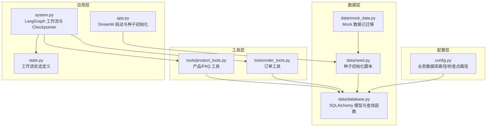
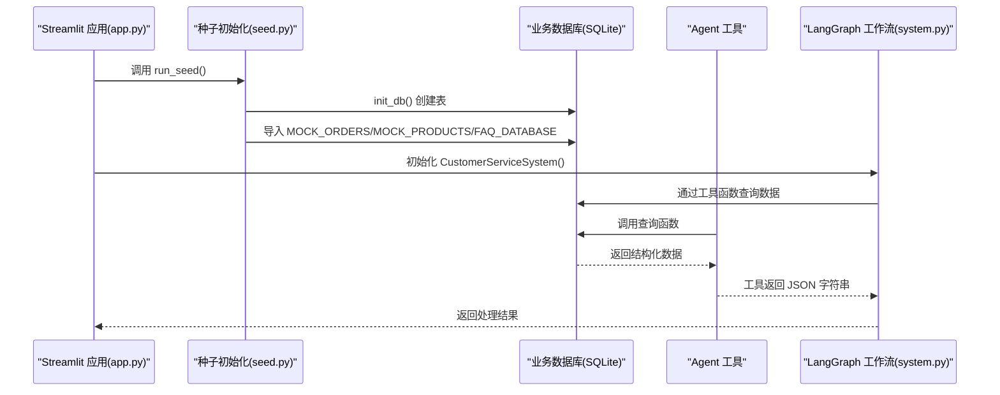
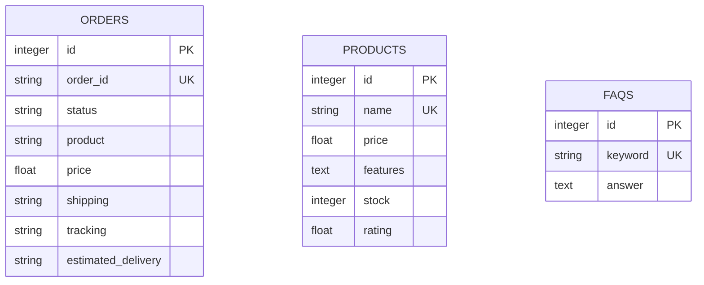
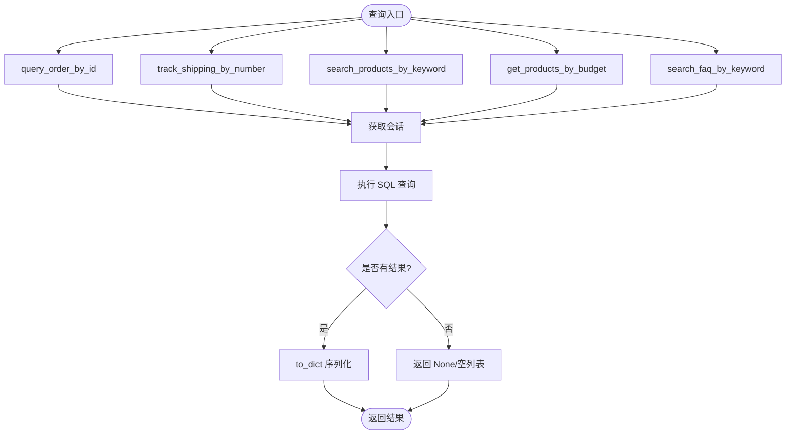
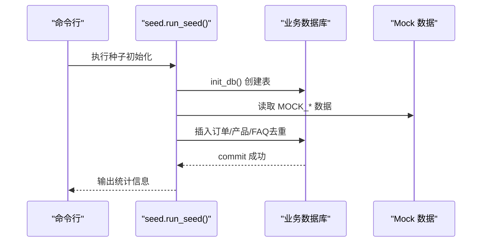
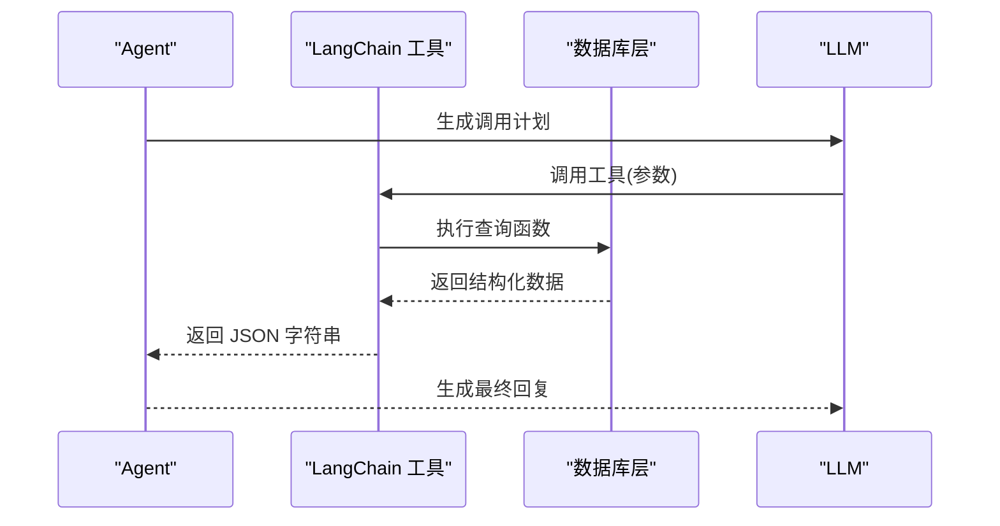
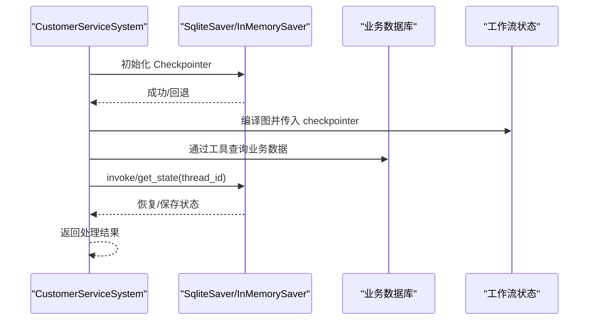
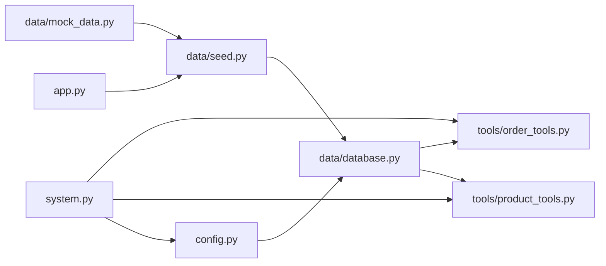

# 数据层设计

<cite>
**本文档引用的文件**
- [data/database.py](file://data/database.py)
- [data/mock_data.py](file://data/mock_data.py)
- [data/seed.py](file://data/seed.py)
- [config.py](file://config.py)
- [app.py](file://app.py)
- [system.py](file://system.py)
- [state.py](file://state.py)
- [tools/order_tools.py](file://tools/order_tools.py)
- [tools/product_tools.py](file://tools/product_tools.py)
- [agents/order_service.py](file://agents/order_service.py)
- [agents/product_consult.py](file://agents/product_consult.py)
- [agents/tech_support.py](file://agents/tech_support.py)
</cite>

## 更新摘要
**变更内容**
- 更新了从mock数据到SQLAlchemy数据库的完整迁移实现
- 新增了订单、产品、FAQ表的持久化模型定义
- 完善了自动数据种子功能的实现细节
- 更新了数据访问层的SQLAlchemy ORM使用说明
- 增强了数据库模型关系和约束的详细分析

## 目录
1. [简介](#简介)
2. [项目结构](#项目结构)
3. [核心组件](#核心组件)
4. [架构总览](#架构总览)
5. [详细组件分析](#详细组件分析)
6. [依赖关系分析](#依赖关系分析)
7. [性能考虑](#性能考虑)
8. [故障排查指南](#故障排查指南)
9. [结论](#结论)
10. [附录](#附录)

## 简介
本文件面向数据层设计，系统性阐述数据库模型定义、数据访问层实现、SQLAlchemy ORM 使用、Mock 数据与种子数据初始化流程、模型关系与约束、最佳实践与性能优化、迁移与版本管理策略，以及与 LangGraph Checkpointer 的集成方式。文档同时提供真实数据库对接的迁移指南与注意事项，帮助读者在现有 SQLite 基础上平滑过渡到生产级数据库。

**更新** 项目已完成从mock数据到SQLAlchemy数据库的完整迁移，实现了订单、产品、FAQ表的持久化存储和自动数据种子功能。

## 项目结构
数据层相关模块分布如下：
- 配置层：集中管理数据库路径等配置项
- 数据库层：定义 SQLAlchemy 模型与数据访问函数
- Mock 数据层：演示阶段的硬编码数据（已迁移至数据库）
- 种子数据层：将 Mock 数据导入数据库的初始化脚本
- 工具层：Agent 工具封装数据库查询接口
- 应用入口：Web UI 启动时执行种子初始化
- 状态与检查点：LangGraph 的状态持久化与会话管理

**图表来源**
- [config.py:48-51](file://config.py#L48-L51)
- [data/database.py:18](file://data/database.py#L18)
- [data/seed.py:18-19](file://data/seed.py#L18-L19)
- [tools/order_tools.py:12](file://tools/order_tools.py#L12)
- [tools/product_tools.py:7-11](file://tools/product_tools.py#L7-L11)
- [app.py:9](file://app.py#L9)
- [system.py:23](file://system.py#L23)

**章节来源**
- [config.py:48-51](file://config.py#L48-L51)
- [data/database.py:18](file://data/database.py#L18)
- [data/seed.py:18-19](file://data/seed.py#L18-L19)
- [tools/order_tools.py:12](file://tools/order_tools.py#L12)
- [tools/product_tools.py:7-11](file://tools/product_tools.py#L7-L11)
- [app.py:9](file://app.py#L9)
- [system.py:23](file://system.py#L23)

## 核心组件
- **数据库模型**：订单、产品、FAQ 三张表，采用 SQLAlchemy declarative base 定义，包含主键、唯一索引、普通索引与默认值。
- **数据访问层**：提供按订单号查询、按物流单号跟踪、按关键词搜索产品、按预算推荐产品、按关键词搜索 FAQ 等查询函数。
- **Mock 数据层**：演示阶段的硬编码字典，现已完全迁移至数据库存储。
- **种子数据层**：将 Mock 数据导入 SQLite，支持幂等插入与去重。
- **工具层**：LangChain 工具函数，封装数据库查询，供 Agent 调用。
- **集成点**：App 启动时执行种子初始化；LangGraph Checkpointer 使用独立 SQLite 存储会话状态。

**更新** 核心组件已完全基于SQLAlchemy ORM实现，Mock数据已迁移至数据库，提供了完整的数据持久化解决方案。

**章节来源**
- [data/database.py:25-161](file://data/database.py#L25-L161)
- [data/mock_data.py:1-67](file://data/mock_data.py#L1-L67)
- [data/seed.py:22-94](file://data/seed.py#L22-L94)
- [tools/order_tools.py:15-50](file://tools/order_tools.py#L15-L50)
- [tools/product_tools.py:14-78](file://tools/product_tools.py#L14-L78)
- [app.py:9-21](file://app.py#L9-L21)
- [system.py:66-75](file://system.py#L66-L75)

## 架构总览
数据层围绕 SQLAlchemy ORM 构建，通过模型与查询函数向上层工具与 Agent 提供稳定的数据接口。种子初始化脚本负责将 Mock 数据迁移到 SQLite，确保开发与演示环境的一致性。LangGraph Checkpointer 独立于业务数据库，使用另一个 SQLite 文件存储工作流状态，二者通过配置路径解耦。

**图表来源**
- [app.py:9-21](file://app.py#L9-L21)
- [data/seed.py:75-94](file://data/seed.py#L75-L94)
- [data/database.py:91-161](file://data/database.py#L91-L161)
- [tools/order_tools.py:15-50](file://tools/order_tools.py#L15-L50)
- [tools/product_tools.py:14-78](file://tools/product_tools.py#L14-L78)
- [system.py:66-75](file://system.py#L66-L75)

## 详细组件分析

### 数据库模型设计
- **订单表（orders）**
  - 主键自增 id，订单号 order_id 唯一且带索引，便于高频查询
  - 字段包含状态、产品名、价格、物流信息、运单号与预计送达日期
  - 提供 to_dict 方法，将 ORM 对象转换为字典，便于工具层序列化
- **产品表（products）**
  - 主键自增 id，名称 name 唯一且带索引
  - features 以 JSON 文本存储数组，便于灵活扩展
  - stock 与 rating 支持库存与评分查询
  - to_dict 解析 features JSON 并返回标准字典
- **FAQ 表（faqs）**
  - 主键自增 id，关键词 keyword 唯一且带索引
  - answer 存储答案文本
  - to_dict 返回关键词与答案

**图表来源**
- [data/database.py:25-83](file://data/database.py#L25-L83)

**章节来源**
- [data/database.py:25-83](file://data/database.py#L25-L83)

### 数据访问层实现
- **引擎与会话**
  - 使用 SQLite 引擎，路径来自配置文件
  - 通过 sessionmaker 绑定引擎，提供 get_session 获取会话
- **查询函数**
  - query_order_by_id：按订单号查询，统一转为大写进行匹配
  - track_shipping_by_number：按物流单号查询并拼接物流信息
  - search_products_by_keyword：模糊匹配产品名称
  - get_products_by_budget：按预算筛选并按评分降序返回
  - search_faq_by_keyword：精确匹配 → 模糊匹配 → 反向匹配，提升命中率

**图表来源**
- [data/database.py:96-161](file://data/database.py#L96-L161)

**章节来源**
- [data/database.py:87-98](file://data/database.py#L87-L98)
- [data/database.py:104-161](file://data/database.py#L104-L161)

### Mock 数据与种子初始化
- **Mock 数据**
  - MOCK_ORDERS：订单号到订单详情的映射
  - MOCK_PRODUCTS：产品名到产品详情的映射
  - FAQ_DATABASE：关键词到答案的映射
- **种子初始化**
  - run_seed：创建表并导入三类数据
  - seed_orders/seed_products/seed_faqs：逐条插入，若存在则跳过（幂等）
  - 导入时对产品 features 进行 JSON 序列化，对订单字段进行默认值处理

**更新** Mock数据已完全迁移至数据库存储，通过种子脚本实现自动初始化，确保开发环境的一致性。

**图表来源**
- [data/seed.py:75-94](file://data/seed.py#L75-L94)
- [data/mock_data.py:7-67](file://data/mock_data.py#L7-L67)

**章节来源**
- [data/mock_data.py:1-67](file://data/mock_data.py#L1-L67)
- [data/seed.py:22-94](file://data/seed.py#L22-L94)

### 工具层与 Agent 集成
- **订单工具**
  - query_order：调用 query_order_by_id，返回 JSON 字符串
  - track_shipping：调用 track_shipping_by_number，失败时按单号前缀进行兜底
- **产品与 FAQ 工具**
  - search_product：调用 search_products_by_keyword
  - get_product_recommendations：调用 get_products_by_budget
  - search_faq：调用 search_faq_by_keyword
- **Agent 使用**
  - 各 Agent 类声明 tools 列表，系统通过 LangChain 工具机制调用

**图表来源**
- [tools/order_tools.py:15-50](file://tools/order_tools.py#L15-L50)
- [tools/product_tools.py:14-78](file://tools/product_tools.py#L14-L78)
- [data/database.py:104-161](file://data/database.py#L104-L161)

**章节来源**
- [agents/order_service.py:11-29](file://agents/order_service.py#L11-L29)
- [agents/product_consult.py:11-30](file://agents/product_consult.py#L11-L30)
- [agents/tech_support.py:11-29](file://agents/tech_support.py#L11-L29)
- [tools/order_tools.py:15-50](file://tools/order_tools.py#L15-L50)
- [tools/product_tools.py:14-78](file://tools/product_tools.py#L14-L78)

### LangGraph Checkpointer 集成
- **Checkpointer 路径**
  - 通过配置文件指定 CHECKPOINT_DB_PATH，使用 SqliteSaver 作为持久化后端
- **回退机制**
  - 若 SqliteSaver 初始化失败，自动回退到 InMemorySaver
- **会话隔离**
  - 通过 thread_id 隔离不同会话的状态，实现跨轮次的 user_profile 累积
- **与业务数据库解耦**
  - Checkpointer 使用独立 SQLite 文件，业务数据与会话状态分离

**图表来源**
- [system.py:66-75](file://system.py#L66-L75)
- [system.py:246-298](file://system.py#L246-L298)
- [config.py:43-46](file://config.py#L43-L46)

**章节来源**
- [system.py:66-75](file://system.py#L66-L75)
- [system.py:246-298](file://system.py#L246-L298)
- [config.py:43-46](file://config.py#L43-L46)

## 依赖关系分析
- **模块依赖**
  - data/database.py 依赖 config.BUSINESS_DB_PATH
  - tools/* 依赖 data/database.py 的查询函数
  - data/seed.py 依赖 data/database.py 与 data/mock_data.py
  - app.py 依赖 data/seed.py
  - system.py 依赖 tools/* 与 config.CHECKPOINT_DB_PATH
- **关系图**

**图表来源**
- [config.py:48-51](file://config.py#L48-L51)
- [data/database.py:18](file://data/database.py#L18)
- [data/seed.py:18-19](file://data/seed.py#L18-L19)
- [tools/order_tools.py:12](file://tools/order_tools.py#L12)
- [tools/product_tools.py:7-11](file://tools/product_tools.py#L7-L11)
- [app.py:9](file://app.py#L9)
- [system.py:23](file://system.py#L23)

**章节来源**
- [config.py:48-51](file://config.py#L48-L51)
- [data/database.py:18](file://data/database.py#L18)
- [data/seed.py:18-19](file://data/seed.py#L18-L19)
- [tools/order_tools.py:12](file://tools/order_tools.py#L12)
- [tools/product_tools.py:7-11](file://tools/product_tools.py#L7-L11)
- [app.py:9](file://app.py#L9)
- [system.py:23](file://system.py#L23)

## 性能考虑
- **索引策略**
  - 订单号、产品名、FAQ 关键词均建立唯一索引，提高查询效率
  - 建议在高频过滤字段（如 price、rating）上评估是否添加复合索引
- **查询优化**
  - 模糊匹配使用 ilike，注意在大数据量场景下可能成为瓶颈
  - 建议对搜索关键词进行预处理（去除多余空格、标准化大小写）
- **连接与会话**
  - 使用 sessionmaker 绑定单一引擎，减少连接开销
  - 工具函数内部使用 with get_session() as session，确保资源释放
- **缓存与去重**
  - 种子初始化采用"存在即跳过"的幂等策略，避免重复插入
- **I/O 与并发**
  - SQLite 在高并发写入场景下受限，建议在生产环境使用 MySQL/PostgreSQL
  - Checkpointer 使用独立 SQLite，避免与业务数据库争用

**更新** 性能优化策略已针对SQLAlchemy ORM进行了专门优化，包括索引策略、查询优化和连接管理。

## 故障排查指南
- **种子初始化失败**
  - 检查 BUSINESS_DB_PATH 是否可写，确认目录存在
  - 确认 sys.path 已正确插入项目根目录
- **查询无结果**
  - 订单号查询需注意大小写，函数内部已统一转为大写
  - 物流跟踪仅支持精确匹配，兜底逻辑基于单号前缀
  - FAQ 查询按顺序尝试精确、模糊与反向匹配，确保关键词覆盖
- **Checkpointer 初始化失败**
  - 若 SqliteSaver 抛异常，系统会回退到 InMemorySaver
  - 检查 CHECKPOINT_DB_PATH 权限与磁盘空间
- **工具调用异常**
  - 确认工具函数已正确导入数据库查询函数
  - 检查返回值是否为字符串（JSON 字符串），避免类型错误

**更新** 故障排查指南已更新以反映SQLAlchemy数据库的具体问题和解决方案。

**章节来源**
- [data/seed.py:75-94](file://data/seed.py#L75-L94)
- [data/database.py:104-161](file://data/database.py#L104-L161)
- [system.py:66-75](file://system.py#L66-L75)

## 结论
该数据层以 SQLAlchemy ORM 为核心，结合 Mock 数据与种子初始化，实现了从演示到生产的平滑过渡。通过明确的模型定义、查询函数封装与工具层集成，为 Agent 提供了稳定可靠的数据接口。LangGraph Checkpointer 与业务数据库解耦，保证了会话状态的持久化与隔离。建议在生产环境中替换为 MySQL/PostgreSQL，并针对高频查询字段增加索引与缓存策略，进一步提升性能与稳定性。

**更新** 数据层已完全实现从mock数据到SQLAlchemy数据库的迁移，提供了完整的数据持久化解决方案，为系统的稳定运行奠定了坚实基础。

## 附录

### 数据模型关系与约束
- 订单、产品、FAQ 三张表彼此独立，无显式外键约束
- 唯一约束体现在订单号、产品名、FAQ 关键词上
- 索引覆盖唯一字段与常用查询字段，提升检索效率

**章节来源**
- [data/database.py:25-83](file://data/database.py#L25-L83)

### 数据迁移与版本管理策略
- **迁移思路**
  - 保持模型定义不变，新增字段时提供默认值
  - 使用 Alembic 进行迁移版本管理（建议）
  - 通过种子脚本或迁移脚本维护历史数据
- **版本控制**
  - 将模型定义纳入版本控制系统
  - 迁移脚本与种子脚本分离，便于回滚与重放

**更新** 迁移策略已针对SQLAlchemy ORM进行了专门优化，提供了完整的版本管理方案。

### 与 LangGraph Checkpointer 的集成要点
- **路径与回退**
  - 通过配置文件集中管理 Checkpoint 数据库路径
  - 初始化失败时自动回退到内存模式，保障可用性
- **会话隔离**
  - 使用 thread_id 隔离状态，避免跨会话污染
  - 会话状态包含 user_profile 等跨轮次字段

**章节来源**
- [system.py:66-75](file://system.py#L66-L75)
- [system.py:246-298](file://system.py#L246-L298)
- [state.py:14-58](file://state.py#L14-L58)

### 真实数据库对接迁移指南
- **替换步骤**
  - 更新配置文件中的数据库连接字符串（如 MySQL/PostgreSQL）
  - 修改 data/database.py 的引擎创建方式与方言
  - 运行 Alembic 迁移生成并执行迁移脚本
  - 重新运行种子脚本或迁移脚本导入数据
- **注意事项**
  - 确保新数据库具备相同表结构与索引
  - 测试查询函数在新数据库上的兼容性
  - 监控迁移过程中的性能与一致性
  - 备份旧数据，制定回滚方案

**更新** 迁移指南已针对SQLAlchemy ORM的特性进行了详细说明，提供了完整的数据库迁移实施方案。