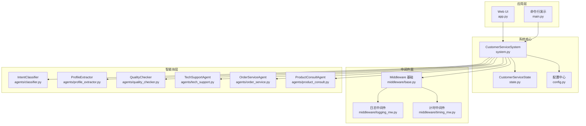
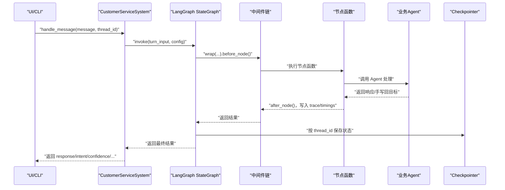
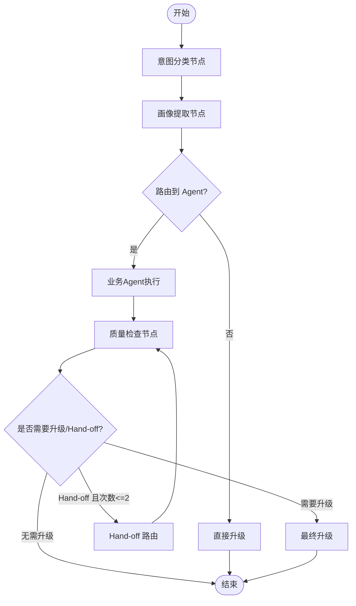
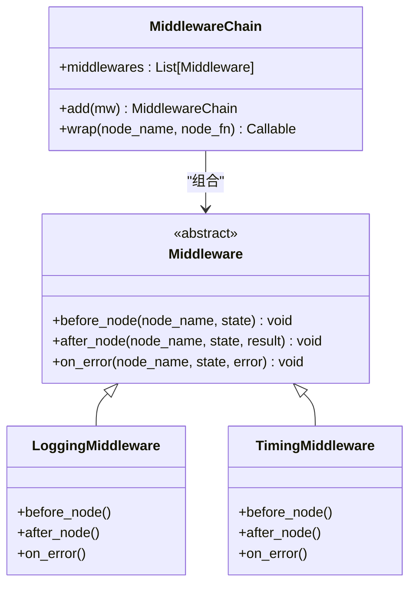
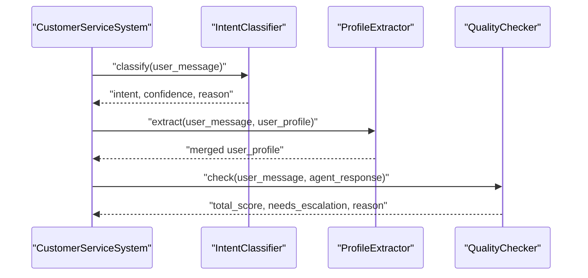
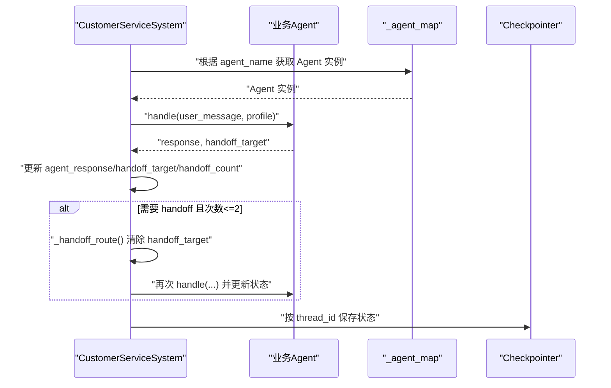
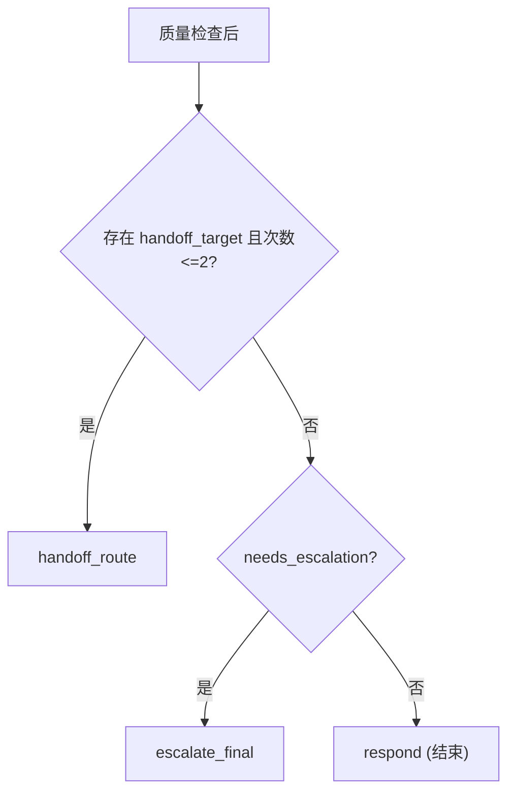
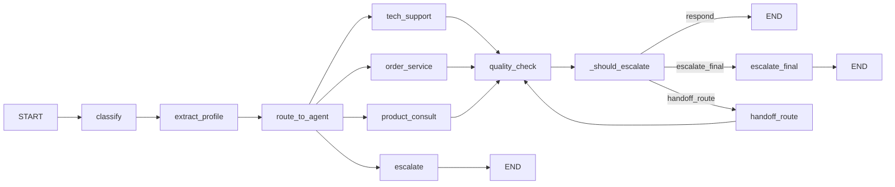
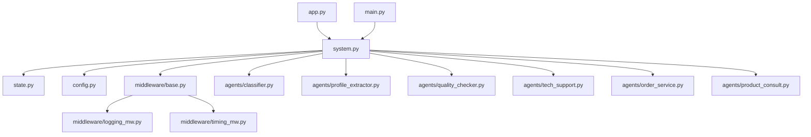

# 工作流编排架构

<cite>
**本文引用的文件**
- [system.py](file://system.py)
- [state.py](file://state.py)
- [config.py](file://config.py)
- [app.py](file://app.py)
- [main.py](file://main.py)
- [middleware/base.py](file://middleware/base.py)
- [middleware/__init__.py](file://middleware/__init__.py)
- [middleware/logging_mw.py](file://middleware/logging_mw.py)
- [middleware/timing_mw.py](file://middleware/timing_mw.py)
- [agents/classifier.py](file://agents/classifier.py)
- [agents/profile_extractor.py](file://agents/profile_extractor.py)
- [agents/quality_checker.py](file://agents/quality_checker.py)
- [agents/order_service.py](file://agents/order_service.py)
- [agents/product_consult.py](file://agents/product_consult.py)
- [agents/tech_support.py](file://agents/tech_support.py)
</cite>

## 目录
1. [简介](#简介)
2. [项目结构](#项目结构)
3. [核心组件](#核心组件)
4. [架构总览](#架构总览)
5. [详细组件分析](#详细组件分析)
6. [依赖关系分析](#依赖关系分析)
7. [性能考量](#性能考量)
8. [故障排查指南](#故障排查指南)
9. [结论](#结论)
10. [附录](#附录)

## 简介
本项目基于 LangGraph 构建“多智能体客服系统”的工作流编排，采用 StateGraph 设计，围绕“意图分类 → 画像提取 → 业务Agent → 质量检查 → 响应/升级”闭环展开。系统通过中间件链实现日志、计时、异常捕获与限流等横切关注点的统一注入；通过 Checkpointer 实现按 thread_id 的状态持久化，使用户画像可在多轮对话中累积。工作流支持 handoff（手写回）机制，配合最大 handoff 次数限制，防止无限循环。

## 项目结构
- system.py：核心 CustomerServiceSystem 类，定义节点函数、条件路由、图构建与编译、对外 API。
- state.py：定义 CustomerServiceState 与 UserProfile 的 TypedDict 结构，作为 LangGraph 的共享状态载体。
- config.py：集中管理阈值、模型初始化、持久化路径等配置。
- app.py：Streamlit Web UI，封装前端交互与系统调用。
- main.py：命令行演示入口，包含测试用例、多轮对话演示与交互式对话。
- middleware/*：中间件基础设施与具体中间件（日志、计时、异常处理、限流）。
- agents/*：意图分类、画像提取、质量检查、各类业务 Agent（技术支持、订单服务、产品咨询）。
- tools/*：业务工具（订单查询、物流跟踪、产品搜索、FAQ 查询等）。
- data/*：数据库与种子数据（用于业务 Agent 的工具数据）。
- utils/*：工具模块（JSON 解析、追踪格式化等）。

图表来源
- [system.py:1-305](file://system.py#L1-L305)
- [state.py:1-58](file://state.py#L1-L58)
- [config.py:1-60](file://config.py#L1-L60)
- [app.py:1-177](file://app.py#L1-L177)
- [main.py:1-148](file://main.py#L1-L148)
- [middleware/base.py:1-94](file://middleware/base.py#L1-L94)
- [middleware/logging_mw.py:1-123](file://middleware/logging_mw.py#L1-L123)
- [middleware/timing_mw.py:1-55](file://middleware/timing_mw.py#L1-L55)
- [agents/classifier.py:1-63](file://agents/classifier.py#L1-L63)
- [agents/profile_extractor.py:1-92](file://agents/profile_extractor.py#L1-L92)
- [agents/quality_checker.py:1-63](file://agents/quality_checker.py#L1-L63)
- [agents/tech_support.py:1-29](file://agents/tech_support.py#L1-L29)
- [agents/order_service.py:1-29](file://agents/order_service.py#L1-L29)
- [agents/product_consult.py:1-30](file://agents/product_consult.py#L1-L30)

章节来源
- [system.py:1-305](file://system.py#L1-L305)
- [state.py:1-58](file://state.py#L1-L58)
- [config.py:1-60](file://config.py#L1-L60)
- [app.py:1-177](file://app.py#L1-L177)
- [main.py:1-148](file://main.py#L1-L148)

## 核心组件
- CustomerServiceSystem：系统主控制器，负责节点函数、条件路由、图构建与编译、对外 API。
- CustomerServiceState：工作流共享状态，包含用户消息、历史、画像、意图、置信度、回复、质量评分、升级标记、handoff 目标与次数、元信息等。
- 中间件链：日志 → 计时 → 异常捕获 → 限流，通过 MiddlewareChain.wrap 将横切逻辑注入到节点函数。
- Agent 组件：IntentClassifier、ProfileExtractor、QualityChecker、TechSupportAgent、OrderServiceAgent、ProductConsultAgent。
- Checkpointer：优先使用 SQLite 持久化，失败时回退到内存持久化，按 thread_id 保存/恢复状态。

章节来源
- [system.py:34-305](file://system.py#L34-L305)
- [state.py:28-58](file://state.py#L28-L58)
- [middleware/base.py:46-94](file://middleware/base.py#L46-L94)
- [config.py:33-60](file://config.py#L33-L60)

## 架构总览
系统采用 LangGraph StateGraph，节点函数与条件路由共同构成工作流。中间件链在编译阶段被注入到每个节点，形成统一的横切关注点。Checkpointer 在编译时传入，按 thread_id 自动保存/恢复状态，使 user_profile 跨轮次累积。

图表来源
- [system.py:248-299](file://system.py#L248-L299)
- [middleware/base.py:63-94](file://middleware/base.py#L63-L94)
- [middleware/logging_mw.py:32-106](file://middleware/logging_mw.py#L32-L106)
- [middleware/timing_mw.py:13-55](file://middleware/timing_mw.py#L13-L55)

## 详细组件分析

### CustomerServiceSystem 类与节点函数
- 节点函数职责
  - 意图分类：将用户消息分类为 tech_support、order_service、product_consult 或 escalate，并输出置信度。
  - 画像提取：从当前消息抽取预算、偏好、订单号、感兴趣产品、语言等，与已有画像合并。
  - 业务 Agent 执行：统一调度 _run_business_agent，支持 handoff 并更新 handoff_count。
  - 质量检查：对回复进行评分，低于阈值或需要升级时标记 needs_escalation。
  - 最终升级：在质量检查后仍需升级时，保留原回复并附加人工提示。
  - 直接升级：当意图置信度过低或用户要求人工时，直接返回人工提示。
- 条件路由
  - 路由到 Agent：依据 intent 与 confidence 决定 tech_support、order_service、product_consult 或 escalate。
  - 升级/Hand-off 决策：若存在 handoff_target 且未超过 MAX_HANDOFFS，则走 handoff_route；否则根据 needs_escalation 决定 escalate_final 或 respond。
  - Hand-off 路由：将 handoff_target 解析为 Agent 实例，执行并清空 handoff_target 防止重复 handoff。
- 手写回机制
  - handoff_target 由业务 Agent 返回；handoff_count 用于限制最大 handoff 次数（MAX_HANDOFFS=2），防止无限循环。
- 图构建与编译
  - 使用 StateGraph 定义节点与边，加入 START/END；编译时传入 checkpointer，按 thread_id 保存/恢复状态。

图表来源
- [system.py:79-193](file://system.py#L79-L193)
- [system.py:159-184](file://system.py#L159-L184)
- [system.py:196-246](file://system.py#L196-L246)

章节来源
- [system.py:79-193](file://system.py#L79-L193)
- [system.py:159-184](file://system.py#L159-L184)
- [system.py:196-246](file://system.py#L196-L246)

### 中间件链与集成方式
- MiddlewareChain.wrap 将 before_node/after_node/on_error 注入节点函数，形成统一的横切流程。
- 日志中间件：记录节点开始/结束、输入摘要、输出摘要，写入 trace 与元信息。
- 计时中间件：统计节点耗时，写入 metadata.node_timings。
- 异常中间件与限流中间件：在异常时记录错误 trace，在计时中间件中也体现异常耗时。

图表来源
- [middleware/base.py:14-94](file://middleware/base.py#L14-L94)
- [middleware/logging_mw.py:32-106](file://middleware/logging_mw.py#L32-L106)
- [middleware/timing_mw.py:13-55](file://middleware/timing_mw.py#L13-L55)

章节来源
- [middleware/base.py:46-94](file://middleware/base.py#L46-L94)
- [middleware/logging_mw.py:32-106](file://middleware/logging_mw.py#L32-L106)
- [middleware/timing_mw.py:13-55](file://middleware/timing_mw.py#L13-L55)

### 意图分类、画像提取、质量检查
- 意图分类：使用 LLM 与 JSON 输出解析，返回 intent、confidence、reason，并兜底为 escalate。
- 画像提取：从当前消息抽取预算、偏好、订单号、感兴趣产品、语言，与旧画像合并（标量覆盖、列表去重合并）。
- 质量检查：对用户问题与 Agent 回复进行相关性、完整性、专业性、有用性评分，综合得出 total_score 与 needs_escalation。

图表来源
- [agents/classifier.py:40-63](file://agents/classifier.py#L40-L63)
- [agents/profile_extractor.py:41-81](file://agents/profile_extractor.py#L41-L81)
- [agents/quality_checker.py:41-63](file://agents/quality_checker.py#L41-L63)

章节来源
- [agents/classifier.py:19-63](file://agents/classifier.py#L19-L63)
- [agents/profile_extractor.py:17-92](file://agents/profile_extractor.py#L17-L92)
- [agents/quality_checker.py:16-63](file://agents/quality_checker.py#L16-L63)

### 业务 Agent 执行与手写回
- 业务 Agent（技术支持、订单服务、产品咨询）继承 BaseBusinessAgent，内置 tools 与系统提示词。
- _run_business_agent 统一执行：调用 Agent.handle，写入 agent_response 与 handoff_target；若存在 handoff_target，则 handoff_count+1。
- _handoff_route 将 handoff_target 解析为 Agent 实例，执行后清除 handoff_target，防止重复 handoff。
- MAX_HANDOFFS=2 限制 handoff 次数，避免无限循环。

图表来源
- [system.py:93-104](file://system.py#L93-L104)
- [system.py:185-192](file://system.py#L185-L192)
- [system.py:38-56](file://system.py#L38-L56)

章节来源
- [system.py:93-104](file://system.py#L93-L104)
- [system.py:185-192](file://system.py#L185-L192)
- [system.py:38-56](file://system.py#L38-L56)

### 条件路由机制与动态路由
- _route_to_agent：根据 confidence 与 intent 决定路由到具体 Agent 或 escalate。
- _should_escalate：综合 handoff_target 与 needs_escalation，决定 escalate_final、handoff_route 还是 respond。
- _agent_map：将 Agent 名称映射到实例，支持动态路由与 handoff。

图表来源
- [system.py:171-184](file://system.py#L171-L184)
- [system.py:38-56](file://system.py#L38-L56)

章节来源
- [system.py:159-184](file://system.py#L159-L184)
- [system.py:38-56](file://system.py#L38-L56)

### 工作流图构建与编译配置
- 节点注册：classify、extract_profile、tech_support、order_service、product_consult、escalate、quality_check、escalate_final、handoff_route。
- 边与条件边：按 START → classify → extract_profile → route → Agent → quality_check → decide → respond/escalate/handoff_route → END 的顺序连接。
- 编译：graph.compile(checkpointer=...)，按 thread_id 保存/恢复状态，实现 user_profile 跨轮累积。

图表来源
- [system.py:211-246](file://system.py#L211-L246)

章节来源
- [system.py:196-246](file://system.py#L196-L246)

### Checkpointer 持久化策略
- 优先使用 SqliteSaver，连接本地 SQLite 数据库；失败时回退到 InMemorySaver。
- 通过 config 中的 CHECKPOINT_DB_PATH 指定数据库路径。
- 编译时传入 checkpointer，invoke 时通过 config["configurable"]["thread_id"] 指定会话标识，实现跨轮次状态恢复。

章节来源
- [system.py:66-75](file://system.py#L66-L75)
- [config.py:43-46](file://config.py#L43-L46)

## 依赖关系分析
- 系统层依赖：system.py 依赖 state.py、config.py、agents/*、middleware/*。
- 中间件依赖：middleware/base.py 定义抽象与链式编排，logging_mw.py 与 timing_mw.py 实现具体横切逻辑。
- Agent 依赖：agents/* 依赖 config.model 与工具模块；BaseBusinessAgent 提供统一接口。
- UI/CLI 依赖：app.py 与 main.py 依赖 system.py 与 data.seed。

图表来源
- [system.py:17-31](file://system.py#L17-L31)
- [middleware/base.py:14-11](file://middleware/base.py#L14-L11)
- [app.py:9-11](file://app.py#L9-L11)
- [main.py:8-9](file://main.py#L8-L9)

章节来源
- [system.py:17-31](file://system.py#L17-L31)
- [middleware/base.py:14-11](file://middleware/base.py#L14-L11)
- [app.py:9-11](file://app.py#L9-L11)
- [main.py:8-9](file://main.py#L8-L9)

## 性能考量
- 中间件计时：TimingMiddleware 将节点耗时写入 metadata.node_timings，便于前端展示与性能分析。
- 日志与追踪：LoggingMiddleware 记录 trace，结合 UI 展示节点耗时与摘要，辅助定位瓶颈。
- 模型与工具：所有 Agent 共享 model 实例，减少重复初始化开销。
- 手写回限制：MAX_HANDOFFS=2 控制 handoff 次数，避免深度链路导致延迟增加。

章节来源
- [middleware/timing_mw.py:13-55](file://middleware/timing_mw.py#L13-L55)
- [middleware/logging_mw.py:32-106](file://middleware/logging_mw.py#L32-L106)
- [config.py:30-31](file://config.py#L30-L31)
- [system.py:38](file://system.py#L38)

## 故障排查指南
- 异常处理：ErrorHandlerMiddleware 在节点抛错时记录错误 trace，便于定位问题。
- 日志查看：LoggingMiddleware 输出节点开始/结束、摘要与错误信息，UI 侧也可查看 trace。
- 节点耗时：前端侧边栏与详情面板展示 metadata.node_timings，快速发现慢节点。
- 配置检查：确认 .env 中 DEEPSEEK_API_KEY 设置正确；检查 CHECKPOINT_DB_PATH 可写；确认业务数据库初始化成功。

章节来源
- [middleware/logging_mw.py:78-106](file://middleware/logging_mw.py#L78-L106)
- [app.py:103-123](file://app.py#L103-L123)
- [config.py:20-26](file://config.py#L20-L26)
- [config.py:43-46](file://config.py#L43-L46)

## 结论
该系统通过 LangGraph 的 StateGraph 将意图分类、画像提取、业务 Agent 执行、质量检查与升级/手写回串联为清晰的工作流。中间件链实现日志、计时、异常与限流的统一注入，Checkpointer 保障多轮对话中用户画像的跨轮累积。条件路由与 _agent_map 支持动态路由与 handoff，配合 MAX_HANDOFFS 限制，确保工作流稳定高效。

## 附录
- 外部 API：handle_message(message, thread_id="default", chat_history=None) 返回 response、intent、confidence、quality_score、escalated、profile、metadata。
- 多轮对话演示：main.py 提供 MULTI_TURN_DEMO，展示 user_profile 累积效果。
- Web UI：app.py 提供 Streamlit 界面，支持切换 thread_id、查看画像与处理详情。

章节来源
- [system.py:250-299](file://system.py#L250-L299)
- [main.py:44-104](file://main.py#L44-L104)
- [app.py:144-150](file://app.py#L144-L150)