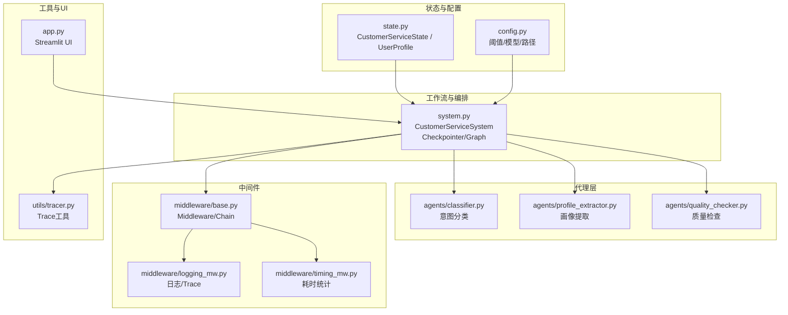
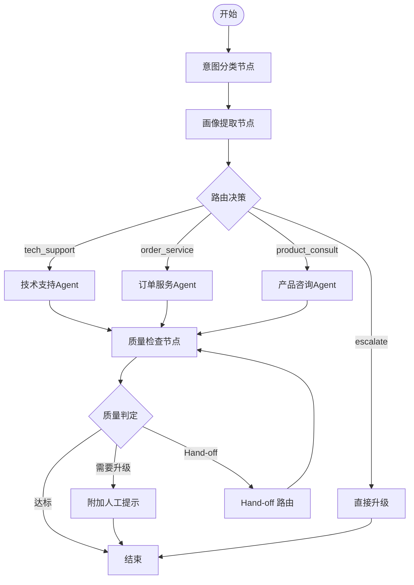
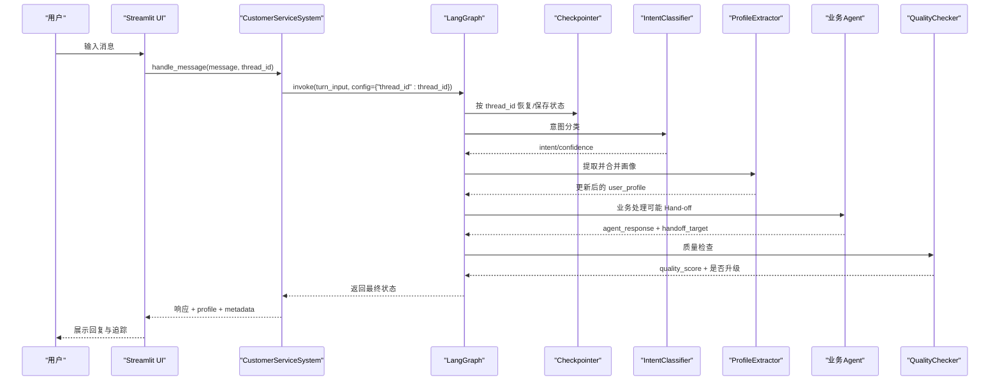
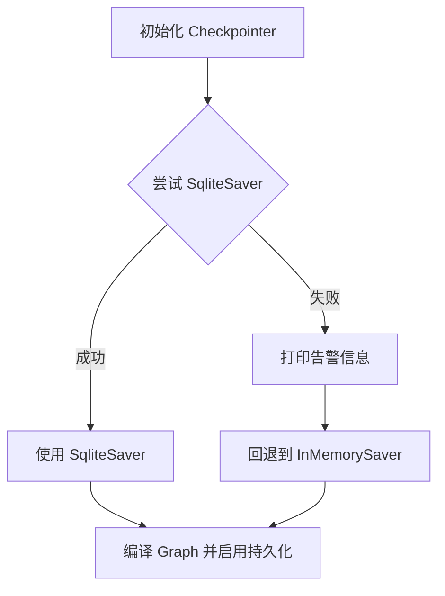
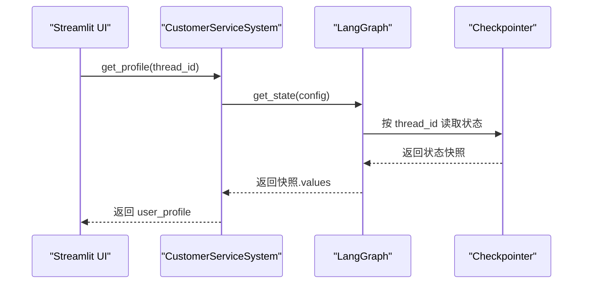
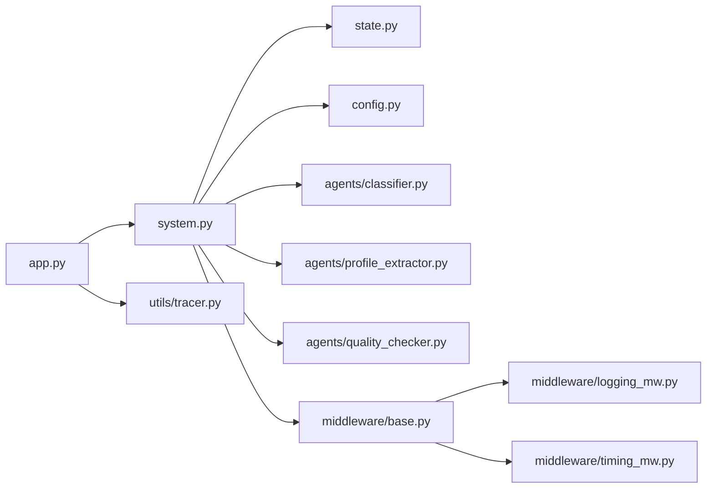

# 状态管理系统

<cite>
**本文引用的文件**
- [state.py](file://state.py)
- [system.py](file://system.py)
- [config.py](file://config.py)
- [app.py](file://app.py)
- [agents/profile_extractor.py](file://agents/profile_extractor.py)
- [agents/classifier.py](file://agents/classifier.py)
- [middleware/base.py](file://middleware/base.py)
- [middleware/logging_mw.py](file://middleware/logging_mw.py)
- [middleware/timing_mw.py](file://middleware/timing_mw.py)
- [utils/tracer.py](file://utils/tracer.py)
- [README.md](file://README.md)
</cite>

## 目录
1. [简介](#简介)
2. [项目结构](#项目结构)
3. [核心组件](#核心组件)
4. [架构总览](#架构总览)
5. [详细组件分析](#详细组件分析)
6. [依赖关系分析](#依赖关系分析)
7. [性能考量](#性能考量)
8. [故障排查指南](#故障排查指南)
9. [结论](#结论)
10. [附录](#附录)

## 简介
本文件围绕多智能体客服系统的“状态管理系统”进行深入文档化，重点涵盖：
- CustomerServiceState 的数据结构设计与字段语义
- 用户画像（UserProfile）的跨轮次累积机制
- 多轮对话中状态的流转与 thread_id 的作用
- Checkpointer 的实现原理与回退策略（InMemorySaver 与 SqliteSaver）
- 状态重置与累积规则
- 状态查询方法（如 get_profile）的实现原理
- 状态流转图与数据结构示例，帮助开发者理解状态管理的完整生命周期

## 项目结构
本项目采用“按职责分层”的组织方式：
- state.py：定义状态类型（CustomerServiceState、UserProfile）
- system.py：LangGraph 工作流编排、Checkpointer 初始化、节点与路由逻辑、对外 API
- config.py：业务阈值、模型初始化、持久化路径等配置
- agents/*：各业务 Agent 的实现（意图分类、画像提取、业务代理、质量检查等）
- middleware/*：中间件基础设施与具体中间件（日志、计时、错误处理、限流）
- utils/tracer.py：调用链追踪工具
- app.py：Streamlit Web UI，演示状态查询与可视化

图表来源
- [state.py:1-58](file://state.py#L1-L58)
- [system.py:1-305](file://system.py#L1-L305)
- [config.py:1-60](file://config.py#L1-L60)
- [agents/classifier.py:1-63](file://agents/classifier.py#L1-L63)
- [agents/profile_extractor.py:1-92](file://agents/profile_extractor.py#L1-L92)
- [middleware/base.py:1-94](file://middleware/base.py#L1-L94)
- [middleware/logging_mw.py:1-123](file://middleware/logging_mw.py#L1-L123)
- [middleware/timing_mw.py:1-55](file://middleware/timing_mw.py#L1-L55)
- [utils/tracer.py:1-78](file://utils/tracer.py#L1-L78)
- [app.py:1-177](file://app.py#L1-L177)

章节来源
- [README.md:95-133](file://README.md#L95-L133)
- [state.py:1-58](file://state.py#L1-L58)
- [system.py:1-305](file://system.py#L1-L305)
- [config.py:1-60](file://config.py#L1-L60)
- [app.py:1-177](file://app.py#L1-L177)

## 核心组件
- CustomerServiceState：LangGraph 工作流的共享状态载体，承载用户消息、历史、意图、画像、回复、质量评分、升级标记、Hand-off 目标与次数、元信息等。
- UserProfile：跨轮次累积的用户画像，包含预算、偏好、订单号、感兴趣产品、语言等字段。
- Checkpointer：按 thread_id 跨轮次持久化状态，支持 SqliteSaver 与 InMemorySaver 的选择与回退。
- 中间件链：在节点执行前后注入日志、计时、错误处理等横切关注点，同时向 state.metadata 写入 trace 与耗时信息。
- 对外 API：handle_message 与 get_profile，前者按轮次重置请求级字段，后者查询当前累积的用户画像。

章节来源
- [state.py:28-58](file://state.py#L28-L58)
- [system.py:34-76](file://system.py#L34-L76)
- [system.py:250-305](file://system.py#L250-L305)
- [middleware/base.py:46-94](file://middleware/base.py#L46-L94)
- [utils/tracer.py:11-78](file://utils/tracer.py#L11-L78)

## 架构总览
系统通过 LangGraph 构建状态驱动的工作流，节点之间通过共享状态传递数据；启用 Checkpointer 后，状态按 thread_id 跨轮次保留，从而实现用户画像的累积与后续轮次的上下文利用。

图表来源
- [system.py:196-246](file://system.py#L196-L246)
- [README.md:27-44](file://README.md#L27-L44)

## 详细组件分析

### CustomerServiceState 数据结构与字段语义
- user_message：用户输入的原始消息，每轮重置。
- chat_history：历史对话记录，用于多轮上下文。
- user_profile：跨轮次累积的用户画像，由 Checkpointer 按 thread_id 恢复与更新。
- intent：意图分类结果（如 tech_support、order_service、product_consult、escalate）。
- confidence：意图分类置信度，范围 [0.0, 1.0]。
- agent_response：业务 Agent 生成的回复。
- needs_escalation：是否需要升级到人工客服。
- escalation_reason：升级原因。
- quality_score：回复质量评分，范围 [0.0, 1.0]。
- handoff_target：Hand-off 目标 Agent 名称（如 "order_service"），空串表示无 handoff。
- handoff_count：当前轮次已发生的 handoff 次数，防止无限循环。
- metadata：附加元信息，包含时间戳、trace 列表、节点耗时等。

字段设计要点：
- 请求级字段（每轮重置）：intent、confidence、agent_response、needs_escalation、escalation_reason、quality_score、handoff_target、handoff_count、metadata（仅本次节点执行相关部分）。
- 会话级字段（跨轮累积）：user_profile（由 Checkpointer 与画像提取节点共同维护）。

章节来源
- [state.py:28-58](file://state.py#L28-L58)
- [system.py:270-284](file://system.py#L270-L284)
- [README.md:137-141](file://README.md#L137-L141)

### UserProfile 数据结构与累积策略
- 字段：budget（预算）、preferences（偏好关键词列表）、mentioned_orders（提及的订单号列表）、interested_products（感兴趣的产品列表）、language（语言代码）。
- 累积策略：画像提取节点每次从当前消息中抽取新信息，并与已有 profile 合并。标量字段（budget、language）以新值覆盖，列表字段（preferences、mentioned_orders、interested_products）进行去重合并，保持顺序。

章节来源
- [state.py:14-26](file://state.py#L14-L26)
- [agents/profile_extractor.py:41-81](file://agents/profile_extractor.py#L41-L81)

### 多轮对话中的状态流转与 thread_id 机制
- thread_id 作为 Checkpointer 的键，相同 thread_id 的多次调用共享同一份状态快照（含 user_profile）。
- 每轮调用 handle_message 时，系统会重置请求级字段，确保每轮处理的独立性；user_profile 由 Checkpointer 恢复并在画像提取节点中累积。
- Web UI 中，用户可在侧边栏切换 thread_id，从而切换会话上下文与画像。

图表来源
- [system.py:250-299](file://system.py#L250-L299)
- [system.py:196-246](file://system.py#L196-L246)
- [agents/classifier.py:40-63](file://agents/classifier.py#L40-L63)
- [agents/profile_extractor.py:41-81](file://agents/profile_extractor.py#L41-L81)
- [middleware/logging_mw.py:39-77](file://middleware/logging_mw.py#L39-L77)
- [middleware/timing_mw.py:20-43](file://middleware/timing_mw.py#L20-L43)

章节来源
- [system.py:250-299](file://system.py#L250-L299)
- [app.py:46-87](file://app.py#L46-L87)

### Checkpointer 实现原理与回退机制
- 优先使用 SqliteSaver：通过连接本地 SQLite 数据库实现跨进程、跨会话的状态持久化。
- 回退策略：若 SqliteSaver 初始化失败（例如数据库不可写或权限问题），系统自动回退到 InMemorySaver，保证服务可用性。
- 选择策略：生产环境建议使用 SqliteSaver；开发或受限环境下可接受内存持久化。

图表来源
- [system.py:66-75](file://system.py#L66-L75)
- [config.py:43-46](file://config.py#L43-L46)

章节来源
- [system.py:66-75](file://system.py#L66-L75)
- [config.py:43-46](file://config.py#L43-L46)

### 状态重置与累积规则
- 每轮重置的请求级字段：intent、confidence、agent_response、needs_escalation、escalation_reason、quality_score、handoff_target、handoff_count、metadata（仅本次节点执行相关部分）。
- 需要累积的会话级字段：user_profile（由 Checkpointer 恢复并在画像提取节点中合并）。
- 重置逻辑在 handle_message 开始时显式构造 turn_input，并通过 configurable.thread_id 将会话标识传递给 Checkpointer。

章节来源
- [system.py:270-284](file://system.py#L270-L284)
- [system.py:250-299](file://system.py#L250-L299)
- [README.md:137-141](file://README.md#L137-L141)

### 状态查询方法：get_profile 的实现原理
- get_profile 通过 graph.get_state(config={"configurable": {"thread_id": thread_id}}) 获取当前会话的最新状态快照。
- 从快照中提取 user_profile 字段返回给调用方，用于 UI 展示或进一步分析。

图表来源
- [system.py:300-305](file://system.py#L300-L305)

章节来源
- [system.py:300-305](file://system.py#L300-L305)

### 中间件与可观测性：Trace 与耗时统计
- 日志中间件：在节点执行前后记录摘要信息，并将 trace 条目写入 state.metadata["trace"]。
- 计时中间件：统计节点耗时，写入 state.metadata["node_timings"]。
- 调用链追踪工具：提供 trace 的格式化输出，便于 UI 展示。

章节来源
- [middleware/logging_mw.py:32-123](file://middleware/logging_mw.py#L32-L123)
- [middleware/timing_mw.py:13-55](file://middleware/timing_mw.py#L13-L55)
- [utils/tracer.py:11-78](file://utils/tracer.py#L11-L78)

## 依赖关系分析
- system.py 依赖 state.py（CustomerServiceState 类型）、config.py（阈值与路径）、agents/*（意图分类、画像提取、质量检查）、middleware/*（中间件链）。
- agents/profile_extractor.py 依赖 state.py（UserProfile 类型）与 utils/json_parser（容错解析）。
- middleware/base.py 定义了 Middleware 抽象与 MiddlewareChain，被具体中间件实现所继承。
- app.py 依赖 system.py 与 utils/tracer.py，用于 UI 展示与交互。

图表来源
- [system.py:17-31](file://system.py#L17-L31)
- [agents/profile_extractor.py:12-14](file://agents/profile_extractor.py#L12-L14)
- [middleware/base.py:14-44](file://middleware/base.py#L14-L44)
- [app.py:9-11](file://app.py#L9-L11)

章节来源
- [system.py:17-31](file://system.py#L17-L31)
- [agents/profile_extractor.py:12-14](file://agents/profile_extractor.py#L12-L14)
- [middleware/base.py:14-44](file://middleware/base.py#L14-L44)
- [app.py:9-11](file://app.py#L9-L11)

## 性能考量
- Checkpointer 选择：SqliteSaver 提供跨进程持久化，适合生产；InMemorySaver 仅内存，适合快速开发与测试。
- 中间件开销：日志与计时中间件对性能影响较小，但建议在高并发场景下合理控制日志级别与 trace 体量。
- 节点耗时统计：通过 metadata.node_timings 可定位慢节点，结合 trace 进行优化。
- 画像合并成本：ProfileExtractor 的 JSON 解析与去重操作为 O(n+m)，在消息较长时需注意 LLM 输出稳定性。

[本节为通用性能讨论，不直接分析具体文件]

## 故障排查指南
- SqliteSaver 初始化失败：检查数据库路径权限与磁盘空间，确认 CHECKPOINT_DB_PATH 可写；若失败将自动回退到 InMemorySaver。
- 画像未累积：确认每次调用 handle_message 使用了相同的 thread_id；检查 Checkpointer 是否正常工作。
- 质量评分异常：检查 MIN_QUALITY_SCORE 阈值与 QualityChecker 的实现；查看 metadata.trace 与 node_timings。
- 升级频繁：降低 MIN_INTENT_CONFIDENCE 或优化 IntentClassifier 的提示词与示例；检查 handoff_count 是否超过上限。

章节来源
- [system.py:66-75](file://system.py#L66-L75)
- [config.py:35-40](file://config.py#L35-L40)
- [middleware/logging_mw.py:78-106](file://middleware/logging_mw.py#L78-L106)
- [middleware/timing_mw.py:45-55](file://middleware/timing_mw.py#L45-L55)

## 结论
本状态管理系统通过 LangGraph 的共享状态与 Checkpointer，实现了多轮对话中用户画像的跨轮次累积与可控的请求级字段重置。配合中间件链与可观测性工具，系统具备良好的可维护性与可调试性。在生产环境中建议使用 SqliteSaver，并结合阈值与质量检查策略，确保服务质量与用户体验。

[本节为总结性内容，不直接分析具体文件]

## 附录

### 状态字段与类型概览
- user_message: str
- chat_history: List[Dict[str, str]]
- user_profile: UserProfile
- intent: str
- confidence: float
- agent_response: str
- needs_escalation: bool
- escalation_reason: str
- quality_score: float
- handoff_target: str
- handoff_count: int
- metadata: Dict[str, Any]

章节来源
- [state.py:46-57](file://state.py#L46-L57)

### 多轮对话示例（概念流程）
- 第1轮：用户输入“我预算1500”，系统记录 budget=1500。
- 第2轮：用户输入“喜欢降噪”，系统合并 preferences=['降噪']。
- 第3轮：用户输入“推荐几个智能手表”，业务代理基于预算与偏好进行推荐。

章节来源
- [README.md:159-173](file://README.md#L159-L173)