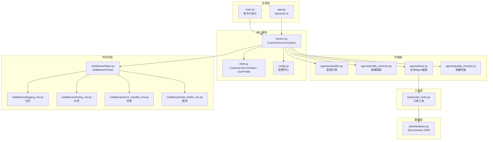
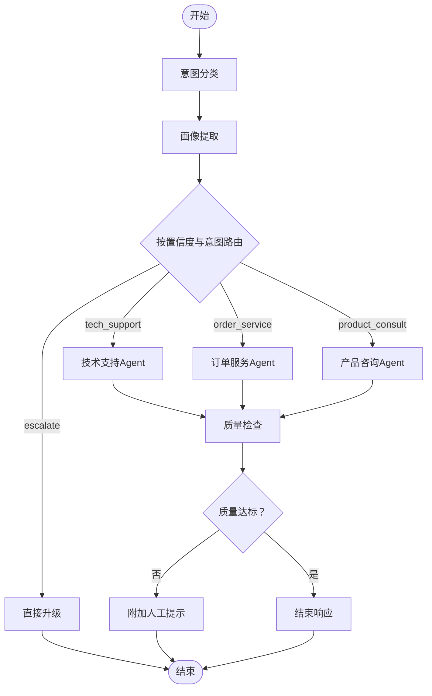
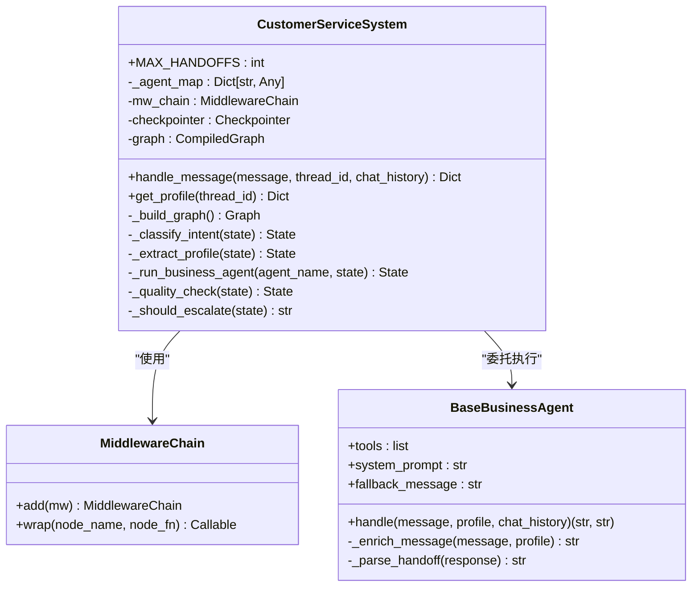
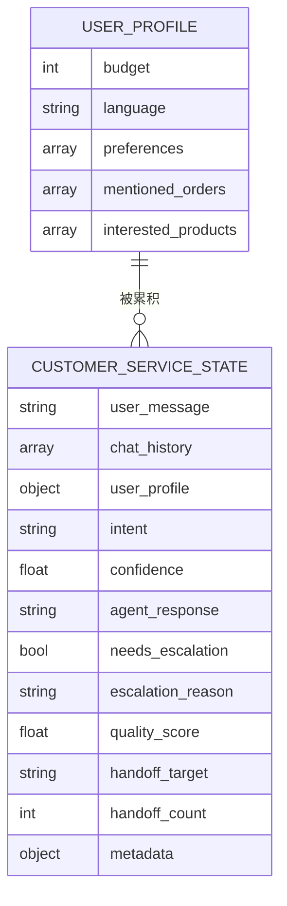
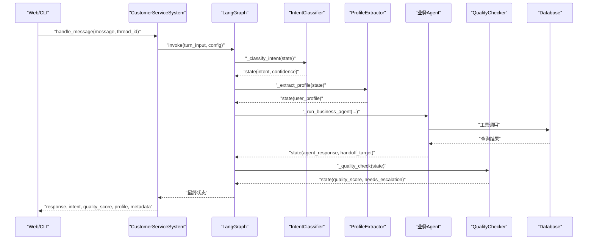
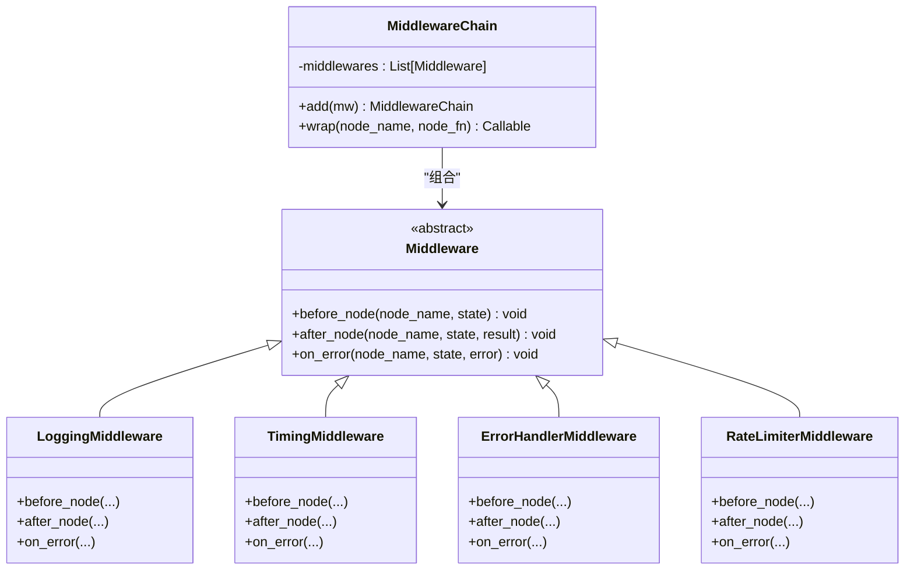
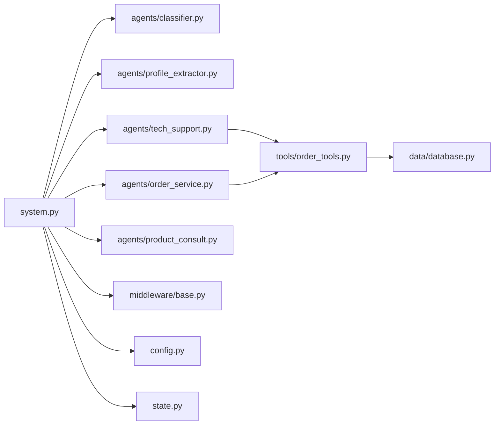

# 系统架构设计

<cite>
**本文引用的文件**
- [app.py](file://app.py)
- [main.py](file://main.py)
- [system.py](file://system.py)
- [state.py](file://state.py)
- [config.py](file://config.py)
- [README.md](file://README.md)
- [agents/base.py](file://agents/base.py)
- [agents/classifier.py](file://agents/classifier.py)
- [agents/profile_extractor.py](file://agents/profile_extractor.py)
- [tools/order_tools.py](file://tools/order_tools.py)
- [middleware/base.py](file://middleware/base.py)
- [middleware/logging_mw.py](file://middleware/logging_mw.py)
- [middleware/timing_mw.py](file://middleware/timing_mw.py)
- [middleware/error_handler_mw.py](file://middleware/error_handler_mw.py)
- [middleware/rate_limiter_mw.py](file://middleware/rate_limiter_mw.py)
- [data/database.py](file://data/database.py)
</cite>

## 目录
1. [引言](#引言)
2. [项目结构](#项目结构)
3. [核心组件](#核心组件)
4. [架构总览](#架构总览)
5. [详细组件分析](#详细组件分析)
6. [依赖分析](#依赖分析)
7. [性能考量](#性能考量)
8. [故障排查指南](#故障排查指南)
9. [结论](#结论)
10. [附录](#附录)

## 引言
本项目是一个基于 LangChain 1.0 与 LangGraph 的多智能体客服系统，围绕“意图分类 → 画像提取 → 业务 Agent 处理 → 质量检查 → 响应/升级”的工作流进行编排。系统通过 LangGraph 的 Checkpointer 实现跨轮次的状态持久化，使用户画像在多轮对话中持续累积；通过中间件链实现日志、计时、异常捕获与限流等横切能力；通过工具函数与数据库层提供真实业务能力。

## 项目结构
系统采用按职责分层的模块化组织方式：
- 应用入口与UI：main.py（命令行演示）、app.py（Streamlit Web UI）
- 核心编排：system.py（CustomerServiceSystem 主类，LangGraph 工作流）
- 状态定义：state.py（CustomerServiceState、UserProfile）
- 配置中心：config.py（模型初始化、阈值、路径）
- 代理层：agents/*（意图分类、画像提取、业务 Agent、质量检查）
- 工具层：tools/*（订单/产品工具）
- 中间件层：middleware/*（日志、计时、异常、限流）
- 数据层：data/*（SQLAlchemy ORM + SQLite）

**图表来源**
- [system.py:196-246](file://system.py#L196-L246)
- [state.py:28-58](file://state.py#L28-L58)
- [config.py:31-60](file://config.py#L31-L60)
- [agents/base.py:23-123](file://agents/base.py#L23-L123)
- [tools/order_tools.py:15-50](file://tools/order_tools.py#L15-L50)
- [middleware/base.py:46-94](file://middleware/base.py#L46-L94)
- [data/database.py:87-161](file://data/database.py#L87-L161)

**章节来源**
- [README.md:81-108](file://README.md#L81-L108)
- [main.py:130-148](file://main.py#L130-L148)
- [app.py:14-42](file://app.py#L14-L42)

## 核心组件
- CustomerServiceSystem：系统主控制器，负责构建与编排 LangGraph 工作流，封装节点函数、路由策略与对外 API。
- CustomerServiceState / UserProfile：LangGraph 状态载体，承载每轮请求级字段与跨轮次累积的用户画像。
- 配置中心 config：集中管理模型初始化、阈值、路径与语言支持。
- 代理层 agents：包含意图分类、画像提取、业务 Agent（技术/订单/产品）、质量检查。
- 工具层 tools：封装数据库查询等外部能力，供 Agent 工具调用。
- 中间件层 middleware：提供日志、计时、异常捕获、限流等横切能力。
- 数据层 data：SQLAlchemy ORM + SQLite，提供订单、产品、FAQ 等业务数据访问。

**章节来源**
- [system.py:34-305](file://system.py#L34-L305)
- [state.py:14-58](file://state.py#L14-L58)
- [config.py:1-60](file://config.py#L1-L60)
- [agents/classifier.py:19-63](file://agents/classifier.py#L19-L63)
- [agents/profile_extractor.py:17-92](file://agents/profile_extractor.py#L17-L92)
- [tools/order_tools.py:15-50](file://tools/order_tools.py#L15-L50)
- [middleware/base.py:14-94](file://middleware/base.py#L14-L94)
- [data/database.py:25-161](file://data/database.py#L25-L161)

## 架构总览
系统采用“工作流编排 + 状态持久化 + 中间件治理 + 工具化能力”的整体架构。LangGraph 作为执行引擎，CustomerServiceSystem 作为编排器，将节点函数、路由与检查点整合为可扩展的工作流。中间件链在不侵入节点逻辑的前提下，统一注入可观测性与可靠性能力。工具与数据层为业务 Agent 提供真实数据支撑。

**图表来源**
- [system.py:196-246](file://system.py#L196-L246)
- [README.md:19-36](file://README.md#L19-L36)

## 详细组件分析

### CustomerServiceSystem 设计与实现
- 设计理念
  - 以 LangGraph 为核心，将“意图分类 → 画像提取 → 业务 Agent → 质量检查 → 响应/升级”串联为确定性工作流。
  - 通过 Checkpointer（优先 SqliteSaver，失败回退 InMemorySaver）按 thread_id 持久化状态，实现跨轮次用户画像累积。
  - 通过 MiddlewareChain 将日志、计时、异常捕获、限流等横切关注点注入节点执行前后，提升可维护性与可观测性。
- 关键实现
  - 节点函数：意图分类、画像提取、业务 Agent 执行器、直接升级、质量检查、最终升级、handoff 路由。
  - 路由策略：基于置信度与意图的条件路由；质量检查后根据 handoff 标记与次数阈值决定是否升级或再次路由。
  - 对外 API：handle_message 接收用户消息，按 thread_id 编排执行并返回本轮结果；get_profile 查询当前会话画像。
  - 手动升级保护：MAX_HANDOFFS 防止无限 handoff 循环；needs_escalation 与 escalation_reason 控制升级路径。
- 与 LangGraph 的集成
  - 使用 StateGraph 定义节点与条件边；wrap 节点函数注入中间件；compile 时传入 checkpointer。

**图表来源**
- [system.py:34-305](file://system.py#L34-L305)
- [middleware/base.py:46-94](file://middleware/base.py#L46-L94)
- [agents/base.py:23-123](file://agents/base.py#L23-L123)

**章节来源**
- [system.py:43-76](file://system.py#L43-L76)
- [system.py:79-156](file://system.py#L79-L156)
- [system.py:159-193](file://system.py#L159-L193)
- [system.py:196-246](file://system.py#L196-L246)
- [system.py:250-305](file://system.py#L250-L305)

### 状态管理系统：CustomerServiceState 与 UserProfile
- 设计要点
  - 请求级字段：每轮重置，如 user_message、intent、confidence、agent_response、quality_score、needs_escalation、metadata 等。
  - 会话级字段：user_profile 跨轮次累积，由 Checkpointer 保存与恢复。
  - TypedDict 约束字段类型与可选性，便于静态校验与 IDE 提示。
- 数据结构与复杂度
  - UserProfile：标量字段覆盖、列表字段去重合并，合并过程时间复杂度 O(n+m)，空间复杂度 O(n+m)。
  - CustomerServiceState：字段数量有限，读写均为 O(1)。
- 流转机制
  - 每轮 handle_message 重置请求级字段，保留 user_profile；通过 configurable.thread_id 选择 Checkpointer 的快照。
  - 画像提取节点将新字段与旧画像合并，形成新的 user_profile 并写回状态。

**图表来源**
- [state.py:14-58](file://state.py#L14-L58)

**章节来源**
- [state.py:14-58](file://state.py#L14-L58)
- [agents/profile_extractor.py:41-81](file://agents/profile_extractor.py#L41-L81)

### 配置管理中心
- 职责
  - 加载环境变量（API Key）、初始化共享 LLM 模型、定义业务阈值、配置持久化路径、定义语言支持。
- 组织方式
  - 将“环境变量 → 模型 → 阈值 → 路径 → 语言”集中管理，避免分散配置带来的不一致性。
- 与系统集成
  - 所有 Agent 与工具共享 config.model，确保资源复用与成本控制。
  - 阈值 MIN_INTENT_CONFIDENCE、MIN_QUALITY_SCORE 用于路由与升级决策。

**章节来源**
- [config.py:14-60](file://config.py#L14-L60)
- [agents/base.py:19](file://agents/base.py#L19)
- [system.py:23](file://system.py#L23)

### 组件交互与数据流
- 入口与编排
  - main.py 与 app.py 作为入口，分别驱动命令行演示与 Web UI；二者均调用 CustomerServiceSystem.handle_message。
- 工作流执行
  - 以 START 为起点，依次经过“意图分类 → 画像提取 → 条件路由 → 业务 Agent → 质量检查 → 决策（响应/升级/handoff）”。
- 状态与持久化
  - 每轮输入仅包含请求级字段，user_profile 由 Checkpointer 恢复；输出统一包装为对外结果字典。
- 工具与数据
  - 业务 Agent 通过工具调用数据库层接口，查询订单、物流、产品与 FAQ，再由 Agent 生成自然语言回复。

**图表来源**
- [system.py:250-305](file://system.py#L250-L305)
- [system.py:196-246](file://system.py#L196-L246)
- [agents/classifier.py:40-63](file://agents/classifier.py#L40-L63)
- [agents/profile_extractor.py:41-81](file://agents/profile_extractor.py#L41-L81)
- [tools/order_tools.py:15-50](file://tools/order_tools.py#L15-L50)
- [data/database.py:104-161](file://data/database.py#L104-L161)

**章节来源**
- [main.py:130-148](file://main.py#L130-L148)
- [app.py:142-177](file://app.py#L142-L177)
- [system.py:250-305](file://system.py#L250-L305)

### 中间件体系
- Middleware/Chain 抽象
  - Middleware 定义 before/after/on_error 三阶段钩子；MiddlewareChain 按注册顺序依次执行，wrap 节点函数，注入横切逻辑。
- 日志中间件
  - 记录节点开始/结束、摘要信息与 trace；在 metadata 中写入 trace 与 node_timings。
- 计时中间件
  - 统计节点耗时并写入 metadata.node_timings。
- 异常中间件
  - 对可恢复节点设置 fallback 回复与升级标记，避免节点异常导致流程中断。
- 限流中间件
  - 令牌桶算法对包含 LLM 调用的节点进行限流，防止 API 速率超限。

**图表来源**
- [middleware/base.py:14-94](file://middleware/base.py#L14-L94)
- [middleware/logging_mw.py:32-123](file://middleware/logging_mw.py#L32-L123)
- [middleware/timing_mw.py:13-55](file://middleware/timing_mw.py#L13-L55)
- [middleware/error_handler_mw.py:27-65](file://middleware/error_handler_mw.py#L27-L65)
- [middleware/rate_limiter_mw.py:60-94](file://middleware/rate_limiter_mw.py#L60-L94)

**章节来源**
- [middleware/base.py:14-94](file://middleware/base.py#L14-L94)
- [middleware/logging_mw.py:32-123](file://middleware/logging_mw.py#L32-L123)
- [middleware/timing_mw.py:13-55](file://middleware/timing_mw.py#L13-L55)
- [middleware/error_handler_mw.py:27-65](file://middleware/error_handler_mw.py#L27-L65)
- [middleware/rate_limiter_mw.py:60-94](file://middleware/rate_limiter_mw.py#L60-L94)

### 代理层与工具层
- 业务 Agent 基类
  - 统一封装 create_agent、注入 user_profile、解析 handoff 标记、支持多语言提示。
- 意图分类与画像提取
  - 基于 LCEL 管道，返回 JSON 结构，配合容错解析与默认兜底。
- 工具与数据库
  - 订单工具封装查询与物流跟踪，数据库层提供 ORM 接口与多种查询方法。

**章节来源**
- [agents/base.py:23-123](file://agents/base.py#L23-L123)
- [agents/classifier.py:19-63](file://agents/classifier.py#L19-L63)
- [agents/profile_extractor.py:17-92](file://agents/profile_extractor.py#L17-L92)
- [tools/order_tools.py:15-50](file://tools/order_tools.py#L15-L50)
- [data/database.py:104-161](file://data/database.py#L104-L161)

## 依赖分析
- 组件耦合
  - system.py 依赖 agents/*、middleware/*、config、state；agents/* 依赖 config.model 与 tools/*；tools/* 依赖 data/database.py。
- 外部依赖
  - LangChain 1.0（LCEL、create_agent）、LangGraph（StateGraph、Checkpointer）、SQLite（持久化）。
- 可能的循环依赖
  - 通过模块化拆分与显式导入避免循环；中间件链通过 wrap 注入，不改变节点内部结构。

**图表来源**
- [system.py:17-31](file://system.py#L17-L31)
- [agents/base.py:19](file://agents/base.py#L19)
- [tools/order_tools.py:12](file://tools/order_tools.py#L12)
- [data/database.py:87](file://data/database.py#L87)

**章节来源**
- [system.py:17-31](file://system.py#L17-L31)
- [agents/base.py:19](file://agents/base.py#L19)
- [tools/order_tools.py:12](file://tools/order_tools.py#L12)
- [data/database.py:87](file://data/database.py#L87)

## 性能考量
- 模型与资源
  - 所有 Agent 共享同一模型实例，减少初始化开销；可通过调整模型参数与上下文长度优化吞吐。
- 路由与手动手动
  - 通过 MIN_INTENT_CONFIDENCE 与 MIN_QUALITY_SCORE 控制升级阈值，平衡自动化与人工干预。
- 中间件开销
  - 日志与计时为轻量操作；限流在高并发场景下可避免 API 限速触发。
- 持久化
  - SqliteSaver 提供稳定持久化；若并发较高，可评估替换为更高性能的 Checkpointer 实现。

[本节为通用指导，不涉及具体文件分析]

## 故障排查指南
- 常见问题定位
  - 检查 .env 中 DEEPSEEK_API_KEY 是否正确配置。
  - 观察中间件日志与 trace，定位异常节点与耗时热点。
  - 若出现频繁升级，检查 MIN_QUALITY_SCORE 与 MIN_INTENT_CONFIDENCE 设置。
- 中间件辅助
  - 异常中间件会在可恢复节点出错时设置 fallback 回复与升级标记，便于快速恢复。
  - 计时中间件输出节点耗时，有助于识别慢节点。
  - 限流中间件在超时情况下抛出错误，提示降低调用频率。

**章节来源**
- [config.py:20-27](file://config.py#L20-L27)
- [middleware/error_handler_mw.py:46-65](file://middleware/error_handler_mw.py#L46-L65)
- [middleware/timing_mw.py:20-55](file://middleware/timing_mw.py#L20-L55)
- [middleware/rate_limiter_mw.py:71-78](file://middleware/rate_limiter_mw.py#L71-L78)

## 结论
该系统以 LangGraph 为执行内核，通过明确的状态模型、可插拔的中间件与工具化能力，实现了意图识别、画像累积、业务 Agent 协作、质量检查与升级控制的完整闭环。配置中心与共享模型降低了资源成本，Checkpointer 保障了用户体验的一致性。整体架构具备良好的扩展性与可维护性，适合在生产环境中进一步演进为多 Agent 协作与 Supervisor 模式。

[本节为总结性内容，不涉及具体文件分析]

## 附录
- 系统边界
  - 内部：编排器、代理、工具、中间件、状态与配置。
  - 外部：LLM 提供方（DeepSeek）、SQLite 数据库。
- 集成模式
  - LLM 与工具通过 LangChain 接口集成；数据库通过 SQLAlchemy ORM 集成；Web UI 通过 Streamlit 集成。

**章节来源**
- [README.md:38-46](file://README.md#L38-L46)
- [config.py:31](file://config.py#L31)
- [data/database.py:87](file://data/database.py#L87)