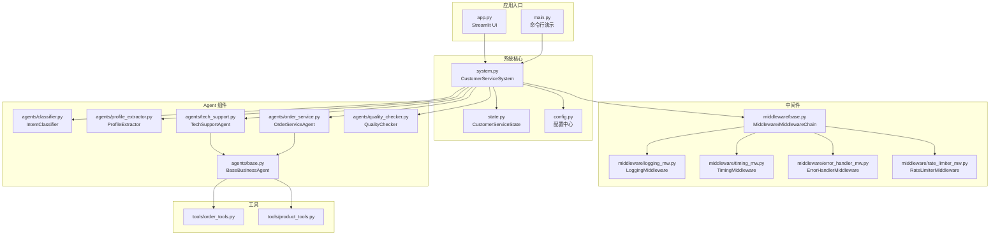
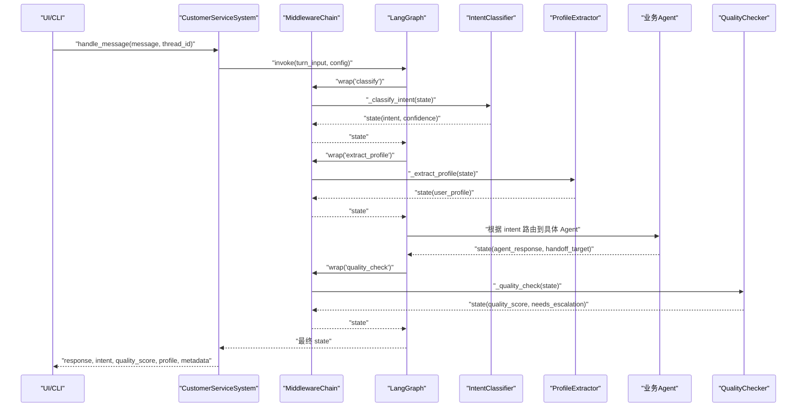
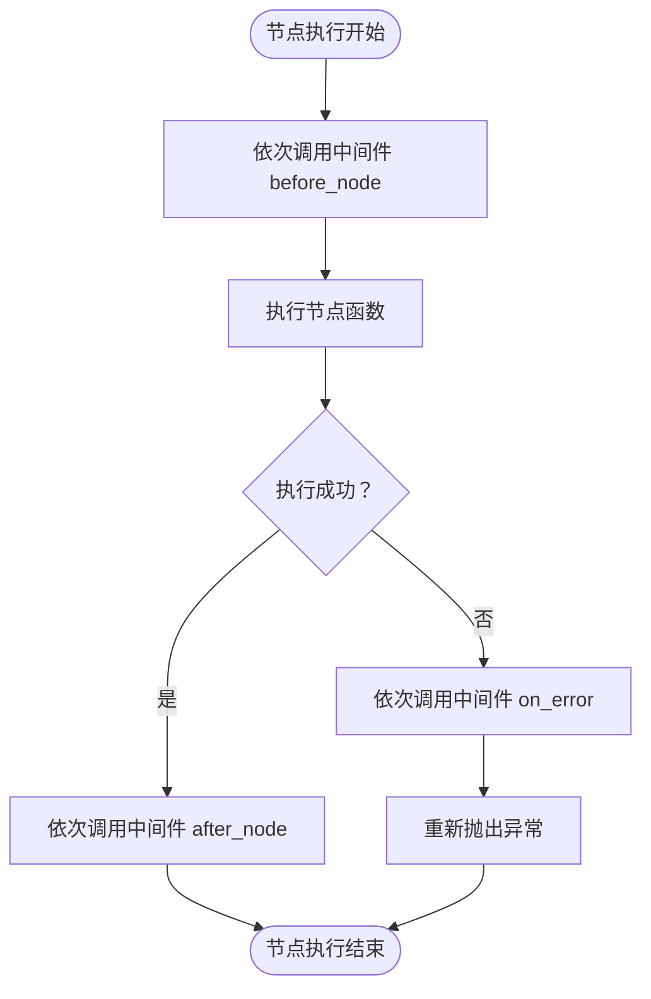
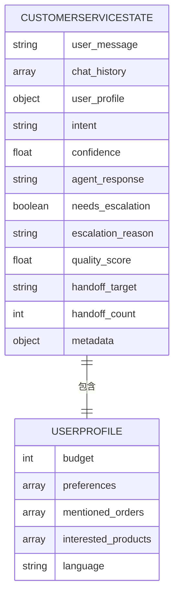
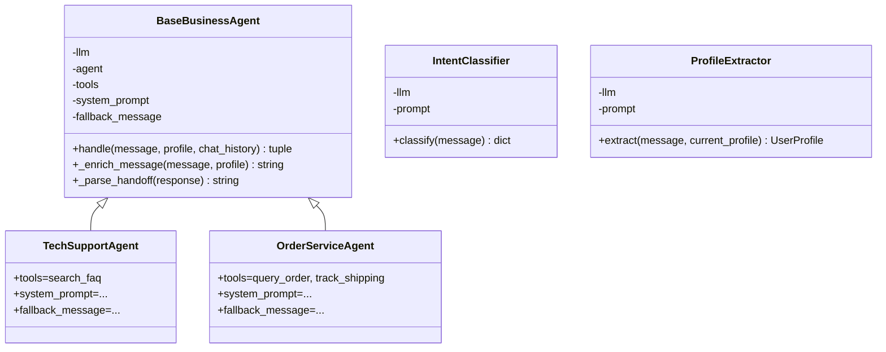
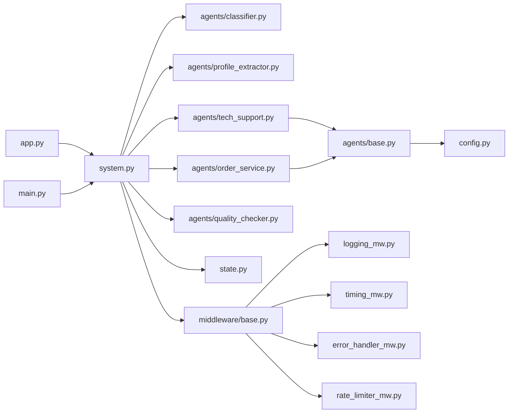

# 组件交互关系

<cite>
**本文引用的文件**
- [system.py](file://system.py)
- [state.py](file://state.py)
- [config.py](file://config.py)
- [app.py](file://app.py)
- [main.py](file://main.py)
- [middleware/base.py](file://middleware/base.py)
- [middleware/logging_mw.py](file://middleware/logging_mw.py)
- [middleware/timing_mw.py](file://middleware/timing_mw.py)
- [middleware/error_handler_mw.py](file://middleware/error_handler_mw.py)
- [middleware/rate_limiter_mw.py](file://middleware/rate_limiter_mw.py)
- [agents/base.py](file://agents/base.py)
- [agents/classifier.py](file://agents/classifier.py)
- [agents/profile_extractor.py](file://agents/profile_extractor.py)
- [agents/tech_support.py](file://agents/tech_support.py)
- [agents/order_service.py](file://agents/order_service.py)
- [tools/order_tools.py](file://tools/order_tools.py)
- [tools/product_tools.py](file://tools/product_tools.py)
- [utils/json_parser.py](file://utils/json_parser.py)
- [utils/tracer.py](file://utils/tracer.py)
</cite>

## 目录
1. [引言](#引言)
2. [项目结构](#项目结构)
3. [核心组件](#核心组件)
4. [架构总览](#架构总览)
5. [详细组件分析](#详细组件分析)
6. [依赖分析](#依赖分析)
7. [性能考虑](#性能考虑)
8. [故障排查指南](#故障排查指南)
9. [结论](#结论)
10. [附录](#附录)

## 引言
本文件面向多智能体客服系统，聚焦 CustomerServiceSystem 主类与其内部 Agent 组件（IntentClassifier、ProfileExtractor、TechSupportAgent、OrderServiceAgent、ProductConsultAgent 等）之间的依赖关系与调用流程，系统性阐述中间件链在组件交互中的作用与执行顺序，说明状态管理组件与 Agent 的协作机制、状态传递与更新方式，并详细描述错误处理、性能监控、限流等横切关注点如何通过中间件系统实现。同时解释配置管理对组件行为的影响与参数传递机制，最后提供组件交互的时序图与调用链分析，帮助开发者快速理解系统的整体运行机制与协作模式。

## 项目结构
系统采用“主控制器 + LangGraph 工作流 + 中间件链 + Agent 组件 + 工具 + 状态模型”的分层组织方式：
- 主控制器：CustomerServiceSystem 负责构建与编译 LangGraph 工作流，协调节点执行与状态持久化。
- 中间件链：MiddlewareChain 将日志、计时、异常捕获、限流等横切关注点注入到每个节点函数执行前后。
- Agent 组件：意图分类、画像提取、业务 Agent（技术、订单、产品）、质量检查等。
- 工具模块：订单与产品相关的检索工具，供业务 Agent 使用。
- 状态模型：CustomerServiceState 定义跨轮次共享的状态字段。
- 配置中心：集中管理模型实例、阈值、持久化路径与语言策略。
- UI/入口：Streamlit Web UI 与命令行入口，分别演示与交互。

图表来源
- [system.py:34-305](file://system.py#L34-L305)
- [state.py:28-58](file://state.py#L28-L58)
- [config.py:14-60](file://config.py#L14-L60)
- [middleware/base.py:46-94](file://middleware/base.py#L46-L94)
- [middleware/logging_mw.py:32-123](file://middleware/logging_mw.py#L32-L123)
- [middleware/timing_mw.py:13-55](file://middleware/timing_mw.py#L13-L55)
- [middleware/error_handler_mw.py:27-65](file://middleware/error_handler_mw.py#L27-L65)
- [middleware/rate_limiter_mw.py:60-94](file://middleware/rate_limiter_mw.py#L60-L94)
- [agents/base.py:23-123](file://agents/base.py#L23-L123)
- [agents/classifier.py:19-63](file://agents/classifier.py#L19-L63)
- [agents/profile_extractor.py:17-92](file://agents/profile_extractor.py#L17-L92)
- [agents/tech_support.py:11-29](file://agents/tech_support.py#L11-L29)
- [agents/order_service.py:11-29](file://agents/order_service.py#L11-L29)

章节来源
- [system.py:34-305](file://system.py#L34-L305)
- [state.py:28-58](file://state.py#L28-L58)
- [config.py:14-60](file://config.py#L14-L60)

## 核心组件
- CustomerServiceSystem：系统主控制器，负责实例化各 Agent、构建中间件链、编译 LangGraph 工作流、处理消息与状态持久化。
- 中间件链：MiddlewareChain 将多个中间件按注册顺序串联，为每个节点函数注入 before/after/on_error 钩子，实现横切关注点的统一管理。
- Agent 组件：
  - IntentClassifier：意图分类，输出 intent 与置信度。
  - ProfileExtractor：从消息中抽取用户画像字段并与已有画像合并。
  - BaseBusinessAgent：业务 Agent 基类，封装 LLM + tools 的调用、手 off 解析与个性化提示注入。
  - TechSupportAgent/OrderServiceAgent/ProductConsultAgent：具体业务 Agent，绑定相应工具集与系统提示。
  - QualityChecker：质量检查，决定是否需要升级。
- 工具模块：订单与产品相关的检索工具，供业务 Agent 使用。
- 状态模型：CustomerServiceState 定义工作流共享状态，支持跨轮次累积 user_profile 并通过 Checkpointer 持久化。
- 配置中心：集中管理 LLM 模型实例、阈值、数据库路径与语言策略。

章节来源
- [system.py:43-76](file://system.py#L43-L76)
- [middleware/base.py:46-94](file://middleware/base.py#L46-L94)
- [agents/base.py:23-123](file://agents/base.py#L23-L123)
- [agents/classifier.py:19-63](file://agents/classifier.py#L19-L63)
- [agents/profile_extractor.py:17-92](file://agents/profile_extractor.py#L17-L92)
- [state.py:28-58](file://state.py#L28-L58)
- [config.py:14-60](file://config.py#L14-L60)

## 架构总览
系统采用 LangGraph 编排，CustomerServiceSystem 作为主控制器，将中间件链 wrap 的节点函数注册到图中，形成如下典型流程：
- 起点 → 意图分类 → 画像提取 → 条件路由 → 业务 Agent → 质量检查 → 条件路由 → 响应/升级 → 结束。
- 中间件链在每个节点执行前后穿插日志、计时、异常捕获与限流逻辑，确保可观测性与稳定性。

图表来源
- [system.py:250-299](file://system.py#L250-L299)
- [system.py:196-246](file://system.py#L196-L246)
- [middleware/base.py:63-94](file://middleware/base.py#L63-L94)
- [agents/classifier.py:40-63](file://agents/classifier.py#L40-L63)
- [agents/profile_extractor.py:41-56](file://agents/profile_extractor.py#L41-L56)
- [agents/base.py:41-66](file://agents/base.py#L41-L66)
- [agents/quality_checker.py](file://agents/quality_checker.py)

## 详细组件分析

### CustomerServiceSystem 主类
- 职责
  - 实例化各 Agent 与中间件，构建并编译 LangGraph 工作流。
  - 提供 handle_message 对外接口，封装每轮输入字段重置、thread_id 配置与结果组装。
  - 通过 Checkpointer 按 thread_id 恢复/保存状态，实现 user_profile 跨轮累积。
- 关键点
  - 中间件链顺序：日志 → 计时 → 异常捕获 → 限流。
  - 节点函数通过 wrap 注入中间件，确保每个节点均受横切关注点影响。
  - 条件路由：依据置信度与意图决定业务 Agent 或直接升级。
  - handoff 机制：业务 Agent 可返回 [HANDOFF:target] 标记，系统进行目标 Agent 转发并再次质量检查。
- 状态管理
  - 每轮重置“请求级”字段（如 intent、quality_score、needs_escalation 等），user_profile 由 Checkpointer 跨轮保留。
  - metadata 中记录 trace 与 node_timings，便于 UI 展示与性能分析。

章节来源
- [system.py:43-76](file://system.py#L43-L76)
- [system.py:196-246](file://system.py#L196-L246)
- [system.py:250-299](file://system.py#L250-L299)

### 中间件链与执行顺序
- MiddlewareChain.wrap(node_name, node_fn) 将节点函数包装为：
  - before_node：在节点执行前依次调用所有中间件的前置钩子。
  - 执行节点函数，若抛出异常则调用 on_error 钩子并重新抛出。
  - after_node：在节点执行后依次调用所有中间件的后置钩子。
- 执行顺序（注册顺序即执行顺序）：
  - LoggingMiddleware：结构化日志与 trace 记录。
  - TimingMiddleware：统计节点耗时并写入 metadata。
  - ErrorHandlerMiddleware：异常捕获与 fallback 回复设置。
  - RateLimiterMiddleware：对包含 LLM 调用的节点进行令牌桶限流。
- 影响范围
  - 所有通过 wrap 注册的节点（classify、extract_profile、tech_support、order_service、product_consult、quality_check、escalate、escalate_final、handoff_route）均受上述顺序影响。

图表来源
- [middleware/base.py:63-94](file://middleware/base.py#L63-L94)

章节来源
- [middleware/base.py:46-94](file://middleware/base.py#L46-L94)
- [middleware/logging_mw.py:32-123](file://middleware/logging_mw.py#L32-L123)
- [middleware/timing_mw.py:13-55](file://middleware/timing_mw.py#L13-L55)
- [middleware/error_handler_mw.py:27-65](file://middleware/error_handler_mw.py#L27-L65)
- [middleware/rate_limiter_mw.py:60-94](file://middleware/rate_limiter_mw.py#L60-L94)

### 状态管理与跨轮累积
- 状态模型 CustomerServiceState
  - 字段覆盖：用户消息、历史、画像、意图、置信度、Agent 回复、升级标记、质量评分、handoff 目标与次数、metadata。
  - user_profile 为可选字段集合，随对话逐步填充，跨轮次通过 Checkpointer 保留。
- 状态传递与更新
  - 每轮输入仅重置“请求级”字段，user_profile 由 Checkpointer 恢复并在节点中更新。
  - 节点函数读取 state 的部分字段，处理后写回，下一节点据此继续。
- 查询与可视化
  - get_profile 通过 graph.get_state(config) 查询当前 thread 的 user_profile，供 UI 展示。

图表来源
- [state.py:28-58](file://state.py#L28-L58)

章节来源
- [state.py:14-58](file://state.py#L14-L58)
- [system.py:300-305](file://system.py#L300-L305)

### 错误处理、性能监控与限流
- 错误处理
  - ErrorHandlerMiddleware：对可恢复节点（tech_support、order_service、product_consult、quality_check、extract_profile）在 on_error 中设置 fallback 回复与升级标记，避免节点异常导致工作流中断。
- 性能监控
  - TimingMiddleware：记录节点耗时并写入 metadata.node_timings，便于 UI 展示与性能分析。
- 限流
  - RateLimiterMiddleware：对包含 LLM 调用的节点（classify、extract_profile、tech_support、order_service、product_consult、quality_check）实施令牌桶限流，防止 API 速率超限。
- 日志与追踪
  - LoggingMiddleware：统一结构化日志输出，记录节点开始/结束、摘要信息与异常详情，并写入 metadata.trace，供 UI 展示调用链。

章节来源
- [middleware/error_handler_mw.py:27-65](file://middleware/error_handler_mw.py#L27-L65)
- [middleware/timing_mw.py:13-55](file://middleware/timing_mw.py#L13-L55)
- [middleware/rate_limiter_mw.py:60-94](file://middleware/rate_limiter_mw.py#L60-L94)
- [middleware/logging_mw.py:32-123](file://middleware/logging_mw.py#L32-L123)
- [utils/tracer.py](file://utils/tracer.py)

### 配置管理与参数传递
- 配置中心 config.py
  - 加载环境变量与 LLM 模型实例（共享），统一业务阈值（MIN_INTENT_CONFIDENCE、MIN_QUALITY_SCORE）、持久化路径与语言策略。
- 参数传递
  - CustomerServiceSystem 将 thread_id 通过 configurable 传递给 Checkpointer，实现按会话维度的状态持久化。
  - Agent 基类 BaseBusinessAgent 将 user_profile 注入到系统提示中，实现个性化回复。
  - IntentClassifier 与 ProfileExtractor 使用 JSON 解析工具安全解析 LLM 输出，避免解析失败导致流程中断。

章节来源
- [config.py:14-60](file://config.py#L14-L60)
- [system.py:286-288](file://system.py#L286-L288)
- [agents/base.py:67-99](file://agents/base.py#L67-L99)
- [agents/classifier.py:50-62](file://agents/classifier.py#L50-L62)
- [agents/profile_extractor.py:51-55](file://agents/profile_extractor.py#L51-L55)
- [utils/json_parser.py](file://utils/json_parser.py)

### Agent 组件交互与手 off 机制
- IntentClassifier 与 ProfileExtractor
  - 作为上游节点，分别提供 intent/confidence 与 user_profile，驱动下游路由与个性化回复。
- BaseBusinessAgent
  - 统一封装 create_agent、工具集成与 handoff 解析，子类仅需声明 tools、system_prompt、fallback_message。
  - _enrich_message 将 user_profile 拼接到用户消息前，支持多语言指令注入。
  - _parse_handoff 从回复中解析 [HANDOFF:target] 标记，触发 handoff_route 节点。
- 业务 Agent
  - TechSupportAgent：绑定 search_faq 工具，专注技术问题与 FAQ 查询。
  - OrderServiceAgent：绑定 query_order、track_shipping 工具，专注订单与物流。
- 质量检查
  - QualityChecker 根据回复质量决定是否升级，或在 handoff 后再次触发质量检查。

图表来源
- [agents/base.py:23-123](file://agents/base.py#L23-L123)
- [agents/tech_support.py:11-29](file://agents/tech_support.py#L11-L29)
- [agents/order_service.py:11-29](file://agents/order_service.py#L11-L29)
- [agents/classifier.py:19-63](file://agents/classifier.py#L19-L63)
- [agents/profile_extractor.py:17-92](file://agents/profile_extractor.py#L17-L92)

章节来源
- [agents/base.py:23-123](file://agents/base.py#L23-L123)
- [agents/tech_support.py:11-29](file://agents/tech_support.py#L11-L29)
- [agents/order_service.py:11-29](file://agents/order_service.py#L11-L29)
- [agents/classifier.py:19-63](file://agents/classifier.py#L19-L63)
- [agents/profile_extractor.py:17-92](file://agents/profile_extractor.py#L17-L92)

### UI 与入口：Streamlit 与命令行
- Streamlit UI（app.py）
  - 初始化系统实例与会话状态，支持 thread_id 管理、新建会话、用户画像展示、处理摘要与调用链追踪。
  - 调用 system.handle_message 获取结果并渲染界面。
- 命令行入口（main.py）
  - 提供测试用例、多轮对话演示与交互式对话循环，验证系统行为与画像累积效果。

章节来源
- [app.py:16-177](file://app.py#L16-L177)
- [main.py:70-148](file://main.py#L70-L148)

## 依赖分析
- 组件耦合与内聚
  - CustomerServiceSystem 与 Agent 之间为松耦合：通过接口（handle、classify、extract）与状态共享实现协作。
  - Agent 与工具之间为弱耦合：工具通过 LangChain Agent 接口注入，便于替换与扩展。
  - 中间件链与节点函数之间为强横切：通过 wrap 注入，不改变节点内部逻辑。
- 直接与间接依赖
  - system.py 直接依赖 agents/*、middleware/*、state.py、config.py。
  - agents/base.py 依赖 config.model 与 state.UserProfile。
  - tools/* 由 agents/* 使用，通过 LangChain Agent 接口调用。
  - app.py/main.py 依赖 system.py 与 utils/*。
- 外部依赖与集成点
  - LangGraph：工作流编排与 Checkpointer。
  - LangChain：Agent 创建、提示模板与输出解析。
  - SQLite：状态持久化（SqliteSaver 回退 InMemorySaver）。
  - Streamlit：Web UI 展示。

图表来源
- [system.py:17-31](file://system.py#L17-L31)
- [agents/base.py:19-39](file://agents/base.py#L19-L39)
- [middleware/base.py:46-94](file://middleware/base.py#L46-L94)

章节来源
- [system.py:17-31](file://system.py#L17-L31)
- [agents/base.py:19-39](file://agents/base.py#L19-L39)
- [middleware/base.py:46-94](file://middleware/base.py#L46-L94)

## 性能考虑
- 限流策略
  - 对包含 LLM 调用的节点启用令牌桶限流，避免 API 速率超限导致失败与延迟。
- 节点耗时统计
  - 通过 TimingMiddleware 将各节点耗时写入 metadata.node_timings，便于定位瓶颈。
- 日志与追踪
  - LoggingMiddleware 记录 trace，结合 UI 展示节点耗时与状态摘要，辅助性能分析。
- 状态持久化
  - Checkpointer 按 thread_id 保存状态，减少重复计算与上下文重建成本。

章节来源
- [middleware/rate_limiter_mw.py:60-94](file://middleware/rate_limiter_mw.py#L60-L94)
- [middleware/timing_mw.py:13-55](file://middleware/timing_mw.py#L13-L55)
- [middleware/logging_mw.py:32-123](file://middleware/logging_mw.py#L32-L123)
- [system.py:66-75](file://system.py#L66-L75)

## 故障排查指南
- 异常捕获与兜底
  - 若节点抛出异常，ErrorHandlerMiddleware 会在可恢复节点上设置 fallback 回复与升级标记，随后工作流仍会抛出异常，但下游可基于 state 做进一步处理。
- 限流超时
  - RateLimiterMiddleware 在等待令牌超过阈值时抛出异常，提示降低调用频率。
- 日志与追踪
  - 通过 LoggingMiddleware 的 trace 与 UI 展示的节点耗时，定位异常节点与耗时热点。
- 配置校验
  - 确认 config.py 中 LLM API Key 有效，否则初始化将报错。

章节来源
- [middleware/error_handler_mw.py:27-65](file://middleware/error_handler_mw.py#L27-L65)
- [middleware/rate_limiter_mw.py:60-94](file://middleware/rate_limiter_mw.py#L60-L94)
- [middleware/logging_mw.py:32-123](file://middleware/logging_mw.py#L32-L123)
- [config.py:20-27](file://config.py#L20-L27)

## 结论
本系统通过 CustomerServiceSystem 将意图分类、画像提取、业务 Agent、质量检查与升级等环节以 LangGraph 工作流串联，借助中间件链实现日志、计时、异常捕获与限流等横切关注点的统一治理。状态模型与 Checkpointer 保障 user_profile 的跨轮累积与一致性，配置中心集中管理模型与阈值，Agent 组件通过基类抽象实现高度一致的行为与灵活扩展。该设计在保证系统稳定性与可观测性的同时，提供了清晰的组件边界与可维护的协作模式。

## 附录
- 关键流程时序图（调用链）
  - 从 UI/CLI 到 CustomerServiceSystem.handle_message，再到 LangGraph 节点执行与中间件链的完整调用链，详见“架构总览”中的序列图。
- 状态字段说明
  - 详见 CustomerServiceState 与 UserProfile 的字段定义与语义说明。
- 配置项速览
  - LLM 模型实例、阈值（MIN_INTENT_CONFIDENCE、MIN_QUALITY_SCORE）、持久化路径、语言策略等。