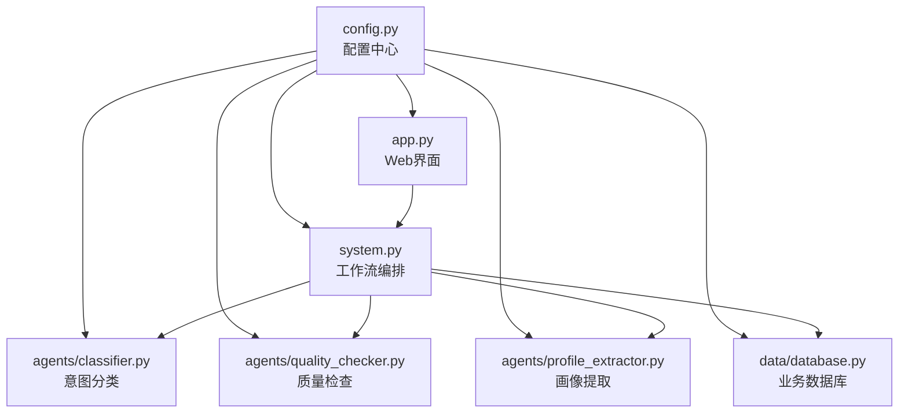
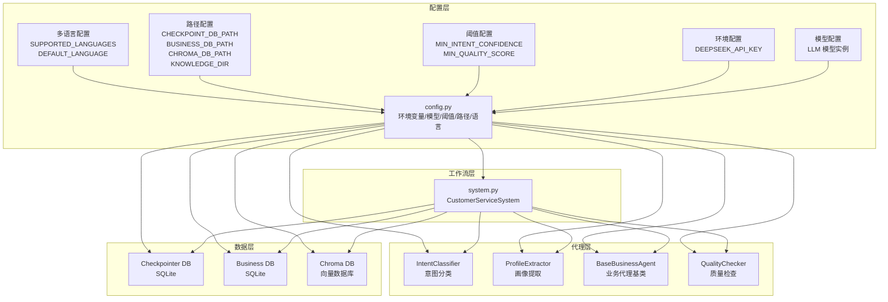
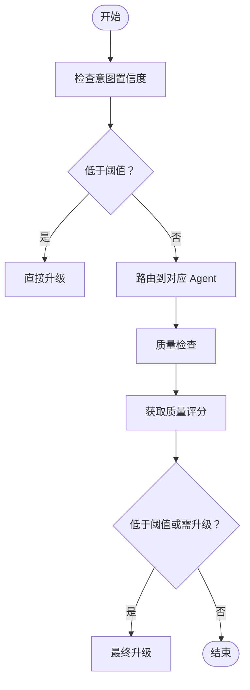
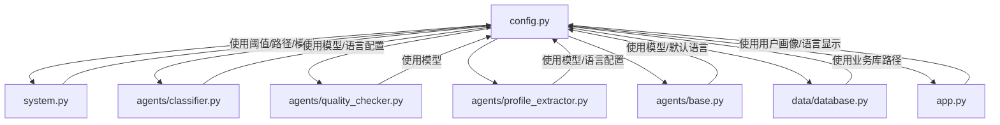

# 配置管理中心

<cite>
**本文引用的文件**
- [config.py](file://config.py)
- [system.py](file://system.py)
- [agents/base.py](file://agents/base.py)
- [agents/classifier.py](file://agents/classifier.py)
- [agents/profile_extractor.py](file://agents/profile_extractor.py)
- [state.py](file://state.py)
- [app.py](file://app.py)
- [README.md](file://README.md)
- [requirements.txt](file://requirements.txt)
- [data/database.py](file://data/database.py)
- [.gitignore](file://.gitignore)
</cite>

## 更新摘要
**变更内容**
- 新增多语言支持配置区域，包括 SUPPORTED_LANGUAGES 和 DEFAULT_LANGUAGE
- 增强了语言处理机制，支持中文(zh)、英语(en)、日语(ja)、韩语(ko)
- 更新了用户画像中的语言字段定义
- 扩展了意图分类器的语言检测能力
- 增强了业务代理的语言偏好处理

## 目录
1. [简介](#简介)
2. [项目结构](#项目结构)
3. [核心组件](#核心组件)
4. [架构总览](#架构总览)
5. [详细组件分析](#详细组件分析)
6. [依赖分析](#依赖分析)
7. [性能考虑](#性能考虑)
8. [故障排查指南](#故障排查指南)
9. [结论](#结论)
10. [附录](#附录)

## 简介
本文件面向多智能体客服系统的"配置管理中心"，围绕 config.py 中的配置项进行系统化说明，涵盖以下主题：
- 业务阈值（MIN_INTENT_CONFIDENCE、MIN_QUALITY_SCORE）的设定原理与调优建议
- 系统路径（CHECKPOINT_DB_PATH、BUSINESS_DB_PATH、CHROMA_DB_PATH、KNOWLEDGE_DIR）的作用与部署注意事项
- 环境变量（DEEPSEEK_API_KEY）的使用方式与配置加载机制
- **新增** 多语言支持配置（SUPPORTED_LANGUAGES、DEFAULT_LANGUAGE）及其在系统中的应用
- 配置项之间的相互关系与依赖影响（如阈值如何影响路由与升级策略）
- 配置最佳实践与典型场景
- 配置文件结构说明与新增配置项的添加方法
- 不同环境（开发、测试、生产）的差异化设置策略

## 项目结构
配置中心位于 config.py，负责集中管理环境变量、LLM 模型初始化、业务阈值常量、持久化路径以及**多语言配置**。系统其他模块通过导入这些常量参与运行时决策。

**图表来源**
- [config.py:1-75](file://config.py#L1-L75)
- [system.py:23-31](file://system.py#L23-L31)
- [agents/classifier.py:15](file://agents/classifier.py#L15)
- [agents/profile_extractor.py:12](file://agents/profile_extractor.py#L12)
- [data/database.py:18](file://data/database.py#L18)
- [app.py:10](file://app.py#L10)

**章节来源**
- [config.py:1-75](file://config.py#L1-L75)
- [system.py:23-31](file://system.py#L23-L31)

## 核心组件
本节逐项解析 config.py 中的关键配置项及其作用。

### 环境变量与模型初始化
- 环境变量加载：通过环境变量注入 API Key，用于初始化 LLM 模型实例。
- 模型实例：全局共享，避免重复创建，统一由 config.py 提供。
- 配置加载机制：使用环境变量加载库读取 .env 文件，若未设置或为占位符则抛出错误。

**章节来源**
- [config.py:14-31](file://config.py#L14-L31)
- [README.md:77-83](file://README.md#L77-L83)

### 业务阈值
- MIN_INTENT_CONFIDENCE：意图识别置信度下限，低于该值直接转人工。
- MIN_QUALITY_SCORE：回复质量评分下限，低于该值触发升级。
- 作用范围：系统路由与质量检查节点均依赖这两个阈值进行决策。

**章节来源**
- [config.py:33-39](file://config.py#L33-L39)
- [system.py:159-169](file://system.py#L159-L169)
- [system.py:134-146](file://system.py#L134-L146)

### 持久化路径
- CHECKPOINT_DB_PATH：LangGraph Checkpointer 使用的 SQLite 数据库路径，用于跨轮次状态持久化。
- BUSINESS_DB_PATH：业务数据库（订单/产品/FAQ）的 SQLite 路径。
- CHROMA_DB_PATH：Chroma 向量数据库的持久化路径，用于 RAG 功能。
- KNOWLEDGE_DIR：知识库文档目录，存储产品、政策、技术 FAQ 等文档。
- 部署注意事项：确保路径存在且具备读写权限；生产环境建议使用独立磁盘与备份策略。

**章节来源**
- [config.py:41-66](file://config.py#L41-L66)
- [system.py:66-75](file://system.py#L66-L75)
- [data/database.py:87](file://data/database.py#L87)

### 多语言配置
- SUPPORTED_LANGUAGES：支持的语言列表，当前包含中文(zh)、英语(en)、日语(ja)、韩语(ko)。
- DEFAULT_LANGUAGE：默认回复语言，当前设置为中文(zh)。
- 影响范围：与意图分类、质量检查、用户画像提取等模块的多语言评估逻辑配合。
- 语言处理机制：系统能够检测用户消息的语言代码，并在业务代理回复中自动切换语言。

**更新** 新增多语言支持配置区域，增强了系统的国际化能力

**章节来源**
- [config.py:68-75](file://config.py#L68-L75)

## 架构总览
配置中心在系统中的位置与交互如下：

**图表来源**
- [config.py:14-75](file://config.py#L14-L75)
- [system.py:23-31](file://system.py#L23-L31)
- [data/database.py:87](file://data/database.py#L87)

## 详细组件分析

### 业务阈值：MIN_INTENT_CONFIDENCE 与 MIN_QUALITY_SCORE
- 设定原理
  - MIN_INTENT_CONFIDENCE 控制"意图分类"阶段的路由决策：当置信度低于阈值时，直接进入人工升级路径，避免错误路由导致的体验劣化。
  - MIN_QUALITY_SCORE 控制"质量检查"阶段的升级决策：当评分低于阈值或质量检查明确要求升级时，触发最终升级。
- 调优建议
  - 开发/测试：可适度降低阈值以提升自动化率，便于快速验证流程；同时记录误判样本，逐步提高阈值。
  - 生产：建议以 A/B 实验方式微调，结合人工审核与用户反馈，平衡自动化率与准确率。
  - 与质量检查联动：若质量检查本身较为严格，可适当提高 MIN_QUALITY_SCORE 以减少误升级；反之亦然。
- 决策流程示意

**图表来源**
- [system.py:159-169](file://system.py#L159-L169)
- [system.py:134-146](file://system.py#L134-L146)

**章节来源**
- [system.py:159-169](file://system.py#L159-L169)
- [system.py:134-146](file://system.py#L134-L146)

### 系统路径：CHECKPOINT_DB_PATH、BUSINESS_DB_PATH、CHROMA_DB_PATH、KNOWLEDGE_DIR
- 作用
  - CHECKPOINT_DB_PATH：LangGraph Checkpointer 使用的 SQLite 数据库，用于跨轮次状态持久化（会话状态、用户画像等）。
  - BUSINESS_DB_PATH：业务数据库（订单、产品、FAQ）的 SQLite 数据库，供工具层查询使用。
  - CHROMA_DB_PATH：Chroma 向量数据库的持久化目录，用于 RAG 功能的向量检索。
  - KNOWLEDGE_DIR：知识库文档目录，存储产品、政策、技术 FAQ 等文档，供 RAG 系统使用。
- 部署注意事项
  - 权限：确保运行账户对数据目录具有读写权限。
  - 存储：生产环境建议使用独立磁盘与定期备份，避免单点故障。
  - 路径：使用相对路径时需确认工作目录；生产环境建议使用绝对路径。
  - 磁盘空间：RAG 功能需要足够的磁盘空间存储向量数据库。
- 依赖关系
  - system.py 在初始化 Checkpointer 时读取 CHECKPOINT_DB_PATH，并在失败时回退到内存存储。
  - data/database.py 在创建引擎时读取 BUSINESS_DB_PATH。
  - RAG 模块在初始化时读取 CHROMA_DB_PATH 和 KNOWLEDGE_DIR。

**章节来源**
- [config.py:41-66](file://config.py#L41-L66)
- [system.py:66-75](file://system.py#L66-L75)
- [data/database.py:87](file://data/database.py#L87)

### 环境变量：DEEPSEEK_API_KEY
- 使用方式
  - 通过环境变量注入 API Key，config.py 加载后初始化 LLM 模型实例。
  - 若未设置或仍为占位符，将抛出错误，阻止系统继续启动。
- 配置加载机制
  - 使用环境变量加载库读取 .env 文件；.env 文件被纳入忽略清单，避免误提交。
- 安全建议
  - 生产环境建议使用密钥管理服务或容器注入，避免硬编码。

**章节来源**
- [config.py:14-31](file://config.py#L14-L31)
- [.gitignore:1-8](file://.gitignore#L1-L8)
- [README.md:77-83](file://README.md#L77-L83)

### 多语言配置：SUPPORTED_LANGUAGES 与 DEFAULT_LANGUAGE
- 作用
  - SUPPORTED_LANGUAGES 定义系统支持的语言集合，当前包含中文(zh)、英语(en)、日语(ja)、韩语(ko)。
  - DEFAULT_LANGUAGE 定义默认回复语言，当前设置为中文(zh)。
  - 与意图分类器配合，能够检测用户消息的语言代码并在回复中保持一致性。
- 影响范围
  - 影响用户画像中的语言偏好记录与后续回复语言选择。
  - 影响业务代理在处理用户消息时的语言偏好指令。
  - 影响 Web 界面中用户画像的语言显示。
- 调优建议
  - 根据用户群体分布调整支持语言与默认语言，确保多语言评估的准确性。
  - 可以通过扩展 SUPPORTED_LANGUAGES 列表来支持更多语言。
  - 注意语言代码的标准格式（ISO 639-1），确保与 LLM 的语言处理兼容。

**更新** 新增多语言配置区域，增强了系统的国际化支持

**章节来源**
- [config.py:68-75](file://config.py#L68-L75)
- [agents/classifier.py:33](file://agents/classifier.py#L33)
- [agents/profile_extractor.py:28-32](file://agents/profile_extractor.py#L28-L32)
- [agents/base.py:83-97](file://agents/base.py#L83-L97)
- [state.py:24](file://state.py#L24)
- [app.py:83](file://app.py#L83)

## 依赖分析
配置中心与其他模块的依赖关系如下：

**图表来源**
- [config.py:14-75](file://config.py#L14-L75)
- [system.py:23-31](file://system.py#L23-L31)
- [agents/classifier.py:15](file://agents/classifier.py#L15)
- [agents/profile_extractor.py:12](file://agents/profile_extractor.py#L12)
- [agents/base.py:19](file://agents/base.py#L19)
- [agents/quality_checker.py:12](file://agents/quality_checker.py#L12)
- [data/database.py:18](file://data/database.py#L18)
- [app.py:10](file://app.py#L10)

**章节来源**
- [config.py:14-75](file://config.py#L14-L75)
- [system.py:23-31](file://system.py#L23-L31)

## 性能考虑
- 模型实例复用：config.py 中的模型为全局共享实例，避免重复初始化带来的资源消耗。
- 路由与质量检查：合理设置阈值可减少不必要的 Agent 调用与质量检查次数，从而降低延迟。
- 持久化性能：SQLite 在小规模场景表现良好，生产环境建议评估并发与容量，必要时迁移至更高性能的数据库。
- **新增** 多语言处理：语言检测和转换会增加少量处理开销，但对整体性能影响较小。
- **新增** RAG 功能：向量数据库需要足够的内存和磁盘空间，建议在生产环境配置合适的硬件资源。

## 故障排查指南
- 启动时报错提示未设置 API Key
  - 现象：启动即抛出错误，提示设置有效的 API Key。
  - 排查：确认 .env 文件已正确复制并填写，且未被提交到版本控制。
  - 参考
    - [config.py:20-26](file://config.py#L20-L26)
    - [.gitignore:1-8](file://.gitignore#L1-L8)
- Checkpointer 初始化失败
  - 现象：系统回退到内存存储，跨轮次状态丢失。
  - 排查：检查 CHECKPOINT_DB_PATH 路径是否存在、权限是否足够、磁盘空间是否充足。
  - 参考
    - [system.py:66-75](file://system.py#L66-L75)
    - [config.py:43-46](file://config.py#L43-L46)
- 质量检查频繁触发升级
  - 现象：大量请求被判定为需要人工升级。
  - 排查：检查 MIN_QUALITY_SCORE 设置是否过高，或质量检查提示是否过于严格；结合业务 Agent 的回复质量进行优化。
  - 参考
    - [system.py:134-146](file://system.py#L134-L146)
    - [config.py:38-39](file://config.py#L38-L39)
- **新增** 多语言支持问题
  - 现象：用户消息语言检测不准确或回复语言不符合预期。
  - 排查：检查 SUPPORTED_LANGUAGES 配置是否包含所需语言，确认 DEFAULT_LANGUAGE 设置正确，验证意图分类器的语言检测功能。
  - 参考
    - [config.py:70-74](file://config.py#L70-L74)
    - [agents/classifier.py:33](file://agents/classifier.py#L33)
    - [agents/profile_extractor.py:28-32](file://agents/profile_extractor.py#L28-L32)
    - [agents/base.py:83-97](file://agents/base.py#L83-L97)
- **新增** RAG 功能异常
  - 现象：向量数据库初始化失败或检索结果不准确。
  - 排查：检查 CHROMA_DB_PATH 和 KNOWLEDGE_DIR 路径权限，确认嵌入模型配置正确，验证知识库文档格式。

**章节来源**
- [config.py:20-26](file://config.py#L20-L26)
- [system.py:66-75](file://system.py#L66-L75)
- [config.py:43-46](file://config.py#L43-L46)
- [system.py:134-146](file://system.py#L134-L146)
- [config.py:38-39](file://config.py#L38-L39)
- [config.py:70-74](file://config.py#L70-L74)
- [agents/classifier.py:33](file://agents/classifier.py#L33)
- [agents/profile_extractor.py:28-32](file://agents/profile_extractor.py#L28-L32)
- [agents/base.py:83-97](file://agents/base.py#L83-L97)

## 结论
配置管理中心通过集中管理环境变量、模型实例、业务阈值、持久化路径以及**多语言配置**，为系统提供稳定、可调优的运行基础。新增的多语言支持配置显著增强了系统的国际化能力，支持中文、英语、日语、韩语等多种语言的处理。合理设置阈值与路径、规范环境变量管理，是保障系统在不同环境下一致运行的关键。建议在生产环境中采用严格的密钥管理、路径权限与备份策略，并持续通过 A/B 实验优化阈值以达到最佳用户体验与运营效率。同时，多语言配置应根据实际用户群体进行动态调整，以提供更精准的语言服务。

## 附录

### 配置文件结构说明
- 环境变量区域：加载 .env 并校验 API Key。
- LLM 模型区域：初始化全局共享模型实例。
- 业务阈值区域：定义 MIN_INTENT_CONFIDENCE 与 MIN_QUALITY_SCORE。
- 持久化区域：定义 CHECKPOINT_DB_PATH、BUSINESS_DB_PATH、CHROMA_DB_PATH、KNOWLEDGE_DIR。
- **新增** 多语言区域：定义 SUPPORTED_LANGUAGES 与 DEFAULT_LANGUAGE。

**章节来源**
- [config.py:14-75](file://config.py#L14-L75)

### 新增配置项的添加方法
- 步骤
  - 在 config.py 中新增配置项与注释说明。
  - 在需要使用的模块中导入该配置项。
  - 在 README 或相关文档中补充说明其用途与默认值。
  - 更新相关的类型定义和文档注释。
- 注意事项
  - 避免在运行时修改配置项；如需变更，建议通过环境变量或外部配置文件注入。
  - 对于敏感配置（如 API Key），务必纳入忽略清单并采用安全注入方式。
  - **新增** 多语言配置：确保语言代码符合 ISO 639-1 标准，验证 LLM 对相应语言的支持情况。

**章节来源**
- [config.py:14-75](file://config.py#L14-L75)
- [.gitignore:1-8](file://.gitignore#L1-L8)

### 不同环境的差异化设置策略
- 开发环境
  - 使用较低阈值以提升自动化率，便于快速验证流程。
  - 使用内存或本地 SQLite，便于快速迭代。
  - **新增** 可以简化多语言配置，专注于核心功能验证。
- 测试环境
  - 使用与生产相近的阈值，模拟真实场景。
  - 使用独立的数据目录与数据库，避免污染生产数据。
  - **新增** 在测试环境中验证多语言支持的完整性和准确性。
- 生产环境
  - 严格的安全与权限管理，API Key 通过密钥管理服务注入。
  - 使用独立磁盘与备份策略，监控数据库健康状况。
  - 通过 A/B 实验持续优化阈值，结合人工审核与用户反馈。
  - **新增** 根据用户地域分布调整支持语言，监控各语言版本的性能指标。

**章节来源**
- [config.py:14-31](file://config.py#L14-L31)
- [config.py:41-66](file://config.py#L41-L66)
- [README.md:77-83](file://README.md#L77-L83)

### 多语言配置最佳实践
- 语言支持策略
  - 根据用户地理分布和语言偏好选择支持的语言种类。
  - 优先支持主要业务市场的语言，逐步扩展到次要市场。
  - 定期评估各语言的使用频率和满意度，动态调整支持策略。
- 语言质量保证
  - 确保 LLM 对目标语言有足够的支持和准确性。
  - 建立多语言内容的质量检查机制。
  - 为每种支持的语言准备相应的术语表和回复模板。
- 用户体验优化
  - 在用户画像中准确记录用户的语言偏好。
  - 提供语言切换功能，允许用户手动选择偏好语言。
  - 在 Web 界面中清晰显示当前会话的语言状态。

**新增** 多语言配置的最佳实践指导

**章节来源**
- [config.py:68-75](file://config.py#L68-L75)
- [agents/classifier.py:33](file://agents/classifier.py#L33)
- [agents/profile_extractor.py:28-32](file://agents/profile_extractor.py#L28-L32)
- [agents/base.py:83-97](file://agents/base.py#L83-L97)
- [state.py:24](file://state.py#L24)
- [app.py:83](file://app.py#L83)