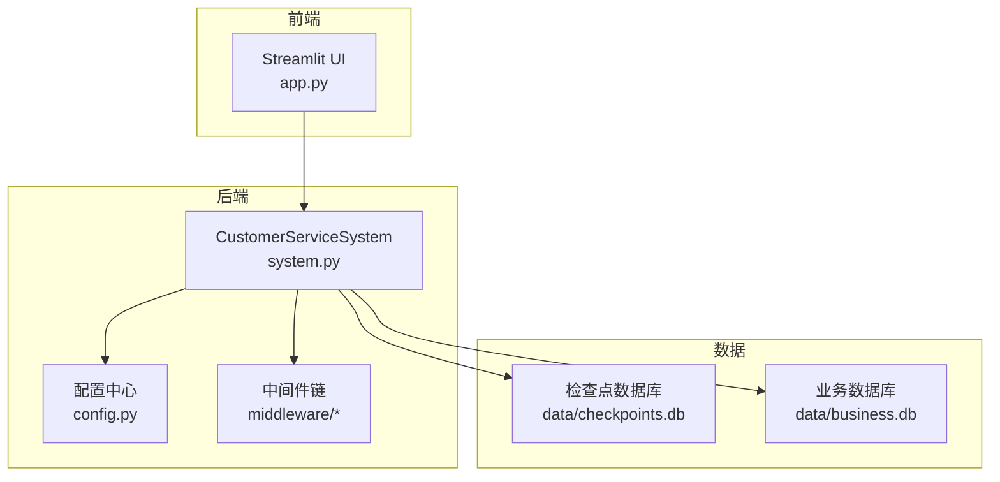
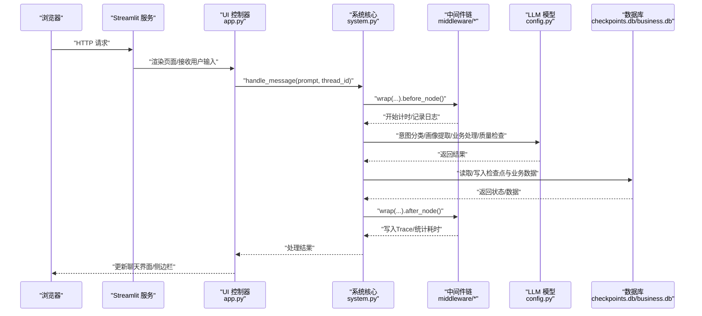
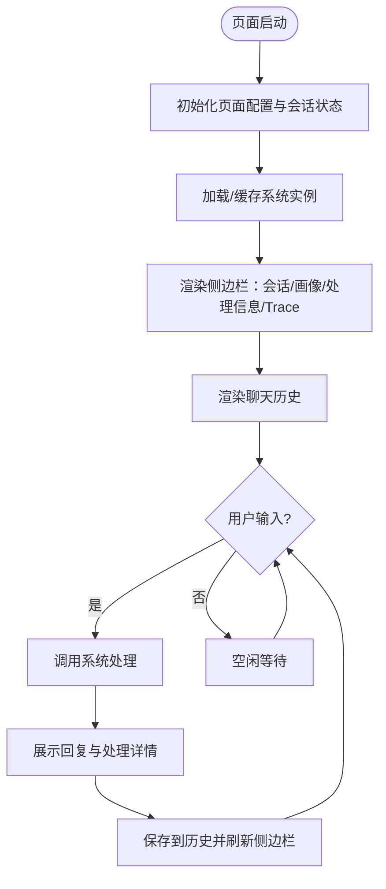
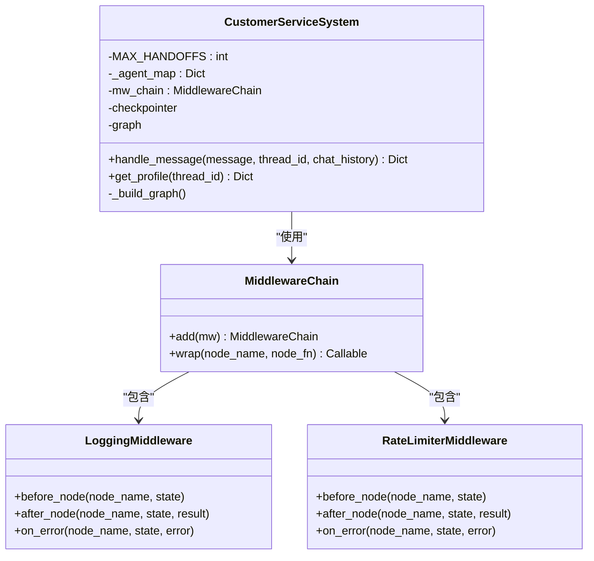
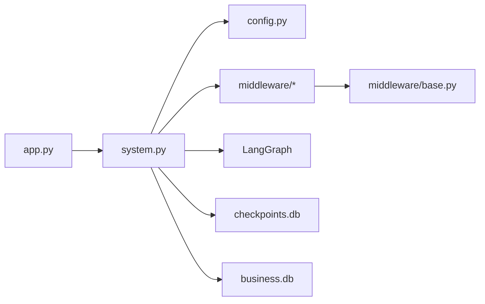

# Web界面部署

<cite>
**本文引用的文件**
- [app.py](file://app.py)
- [main.py](file://main.py)
- [config.py](file://config.py)
- [requirements.txt](file://requirements.txt)
- [README.md](file://README.md)
- [system.py](file://system.py)
- [middleware/base.py](file://middleware/base.py)
- [middleware/logging_mw.py](file://middleware/logging_mw.py)
- [middleware/rate_limiter_mw.py](file://middleware/rate_limiter_mw.py)
- [.gitignore](file://.gitignore)
</cite>

## 目录
1. [简介](#简介)
2. [项目结构](#项目结构)
3. [核心组件](#核心组件)
4. [架构总览](#架构总览)
5. [详细组件分析](#详细组件分析)
6. [依赖关系分析](#依赖关系分析)
7. [性能考虑](#性能考虑)
8. [故障排查指南](#故障排查指南)
9. [结论](#结论)
10. [附录](#附录)

## 简介
本指南面向部署基于 Streamlit 的 Web 界面，涵盖本地开发服务器启动、生产环境部署（含 Streamlit Cloud、Docker 容器化）、静态资源与媒体处理、Nginx 反向代理与 SSL、负载均衡与高可用、以及性能优化与缓存策略。文档同时结合项目现有代码结构，给出可落地的实施建议。

## 项目结构
该项目采用“功能模块化 + 层次清晰”的组织方式：
- 应用入口与 UI：app.py 提供 Streamlit 聊天界面；main.py 提供命令行演示入口。
- 核心系统：system.py 封装 LangGraph 工作流、中间件链与持久化。
- 配置中心：config.py 负责环境变量、模型初始化、阈值与数据库路径。
- 中间件层：middleware/* 提供日志、计时、异常捕获、限流等横切能力。
- 依赖声明：requirements.txt 明确运行所需包。
- 文档与快速开始：README.md 包含技术栈、快速开始与项目结构说明。

图表来源
- [app.py:1-177](file://app.py#L1-L177)
- [system.py:1-305](file://system.py#L1-L305)
- [config.py:1-60](file://config.py#L1-L60)

章节来源
- [README.md:95-133](file://README.md#L95-L133)
- [requirements.txt:1-15](file://requirements.txt#L1-L15)

## 核心组件
- Streamlit Web UI（app.py）
  - 初始化页面配置、会话状态、系统实例。
  - 提供侧边栏会话设置、用户画像、处理信息与调用链追踪。
  - 主聊天区支持多轮对话、结果展示与详情展开。
- 客户服务系统（system.py）
  - 基于 LangGraph 的工作流编排：意图分类 → 画像提取 → 业务 Agent → 质量检查 → 响应/升级。
  - 中间件链：日志、计时、异常捕获、限流。
  - 持久化：优先 SqliteSaver，失败回退 InMemorySaver。
- 配置中心（config.py）
  - 环境变量加载与校验（如 DEEPSEEK_API_KEY）。
  - LLM 模型初始化（共享实例）。
  - 业务阈值与数据库路径。
- 中间件（middleware/*）
  - MiddlewareChain.wrap 将横切逻辑注入节点执行前后与异常路径。
  - LoggingMiddleware 输出结构化日志并写入 Trace。
  - RateLimiterMiddleware 对含 LLM 的节点进行令牌桶限流。

章节来源
- [app.py:14-177](file://app.py#L14-L177)
- [system.py:34-305](file://system.py#L34-L305)
- [config.py:14-60](file://config.py#L14-L60)
- [middleware/base.py:46-94](file://middleware/base.py#L46-L94)
- [middleware/logging_mw.py:32-123](file://middleware/logging_mw.py#L32-L123)
- [middleware/rate_limiter_mw.py:60-94](file://middleware/rate_limiter_mw.py#L60-L94)

## 架构总览
下图展示了从浏览器到后端服务、再到 LLM 与数据库的典型调用链，以及中间件如何贯穿节点执行。

图表来源
- [app.py:142-150](file://app.py#L142-L150)
- [system.py:248-299](file://system.py#L248-L299)
- [middleware/base.py:63-93](file://middleware/base.py#L63-L93)
- [middleware/logging_mw.py:39-76](file://middleware/logging_mw.py#L39-L76)
- [config.py:30-31](file://config.py#L30-L31)

## 详细组件分析

### Streamlit Web UI（app.py）
- 页面配置与缓存
  - 使用装饰器缓存系统实例，避免重复初始化。
  - 初始化会话状态（thread_id、messages、results）。
- 侧边栏功能
  - 会话 ID 管理与新建会话。
  - 用户画像展示（预算、偏好、兴趣产品、提及订单、语言）。
  - 处理信息（意图、置信度、质量、是否升级）与节点耗时。
  - 调用链追踪（Trace）可视化。
- 主聊天区
  - 历史消息渲染。
  - 用户输入处理，调用系统处理并展示结果与详情。
  - 结果保存到历史并刷新侧边栏。

图表来源
- [app.py:35-177](file://app.py#L35-L177)

章节来源
- [app.py:14-177](file://app.py#L14-L177)

### 客户服务系统（system.py）
- 工作流编排
  - 节点：意图分类、画像提取、业务 Agent（技术支持/订单服务/产品咨询）、质量检查、升级、Hand-off 路由。
  - 条件路由：根据置信度与意图选择 Agent 或直接升级。
  - Hand-off：支持最大次数限制，防止循环。
- 中间件链
  - LoggingMiddleware：结构化日志与 Trace 写入。
  - TimingMiddleware：节点耗时统计（在中间件基类中定义）。
  - ErrorHandlerMiddleware：异常捕获与记录（在中间件基类中定义）。
  - RateLimiterMiddleware：对含 LLM 的节点进行令牌桶限流。
- 持久化
  - 优先 SqliteSaver，失败回退 InMemorySaver；按 thread_id 恢复/保存状态。

图表来源
- [system.py:34-305](file://system.py#L34-L305)
- [middleware/base.py:46-94](file://middleware/base.py#L46-L94)
- [middleware/logging_mw.py:32-123](file://middleware/logging_mw.py#L32-L123)
- [middleware/rate_limiter_mw.py:60-94](file://middleware/rate_limiter_mw.py#L60-L94)

章节来源
- [system.py:34-305](file://system.py#L34-L305)
- [middleware/base.py:14-94](file://middleware/base.py#L14-L94)
- [middleware/logging_mw.py:32-123](file://middleware/logging_mw.py#L32-L123)
- [middleware/rate_limiter_mw.py:24-94](file://middleware/rate_limiter_mw.py#L24-L94)

### 配置中心（config.py）
- 环境变量与模型初始化
  - 加载 .env 并校验 API Key。
  - 初始化共享 LLM 模型实例。
- 业务阈值与持久化路径
  - 意图置信度与质量评分阈值。
  - 检查点数据库与业务数据库路径。

章节来源
- [config.py:14-60](file://config.py#L14-L60)

## 依赖关系分析
- 运行时依赖
  - LangChain 1.0 生态、LangGraph、LangGraph Checkpointer、SQLAlchemy、Streamlit、python-dotenv。
- 组件耦合
  - app.py 依赖 system.py 与 utils.tracer（用于 UI 展示 Trace）。
  - system.py 依赖 config.py（模型、阈值、路径）、middleware/*（中间件链）、LangGraph Checkpointer。
  - 中间件层通过 MiddlewareChain.wrap 与系统核心解耦。

图表来源
- [app.py:9-11](file://app.py#L9-L11)
- [system.py:23-31](file://system.py#L23-L31)
- [middleware/base.py:46-94](file://middleware/base.py#L46-L94)
- [requirements.txt:1-15](file://requirements.txt#L1-L15)

章节来源
- [requirements.txt:1-15](file://requirements.txt#L1-L15)
- [system.py:13-31](file://system.py#L13-L31)

## 性能考虑
- 缓存策略
  - UI 级缓存：app.py 使用资源级缓存初始化系统实例，减少重复初始化开销。
  - 会话级缓存：LangGraph Checkpointer 按 thread_id 持久化状态，避免重复计算与跨轮次数据丢失。
- 限流与并发
  - RateLimiterMiddleware 对含 LLM 的节点进行令牌桶限流，避免高并发导致 API 限速或超时。
  - 建议在生产环境配合反向代理与上游限流策略，控制并发峰值。
- I/O 与数据库
  - SqliteSaver 适合中小规模并发；若并发较高，建议迁移至 PostgresSaver 并配合连接池。
- 日志与可观测性
  - LoggingMiddleware 记录节点耗时与 Trace，便于定位瓶颈；建议在生产开启结构化日志与采样。
- 前端渲染
  - Streamlit 在每次交互时会重新渲染；建议减少不必要的 rerun 与大对象渲染，合理拆分 UI 组件。

章节来源
- [app.py:16-20](file://app.py#L16-L20)
- [system.py:66-75](file://system.py#L66-L75)
- [middleware/rate_limiter_mw.py:60-94](file://middleware/rate_limiter_mw.py#L60-L94)
- [middleware/logging_mw.py:39-76](file://middleware/logging_mw.py#L39-L76)

## 故障排查指南
- 环境变量缺失
  - 若未正确配置 API Key，系统会在启动时抛出错误提示。请确保 .env 文件存在且包含有效密钥。
- 数据库初始化
  - 首次运行会自动初始化数据库与种子数据；若出现权限或路径问题，请检查 .gitignore 中对 data/*.db 的忽略规则与运行账户权限。
- 限流超时
  - 当并发过高时，RateLimiterMiddleware 可能因等待令牌超时而抛出异常。可通过降低并发或调整令牌桶参数缓解。
- UI 无响应或卡顿
  - 检查是否有大量 rerun 或大对象渲染；适当拆分 UI、延迟加载与缓存结果。

章节来源
- [config.py:20-26](file://config.py#L20-L26)
- [.gitignore:56-57](file://.gitignore#L56-L57)
- [middleware/rate_limiter_mw.py:74-77](file://middleware/rate_limiter_mw.py#L74-L77)

## 结论
本项目以 Streamlit 作为 Web 界面入口，结合 LangGraph 工作流与中间件体系，实现了意图分类、画像累积、质量检查与 Hand-off 协作。通过合理的缓存、限流与可观测性设计，可在本地与生产环境中稳定运行。后续可进一步引入 Docker 容器化、Nginx 反代与 SSL、负载均衡与高可用架构，以满足更大规模的部署需求。

## 附录

### 本地开发服务器启动
- 安装依赖
  - 建议使用虚拟环境并安装 requirements.txt 中的依赖。
- 配置环境变量
  - 复制 .env.example 为 .env，并填入有效的 API Key。
- 启动方式
  - Web UI：使用 Streamlit 启动 app.py。
  - 命令行演示：运行 main.py。

章节来源
- [README.md:66-93](file://README.md#L66-L93)
- [requirements.txt:1-15](file://requirements.txt#L1-L15)
- [config.py:16-26](file://config.py#L16-L26)

### 生产环境部署建议
- Streamlit Cloud
  - 将项目推送到支持的仓库，配置环境变量（API Key）与依赖文件。
  - 注意：Cloud 默认以 Streamlit 运行入口，需确保入口与 requirements 正确。
- Docker 容器化
  - 基础镜像：使用官方 Python 基础镜像。
  - 安装依赖：COPY requirements.txt 并 pip install。
  - 复制源码与 .env，设置工作目录与启动命令（streamlit run app.py）。
  - 暴露端口与健康检查。
- Nginx 反向代理与 SSL
  - 反向代理：将域名指向容器内部端口，启用 gzip/缓存（静态资源）。
  - SSL：使用 Let’s Encrypt 自动签发与续期，强制 HTTPS。
- 负载均衡与高可用
  - 多副本部署：使用容器编排平台（如 Kubernetes/Docker Swarm）部署多个副本。
  - 共享存储：将检查点数据库与业务数据库置于共享/持久化存储。
  - 负载均衡：前置 Nginx/HAProxy，健康检查与会话亲和（可选）。
- 静态文件与媒体资源
  - Streamlit 默认不提供静态资源托管；建议将静态资源（图片/样式）放入项目内或通过 CDN。
  - 对于媒体资源，建议上传至对象存储（如 OSS/COS/S3），并在 UI 中引用外链。

### 性能优化与缓存策略
- UI 级缓存：复用系统实例与会话状态。
- 会话级缓存：LangGraph Checkpointer 按 thread_id 持久化。
- 限流：令牌桶限流，避免 API 限速。
- 日志与 Trace：结构化日志与采样，辅助性能分析。
- 数据库：根据并发规模选择合适的 Checkpointer 与数据库后端。