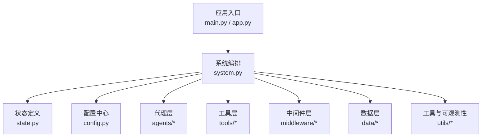
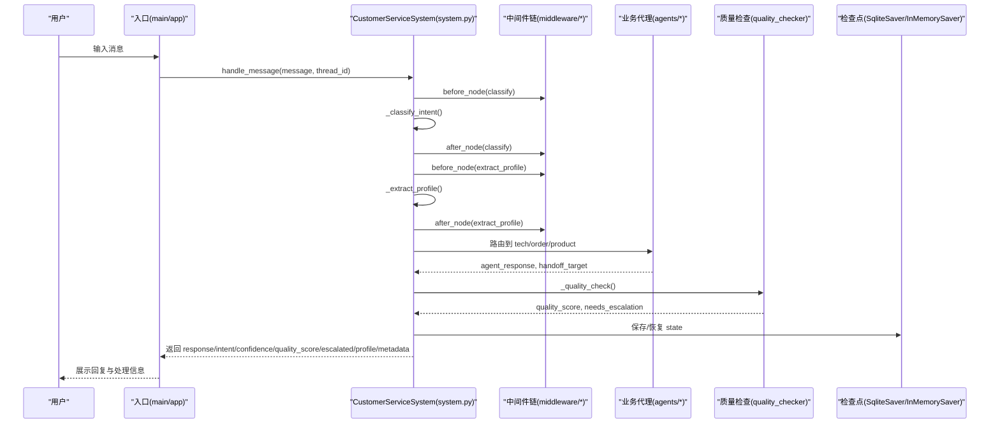
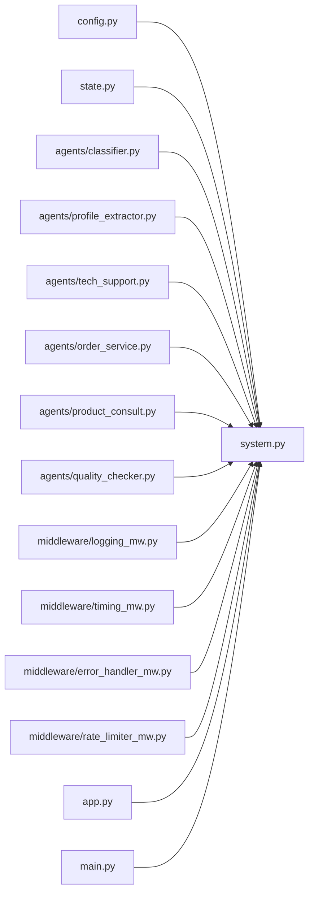

# 环境配置

<cite>
**本文引用的文件**
- [requirements.txt](file://requirements.txt)
- [README.md](file://README.md)
- [config.py](file://config.py)
- [system.py](file://system.py)
- [state.py](file://state.py)
- [app.py](file://app.py)
- [main.py](file://main.py)
- [.gitignore](file://.gitignore)
- [middleware/error_handler_mw.py](file://middleware/error_handler_mw.py)
- [middleware/logging_mw.py](file://middleware/logging_mw.py)
- [middleware/rate_limiter_mw.py](file://middleware/rate_limiter_mw.py)
</cite>

## 目录
1. [简介](#简介)
2. [项目结构](#项目结构)
3. [核心组件](#核心组件)
4. [架构总览](#架构总览)
5. [详细组件分析](#详细组件分析)
6. [依赖关系分析](#依赖关系分析)
7. [性能考虑](#性能考虑)
8. [故障排查指南](#故障排查指南)
9. [结论](#结论)
10. [附录](#附录)

## 简介
本指南面向首次运行“多智能体智能客服系统”的开发者与运维人员，提供从 Python 环境准备、依赖安装、.env 环境变量配置，到不同操作系统下的虚拟环境搭建、运行方式、以及关键配置参数的含义与调优建议。同时给出常见环境问题的排查思路与解决方案，帮助快速稳定地部署与运行系统。

## 项目结构
该仓库采用“按职责分层”的组织方式：
- 应用入口与运行模式：命令行演示 main.py、Web UI app.py
- 核心编排与状态：system.py（LangGraph 工作流）、state.py（TypedDict 状态定义）
- 配置中心：config.py（环境变量、模型初始化、阈值、路径）
- 代理与工具：agents/、tools/（意图分类、画像提取、业务代理、质量检查、工具函数）
- 中间件层：middleware/（日志、计时、异常捕获、限流）
- 数据层：data/（数据库、种子脚本）
- 工具与可观测性：utils/（JSON 解析、调用链追踪）

图表来源
- [system.py:34-305](file://system.py#L34-L305)
- [state.py:28-58](file://state.py#L28-L58)
- [config.py:1-60](file://config.py#L1-L60)
- [main.py:1-148](file://main.py#L1-L148)
- [app.py:1-177](file://app.py#L1-L177)

章节来源
- [README.md:95-133](file://README.md#L95-L133)

## 核心组件
- Python 版本与依赖
  - Python 版本要求：3.10+
  - 依赖清单与版本约束：见 requirements.txt
- 环境变量与模型初始化
  - .env 中必须配置 DEEPSEEK_API_KEY，否则系统启动即报错
  - 模型初始化使用 DeepSeek Chat，作为 LangChain 的 chat model
- 配置参数
  - 意图识别置信度阈值、回复质量评分阈值
  - SQLite 检查点与业务数据库路径
  - 支持语言与默认语言

章节来源
- [README.md:5, 66-75, 77-83:5-83](file://README.md#L5-L83)
- [requirements.txt:1-15](file://requirements.txt#L1-L15)
- [config.py:14-60](file://config.py#L14-L60)

## 架构总览
系统通过 LangGraph 将“意图分类 → 画像提取 → 业务代理 → 质量检查”串联为工作流，并通过中间件层提供日志、计时、异常捕获与限流能力。状态通过 Checkpointer（优先 SQLite）按 thread_id 跨轮次持久化，实现用户画像累积。

图表来源
- [system.py:79-147](file://system.py#L79-L147)
- [system.py:196-246](file://system.py#L196-L246)
- [middleware/logging_mw.py:32-109](file://middleware/logging_mw.py#L32-L109)
- [middleware/rate_limiter_mw.py:60-93](file://middleware/rate_limiter_mw.py#L60-L93)
- [middleware/error_handler_mw.py:27-64](file://middleware/error_handler_mw.py#L27-L64)

## 详细组件分析

### Python 环境与依赖安装
- Python 版本
  - 项目声明支持 Python 3.10 及以上
- 依赖包与作用
  - LangChain 生态：langchain、langchain-deepseek、langgraph、langgraph-checkpoint-sqlite
  - 数据库：sqlalchemy
  - Web UI：streamlit
  - 环境变量管理：python-dotenv
- 安装步骤
  - 建议创建并激活虚拟环境
  - 使用 pip 安装 requirements.txt 中的依赖

章节来源
- [README.md:5, 66-75:5-75](file://README.md#L5-L75)
- [requirements.txt:1-15](file://requirements.txt#L1-L15)

### .env 环境变量配置
- 必填项
  - DEEPSEEK_API_KEY：DeepSeek 平台的 API Key
- 配置流程
  - 复制 .env.example 为 .env
  - 在 .env 中填写 DEEPSEEK_API_KEY
  - 系统启动时会加载 .env 并校验 Key 是否有效，无效则抛出错误
- 安全注意事项
  - .env 已加入 .gitignore，不应提交到版本库

章节来源
- [README.md:77-83](file://README.md#L77-L83)
- [config.py:14-26](file://config.py#L14-L26)
- [.gitignore:1-8](file://.gitignore#L1-L8)

### requirements.txt 中依赖的作用与版本要求
- langchain>=1.2.0：LLM 编排与 LCEL 管道
- langchain-deepseek>=1.0.0：DeepSeek 模型适配器
- langgraph>=1.1.0：工作流编排与状态管理
- langgraph-checkpoint-sqlite>=2.0.0：SQLite 检查点持久化
- sqlalchemy>=2.0.0：ORM 业务数据库
- streamlit>=1.30.0：Web UI 聊天界面
- python-dotenv>=1.0.0：.env 文件加载

章节来源
- [requirements.txt:1-15](file://requirements.txt#L1-L15)

### 不同操作系统的环境搭建步骤
- 创建虚拟环境
  - Linux/Mac：python -m venv venv；source venv/bin/activate
  - Windows：python -m venv venv；venv\Scripts\activate
- 安装依赖：pip install -r requirements.txt
- 配置 .env：复制 .env.example 为 .env，填入 DEEPSEEK_API_KEY
- 运行
  - 命令行模式：python main.py
  - Web UI 模式：streamlit run app.py

章节来源
- [README.md:66-93](file://README.md#L66-L93)

### 配置参数的含义与调优建议
- 模型初始化
  - 使用 DeepSeek Chat，通过 DEEPSEEK_API_KEY 初始化
  - 建议保持单一模型实例，避免重复创建
- 业务阈值
  - MIN_INTENT_CONFIDENCE：意图识别置信度下限，低于此值直接升级人工
  - MIN_QUALITY_SCORE：回复质量评分下限，低于此值触发升级
  - 建议结合实际业务反馈进行调整，例如在准确率与人工干预频率之间平衡
- 持久化路径
  - CHECKPOINT_DB_PATH：检查点数据库（SQLite）
  - BUSINESS_DB_PATH：业务数据库（SQLite）
  - 建议确保路径存在且具备读写权限
- 多语言
  - SUPPORTED_LANGUAGES：支持的语言列表
  - DEFAULT_LANGUAGE：默认回复语言
  - 建议根据目标市场选择合适的默认语言

章节来源
- [config.py:28-60](file://config.py#L28-L60)
- [system.py:66-75](file://system.py#L66-L75)

### 中间件与运行时行为
- 日志中间件
  - 记录节点执行信息与耗时，便于调试与性能分析
- 计时中间件
  - 统计节点耗时并写入 metadata.node_timings
- 异常捕获中间件
  - 对可恢复节点设置兜底回复与升级标记，避免工作流崩溃
- 限流中间件
  - 对包含 LLM 调用的节点实施令牌桶限流，避免超出 API 速率限制

章节来源
- [middleware/logging_mw.py:1-109](file://middleware/logging_mw.py#L1-L109)
- [middleware/timing_mw.py:1-54](file://middleware/timing_mw.py#L1-L54)
- [middleware/error_handler_mw.py:1-64](file://middleware/error_handler_mw.py#L1-L64)
- [middleware/rate_limiter_mw.py:1-93](file://middleware/rate_limiter_mw.py#L1-L93)

## 依赖关系分析
系统依赖关系围绕 LangChain 1.0 生态展开，核心模块如下：
- system.py 依赖 config.py（阈值、路径、模型）、agents/*（业务代理）、middleware/*（横切关注点）、langgraph（工作流编排）
- state.py 提供 TypedDict 状态结构，被 system.py 与 agents/* 共享
- app.py 与 main.py 作为入口，分别驱动 Web UI 与命令行演示

图表来源
- [system.py:17-31](file://system.py#L17-L31)
- [config.py:1-60](file://config.py#L1-L60)
- [state.py:28-58](file://state.py#L28-L58)
- [app.py:9-11](file://app.py#L9-L11)
- [main.py:8-9](file://main.py#L8-L9)

章节来源
- [system.py:17-31](file://system.py#L17-L31)
- [state.py:28-58](file://state.py#L28-L58)

## 性能考虑
- 限流策略
  - 对包含 LLM 调用的节点启用令牌桶限流，避免高并发导致 API 限流或超时
  - 可根据 API 配额与并发需求调整速率与容量
- 检查点持久化
  - 优先使用 SQLite 检查点，失败时回退到内存检查点
  - SQLite 检查点适合开发与小规模生产，生产级可考虑 PostgresSaver
- 日志与追踪
  - 日志中间件与计时中间件有助于定位瓶颈节点
  - Web UI 中可查看节点耗时与调用链追踪，辅助优化

章节来源
- [middleware/rate_limiter_mw.py:24-58](file://middleware/rate_limiter_mw.py#L24-L58)
- [system.py:66-75](file://system.py#L66-L75)
- [middleware/logging_mw.py:32-109](file://middleware/logging_mw.py#L32-L109)
- [app.py:102-123](file://app.py#L102-L123)

## 故障排查指南
- 启动时报错缺少 DEEPSEEK_API_KEY
  - 现象：系统启动即抛出错误，提示设置有效的 DEEPSEEK_API_KEY
  - 处理：确认 .env 文件存在且包含 DEEPSEEK_API_KEY，重启应用
- API 调用频繁超时或被限流
  - 现象：LLM 调用异常或限流超时错误
  - 处理：降低并发或提高限流容量；检查网络与代理设置；必要时升级 API 配额
- SQLite 检查点无法初始化
  - 现象：SqliteSaver 初始化失败，回退到 InMemorySaver
  - 处理：检查 data/checkpoints.db 路径是否存在、权限是否正确；确保 SQLite 可用
- Web UI 无法显示用户画像或处理信息
  - 现象：侧边栏无画像数据或处理摘要为空
  - 处理：确认已运行种子脚本并初始化数据库；检查 thread_id 是否一致
- 异常兜底与升级
  - 现象：节点异常后返回兜底回复并标记升级
  - 处理：查看日志中间件输出的异常详情，修复对应节点逻辑

章节来源
- [config.py:22-26](file://config.py#L22-L26)
- [middleware/error_handler_mw.py:52-64](file://middleware/error_handler_mw.py#L52-L64)
- [middleware/rate_limiter_mw.py:75-77](file://middleware/rate_limiter_mw.py#L75-L77)
- [system.py:66-75](file://system.py#L66-L75)
- [app.py:71-87](file://app.py#L71-L87)

## 结论
通过遵循本指南，您可以顺利完成 Python 环境准备、依赖安装、.env 配置与运行方式选择。结合配置参数的合理调优与中间件层的可观测性能力，系统可在本地与小型生产环境中稳定运行。遇到问题时，可依据故障排查指南快速定位并解决。

## 附录
- 运行方式
  - 命令行模式：python main.py
  - Web UI 模式：streamlit run app.py
- 状态与画像
  - 系统按 thread_id 跨轮次累积 user_profile，可通过 get_profile 查询
- 开发与调试
  - 使用日志中间件与计时中间件定位性能瓶颈
  - 异常捕获中间件提供兜底回复，避免工作流中断

章节来源
- [README.md:85-93](file://README.md#L85-L93)
- [system.py:250-305](file://system.py#L250-L305)
- [app.py:142-177](file://app.py#L142-L177)