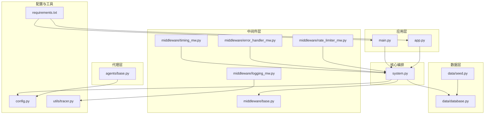
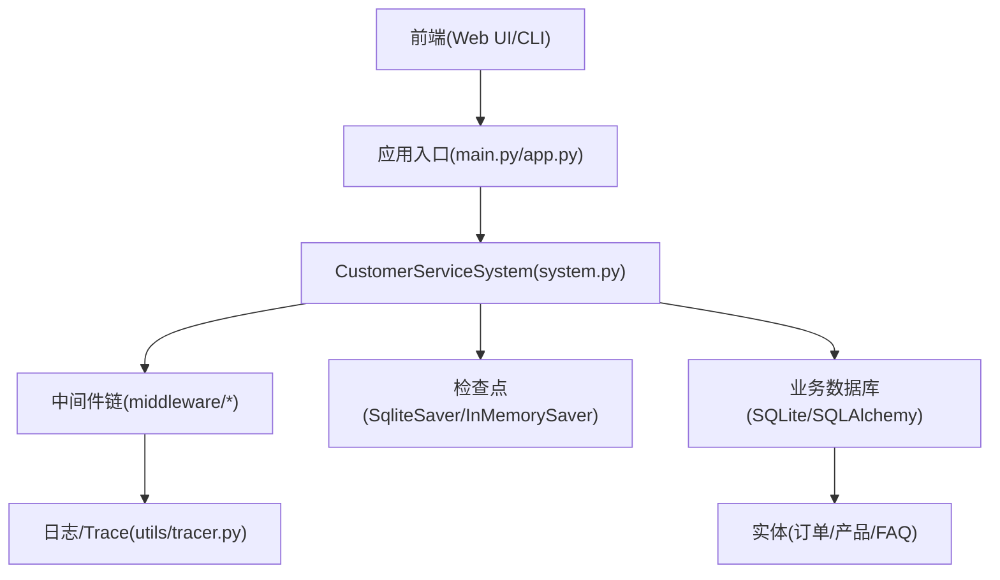
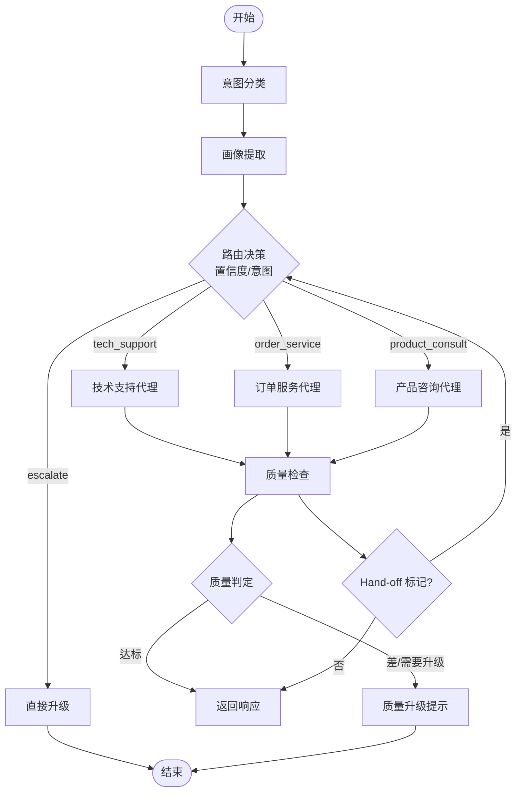
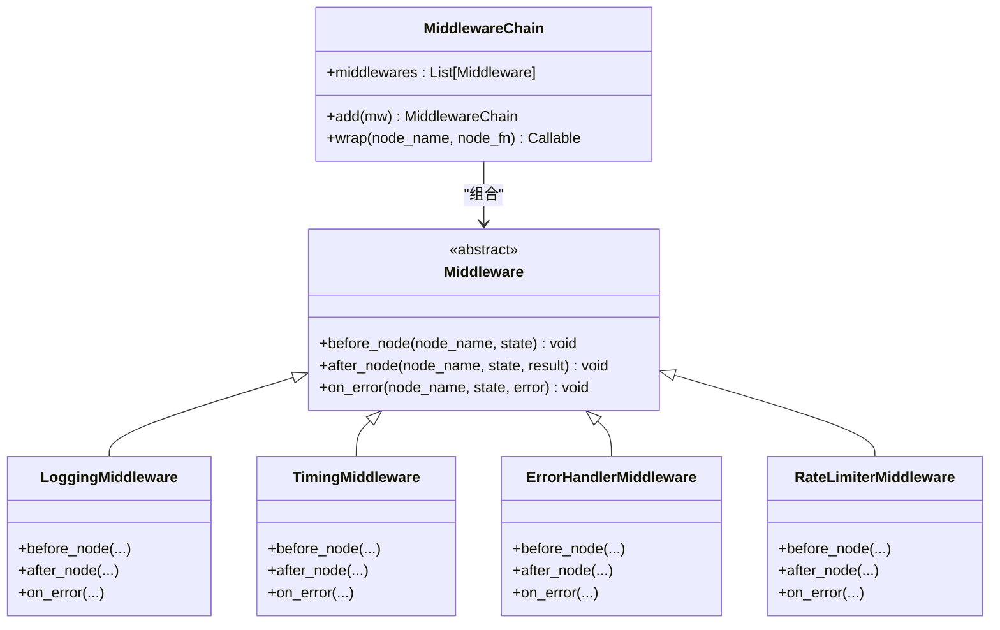
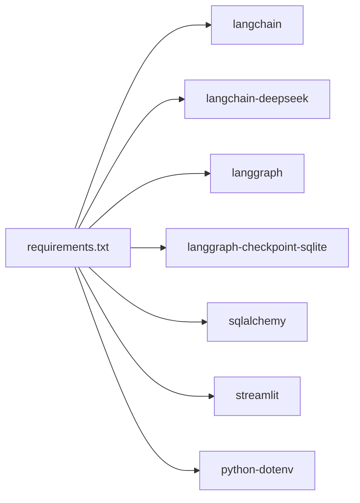

# 生产环境部署

<cite>
**本文引用的文件**
- [README.md](file://README.md)
- [requirements.txt](file://requirements.txt)
- [config.py](file://config.py)
- [main.py](file://main.py)
- [app.py](file://app.py)
- [system.py](file://system.py)
- [data/database.py](file://data/database.py)
- [data/seed.py](file://data/seed.py)
- [middleware/base.py](file://middleware/base.py)
- [middleware/logging_mw.py](file://middleware/logging_mw.py)
- [middleware/timing_mw.py](file://middleware/timing_mw.py)
- [middleware/error_handler_mw.py](file://middleware/error_handler_mw.py)
- [middleware/rate_limiter_mw.py](file://middleware/rate_limiter_mw.py)
- [agents/base.py](file://agents/base.py)
- [utils/tracer.py](file://utils/tracer.py)
</cite>

## 目录
1. [简介](#简介)
2. [项目结构](#项目结构)
3. [核心组件](#核心组件)
4. [架构总览](#架构总览)
5. [详细组件分析](#详细组件分析)
6. [依赖分析](#依赖分析)
7. [性能考虑](#性能考虑)
8. [故障排查指南](#故障排查指南)
9. [结论](#结论)
10. [附录](#附录)

## 简介
本指南面向生产环境部署，围绕“多智能体客服系统”项目，提供从开发到生产的完整落地方案。内容涵盖：
- Docker 容器化与构建步骤
- CI/CD 流水线与自动化部署策略
- 环境变量与配置文件的安全管理
- 负载均衡、反向代理与 SSL 证书的生产级配置
- 性能调优与资源优化实践
- 滚动更新与蓝绿部署实施
- 安全加固与合规性检查要点

该系统基于 LangChain 1.0 + LangGraph，具备意图分类、画像累积、质量检查、Agent Hand-off、多语言支持、可观测性与 Streamlit Web UI 等能力。

## 项目结构
项目采用模块化分层组织，便于在生产环境中拆分为独立的服务单元与静态资源层：
- 应用入口与演示：main.py、app.py
- 核心编排：system.py（LangGraph 工作流 + 中间件链 + Checkpointer）
- 代理层：agents/（意图分类、画像提取、业务代理、质量检查）
- 中间件层：middleware/（日志、计时、异常捕获、限流）
- 工具与数据：tools/、data/（SQLAlchemy + SQLite）
- 配置中心：config.py（环境变量、阈值、路径）
- 可观测性：utils/tracer.py
- 依赖清单：requirements.txt

图表来源
- [system.py:1-305](file://system.py#L1-L305)
- [app.py:1-177](file://app.py#L1-L177)
- [config.py:1-60](file://config.py#L1-L60)
- [data/database.py:1-161](file://data/database.py#L1-L161)
- [data/seed.py:1-94](file://data/seed.py#L1-L94)
- [middleware/base.py:1-94](file://middleware/base.py#L1-L94)
- [middleware/logging_mw.py:1-123](file://middleware/logging_mw.py#L1-L123)
- [middleware/timing_mw.py:1-55](file://middleware/timing_mw.py#L1-L55)
- [middleware/error_handler_mw.py:1-65](file://middleware/error_handler_mw.py#L1-L65)
- [middleware/rate_limiter_mw.py:1-94](file://middleware/rate_limiter_mw.py#L1-L94)
- [agents/base.py:1-123](file://agents/base.py#L1-L123)
- [utils/tracer.py:1-78](file://utils/tracer.py#L1-L78)
- [requirements.txt:1-15](file://requirements.txt#L1-L15)

章节来源
- [README.md:95-133](file://README.md#L95-L133)
- [requirements.txt:1-15](file://requirements.txt#L1-L15)

## 核心组件
- 配置中心：集中管理环境变量、模型初始化、阈值常量、持久化路径与多语言配置。
- 核心系统：CustomerServiceSystem 使用 LangGraph 编排工作流，集成中间件链与 Checkpointer，实现跨轮次状态持久化与条件路由。
- 代理层：业务代理封装 LLM + 工具，支持 Hand-off 与多语言回复。
- 中间件层：日志、计时、异常捕获、限流四层中间件，提供可观测性与稳定性保障。
- 数据层：SQLAlchemy + SQLite，替代 mock 数据，支持订单、产品、FAQ 等实体。
- Web UI：Streamlit 聊天界面，支持会话管理、画像展示与 Trace 查看。

章节来源
- [config.py:1-60](file://config.py#L1-L60)
- [system.py:34-305](file://system.py#L34-L305)
- [agents/base.py:23-123](file://agents/base.py#L23-L123)
- [middleware/base.py:14-94](file://middleware/base.py#L14-L94)
- [data/database.py:25-161](file://data/database.py#L25-L161)
- [app.py:14-177](file://app.py#L14-L177)

## 架构总览
系统采用“工作流编排 + 中间件治理 + 数据持久化”的三层架构。前端通过 Streamlit 或后端 API 调用系统；系统通过 LangGraph 执行节点函数，中间件负责横切关注点；数据层提供业务数据与检查点存储。

图表来源
- [system.py:66-76](file://system.py#L66-L76)
- [data/database.py:87-99](file://data/database.py#L87-L99)
- [utils/tracer.py:11-78](file://utils/tracer.py#L11-L78)
- [app.py:14-43](file://app.py#L14-L43)
- [main.py:130-148](file://main.py#L130-L148)

## 详细组件分析

### 配置中心（config.py）
- 环境变量加载：通过 dotenv 加载 .env，强制校验 API Key。
- 模型初始化：统一的 LLM 模型实例，避免重复创建。
- 业务阈值：意图置信度与回复质量评分阈值。
- 持久化路径：检查点数据库与业务数据库的 SQLite 路径。
- 多语言：支持语言列表与默认语言。

章节来源
- [config.py:14-60](file://config.py#L14-L60)

### 核心系统（system.py）
- 工作流编排：意图分类 → 画像提取 → 业务代理 → 质量检查 → 响应/升级。
- 中间件链：日志 → 计时 → 异常捕获 → 限流，通过 wrap 注入节点。
- 检查点：优先 SqliteSaver，失败回退 InMemorySaver，按 thread_id 持久化状态。
- 条件路由：基于置信度与分类结果动态选择代理或直接升级。
- Hand-off：支持代理间任务移交，带最大次数保护。

图表来源
- [system.py:159-184](file://system.py#L159-L184)
- [system.py:196-247](file://system.py#L196-L247)

章节来源
- [system.py:34-305](file://system.py#L34-L305)

### 代理基类（agents/base.py）
- 统一封装：LLM + 工具 + 系统提示词。
- 画像注入：将用户画像摘要拼接到消息前，支持多语言指令。
- Hand-off 解析：从回复中提取 [HANDOFF:target] 标记，进行目标代理移交。

章节来源
- [agents/base.py:23-123](file://agents/base.py#L23-L123)

### 中间件层（middleware/*）
- Middleware 抽象与 MiddlewareChain：提供 before/after/on_error 三阶段钩子，wrap 节点函数。
- 日志中间件：结构化日志与 Trace 写入，记录节点耗时与摘要。
- 计时中间件：统计节点耗时，写入 metadata.node_timings。
- 异常捕获中间件：对可恢复节点设置 fallback 回复与升级标志。
- 限流中间件：令牌桶算法，针对包含 LLM 调用的节点限流。

图表来源
- [middleware/base.py:14-94](file://middleware/base.py#L14-L94)
- [middleware/logging_mw.py:32-123](file://middleware/logging_mw.py#L32-L123)
- [middleware/timing_mw.py:13-55](file://middleware/timing_mw.py#L13-L55)
- [middleware/error_handler_mw.py:27-65](file://middleware/error_handler_mw.py#L27-L65)
- [middleware/rate_limiter_mw.py:60-94](file://middleware/rate_limiter_mw.py#L60-L94)

章节来源
- [middleware/base.py:14-94](file://middleware/base.py#L14-L94)
- [middleware/logging_mw.py:32-123](file://middleware/logging_mw.py#L32-L123)
- [middleware/timing_mw.py:13-55](file://middleware/timing_mw.py#L13-L55)
- [middleware/error_handler_mw.py:27-65](file://middleware/error_handler_mw.py#L27-L65)
- [middleware/rate_limiter_mw.py:60-94](file://middleware/rate_limiter_mw.py#L60-L94)

### 数据层（data/database.py、data/seed.py）
- SQLAlchemy ORM：定义订单、产品、FAQ 实体，提供查询接口。
- 初始化脚本：将 mock 数据导入 SQLite，支持幂等插入与提交。

章节来源
- [data/database.py:25-161](file://data/database.py#L25-L161)
- [data/seed.py:75-94](file://data/seed.py#L75-L94)

### Web UI（app.py）
- Streamlit 聊天界面：支持会话管理、画像展示、Trace 查看。
- 初始化：缓存系统实例，执行种子数据初始化。

章节来源
- [app.py:14-177](file://app.py#L14-L177)

### 可观测性（utils/tracer.py）
- Trace 记录：节点名、时间戳、耗时、状态、摘要与错误。
- UI 格式化：将 Trace 转换为适合 Streamlit 展示的结构。

章节来源
- [utils/tracer.py:11-78](file://utils/tracer.py#L11-L78)

## 依赖分析
- LangChain 1.0 生态：langchain、langchain-deepseek、langgraph、langgraph-checkpoint-sqlite
- 数据库：sqlalchemy
- Web UI：streamlit
- 环境变量：python-dotenv

图表来源
- [requirements.txt:1-15](file://requirements.txt#L1-L15)

章节来源
- [requirements.txt:1-15](file://requirements.txt#L1-L15)

## 性能考虑
- 模型实例复用：config.py 中统一初始化模型实例，避免重复创建带来的开销。
- 中间件性能：TimingMiddleware 记录节点耗时，便于定位瓶颈；LoggingMiddleware 输出摘要，减少冗余日志。
- 限流策略：RateLimiterMiddleware 对包含 LLM 调用的节点进行令牌桶限流，防止突发流量压垮后端。
- 检查点持久化：优先 SqliteSaver，失败回退 InMemorySaver，确保状态跨轮次可用。
- 数据库优化：SQLAlchemy 查询使用索引列（如订单号、产品名），模糊匹配与排序控制在合理范围内。
- Web UI：Streamlit 的缓存装饰器用于系统实例缓存，减少初始化成本。

章节来源
- [config.py:30-31](file://config.py#L30-L31)
- [middleware/timing_mw.py:13-55](file://middleware/timing_mw.py#L13-L55)
- [middleware/rate_limiter_mw.py:24-94](file://middleware/rate_limiter_mw.py#L24-L94)
- [system.py:66-76](file://system.py#L66-L76)
- [data/database.py:104-161](file://data/database.py#L104-L161)
- [app.py:16-21](file://app.py#L16-L21)

## 故障排查指南
- 异常捕获：ErrorHandlerMiddleware 对可恢复节点设置 fallback 回复与升级标志，避免单点异常导致工作流中断。
- 日志与 Trace：LoggingMiddleware 记录节点执行摘要与 Trace，配合 utils/tracer.py 的格式化输出，快速定位问题。
- 限流告警：RateLimiterMiddleware 在等待令牌超时时抛出异常，提示降低调用频率。
- 数据初始化：data/seed.py 提供幂等初始化脚本，确保数据库表与种子数据存在。
- 配置校验：config.py 强制校验 API Key，缺失或占位符将直接报错。

章节来源
- [middleware/error_handler_mw.py:27-65](file://middleware/error_handler_mw.py#L27-L65)
- [middleware/logging_mw.py:32-123](file://middleware/logging_mw.py#L32-L123)
- [utils/tracer.py:32-78](file://utils/tracer.py#L32-L78)
- [middleware/rate_limiter_mw.py:60-94](file://middleware/rate_limiter_mw.py#L60-L94)
- [data/seed.py:75-94](file://data/seed.py#L75-L94)
- [config.py:20-27](file://config.py#L20-L27)

## 结论
本指南提供了从开发到生产的完整落地思路：以 LangGraph 工作流为核心，通过中间件层实现可观测性与稳定性，借助 SQLAlchemy + SQLite 提供可靠的数据支撑，并通过 Streamlit 提供直观的 Web UI。结合本文的容器化、CI/CD、负载均衡与 SSL、性能优化与安全加固建议，可在生产环境中实现稳定、可扩展、可维护的智能客服系统。

## 附录

### Docker 容器化与构建步骤（建议）
- 基础镜像：选择官方 Python 运行时镜像，最小化安装依赖。
- 构建步骤：
  - 复制 requirements.txt 并安装依赖。
  - 复制源码与 .env（不包含敏感信息）。
  - 预热数据库与种子数据。
  - 暴露 Web UI 端口（Streamlit 默认端口）。
- 运行参数：挂载数据卷用于持久化检查点与业务数据库；通过环境变量注入 API Key 与数据库路径。
- 健康检查：提供轻量探针，检查核心服务可用性。

### CI/CD 流水线与自动化部署策略（建议）
- 触发条件：push 到主分支或发布标签。
- 步骤：
  - 代码检出与依赖安装。
  - 单元测试与集成测试。
  - 构建 Docker 镜像并推送至镜像仓库。
  - 部署到预生产环境进行冒烟测试。
  - 蓝绿/滚动更新到生产环境。
- 回滚策略：记录镜像版本与配置快照，异常时快速回滚。

### 环境变量与配置文件的安全管理（建议）
- .env 文件：仅包含非敏感配置；敏感信息通过平台机密管理（如 Kubernetes Secret、云厂商密钥管理）注入。
- 配置验证：在启动阶段校验关键配置项（如 API Key），缺失或占位符直接报错。
- 路径隔离：检查点与业务数据库路径使用相对路径或受控绝对路径，避免暴露到容器外。

### 负载均衡、反向代理与 SSL 证书（建议）
- 反向代理：Nginx/HAProxy 暴露 HTTPS，配置压缩与缓存策略。
- 负载均衡：多副本部署，健康检查与熔断策略。
- SSL 证书：Let’s Encrypt 自动续期，禁用弱密码套件，启用 HSTS。

### 性能调优与资源优化（建议）
- 模型实例复用与连接池：减少初始化开销与连接竞争。
- 中间件粒度：按需启用日志与 Trace，避免生产环境过度输出。
- 数据库索引：为高频查询列建立索引，控制排序与模糊匹配范围。
- 缓存策略：对静态资源与热点数据进行缓存，减少数据库压力。
- 资源配额：为容器设置 CPU/内存限制与请求，结合 HPA 实现弹性伸缩。

### 滚动更新与蓝绿部署（建议）
- 滚动更新：逐步替换旧 Pod，保持服务可用；结合就绪探针与优雅停机。
- 蓝绿部署：新版本作为独立环境，流量切换后回收旧版本；失败时快速回切。
- 配置灰度：通过配置中心与网关规则实现小流量验证。

### 安全加固与合规性检查（建议）
- 依赖审计：定期扫描第三方依赖漏洞，及时升级。
- 最小权限：容器运行用户非 root，仅授予必要文件系统权限。
- 网络隔离：Pod 间网络策略，限制不必要的出/入站流量。
- 数据加密：传输加密（TLS）、静态加密（数据库文件加密）。
- 审计日志：开启系统与应用日志审计，保留合规证据。
- 合规框架：遵循 ISO 27001、等保三级等要求，定期自评估与第三方审计。