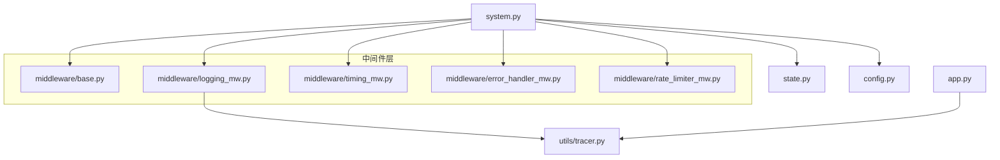
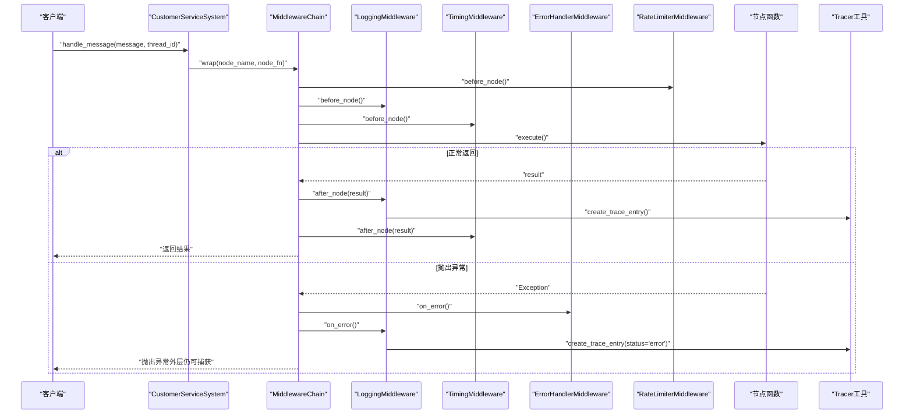
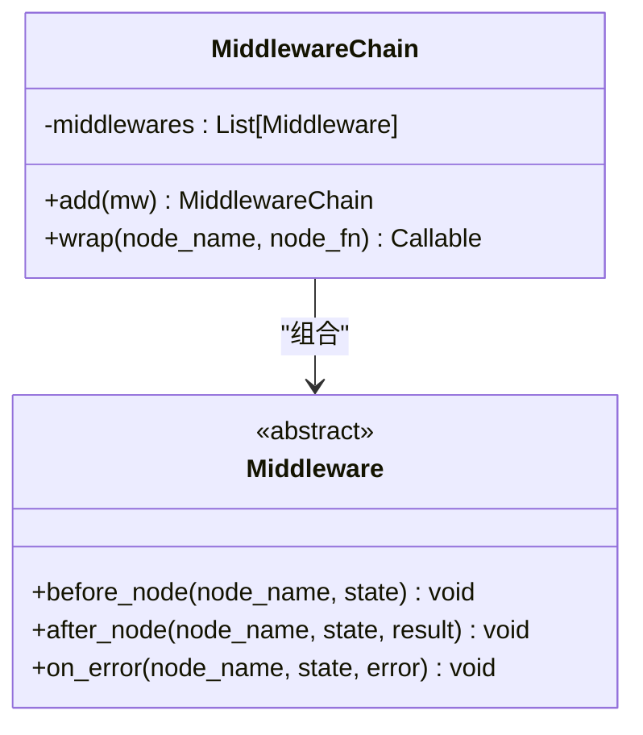
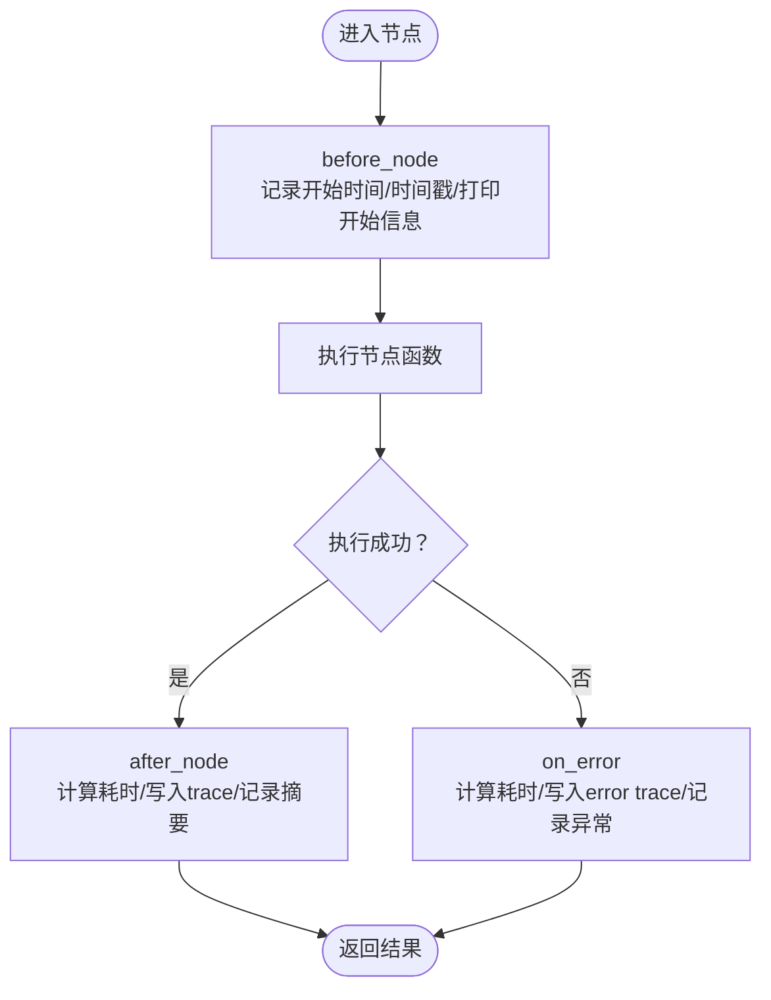
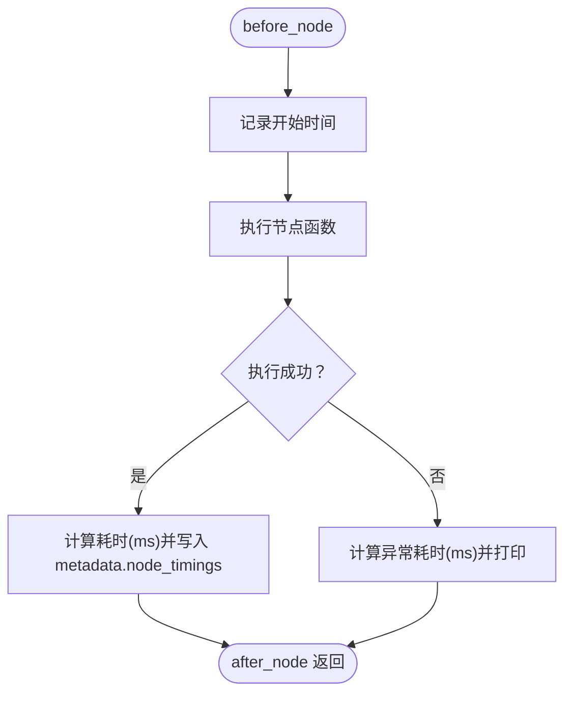
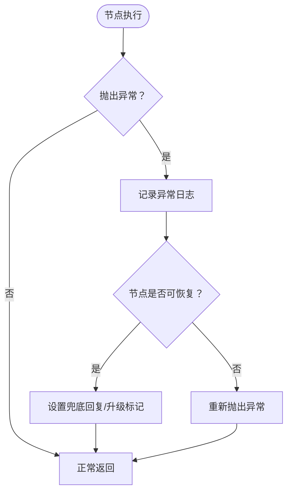
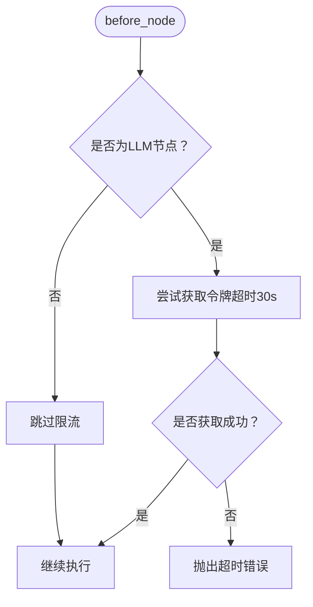
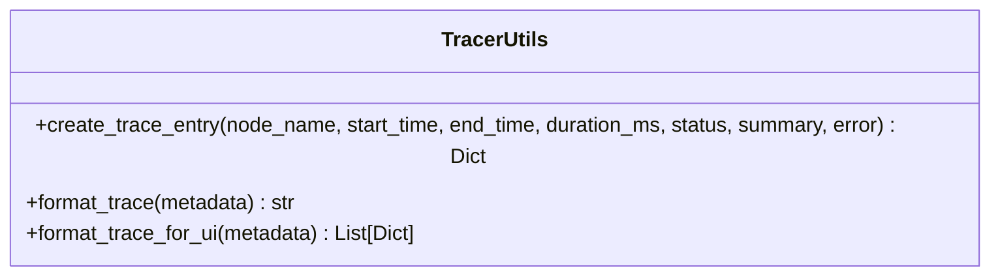
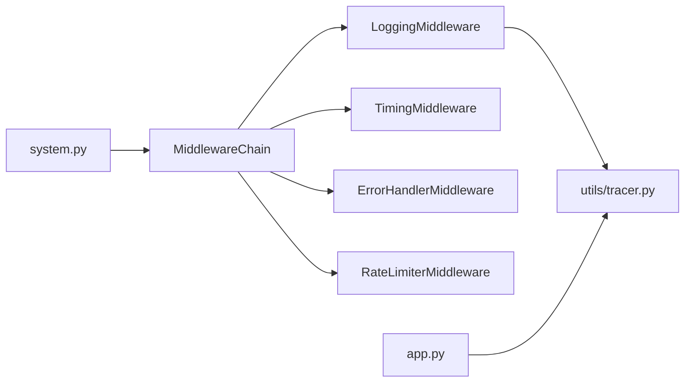

# 监控与日志

<cite>
**本文引用的文件**
- [middleware/base.py](file://middleware/base.py)
- [middleware/logging_mw.py](file://middleware/logging_mw.py)
- [middleware/timing_mw.py](file://middleware/timing_mw.py)
- [middleware/error_handler_mw.py](file://middleware/error_handler_mw.py)
- [middleware/rate_limiter_mw.py](file://middleware/rate_limiter_mw.py)
- [utils/tracer.py](file://utils/tracer.py)
- [state.py](file://state.py)
- [system.py](file://system.py)
- [app.py](file://app.py)
- [config.py](file://config.py)
- [README.md](file://README.md)
- [requirements.txt](file://requirements.txt)
</cite>

## 目录
1. [简介](#简介)
2. [项目结构](#项目结构)
3. [核心组件](#核心组件)
4. [架构总览](#架构总览)
5. [详细组件分析](#详细组件分析)
6. [依赖分析](#依赖分析)
7. [性能考虑](#性能考虑)
8. [故障排查指南](#故障排查指南)
9. [结论](#结论)
10. [附录](#附录)

## 简介
本指南聚焦于系统中的监控与日志管理，涵盖以下主题：
- 中间件日志记录的配置与使用
- 调用链追踪工具的集成与使用
- 性能指标采集与展示（响应时间、错误率等）
- 日志级别与格式配置方法
- 告警机制设置与通知方式
- 日志分析与问题排查工具与技巧
- 分布式追踪与监控系统的集成方案

该系统采用中间件链对节点执行进行横切关注点注入，统一记录结构化日志、统计耗时、捕获异常，并通过调用链追踪记录完整执行轨迹，便于在 Web UI 中可视化展示。

## 项目结构
系统采用模块化组织，监控与日志相关的关键模块如下：
- middleware：中间件基础设施与具体中间件（日志、计时、异常捕获、限流）
- utils：调用链追踪工具
- state：工作流状态定义
- system：工作流编排与中间件集成
- app：Streamlit Web UI，展示性能指标与调用链追踪
- config：配置中心（模型、阈值、数据库路径）

图表来源
- [middleware/base.py:46-94](file://middleware/base.py#L46-L94)
- [middleware/logging_mw.py:32-106](file://middleware/logging_mw.py#L32-L106)
- [middleware/timing_mw.py:13-55](file://middleware/timing_mw.py#L13-L55)
- [middleware/error_handler_mw.py:27-65](file://middleware/error_handler_mw.py#L27-L65)
- [middleware/rate_limiter_mw.py:60-94](file://middleware/rate_limiter_mw.py#L60-L94)
- [utils/tracer.py:11-78](file://utils/tracer.py#L11-L78)
- [state.py:28-58](file://state.py#L28-L58)
- [system.py:58-76](file://system.py#L58-L76)
- [app.py:10-123](file://app.py#L10-L123)
- [config.py:14-60](file://config.py#L14-L60)

章节来源
- [README.md:95-133](file://README.md#L95-L133)
- [system.py:58-76](file://system.py#L58-L76)

## 核心组件
- 中间件基础设施：定义抽象基类与中间件链编排器，负责在节点执行前后注入钩子逻辑。
- 日志中间件：统一记录节点开始、结束与异常事件，同时写入调用链追踪条目。
- 计时中间件：统计节点执行耗时，写入 metadata.node_timings。
- 异常捕获中间件：对可恢复节点设置兜底回复与升级标记，避免工作流崩溃。
- 限流中间件：对包含 LLM 调用的节点实施令牌桶限流，防止超出 API 速率限制。
- 调用链追踪工具：在 state.metadata.trace 中记录节点执行链路，提供格式化展示。

章节来源
- [middleware/base.py:14-44](file://middleware/base.py#L14-L44)
- [middleware/base.py:46-94](file://middleware/base.py#L46-L94)
- [middleware/logging_mw.py:32-106](file://middleware/logging_mw.py#L32-L106)
- [middleware/timing_mw.py:13-55](file://middleware/timing_mw.py#L13-L55)
- [middleware/error_handler_mw.py:27-65](file://middleware/error_handler_mw.py#L27-L65)
- [middleware/rate_limiter_mw.py:60-94](file://middleware/rate_limiter_mw.py#L60-L94)
- [utils/tracer.py:11-78](file://utils/tracer.py#L11-L78)

## 架构总览
中间件链在编译工作流时包裹节点函数，形成 before → execute → after / on_error 的执行序列。日志中间件负责结构化日志与 trace 写入；计时中间件负责耗时统计；异常捕获中间件负责兜底与升级标记；限流中间件负责 LLM 节点的速率控制。

图表来源
- [system.py:196-246](file://system.py#L196-L246)
- [middleware/base.py:63-93](file://middleware/base.py#L63-L93)
- [middleware/rate_limiter_mw.py:71-77](file://middleware/rate_limiter_mw.py#L71-L77)
- [middleware/logging_mw.py:39-105](file://middleware/logging_mw.py#L39-L105)
- [middleware/timing_mw.py:20-54](file://middleware/timing_mw.py#L20-L54)
- [middleware/error_handler_mw.py:46-64](file://middleware/error_handler_mw.py#L46-L64)
- [utils/tracer.py:11-29](file://utils/tracer.py#L11-L29)

## 详细组件分析

### 中间件基础设施与编排
- Middleware 抽象基类定义 before_node、after_node、on_error 三个钩子，确保所有中间件遵循一致的生命周期。
- MiddlewareChain.wrap 将任意节点函数包裹为带中间件的包装函数，按注册顺序依次执行钩子，保证横切关注点的解耦注入。

图表来源
- [middleware/base.py:14-44](file://middleware/base.py#L14-L44)
- [middleware/base.py:46-94](file://middleware/base.py#L46-L94)

章节来源
- [middleware/base.py:14-44](file://middleware/base.py#L14-L44)
- [middleware/base.py:46-94](file://middleware/base.py#L46-L94)

### 日志中间件（结构化日志与调用链追踪）
- 结构化日志：在节点开始与结束时记录节点名、用户消息摘要、执行摘要；异常时记录异常类型与内容。
- 调用链追踪：在节点开始时记录起始时间戳，在结束或异常时计算耗时，写入 state.metadata.trace。
- 节点标签：为节点名提供中文标签与 emoji，提升可读性。
- 摘要提取：针对特定节点（如意图分类、画像提取、质量检查）提取关键摘要信息。

图表来源
- [middleware/logging_mw.py:39-105](file://middleware/logging_mw.py#L39-L105)
- [utils/tracer.py:11-29](file://utils/tracer.py#L11-L29)

章节来源
- [middleware/logging_mw.py:32-106](file://middleware/logging_mw.py#L32-L106)
- [utils/tracer.py:32-78](file://utils/tracer.py#L32-L78)

### 计时中间件（节点耗时统计）
- 在节点开始时记录起始时间，结束后计算耗时并写入 state.metadata.node_timings。
- 异常时同样输出异常耗时，便于定位慢节点与异常耗时。

图表来源
- [middleware/timing_mw.py:20-54](file://middleware/timing_mw.py#L20-L54)

章节来源
- [middleware/timing_mw.py:13-55](file://middleware/timing_mw.py#L13-L55)

### 异常捕获中间件（兜底与升级）
- 对可恢复节点在异常时设置兜底回复与升级标记，避免工作流崩溃。
- 记录异常日志，便于后续分析与告警。

图表来源
- [middleware/error_handler_mw.py:46-64](file://middleware/error_handler_mw.py#L46-L64)

章节来源
- [middleware/error_handler_mw.py:27-65](file://middleware/error_handler_mw.py#L27-L65)

### 限流中间件（令牌桶限流）
- 对包含 LLM 调用的节点实施令牌桶限流，防止高并发时超出 API 速率限制。
- 提供可配置的速率与容量，支持超时等待策略。

图表来源
- [middleware/rate_limiter_mw.py:71-77](file://middleware/rate_limiter_mw.py#L71-L77)
- [middleware/rate_limiter_mw.py:39-51](file://middleware/rate_limiter_mw.py#L39-L51)

章节来源
- [middleware/rate_limiter_mw.py:60-94](file://middleware/rate_limiter_mw.py#L60-L94)

### 调用链追踪工具
- create_trace_entry：创建单条 trace 记录，包含节点名、起止时间、耗时、状态、摘要与错误信息。
- format_trace：将 trace 列表格式化为可读字符串，用于命令行或日志输出。
- format_trace_for_ui：将 trace 转换为适合 UI 展示的结构，便于在 Streamlit 中渲染。

图表来源
- [utils/tracer.py:11-78](file://utils/tracer.py#L11-L78)

章节来源
- [utils/tracer.py:11-78](file://utils/tracer.py#L11-L78)

### 状态与元信息
- CustomerServiceState：定义工作流状态字段，其中 metadata 用于存放 trace、node_timings 等元信息。
- 系统在每轮处理开始时重置“请求级”字段，仅 user_profile 通过 Checkpointer 跨轮次累积。

章节来源
- [state.py:28-58](file://state.py#L28-L58)
- [system.py:270-284](file://system.py#L270-L284)

### Web UI 展示与可观测性
- 侧边栏展示最近一次处理的意图、质量评分、置信度、是否升级，以及节点耗时与调用链追踪。
- 详情面板展开显示调用链追踪，便于问题排查与性能分析。

章节来源
- [app.py:90-123](file://app.py#L90-L123)
- [app.py:153-170](file://app.py#L153-L170)

## 依赖分析
- 中间件链在系统初始化时构建，按注册顺序依次执行，确保日志、计时、异常捕获、限流的有序注入。
- 日志中间件依赖调用链追踪工具创建 trace 条目。
- Web UI 依赖调用链追踪工具的 UI 格式化函数展示 trace。

图表来源
- [system.py:58-76](file://system.py#L58-L76)
- [middleware/base.py:63-93](file://middleware/base.py#L63-L93)
- [middleware/logging_mw.py:66-76](file://middleware/logging_mw.py#L66-L76)
- [utils/tracer.py:71-78](file://utils/tracer.py#L71-L78)
- [app.py:111-122](file://app.py#L111-L122)

章节来源
- [system.py:58-76](file://system.py#L58-L76)
- [middleware/base.py:63-93](file://middleware/base.py#L63-L93)

## 性能考虑
- 节点耗时统计：通过计时中间件将每个节点的耗时写入 metadata.node_timings，便于在 UI 中展示与分析。
- 限流策略：对包含 LLM 调用的节点实施令牌桶限流，避免 API 速率限制导致的失败与延迟。
- Trace 记录：记录每个节点的起止时间与状态，结合耗时统计可用于端到端响应时间分析。
- 建议：在生产环境中可将 metadata.node_timings 与 trace 数据持久化，配合外部监控系统进行聚合与可视化。

章节来源
- [middleware/timing_mw.py:20-43](file://middleware/timing_mw.py#L20-L43)
- [middleware/rate_limiter_mw.py:68-77](file://middleware/rate_limiter_mw.py#L68-L77)
- [middleware/logging_mw.py:59-76](file://middleware/logging_mw.py#L59-L76)

## 故障排查指南
- 日志查看
  - 结构化日志：在节点开始与结束时输出日志，异常时输出错误日志。可在日志系统中按节点名过滤与聚合。
  - 调用链追踪：通过 UI 展示 trace，定位异常节点与耗时异常的节点。
- 异常兜底
  - 对可恢复节点，异常时设置兜底回复与升级标记，避免工作流中断。可在 UI 中查看是否发生升级。
- 性能瓶颈
  - 查看 metadata.node_timings，识别耗时较长的节点；结合 trace 的耗时统计进行根因分析。
- 限流问题
  - 若出现“等待令牌超时”的错误，适当降低调用频率或调整限流参数（速率与容量）。

章节来源
- [middleware/logging_mw.py:39-105](file://middleware/logging_mw.py#L39-L105)
- [middleware/error_handler_mw.py:59-64](file://middleware/error_handler_mw.py#L59-L64)
- [middleware/timing_mw.py:29-43](file://middleware/timing_mw.py#L29-L43)
- [middleware/rate_limiter_mw.py:75-77](file://middleware/rate_limiter_mw.py#L75-L77)

## 结论
该系统通过中间件链实现了统一的日志记录、性能统计、异常兜底与限流控制，并借助调用链追踪工具提供了完整的执行轨迹可视化。结合 Web UI，开发者可以快速定位问题、分析性能瓶颈，并为后续的告警与监控集成奠定基础。

## 附录

### 日志级别与格式配置
- 日志记录位置
  - 日志中间件使用标准日志库记录 INFO/ERROR 级别日志，异常时输出异常类型与内容。
- 日志格式建议
  - 建议在应用启动时配置日志格式（如时间戳、节点名、消息摘要、耗时、状态），并在日志系统中按节点名与状态进行聚合与告警。
- 日志输出位置
  - 建议将日志输出到文件或标准输出，结合日志收集系统（如 ELK/Fluentd）进行集中管理。

章节来源
- [middleware/logging_mw.py:16-105](file://middleware/logging_mw.py#L16-L105)

### 告警机制设置与通知方式
- 告警维度
  - 错误率：统计异常节点占比，超过阈值触发告警。
  - 响应时间：统计端到端响应时间与节点耗时，超过阈值触发告警。
  - 限流事件：统计令牌桶等待超时次数，超过阈值触发告警。
- 通知方式
  - 可通过日志系统或监控平台（如 Prometheus/Grafana/PagerDuty）配置告警规则与通知渠道（邮件、IM、电话）。

章节来源
- [middleware/error_handler_mw.py:52-64](file://middleware/error_handler_mw.py#L52-L64)
- [middleware/timing_mw.py:33-43](file://middleware/timing_mw.py#L33-L43)
- [middleware/rate_limiter_mw.py:75-77](file://middleware/rate_limiter_mw.py#L75-L77)

### 分布式追踪与监控系统集成方案
- Trace 数据导出
  - 将 state.metadata.trace 导出为结构化数据，上传至分布式追踪系统（如 Jaeger/Zipkin）。
- 指标导出
  - 将 metadata.node_timings 与端到端耗时导出至监控系统（如 Prometheus），建立仪表盘与告警。
- 日志与追踪关联
  - 在日志中加入 trace_id 或 span_id，实现日志与追踪的关联查询。

章节来源
- [utils/tracer.py:32-78](file://utils/tracer.py#L32-L78)
- [middleware/logging_mw.py:66-76](file://middleware/logging_mw.py#L66-L76)