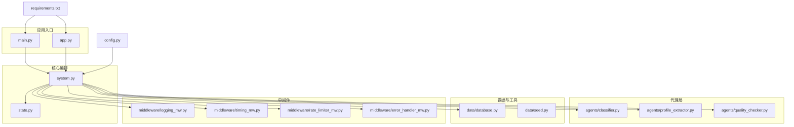
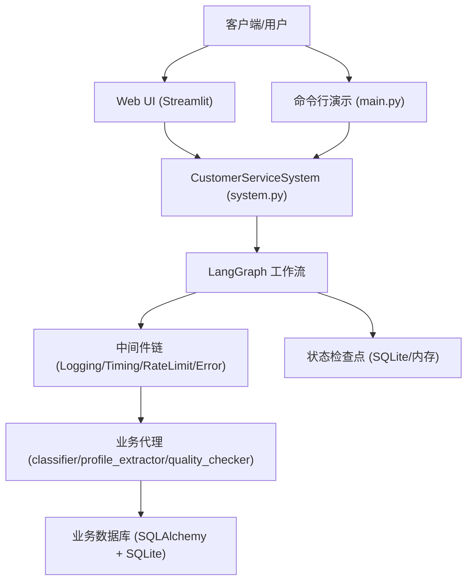
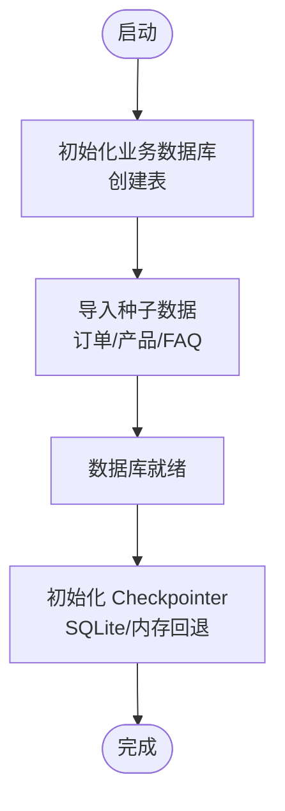
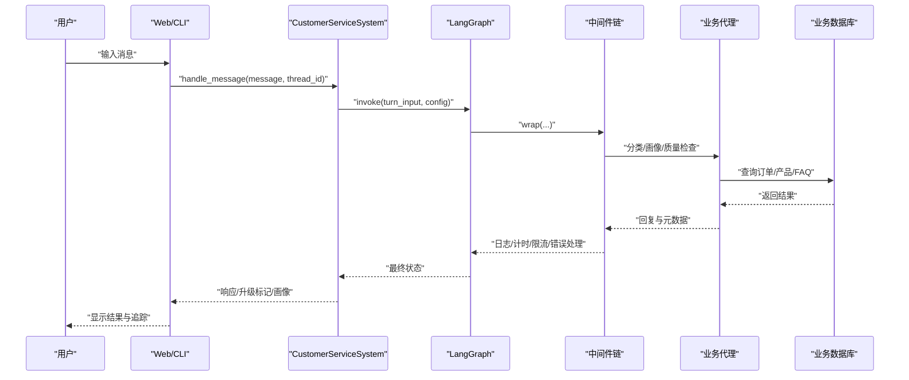
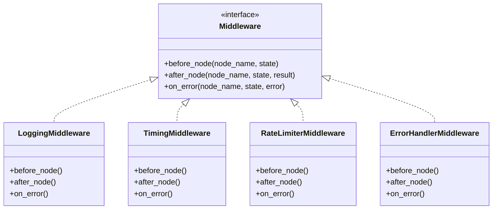
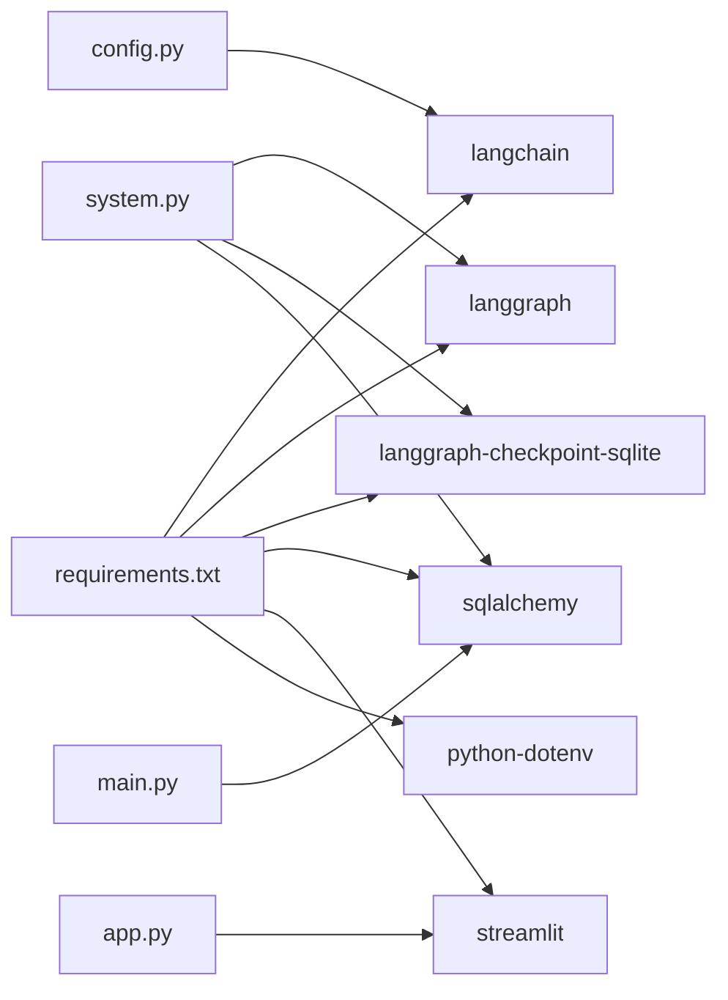

# 部署运维指南

<cite>
**本文引用的文件**
- [README.md](file://README.md)
- [config.py](file://config.py)
- [requirements.txt](file://requirements.txt)
- [main.py](file://main.py)
- [app.py](file://app.py)
- [system.py](file://system.py)
- [state.py](file://state.py)
- [data/database.py](file://data/database.py)
- [data/seed.py](file://data/seed.py)
- [middleware/error_handler_mw.py](file://middleware/error_handler_mw.py)
- [middleware/logging_mw.py](file://middleware/logging_mw.py)
- [middleware/rate_limiter_mw.py](file://middleware/rate_limiter_mw.py)
- [middleware/timing_mw.py](file://middleware/timing_mw.py)
- [agents/classifier.py](file://agents/classifier.py)
- [agents/profile_extractor.py](file://agents/profile_extractor.py)
- [agents/quality_checker.py](file://agents/quality_checker.py)
</cite>

## 目录
1. [简介](#简介)
2. [项目结构](#项目结构)
3. [核心组件](#核心组件)
4. [架构总览](#架构总览)
5. [详细组件分析](#详细组件分析)
6. [依赖关系分析](#依赖关系分析)
7. [性能考虑](#性能考虑)
8. [故障排查指南](#故障排查指南)
9. [结论](#结论)
10. [附录](#附录)

## 简介
本指南面向从开发到生产的全生命周期部署运维，覆盖环境配置、依赖管理、数据库部署与初始化、Web UI 部署、负载均衡与高可用、监控与日志、性能调优、备份恢复与灾难恢复、版本发布与滚动更新等主题。系统基于 LangChain 1.0 + LangGraph，采用 SQLite 作为本地持久化存储，支持多轮对话状态（用户画像）跨轮次累积，并提供 Streamlit Web UI 与命令行演示入口。

## 项目结构
项目采用按职责分层的模块化组织：
- 应用入口与演示：main.py、app.py
- 核心编排：system.py（LangGraph 工作流）、state.py（状态定义）
- 代理层：agents/（意图分类、画像提取、业务代理、质量检查）
- 工具与数据：tools/（工具函数）、data/（数据库与种子数据）
- 中间件：middleware/（日志、计时、限流、错误处理）
- 配置与依赖：config.py、requirements.txt
- 文档与说明：README.md

图表来源
- [main.py:1-148](file://main.py#L1-L148)
- [app.py:1-177](file://app.py#L1-L177)
- [system.py:1-305](file://system.py#L1-L305)
- [state.py:1-58](file://state.py#L1-L58)
- [data/database.py:1-161](file://data/database.py#L1-L161)
- [data/seed.py:1-94](file://data/seed.py#L1-L94)
- [middleware/logging_mw.py:1-123](file://middleware/logging_mw.py#L1-L123)
- [middleware/timing_mw.py:1-55](file://middleware/timing_mw.py#L1-L55)
- [middleware/rate_limiter_mw.py:1-94](file://middleware/rate_limiter_mw.py#L1-L94)
- [middleware/error_handler_mw.py:1-65](file://middleware/error_handler_mw.py#L1-L65)
- [config.py:1-60](file://config.py#L1-L60)
- [requirements.txt:1-15](file://requirements.txt#L1-L15)

章节来源
- [README.md:81-108](file://README.md#L81-L108)
- [requirements.txt:1-15](file://requirements.txt#L1-L15)

## 核心组件
- 配置中心：集中管理环境变量、模型初始化、阈值常量、SQLite 路径等。
- 数据层：基于 SQLAlchemy 的 SQLite ORM，提供订单、产品、FAQ 表及查询接口。
- 中间件链：日志、计时、限流、错误处理，统一拦截与增强节点行为。
- 工作流编排：LangGraph StateGraph，按意图路由到不同 Agent，质量检查后决定响应或升级。
- Web UI：Streamlit 页面，支持多轮对话、会话 ID 管理、画像展示与调用链追踪。
- 命令行演示：main.py 提供测试用例、多轮对话演示与交互式对话。

章节来源
- [config.py:1-60](file://config.py#L1-L60)
- [data/database.py:1-161](file://data/database.py#L1-L161)
- [middleware/logging_mw.py:1-123](file://middleware/logging_mw.py#L1-L123)
- [middleware/timing_mw.py:1-55](file://middleware/timing_mw.py#L1-L55)
- [middleware/rate_limiter_mw.py:1-94](file://middleware/rate_limiter_mw.py#L1-L94)
- [middleware/error_handler_mw.py:1-65](file://middleware/error_handler_mw.py#L1-L65)
- [system.py:1-305](file://system.py#L1-L305)
- [app.py:1-177](file://app.py#L1-L177)
- [main.py:1-148](file://main.py#L1-L148)

## 架构总览
系统采用“工作流编排 + 代理协作 + 中间件增强”的分层架构。LangGraph 负责状态流转与路由，各 Agent 负责具体业务能力，中间件负责可观测性与稳定性保障。数据层通过 SQLite 提供业务数据持久化，Checkpointer 支持跨轮次状态恢复。

图表来源
- [system.py:196-246](file://system.py#L196-L246)
- [middleware/logging_mw.py:32-106](file://middleware/logging_mw.py#L32-L106)
- [middleware/timing_mw.py:13-55](file://middleware/timing_mw.py#L13-L55)
- [middleware/rate_limiter_mw.py:60-94](file://middleware/rate_limiter_mw.py#L60-L94)
- [middleware/error_handler_mw.py:27-65](file://middleware/error_handler_mw.py#L27-L65)
- [data/database.py:87-98](file://data/database.py#L87-L98)
- [config.py:43-51](file://config.py#L43-L51)

## 详细组件分析

### 配置中心与环境准备
- 加载 .env 中的 API Key 并校验有效性，确保运行前必需参数已就绪。
- 初始化共享模型实例，避免重复创建。
- 定义业务阈值（意图置信度、回复质量评分）。
- 指定 SQLite 路径：Checkpointer 数据库与业务数据库分别存放。

部署要点
- 开发环境：复制 .env.example 为 .env，填入有效 API Key。
- 生产环境：通过环境变量注入，避免硬编码；确保路径权限可写。
- 容器化：通过镜像构建时注入环境变量或挂载卷。

章节来源
- [config.py:14-60](file://config.py#L14-L60)
- [README.md:67-73](file://README.md#L67-L73)

### 数据库部署与初始化（SQLite 与真实数据库）
- SQLite 本地部署：业务数据库与 Checkpointer 均使用 sqlite:///<path>。
- 业务数据库初始化：通过 data/database.py 的 init_db 创建表；data/seed.py 导入订单、产品、FAQ 种子数据。
- 真实数据库（PostgreSQL/MySQL）：系统预留 SqliteSaver 与 InMemorySaver 的回退逻辑，生产可替换为对应持久化实现（需调整配置与依赖）。

图表来源
- [data/database.py:91-98](file://data/database.py#L91-L98)
- [data/seed.py:75-90](file://data/seed.py#L75-L90)
- [system.py:66-75](file://system.py#L66-L75)

章节来源
- [data/database.py:1-161](file://data/database.py#L1-L161)
- [data/seed.py:1-94](file://data/seed.py#L1-L94)
- [system.py:66-75](file://system.py#L66-L75)

### Web UI 与命令行入口
- Streamlit Web UI：app.py 提供侧边栏设置、会话管理、画像展示、处理信息与调用链追踪。
- 命令行演示：main.py 提供测试用例、多轮对话演示与交互式对话，内置 run_seed 初始化数据库。

部署建议
- Web UI：适合开发调试与演示；生产建议通过反向代理暴露，配合认证与限流。
- 命令行：适合批处理与集成测试。

章节来源
- [app.py:1-177](file://app.py#L1-L177)
- [main.py:1-148](file://main.py#L1-L148)

### 工作流编排与状态管理
- LangGraph 工作流：从意图分类 → 画像提取 → 业务 Agent → 质量检查 → 响应/升级，支持 handoff 与最大 handoff 次数控制。
- Checkpointer：优先使用 SqliteSaver，失败回退到 InMemorySaver；按 thread_id 恢复/保存状态，实现用户画像跨轮次累积。

图表来源
- [system.py:248-299](file://system.py#L248-L299)
- [system.py:196-246](file://system.py#L196-L246)
- [middleware/logging_mw.py:32-106](file://middleware/logging_mw.py#L32-L106)
- [middleware/timing_mw.py:13-55](file://middleware/timing_mw.py#L13-L55)
- [middleware/rate_limiter_mw.py:60-94](file://middleware/rate_limiter_mw.py#L60-L94)
- [middleware/error_handler_mw.py:27-65](file://middleware/error_handler_mw.py#L27-L65)
- [data/database.py:104-161](file://data/database.py#L104-L161)

章节来源
- [system.py:1-305](file://system.py#L1-L305)
- [state.py:1-58](file://state.py#L1-L58)

### 中间件与可观测性
- 日志中间件：结构化记录节点输入/输出摘要、时间戳、耗时与 trace。
- 计时中间件：统计节点耗时，写入 metadata.node_timings。
- 限流中间件：令牌桶限流，保护 LLM 调用频率。
- 错误处理中间件：对可恢复节点设置 fallback 回复并标记升级。

图表来源
- [middleware/logging_mw.py:32-106](file://middleware/logging_mw.py#L32-L106)
- [middleware/timing_mw.py:13-55](file://middleware/timing_mw.py#L13-L55)
- [middleware/rate_limiter_mw.py:60-94](file://middleware/rate_limiter_mw.py#L60-L94)
- [middleware/error_handler_mw.py:27-65](file://middleware/error_handler_mw.py#L27-L65)

章节来源
- [middleware/logging_mw.py:1-123](file://middleware/logging_mw.py#L1-L123)
- [middleware/timing_mw.py:1-55](file://middleware/timing_mw.py#L1-L55)
- [middleware/rate_limiter_mw.py:1-94](file://middleware/rate_limiter_mw.py#L1-L94)
- [middleware/error_handler_mw.py:1-65](file://middleware/error_handler_mw.py#L1-L65)

### 代理与工具
- 意图分类：基于 LCEL 管道，返回 intent/confidence/language。
- 画像提取：抽取预算、偏好、订单号、感兴趣产品、语言，与历史画像合并。
- 质量检查：对回复进行相关性、完整性、专业性、有用性评分，决定是否升级。
- 业务代理：技术支持、订单服务、产品咨询，结合工具与数据库查询。

章节来源
- [agents/classifier.py:19-63](file://agents/classifier.py#L19-L63)
- [agents/profile_extractor.py:17-92](file://agents/profile_extractor.py#L17-L92)
- [agents/quality_checker.py:16-63](file://agents/quality_checker.py#L16-L63)
- [data/database.py:104-161](file://data/database.py#L104-L161)

## 依赖关系分析
- 运行时依赖：langchain、langgraph、langgraph-checkpoint-sqlite、sqlalchemy、streamlit、python-dotenv。
- 版本约束：langchain>=1.2.0、langgraph>=1.1.0、langgraph-checkpoint-sqlite>=2.0.0、sqlalchemy>=2.0.0、streamlit>=1.30.0、python-dotenv>=1.0.0。
- 代理与工具：依赖共享模型实例与数据库查询函数。

图表来源
- [requirements.txt:1-15](file://requirements.txt#L1-L15)
- [config.py:10-31](file://config.py#L10-L31)
- [system.py:13-31](file://system.py#L13-L31)
- [app.py:7-11](file://app.py#L7-L11)
- [main.py:8-9](file://main.py#L8-L9)

章节来源
- [requirements.txt:1-15](file://requirements.txt#L1-L15)
- [config.py:10-31](file://config.py#L10-L31)
- [system.py:13-31](file://system.py#L13-L31)

## 性能考虑
- 限流策略：令牌桶限流保护 LLM 调用频率，避免超出 API 速率限制。
- 计时与日志：中间件统计节点耗时与 trace，便于定位瓶颈。
- 模型复用：共享模型实例，减少初始化开销。
- 数据库优化：索引与查询条件（大小写规范化、模糊匹配）影响查询性能。
- 状态持久化：SQLite 适合小规模；高并发建议迁移到 Postgres 并使用对应 Checkpointer。

章节来源
- [middleware/rate_limiter_mw.py:24-58](file://middleware/rate_limiter_mw.py#L24-L58)
- [middleware/timing_mw.py:13-55](file://middleware/timing_mw.py#L13-L55)
- [config.py:30-31](file://config.py#L30-L31)
- [data/database.py:104-161](file://data/database.py#L104-L161)
- [system.py:66-75](file://system.py#L66-L75)

## 故障排查指南
- 异常兜底：可恢复节点异常时设置 fallback 回复并标记升级，避免工作流中断。
- 日志定位：结构化日志包含节点名、输入摘要、输出摘要、耗时与错误详情。
- 限流告警：令牌桶获取失败会抛出超时错误，需降低调用频率或提升速率配额。
- 数据库问题：确认业务数据库初始化完成、表存在且可读写；检查路径权限。

章节来源
- [middleware/error_handler_mw.py:46-65](file://middleware/error_handler_mw.py#L46-L65)
- [middleware/logging_mw.py:78-105](file://middleware/logging_mw.py#L78-L105)
- [middleware/rate_limiter_mw.py:75-77](file://middleware/rate_limiter_mw.py#L75-L77)
- [data/database.py:91-98](file://data/database.py#L91-L98)

## 结论
本项目提供了从开发到生产的完整参考实现：清晰的分层架构、完善的中间件可观测性、可扩展的状态与数据持久化方案。生产部署建议结合真实数据库、反向代理与负载均衡，强化监控与限流策略，并制定备份与灾难恢复预案。

## 附录

### 环境配置与依赖管理
- Python 版本：3.10+（建议使用虚拟环境隔离依赖）。
- 依赖安装：pip install -r requirements.txt。
- 环境变量：复制 .env.example 为 .env，填入 DEEPSEEK_API_KEY。
- 运行方式：命令行演示 python main.py；Web UI streamlit run app.py。

章节来源
- [README.md:56-79](file://README.md#L56-L79)
- [requirements.txt:1-15](file://requirements.txt#L1-L15)
- [config.py:16-26](file://config.py#L16-L26)

### Docker 容器化部署（指南）
- 基础镜像：选择官方 Python 运行时镜像（如 python:3.10-slim）。
- 工作目录：设置项目根目录为工作目录。
- 依赖安装：COPY requirements.txt && pip install -r requirements.txt。
- 环境变量：COPY .env 或通过构建参数注入。
- 数据持久化：挂载业务数据库与 Checkpointer 数据库存放目录。
- 启动命令：CMD ["streamlit", "run", "app.py"] 或 ENTRYPOINT ["python", "main.py"]。
- 端口暴露：Web UI 默认端口由 Streamlit 暴露，需在容器编排中映射。

[本节为概念性部署指南，不直接对应具体源码文件]

### 负载均衡与高可用
- 多副本：部署多个实例，前端通过反向代理（Nginx/Haproxy）分发请求。
- 会话亲和：基于 thread_id 的状态由 Checkpointer 管理，建议使用共享存储或状态后端（如 Postgres）。
- 健康检查：暴露健康检查端点，定期探测服务可用性。
- 自动扩缩容：结合 CPU/内存指标与 QPS 触发扩缩容。

[本节为通用运维实践，不直接对应具体源码文件]

### 监控与日志收集
- 结构化日志：中间件统一输出节点级别的日志条目，建议接入日志聚合平台（如 ELK/Fluentd）。
- 指标采集：结合节点耗时与错误率，建立告警阈值。
- 调用链追踪：trace 记录节点执行时间、状态与摘要，便于问题定位。

章节来源
- [middleware/logging_mw.py:32-106](file://middleware/logging_mw.py#L32-L106)
- [middleware/timing_mw.py:13-55](file://middleware/timing_mw.py#L13-L55)

### 性能调优与资源优化
- 限流参数：根据 API 配额调整令牌桶速率与容量。
- 模型与提示词：优化提示词模板与系统提示，减少无效 token。
- 数据库索引：为常用查询字段添加索引，减少全表扫描。
- 状态持久化：高并发场景迁移至 Postgres 并使用对应 Checkpointer。

章节来源
- [middleware/rate_limiter_mw.py:24-58](file://middleware/rate_limiter_mw.py#L24-L58)
- [data/database.py:104-161](file://data/database.py#L104-L161)
- [system.py:66-75](file://system.py#L66-L75)

### 备份恢复与灾难恢复
- 数据库备份：定期导出业务数据库与 Checkpointer 数据库，验证恢复流程。
- 配置备份：.env 与配置文件纳入版本管理或安全存储。
- 灾难恢复：准备最小可用拓扑（单实例）与一键恢复脚本，演练 RTO/RPO。

[本节为通用运维实践，不直接对应具体源码文件]

### 版本发布与滚动更新
- 版本标签：以语义化版本管理发布包。
- 滚动更新：蓝绿/金丝雀发布，逐步替换实例，监控错误率与延迟。
- 回滚策略：保留最近 N 个版本镜像，异常时快速回滚。

[本节为通用运维实践，不直接对应具体源码文件]