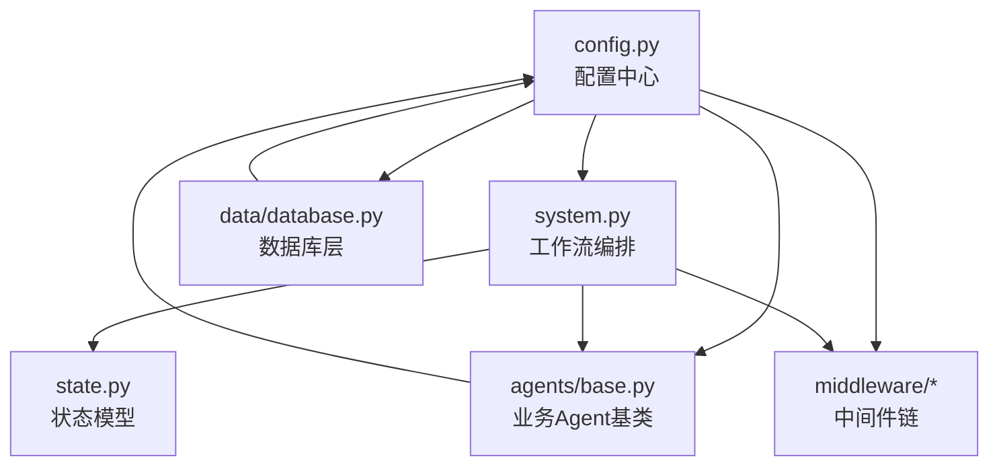
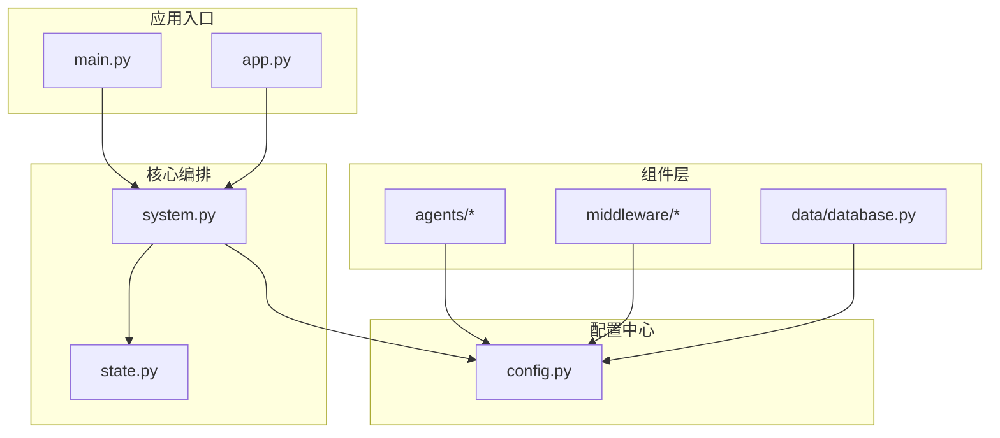
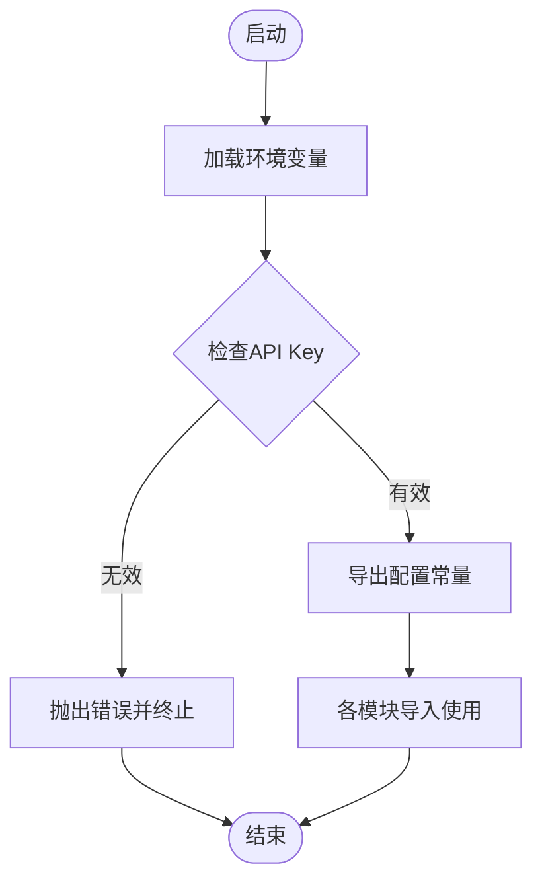
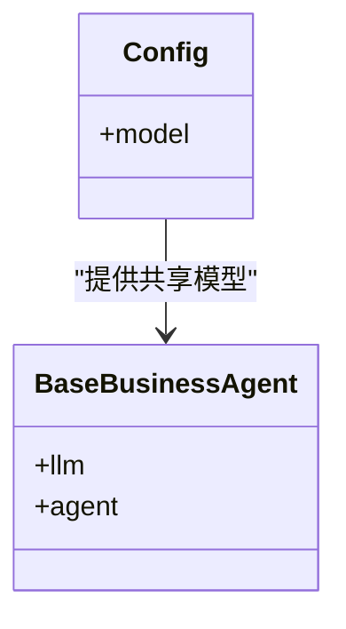
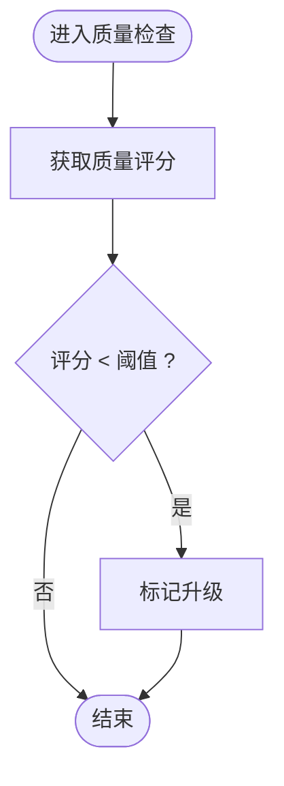
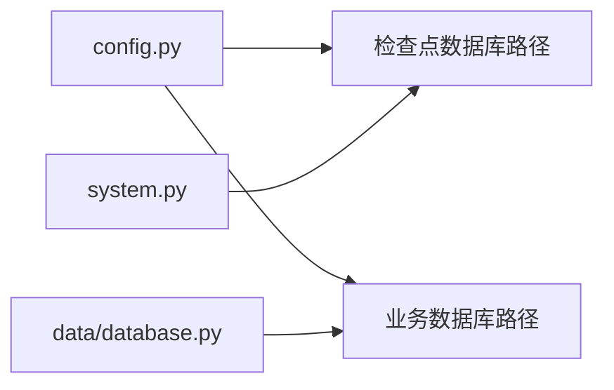
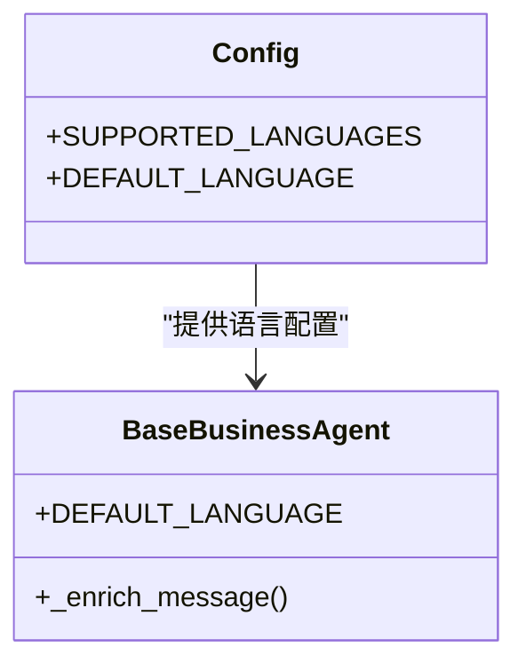
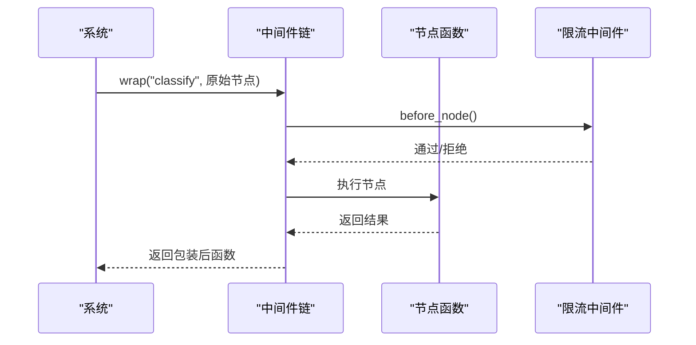
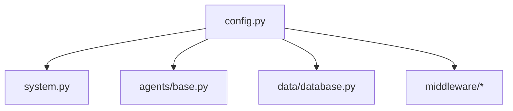

# 配置管理系统

<cite>
**本文档引用的文件**
- [config.py](file://config.py)
- [system.py](file://system.py)
- [state.py](file://state.py)
- [agents/base.py](file://agents/base.py)
- [data/database.py](file://data/database.py)
- [middleware/base.py](file://middleware/base.py)
- [middleware/rate_limiter_mw.py](file://middleware/rate_limiter_mw.py)
- [middleware/logging_mw.py](file://middleware/logging_mw.py)
- [main.py](file://main.py)
- [app.py](file://app.py)
- [requirements.txt](file://requirements.txt)
- [README.md](file://README.md)
</cite>

## 目录
1. [简介](#简介)
2. [项目结构](#项目结构)
3. [核心组件](#核心组件)
4. [架构总览](#架构总览)
5. [详细组件分析](#详细组件分析)
6. [依赖关系分析](#依赖关系分析)
7. [性能考虑](#性能考虑)
8. [故障排查指南](#故障排查指南)
9. [结论](#结论)
10. [附录](#附录)

## 简介
本文件系统性梳理该多智能体客服系统的配置管理中心，覆盖以下主题：
- 环境变量的组织与加载机制
- 配置项的分类管理（模型配置、业务阈值、持久化路径、多语言）
- 配置加载顺序与优先级规则
- 配置验证与默认值处理
- 配置热更新与运行时调整能力
- 不同环境下的配置差异与最佳实践
- 配置扩展与自定义配置项的开发指南
- 配置安全与敏感信息保护建议

## 项目结构
系统采用“配置中心 + 工作流编排 + 中间件 + 数据层”的分层设计。配置中心位于 config.py，被系统各模块按需导入，形成统一的配置来源。

图表来源
- [config.py:1-60](file://config.py#L1-L60)
- [system.py:23-31](file://system.py#L23-L31)
- [agents/base.py:19](file://agents/base.py#L19)
- [data/database.py:18](file://data/database.py#L18)
- [middleware/base.py:46-94](file://middleware/base.py#L46-L94)

章节来源
- [config.py:1-60](file://config.py#L1-L60)
- [system.py:23-31](file://system.py#L23-L31)
- [agents/base.py:19](file://agents/base.py#L19)
- [data/database.py:18](file://data/database.py#L18)
- [middleware/base.py:46-94](file://middleware/base.py#L46-L94)

## 核心组件
- 环境变量与API Key加载：通过环境变量注入与校验，确保外部服务凭据的安全与可用性。
- LLM模型初始化：集中创建共享模型实例，避免重复初始化带来的资源浪费。
- 业务阈值常量：意图置信度阈值与回复质量评分阈值，作为工作流决策的关键参数。
- 持久化路径：检查点数据库与业务数据库的路径配置，支持本地SQLite存储。
- 多语言配置：支持的语言列表与默认语言，用于个性化回复与手写提示。

章节来源
- [config.py:14-59](file://config.py#L14-L59)

## 架构总览
配置中心在系统中的位置如下：

图表来源
- [main.py:130-148](file://main.py#L130-L148)
- [app.py:16-21](file://app.py#L16-L21)
- [system.py:23-31](file://system.py#L23-L31)
- [config.py:1-60](file://config.py#L1-L60)
- [data/database.py:18](file://data/database.py#L18)
- [agents/base.py:19](file://agents/base.py#L19)
- [middleware/base.py:46-94](file://middleware/base.py#L46-L94)

## 详细组件分析

### 环境变量与API Key管理
- 加载机制：通过环境变量加载库读取项目根目录及其上级目录的环境文件，将键值注入系统环境。
- 校验策略：对关键API Key进行存在性与占位符校验，缺失或占位符将触发明确错误提示，防止误用。
- 作用范围：仅在配置模块内可见，其他模块通过导入常量使用，避免分散配置。

图表来源
- [config.py:16-26](file://config.py#L16-L26)

章节来源
- [config.py:16-26](file://config.py#L16-L26)

### LLM模型初始化与共享
- 初始化位置：在配置模块中集中创建共享模型实例，避免多处重复初始化。
- 使用方式：业务Agent基类通过导入共享模型，统一LLM调用入口。
- 性能影响：减少模型加载开销，提升系统整体响应效率。

图表来源
- [config.py:30-31](file://config.py#L30-L31)
- [agents/base.py:33-39](file://agents/base.py#L33-L39)

章节来源
- [config.py:30-31](file://config.py#L30-L31)
- [agents/base.py:33-39](file://agents/base.py#L33-L39)

### 业务阈值与决策控制
- 阈值定义：意图置信度阈值与回复质量评分阈值，用于决定是否升级或继续处理。
- 使用位置：工作流编排中作为条件路由与质量检查的依据。
- 影响范围：直接影响系统自动化程度与人工介入比例。

图表来源
- [system.py:142](file://system.py#L142)

章节来源
- [system.py:142](file://system.py#L142)

### 持久化路径与数据库配置
- 检查点数据库：用于LangGraph状态持久化，支持SQLite与内存回退。
- 业务数据库：用于产品、订单、FAQ等业务数据的ORM封装。
- 路径来源：统一从配置模块读取，便于在不同环境切换存储介质。

图表来源
- [config.py:44-51](file://config.py#L44-L51)
- [system.py:68-74](file://system.py#L68-L74)
- [data/database.py:87-88](file://data/database.py#L87-L88)

章节来源
- [config.py:44-51](file://config.py#L44-L51)
- [system.py:68-74](file://system.py#L68-L74)
- [data/database.py:87-88](file://data/database.py#L87-L88)

### 多语言配置与个性化提示
- 支持语言列表与默认语言：用于Agent回复语言选择与个性化提示。
- 画像增强：在Agent消息增强逻辑中，根据用户画像的语言偏好插入多语言指令。

图表来源
- [config.py:55-59](file://config.py#L55-L59)
- [agents/base.py:84-97](file://agents/base.py#L84-L97)

章节来源
- [config.py:55-59](file://config.py#L55-L59)
- [agents/base.py:84-97](file://agents/base.py#L84-L97)

### 中间件与配置集成
- 中间件链：日志、计时、异常处理、限流等横切关注点通过中间件链统一注入。
- 限流配置：令牌桶参数（速率、容量）可在中间件构造时传入，支持运行时调整。

图表来源
- [middleware/base.py:63-94](file://middleware/base.py#L63-L94)
- [middleware/rate_limiter_mw.py:68-77](file://middleware/rate_limiter_mw.py#L68-L77)

章节来源
- [middleware/base.py:63-94](file://middleware/base.py#L63-L94)
- [middleware/rate_limiter_mw.py:68-77](file://middleware/rate_limiter_mw.py#L68-L77)

## 依赖关系分析
- 配置中心依赖：系统编排、Agent基类、数据库层、中间件均依赖配置模块提供的常量与实例。
- 配置变更传播：修改配置中心常量会影响工作流路由、质量检查、语言提示等多处逻辑。
- 依赖可视化：

图表来源
- [system.py:23-31](file://system.py#L23-L31)
- [agents/base.py:19](file://agents/base.py#L19)
- [data/database.py:18](file://data/database.py#L18)
- [middleware/base.py:46-94](file://middleware/base.py#L46-L94)

章节来源
- [system.py:23-31](file://system.py#L23-L31)
- [agents/base.py:19](file://agents/base.py#L19)
- [data/database.py:18](file://data/database.py#L18)
- [middleware/base.py:46-94](file://middleware/base.py#L46-L94)

## 性能考虑
- 模型共享：集中初始化共享模型，避免重复创建带来的CPU与内存开销。
- 限流策略：通过令牌桶限流中间件控制LLM调用频率，防止API限速与系统过载。
- 持久化回退：SQLite初始化失败时自动回退到内存检查点，保障系统可用性。

章节来源
- [config.py:30-31](file://config.py#L30-L31)
- [middleware/rate_limiter_mw.py:24-58](file://middleware/rate_limiter_mw.py#L24-L58)
- [system.py:68-74](file://system.py#L68-L74)

## 故障排查指南
- API Key缺失或占位符：若环境变量未正确设置，系统会在启动阶段抛出明确错误，需检查环境文件与注入流程。
- SQLite初始化失败：当数据库连接异常时，系统自动回退到内存检查点，可通过日志定位具体错误并修复数据库路径或权限。
- 限流超时：当令牌桶无法在规定时间内获取令牌时，会抛出超时错误，建议降低并发或调整限流参数。

章节来源
- [config.py:22-26](file://config.py#L22-L26)
- [system.py:68-74](file://system.py#L68-L74)
- [middleware/rate_limiter_mw.py:75-77](file://middleware/rate_limiter_mw.py#L75-L77)

## 结论
该配置管理系统通过集中化的配置中心实现了环境变量、模型、阈值、持久化路径与多语言等关键配置的统一管理。系统在启动阶段完成配置加载与校验，随后在编排层、Agent层、中间件层与数据层按需使用。通过令牌桶限流与持久化回退机制，系统在性能与稳定性方面具备良好表现。建议在生产环境中进一步完善配置热更新与安全加固策略。

## 附录

### 配置加载顺序与优先级规则
- 环境变量加载优先于模块内默认值，确保外部注入优先。
- 配置模块在首次导入时完成初始化，后续模块导入直接使用已初始化的常量。
- 业务阈值与路径配置在系统启动时生效，中间件参数可在实例化时调整。

章节来源
- [config.py:16-26](file://config.py#L16-L26)
- [config.py:30-31](file://config.py#L30-L31)
- [config.py:44-51](file://config.py#L44-L51)
- [middleware/rate_limiter_mw.py:68](file://middleware/rate_limiter_mw.py#L68)

### 配置验证与默认值处理机制
- API Key校验：存在性与占位符双重校验，缺失或占位符将触发错误。
- 默认语言与支持语言：通过配置模块提供默认值，Agent层在消息增强时使用。
- 数据库路径：通过配置模块统一提供，数据库层按路径创建引擎。

章节来源
- [config.py:22-26](file://config.py#L22-L26)
- [config.py:55-59](file://config.py#L55-L59)
- [data/database.py:87-88](file://data/database.py#L87-L88)

### 配置热更新与运行时调整
- 当前能力：配置中心在启动阶段一次性加载，模块导入后常量不可变。
- 建议方案：引入配置监听与热重载机制（如文件监控或远程配置中心），在受控范围内支持运行时调整。

章节来源
- [config.py:16-26](file://config.py#L16-L26)
- [system.py:23-31](file://system.py#L23-L31)

### 不同环境下的配置差异与最佳实践
- 开发环境：使用内存检查点与较小的限流参数，便于快速迭代。
- 生产环境：启用SQLite持久化与合理的限流参数，确保稳定性与成本控制。
- 多语言部署：根据用户画像动态选择语言，必要时在配置中增加语言白名单与默认值。

章节来源
- [system.py:68-74](file://system.py#L68-L74)
- [middleware/rate_limiter_mw.py:68](file://middleware/rate_limiter_mw.py#L68)
- [agents/base.py:84-97](file://agents/base.py#L84-L97)

### 配置扩展与自定义配置项开发指南
- 新增配置项：在配置模块中定义常量，按需加入环境变量校验与默认值处理。
- 模块集成：在需要使用的模块中导入新常量，避免在多处重复定义。
- 中间件参数：通过中间件构造函数传参，支持运行时调整（如限流速率）。

章节来源
- [config.py:14-59](file://config.py#L14-L59)
- [middleware/rate_limiter_mw.py:68](file://middleware/rate_limiter_mw.py#L68)

### 配置安全与敏感信息保护
- 环境变量隔离：API Key等敏感信息通过环境变量注入，避免硬编码与版本库泄露。
- 占位符校验：在启动阶段校验占位符，防止误用默认值导致服务不可用。
- 日志脱敏：中间件日志记录中对敏感字段进行截断处理，避免泄露。

章节来源
- [config.py:22-26](file://config.py#L22-L26)
- [middleware/logging_mw.py:108-111](file://middleware/logging_mw.py#L108-L111)