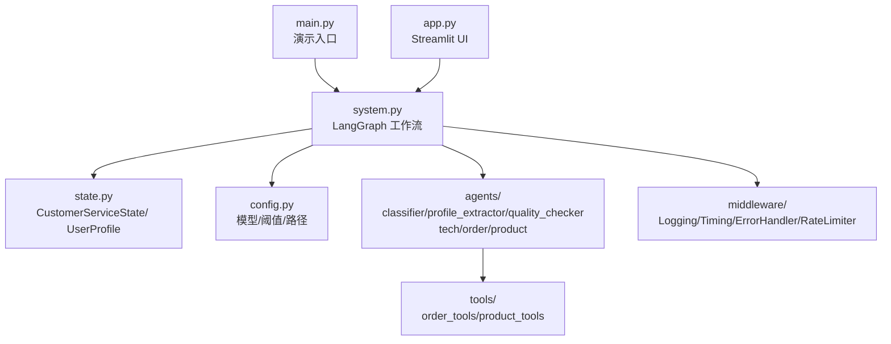
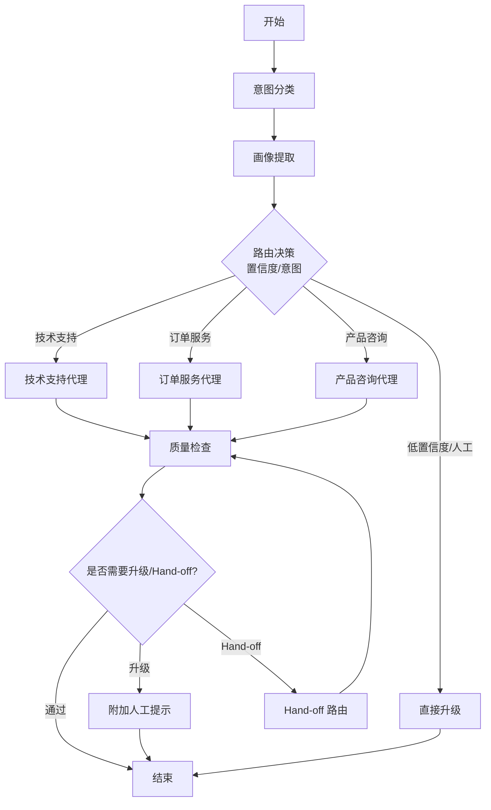
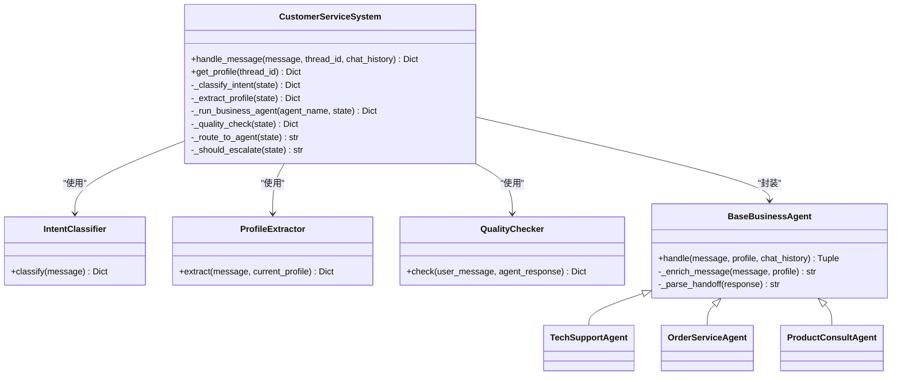
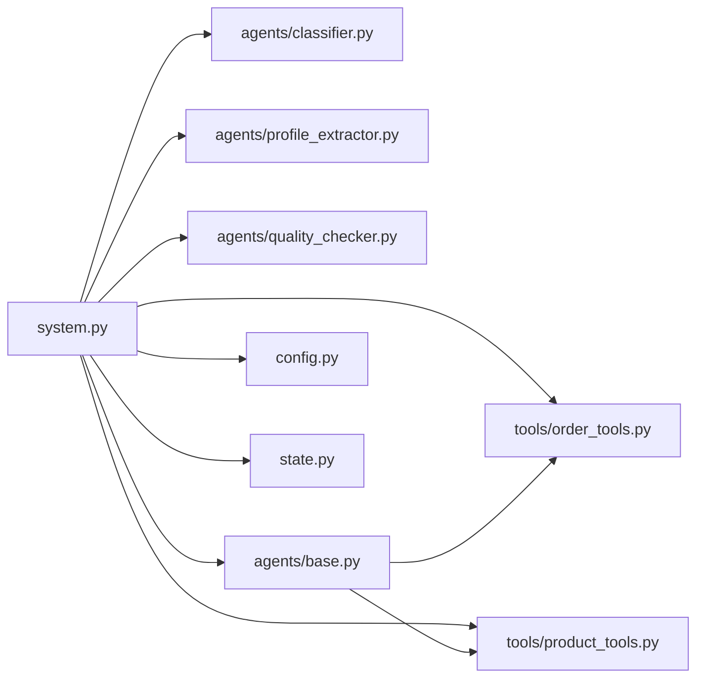

# 项目概述

<cite>
**本文引用的文件**
- [README.md](file://README.md)
- [main.py](file://main.py)
- [app.py](file://app.py)
- [system.py](file://system.py)
- [config.py](file://config.py)
- [state.py](file://state.py)
- [agents/base.py](file://agents/base.py)
- [agents/classifier.py](file://agents/classifier.py)
- [agents/profile_extractor.py](file://agents/profile_extractor.py)
- [agents/quality_checker.py](file://agents/quality_checker.py)
- [agents/tech_support.py](file://agents/tech_support.py)
- [agents/order_service.py](file://agents/order_service.py)
- [agents/product_consult.py](file://agents/product_consult.py)
- [tools/order_tools.py](file://tools/order_tools.py)
- [tools/product_tools.py](file://tools/product_tools.py)
</cite>

## 目录
1. [简介](#简介)
2. [项目结构](#项目结构)
3. [核心组件](#核心组件)
4. [架构总览](#架构总览)
5. [详细组件分析](#详细组件分析)
6. [依赖分析](#依赖分析)
7. [性能考虑](#性能考虑)
8. [故障排查指南](#故障排查指南)
9. [结论](#结论)
10. [附录](#附录)

## 简介
本项目是一个基于 LangChain 1.0 + LangGraph 的多智能体智能客服系统，具备以下核心目标与价值主张：
- 通过意图分类与动态路由，将用户问题精准分配至相应业务智能体（技术支持、订单服务、产品咨询），减少误判与转人工率。
- 采用 LCEL 管道与 create_agent 模式相结合的方式，既满足一次性结构化解析（如意图分类、画像提取、质量检查），也满足需要工具调用循环的复杂业务场景。
- 借助 LangGraph Checkpointer 实现跨轮次用户画像累积，使系统在多轮对话中持续学习用户偏好、预算、订单与兴趣，显著提升个性化服务能力。
- 通过质量检查层对回复进行自评，低分自动升级到人工，保障服务质量与用户体验。
- 提供命令行演示与 Streamlit Web UI，便于快速验证与产品化集成。

该系统在技术上强调“状态驱动的工作流编排”，通过统一的状态结构在节点间传递数据，配合中间件链实现可观测性与稳定性。

章节来源
- [README.md:1-161](file://README.md#L1-L161)

## 项目结构
项目采用按“职责分层 + 功能模块”组织的结构，便于扩展与维护：
- 根目录入口：main.py（演示）、app.py（Web UI）
- 核心编排：system.py（LangGraph 工作流）
- 状态定义：state.py（TypedDict 结构）
- 配置中心：config.py（模型、阈值、路径）
- 代理层：agents/（意图分类、画像提取、业务代理、质量检查）
- 工具层：tools/（订单与产品相关工具）
- 数据与种子：data/（Mock 数据与种子脚本）
- 中间件：middleware/（日志、计时、异常、限流）
- 工具与追踪：utils/（JSON 容错解析、调用链追踪）

图表来源
- [main.py:1-148](file://main.py#L1-L148)
- [app.py:1-177](file://app.py#L1-L177)
- [system.py:1-305](file://system.py#L1-L305)
- [state.py:1-58](file://state.py#L1-L58)
- [config.py:1-60](file://config.py#L1-L60)
- [agents/classifier.py:1-63](file://agents/classifier.py#L1-L63)
- [agents/profile_extractor.py:1-92](file://agents/profile_extractor.py#L1-L92)
- [agents/quality_checker.py:1-63](file://agents/quality_checker.py#L1-L63)
- [agents/tech_support.py:1-29](file://agents/tech_support.py#L1-L29)
- [agents/order_service.py:1-29](file://agents/order_service.py#L1-L29)
- [agents/product_consult.py:1-30](file://agents/product_consult.py#L1-L30)
- [tools/order_tools.py:1-50](file://tools/order_tools.py#L1-L50)
- [tools/product_tools.py:1-78](file://tools/product_tools.py#L1-L78)

章节来源
- [README.md:81-108](file://README.md#L81-L108)
- [main.py:1-148](file://main.py#L1-L148)
- [app.py:1-177](file://app.py#L1-L177)
- [system.py:1-305](file://system.py#L1-L305)

## 核心组件
- 系统编排器（CustomerServiceSystem）
  - 基于 LangGraph 构建状态化工作流，节点包括：意图分类、画像提取、业务代理（技术支持/订单服务/产品咨询）、质量检查、升级与 hand-off 路由。
  - 通过 Checkpointer（优先 SQLite，失败回退内存）按 thread_id 持久化状态，实现跨轮次用户画像累积。
  - 中间件链串联日志、计时、异常捕获与限流，保障可观测性与稳定性。
- 代理层
  - 意图分类器：LCEL 管道，输出意图与置信度。
  - 画像提取器：LCEL 管道，抽取预算、偏好、订单号、兴趣产品、语言等，与旧画像合并。
  - 业务代理（BaseBusinessAgent 子类）：封装 create_agent，注入 user_profile，支持工具调用与 hand-off。
  - 质量检查器：LCEL 管道，对回复进行相关性、完整性、专业性、有用性评分，触发升级。
- 工具层
  - 订单工具：查询订单、物流跟踪。
  - 产品工具：产品检索、按预算推荐、FAQ 查询。
- 配置与状态
  - 配置中心：加载模型、阈值（最小置信度、最小质量分）、持久化路径、语言列表。
  - 状态结构：TypedDict 定义请求级字段（每轮重置）与会话级字段（跨轮累积）。

章节来源
- [system.py:34-305](file://system.py#L34-L305)
- [agents/base.py:23-123](file://agents/base.py#L23-L123)
- [agents/classifier.py:19-63](file://agents/classifier.py#L19-L63)
- [agents/profile_extractor.py:17-92](file://agents/profile_extractor.py#L17-L92)
- [agents/quality_checker.py:16-63](file://agents/quality_checker.py#L16-L63)
- [tools/order_tools.py:15-50](file://tools/order_tools.py#L15-L50)
- [tools/product_tools.py:14-78](file://tools/product_tools.py#L14-L78)
- [config.py:14-60](file://config.py#L14-L60)
- [state.py:14-58](file://state.py#L14-L58)

## 架构总览
系统采用“状态驱动 + 条件路由”的工作流架构，核心流程如下：
- 输入消息经意图分类与画像提取后，依据置信度与意图动态路由到对应业务代理。
- 业务代理结合 user_profile 与工具调用生成回复，并可能触发 hand-off。
- 质量检查对回复评分，低分或需要 hand-off 的场景进入升级或再次路由。
- 通过 Checkpointer 按 thread_id 保存状态，实现跨轮次画像累积。

图表来源
- [system.py:159-246](file://system.py#L159-L246)
- [README.md:19-36](file://README.md#L19-L36)

章节来源
- [README.md:19-36](file://README.md#L19-L36)
- [system.py:79-156](file://system.py#L79-L156)

## 详细组件分析

### 系统编排器（CustomerServiceSystem）
- 节点函数
  - 意图分类：更新 intent 与 confidence。
  - 画像提取：合并 user_profile，支持跨轮累积。
  - 业务代理执行：封装工具调用循环，支持 hand-off 标记解析与计数。
  - 质量检查：计算总分，判定是否升级。
  - 升级处理：附加人工提示文本。
- 路由策略
  - 分类后路由：低置信度或未知意图直接升级。
  - 质量检查后路由：存在 hand-off 且次数未超限则转发；否则按需升级或结束。
  - hand-off 路由：清空标记后执行目标代理。
- 编排与持久化
  - 使用 LangGraph 构建有向无环图，添加条件边与循环（hand-off → 质量检查）。
  - 通过 checkpointer 按 thread_id 保存/恢复状态，实现跨轮次 user_profile 累积。
- 对外接口
  - handle_message：按 thread_id 重置请求级字段，调用 graph.invoke 返回标准化结果。
  - get_profile：查询当前累积画像。

图表来源
- [system.py:34-305](file://system.py#L34-L305)
- [agents/base.py:23-123](file://agents/base.py#L23-L123)
- [agents/tech_support.py:11-29](file://agents/tech_support.py#L11-L29)
- [agents/order_service.py:11-29](file://agents/order_service.py#L11-L29)
- [agents/product_consult.py:11-30](file://agents/product_consult.py#L11-L30)
- [agents/classifier.py:19-63](file://agents/classifier.py#L19-L63)
- [agents/profile_extractor.py:17-92](file://agents/profile_extractor.py#L17-L92)
- [agents/quality_checker.py:16-63](file://agents/quality_checker.py#L16-L63)

章节来源
- [system.py:34-305](file://system.py#L34-L305)

### 意图分类（IntentClassifier）
- 使用 LCEL 管道，系统提示限定可选意图集合，输出 JSON 包含 intent、confidence、reason、language。
- 解析失败时返回兜底结果（escalate）。

章节来源
- [agents/classifier.py:19-63](file://agents/classifier.py#L19-L63)

### 画像提取（ProfileExtractor）
- 从当前消息抽取预算、偏好、订单号、兴趣产品、语言等字段，与旧画像合并。
- 合并策略：标量字段（预算、语言）非空覆盖；列表字段（偏好、订单号、兴趣产品）追加去重。

章节来源
- [agents/profile_extractor.py:17-92](file://agents/profile_extractor.py#L17-L92)

### 业务代理（BaseBusinessAgent 及子类）
- 统一封装 create_agent，注入 tools 与 system_prompt，结合 user_profile 生成回复。
- 支持 hand-off：回复中包含 [HANDOFF:agent_name] 标记时，系统将请求转发给目标代理，最多 MAX_HANDOFFS 次。
- 子类（技术支持/订单服务/产品咨询）分别声明工具集与系统提示，聚焦不同业务域。

章节来源
- [agents/base.py:23-123](file://agents/base.py#L23-L123)
- [agents/tech_support.py:11-29](file://agents/tech_support.py#L11-L29)
- [agents/order_service.py:11-29](file://agents/order_service.py#L11-L29)
- [agents/product_consult.py:11-30](file://agents/product_consult.py#L11-L30)

### 质量检查（QualityChecker）
- 评估维度：相关性、完整性、专业性、有用性（满分 100 分）。
- 输出 JSON 包含 total_score、needs_escalation、reason；低于阈值触发升级。

章节来源
- [agents/quality_checker.py:16-63](file://agents/quality_checker.py#L16-L63)

### 工具（订单与产品）
- 订单工具：query_order、track_shipping，支持兜底物流信息。
- 产品工具：search_product、get_product_recommendations、search_faq，提供检索与推荐能力。

章节来源
- [tools/order_tools.py:15-50](file://tools/order_tools.py#L15-L50)
- [tools/product_tools.py:14-78](file://tools/product_tools.py#L14-L78)

### 状态与配置
- 状态结构：CustomerServiceState 定义请求级与会话级字段；UserProfile 定义画像字段。
- 配置中心：加载模型、阈值、持久化路径、语言列表；提供环境变量校验与错误提示。

章节来源
- [state.py:14-58](file://state.py#L14-L58)
- [config.py:14-60](file://config.py#L14-L60)

## 依赖分析
- 组件耦合
  - system.py 依赖 agents/*、tools/*、config、state、middleware，形成编排层。
  - agents/* 依赖 config.model 与 state，部分依赖 tools/*。
  - tools/* 依赖 data.database（Mock 数据层）。
- 外部依赖
  - LangChain 1.0（LLM 编排、LCEL、create_agent）
  - LangGraph（工作流编排、状态管理、Checkpointer）
  - DeepSeek（LLM 后端）
- 潜在风险
  - SQLite 持久化失败时回退内存，需关注生产环境可靠性。
  - hand-off 循环防护（MAX_HANDOFFS）避免无限转发。

图表来源
- [system.py:17-31](file://system.py#L17-L31)
- [agents/base.py:19-39](file://agents/base.py#L19-L39)
- [tools/order_tools.py:12-12](file://tools/order_tools.py#L12-L12)
- [tools/product_tools.py:7-11](file://tools/product_tools.py#L7-L11)
- [config.py:31-31](file://config.py#L31-L31)
- [state.py:46-57](file://state.py#L46-L57)

章节来源
- [system.py:17-31](file://system.py#L17-L31)

## 性能考虑
- 模型实例复用：config.py 中集中初始化模型实例，避免重复创建带来的开销。
- 节点计时与中间件：TimingMiddleware 与 MiddlewareChain 提供节点耗时统计，便于定位瓶颈。
- 手动限流：RateLimiterMiddleware 控制并发与速率，避免 LLM 后端压力过大。
- 持久化选择：优先 SQLite，失败回退内存，兼顾可靠性与性能。
- 工具调用优化：工具返回结构化 JSON，减少后处理成本；兜底策略确保工具不可用时仍可回复。

章节来源
- [config.py:30-31](file://config.py#L30-L31)
- [system.py:58-64](file://system.py#L58-L64)

## 故障排查指南
- 环境变量缺失
  - 现象：启动时报错，提示未设置 DEEPSEEK_API_KEY。
  - 处理：复制 .env.example 为 .env，填写有效 API Key。
- SQLite 持久化失败
  - 现象：控制台提示回退到 InMemorySaver。
  - 处理：检查 data/checkpoints.db 路径权限与磁盘空间；生产环境建议使用稳定 SQLite 或外部存储。
- 质量检查触发升级
  - 现象：回复质量评分低于阈值，系统附加人工提示。
  - 处理：优化业务代理 system_prompt 与工具使用；必要时调整 MIN_QUALITY_SCORE。
- hand-off 循环
  - 现象：多次 hand-off 后仍未解决。
  - 处理：确认 VALID_HANDOFF_TARGETS 与 MAX_HANDOFFS；检查代理回复中 HANDOFF 标记格式。
- Web UI 会话画像不更新
  - 现象：侧边栏画像未随对话变化。
  - 处理：确认 app.py 中 thread_id 一致；刷新页面后重新发起对话。

章节来源
- [config.py:20-27](file://config.py#L20-L27)
- [system.py:66-74](file://system.py#L66-L74)
- [system.py:171-183](file://system.py#L171-L183)
- [agents/base.py:101-113](file://agents/base.py#L101-L113)
- [app.py:23-31](file://app.py#L23-L31)

## 结论
本项目以 LangChain 1.0 + LangGraph 为核心，构建了“意图分类 → 画像提取 → 动态路由 → 工具调用 → 质量检查 → 升级/结束”的闭环工作流。通过统一状态结构与中间件链，系统实现了跨轮次用户画像累积、条件路由与 hand-off、以及可观测性与稳定性保障。对于初学者，系统提供了清晰的演示与 UI；对于开发者，系统具备良好的扩展性（代理间协作、真实数据库对接、持久化 Checkpointer、Web UI 等）与模块化设计，便于二次开发与企业级落地。

## 附录
- 快速开始
  - 克隆仓库、安装依赖、配置 .env、运行 main.py 或 streamlit run app.py。
- 多轮对话示例
  - 使用相同 thread_id 进行连续对话，观察 user_profile 累积效果。
- 未来扩展方向
  - 代理间协作（Hand-off/Supervisor）、多语言支持、真实数据库对接、持久化 Checkpointer、Web UI。

章节来源
- [README.md:47-79](file://README.md#L47-L79)
- [README.md:134-148](file://README.md#L134-L148)
- [README.md:150-156](file://README.md#L150-L156)