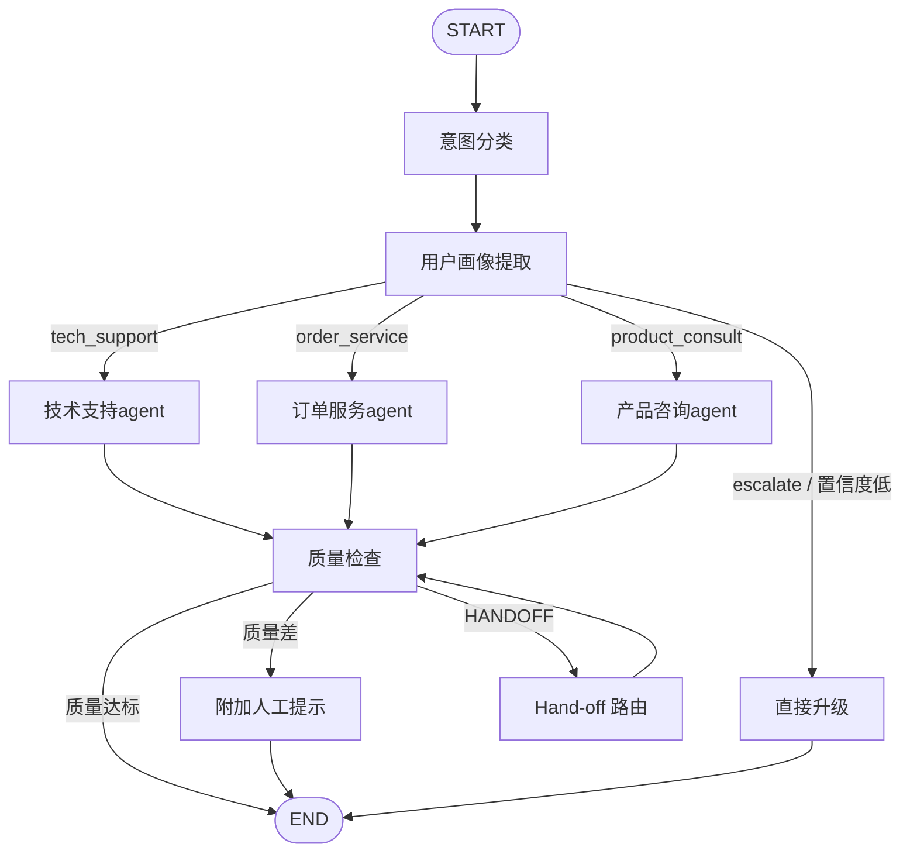

# 多智能体智能客服系统

基于 **LangChain 1.0 + LangGraph** 的多agent智能客服系统，支持意图分类、动态路由、工具调用、质量检查和**跨轮次用户画像累积**。


---

## 核心特性

- 🧠 **意图分类**：自动识别用户意图（技术支持 / 订单服务 / 产品咨询 / 人工升级）
- 🔧 **多代理协作**：每个业务域由独立 Agent 处理，各自配备专属工具
- 👤 **用户画像累积**：通过 LangGraph Checkpointer 实现跨轮次的偏好、预算、订单记忆
- ✅ **质量检查层**：LLM 自评回复质量，低分自动升级到人工
- 🔀 **条件路由**：基于置信度和分类结果动态决定工作流路径
- 🔄 **Agent Hand-off**：业务代理间可互相移交任务（`[HANDOFF:target]` 标记）
- 🌐 **多语言支持**：自动检测用户语言，切换回复语言（zh/en/ja/ko）
- 🛡️ **中间件管理**：日志、计时、异常捕获、令牌桶限流四层中间件链
- 💾 **持久化存储**：SqliteSaver 检查点 + SQLAlchemy 业务数据库
- 📊 **可观测性**：调用链追踪（Trace），记录每个节点执行时间与状态
- 🖥️ **Web UI**：Streamlit 聊天界面，支持会话管理、画像展示、Trace 查看

## 架构图



## 技术栈

| 组件 | 用途 |
|---|---|
| **LangChain 1.0** | LLM 编排、LCEL 管道、`create_agent` |
| **LangGraph** | 工作流编排、状态管理、条件路由 |
| **LangGraph Checkpointer** | 跨轮次状态持久化（SqliteSaver） |
| **SQLAlchemy** | ORM 业务数据库（订单/产品/FAQ） |
| **Streamlit** | Web 聊天界面 |
| **DeepSeek** | LLM 后端（国内低成本方案） |

## 快速开始

### 1. 克隆项目

```bash
git clone https://github.com/Yijtu/multi-agent-customer-service.git
cd multi-agent-customer-service
```

### 2. 安装依赖

```bash
# 建议创建虚拟环境
python -m venv venv
source venv/bin/activate         # Linux/Mac
venv\Scripts\activate            # Windows

pip install -r requirements.txt
```

### 3. 配置环境变量

```bash
cp .env.example .env
# 编辑 .env，填入你的 DeepSeek API Key
# 获取地址：https://console.deepseek.com/keys
```

### 4. 运行

```bash
# 命令行模式
python main.py

# Web UI 模式
streamlit run app.py
```

## 项目结构

```
multi-agent-customer-service
├── main.py                  # 入口：演示场景 + 交互循环
├── app.py                   # Streamlit Web UI
├── system.py                # LangGraph 工作流编排 + 中间件集成
├── config.py                # 模型初始化 + 阈值常量 + 数据库路径
├── state.py                 # CustomerServiceState / UserProfile 定义
│
├── agents/                  # 代理层
│   ├── base.py              # 业务代理基类（Hand-off + 多语言）
│   ├── classifier.py        # 意图分类（LCEL 模式）
│   ├── profile_extractor.py # 用户画像提取
│   ├── tech_support.py      # 技术支持代理
│   ├── order_service.py     # 订单服务代理
│   ├── product_consult.py   # 产品咨询代理
│   └── quality_checker.py   # 回复质量检查（多语言评估）
│
├── middleware/               # 中间件层
│   ├── base.py              # Middleware 抽象基类 + MiddlewareChain
│   ├── logging_mw.py        # 结构化日志 + Trace 写入
│   ├── timing_mw.py         # 节点耗时统计
│   ├── error_handler_mw.py  # 异常捕获与记录
│   └── rate_limiter_mw.py   # 令牌桶限流
│
├── tools/                   # LangChain @tool 函数
│   ├── order_tools.py       # query_order, track_shipping
│   └── product_tools.py     # search_product, recommendations, FAQ
│
├── data/
│   ├── mock_data.py         # Mock 数据（保留兼容）
│   ├── database.py          # SQLAlchemy ORM 数据库层
│   └── seed.py              # 数据库种子脚本
│
└── utils/
    ├── json_parser.py       # 容错 JSON 解析
    └── tracer.py            # 调用链追踪工具
```

## 核心设计

### State 分层

- **请求级字段**：`user_message` / `intent` / `agent_response` / `quality_score` —— 每轮重置
- **会话级字段**：`user_profile` —— 通过 Checkpointer 跨轮次累积

### 两种代理模式

| 模式 | 使用场景 | 示例 |
|---|---|---|
| **LCEL 管道** (`prompt \| llm \| parser`) | 一次性的转换 | `IntentClassifier`, `QualityChecker`, `ProfileExtractor` |
| **`create_agent`** | 需要工具调用循环 | `TechSupportAgent`, `OrderServiceAgent`, `ProductConsultAgent` |

### 用户画像累积

同一 `thread_id` 下的多轮对话会自动合并画像：

```
第1轮 "我预算1500"        → profile: {budget: 1500}
第2轮 "喜欢降噪"          → profile: {budget: 1500, preferences: ['降噪']}
第3轮 "推荐智能手表"      → Agent 知道预算和偏好，直接按 1500 推荐
```

## 多轮对话示例

```python
from system import CustomerServiceSystem

system = CustomerServiceSystem()

# 使用相同 thread_id 会累积画像
system.handle_message("我预算1500左右", thread_id="user_A")
system.handle_message("喜欢降噪和长续航", thread_id="user_A")
result = system.handle_message("推荐几个智能手表", thread_id="user_A")

print(result["response"])  # 产品代理会基于预算和偏好推荐
print(system.get_profile("user_A"))  # 查看累积的画像
```

## 已完成的优化

1. **中间件管理层**：新增 `middleware/` 模块，实现 before_node / after_node / on_error 三阶段钩子，包含结构化日志、耗时统计、异常捕获、令牌桶限流四个中间件
2. **持久化 Checkpointer**：从 InMemorySaver 升级为 SqliteSaver，会话状态跨进程持久化
3. **真实数据库对接**：新增 `data/database.py`（SQLAlchemy ORM）+ `data/seed.py` 种子脚本，工具层从 mock_data 切换到 SQLite 数据库查询
4. **Agent Hand-off 协作**：业务代理回复中支持 `[HANDOFF:target]` 标记，系统自动将请求转发给目标代理（设有最大次数防止循环）
5. **多语言支持**：意图分类自动检测用户语言，画像中记录语言偏好，业务代理按用户语言回复
6. **Streamlit Web UI**：新增 `app.py`，提供聊天界面 + 侧边栏（会话管理、用户画像、调用链追踪）
7. **可观测性增强**：新增 `utils/tracer.py`，日志中间件自动写入 Trace，UI 中可展开查看每个节点的执行时间与状态

## 未来可扩展方向

- [✔] 代理间协作（Hand-off / Supervisor 模式）
- [✔] 多语言支持（根据用户语言切换回复）
- [✔] 真实数据库对接（替换 `data/mock_data.py`）
- [✔] 持久化 Checkpointer（SqliteSaver / PostgresSaver）
- [✔] Web UI（Streamlit / Gradio）
- [ ] 单元测试 & 集成测试覆盖
- [ ] 流式输出（Streaming）
- [ ] Supervisor 模式（中心调度代理）
- [ ] PostgresSaver 生产级持久化

## License

MIT
